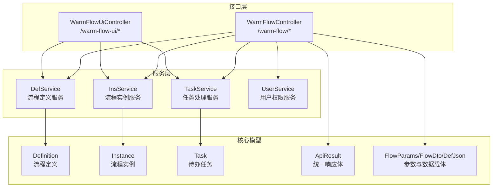
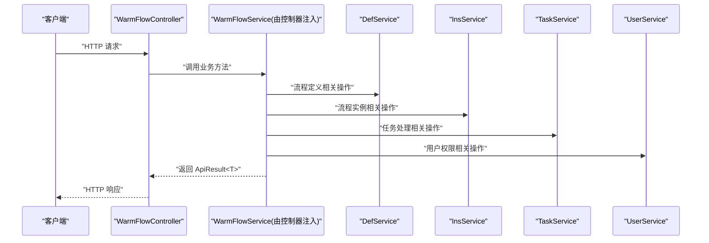
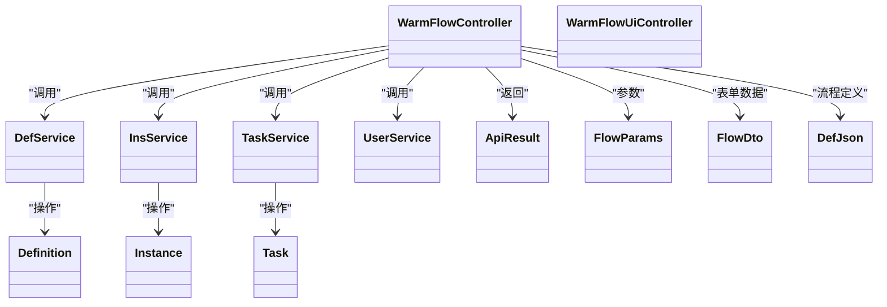

# API 接口文档

<cite>
**本文引用的文件**
- [WarmFlowController.java](file://warm-flow-plugin/warm-flow-plugin-ui/warm-flow-plugin-ui-sb-web/src/main/java/org/dromara/warm/flow/ui/controller/WarmFlowController.java)
- [WarmFlowUiController.java](file://warm-flow-plugin/warm-flow-plugin-ui/warm-flow-plugin-ui-sb-web/src/main/java/org/dromara/warm/flow/ui/controller/WarmFlowUiController.java)
- [DefService.java](file://warm-flow-core/src/main/java/org/dromara/warm/flow/core/service/DefService.java)
- [InsService.java](file://warm-flow-core/src/main/java/org/dromara/warm/flow/core/service/InsService.java)
- [TaskService.java](file://warm-flow-core/src/main/java/org/dromara/warm/flow/core/service/TaskService.java)
- [UserService.java](file://warm-flow-core/src/main/java/org/dromara/warm/flow/core/service/UserService.java)
- [Definition.java](file://warm-flow-core/src/main/java/org/dromara/warm/flow/core/entity/Definition.java)
- [Instance.java](file://warm-flow-core/src/main/java/org/dromara/warm/flow/core/entity/Instance.java)
- [Task.java](file://warm-flow-core/src/main/java/org/dromara/warm/flow/core/entity/Task.java)
- [ApiResult.java](file://warm-flow-core/src/main/java/org/dromara/warm/flow/core/dto/ApiResult.java)
- [FlowParams.java](file://warm-flow-core/src/main/java/org/dromara/warm/flow/core/dto/FlowParams.java)
- [FlowDto.java](file://warm-flow-core/src/main/java/org/dromara/warm/flow/core/dto/FlowDto.java)
- [DefJson.java](file://warm-flow-core/src/main/java/org/dromara/warm/flow/core/dto/DefJson.java)
</cite>

## 目录
1. [简介](#简介)
2. [项目结构](#项目结构)
3. [核心组件](#核心组件)
4. [架构总览](#架构总览)
5. [详细组件分析](#详细组件分析)
6. [依赖分析](#依赖分析)
7. [性能考虑](#性能考虑)
8. [故障排查指南](#故障排查指南)
9. [结论](#结论)
10. [附录](#附录)

## 简介
本文件为 Warm-Flow API 接口的完整技术文档，覆盖流程定义、任务处理、实例管理、用户管理等核心能力。文档从接口规范、请求/响应格式、错误码、使用示例与注意事项等方面进行系统化说明，帮助开发者快速集成与使用。

## 项目结构
Warm-Flow 采用模块化分层设计：
- warm-flow-core：核心领域模型、服务接口与通用 DTO
- warm-flow-plugin-ui：对外暴露的 Web 控制器，统一在 /warm-flow 与 /warm-flow-ui 下提供 REST 接口
- warm-flow-ui：前端可视化设计器资源（非接口实现）

图表来源
- [WarmFlowController.java:38-216](file://warm-flow-plugin/warm-flow-plugin-ui/warm-flow-plugin-ui-sb-web/src/main/java/org/dromara/warm/flow/ui/controller/WarmFlowController.java#L38-L216)
- [WarmFlowUiController.java:30-44](file://warm-flow-plugin/warm-flow-plugin-ui/warm-flow-plugin-ui-sb-web/src/main/java/org/dromara/warm/flow/ui/controller/WarmFlowUiController.java#L30-L44)
- [DefService.java:34-209](file://warm-flow-core/src/main/java/org/dromara/warm/flow/core/service/DefService.java#L34-L209)
- [InsService.java:30-93](file://warm-flow-core/src/main/java/org/dromara/warm/flow/core/service/InsService.java#L30-L93)
- [TaskService.java:36-533](file://warm-flow-core/src/main/java/org/dromara/warm/flow/core/service/TaskService.java#L36-L533)
- [UserService.java:30-165](file://warm-flow-core/src/main/java/org/dromara/warm/flow/core/service/UserService.java#L30-L165)

章节来源
- [WarmFlowController.java:38-216](file://warm-flow-plugin/warm-flow-plugin-ui/warm-flow-plugin-ui-sb-web/src/main/java/org/dromara/warm/flow/ui/controller/WarmFlowController.java#L38-L216)
- [WarmFlowUiController.java:30-44](file://warm-flow-plugin/warm-flow-plugin-ui/warm-flow-plugin-ui-sb-web/src/main/java/org/dromara/warm/flow/ui/controller/WarmFlowUiController.java#L30-L44)

## 核心组件
- 统一响应体：ApiResult，提供 SUCCESS/FAIL 状态码与消息封装
- 参数载体：FlowParams（流程参数）、FlowDto（表单数据）、DefJson（流程定义 JSON）
- 领域模型：Definition（流程定义）、Instance（流程实例）、Task（待办任务）
- 服务接口：DefService（流程定义）、InsService（流程实例）、TaskService（任务处理）、UserService（用户权限）

章节来源
- [ApiResult.java:30-96](file://warm-flow-core/src/main/java/org/dromara/warm/flow/core/dto/ApiResult.java#L30-L96)
- [FlowParams.java:33-335](file://warm-flow-core/src/main/java/org/dromara/warm/flow/core/dto/FlowParams.java#L33-L335)
- [FlowDto.java:29-53](file://warm-flow-core/src/main/java/org/dromara/warm/flow/core/dto/FlowDto.java#L29-L53)
- [DefJson.java:40-291](file://warm-flow-core/src/main/java/org/dromara/warm/flow/core/dto/DefJson.java#L40-L291)
- [Definition.java:29-195](file://warm-flow-core/src/main/java/org/dromara/warm/flow/core/entity/Definition.java#L29-L195)
- [Instance.java:29-165](file://warm-flow-core/src/main/java/org/dromara/warm/flow/core/entity/Instance.java#L29-L165)
- [Task.java:27-135](file://warm-flow-core/src/main/java/org/dromara/warm/flow/core/entity/Task.java#L27-L135)

## 架构总览
Warm-Flow 的接口层通过控制器暴露 REST API，控制器调用服务层执行业务逻辑，服务层基于核心模型与 DTO 进行数据转换与持久化交互。

图表来源
- [WarmFlowController.java:38-216](file://warm-flow-plugin/warm-flow-plugin-ui/warm-flow-plugin-ui-sb-web/src/main/java/org/dromara/warm/flow/ui/controller/WarmFlowController.java#L38-L216)
- [DefService.java:34-209](file://warm-flow-core/src/main/java/org/dromara/warm/flow/core/service/DefService.java#L34-L209)
- [InsService.java:30-93](file://warm-flow-core/src/main/java/org/dromara/warm/flow/core/service/InsService.java#L30-L93)
- [TaskService.java:36-533](file://warm-flow-core/src/main/java/org/dromara/warm/flow/core/service/TaskService.java#L36-L533)
- [UserService.java:30-165](file://warm-flow-core/src/main/java/org/dromara/warm/flow/core/service/UserService.java#L30-L165)

## 详细组件分析

### 流程定义 API（/warm-flow）
- 保存流程 JSON（仅节点/跳转或全量）
  - 方法：POST
  - 路径：/warm-flow/save-json
  - 请求头：onlyNodeSkip（boolean）是否仅保存节点与跳转
  - 请求体：DefJson
  - 响应：ApiResult<Void>
  - 示例请求体路径：[DefJson.java:40-291](file://warm-flow-core/src/main/java/org/dromara/warm/flow/core/dto/DefJson.java#L40-L291)
  - 示例响应：ApiResult.ok()

- 查询流程定义（含节点/跳转）
  - 方法：GET
  - 路径：/warm-flow/query-def 或 /warm-flow/query-def/{id}
  - 路径参数：id（Long，可选）
  - 响应：ApiResult<DefJson>

- 查询流程图
  - 方法：GET
  - 路径：/warm-flow/query-flow-chart/{id}
  - 路径参数：id（Long）
  - 响应：ApiResult<DefJson>

- 办理人权限设置列表 tabs
  - 方法：GET
  - 路径：/warm-flow/handler-type
  - 响应：ApiResult<List<String>>

- 办理人权限设置结果
  - 方法：GET
  - 路径：/warm-flow/handler-result
  - 查询参数：HandlerQuery（由控制器接收）
  - 响应：ApiResult<HandlerSelectVo>

- 办理人名称回显
  - 方法：GET
  - 路径：/warm-flow/handler-feedback
  - 查询参数：HandlerFeedBackDto（由控制器接收）
  - 响应：ApiResult<List<HandlerFeedBackVo>>

- 办理人字典
  - 方法：GET
  - 路径：/warm-flow/handler-dict
  - 响应：ApiResult<List<Dict>>

- 已发布表单列表
  - 方法：GET
  - 路径：/warm-flow/published-form
  - 响应：ApiResult<List<Form>>

- 读取表单内容
  - 方法：GET
  - 路径：/warm-flow/form-content/{id}
  - 路径参数：id（Long）
  - 响应：ApiResult<String>

- 保存表单内容
  - 方法：POST
  - 路径：/warm-flow/form-content
  - 请求体：FlowDto
  - 响应：ApiResult<Void>

- 获取待办表单及数据（任务）
  - 方法：GET
  - 路径：/warm-flow/execute/load/{taskId}
  - 路径参数：taskId（Long）
  - 响应：ApiResult<FlowDto>

- 获取已办表单及数据（历史）
  - 方法：GET
  - 路径：/warm-flow/execute/hisLoad/{taskId}
  - 路径参数：taskId（Long）
  - 响应：ApiResult<FlowDto>

- 通用表单流程审批
  - 方法：POST
  - 路径：/warm-flow/execute/handle
  - 请求参数：
    - taskId（Long，必填）
    - skipType（String，必填，PASS/REJECT）
    - message（String，必填）
    - nodeCode（String，可选）
  - 请求体：Map<String,Object>（formData）
  - 响应：ApiResult<Instance>

- 节点扩展属性
  - 方法：GET
  - 路径：/warm-flow/node-ext
  - 响应：ApiResult<List<NodeExt>>

- 监听器列表
  - 方法：GET
  - 路径：/warm-flow/listener-list
  - 响应：ApiResult<List<ListenerVo>>

章节来源
- [WarmFlowController.java:51-214](file://warm-flow-plugin/warm-flow-plugin-ui/warm-flow-plugin-ui-sb-web/src/main/java/org/dromara/warm/flow/ui/controller/WarmFlowController.java#L51-L214)

### 流程实例 API（/warm-flow）
- 启动流程（传入业务ID）
  - 方法：POST
  - 路径：/warm-flow/ins/start
  - 请求体：FlowParams（包含 flowCode、handler、variable、nextHandler、flowStatus、ext 等）
  - 响应：ApiResult<Instance>
  - 说明：FlowParams 字段详见 [FlowParams.java:33-335](file://warm-flow-core/src/main/java/org/dromara/warm/flow/core/dto/FlowParams.java#L33-L335)

- 删除流程实例
  - 方法：DELETE
  - 路径：/warm-flow/ins/remove
  - 请求体：List<Long>（instanceIds）
  - 响应：ApiResult<Boolean>

- 按定义ID查询实例集合
  - 方法：GET
  - 路径：/warm-flow/ins/getByDefId/{definitionId}
  - 路径参数：definitionId（Long）
  - 响应：ApiResult<List<Instance>>

- 激活/挂起实例
  - 方法：PUT
  - 路径：/warm-flow/ins/active/{id} 或 /warm-flow/ins/unActive/{id}
  - 路径参数：id（Long）
  - 响应：ApiResult<Boolean>

- 按定义ID集合查询实例
  - 方法：GET
  - 路径：/warm-flow/ins/listByDefIds
  - 查询参数：defIds（List<Long>）
  - 响应：ApiResult<List<Instance>>

- 按变量key删除流程变量
  - 方法：DELETE
  - 路径：/warm-flow/ins/removeVariables
  - 查询参数：instanceId（Long）、keys（String...）
  - 响应：ApiResult<Void>

章节来源
- [InsService.java:30-93](file://warm-flow-core/src/main/java/org/dromara/warm/flow/core/service/InsService.java#L30-L93)

### 任务处理 API（/warm-flow）
- 通过（普通/自定义状态）
  - 方法：POST
  - 路径：/warm-flow/task/pass
  - 请求参数：taskId（Long）、message（String）、variable（Map<String,Object>）、flowStatus（String，可选）、hisStatus（String，可选）
  - 响应：ApiResult<Instance>

- 任意通过
  - 方法：POST
  - 路径：/warm-flow/task/passAtWill
  - 请求参数：taskId（Long）、nodeCode（String）、message（String）、variable（Map<String,Object>）、flowStatus（String，可选）、hisStatus（String，可选）
  - 响应：ApiResult<Instance>

- 退回（普通/自定义状态）
  - 方法：POST
  - 路径：/warm-flow/task/reject
  - 请求参数：taskId（Long）、message（String）、variable（Map<String,Object>）、flowStatus（String，可选）、hisStatus（String，可选）
  - 响应：ApiResult<Instance>

- 任意退回
  - 方法：POST
  - 路径：/warm-flow/task/rejectAtWill
  - 请求参数：taskId（Long）、nodeCode（String）、message（String）、variable（Map<String,Object>）、flowStatus（String，可选）、hisStatus（String，可选）
  - 响应：ApiResult<Instance>

- 跳转（支持 PASS/REJECT 与任意节点跳转）
  - 方法：POST
  - 路径：/warm-flow/task/skip
  - 请求参数：taskId（Long）、flowParams（见 FlowParams 字段说明）
  - 响应：ApiResult<Instance>

- 按实例ID跳转（首次提交）
  - 方法：POST
  - 路径：/warm-flow/task/skipByInsId
  - 请求参数：instanceId（Long）、flowParams（见 FlowParams 字段说明）
  - 响应：ApiResult<Instance>

- 驳回上一个任务（按实例或任务）
  - 方法：POST
  - 路径：/warm-flow/task/rejectLast 或 /warm-flow/task/rejectLastByInsId
  - 请求参数：同上（flowParams）
  - 响应：ApiResult<Instance>

- 拿回最近办理的任务（按实例或任务）
  - 方法：POST
  - 路径：/warm-flow/task/taskBack 或 /warm-flow/task/taskBackByInsId
  - 请求参数：同上（flowParams）
  - 响应：ApiResult<Instance>

- 撤销（按实例）
  - 方法：POST
  - 路径：/warm-flow/task/revoke
  - 请求参数：instanceId（Long）、flowParams（见 FlowParams 字段说明）
  - 响应：ApiResult<Instance>

- 终止（按实例或任务）
  - 方法：POST
  - 路径：/warm-flow/task/termination 或 /warm-flow/task/terminationByInsId
  - 请求参数：同上（flowParams）
  - 响应：ApiResult<Instance>

- 转办/委派/加签/减签
  - 方法：POST
  - 路径：/warm-flow/task/transfer、/warm-flow/task/depute、/warm-flow/task/addSignature、/warm-flow/task/reductionSignature
  - 请求参数：taskId（Long）、flowParams（见 FlowParams 字段说明）
  - 响应：ApiResult<Boolean>

- 修改办理人
  - 方法：POST
  - 路径：/warm-flow/task/updateHandler
  - 请求参数：taskId（Long）、flowParams（见 FlowParams 字段说明）
  - 响应：ApiResult<Boolean>

- 暂存任务（按实例或任务）
  - 方法：POST
  - 路径：/warm-flow/task/pending 或 /warm-flow/task/pendingByInsId
  - 请求参数：同上（flowParams）
  - 响应：ApiResult<Instance>

- 根据实例ID获取任务集合
  - 方法：GET
  - 路径：/warm-flow/task/getByInsId/{instanceId}
  - 路径参数：instanceId（Long）
  - 响应：ApiResult<List<Task>>

- 根据实例ID与节点code集合获取任务集合
  - 方法：GET
  - 路径：/warm-flow/task/getByInsIdAndNodeCodes
  - 查询参数：instanceId（Long）、nodeCodes（List<String>）
  - 响应：ApiResult<List<Task>>

章节来源
- [TaskService.java:36-533](file://warm-flow-core/src/main/java/org/dromara/warm/flow/core/service/TaskService.java#L36-L533)
- [FlowParams.java:33-335](file://warm-flow-core/src/main/java/org/dromara/warm/flow/core/dto/FlowParams.java#L33-L335)

### 用户管理 API（/warm-flow）
- 为任务增加流程人员
  - 方法：POST
  - 路径：/warm-flow/user/taskAddUsers
  - 请求体：List<Task>（addTasks）
  - 响应：ApiResult<List<User>>

- 为单个任务增加流程人员
  - 方法：POST
  - 路径：/warm-flow/user/taskAddUser
  - 请求体：Task（task）
  - 响应：ApiResult<List<User>>

- 根据任务ID删除流程用户
  - 方法：DELETE
  - 路径：/warm-flow/user/deleteByTaskIds
  - 请求体：List<Long>（ids）
  - 响应：ApiResult<Void>

- 根据关联ID查询权限人/处理人
  - 方法：GET
  - 路径：/warm-flow/user/getPermission
  - 查询参数：associated（Long）、type（String...）
  - 响应：ApiResult<List<String>>

- 根据关联ID集合查询权限人/处理人
  - 方法：GET
  - 路径：/warm-flow/user/getByAssociateds
  - 查询参数：associateds（List<Long>）、types（String...）
  - 响应：ApiResult<List<User>>

- 根据“办理人”查询
  - 方法：GET
  - 路径：/warm-flow/user/listByProcessedBys 或 /warm-flow/user/getByProcessedBys
  - 查询参数：associated（Long）、processedBy(s)（String/ List<String>）、types（String...）
  - 响应：ApiResult<List<User>>

- 根据关联ID更新权限人
  - 方法：PUT
  - 路径：/warm-flow/user/updatePermission
  - 请求参数：associated（Long）、permissions（List<String>）、type（String）、clear（Boolean）、handler（String）
  - 响应：ApiResult<Boolean>

- 构造用户对照信息（单个/集合，含委派记录）
  - 方法：POST
  - 路径：/warm-flow/user/structureUser
  - 请求参数：associated（Long）、permission(s)（String/List<String>）、type（String）、handler（String，可选）
  - 响应：ApiResult<List<User> 或 User>

章节来源
- [UserService.java:30-165](file://warm-flow-core/src/main/java/org/dromara/warm/flow/core/service/UserService.java#L30-L165)

### UI 配置 API（/warm-flow-ui）
- 获取流程定义配置
  - 方法：GET
  - 路径：/warm-flow-ui/config
  - 响应：ApiResult<WarmFlowVo>

章节来源
- [WarmFlowUiController.java:30-44](file://warm-flow-plugin/warm-flow-plugin-ui/warm-flow-plugin-ui-sb-web/src/main/java/org/dromara/warm/flow/ui/controller/WarmFlowUiController.java#L30-L44)

## 依赖分析
- 控制器依赖服务接口，服务接口依赖核心实体与 DTO
- 控制器通过 ApiResult 统一封装响应，便于前端统一处理
- FlowParams 提供丰富的流程控制参数，贯穿任务处理链路

图表来源
- [WarmFlowController.java:38-216](file://warm-flow-plugin/warm-flow-plugin-ui/warm-flow-plugin-ui-sb-web/src/main/java/org/dromara/warm/flow/ui/controller/WarmFlowController.java#L38-L216)
- [WarmFlowUiController.java:30-44](file://warm-flow-plugin/warm-flow-plugin-ui/warm-flow-plugin-ui-sb-web/src/main/java/org/dromara/warm/flow/ui/controller/WarmFlowUiController.java#L30-L44)
- [DefService.java:34-209](file://warm-flow-core/src/main/java/org/dromara/warm/flow/core/service/DefService.java#L34-L209)
- [InsService.java:30-93](file://warm-flow-core/src/main/java/org/dromara/warm/flow/core/service/InsService.java#L30-L93)
- [TaskService.java:36-533](file://warm-flow-core/src/main/java/org/dromara/warm/flow/core/service/TaskService.java#L36-L533)
- [UserService.java:30-165](file://warm-flow-core/src/main/java/org/dromara/warm/flow/core/service/UserService.java#L30-L165)
- [ApiResult.java:30-96](file://warm-flow-core/src/main/java/org/dromara/warm/flow/core/dto/ApiResult.java#L30-L96)
- [FlowParams.java:33-335](file://warm-flow-core/src/main/java/org/dromara/warm/flow/core/dto/FlowParams.java#L33-L335)
- [FlowDto.java:29-53](file://warm-flow-core/src/main/java/org/dromara/warm/flow/core/dto/FlowDto.java#L29-L53)
- [DefJson.java:40-291](file://warm-flow-core/src/main/java/org/dromara/warm/flow/core/dto/DefJson.java#L40-L291)
- [Definition.java:29-195](file://warm-flow-core/src/main/java/org/dromara/warm/flow/core/entity/Definition.java#L29-L195)
- [Instance.java:29-165](file://warm-flow-core/src/main/java/org/dromara/warm/flow/core/entity/Instance.java#L29-L165)
- [Task.java:27-135](file://warm-flow-core/src/main/java/org/dromara/warm/flow/core/entity/Task.java#L27-L135)

## 性能考虑
- 批量操作：删除实例、批量查询任务等建议使用集合参数以减少网络往返
- 条件查询：优先使用路径参数与查询参数，避免大体积请求体
- 表单数据：FlowDto 中的表单内容建议按需加载，避免一次性传输过大数据
- 权限处理：通过 PermissionHandler 注入的权限标识与办理人标识可减少重复计算

## 故障排查指南
- 统一响应体
  - 成功：code=200，msg="操作成功"
  - 失败：code=500，msg="操作失败"
  - 判断工具：ApiResult.isSuccess()/isError()
  - 参考：[ApiResult.java:30-96](file://warm-flow-core/src/main/java/org/dromara/warm/flow/core/dto/ApiResult.java#L30-L96)

- 常见错误码
  - 200：成功
  - 500：失败（通用异常）
  - 其他：根据具体实现可能返回业务自定义 code

- 参数校验
  - FlowParams 中的必填字段（如 flowCode、handler、skipType）缺失会导致处理异常
  - 任意跳转（passAtWill/rejectAtWill）禁止跳转至后置节点，请确保 nodeCode 正确
  - 互斥网关等场景需在 variable 中提供跳转条件

- 事务性
  - 部分写操作（如保存流程JSON、保存表单内容、执行审批）标注为事务回滚，异常时会回滚

章节来源
- [ApiResult.java:30-96](file://warm-flow-core/src/main/java/org/dromara/warm/flow/core/dto/ApiResult.java#L30-L96)
- [FlowParams.java:33-335](file://warm-flow-core/src/main/java/org/dromara/warm/flow/core/dto/FlowParams.java#L33-L335)
- [WarmFlowController.java:51-214](file://warm-flow-plugin/warm-flow-plugin-ui/warm-flow-plugin-ui-sb-web/src/main/java/org/dromara/warm/flow/ui/controller/WarmFlowController.java#L51-L214)

## 结论
Warm-Flow 提供了覆盖流程设计、实例运行、任务处理与用户权限的完整 API 体系。通过统一的响应体与参数载体，开发者可快速集成流程编排能力，并借助 FlowParams 的丰富参数实现灵活的业务控制。

## 附录

### 统一响应体结构
- 字段
  - code：整数，200 表示成功，500 表示失败
  - msg：字符串，描述信息
  - data：泛型，实际返回数据

章节来源
- [ApiResult.java:30-96](file://warm-flow-core/src/main/java/org/dromara/warm/flow/core/dto/ApiResult.java#L30-L96)

### FlowParams 字段说明（节选）
- flowCode：流程编码（必填）
- handler：当前办理人唯一标识（可选，可通过 PermissionHandler 注入）
- nodeCode：指定跳转节点（可选）
- permissionFlag：权限标识集合（可选，可通过 PermissionHandler 注入）
- skipType：跳转类型（必填，PASS/REJECT）
- message：审批意见（可选）
- variable：流程变量（可选）
- flowStatus/hisStatus：自定义流程状态（可选）
- activityStatus/cooperateType：激活状态/协作方式（可选）
- ext/hisTaskExt：扩展字段（可选）
- addHandlers/reductionHandlers：加签/减签/转办/委派目标（可选）
- ignore/ignoreDepute/ignoreCooperate：忽略校验（可选）
- nextHandler/nextHandlerAppend：下一节点办理人与追加策略（可选）

章节来源
- [FlowParams.java:33-335](file://warm-flow-core/src/main/java/org/dromara/warm/flow/core/dto/FlowParams.java#L33-L335)

### 表单数据载体 FlowDto
- 字段
  - id：表单ID（可选）
  - formContent：表单内容（可选）
  - form：Form 对象（可选）
  - data：业务数据（可选）

章节来源
- [FlowDto.java:29-53](file://warm-flow-core/src/main/java/org/dromara/warm/flow/core/dto/FlowDto.java#L29-L53)

### 流程定义 JSON DefJson
- 字段
  - id、flowCode、flowName、modelValue、category、version、isPublish、formCustom、formPath、listenerType、listenerPath、ext、extMap
  - nodeList：节点集合（NodeJson）
  - chartStatusColor、topText、topTextShow、categoryList、formPathList 等

章节来源
- [DefJson.java:40-291](file://warm-flow-core/src/main/java/org/dromara/warm/flow/core/dto/DefJson.java#L40-L291)