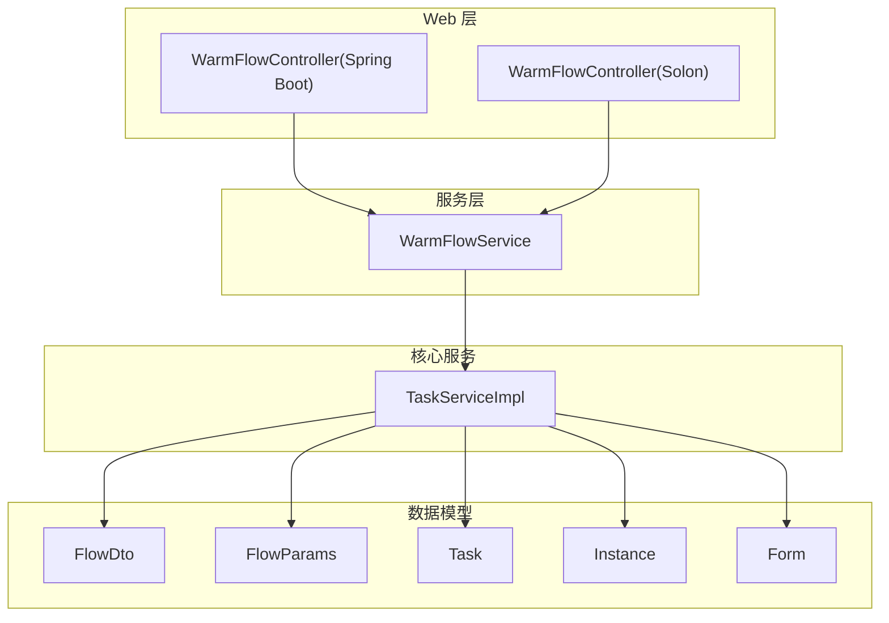
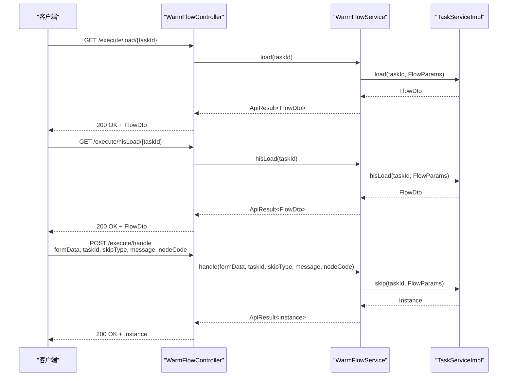
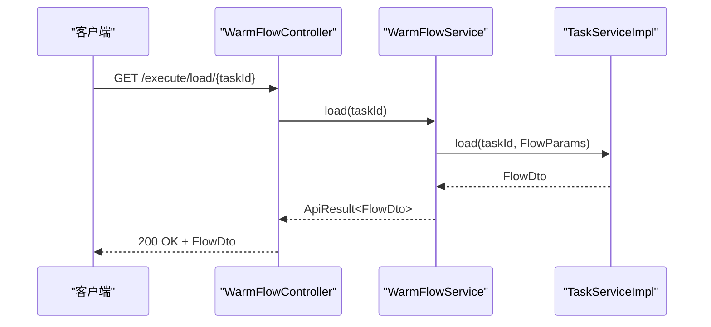
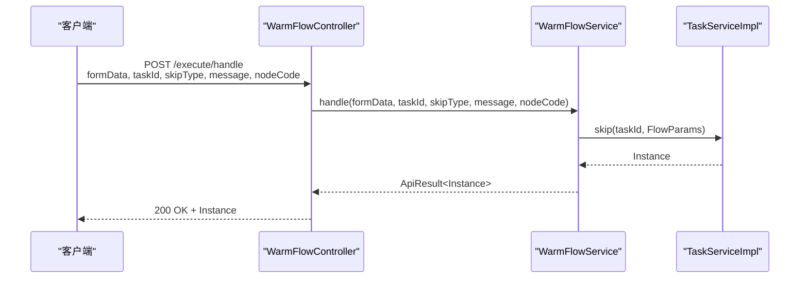
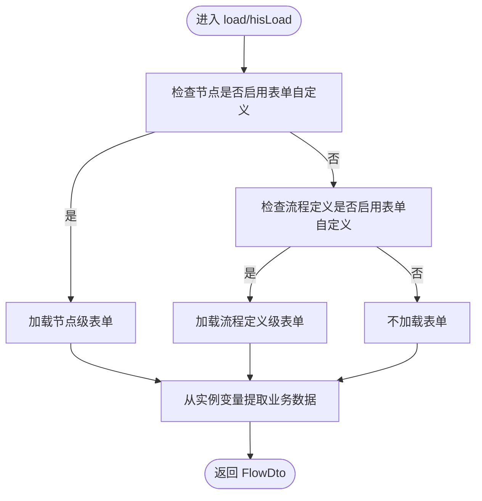
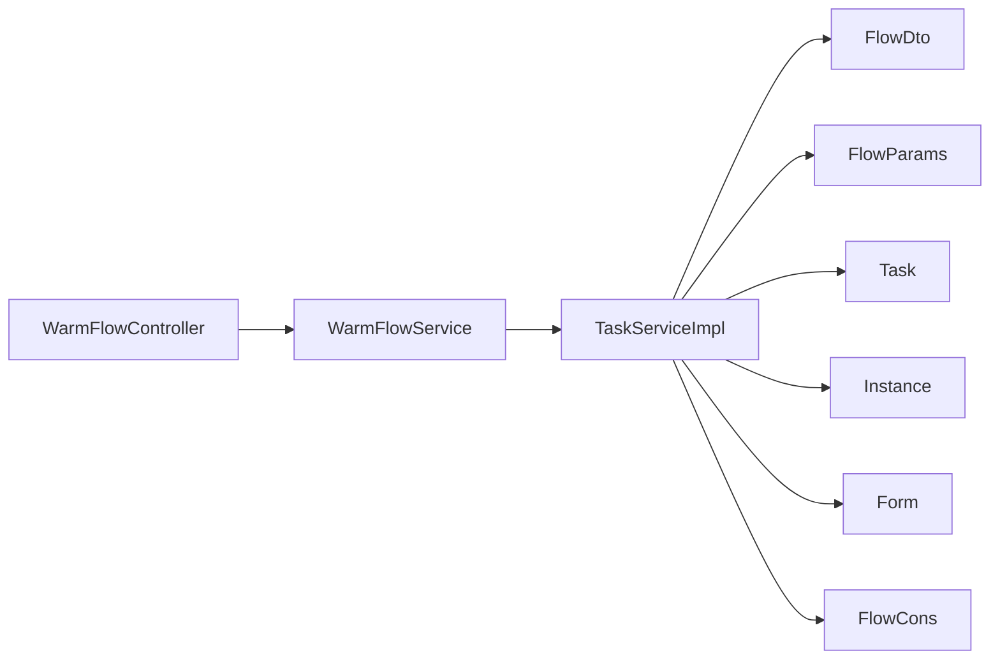

# 任务执行 API

<cite>
**本文引用的文件**
- [WarmFlowController.java](file://warm-flow-plugin/warm-flow-plugin-ui/warm-flow-plugin-ui-sb-web/src/main/java/org/dromara/warm/flow/ui/controller/WarmFlowController.java)
- [WarmFlowController.java](file://warm-flow-plugin/warm-flow-plugin-ui/warm-flow-plugin-ui-solon-web/src/main/java/org/dromara/warm/flow/ui/controller/WarmFlowController.java)
- [WarmFlowService.java](file://warm-flow-plugin/warm-flow-plugin-ui/warm-flow-plugin-ui-core/src/main/java/org/dromara/warm/flow/ui/service/WarmFlowService.java)
- [TaskServiceImpl.java](file://warm-flow-core/src/main/java/org/dromara/warm/flow/core/service/impl/TaskServiceImpl.java)
- [FlowDto.java](file://warm-flow-core/src/main/java/org/dromara/warm/flow/core/dto/FlowDto.java)
- [FlowParams.java](file://warm-flow-core/src/main/java/org/dromara/warm/flow/core/dto/FlowParams.java)
- [Task.java](file://warm-flow-core/src/main/java/org/dromara/warm/flow/core/entity/Task.java)
- [Instance.java](file://warm-flow-core/src/main/java/org/dromara/warm/flow/core/entity/Instance.java)
- [Form.java](file://warm-flow-core/src/main/java/org/dromara/warm/flow/core/entity/Form.java)
- [SkipType.java](file://warm-flow-core/src/main/java/org/dromara/warm/flow/core/enums/SkipType.java)
- [FlowCons.java](file://warm-flow-core/src/main/java/org/dromara/warm/flow/core/constant/FlowCons.java)
</cite>

## 目录
1. [简介](#简介)
2. [项目结构](#项目结构)
3. [核心组件](#核心组件)
4. [架构总览](#架构总览)
5. [详细组件分析](#详细组件分析)
6. [依赖分析](#依赖分析)
7. [性能考虑](#性能考虑)
8. [故障排除指南](#故障排除指南)
9. [结论](#结论)
10. [附录](#附录)

## 简介
本文件面向任务执行相关 API 的使用者与集成者，系统性梳理以下核心接口：
- 任务加载接口：GET /warm-flow/execute/load/{taskId}、/warm-flow/execute/hisLoad/{taskId}
- 任务处理接口：POST /warm-flow/execute/handle（Spring Boot 版）；/warm-flow/execute/handle/{taskId}（Solon 版）

重点说明任务数据加载、表单数据获取、任务审批处理等业务流程，涵盖任务状态管理、表单数据结构、审批参数说明，并提供完整使用示例、参数说明与异常处理指南。

## 项目结构
围绕任务执行 API 的关键模块与职责如下：
- 控制层：Spring Boot 与 Solon 两套 Web 控制器，分别暴露统一的执行接口
- 服务层：统一的 WarmFlowService，封装任务加载与审批处理的业务编排
- 核心服务：TaskServiceImpl 实现具体的任务加载与跳转逻辑
- 数据模型：FlowDto、FlowParams、Task、Instance、Form 等实体与 DTO
- 枚举与常量：SkipType、FlowCons 提供审批动作与流程常量

图表来源
- [WarmFlowController.java:162-194](file://warm-flow-plugin/warm-flow-plugin-ui/warm-flow-plugin-ui-sb-web/src/main/java/org/dromara/warm/flow/ui/controller/WarmFlowController.java#L162-L194)
- [WarmFlowController.java:186-220](file://warm-flow-plugin/warm-flow-plugin-ui/warm-flow-plugin-ui-solon-web/src/main/java/org/dromara/warm/flow/ui/controller/WarmFlowController.java#L186-L220)
- [WarmFlowService.java:295-333](file://warm-flow-plugin/warm-flow-plugin-ui/warm-flow-plugin-ui-core/src/main/java/org/dromara/warm/flow/ui/service/WarmFlowService.java#L295-L333)
- [TaskServiceImpl.java:994-1041](file://warm-flow-core/src/main/java/org/dromara/warm/flow/core/service/impl/TaskServiceImpl.java#L994-L1041)
- [FlowDto.java:29-53](file://warm-flow-core/src/main/java/org/dromara/warm/flow/core/dto/FlowDto.java#L29-L53)
- [FlowParams.java:33-335](file://warm-flow-core/src/main/java/org/dromara/warm/flow/core/dto/FlowParams.java#L33-L335)
- [Task.java:27-135](file://warm-flow-core/src/main/java/org/dromara/warm/flow/core/entity/Task.java#L27-L135)
- [Instance.java:29-165](file://warm-flow-core/src/main/java/org/dromara/warm/flow/core/entity/Instance.java#L29-L165)
- [Form.java:26-111](file://warm-flow-core/src/main/java/org/dromara/warm/flow/core/entity/Form.java#L26-L111)

章节来源
- [WarmFlowController.java:162-194](file://warm-flow-plugin/warm-flow-plugin-ui/warm-flow-plugin-ui-sb-web/src/main/java/org/dromara/warm/flow/ui/controller/WarmFlowController.java#L162-L194)
- [WarmFlowController.java:186-220](file://warm-flow-plugin/warm-flow-plugin-ui/warm-flow-plugin-ui-solon-web/src/main/java/org/dromara/warm/flow/ui/controller/WarmFlowController.java#L186-L220)
- [WarmFlowService.java:295-333](file://warm-flow-plugin/warm-flow-plugin-ui/warm-flow-plugin-ui-core/src/main/java/org/dromara/warm/flow/ui/service/WarmFlowService.java#L295-L333)

## 核心组件
- 接口控制器
  - Spring Boot 版：在 /warm-flow 基础路径下提供任务加载与审批处理接口
  - Solon 版：在 /warm-flow 基础路径下提供任务加载与审批处理接口
- 服务编排
  - WarmFlowService 将请求参数转换为 FlowParams，并调用 TaskServiceImpl 完成任务加载与跳转
- 任务加载实现
  - TaskServiceImpl.load：根据 taskId 加载当前待办任务的表单与数据
  - TaskServiceImpl.hisLoad：根据历史任务 id 加载已办任务的表单与数据
- 数据模型
  - FlowDto：封装返回的表单内容、表单元数据与业务数据
  - FlowParams：封装审批参数（跳转类型、审批意见、流程变量、协作方式等）
  - Task/Instance/Form：任务、实例与表单实体

章节来源
- [WarmFlowService.java:295-333](file://warm-flow-plugin/warm-flow-plugin-ui/warm-flow-plugin-ui-core/src/main/java/org/dromara/warm/flow/ui/service/WarmFlowService.java#L295-L333)
- [TaskServiceImpl.java:994-1041](file://warm-flow-core/src/main/java/org/dromara/warm/flow/core/service/impl/TaskServiceImpl.java#L994-L1041)
- [FlowDto.java:29-53](file://warm-flow-core/src/main/java/org/dromara/warm/flow/core/dto/FlowDto.java#L29-L53)
- [FlowParams.java:33-335](file://warm-flow-core/src/main/java/org/dromara/warm/flow/core/dto/FlowParams.java#L33-L335)
- [Task.java:27-135](file://warm-flow-core/src/main/java/org/dromara/warm/flow/core/entity/Task.java#L27-L135)
- [Instance.java:29-165](file://warm-flow-core/src/main/java/org/dromara/warm/flow/core/entity/Instance.java#L29-L165)
- [Form.java:26-111](file://warm-flow-core/src/main/java/org/dromara/warm/flow/core/entity/Form.java#L26-L111)

## 架构总览
任务执行 API 的端到端调用链如下：

图表来源
- [WarmFlowController.java:162-194](file://warm-flow-plugin/warm-flow-plugin-ui/warm-flow-plugin-ui-sb-web/src/main/java/org/dromara/warm/flow/ui/controller/WarmFlowController.java#L162-L194)
- [WarmFlowController.java:186-220](file://warm-flow-plugin/warm-flow-plugin-ui/warm-flow-plugin-ui-solon-web/src/main/java/org/dromara/warm/flow/ui/controller/WarmFlowController.java#L186-L220)
- [WarmFlowService.java:295-333](file://warm-flow-plugin/warm-flow-plugin-ui/warm-flow-plugin-ui-core/src/main/java/org/dromara/warm/flow/ui/service/WarmFlowService.java#L295-L333)
- [TaskServiceImpl.java:994-1041](file://warm-flow-core/src/main/java/org/dromara/warm/flow/core/service/impl/TaskServiceImpl.java#L994-L1041)

## 详细组件分析

### 任务加载接口
- GET /warm-flow/execute/load/{taskId}
  - 功能：加载当前待办任务的表单与业务数据
  - 参数：路径参数 taskId（Long）
  - 返回：ApiResult<FlowDto>
  - 处理流程：
    - WarmFlowController 调用 WarmFlowService.load
    - WarmFlowService 构造 FlowParams 并调用 TaskServiceImpl.load
    - TaskServiceImpl 根据当前节点或流程定义的表单定制策略，加载 Form 与业务数据
- GET /warm-flow/execute/hisLoad/{taskId}
  - 功能：加载历史任务的表单与业务数据
  - 参数：路径参数 taskId（Long）
  - 返回：ApiResult<FlowDto>
  - 处理流程：
    - WarmFlowController 调用 WarmFlowService.hisLoad
    - WarmFlowService 构造 FlowParams 并调用 TaskServiceImpl.hisLoad
    - TaskServiceImpl 根据历史任务节点与流程定义加载 Form 与业务数据

图表来源
- [WarmFlowController.java:162-165](file://warm-flow-plugin/warm-flow-plugin-ui/warm-flow-plugin-ui-sb-web/src/main/java/org/dromara/warm/flow/ui/controller/WarmFlowController.java#L162-L165)
- [WarmFlowService.java:295-299](file://warm-flow-plugin/warm-flow-plugin-ui/warm-flow-plugin-ui-core/src/main/java/org/dromara/warm/flow/ui/service/WarmFlowService.java#L295-L299)
- [TaskServiceImpl.java:994-1016](file://warm-flow-core/src/main/java/org/dromara/warm/flow/core/service/impl/TaskServiceImpl.java#L994-L1016)

章节来源
- [WarmFlowController.java:162-176](file://warm-flow-plugin/warm-flow-plugin-ui/warm-flow-plugin-ui-sb-web/src/main/java/org/dromara/warm/flow/ui/controller/WarmFlowController.java#L162-L176)
- [WarmFlowService.java:295-311](file://warm-flow-plugin/warm-flow-plugin-ui/warm-flow-plugin-ui-core/src/main/java/org/dromara/warm/flow/ui/service/WarmFlowService.java#L295-L311)
- [TaskServiceImpl.java:994-1041](file://warm-flow-core/src/main/java/org/dromara/warm/flow/core/service/impl/TaskServiceImpl.java#L994-L1041)

### 任务处理接口
- POST /warm-flow/execute/handle（Spring Boot）
  - 功能：通用表单流程审批处理
  - 请求体：formData（Map<String,Object>），必填
  - 查询参数：
    - taskId（Long，必填）
    - skipType（String，必填，参考枚举）
    - message（String，必填）
    - nodeCode（String，可选）
  - 返回：ApiResult<Instance>
  - 处理流程：
    - WarmFlowController 构造 FlowParams（包含 skipType、message、nodeCode、formData）
    - WarmFlowService 调用 TaskServiceImpl.skip 完成跳转与状态更新
- POST /warm-flow/execute/handle/{taskId}（Solon）
  - 功能：通用表单流程审批处理（Solon 版本）
  - 路径参数：taskId（Long，必填）
  - 请求体：formData（Map<String,Object>），必填
  - 查询参数：
    - skipType（String，必填）
    - message（String，必填）
    - nodeCode（String，可选）
  - 返回：ApiResult<Instance>
  - 处理流程：
    - WarmFlowController 构造 FlowParams（包含 skipType、message、nodeCode、formData）
    - WarmFlowService 调用 TaskServiceImpl.skip 完成跳转与状态更新

图表来源
- [WarmFlowController.java:188-194](file://warm-flow-plugin/warm-flow-plugin-ui/warm-flow-plugin-ui-sb-web/src/main/java/org/dromara/warm/flow/ui/controller/WarmFlowController.java#L188-L194)
- [WarmFlowController.java:214-220](file://warm-flow-plugin/warm-flow-plugin-ui/warm-flow-plugin-ui-solon-web/src/main/java/org/dromara/warm/flow/ui/controller/WarmFlowController.java#L214-L220)
- [WarmFlowService.java:323-333](file://warm-flow-plugin/warm-flow-plugin-ui/warm-flow-plugin-ui-core/src/main/java/org/dromara/warm/flow/ui/service/WarmFlowService.java#L323-L333)
- [TaskServiceImpl.java:994-1041](file://warm-flow-core/src/main/java/org/dromara/warm/flow/core/service/impl/TaskServiceImpl.java#L994-L1041)

章节来源
- [WarmFlowController.java:188-194](file://warm-flow-plugin/warm-flow-plugin-ui/warm-flow-plugin-ui-sb-web/src/main/java/org/dromara/warm/flow/ui/controller/WarmFlowController.java#L188-L194)
- [WarmFlowController.java:214-220](file://warm-flow-plugin/warm-flow-plugin-ui/warm-flow-plugin-ui-solon-web/src/main/java/org/dromara/warm/flow/ui/controller/WarmFlowController.java#L214-L220)
- [WarmFlowService.java:323-333](file://warm-flow-plugin/warm-flow-plugin-ui/warm-flow-plugin-ui-core/src/main/java/org/dromara/warm/flow/ui/service/WarmFlowService.java#L323-L333)

### 任务数据加载与表单数据结构
- FlowDto 字段
  - id：流程实例或表单 ID
  - formContent：表单内容（字符串）
  - form：表单元数据（Form 对象）
  - data：业务数据（Object）
- 表单加载策略
  - 若节点启用“表单自定义”，则优先加载节点级表单
  - 否则若流程定义启用“表单自定义”，则加载流程定义级表单
  - 最终从实例变量中提取业务数据（键为 FlowCons.FORM_DATA）

图表来源
- [TaskServiceImpl.java:994-1041](file://warm-flow-core/src/main/java/org/dromara/warm/flow/core/service/impl/TaskServiceImpl.java#L994-L1041)
- [FlowCons.java:65-77](file://warm-flow-core/src/main/java/org/dromara/warm/flow/core/constant/FlowCons.java#L65-L77)

章节来源
- [TaskServiceImpl.java:994-1041](file://warm-flow-core/src/main/java/org/dromara/warm/flow/core/service/impl/TaskServiceImpl.java#L994-L1041)
- [FlowDto.java:29-53](file://warm-flow-core/src/main/java/org/dromara/warm/flow/core/dto/FlowDto.java#L29-L53)
- [FlowCons.java:65-77](file://warm-flow-core/src/main/java/org/dromara/warm/flow/core/constant/FlowCons.java#L65-L77)

### 审批参数说明与状态管理
- FlowParams 关键字段
  - skipType：审批动作（参考 SkipType）
  - message：审批意见
  - nodeCode：目标节点编码（可选，用于指定跳转节点）
  - variable：流程变量（Map<String,Object>）
  - cooperateType：协作方式（1-7）
  - flowStatus/hisStatus：流程/历史任务状态
  - activityStatus：流程激活状态（0/1）
  - nextHandler/nextHandlerAppend：下一节点处理人与追加策略
  - ignore/ignoreDepute/ignoreCooperate：忽略策略开关
- 审批动作枚举（SkipType）
  - PASS：审批通过
  - REJECT：退回
  - NONE：无动作
- 任务状态
  - Task/Instance 提供流程状态与活动状态字段，用于控制流程流转与界面展示

章节来源
- [FlowParams.java:33-335](file://warm-flow-core/src/main/java/org/dromara/warm/flow/core/dto/FlowParams.java#L33-L335)
- [SkipType.java:30-100](file://warm-flow-core/src/main/java/org/dromara/warm/flow/core/enums/SkipType.java#L30-L100)
- [Task.java:27-135](file://warm-flow-core/src/main/java/org/dromara/warm/flow/core/entity/Task.java#L27-L135)
- [Instance.java:29-165](file://warm-flow-core/src/main/java/org/dromara/warm/flow/core/entity/Instance.java#L29-L165)

## 依赖分析
- 控制器依赖服务层：WarmFlowController 仅负责参数解析与响应包装，实际业务由 WarmFlowService 编排
- 服务层依赖核心服务：WarmFlowService 将请求参数转换为 FlowParams，并调用 TaskServiceImpl 完成任务加载与跳转
- 核心服务依赖实体与常量：TaskServiceImpl 使用 FlowDto、FlowParams、Task、Instance、Form 以及 FlowCons 进行数据组装与策略判断

图表来源
- [WarmFlowController.java:162-194](file://warm-flow-plugin/warm-flow-plugin-ui/warm-flow-plugin-ui-sb-web/src/main/java/org/dromara/warm/flow/ui/controller/WarmFlowController.java#L162-L194)
- [WarmFlowService.java:295-333](file://warm-flow-plugin/warm-flow-plugin-ui/warm-flow-plugin-ui-core/src/main/java/org/dromara/warm/flow/ui/service/WarmFlowService.java#L295-L333)
- [TaskServiceImpl.java:994-1041](file://warm-flow-core/src/main/java/org/dromara/warm/flow/core/service/impl/TaskServiceImpl.java#L994-L1041)
- [FlowDto.java:29-53](file://warm-flow-core/src/main/java/org/dromara/warm/flow/core/dto/FlowDto.java#L29-L53)
- [FlowParams.java:33-335](file://warm-flow-core/src/main/java/org/dromara/warm/flow/core/dto/FlowParams.java#L33-L335)
- [Task.java:27-135](file://warm-flow-core/src/main/java/org/dromara/warm/flow/core/entity/Task.java#L27-L135)
- [Instance.java:29-165](file://warm-flow-core/src/main/java/org/dromara/warm/flow/core/entity/Instance.java#L29-L165)
- [Form.java:26-111](file://warm-flow-core/src/main/java/org/dromara/warm/flow/core/entity/Form.java#L26-L111)
- [FlowCons.java:65-77](file://warm-flow-core/src/main/java/org/dromara/warm/flow/core/constant/FlowCons.java#L65-L77)

章节来源
- [WarmFlowController.java:162-194](file://warm-flow-plugin/warm-flow-plugin-ui/warm-flow-plugin-ui-sb-web/src/main/java/org/dromara/warm/flow/ui/controller/WarmFlowController.java#L162-L194)
- [WarmFlowService.java:295-333](file://warm-flow-plugin/warm-flow-plugin-ui/warm-flow-plugin-ui-core/src/main/java/org/dromara/warm/flow/ui/service/WarmFlowService.java#L295-L333)
- [TaskServiceImpl.java:994-1041](file://warm-flow-core/src/main/java/org/dromara/warm/flow/core/service/impl/TaskServiceImpl.java#L994-L1041)

## 性能考虑
- 表单加载策略：优先节点级表单可减少跨域查询，提升响应速度
- 数据序列化：FlowParams 提供变量序列化工具，避免重复转换
- 事务边界：处理接口采用事务控制，确保审批一致性与原子性
- 建议
  - 在高并发场景下，合理缓存常用表单内容与流程定义
  - 控制 formData 的体量，避免超大 JSON 导致序列化与网络开销增加

## 故障排除指南
- 常见错误与定位
  - 任务不存在：hisLoad 中对历史任务进行存在性校验，缺失时抛出异常
  - 流程定义缺失：hisLoad 中对流程定义进行存在性校验，缺失时抛出异常
  - 当前节点缺失：hisLoad 中对当前节点进行存在性校验，缺失时抛出异常
  - 表单加载失败：根据节点/定义的表单定制策略加载失败时，需检查表单发布状态与路径
- 排查步骤
  - 确认 taskId 正确且对应当前用户的待办或历史任务
  - 检查 skipType 是否为合法枚举值（PASS/REJECT/NONE）
  - 核对 nodeCode 是否存在于流程定义中（如需指定跳转）
  - 检查 formData 结构与业务数据一致
- 异常处理
  - 控制器与服务层均通过统一的 ApiResult 包装返回，便于前端统一处理
  - 核心服务在加载阶段进行严格校验，失败时抛出 FlowException，便于定位问题

章节来源
- [TaskServiceImpl.java:1019-1028](file://warm-flow-core/src/main/java/org/dromara/warm/flow/core/service/impl/TaskServiceImpl.java#L1019-L1028)
- [WarmFlowService.java:323-333](file://warm-flow-plugin/warm-flow-plugin-ui/warm-flow-plugin-ui-core/src/main/java/org/dromara/warm/flow/ui/service/WarmFlowService.java#L323-L333)

## 结论
任务执行 API 以清晰的分层设计实现了“加载—审批—跳转”的闭环流程。通过统一的服务编排与严格的参数校验，既保证了易用性，也确保了流程的正确性与一致性。建议在生产环境中结合业务需求合理使用 nodeCode 指定跳转、利用协作方式与状态字段精细化控制流程行为，并配合缓存与事务策略优化性能与可靠性。

## 附录

### 接口清单与参数说明
- GET /warm-flow/execute/load/{taskId}
  - 路径参数：taskId（Long）
  - 返回：ApiResult<FlowDto>
- GET /warm-flow/execute/hisLoad/{taskId}
  - 路径参数：taskId（Long）
  - 返回：ApiResult<FlowDto>
- POST /warm-flow/execute/handle（Spring Boot）
  - 请求体：formData（Map<String,Object>）
  - 查询参数：
    - taskId（Long，必填）
    - skipType（String，必填）
    - message（String，必填）
    - nodeCode（String，可选）
  - 返回：ApiResult<Instance>
- POST /warm-flow/execute/handle/{taskId}（Solon）
  - 路径参数：taskId（Long）
  - 请求体：formData（Map<String,Object>）
  - 查询参数：
    - skipType（String，必填）
    - message（String，必填）
    - nodeCode（String，可选）
  - 返回：ApiResult<Instance>

章节来源
- [WarmFlowController.java:162-194](file://warm-flow-plugin/warm-flow-plugin-ui/warm-flow-plugin-ui-sb-web/src/main/java/org/dromara/warm/flow/ui/controller/WarmFlowController.java#L162-L194)
- [WarmFlowController.java:186-220](file://warm-flow-plugin/warm-flow-plugin-ui/warm-flow-plugin-ui-solon-web/src/main/java/org/dromara/warm/flow/ui/controller/WarmFlowController.java#L186-L220)