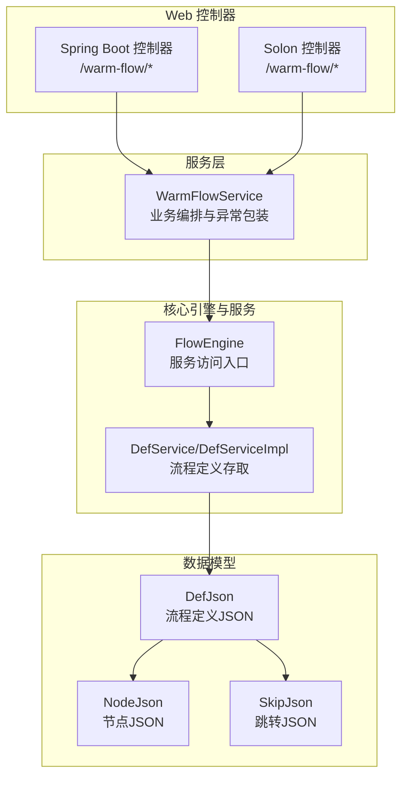
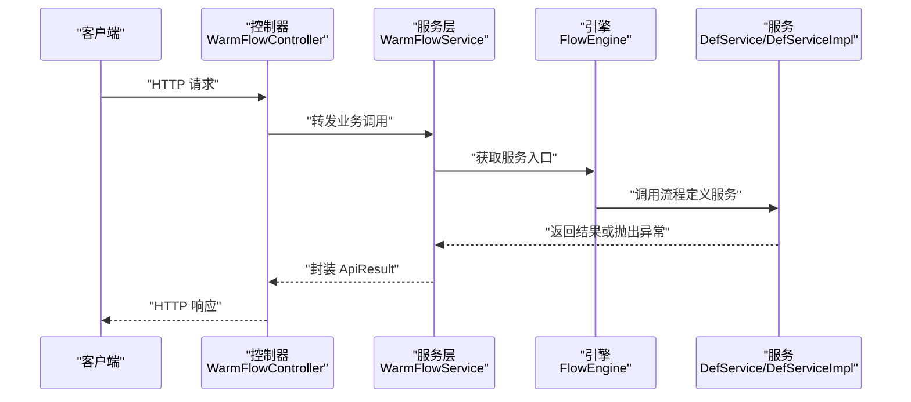
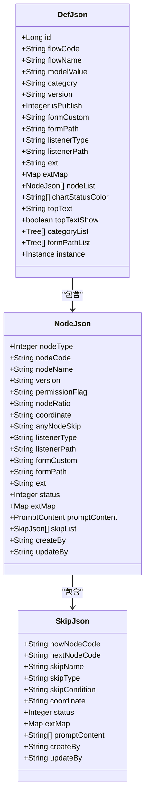
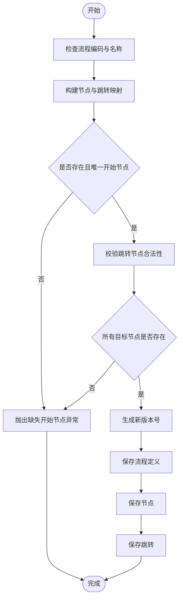
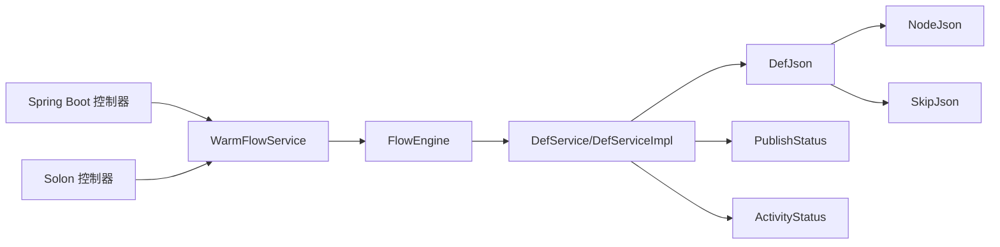

# 流程定义 API

<cite>
**本文引用的文件**
- [WarmFlowController.java](file://warm-flow-plugin/warm-flow-plugin-ui/warm-flow-plugin-ui-sb-web/src/main/java/org/dromara/warm/flow/ui/controller/WarmFlowController.java)
- [WarmFlowController.java](file://warm-flow-plugin/warm-flow-plugin-ui/warm-flow-plugin-ui-solon-web/src/main/java/org/dromara/warm/flow/ui/controller/WarmFlowController.java)
- [WarmFlowService.java](file://warm-flow-plugin/warm-flow-plugin-ui/warm-flow-plugin-ui-core/src/main/java/org/dromara/warm/flow/ui/service/WarmFlowService.java)
- [DefJson.java](file://warm-flow-core/src/main/java/org/dromara/warm/flow/core/dto/DefJson.java)
- [NodeJson.java](file://warm-flow-core/src/main/java/org/dromara/warm/flow/core/dto/NodeJson.java)
- [SkipJson.java](file://warm-flow-core/src/main/java/org/dromara/warm/flow/core/dto/SkipJson.java)
- [ApiResult.java](file://warm-flow-core/src/main/java/org/dromara/warm/flow/core/dto/ApiResult.java)
- [DefService.java](file://warm-flow-core/src/main/java/org/dromara/warm/flow/core/service/DefService.java)
- [DefServiceImpl.java](file://warm-flow-core/src/main/java/org/dromara/warm/flow/core/service/impl/DefServiceImpl.java)
- [FlowEngine.java](file://warm-flow-core/src/main/java/org/dromara/warm/flow/core/FlowEngine.java)
- [PublishStatus.java](file://warm-flow-core/src/main/java/org/dromara/warm/flow/core/enums/PublishStatus.java)
- [ActivityStatus.java](file://warm-flow-core/src/main/java/org/dromara/warm/flow/core/enums/ActivityStatus.java)
</cite>

## 目录
1. [简介](#简介)
2. [项目结构](#项目结构)
3. [核心组件](#核心组件)
4. [架构总览](#架构总览)
5. [详细组件分析](#详细组件分析)
6. [依赖关系分析](#依赖关系分析)
7. [性能考量](#性能考量)
8. [故障排查指南](#故障排查指南)
9. [结论](#结论)
10. [附录](#附录)

## 简介
本文档面向流程设计器与业务系统的集成开发者，系统性梳理“流程定义”相关 API，包括：
- 流程保存接口：POST /warm-flow/save-json
- 流程查询接口：GET /warm-flow/query-def、GET /warm-flow/query-def/{id}
- 流程图查询接口：GET /warm-flow/query-flow-chart/{id}

重点说明每个接口的请求参数、响应格式、业务逻辑、使用场景，以及流程 JSON 数据结构、流程状态管理与版本控制等关键概念。同时提供请求与响应示例路径、错误处理说明与最佳实践。

## 项目结构
围绕流程定义 API 的核心模块与文件如下：
- 控制器层：Spring Boot 与 Solon 两套 Web 控制器，统一暴露 /warm-flow 前缀的流程定义相关接口
- 服务层：UI 层服务封装对 FlowEngine 与各 Service 的调用，负责业务编排与异常包装
- 核心 DTO：DefJson、NodeJson、SkipJson 描述流程定义的完整结构
- 引擎与服务：FlowEngine 提供各 Service 访问入口；DefService/DefServiceImpl 实现流程定义的导入、导出、保存、发布、版本生成等

图表来源
- [WarmFlowController.java:51-79](file://warm-flow-plugin/warm-flow-plugin-ui/warm-flow-plugin-ui-sb-web/src/main/java/org/dromara/warm/flow/ui/controller/WarmFlowController.java#L51-L79)
- [WarmFlowController.java:51-96](file://warm-flow-plugin/warm-flow-plugin-ui/warm-flow-plugin-ui-solon-web/src/main/java/org/dromara/warm/flow/ui/controller/WarmFlowController.java#L51-L96)
- [WarmFlowService.java:79-151](file://warm-flow-plugin/warm-flow-plugin-ui/warm-flow-plugin-ui-core/src/main/java/org/dromara/warm/flow/ui/service/WarmFlowService.java#L79-L151)
- [DefJson.java:44-292](file://warm-flow-core/src/main/java/org/dromara/warm/flow/core/dto/DefJson.java#L44-L292)
- [NodeJson.java:38-126](file://warm-flow-core/src/main/java/org/dromara/warm/flow/core/dto/NodeJson.java#L38-L126)
- [SkipJson.java:34-86](file://warm-flow-core/src/main/java/org/dromara/warm/flow/core/dto/SkipJson.java#L34-L86)
- [DefService.java:34-209](file://warm-flow-core/src/main/java/org/dromara/warm/flow/core/service/DefService.java#L34-L209)
- [DefServiceImpl.java:108-149](file://warm-flow-core/src/main/java/org/dromara/warm/flow/core/service/impl/DefServiceImpl.java#L108-L149)
- [FlowEngine.java:72-106](file://warm-flow-core/src/main/java/org/dromara/warm/flow/core/FlowEngine.java#L72-L106)

章节来源
- [WarmFlowController.java:51-79](file://warm-flow-plugin/warm-flow-plugin-ui/warm-flow-plugin-ui-sb-web/src/main/java/org/dromara/warm/flow/ui/controller/WarmFlowController.java#L51-L79)
- [WarmFlowController.java:51-96](file://warm-flow-plugin/warm-flow-plugin-ui/warm-flow-plugin-ui-solon-web/src/main/java/org/dromara/warm/flow/ui/controller/WarmFlowController.java#L51-L96)
- [WarmFlowService.java:79-151](file://warm-flow-plugin/warm-flow-plugin-ui/warm-flow-plugin-ui-core/src/main/java/org/dromara/warm/flow/ui/service/WarmFlowService.java#L79-L151)

## 核心组件
- 接口控制器：分别在 Spring Boot 与 Solon 中提供相同语义的 /warm-flow/* 接口，内部委托 WarmFlowService 执行
- UI 服务：封装业务逻辑，统一返回 ApiResult 格式，负责异常转换与外部可见的错误码
- 流程 JSON 模型：DefJson 作为顶层载体，内含流程元信息、节点集合与跳转集合；NodeJson 与 SkipJson 描述节点与跳转细节
- 引擎与服务：FlowEngine 提供 DefService 访问；DefServiceImpl 实现保存、发布、版本生成、合法性校验等

章节来源
- [ApiResult.java:30-96](file://warm-flow-core/src/main/java/org/dromara/warm/flow/core/dto/ApiResult.java#L30-L96)
- [DefJson.java:44-292](file://warm-flow-core/src/main/java/org/dromara/warm/flow/core/dto/DefJson.java#L44-L292)
- [NodeJson.java:38-126](file://warm-flow-core/src/main/java/org/dromara/warm/flow/core/dto/NodeJson.java#L38-L126)
- [SkipJson.java:34-86](file://warm-flow-core/src/main/java/org/dromara/warm/flow/core/dto/SkipJson.java#L34-L86)
- [FlowEngine.java:72-106](file://warm-flow-core/src/main/java/org/dromara/warm/flow/core/FlowEngine.java#L72-L106)
- [DefService.java:34-209](file://warm-flow-core/src/main/java/org/dromara/warm/flow/core/service/DefService.java#L34-L209)
- [DefServiceImpl.java:108-149](file://warm-flow-core/src/main/java/org/dromara/warm/flow/core/service/impl/DefServiceImpl.java#L108-L149)

## 架构总览
下图展示从控制器到服务层再到引擎与持久化服务的整体调用链路。

图表来源
- [WarmFlowController.java:51-79](file://warm-flow-plugin/warm-flow-plugin-ui/warm-flow-plugin-ui-sb-web/src/main/java/org/dromara/warm/flow/ui/controller/WarmFlowController.java#L51-L79)
- [WarmFlowService.java:79-151](file://warm-flow-plugin/warm-flow-plugin-ui/warm-flow-plugin-ui-core/src/main/java/org/dromara/warm/flow/ui/service/WarmFlowService.java#L79-L151)
- [FlowEngine.java:72-106](file://warm-flow-core/src/main/java/org/dromara/warm/flow/core/FlowEngine.java#L72-L106)
- [DefService.java:34-209](file://warm-flow-core/src/main/java/org/dromara/warm/flow/core/service/DefService.java#L34-L209)
- [DefServiceImpl.java:108-149](file://warm-flow-core/src/main/java/org/dromara/warm/flow/core/service/impl/DefServiceImpl.java#L108-L149)

## 详细组件分析

### 接口一：流程保存（POST /warm-flow/save-json）
- 方法与路径
  - Spring Boot：POST /warm-flow/save-json
  - Solon：POST /warm-flow/save-json
- 请求头
  - onlyNodeSkip：boolean，是否仅保存节点与跳转（不更新流程定义主表）
- 请求体
  - DefJson：流程定义 JSON 对象，包含流程元信息、节点列表、跳转列表等
- 响应
  - ApiResult<Void>：成功返回 200，失败返回 500
- 业务逻辑
  - 调用 WarmFlowService.saveJson(defJson, onlyNodeSkip)
  - WarmFlowService 内部调用 FlowEngine.defService().saveDef(defJson, onlyNodeSkip)
  - DefServiceImpl.saveDef 中进行版本生成、合法性校验、节点/跳转保存
- 使用场景
  - 设计器保存流程草稿或正式版本
  - 仅更新节点与跳转时，可传 onlyNodeSkip=true 以避免覆盖流程定义主表
- 错误处理
  - 参数为空、保存异常、校验失败均被包装为 ApiResult.fail 并返回 500

请求示例（路径）
- [WarmFlowController.java:51-55](file://warm-flow-plugin/warm-flow-plugin-ui/warm-flow-plugin-ui-sb-web/src/main/java/org/dromara/warm/flow/ui/controller/WarmFlowController.java#L51-L55)
- [WarmFlowController.java:51-56](file://warm-flow-plugin/warm-flow-plugin-ui/warm-flow-plugin-ui-solon-web/src/main/java/org/dromara/warm/flow/ui/controller/WarmFlowController.java#L51-L56)

响应示例（路径）
- [ApiResult.java:49-79](file://warm-flow-core/src/main/java/org/dromara/warm/flow/core/dto/ApiResult.java#L49-L79)

章节来源
- [WarmFlowController.java:51-55](file://warm-flow-plugin/warm-flow-plugin-ui/warm-flow-plugin-ui-sb-web/src/main/java/org/dromara/warm/flow/ui/controller/WarmFlowController.java#L51-L55)
- [WarmFlowController.java:51-56](file://warm-flow-plugin/warm-flow-plugin-ui/warm-flow-plugin-ui-solon-web/src/main/java/org/dromara/warm/flow/ui/controller/WarmFlowController.java#L51-L56)
- [WarmFlowService.java:79-82](file://warm-flow-plugin/warm-flow-plugin-ui/warm-flow-plugin-ui-core/src/main/java/org/dromara/warm/flow/ui/service/WarmFlowService.java#L79-L82)
- [DefServiceImpl.java:108-149](file://warm-flow-core/src/main/java/org/dromara/warm/flow/core/service/impl/DefServiceImpl.java#L108-L149)
- [DefService.java:82-82](file://warm-flow-core/src/main/java/org/dromara/warm/flow/core/service/DefService.java#L82-L82)

### 接口二：流程查询（GET /warm-flow/query-def、GET /warm-flow/query-def/{id}）
- 方法与路径
  - GET /warm-flow/query-def
  - GET /warm-flow/query-def/{id}
- 路径参数
  - id：流程定义 id（可选），不传则返回空的 DefJson（含默认模型与表单策略）
- 响应
  - ApiResult<DefJson>：成功返回 200，失败返回 500
- 业务逻辑
  - WarmFlowService.queryDef(id)
  - 若 id 为空，构造默认 DefJson（模型、表单策略等）
  - 若 id 存在，调用 FlowEngine.defService().queryDesign(id) 返回完整流程设计数据
  - 可能注入分类树与表单路径树
- 使用场景
  - 打开设计器加载流程设计数据
  - 新建流程时的默认模板数据准备
- 错误处理
  - 异常统一捕获并包装为 ApiResult.fail

请求示例（路径）
- [WarmFlowController.java:65-68](file://warm-flow-plugin/warm-flow-plugin-ui/warm-flow-plugin-ui-sb-web/src/main/java/org/dromara/warm/flow/ui/controller/WarmFlowController.java#L65-L68)
- [WarmFlowController.java:79-83](file://warm-flow-plugin/warm-flow-plugin-ui/warm-flow-plugin-ui-solon-web/src/main/java/org/dromara/warm/flow/ui/controller/WarmFlowController.java#L79-L83)

响应示例（路径）
- [ApiResult.java:49-79](file://warm-flow-core/src/main/java/org/dromara/warm/flow/core/dto/ApiResult.java#L49-L79)

章节来源
- [WarmFlowController.java:65-68](file://warm-flow-plugin/warm-flow-plugin-ui/warm-flow-plugin-ui-sb-web/src/main/java/org/dromara/warm/flow/ui/controller/WarmFlowController.java#L65-L68)
- [WarmFlowController.java:79-83](file://warm-flow-plugin/warm-flow-plugin-ui/warm-flow-plugin-ui-solon-web/src/main/java/org/dromara/warm/flow/ui/controller/WarmFlowController.java#L79-L83)
- [WarmFlowService.java:92-120](file://warm-flow-plugin/warm-flow-plugin-ui/warm-flow-plugin-ui-core/src/main/java/org/dromara/warm/flow/ui/service/WarmFlowService.java#L92-L120)
- [DefService.java:130-130](file://warm-flow-core/src/main/java/org/dromara/warm/flow/core/service/DefService.java#L130-L130)

### 接口三：流程图查询（GET /warm-flow/query-flow-chart/{id}）
- 方法与路径
  - GET /warm-flow/query-flow-chart/{id}
- 路径参数
  - id：流程实例 id
- 响应
  - ApiResult<DefJson>：成功返回 200，失败返回 500
- 业务逻辑
  - WarmFlowService.queryFlowChart(id)
  - 通过 FlowEngine.insService().getById(id) 获取实例
  - 将实例中的 defJson 字符串反序列化为 DefJson，并注入实例对象
  - 可选注入流程图三原色、顶部文本显示开关、扩展钩子执行
- 使用场景
  - 渲染流程图视图，展示当前实例的流程状态与节点信息
- 错误处理
  - 异常统一捕获并包装为 ApiResult.fail

请求示例（路径）
- [WarmFlowController.java:76-79](file://warm-flow-plugin/warm-flow-plugin-ui/warm-flow-plugin-ui-sb-web/src/main/java/org/dromara/warm/flow/ui/controller/WarmFlowController.java#L76-L79)
- [WarmFlowController.java:92-96](file://warm-flow-plugin/warm-flow-plugin-ui/warm-flow-plugin-ui-solon-web/src/main/java/org/dromara/warm/flow/ui/controller/WarmFlowController.java#L92-L96)

响应示例（路径）
- [ApiResult.java:49-79](file://warm-flow-core/src/main/java/org/dromara/warm/flow/core/dto/ApiResult.java#L49-L79)

章节来源
- [WarmFlowController.java:76-79](file://warm-flow-plugin/warm-flow-plugin-ui/warm-flow-plugin-ui-sb-web/src/main/java/org/dromara/warm/flow/ui/controller/WarmFlowController.java#L76-L79)
- [WarmFlowController.java:92-96](file://warm-flow-plugin/warm-flow-plugin-ui/warm-flow-plugin-ui-solon-web/src/main/java/org/dromara/warm/flow/ui/controller/WarmFlowController.java#L92-L96)
- [WarmFlowService.java:128-151](file://warm-flow-plugin/warm-flow-plugin-ui/warm-flow-plugin-ui-core/src/main/java/org/dromara/warm/flow/ui/service/WarmFlowService.java#L128-L151)

### 流程 JSON 数据结构说明
- DefJson（顶层）
  - 关键字段：id、flowCode、flowName、modelValue、category、version、isPublish、formCustom、formPath、listenerType、listenerPath、ext、extMap、nodeList、chartStatusColor、topText、topTextShow、categoryList、formPathList、instance
  - 节点集合：nodeList（元素为 NodeJson）
  - 跳转集合：NodeJson.skipList（元素为 SkipJson）
- NodeJson（节点）
  - 关键字段：nodeType、nodeCode、nodeName、version、permissionFlag、nodeRatio、coordinate、anyNodeSkip、listenerType、listenerPath、formCustom、formPath、ext、status、extMap、promptContent、skipList、createBy、updateBy
- SkipJson（跳转）
  - 关键字段：nowNodeCode、nextNodeCode、skipName、skipType、skipCondition、coordinate、status、extMap、promptContent、createBy、updateBy

图表来源
- [DefJson.java:44-292](file://warm-flow-core/src/main/java/org/dromara/warm/flow/core/dto/DefJson.java#L44-L292)
- [NodeJson.java:38-126](file://warm-flow-core/src/main/java/org/dromara/warm/flow/core/dto/NodeJson.java#L38-L126)
- [SkipJson.java:34-86](file://warm-flow-core/src/main/java/org/dromara/warm/flow/core/dto/SkipJson.java#L34-L86)

章节来源
- [DefJson.java:44-292](file://warm-flow-core/src/main/java/org/dromara/warm/flow/core/dto/DefJson.java#L44-L292)
- [NodeJson.java:38-126](file://warm-flow-core/src/main/java/org/dromara/warm/flow/core/dto/NodeJson.java#L38-L126)
- [SkipJson.java:34-86](file://warm-flow-core/src/main/java/org/dromara/warm/flow/core/dto/SkipJson.java#L34-L86)

### 流程状态管理与版本控制
- 发布状态（PublishStatus）
  - 9=已失效；0=未发布；1=已发布
  - 发布/取消发布会更新流程定义的 isPublish 字段，并对同流程编码的其他定义做状态迁移
- 激活状态（ActivityStatus）
  - 0=挂起；1=激活
  - 影响流程实例是否可继续流转
- 版本控制（Version）
  - 新增流程定义时生成版本号：优先递增数字版本，若历史版本非正数则追加时间戳后缀并递增
  - 节点与跳转随流程定义版本同步

图表来源
- [DefServiceImpl.java:345-371](file://warm-flow-core/src/main/java/org/dromara/warm/flow/core/service/impl/DefServiceImpl.java#L345-L371)
- [DefServiceImpl.java:311-343](file://warm-flow-core/src/main/java/org/dromara/warm/flow/core/service/impl/DefServiceImpl.java#L311-L343)
- [PublishStatus.java:29-70](file://warm-flow-core/src/main/java/org/dromara/warm/flow/core/enums/PublishStatus.java#L29-L70)
- [ActivityStatus.java:30-55](file://warm-flow-core/src/main/java/org/dromara/warm/flow/core/enums/ActivityStatus.java#L30-L55)

章节来源
- [DefServiceImpl.java:345-371](file://warm-flow-core/src/main/java/org/dromara/warm/flow/core/service/impl/DefServiceImpl.java#L345-L371)
- [DefServiceImpl.java:311-343](file://warm-flow-core/src/main/java/org/dromara/warm/flow/core/service/impl/DefServiceImpl.java#L311-L343)
- [PublishStatus.java:29-70](file://warm-flow-core/src/main/java/org/dromara/warm/flow/core/enums/PublishStatus.java#L29-L70)
- [ActivityStatus.java:30-55](file://warm-flow-core/src/main/java/org/dromara/warm/flow/core/enums/ActivityStatus.java#L30-L55)

## 依赖关系分析
- 控制器依赖服务层，服务层依赖 FlowEngine，FlowEngine 再依赖各具体 Service
- DefJson 作为跨层传输对象，承载流程定义、节点与跳转的完整结构
- 发布状态与激活状态由枚举统一管理，贯穿保存、发布、激活/挂起等流程

图表来源
- [WarmFlowController.java:51-79](file://warm-flow-plugin/warm-flow-plugin-ui/warm-flow-plugin-ui-sb-web/src/main/java/org/dromara/warm/flow/ui/controller/WarmFlowController.java#L51-L79)
- [WarmFlowController.java:51-96](file://warm-flow-plugin/warm-flow-plugin-ui/warm-flow-plugin-ui-solon-web/src/main/java/org/dromara/warm/flow/ui/controller/WarmFlowController.java#L51-L96)
- [WarmFlowService.java:79-151](file://warm-flow-plugin/warm-flow-plugin-ui/warm-flow-plugin-ui-core/src/main/java/org/dromara/warm/flow/ui/service/WarmFlowService.java#L79-L151)
- [FlowEngine.java:72-106](file://warm-flow-core/src/main/java/org/dromara/warm/flow/core/FlowEngine.java#L72-L106)
- [DefService.java:34-209](file://warm-flow-core/src/main/java/org/dromara/warm/flow/core/service/DefService.java#L34-L209)
- [DefServiceImpl.java:108-149](file://warm-flow-core/src/main/java/org/dromara/warm/flow/core/service/impl/DefServiceImpl.java#L108-L149)
- [DefJson.java:44-292](file://warm-flow-core/src/main/java/org/dromara/warm/flow/core/dto/DefJson.java#L44-L292)
- [NodeJson.java:38-126](file://warm-flow-core/src/main/java/org/dromara/warm/flow/core/dto/NodeJson.java#L38-L126)
- [SkipJson.java:34-86](file://warm-flow-core/src/main/java/org/dromara/warm/flow/core/dto/SkipJson.java#L34-L86)
- [PublishStatus.java:29-70](file://warm-flow-core/src/main/java/org/dromara/warm/flow/core/enums/PublishStatus.java#L29-L70)
- [ActivityStatus.java:30-55](file://warm-flow-core/src/main/java/org/dromara/warm/flow/core/enums/ActivityStatus.java#L30-L55)

章节来源
- [WarmFlowController.java:51-79](file://warm-flow-plugin/warm-flow-plugin-ui/warm-flow-plugin-ui-sb-web/src/main/java/org/dromara/warm/flow/ui/controller/WarmFlowController.java#L51-L79)
- [WarmFlowController.java:51-96](file://warm-flow-plugin/warm-flow-plugin-ui/warm-flow-plugin-ui-solon-web/src/main/java/org/dromara/warm/flow/ui/controller/WarmFlowController.java#L51-L96)
- [WarmFlowService.java:79-151](file://warm-flow-plugin/warm-flow-plugin-ui/warm-flow-plugin-ui-core/src/main/java/org/dromara/warm/flow/ui/service/WarmFlowService.java#L79-L151)
- [FlowEngine.java:72-106](file://warm-flow-core/src/main/java/org/dromara/warm/flow/core/FlowEngine.java#L72-L106)
- [DefService.java:34-209](file://warm-flow-core/src/main/java/org/dromara/warm/flow/core/service/DefService.java#L34-L209)
- [DefServiceImpl.java:108-149](file://warm-flow-core/src/main/java/org/dromara/warm/flow/core/service/impl/DefServiceImpl.java#L108-L149)
- [DefJson.java:44-292](file://warm-flow-core/src/main/java/org/dromara/warm/flow/core/dto/DefJson.java#L44-L292)
- [NodeJson.java:38-126](file://warm-flow-core/src/main/java/org/dromara/warm/flow/core/dto/NodeJson.java#L38-L126)
- [SkipJson.java:34-86](file://warm-flow-core/src/main/java/org/dromara/warm/flow/core/dto/SkipJson.java#L34-L86)
- [PublishStatus.java:29-70](file://warm-flow-core/src/main/java/org/dromara/warm/flow/core/enums/PublishStatus.java#L29-L70)
- [ActivityStatus.java:30-55](file://warm-flow-core/src/main/java/org/dromara/warm/flow/core/enums/ActivityStatus.java#L30-L55)

## 性能考量
- 批量写入：保存节点与跳转采用批量插入，减少数据库往返
- 版本生成：按流程编码聚合历史版本，避免并发冲突带来的重复版本
- 合法性前置校验：在保存前进行开始节点、跳转目标、无用跳转等校验，降低后续运行期风险
- 图渲染优化：流程图查询时仅注入必要字段（三原色、顶部文本开关），避免冗余数据传输

## 故障排查指南
- 常见错误码
  - 成功：200
  - 失败：500
- 常见问题定位
  - 保存失败：检查 DefJson 结构是否完整、节点/跳转是否合法、是否传入正确的 onlyNodeSkip
  - 查询失败：确认 id 是否正确、实例是否存在、扩展钩子是否正常
  - 发布失败：确认流程已绘制节点、是否存在已启动实例导致状态不可变更
- 建议
  - 在调用前打印请求体与响应体摘要，便于定位参数问题
  - 对于复杂流程，建议先仅保存节点与跳转，验证无误后再提交流程定义主表

章节来源
- [ApiResult.java:36-96](file://warm-flow-core/src/main/java/org/dromara/warm/flow/core/dto/ApiResult.java#L36-L96)
- [WarmFlowService.java:116-119](file://warm-flow-plugin/warm-flow-plugin-ui/warm-flow-plugin-ui-core/src/main/java/org/dromara/warm/flow/ui/service/WarmFlowService.java#L116-L119)
- [DefServiceImpl.java:219-262](file://warm-flow-core/src/main/java/org/dromara/warm/flow/core/service/impl/DefServiceImpl.java#L219-L262)

## 结论
本文档系统化梳理了流程定义相关 API 的接口规范、数据结构与业务流程，明确了保存、查询与流程图渲染的关键路径与错误处理策略。基于 DefJson 的主子结构与版本/发布/激活状态管理，可支撑从设计器到生产运行的全流程需求。建议在集成时严格遵循请求与响应格式，配合前端设计器完成端到端验证。

## 附录
- 请求与响应示例路径
  - 保存流程：[WarmFlowController.java:51-55](file://warm-flow-plugin/warm-flow-plugin-ui/warm-flow-plugin-ui-sb-web/src/main/java/org/dromara/warm/flow/ui/controller/WarmFlowController.java#L51-L55)
  - 查询流程：[WarmFlowController.java:65-68](file://warm-flow-plugin/warm-flow-plugin-ui/warm-flow-plugin-ui-sb-web/src/main/java/org/dromara/warm/flow/ui/controller/WarmFlowController.java#L65-L68)
  - 流程图查询：[WarmFlowController.java:76-79](file://warm-flow-plugin/warm-flow-plugin-ui/warm-flow-plugin-ui-sb-web/src/main/java/org/dromara/warm/flow/ui/controller/WarmFlowController.java#L76-L79)
  - 统一响应封装：[ApiResult.java:49-79](file://warm-flow-core/src/main/java/org/dromara/warm/flow/core/dto/ApiResult.java#L49-L79)
- 数据模型参考
  - 流程定义 JSON：[DefJson.java:44-292](file://warm-flow-core/src/main/java/org/dromara/warm/flow/core/dto/DefJson.java#L44-L292)
  - 节点 JSON：[NodeJson.java:38-126](file://warm-flow-core/src/main/java/org/dromara/warm/flow/core/dto/NodeJson.java#L38-L126)
  - 跳转 JSON：[SkipJson.java:34-86](file://warm-flow-core/src/main/java/org/dromara/warm/flow/core/dto/SkipJson.java#L34-L86)
- 状态枚举
  - 发布状态：[PublishStatus.java:29-70](file://warm-flow-core/src/main/java/org/dromara/warm/flow/core/enums/PublishStatus.java#L29-L70)
  - 激活状态：[ActivityStatus.java:30-55](file://warm-flow-core/src/main/java/org/dromara/warm/flow/core/enums/ActivityStatus.java#L30-L55)