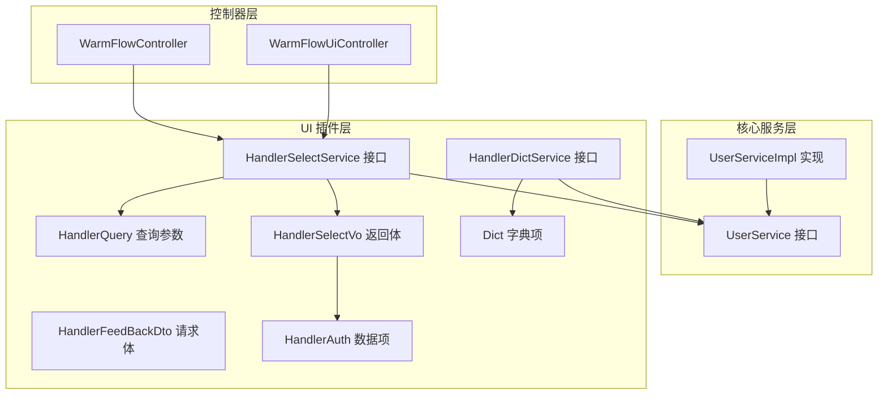
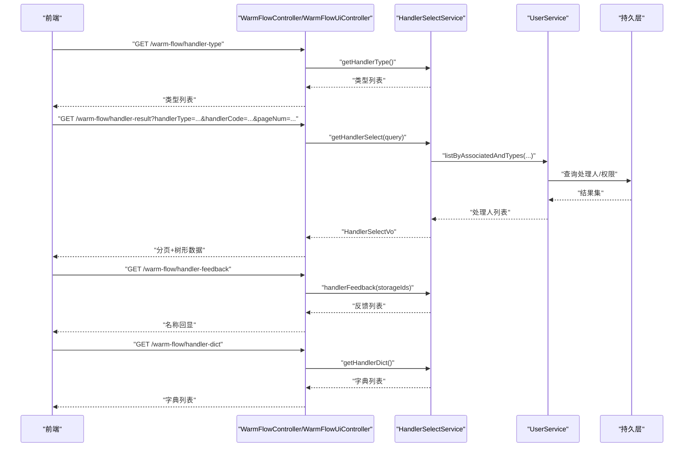
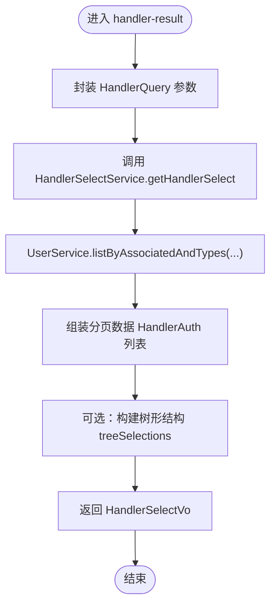
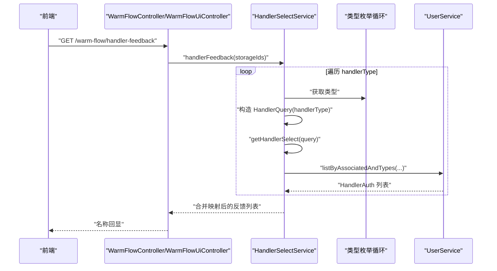
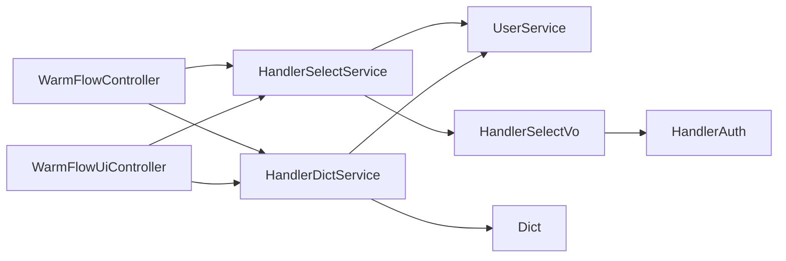

# 用户处理 API

<cite>
**本文引用的文件**   
- [UserService.java](file://warm-flow-core/src/main/java/org/dromara/warm/flow/core/service/UserService.java)
- [UserServiceImpl.java](file://warm-flow-core/src/main/java/org/dromara/warm/flow/core/service/impl/UserServiceImpl.java)
- [HandlerSelectService.java](file://warm-flow-plugin/warm-flow-plugin-ui/warm-flow-plugin-ui-core/src/main/java/org/dromara/warm/flow/ui/service/HandlerSelectService.java)
- [HandlerDictService.java](file://warm-flow-plugin/warm-flow-plugin-ui/warm-flow-plugin-ui-core/src/main/java/org/dromara/warm/flow/ui/service/HandlerDictService.java)
- [HandlerQuery.java](file://warm-flow-plugin/warm-flow-plugin-ui/warm-flow-plugin-ui-core/src/main/java/org/dromara/warm/flow/ui/dto/HandlerQuery.java)
- [HandlerFeedBackDto.java](file://warm-flow-plugin/warm-flow-plugin-ui/warm-flow-plugin-ui-core/src/main/java/org/dromara/warm/flow/ui/dto/HandlerFeedBackDto.java)
- [HandlerSelectVo.java](file://warm-flow-plugin/warm-flow-plugin-ui/warm-flow-plugin-ui-core/src/main/java/org/dromara/warm/flow/ui/vo/HandlerSelectVo.java)
- [HandlerAuth.java](file://warm-flow-plugin/warm-flow-plugin-ui/warm-flow-plugin-ui-core/src/main/java/org/dromara/warm/flow/ui/vo/HandlerAuth.java)
- [Dict.java](file://warm-flow-plugin/warm-flow-plugin-ui/warm-flow-plugin-ui-core/src/main/java/org/dromara/warm/flow/ui/vo/Dict.java)
- [WarmFlowController.java](file://warm-flow-plugin/warm-flow-plugin-ui/warm-flow-plugin-ui-sb-web/src/main/java/org/dromara/warm/flow/ui/controller/WarmFlowController.java)
- [WarmFlowUiController.java](file://warm-flow-plugin/warm-flow-plugin-ui/warm-flow-plugin-ui-sb-web/src/main/java/org/dromara/warm/flow/ui/controller/WarmFlowUiController.java)
</cite>

## 目录
1. [简介](#简介)
2. [项目结构](#项目结构)
3. [核心组件](#核心组件)
4. [架构总览](#架构总览)
5. [详细组件分析](#详细组件分析)
6. [依赖分析](#依赖分析)
7. [性能考虑](#性能考虑)
8. [故障排查指南](#故障排查指南)
9. [结论](#结论)
10. [附录](#附录)

## 简介
本文件面向“用户处理 API”的使用与集成，围绕以下核心接口进行系统化说明：
- 办理人类型接口：GET /warm-flow/handler-type
- 办理人结果查询接口：GET /warm-flow/handler-result
- 办理人反馈接口：GET /warm-flow/handler-feedback
- 办理人字典接口：GET /warm-flow/handler-dict

文档覆盖用户权限设置、用户选择机制、权限验证流程等业务逻辑；同时给出查询参数、返回数据结构、权限控制策略等技术细节，并提供完整使用示例与集成指南。

## 项目结构
用户处理 API 的后端能力由“核心服务层”和“UI 插件层”共同构成：
- 核心服务层：提供用户与流程任务的权限与处理人管理能力，包括权限查询、处理人构造、批量更新等。
- UI 插件层：提供“办理人选择”“字典”“反馈”等前端交互所需的数据模型与服务接口。

图表来源
- [UserService.java:30-165](file://warm-flow-core/src/main/java/org/dromara/warm/flow/core/service/UserService.java#L30-L165)
- [UserServiceImpl.java](file://warm-flow-core/src/main/java/org/dromara/warm/flow/core/service/impl/UserServiceImpl.java)
- [HandlerSelectService.java:39-128](file://warm-flow-plugin/warm-flow-plugin-ui/warm-flow-plugin-ui-core/src/main/java/org/dromara/warm/flow/ui/service/HandlerSelectService.java#L39-L128)
- [HandlerDictService.java:27-35](file://warm-flow-plugin/warm-flow-plugin-ui/warm-flow-plugin-ui-core/src/main/java/org/dromara/warm/flow/ui/service/HandlerDictService.java#L27-L35)
- [HandlerQuery.java:29-71](file://warm-flow-plugin/warm-flow-plugin-ui/warm-flow-plugin-ui-core/src/main/java/org/dromara/warm/flow/ui/dto/HandlerQuery.java#L29-L71)
- [HandlerSelectVo.java:34-46](file://warm-flow-plugin/warm-flow-plugin-ui/warm-flow-plugin-ui-core/src/main/java/org/dromara/warm/flow/ui/vo/HandlerSelectVo.java#L34-L46)
- [HandlerAuth.java:31-58](file://warm-flow-plugin/warm-flow-plugin-ui/warm-flow-plugin-ui-core/src/main/java/org/dromara/warm/flow/ui/vo/HandlerAuth.java#L31-L58)
- [Dict.java:33-53](file://warm-flow-plugin/warm-flow-plugin-ui/warm-flow-plugin-ui-core/src/main/java/org/dromara/warm/flow/ui/vo/Dict.java#L33-L53)
- [WarmFlowController.java](file://warm-flow-plugin/warm-flow-plugin-ui/warm-flow-plugin-ui-sb-web/src/main/java/org/dromara/warm/flow/ui/controller/WarmFlowController.java)
- [WarmFlowUiController.java](file://warm-flow-plugin/warm-flow-plugin-ui/warm-flow-plugin-ui-sb-web/src/main/java/org/dromara/warm/flow/ui/controller/WarmFlowUiController.java)

章节来源
- [UserService.java:30-165](file://warm-flow-core/src/main/java/org/dromara/warm/flow/core/service/UserService.java#L30-L165)
- [HandlerSelectService.java:39-128](file://warm-flow-plugin/warm-flow-plugin-ui/warm-flow-plugin-ui-core/src/main/java/org/dromara/warm/flow/ui/service/HandlerSelectService.java#L39-L128)

## 核心组件
- 用户服务接口（UserService）
  - 提供权限查询、处理人构造、批量更新、按条件筛选等能力，支撑流程中的“谁可以处理”“如何选择处理人”等场景。
- 办理人选择服务（HandlerSelectService）
  - 定义“类型枚举”“结果查询”“反馈回显”等接口契约，统一前端“用户/角色/部门”等多源选择体验。
- 办理人字典服务（HandlerDictService）
  - 提供“可选的办理人类型”字典，便于前端渲染下拉或树形选择控件。
- 数据传输对象与视图对象
  - HandlerQuery：查询参数载体
  - HandlerSelectVo：分页+树形组合返回体
  - HandlerAuth：单条权限/处理人数据项
  - Dict：通用字典项

章节来源
- [UserService.java:30-165](file://warm-flow-core/src/main/java/org/dromara/warm/flow/core/service/UserService.java#L30-L165)
- [HandlerSelectService.java:39-128](file://warm-flow-plugin/warm-flow-plugin-ui/warm-flow-plugin-ui-core/src/main/java/org/dromara/warm/flow/ui/service/HandlerSelectService.java#L39-L128)
- [HandlerDictService.java:27-35](file://warm-flow-plugin/warm-flow-plugin-ui/warm-flow-plugin-ui-core/src/main/java/org/dromara/warm/flow/ui/service/HandlerDictService.java#L27-L35)
- [HandlerQuery.java:29-71](file://warm-flow-plugin/warm-flow-plugin-ui/warm-flow-plugin-ui-core/src/main/java/org/dromara/warm/flow/ui/dto/HandlerQuery.java#L29-L71)
- [HandlerSelectVo.java:34-46](file://warm-flow-plugin/warm-flow-plugin-ui/warm-flow-plugin-ui-core/src/main/java/org/dromara/warm/flow/ui/vo/HandlerSelectVo.java#L34-L46)
- [HandlerAuth.java:31-58](file://warm-flow-plugin/warm-flow-plugin-ui/warm-flow-plugin-ui-core/src/main/java/org/dromara/warm/flow/ui/vo/HandlerAuth.java#L31-L58)
- [Dict.java:33-53](file://warm-flow-plugin/warm-flow-plugin-ui/warm-flow-plugin-ui-core/src/main/java/org/dromara/warm/flow/ui/vo/Dict.java#L33-L53)

## 架构总览
用户处理 API 的调用链路如下：
- 前端通过控制器发起请求
- 控制器委托 UI 插件层的服务接口（HandlerSelectService/HandlerDictService）
- 服务接口进一步调用核心服务（UserService）完成权限与处理人数据的查询与构造
- 返回统一的数据结构给前端

图表来源
- [WarmFlowController.java](file://warm-flow-plugin/warm-flow-plugin-ui/warm-flow-plugin-ui-sb-web/src/main/java/org/dromara/warm/flow/ui/controller/WarmFlowController.java)
- [WarmFlowUiController.java](file://warm-flow-plugin/warm-flow-plugin-ui/warm-flow-plugin-ui-sb-web/src/main/java/org/dromara/warm/flow/ui/controller/WarmFlowUiController.java)
- [HandlerSelectService.java:39-128](file://warm-flow-plugin/warm-flow-plugin-ui/warm-flow-plugin-ui-core/src/main/java/org/dromara/warm/flow/ui/service/HandlerSelectService.java#L39-L128)
- [UserService.java:69-87](file://warm-flow-core/src/main/java/org/dromara/warm/flow/core/service/UserService.java#L69-L87)

## 详细组件分析

### 办理人类型接口（GET /warm-flow/handler-type）
- 能力概述
  - 返回“可选的办理人类型”列表，如“用户”“角色”“部门”等，用于前端选择器初始化。
- 服务契约
  - HandlerSelectService.getHandlerType()
- 返回结构
  - 字符串数组/列表，表示可用的类型标识。
- 使用建议
  - 前端在首次加载时调用该接口，动态生成“用户/角色/部门”等切换面板。

章节来源
- [HandlerSelectService.java:46-46](file://warm-flow-plugin/warm-flow-plugin-ui/warm-flow-plugin-ui-core/src/main/java/org/dromara/warm/flow/ui/service/HandlerSelectService.java#L46-L46)

### 办理人结果查询接口（GET /warm-flow/handler-result）
- 能力概述
  - 根据查询条件返回“处理人/权限”列表，支持分页与树形结构联动。
- 查询参数（HandlerQuery）
  - handlerCode：权限编码过滤
  - handlerName：权限名称过滤
  - handlerType：类型过滤（如用户/角色/部门）
  - groupId：左侧树分组主键（如角色/部门主键）
  - pageNum/pageSize：分页参数
  - beginTime/endTime：时间范围过滤
- 返回结构（HandlerSelectVo）
  - handlerAuths：分页数据（FlowPage<HandlerAuth>）
  - treeSelections：树形选择结构（List<Tree>）
- 处理流程
  - 控制器接收参数，封装为 HandlerQuery
  - HandlerSelectService.getHandlerSelect(query) 执行查询
  - 内部可能调用 UserService.listByAssociatedAndTypes(...) 获取处理人
- 性能提示
  - 合理设置 pageNum/pageSize，避免一次性返回过多数据
  - 利用 handlerType、groupId 等条件缩小结果集

图表来源
- [HandlerQuery.java:29-71](file://warm-flow-plugin/warm-flow-plugin-ui/warm-flow-plugin-ui-core/src/main/java/org/dromara/warm/flow/ui/dto/HandlerQuery.java#L29-L71)
- [HandlerSelectService.java:54-54](file://warm-flow-plugin/warm-flow-plugin-ui/warm-flow-plugin-ui-core/src/main/java/org/dromara/warm/flow/ui/service/HandlerSelectService.java#L54-L54)
- [HandlerSelectVo.java:34-46](file://warm-flow-plugin/warm-flow-plugin-ui/warm-flow-plugin-ui-core/src/main/java/org/dromara/warm/flow/ui/vo/HandlerSelectVo.java#L34-L46)
- [HandlerAuth.java:31-58](file://warm-flow-plugin/warm-flow-plugin-ui/warm-flow-plugin-ui-core/src/main/java/org/dromara/warm/flow/ui/vo/HandlerAuth.java#L31-L58)
- [UserService.java:78-78](file://warm-flow-core/src/main/java/org/dromara/warm/flow/core/service/UserService.java#L78-L78)

章节来源
- [HandlerQuery.java:29-71](file://warm-flow-plugin/warm-flow-plugin-ui/warm-flow-plugin-ui-core/src/main/java/org/dromara/warm/flow/ui/dto/HandlerQuery.java#L29-L71)
- [HandlerSelectVo.java:34-46](file://warm-flow-plugin/warm-flow-plugin-ui/warm-flow-plugin-ui-core/src/main/java/org/dromara/warm/flow/ui/vo/HandlerSelectVo.java#L34-L46)
- [HandlerAuth.java:31-58](file://warm-flow-plugin/warm-flow-plugin-ui/warm-flow-plugin-ui-core/src/main/java/org/dromara/warm/flow/ui/vo/HandlerAuth.java#L31-L58)
- [UserService.java:78-78](file://warm-flow-core/src/main/java/org/dromara/warm/flow/core/service/UserService.java#L78-L78)

### 办理人反馈接口（GET /warm-flow/handler-feedback）
- 能力概述
  - 将存储主键集合转换为对应的“名称回显”，兼容旧项目，新项目可通过自定义优化性能。
- 请求参数（HandlerFeedBackDto）
  - storageIds：入库主键集合（如 role:xxx、user:xxx 等）
- 处理流程
  - HandlerSelectService.handlerFeedback(storageIds)
  - 内部遍历已启用的 handlerType，逐类型查询并合并映射
  - 按原顺序输出 HandlerFeedBackVo 列表
- 返回结构
  - List<HandlerFeedBackVo>：每个元素包含 storageId 与对应名称

图表来源
- [HandlerSelectService.java:62-91](file://warm-flow-plugin/warm-flow-plugin-ui/warm-flow-plugin-ui-core/src/main/java/org/dromara/warm/flow/ui/service/HandlerSelectService.java#L62-L91)
- [HandlerFeedBackDto.java:32-39](file://warm-flow-plugin/warm-flow-plugin-ui/warm-flow-plugin-ui-core/src/main/java/org/dromara/warm/flow/ui/dto/HandlerFeedBackDto.java#L32-L39)
- [UserService.java:78-78](file://warm-flow-core/src/main/java/org/dromara/warm/flow/core/service/UserService.java#L78-L78)

章节来源
- [HandlerSelectService.java:62-91](file://warm-flow-plugin/warm-flow-plugin-ui/warm-flow-plugin-ui-core/src/main/java/org/dromara/warm/flow/ui/service/HandlerSelectService.java#L62-L91)
- [HandlerFeedBackDto.java:32-39](file://warm-flow-plugin/warm-flow-plugin-ui/warm-flow-plugin-ui-core/src/main/java/org/dromara/warm/flow/ui/dto/HandlerFeedBackDto.java#L32-L39)

### 办理人字典接口（GET /warm-flow/handler-dict）
- 能力概述
  - 返回“可选的办理人类型”字典，用于前端渲染下拉或树形选择控件。
- 服务契约
  - HandlerDictService.getHandlerDict()
- 返回结构
  - List<Dict>：label/value 组成的字典项，可嵌套 childList

章节来源
- [HandlerDictService.java:34-34](file://warm-flow-plugin/warm-flow-plugin-ui/warm-flow-plugin-ui-core/src/main/java/org/dromara/warm/flow/ui/service/HandlerDictService.java#L34-L34)
- [Dict.java:33-53](file://warm-flow-plugin/warm-flow-plugin-ui/warm-flow-plugin-ui-core/src/main/java/org/dromara/warm/flow/ui/vo/Dict.java#L33-L53)

### 用户权限设置与选择机制
- 权限设置
  - 通过 UserService.updatePermission(...) 支持对关联对象（如任务/实例/节点/历史）设置权限人或处理人，支持清空与委派记录。
- 用户选择机制
  - HandlerSelectService.getHandlerSelect(...) 支持多源数据（用户/角色/部门）聚合展示，结合树形结构实现层级筛选。
- 权限验证流程
  - 查询阶段：UserService.listByAssociatedAndTypes(...) 按类型与关联 ID 过滤
  - 反馈阶段：HandlerSelectService.handlerFeedback(...) 将存储主键映射为名称
  - 控制阶段：控制器层统一封装请求与响应，确保接口一致性

章节来源
- [UserService.java:121-121](file://warm-flow-core/src/main/java/org/dromara/warm/flow/core/service/UserService.java#L121-L121)
- [UserService.java:78-78](file://warm-flow-core/src/main/java/org/dromara/warm/flow/core/service/UserService.java#L78-L78)
- [HandlerSelectService.java:54-54](file://warm-flow-plugin/warm-flow-plugin-ui/warm-flow-plugin-ui-core/src/main/java/org/dromara/warm/flow/ui/service/HandlerSelectService.java#L54-L54)
- [HandlerSelectService.java:62-91](file://warm-flow-plugin/warm-flow-plugin-ui/warm-flow-plugin-ui-core/src/main/java/org/dromara/warm/flow/ui/service/HandlerSelectService.java#L62-L91)

## 依赖分析
- 控制器依赖服务接口
  - WarmFlowController/WarmFlowUiController 依赖 HandlerSelectService/HandlerDictService
- 服务接口依赖核心服务
  - HandlerSelectService/HandlerDictService 通过 UserService 获取处理人/权限数据
- 数据模型依赖
  - HandlerSelectVo 依赖 HandlerAuth、Tree
  - Dict 作为通用字典模型被 HandlerDictService 使用

图表来源
- [WarmFlowController.java](file://warm-flow-plugin/warm-flow-plugin-ui/warm-flow-plugin-ui-sb-web/src/main/java/org/dromara/warm/flow/ui/controller/WarmFlowController.java)
- [WarmFlowUiController.java](file://warm-flow-plugin/warm-flow-plugin-ui/warm-flow-plugin-ui-sb-web/src/main/java/org/dromara/warm/flow/ui/controller/WarmFlowUiController.java)
- [HandlerSelectService.java:39-128](file://warm-flow-plugin/warm-flow-plugin-ui/warm-flow-plugin-ui-core/src/main/java/org/dromara/warm/flow/ui/service/HandlerSelectService.java#L39-L128)
- [HandlerDictService.java:27-35](file://warm-flow-plugin/warm-flow-plugin-ui/warm-flow-plugin-ui-core/src/main/java/org/dromara/warm/flow/ui/service/HandlerDictService.java#L27-L35)
- [HandlerSelectVo.java:34-46](file://warm-flow-plugin/warm-flow-plugin-ui/warm-flow-plugin-ui-core/src/main/java/org/dromara/warm/flow/ui/vo/HandlerSelectVo.java#L34-L46)
- [HandlerAuth.java:31-58](file://warm-flow-plugin/warm-flow-plugin-ui/warm-flow-plugin-ui-core/src/main/java/org/dromara/warm/flow/ui/vo/HandlerAuth.java#L31-L58)
- [Dict.java:33-53](file://warm-flow-plugin/warm-flow-plugin-ui/warm-flow-plugin-ui-core/src/main/java/org/dromara/warm/flow/ui/vo/Dict.java#L33-L53)
- [UserService.java:30-165](file://warm-flow-core/src/main/java/org/dromara/warm/flow/core/service/UserService.java#L30-L165)

章节来源
- [WarmFlowController.java](file://warm-flow-plugin/warm-flow-plugin-ui/warm-flow-plugin-ui-sb-web/src/main/java/org/dromara/warm/flow/ui/controller/WarmFlowController.java)
- [WarmFlowUiController.java](file://warm-flow-plugin/warm-flow-plugin-ui/warm-flow-plugin-ui-sb-web/src/main/java/org/dromara/warm/flow/ui/controller/WarmFlowUiController.java)
- [HandlerSelectService.java:39-128](file://warm-flow-plugin/warm-flow-plugin-ui/warm-flow-plugin-ui-core/src/main/java/org/dromara/warm/flow/ui/service/HandlerSelectService.java#L39-L128)
- [HandlerDictService.java:27-35](file://warm-flow-plugin/warm-flow-plugin-ui/warm-flow-plugin-ui-core/src/main/java/org/dromara/warm/flow/ui/service/HandlerDictService.java#L27-L35)
- [UserService.java:30-165](file://warm-flow-core/src/main/java/org/dromara/warm/flow/core/service/UserService.java#L30-L165)

## 性能考虑
- 分页与过滤
  - 合理设置 pageNum/pageSize，利用 handlerType、groupId、beginTime/endTime 等条件缩小查询范围
- 缓存与回显
  - handlerFeedback 默认实现会遍历所有类型并查询，建议在新项目中按类型预取并缓存映射，减少重复查询
- 数据结构
  - HandlerSelectVo 中的 treeSelections 仅在需要树形联动时启用，避免不必要的树构建

## 故障排查指南
- 无结果或为空
  - 检查 handlerType、handlerCode、groupId 等过滤条件是否正确
  - 确认关联 ID 是否有效，以及 UserService.listByAssociatedAndTypes(...) 的类型参数是否匹配
- 名称回显异常
  - 确认 storageIds 格式是否符合预期（如 role:xxx、user:xxx），并检查各类型查询是否返回对应映射
- 性能问题
  - 减少不分页的大列表返回，优先使用分页参数
  - 对 handlerFeedback 的默认实现进行优化，避免全量类型扫描

章节来源
- [HandlerSelectService.java:62-91](file://warm-flow-plugin/warm-flow-plugin-ui/warm-flow-plugin-ui-core/src/main/java/org/dromara/warm/flow/ui/service/HandlerSelectService.java#L62-L91)
- [UserService.java:78-78](file://warm-flow-core/src/main/java/org/dromara/warm/flow/core/service/UserService.java#L78-L78)

## 结论
用户处理 API 以 HandlerSelectService/HandlerDictService 为核心，结合 UserService 完成“类型枚举、结果查询、名称回显、字典渲染”的完整闭环。通过合理的查询参数与分页策略，可在保证性能的同时满足复杂业务场景下的权限与处理人管理需求。

## 附录

### 接口清单与参数说明
- GET /warm-flow/handler-type
  - 返回：类型列表（字符串数组）
  - 用途：初始化前端“用户/角色/部门”等选择器
- GET /warm-flow/handler-result
  - 查询参数：HandlerQuery
    - handlerCode、handlerName、handlerType、groupId、pageNum、pageSize、beginTime、endTime
  - 返回：HandlerSelectVo（包含 handlerAuths 与 treeSelections）
- GET /warm-flow/handler-feedback
  - 请求体：HandlerFeedBackDto（storageIds）
  - 返回：名称回显列表（HandlerFeedBackVo）
- GET /warm-flow/handler-dict
  - 返回：Dict 字典列表

章节来源
- [HandlerQuery.java:29-71](file://warm-flow-plugin/warm-flow-plugin-ui/warm-flow-plugin-ui-core/src/main/java/org/dromara/warm/flow/ui/dto/HandlerQuery.java#L29-L71)
- [HandlerSelectVo.java:34-46](file://warm-flow-plugin/warm-flow-plugin-ui/warm-flow-plugin-ui-core/src/main/java/org/dromara/warm/flow/ui/vo/HandlerSelectVo.java#L34-L46)
- [HandlerAuth.java:31-58](file://warm-flow-plugin/warm-flow-plugin-ui/warm-flow-plugin-ui-core/src/main/java/org/dromara/warm/flow/ui/vo/HandlerAuth.java#L31-L58)
- [Dict.java:33-53](file://warm-flow-plugin/warm-flow-plugin-ui/warm-flow-plugin-ui-core/src/main/java/org/dromara/warm/flow/ui/vo/Dict.java#L33-L53)
- [HandlerFeedBackDto.java:32-39](file://warm-flow-plugin/warm-flow-plugin-ui/warm-flow-plugin-ui-core/src/main/java/org/dromara/warm/flow/ui/dto/HandlerFeedBackDto.java#L32-L39)