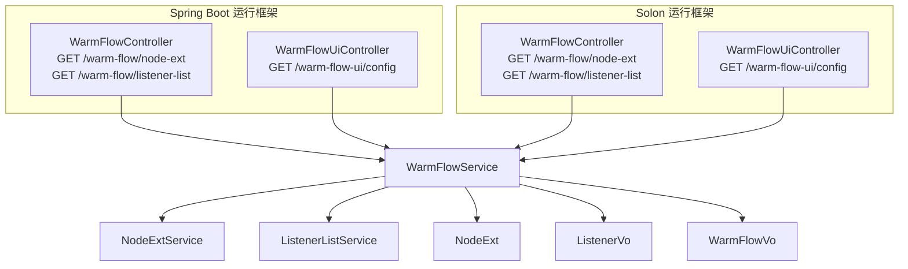
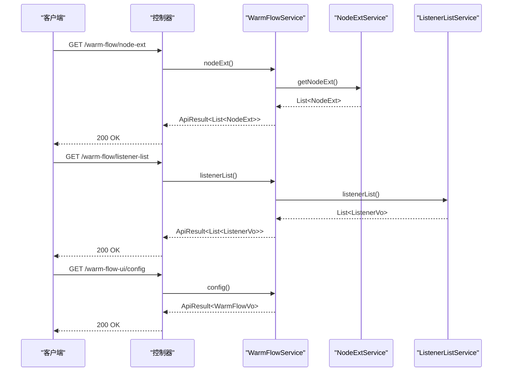
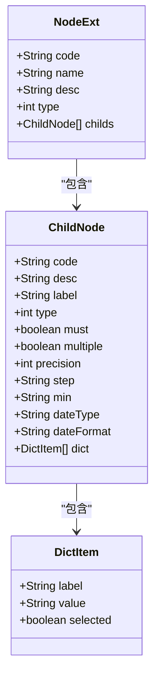
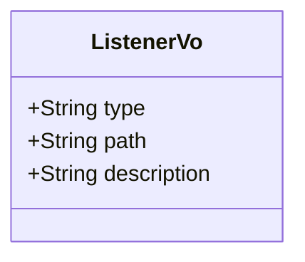
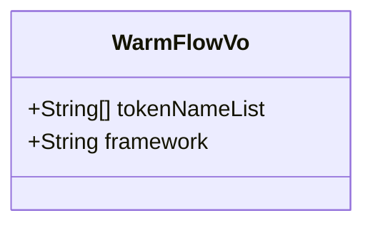
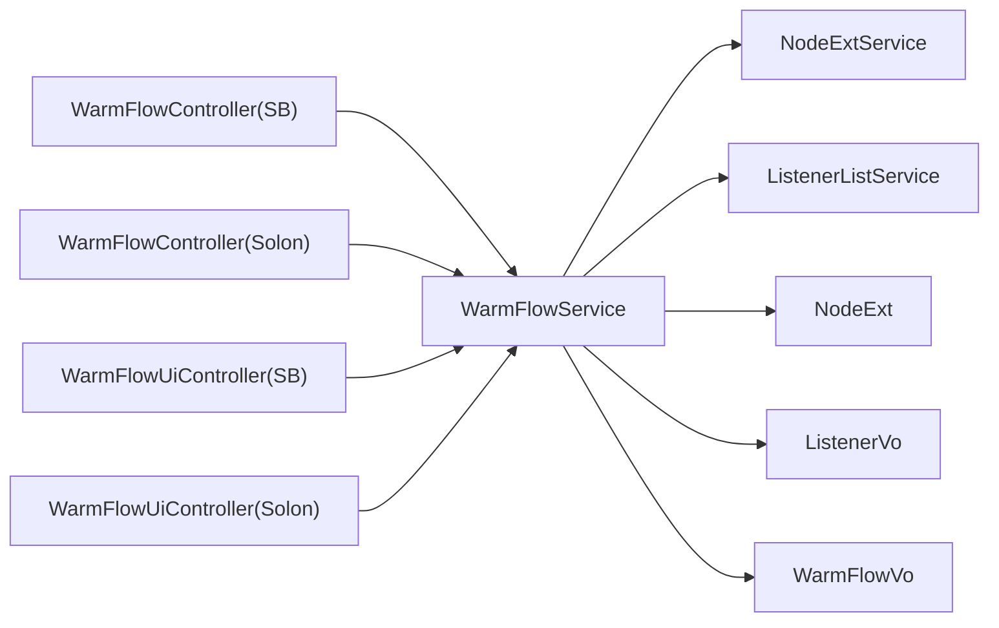

# 系统配置 API

<cite>
**本文引用的文件**
- [WarmFlowController.java](file://warm-flow/warm-flow-plugin/warm-flow-plugin-ui/warm-flow-plugin-ui-sb-web/src/main/java/org/dromara/warm/flow/ui/controller/WarmFlowController.java)
- [WarmFlowUiController.java](file://warm-flow/warm-flow-plugin/warm-flow-plugin-ui/warm-flow-plugin-ui-sb-web/src/main/java/org/dromara/warm/flow/ui/controller/WarmFlowUiController.java)
- [WarmFlowController.java](file://warm-flow/warm-flow-plugin/warm-flow-plugin-ui/warm-flow-plugin-ui-solon-web/src/main/java/org/dromara/warm/flow/ui/controller/WarmFlowController.java)
- [WarmFlowUiController.java](file://warm-flow/warm-flow-plugin/warm-flow-plugin-ui/warm-flow-plugin-ui-solon-web/src/main/java/org/dromara/warm/flow/ui/controller/WarmFlowUiController.java)
- [WarmFlowService.java](file://warm-flow/warm-flow-plugin/warm-flow-plugin-ui/warm-flow-plugin-ui-core/src/main/java/org/dromara/warm/flow/ui/service/WarmFlowService.java)
- [NodeExtService.java](file://warm-flow/warm-flow-plugin/warm-flow-plugin-ui/warm-flow-plugin-ui-core/src/main/java/org/dromara/warm/flow/ui/service/NodeExtService.java)
- [ListenerListService.java](file://warm-flow/warm-flow-plugin/warm-flow-plugin-ui/warm-flow-plugin-ui-core/src/main/java/org/dromara/warm/flow/ui/service/ListenerListService.java)
- [NodeExt.java](file://warm-flow/warm-flow-plugin/warm-flow-plugin-ui/warm-flow-plugin-ui-core/src/main/java/org/dromara/warm/flow/ui/vo/NodeExt.java)
- [ListenerVo.java](file://warm-flow/warm-flow-plugin/warm-flow-plugin-ui/warm-flow-plugin-ui-core/src/main/java/org/dromara/warm/flow/ui/vo/ListenerVo.java)
- [WarmFlowVo.java](file://warm-flow/warm-flow-plugin/warm-flow-plugin-ui/warm-flow-plugin-ui-core/src/main/java/org/dromara/warm/flow/ui/vo/WarmFlowVo.java)
</cite>

## 目录
1. [简介](#简介)
2. [项目结构](#项目结构)
3. [核心组件](#核心组件)
4. [架构总览](#架构总览)
5. [详细组件分析](#详细组件分析)
6. [依赖分析](#依赖分析)
7. [性能考虑](#性能考虑)
8. [故障排查指南](#故障排查指南)
9. [结论](#结论)
10. [附录](#附录)

## 简介
本文件聚焦于系统配置相关的 API，涵盖以下配置类接口：
- 节点扩展属性接口：GET /warm-flow/node-ext
- 监听器列表接口：GET /warm-flow/listener-list
- 系统参数配置接口：GET /warm-flow-ui/config

这些接口用于在流程设计器中动态加载节点扩展配置、监听器配置以及系统框架与鉴权参数，支撑流程设计与运行期行为的灵活定制。

## 项目结构
配置相关 API 主要分布在 UI 插件模块中，采用“控制器 → 服务 → VO/Service 接口”的分层设计，支持 Spring Boot 与 Solon 两种运行框架。

图表来源
- [WarmFlowController.java:38-216](file://warm-flow/warm-flow-plugin/warm-flow-plugin-ui/warm-flow-plugin-ui-sb-web/src/main/java/org/dromara/warm/flow/ui/controller/WarmFlowController.java#L38-L216)
- [WarmFlowUiController.java:30-44](file://warm-flow/warm-flow-plugin/warm-flow-plugin-ui/warm-flow-plugin-ui-sb-web/src/main/java/org/dromara/warm/flow/ui/controller/WarmFlowUiController.java#L30-L44)
- [WarmFlowController.java:38-243](file://warm-flow/warm-flow-plugin/warm-flow-plugin-ui/warm-flow-plugin-ui-solon-web/src/main/java/org/dromara/warm/flow/ui/controller/WarmFlowController.java#L38-L243)
- [WarmFlowUiController.java:30-45](file://warm-flow/warm-flow-plugin/warm-flow-plugin-ui/warm-flow-plugin-ui-solon-web/src/main/java/org/dromara/warm/flow/ui/controller/WarmFlowUiController.java#L30-L45)
- [WarmFlowService.java:44-375](file://warm-flow/warm-flow-plugin/warm-flow-plugin-ui/warm-flow-plugin-ui-core/src/main/java/org/dromara/warm/flow/ui/service/WarmFlowService.java#L44-L375)
- [NodeExtService.java:27-34](file://warm-flow/warm-flow-plugin/warm-flow-plugin-ui/warm-flow-plugin-ui-core/src/main/java/org/dromara/warm/flow/ui/service/NodeExtService.java#L27-L34)
- [ListenerListService.java:27-34](file://warm-flow/warm-flow-plugin/warm-flow-plugin-ui/warm-flow-plugin-ui-core/src/main/java/org/dromara/warm/flow/ui/service/ListenerListService.java#L27-L34)
- [NodeExt.java:32-78](file://warm-flow/warm-flow-plugin/warm-flow-plugin-ui/warm-flow-plugin-ui-core/src/main/java/org/dromara/warm/flow/ui/vo/NodeExt.java#L32-L78)
- [ListenerVo.java:34-51](file://warm-flow/warm-flow-plugin/warm-flow-plugin-ui/warm-flow-plugin-ui-core/src/main/java/org/dromara/warm/flow/ui/vo/ListenerVo.java#L34-L51)
- [WarmFlowVo.java:32-43](file://warm-flow/warm-flow-plugin/warm-flow-plugin-ui/warm-flow-plugin-ui-core/src/main/java/org/dromara/warm/flow/ui/vo/WarmFlowVo.java#L32-L43)

章节来源
- [WarmFlowController.java:38-216](file://warm-flow/warm-flow-plugin/warm-flow-plugin-ui/warm-flow-plugin-ui-sb-web/src/main/java/org/dromara/warm/flow/ui/controller/WarmFlowController.java#L38-L216)
- [WarmFlowUiController.java:30-44](file://warm-flow/warm-flow-plugin/warm-flow-plugin-ui/warm-flow-plugin-ui-sb-web/src/main/java/org/dromara/warm/flow/ui/controller/WarmFlowUiController.java#L30-L44)
- [WarmFlowController.java:38-243](file://warm-flow/warm-flow-plugin/warm-flow-plugin-ui/warm-flow-plugin-ui-solon-web/src/main/java/org/dromara/warm/flow/ui/controller/WarmFlowController.java#L38-L243)
- [WarmFlowUiController.java:30-45](file://warm-flow/warm-flow-plugin/warm-flow-plugin-ui/warm-flow-plugin-ui-solon-web/src/main/java/org/dromara/warm/flow/ui/controller/WarmFlowUiController.java#L30-L45)

## 核心组件
- 控制器层
  - Spring Boot：WarmFlowController、WarmFlowUiController
  - Solon：WarmFlowController、WarmFlowUiController
- 服务层：WarmFlowService
- 配置接口：
  - NodeExtService（节点扩展属性）
  - ListenerListService（监听器列表）
- 数据传输对象：
  - NodeExt（节点扩展配置）
  - ListenerVo（监听器列表项）
  - WarmFlowVo（系统配置）

章节来源
- [WarmFlowService.java:44-375](file://warm-flow/warm-flow-plugin/warm-flow-plugin-ui/warm-flow-plugin-ui-core/src/main/java/org/dromara/warm/flow/ui/service/WarmFlowService.java#L44-L375)
- [NodeExtService.java:27-34](file://warm-flow/warm-flow-plugin/warm-flow-plugin-ui/warm-flow-plugin-ui-core/src/main/java/org/dromara/warm/flow/ui/service/NodeExtService.java#L27-L34)
- [ListenerListService.java:27-34](file://warm-flow/warm-flow-plugin/warm-flow-plugin-ui/warm-flow-plugin-ui-core/src/main/java/org/dromara/warm/flow/ui/service/ListenerListService.java#L27-L34)
- [NodeExt.java:32-78](file://warm-flow/warm-flow-plugin/warm-flow-plugin-ui/warm-flow-plugin-ui-core/src/main/java/org/dromara/warm/flow/ui/vo/NodeExt.java#L32-L78)
- [ListenerVo.java:34-51](file://warm-flow/warm-flow-plugin/warm-flow-plugin-ui/warm-flow-plugin-ui-core/src/main/java/org/dromara/warm/flow/ui/vo/ListenerVo.java#L34-L51)
- [WarmFlowVo.java:32-43](file://warm-flow/warm-flow-plugin/warm-flow-plugin-ui/warm-flow-plugin-ui-core/src/main/java/org/dromara/warm/flow/ui/vo/WarmFlowVo.java#L32-L43)

## 架构总览
配置类 API 的调用链路如下：

图表来源
- [WarmFlowController.java:201-214](file://warm-flow/warm-flow-plugin/warm-flow-plugin-ui/warm-flow-plugin-ui-sb-web/src/main/java/org/dromara/warm/flow/ui/controller/WarmFlowController.java#L201-L214)
- [WarmFlowController.java:227-242](file://warm-flow/warm-flow-plugin/warm-flow-plugin-ui/warm-flow-plugin-ui-solon-web/src/main/java/org/dromara/warm/flow/ui/controller/WarmFlowController.java#L227-L242)
- [WarmFlowUiController.java:39-42](file://warm-flow/warm-flow-plugin/warm-flow-plugin-ui/warm-flow-plugin-ui-sb-web/src/main/java/org/dromara/warm/flow/ui/controller/WarmFlowUiController.java#L39-L42)
- [WarmFlowUiController.java:39-42](file://warm-flow/warm-flow-plugin/warm-flow-plugin-ui/warm-flow-plugin-ui-solon-web/src/main/java/org/dromara/warm/flow/ui/controller/WarmFlowUiController.java#L39-L42)
- [WarmFlowService.java:340-373](file://warm-flow/warm-flow-plugin/warm-flow-plugin-ui/warm-flow-plugin-ui-core/src/main/java/org/dromara/warm/flow/ui/service/WarmFlowService.java#L340-L373)
- [NodeExtService.java:27-34](file://warm-flow/warm-flow-plugin/warm-flow-plugin-ui/warm-flow-plugin-ui-core/src/main/java/org/dromara/warm/flow/ui/service/NodeExtService.java#L27-L34)
- [ListenerListService.java:27-34](file://warm-flow/warm-flow-plugin/warm-flow-plugin-ui/warm-flow-plugin-ui-core/src/main/java/org/dromara/warm/flow/ui/service/ListenerListService.java#L27-L34)

## 详细组件分析

### 节点扩展属性接口：GET /warm-flow/node-ext
- 接口职责
  - 返回流程设计器可用的节点扩展配置树，用于节点属性面板的动态渲染。
- 控制器映射
  - Spring Boot：@GetMapping("/node-ext")
  - Solon：@Get @Mapping("/node-ext")
- 服务实现要点
  - 通过依赖注入获取 NodeExtService 实例，若未实现则返回空列表。
  - 返回值封装为 ApiResult<List<NodeExt>>。
- 数据模型：NodeExt
  - 外层字段：code、name、desc、type、childs
  - 子节点 ChildNode：code、desc、label、type、must、multiple、precision、step、min、dateType、dateFormat、dict
  - 字典项 DictItem：label、value、selected
- 典型使用场景
  - 在流程节点上挂载自定义扩展属性，如“审批额度”、“生效日期”等。
  - 支持多级子节点与字典联动，便于复杂配置的可视化编辑。

图表来源
- [NodeExt.java:32-78](file://warm-flow/warm-flow-plugin/warm-flow-plugin-ui/warm-flow-plugin-ui-core/src/main/java/org/dromara/warm/flow/ui/vo/NodeExt.java#L32-L78)

章节来源
- [WarmFlowController.java:201-204](file://warm-flow/warm-flow-plugin/warm-flow-plugin-ui/warm-flow-plugin-ui-sb-web/src/main/java/org/dromara/warm/flow/ui/controller/WarmFlowController.java#L201-L204)
- [WarmFlowController.java:227-231](file://warm-flow/warm-flow-plugin/warm-flow-plugin-ui/warm-flow-plugin-ui-solon-web/src/main/java/org/dromara/warm/flow/ui/controller/WarmFlowController.java#L227-L231)
- [WarmFlowService.java:340-353](file://warm-flow/warm-flow-plugin/warm-flow-plugin-ui/warm-flow-plugin-ui-core/src/main/java/org/dromara/warm/flow/ui/service/WarmFlowService.java#L340-L353)
- [NodeExtService.java:27-34](file://warm-flow/warm-flow-plugin/warm-flow-plugin-ui/warm-flow-plugin-ui-core/src/main/java/org/dromara/warm/flow/ui/service/NodeExtService.java#L27-L34)
- [NodeExt.java:32-78](file://warm-flow/warm-flow-plugin/warm-flow-plugin-ui/warm-flow-plugin-ui-core/src/main/java/org/dromara/warm/flow/ui/vo/NodeExt.java#L32-L78)

### 监听器列表接口：GET /warm-flow/listener-list
- 接口职责
  - 返回设计器中可用的监听器列表，供节点监听器配置时选择。
- 控制器映射
  - Spring Boot：@GetMapping("/listener-list")
  - Solon：@Get @Mapping("/listener-list")
- 服务实现要点
  - 通过依赖注入获取 ListenerListService 实例，若未实现则返回空列表。
  - 返回值封装为 ApiResult<List<ListenerVo>>。
- 数据模型：ListenerVo
  - type：监听器类型（如 start、assignment、finish、create），用于前端联动
  - path：监听器全限定类路径
  - description：监听器描述

图表来源
- [ListenerVo.java:34-51](file://warm-flow/warm-flow-plugin/warm-flow-plugin-ui/warm-flow-plugin-ui-core/src/main/java/org/dromara/warm/flow/ui/vo/ListenerVo.java#L34-L51)

章节来源
- [WarmFlowController.java:211-214](file://warm-flow/warm-flow-plugin/warm-flow-plugin-ui/warm-flow-plugin-ui-sb-web/src/main/java/org/dromara/warm/flow/ui/controller/WarmFlowController.java#L211-L214)
- [WarmFlowController.java:238-242](file://warm-flow/warm-flow-plugin/warm-flow-plugin-ui/warm-flow-plugin-ui-solon-web/src/main/java/org/dromara/warm/flow/ui/controller/WarmFlowController.java#L238-L242)
- [WarmFlowService.java:360-373](file://warm-flow/warm-flow-plugin/warm-flow-plugin-ui/warm-flow-plugin-ui-core/src/main/java/org/dromara/warm/flow/ui/service/WarmFlowService.java#L360-L373)
- [ListenerListService.java:27-34](file://warm-flow/warm-flow-plugin/warm-flow-plugin-ui/warm-flow-plugin-ui-core/src/main/java/org/dromara/warm/flow/ui/service/ListenerListService.java#L27-L34)
- [ListenerVo.java:34-51](file://warm-flow/warm-flow-plugin/warm-flow-plugin-ui/warm-flow-plugin-ui-core/src/main/java/org/dromara/warm/flow/ui/vo/ListenerVo.java#L34-L51)

### 系统参数配置接口：GET /warm-flow-ui/config
- 接口职责
  - 返回工作流运行所需的系统配置，包括框架类型与鉴权头名称列表。
- 控制器映射
  - Spring Boot：@GetMapping("/config")
  - Solon：@Get @Mapping("/config")
- 服务实现要点
  - 从 FlowEngine 获取全局配置 WarmFlow，并校验 tokenName 是否配置。
  - 将 tokenName 按逗号拆分并去空，返回 ApiResult<WarmFlowVo>。
- 数据模型：WarmFlowVo
  - tokenNameList：鉴权头名称列表（如 ["Authorization"]）
  - framework：框架类型（springboot 或 solon）

图表来源
- [WarmFlowVo.java:32-43](file://warm-flow/warm-flow-plugin/warm-flow-plugin-ui/warm-flow-plugin-ui-core/src/main/java/org/dromara/warm/flow/ui/vo/WarmFlowVo.java#L32-L43)

章节来源
- [WarmFlowUiController.java:39-42](file://warm-flow/warm-flow-plugin/warm-flow-plugin-ui/warm-flow-plugin-ui-sb-web/src/main/java/org/dromara/warm/flow/ui/controller/WarmFlowUiController.java#L39-L42)
- [WarmFlowUiController.java:39-42](file://warm-flow/warm-flow-plugin/warm-flow-plugin-ui/warm-flow-plugin-ui-solon-web/src/main/java/org/dromara/warm/flow/ui/controller/WarmFlowUiController.java#L39-L42)
- [WarmFlowService.java:52-67](file://warm-flow/warm-flow-plugin/warm-flow-plugin-ui/warm-flow-plugin-ui-core/src/main/java/org/dromara/warm/flow/ui/service/WarmFlowService.java#L52-L67)
- [WarmFlowVo.java:32-43](file://warm-flow/warm-flow-plugin/warm-flow-plugin-ui/warm-flow-plugin-ui-core/src/main/java/org/dromara/warm/flow/ui/vo/WarmFlowVo.java#L32-L43)

## 依赖分析
- 控制器到服务
  - 所有配置类接口均由 WarmFlowController/WarmFlowUiController 调用 WarmFlowService 完成具体逻辑。
- 服务到扩展接口
  - nodeExt() 依赖 NodeExtService；listenerList() 依赖 ListenerListService。
- 服务到引擎配置
  - config() 依赖 FlowEngine 获取全局配置 WarmFlow。
- 运行框架适配
  - Spring Boot 使用注解 @RestController/@RequestMapping 与 @GetMapping/@PostMapping。
  - Solon 使用 @Controller/@Mapping 与 @Get/@Post。

图表来源
- [WarmFlowController.java:38-216](file://warm-flow/warm-flow-plugin/warm-flow-plugin-ui/warm-flow-plugin-ui-sb-web/src/main/java/org/dromara/warm/flow/ui/controller/WarmFlowController.java#L38-L216)
- [WarmFlowController.java:38-243](file://warm-flow/warm-flow-plugin/warm-flow-plugin-ui/warm-flow-plugin-ui-solon-web/src/main/java/org/dromara/warm/flow/ui/controller/WarmFlowController.java#L38-L243)
- [WarmFlowUiController.java:30-44](file://warm-flow/warm-flow-plugin/warm-flow-plugin-ui/warm-flow-plugin-ui-sb-web/src/main/java/org/dromara/warm/flow/ui/controller/WarmFlowUiController.java#L30-L44)
- [WarmFlowUiController.java:30-45](file://warm-flow/warm-flow-plugin/warm-flow-plugin-ui/warm-flow-plugin-ui-solon-web/src/main/java/org/dromara/warm/flow/ui/controller/WarmFlowUiController.java#L30-L45)
- [WarmFlowService.java:44-375](file://warm-flow/warm-flow-plugin/warm-flow-plugin-ui/warm-flow-plugin-ui-core/src/main/java/org/dromara/warm/flow/ui/service/WarmFlowService.java#L44-L375)
- [NodeExtService.java:27-34](file://warm-flow/warm-flow-plugin/warm-flow-plugin-ui/warm-flow-plugin-ui-core/src/main/java/org/dromara/warm/flow/ui/service/NodeExtService.java#L27-L34)
- [ListenerListService.java:27-34](file://warm-flow/warm-flow-plugin/warm-flow-plugin-ui/warm-flow-plugin-ui-core/src/main/java/org/dromara/warm/flow/ui/service/ListenerListService.java#L27-L34)
- [NodeExt.java:32-78](file://warm-flow/warm-flow-plugin/warm-flow-plugin-ui/warm-flow-plugin-ui-core/src/main/java/org/dromara/warm/flow/ui/vo/NodeExt.java#L32-L78)
- [ListenerVo.java:34-51](file://warm-flow/warm-flow-plugin/warm-flow-plugin-ui/warm-flow-plugin-ui-core/src/main/java/org/dromara/warm/flow/ui/vo/ListenerVo.java#L34-L51)
- [WarmFlowVo.java:32-43](file://warm-flow/warm-flow-plugin/warm-flow-plugin-ui/warm-flow-plugin-ui-core/src/main/java/org/dromara/warm/flow/ui/vo/WarmFlowVo.java#L32-L43)

章节来源
- [WarmFlowService.java:44-375](file://warm-flow/warm-flow-plugin/warm-flow-plugin-ui/warm-flow-plugin-ui-core/src/main/java/org/dromara/warm/flow/ui/service/WarmFlowService.java#L44-L375)

## 性能考虑
- 缓存策略
  - 节点扩展属性与监听器列表通常为静态或低频变更配置，可在业务侧实现缓存以减少每次请求的计算与查询开销。
- 分页与懒加载
  - 若未来监听器数量较大，可考虑按类型分组或前端懒加载。
- 响应体大小
  - NodeExt 的嵌套结构可能较深，建议仅返回当前节点所需字段，避免不必要的序列化成本。
- 并发与事务
  - 配置类接口均为只读查询，无需开启事务；若扩展接口涉及写操作，请遵循最小事务原则。

## 故障排查指南
- tokenName 未配置
  - 现象：/warm-flow-ui/config 返回失败提示。
  - 处理：检查 WarmFlow 配置中的 tokenName，确保非空且格式正确。
- 未实现扩展接口
  - 现象：/warm-flow/node-ext 与 /warm-flow/listener-list 返回空数组。
  - 处理：在业务系统中实现 NodeExtService 与 ListenerListService，并注册为 Spring/Solon 组件。
- 异常处理
  - WarmFlowService 对各接口进行统一异常捕获与包装，错误日志会输出到服务端日志，便于定位问题。

章节来源
- [WarmFlowService.java:52-67](file://warm-flow/warm-flow-plugin/warm-flow-plugin-ui/warm-flow-plugin-ui-core/src/main/java/org/dromara/warm/flow/ui/service/WarmFlowService.java#L52-L67)
- [WarmFlowService.java:340-353](file://warm-flow/warm-flow-plugin/warm-flow-plugin-ui/warm-flow-plugin-ui-core/src/main/java/org/dromara/warm/flow/ui/service/WarmFlowService.java#L340-L353)
- [WarmFlowService.java:360-373](file://warm-flow/warm-flow-plugin/warm-flow-plugin-ui/warm-flow-plugin-ui-core/src/main/java/org/dromara/warm/flow/ui/service/WarmFlowService.java#L360-L373)

## 结论
配置类 API 通过清晰的分层设计与可插拔的服务接口，实现了流程设计器对节点扩展属性、监听器配置与系统参数的灵活获取。结合业务系统的扩展实现，可快速适配不同场景下的流程配置需求。

## 附录

### 接口清单与响应模型

- GET /warm-flow/node-ext
  - 请求参数：无
  - 响应体：ApiResult<List<NodeExt>>
  - 说明：返回节点扩展配置树
  - 数据模型：NodeExt、ChildNode、DictItem

- GET /warm-flow/listener-list
  - 请求参数：无
  - 响应体：ApiResult<List<ListenerVo>>
  - 说明：返回监听器列表
  - 数据模型：ListenerVo

- GET /warm-flow-ui/config
  - 请求参数：无
  - 响应体：ApiResult<WarmFlowVo>
  - 说明：返回系统配置（框架类型、鉴权头名称）
  - 数据模型：WarmFlowVo

章节来源
- [WarmFlowController.java:201-214](file://warm-flow/warm-flow-plugin/warm-flow-plugin-ui/warm-flow-plugin-ui-sb-web/src/main/java/org/dromara/warm/flow/ui/controller/WarmFlowController.java#L201-L214)
- [WarmFlowController.java:227-242](file://warm-flow/warm-flow-plugin/warm-flow-plugin-ui/warm-flow-plugin-ui-solon-web/src/main/java/org/dromara/warm/flow/ui/controller/WarmFlowController.java#L227-L242)
- [WarmFlowUiController.java:39-42](file://warm-flow/warm-flow-plugin/warm-flow-plugin-ui/warm-flow-plugin-ui-sb-web/src/main/java/org/dromara/warm/flow/ui/controller/WarmFlowUiController.java#L39-L42)
- [WarmFlowUiController.java:39-42](file://warm-flow/warm-flow-plugin/warm-flow-plugin-ui/warm-flow-plugin-ui-solon-web/src/main/java/org/dromara/warm/flow/ui/controller/WarmFlowUiController.java#L39-L42)
- [NodeExt.java:32-78](file://warm-flow/warm-flow-plugin/warm-flow-plugin-ui/warm-flow-plugin-ui-core/src/main/java/org/dromara/warm/flow/ui/vo/NodeExt.java#L32-L78)
- [ListenerVo.java:34-51](file://warm-flow/warm-flow-plugin/warm-flow-plugin-ui/warm-flow-plugin-ui-core/src/main/java/org/dromara/warm/flow/ui/vo/ListenerVo.java#L34-L51)
- [WarmFlowVo.java:32-43](file://warm-flow/warm-flow-plugin/warm-flow-plugin-ui/warm-flow-plugin-ui-core/src/main/java/org/dromara/warm/flow/ui/vo/WarmFlowVo.java#L32-L43)