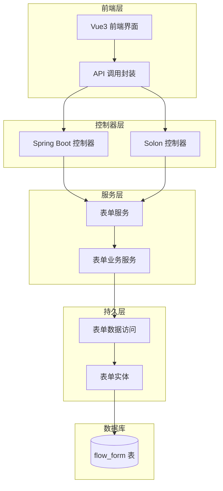
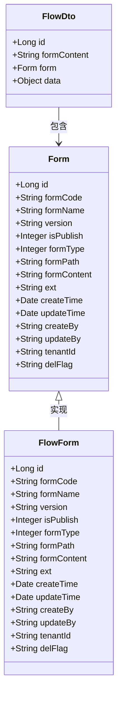
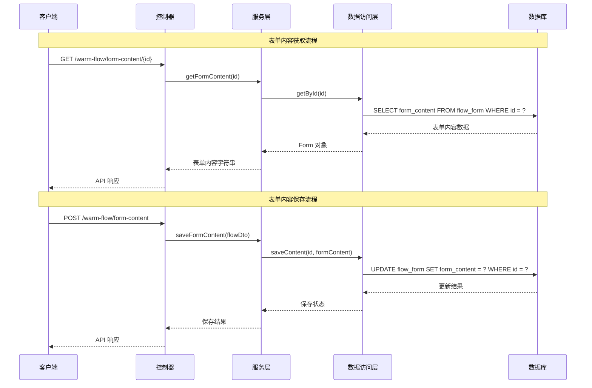
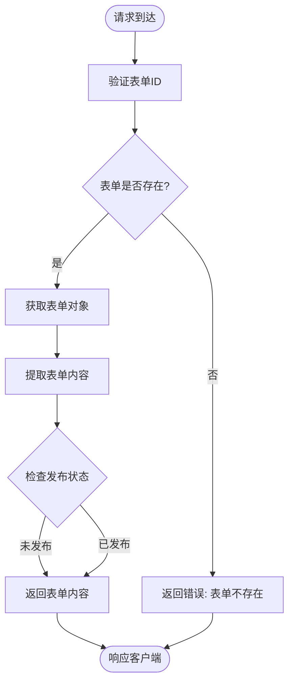
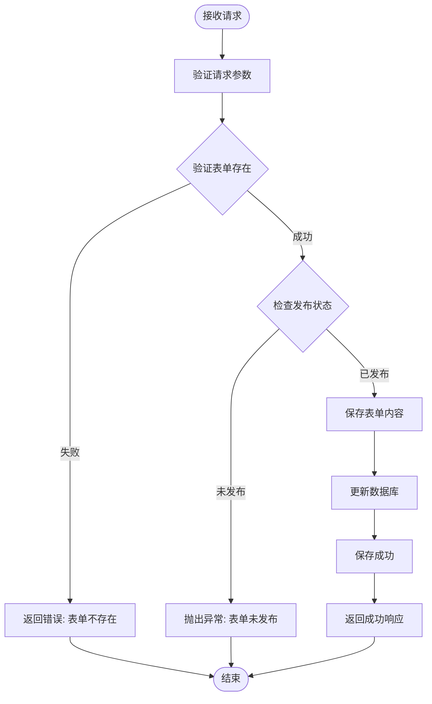
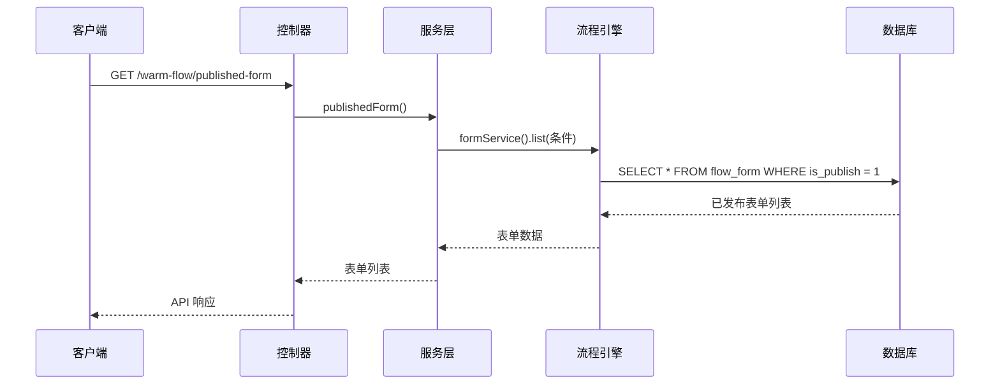
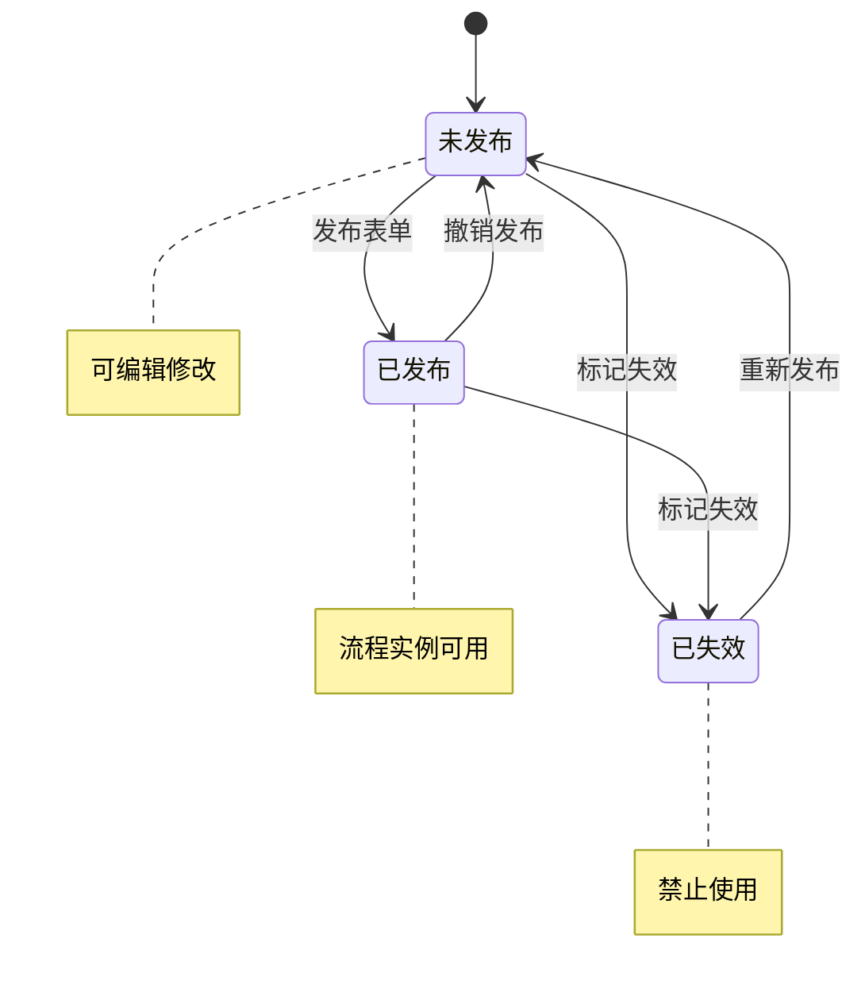
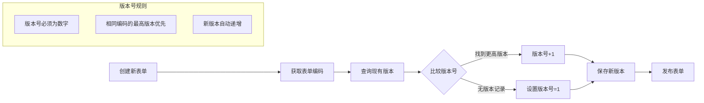
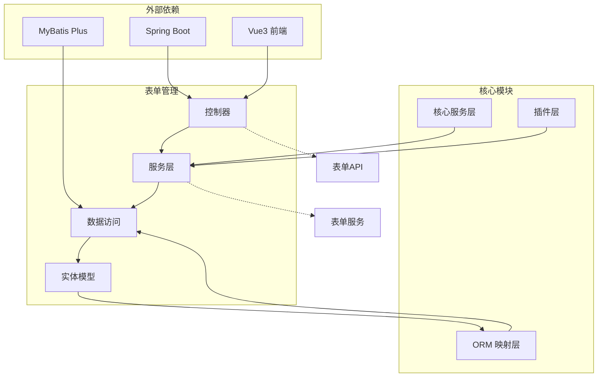

# 表单管理 API

<cite>
**本文档引用的文件**
- [WarmFlowController.java](file://warm-flow-plugin/warm-flow-plugin-ui/warm-flow-plugin-ui-sb-web/src/main/java/org/dromara/warm/flow/ui/controller/WarmFlowController.java)
- [WarmFlowController.java](file://warm-flow-plugin/warm-flow-plugin-ui/warm-flow-plugin-ui-solon-web/src/main/java/org/dromara/warm/flow/ui/controller/WarmFlowController.java)
- [WarmFlowService.java](file://warm-flow-plugin/warm-flow-plugin-ui/warm-flow-plugin-ui-core/src/main/java/org/dromara/warm/flow/ui/service/WarmFlowService.java)
- [FormService.java](file://warm-flow-core/src/main/java/org/dromara/warm/flow/core/service/FormService.java)
- [FormServiceImpl.java](file://warm-flow-core/src/main/java/org/dromara/warm/flow/core/service/impl/FormServiceImpl.java)
- [Form.java](file://warm-flow-core/src/main/java/org/dromara/warm/flow/core/entity/Form.java)
- [FlowForm.java](file://warm-flow-orm/warm-flow-mybatis-plus/warm-flow-mybatis-plus-core/src/main/java/org/dromara/warm/flow/orm/entity/FlowForm.java)
- [FlowDto.java](file://warm-flow-core/src/main/java/org/dromara/warm/flow/core/dto/FlowDto.java)
- [form.js](file://warm-flow-ui/src/api/form/form.js)
- [definition.js](file://warm-flow-ui/src/api/flow/definition.js)
- [warm-flow_form.sql](file://sql/mysql/v1-upgrade/warm-flow_form.sql)
</cite>

## 目录
1. [简介](#简介)
2. [项目结构](#项目结构)
3. [核心组件](#核心组件)
4. [架构概览](#架构概览)
5. [详细组件分析](#详细组件分析)
6. [依赖关系分析](#依赖关系分析)
7. [性能考虑](#性能考虑)
8. [故障排除指南](#故障排除指南)
9. [结论](#结论)
10. [附录](#附录)

## 简介

表单管理 API 是 Warm-Flow 工作流引擎的核心功能模块，负责管理流程表单的设计、发布、版本控制和内容存储。该模块提供了完整的表单生命周期管理能力，包括表单设计、内容编辑、版本控制、发布状态管理等功能。

Warm-Flow 支持两种表单类型：
- **内置表单**：表单内容直接存储在 `form_content` 字段中
- **外挂表单**：表单路径存储在 `form_path` 字段中，通过外部系统集成

## 项目结构

表单管理功能分布在多个模块中，采用分层架构设计：



**图表来源**
- [WarmFlowController.java:33-216](file://warm-flow-plugin/warm-flow-plugin-ui/warm-flow-plugin-ui-sb-web/src/main/java/org/dromara/warm/flow/ui/controller/WarmFlowController.java#L33-L216)
- [WarmFlowService.java:250-376](file://warm-flow-plugin/warm-flow-plugin-ui/warm-flow-plugin-ui-core/src/main/java/org/dromara/warm/flow/ui/service/WarmFlowService.java#L250-L376)
- [FormService.java:22-98](file://warm-flow-core/src/main/java/org/dromara/warm/flow/core/service/FormService.java#L22-L98)

**章节来源**
- [WarmFlowController.java:33-216](file://warm-flow-plugin/warm-flow-plugin-ui/warm-flow-plugin-ui-sb-web/src/main/java/org/dromara/warm/flow/ui/controller/WarmFlowController.java#L33-L216)
- [WarmFlowController.java:33-243](file://warm-flow-plugin/warm-flow-plugin-ui/warm-flow-plugin-ui-solon-web/src/main/java/org/dromara/warm/flow/ui/controller/WarmFlowController.java#L33-L243)

## 核心组件

### 表单实体模型

表单实体定义了完整的表单数据结构，支持多种表单类型和状态管理：



**图表来源**
- [Form.java:26-111](file://warm-flow-core/src/main/java/org/dromara/warm/flow/core/entity/Form.java#L26-L111)
- [FlowForm.java:47-115](file://warm-flow-orm/warm-flow-mybatis-plus/warm-flow-mybatis-plus-core/src/main/java/org/dromara/warm/flow/orm/entity/FlowForm.java#L47-L115)
- [FlowDto.java:31-53](file://warm-flow-core/src/main/java/org/dromara/warm/flow/core/dto/FlowDto.java#L31-L53)

### 发布状态枚举

表单发布状态管理采用枚举类型，确保状态的一致性和完整性：

| 状态值 | 状态名称 | 描述 |
|--------|----------|------|
| 0 | 未发布 | 表单已创建但未发布，可进行编辑修改 |
| 1 | 已发布 | 表单已发布，所有流程实例均可使用 |
| 9 | 已失效 | 表单被标记为失效状态 |

**章节来源**
- [Form.java:86-91](file://warm-flow-core/src/main/java/org/dromara/warm/flow/core/entity/Form.java#L86-L91)
- [PublishStatus.java:29-38](file://warm-flow-core/src/main/java/org/dromara/warm/flow/core/enums/PublishStatus.java#L29-L38)

## 架构概览

表单管理采用典型的三层架构模式，实现了清晰的职责分离：



**图表来源**
- [WarmFlowController.java:136-151](file://warm-flow-plugin/warm-flow-plugin-ui/warm-flow-plugin-ui-sb-web/src/main/java/org/dromara/warm/flow/ui/controller/WarmFlowController.java#L136-L151)
- [WarmFlowService.java:266-284](file://warm-flow-plugin/warm-flow-plugin-ui/warm-flow-plugin-ui-core/src/main/java/org/dromara/warm/flow/ui/service/WarmFlowService.java#L266-L284)

## 详细组件分析

### 表单内容获取接口

#### 接口定义
- **URL**: `/warm-flow/form-content/{id}`
- **方法**: GET
- **功能**: 获取指定 ID 的表单内容
- **参数**: 
  - `id` (路径参数): 表单唯一标识符

#### 处理流程



**图表来源**
- [WarmFlowController.java:136-139](file://warm-flow-plugin/warm-flow-plugin-ui/warm-flow-plugin-ui-sb-web/src/main/java/org/dromara/warm/flow/ui/controller/WarmFlowController.java#L136-L139)
- [WarmFlowService.java:266-273](file://warm-flow-plugin/warm-flow-plugin-ui/warm-flow-plugin-ui-core/src/main/java/org/dromara/warm/flow/ui/service/WarmFlowService.java#L266-L273)

#### 响应格式
- **成功响应**: `ApiResult<String>` - 返回表单内容字符串
- **错误响应**: `ApiResult<Void>` - 返回错误信息

**章节来源**
- [WarmFlowController.java:136-139](file://warm-flow-plugin/warm-flow-plugin-ui/warm-flow-plugin-ui-sb-web/src/main/java/org/dromara/warm/flow/ui/controller/WarmFlowController.java#L136-L139)
- [WarmFlowService.java:266-273](file://warm-flow-plugin/warm-flow-plugin-ui/warm-flow-plugin-ui-core/src/main/java/org/dromara/warm/flow/ui/service/WarmFlowService.java#L266-L273)

### 表单内容保存接口

#### 接口定义
- **URL**: `/warm-flow/form-content`
- **方法**: POST
- **功能**: 保存表单内容
- **请求体**: `FlowDto` 对象

#### 请求体结构

| 字段名 | 类型 | 必填 | 描述 |
|--------|------|------|------|
| id | Long | 是 | 表单ID |
| formContent | String | 是 | 表单内容（JSON格式） |
| form | Form | 否 | 表单元数据 |
| data | Object | 否 | 业务数据 |

#### 处理流程



**图表来源**
- [WarmFlowController.java:147-151](file://warm-flow-plugin/warm-flow-plugin-ui/warm-flow-plugin-ui-sb-web/src/main/java/org/dromara/warm/flow/ui/controller/WarmFlowController.java#L147-L151)
- [WarmFlowService.java:281-284](file://warm-flow-plugin/warm-flow-plugin-ui/warm-flow-plugin-ui-core/src/main/java/org/dromara/warm/flow/ui/service/WarmFlowService.java#L281-L284)
- [FormServiceImpl.java:112-119](file://warm-flow-core/src/main/java/org/dromara/warm/flow/core/service/impl/FormServiceImpl.java#L112-L119)

#### 响应格式
- **成功响应**: `ApiResult<Void>` - 返回操作成功
- **错误响应**: `ApiResult<Void>` - 返回错误信息

**章节来源**
- [WarmFlowController.java:147-151](file://warm-flow-plugin/warm-flow-plugin-ui/warm-flow-plugin-ui-sb-web/src/main/java/org/dromara/warm/flow/ui/controller/WarmFlowController.java#L147-L151)
- [FlowDto.java:31-53](file://warm-flow-core/src/main/java/org/dromara/warm/flow/core/dto/FlowDto.java#L31-L53)

### 已发布表单查询接口

#### 接口定义
- **URL**: `/warm-flow/published-form`
- **方法**: GET
- **功能**: 查询所有已发布的表单
- **权限**: 无需业务系统实现

#### 处理流程



**图表来源**
- [WarmFlowController.java:124-128](file://warm-flow-plugin/warm-flow-plugin-ui/warm-flow-plugin-ui-sb-web/src/main/java/org/dromara/warm/flow/ui/controller/WarmFlowController.java#L124-L128)
- [WarmFlowService.java:251-258](file://warm-flow-plugin/warm-flow-plugin-ui/warm-flow-plugin-ui-core/src/main/java/org/dromara/warm/flow/ui/service/WarmFlowService.java#L251-L258)

**章节来源**
- [WarmFlowController.java:124-128](file://warm-flow-plugin/warm-flow-plugin-ui/warm-flow-plugin-ui-sb-web/src/main/java/org/dromara/warm/flow/ui/controller/WarmFlowController.java#L124-L128)
- [definition.js:72-78](file://warm-flow-ui/src/api/flow/definition.js#L72-L78)

### 表单状态管理

表单状态管理是表单生命周期的核心功能，支持完整的发布和撤销发布流程：



**图表来源**
- [PublishStatus.java:29-38](file://warm-flow-core/src/main/java/org/dromara/warm/flow/core/enums/PublishStatus.java#L29-L38)
- [FormServiceImpl.java:54-72](file://warm-flow-core/src/main/java/org/dromara/warm/flow/core/service/impl/FormServiceImpl.java#L54-L72)

**章节来源**
- [FormService.java:45-54](file://warm-flow-core/src/main/java/org/dromara/warm/flow/core/service/FormService.java#L45-L54)
- [FormServiceImpl.java:54-72](file://warm-flow-core/src/main/java/org/dromara/warm/flow/core/service/impl/FormServiceImpl.java#L54-L72)

### 表单版本控制

表单版本控制机制确保表单的演进和历史追踪：



**图表来源**
- [FormServiceImpl.java:121-146](file://warm-flow-core/src/main/java/org/dromara/warm/flow/core/service/impl/FormServiceImpl.java#L121-L146)

**章节来源**
- [FormServiceImpl.java:121-146](file://warm-flow-core/src/main/java/org/dromara/warm/flow/core/service/impl/FormServiceImpl.java#L121-L146)

## 依赖关系分析

表单管理模块的依赖关系体现了清晰的分层架构：



**图表来源**
- [WarmFlowController.java:33-216](file://warm-flow-plugin/warm-flow-plugin-ui/warm-flow-plugin-ui-sb-web/src/main/java/org/dromara/warm/flow/ui/controller/WarmFlowController.java#L33-L216)
- [FormService.java:22-98](file://warm-flow-core/src/main/java/org/dromara/warm/flow/core/service/FormService.java#L22-L98)

**章节来源**
- [FlowFormDaoImpl.java:33-51](file://warm-flow-orm/warm-flow-mybatis-plus/warm-flow-mybatis-plus-core/src/main/java/org/dromara/warm/flow/orm/dao/FlowFormDaoImpl.java#L33-L51)

## 性能考虑

### 数据库优化
- **索引策略**: 在 `form_code` 和 `version` 字段上建立复合索引，提高查询性能
- **分页查询**: 使用分页机制处理大量表单数据
- **缓存策略**: 对常用表单内容实施缓存机制

### 接口性能
- **异步处理**: 对于大表单内容的保存操作，考虑异步处理机制
- **连接池**: 合理配置数据库连接池参数
- **超时控制**: 设置合理的请求超时时间

### 内存管理
- **内容压缩**: 对大型表单内容实施压缩存储
- **流式处理**: 对超大表单内容采用流式处理方式

## 故障排除指南

### 常见问题及解决方案

#### 表单未发布错误
**问题描述**: 尝试保存已发布表单内容时报错
**解决方案**: 
1. 检查表单当前发布状态
2. 如需修改，先撤销发布再保存
3. 确保业务流程符合发布状态要求

#### 表单不存在错误
**问题描述**: 获取表单内容时返回表单不存在
**解决方案**:
1. 验证表单ID的有效性
2. 检查表单是否已被删除
3. 确认用户权限范围

#### 数据库连接异常
**问题描述**: 表单操作过程中出现数据库连接错误
**解决方案**:
1. 检查数据库连接配置
2. 验证连接池状态
3. 查看数据库日志信息

**章节来源**
- [FormServiceImpl.java:112-119](file://warm-flow-core/src/main/java/org/dromara/warm/flow/core/service/impl/FormServiceImpl.java#L112-L119)

## 结论

表单管理 API 提供了完整的流程表单生命周期管理能力，具有以下特点：

1. **完整的功能覆盖**: 支持表单设计、内容管理、版本控制、发布状态管理
2. **灵活的架构设计**: 采用分层架构，职责清晰，易于维护和扩展
3. **强大的数据模型**: 支持多种表单类型和复杂的业务场景
4. **完善的错误处理**: 提供详细的错误信息和异常处理机制

该模块为 Warm-Flow 工作流引擎提供了坚实的基础，能够满足各种复杂的企业级应用需求。

## 附录

### 数据库表结构

| 字段名 | 类型 | 允许空 | 默认值 | 描述 |
|--------|------|--------|--------|------|
| id | bigint | 否 | 无 | 主键ID |
| form_code | varchar(40) | 否 | 无 | 表单编码 |
| form_name | varchar(100) | 否 | 无 | 表单名称 |
| version | varchar(20) | 否 | 无 | 表单版本 |
| is_publish | tinyint(1) | 否 | 0 | 发布状态 |
| form_type | tinyint(1) | 是 | 0 | 表单类型 |
| form_path | varchar(100) | 是 | NULL | 外挂表单路径 |
| form_content | longtext | 是 | NULL | 表单内容 |
| ext | varchar(400) | 是 | NULL | 扩展字段 |
| create_time | datetime | 是 | NULL | 创建时间 |
| update_time | datetime | 是 | NULL | 更新时间 |
| del_flag | char(1) | 是 | '0' | 删除标志 |
| tenant_id | varchar(40) | 是 | NULL | 租户ID |

### 接口调用示例

#### 获取表单内容
```javascript
// 前端调用示例
import { getFormContent } from '@/api/form/form'

try {
  const response = await getFormContent(123)
  console.log('表单内容:', response.data)
} catch (error) {
  console.error('获取失败:', error)
}
```

#### 保存表单内容
```javascript
// 前端调用示例
import { saveFormContent } from '@/api/form/form'

const formData = {
  id: 123,
  formContent: JSON.stringify(yourFormData),
  form: {
    formCode: 'FORM_001',
    formName: '测试表单'
  }
}

try {
  const response = await saveFormContent(formData)
  console.log('保存成功')
} catch (error) {
  console.error('保存失败:', error)
}
```

**章节来源**
- [form.js:6-20](file://warm-flow-ui/src/api/form/form.js#L6-L20)
- [warm-flow_form.sql:2-17](file://sql/mysql/v1-upgrade/warm-flow_form.sql#L2-L17)