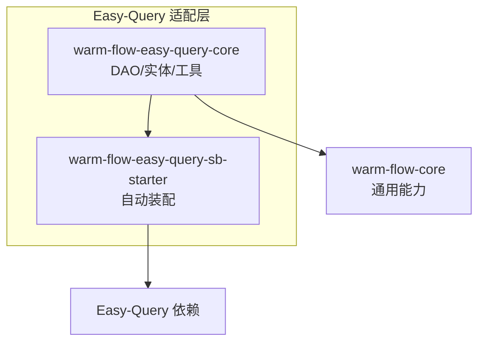
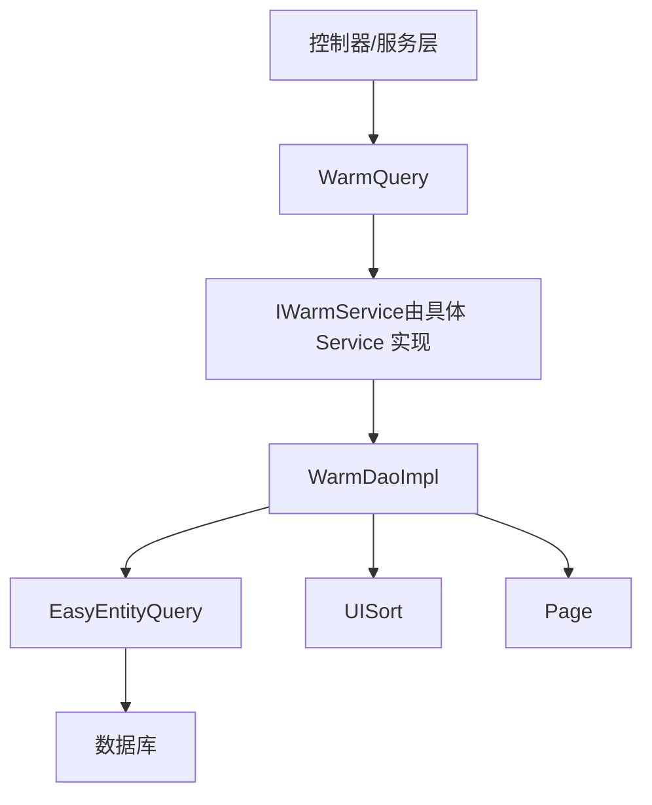
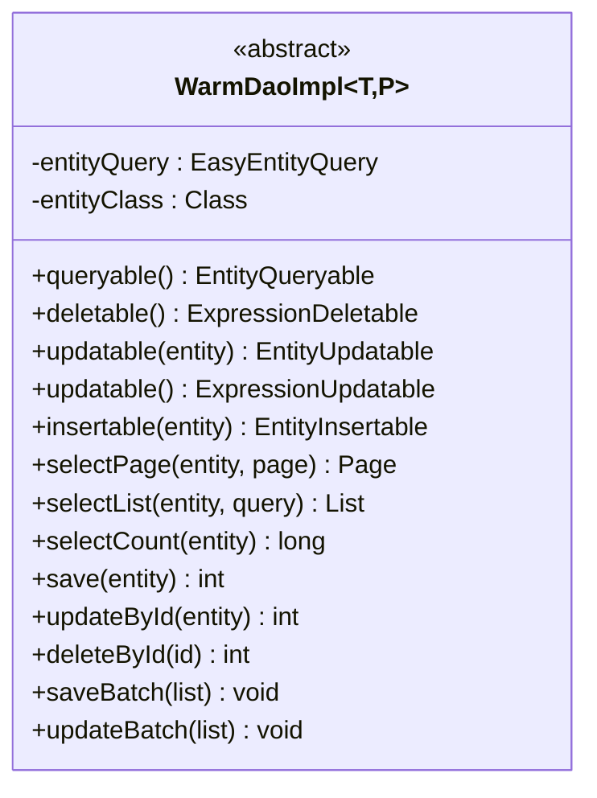
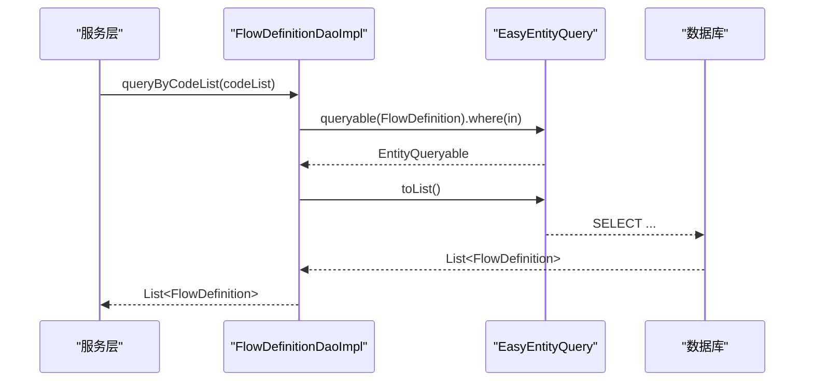
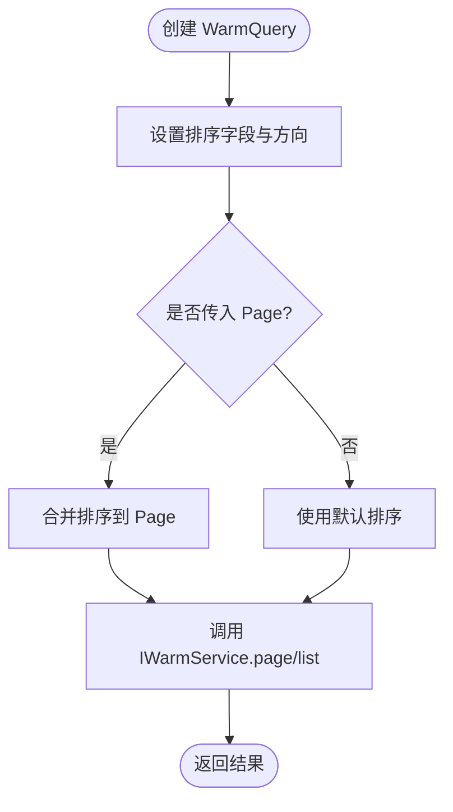
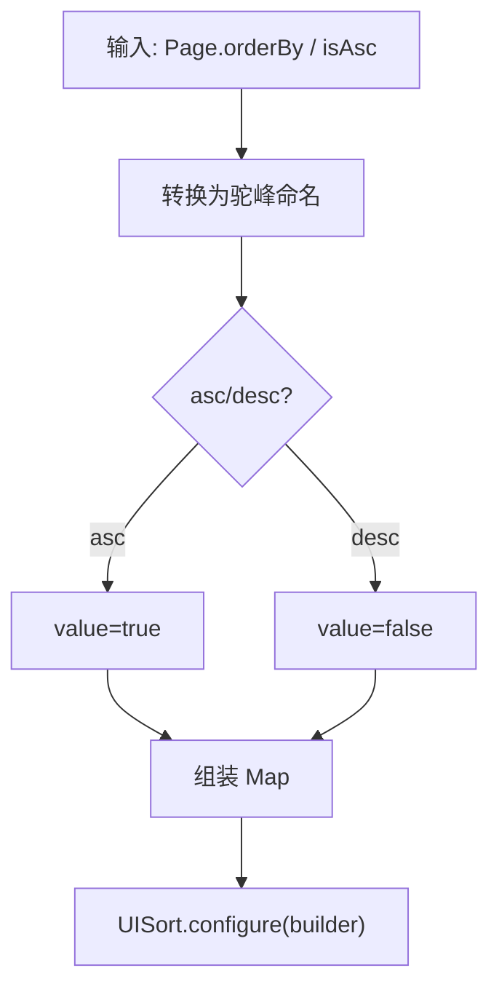
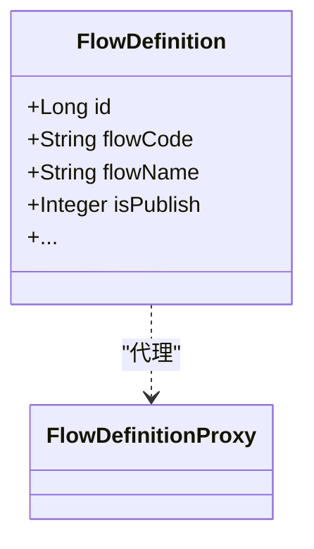
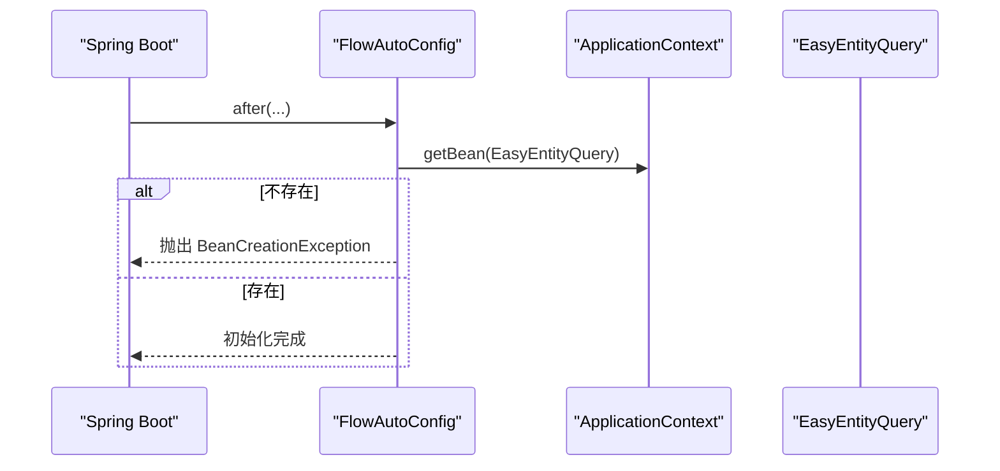
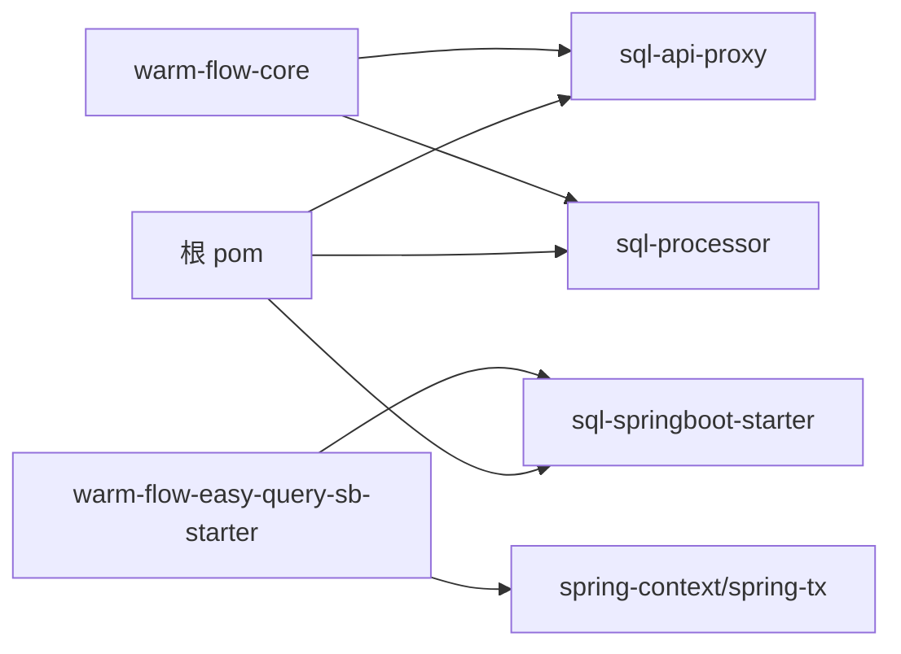

# Easy-Query 集成

<cite>
**本文引用的文件**
- [WarmDaoImpl.java](file://warm-flow-orm/warm-flow-easy-query/warm-flow-easy-query-core/src/main/java/org/dromara/warm/flow/orm/dao/WarmDaoImpl.java)
- [FlowDefinitionDaoImpl.java](file://warm-flow-orm/warm-flow-easy-query/warm-flow-easy-query-core/src/main/java/org/dromara/warm/flow/orm/dao/FlowDefinitionDaoImpl.java)
- [FlowInstanceDaoImpl.java](file://warm-flow-orm/warm-flow-easy-query/warm-flow-easy-query-core/src/main/java/org/dromara/warm/flow/orm/dao/FlowInstanceDaoImpl.java)
- [UISort.java](file://warm-flow-orm/warm-flow-easy-query/warm-flow-easy-query-core/src/main/java/org/dromara/warm/flow/orm/utils/UISort.java)
- [FlowDefinition.java](file://warm-flow-orm/warm-flow-easy-query/warm-flow-easy-query-core/src/main/java/org/dromara/warm/flow/orm/entity/FlowDefinition.java)
- [FlowInstance.java](file://warm-flow-orm/warm-flow-easy-query/warm-flow-easy-query-core/src/main/java/org/dromara/warm/flow/orm/entity/FlowInstance.java)
- [FlowTask.java](file://warm-flow-orm/warm-flow-easy-query/warm-flow-easy-query-core/src/main/java/org/dromara/warm/flow/orm/entity/FlowTask.java)
- [WarmQuery.java](file://warm-flow-core/src/main/java/org/dromara/warm/flow/core/orm/agent/WarmQuery.java)
- [Page.java](file://warm-flow-core/src/main/java/org/dromara/warm/flow/core/utils/page/Page.java)
- [WarmDao.java](file://warm-flow-core/src/main/java/org/dromara/warm/flow/core/orm/dao/WarmDao.java)
- [FlowAutoConfig.java](file://warm-flow-orm/warm-flow-easy-query/warm-flow-easy-query-sb-starter/src/main/java/org/dromara/warm/flow/spring/boot/config/FlowAutoConfig.java)
- [warm-flow-easy-query-core/pom.xml](file://warm-flow-orm/warm-flow-easy-query/warm-flow-easy-query-core/pom.xml)
- [warm-flow-easy-query-sb-starter/pom.xml](file://warm-flow-orm/warm-flow-easy-query/warm-flow-easy-query-sb-starter/pom.xml)
- [warm-flow-easy-query-sb-starter/AutoConfiguration.imports](file://warm-flow-orm/warm-flow-easy-query/warm-flow-easy-query-sb-starter/src/main/resources/META-INF/spring/org.springframework.boot.autoconfigure.AutoConfiguration.imports)
- [pom.xml（根）](file://pom.xml)
</cite>

## 目录
1. [简介](#简介)
2. [项目结构](#项目结构)
3. [核心组件](#核心组件)
4. [架构总览](#架构总览)
5. [组件详解](#组件详解)
6. [依赖关系分析](#依赖关系分析)
7. [性能考量](#性能考量)
8. [故障排查指南](#故障排查指南)
9. [结论](#结论)
10. [附录：查询语法与 API 使用](#附录查询语法与-api-使用)

## 简介
本文件面向 Easy-Query 集成的技术文档，系统阐述 Warm-Flow 在 Easy-Query 适配层的设计理念与实现机制，重点包括：
- 类型安全的查询方式与编译期检查
- 与传统 ORM 的差异（链式调用、类型推断、编译期错误检查）
- 查询语法与 API 使用（条件构建、排序、分页）
- UISort 工具类在排序中的应用
- Easy-Query 特有的性能优化与使用建议
- 与其他 ORM 框架的性能对比与选型建议

## 项目结构
Easy-Query 集成位于 warm-flow-orm 子模块下的 warm-flow-easy-query 目录，核心由三部分组成：
- easy-query-core：适配层 DAO、实体与工具类
- sb-starter：Spring Boot 自动装配与引导
- mybatis/mybatis-plus 对比模块（用于横向对比）

**图表来源**
- [warm-flow-easy-query-core/pom.xml:16-38](file://warm-flow-orm/warm-flow-easy-query/warm-flow-easy-query-core/pom.xml#L16-L38)
- [warm-flow-easy-query-sb-starter/pom.xml:16-41](file://warm-flow-orm/warm-flow-easy-query/warm-flow-easy-query-sb-starter/pom.xml#L16-L41)
- [pom.xml（根）:210-246](file://pom.xml#L210-L246)

**章节来源**
- [warm-flow-easy-query-core/pom.xml:16-38](file://warm-flow-orm/warm-flow-easy-query/warm-flow-easy-query-core/pom.xml#L16-L38)
- [warm-flow-easy-query-sb-starter/pom.xml:16-41](file://warm-flow-orm/warm-flow-easy-query/warm-flow-easy-query-sb-starter/pom.xml#L16-L41)
- [pom.xml（根）:210-246](file://pom.xml#L210-L246)

## 核心组件
- 适配层基类：WarmDaoImpl<T,P> 封装 Easy-Query 的查询、更新、删除、分页与批量操作，并通过泛型约束保证类型安全
- 具体 DAO：如 FlowDefinitionDaoImpl、FlowInstanceDaoImpl 继承基类，聚焦业务条件构建
- 查询代理：WarmQuery<T> 提供链式排序与分页入口
- 分页与排序：Page<T> 与 UISort 将 UI 层排序参数转换为 Easy-Query 动态排序
- 自动装配：FlowAutoConfig 校验 EasyEntityQuery 注入，确保运行时可用

**章节来源**
- [WarmDaoImpl.java:47-212](file://warm-flow-orm/warm-flow-easy-query/warm-flow-easy-query-core/src/main/java/org/dromara/warm/flow/orm/dao/WarmDaoImpl.java#L47-L212)
- [WarmDao.java:31-129](file://warm-flow-core/src/main/java/org/dromara/warm/flow/core/orm/dao/WarmDao.java#L31-L129)
- [WarmQuery.java:34-178](file://warm-flow-core/src/main/java/org/dromara/warm/flow/core/orm/agent/WarmQuery.java#L34-L178)
- [Page.java:33-127](file://warm-flow-core/src/main/java/org/dromara/warm/flow/core/utils/page/Page.java#L33-L127)
- [UISort.java:18-62](file://warm-flow-orm/warm-flow-easy-query/warm-flow-easy-query-core/src/main/java/org/dromara/warm/flow/orm/utils/UISort.java#L18-L62)
- [FlowAutoConfig.java:32-44](file://warm-flow-orm/warm-flow-easy-query/warm-flow-easy-query-sb-starter/src/main/java/org/dromara/warm/flow/spring/boot/config/FlowAutoConfig.java#L32-L44)

## 架构总览
Easy-Query 适配层通过 EasyEntityQuery 连接数据库，WarmDaoImpl 抽象出 CRUD 与分页能力；WarmQuery 作为查询代理，统一接入排序与分页；UISort 将 UI 输入转换为 Easy-Query 的动态排序。

**图表来源**
- [WarmQuery.java:51-86](file://warm-flow-core/src/main/java/org/dromara/warm/flow/core/orm/agent/WarmQuery.java#L51-L86)
- [WarmDaoImpl.java:132-144](file://warm-flow-orm/warm-flow-easy-query/warm-flow-easy-query-core/src/main/java/org/dromara/warm/flow/orm/dao/WarmDaoImpl.java#L132-L144)
- [UISort.java:27-52](file://warm-flow-orm/warm-flow-easy-query/warm-flow-easy-query-core/src/main/java/org/dromara/warm/flow/orm/utils/UISort.java#L27-L52)
- [Page.java:33-127](file://warm-flow-core/src/main/java/org/dromara/warm/flow/core/utils/page/Page.java#L33-L127)

## 组件详解

### WarmDaoImpl<T,P>：类型安全的适配层
- 泛型约束：T 为实体且实现 ProxyEntityAvailable，P 为对应代理类，确保编译期类型安全
- 查询对象：queryable() 返回 EntityQueryable，支持链式 where、orderBy、toPageResult 等
- 更新/删除/插入：updatable()/deletable()/insertable() 均采用仅非空列策略，减少无效写入
- 分页：结合 UISort 与 EasyPageResult 完成分页查询
- 批量：saveBatch/updateBatch 使用 Easy-Query 的 batch 执行

**图表来源**
- [WarmDaoImpl.java:47-212](file://warm-flow-orm/warm-flow-easy-query/warm-flow-easy-query-core/src/main/java/org/dromara/warm/flow/orm/dao/WarmDaoImpl.java#L47-L212)

**章节来源**
- [WarmDaoImpl.java:77-144](file://warm-flow-orm/warm-flow-easy-query/warm-flow-easy-query-core/src/main/java/org/dromara/warm/flow/orm/dao/WarmDaoImpl.java#L77-L144)
- [WarmDaoImpl.java:165-209](file://warm-flow-orm/warm-flow-easy-query/warm-flow-easy-query-core/src/main/java/org/dromara/warm/flow/orm/dao/WarmDaoImpl.java#L165-L209)

### 具体 DAO：条件构建与链式调用
- FlowDefinitionDaoImpl：基于代理对象的 where 条件（in 等），并提供发布状态批量更新
- FlowInstanceDaoImpl：按定义 ID 列表查询实例，条件构建与 FlowDefinition 类似

**图表来源**
- [FlowDefinitionDaoImpl.java:40-44](file://warm-flow-orm/warm-flow-easy-query/warm-flow-easy-query-core/src/main/java/org/dromara/warm/flow/orm/dao/FlowDefinitionDaoImpl.java#L40-L44)

**章节来源**
- [FlowDefinitionDaoImpl.java:32-52](file://warm-flow-orm/warm-flow-easy-query/warm-flow-easy-query-core/src/main/java/org/dromara/warm/flow/orm/dao/FlowDefinitionDaoImpl.java#L32-L52)
- [FlowInstanceDaoImpl.java:32-50](file://warm-flow-orm/warm-flow-easy-query/warm-flow-easy-query-core/src/main/java/org/dromara/warm/flow/orm/dao/FlowInstanceDaoImpl.java#L32-L50)

### WarmQuery<T>：链式排序与分页入口
- 支持 orderById、orderByCreateTime、orderByUpdateTime 等常用排序
- 支持 orderByAsc/orderByDesc/orderBy 自定义排序字段
- 与 Page<T> 协作，将排序方向与字段传递给适配层

**图表来源**
- [WarmQuery.java:61-86](file://warm-flow-core/src/main/java/org/dromara/warm/flow/core/orm/agent/WarmQuery.java#L61-L86)

**章节来源**
- [WarmQuery.java:94-162](file://warm-flow-core/src/main/java/org/dromara/warm/flow/core/orm/agent/WarmQuery.java#L94-L162)
- [Page.java:103-125](file://warm-flow-core/src/main/java/org/dromara/warm/flow/core/utils/page/Page.java#L103-L125)

### UISort：UI 排序到动态排序的桥梁
- 将 Page 或 WarmQuery 中的 orderBy/isAsc 转换为驼峰命名，适配 Easy-Query 代理属性
- 实现 ObjectSort，供 Easy-Query orderByObject 使用

**图表来源**
- [UISort.java:27-61](file://warm-flow-orm/warm-flow-easy-query/warm-flow-easy-query-core/src/main/java/org/dromara/warm/flow/orm/utils/UISort.java#L27-L61)

**章节来源**
- [UISort.java:18-62](file://warm-flow-orm/warm-flow-easy-query/warm-flow-easy-query-core/src/main/java/org/dromara/warm/flow/orm/utils/UISort.java#L18-L62)

### 实体与代理：类型安全的查询基础
- 实体类标注 @EntityProxy 与 @Table，配合代理类进行类型安全的列访问
- 以 FlowDefinition、FlowInstance、FlowTask 为例，展示注解与字段映射

**图表来源**
- [FlowDefinition.java:44-116](file://warm-flow-orm/warm-flow-easy-query/warm-flow-easy-query-core/src/main/java/org/dromara/warm/flow/orm/entity/FlowDefinition.java#L44-L116)

**章节来源**
- [FlowDefinition.java:44-116](file://warm-flow-orm/warm-flow-easy-query/warm-flow-easy-query-core/src/main/java/org/dromara/warm/flow/orm/entity/FlowDefinition.java#L44-L116)
- [FlowInstance.java:40-110](file://warm-flow-orm/warm-flow-easy-query/warm-flow-easy-query-core/src/main/java/org/dromara/warm/flow/orm/entity/FlowInstance.java#L40-L110)
- [FlowTask.java:43-113](file://warm-flow-orm/warm-flow-easy-query/warm-flow-easy-query-core/src/main/java/org/dromara/warm/flow/orm/entity/FlowTask.java#L43-L113)

### 自动装配与依赖校验
- FlowAutoConfig 在启动时从 Spring 上下文获取 EasyEntityQuery，若缺失则抛出异常，避免运行时失败
- Starter 依赖 Easy-Query Spring Boot Starter 与 API/Processor

**图表来源**
- [FlowAutoConfig.java:37-43](file://warm-flow-orm/warm-flow-easy-query/warm-flow-easy-query-sb-starter/src/main/java/org/dromara/warm/flow/spring/boot/config/FlowAutoConfig.java#L37-L43)

**章节来源**
- [FlowAutoConfig.java:32-44](file://warm-flow-orm/warm-flow-easy-query/warm-flow-easy-query-sb-starter/src/main/java/org/dromara/warm/flow/spring/boot/config/FlowAutoConfig.java#L32-L44)
- [warm-flow-easy-query-sb-starter/pom.xml:16-41](file://warm-flow-orm/warm-flow-easy-query/warm-flow-easy-query-sb-starter/pom.xml#L16-L41)
- [warm-flow-easy-query-core/pom.xml:16-38](file://warm-flow-orm/warm-flow-easy-query/warm-flow-easy-query-core/pom.xml#L16-L38)

## 依赖关系分析
- warm-flow-easy-query-core 依赖 warm-flow-core 与 Easy-Query API/Processor
- warm-flow-easy-query-sb-starter 依赖 Easy-Query Spring Boot Starter、Spring 上下文与 warm-flow-plugin-modes-sb
- 根 pom 统一管理 Easy-Query 版本与依赖坐标

**图表来源**
- [warm-flow-easy-query-core/pom.xml:16-38](file://warm-flow-orm/warm-flow-easy-query/warm-flow-easy-query-core/pom.xml#L16-L38)
- [warm-flow-easy-query-sb-starter/pom.xml:16-41](file://warm-flow-orm/warm-flow-easy-query/warm-flow-easy-query-sb-starter/pom.xml#L16-L41)
- [pom.xml（根）:210-246](file://pom.xml#L210-L246)

**章节来源**
- [warm-flow-easy-query-core/pom.xml:16-38](file://warm-flow-orm/warm-flow-easy-query/warm-flow-easy-query-core/pom.xml#L16-L38)
- [warm-flow-easy-query-sb-starter/pom.xml:16-41](file://warm-flow-orm/warm-flow-easy-query/warm-flow-easy-query-sb-starter/pom.xml#L16-L41)
- [pom.xml（根）:210-246](file://pom.xml#L210-L246)

## 性能考量
- 仅非空列写入：保存/更新采用“仅非空列”策略，降低无效写入与锁竞争
- 批量执行：saveBatch/updateBatch 使用 Easy-Query 的 batch，减少网络往返
- 动态排序：UISort 将 UI 排序转换为 Easy-Query 的 ObjectSort，避免字符串拼接带来的 SQL 解析开销
- 分页：通过 EasyPageResult 直接获取总数与数据，避免二次统计查询
- 编译期检查：Easy-Query 代理与 Lombok 注解在编译期完成类型推断与校验，降低运行时错误率

[本节为通用性能建议，不直接分析特定文件，故无“章节来源”]

## 故障排查指南
- 启动报错：EasyEntityQuery 未找到
  - 现象：自动装配阶段抛出 BeanCreationException
  - 处理：确认已引入 Easy-Query Spring Boot Starter 并正确扫描包
- 排序无效或字段不匹配
  - 现象：orderBy 字段与数据库不一致
  - 处理：确认 UI 传入的 orderBy 是否为驼峰命名，UISort 会自动转换
- 分页结果为空但总数不为 0
  - 现象：条件过滤导致无数据
  - 处理：检查 buildWhereCondition 与 NotNullOrEmptyValueFilter 的组合

**章节来源**
- [FlowAutoConfig.java:39-43](file://warm-flow-orm/warm-flow-easy-query/warm-flow-easy-query-sb-starter/src/main/java/org/dromara/warm/flow/spring/boot/config/FlowAutoConfig.java#L39-L43)
- [UISort.java:27-40](file://warm-flow-orm/warm-flow-easy-query/warm-flow-easy-query-core/src/main/java/org/dromara/warm/flow/orm/utils/UISort.java#L27-L40)
- [WarmDaoImpl.java:132-144](file://warm-flow-orm/warm-flow-easy-query/warm-flow-easy-query-core/src/main/java/org/dromara/warm/flow/orm/dao/WarmDaoImpl.java#L132-L144)

## 结论
Easy-Query 适配层通过类型安全的代理与编译期检查，显著提升了查询的可维护性与安全性；结合链式 API、动态排序与分页封装，使查询逻辑更清晰、性能更稳定。与传统 ORM 相比，其优势体现在：
- 类型安全与编译期错误检查
- 更自然的链式调用与类型推断
- 易于扩展的动态排序与批量操作

[本节为总结性内容，不直接分析特定文件，故无“章节来源”]

## 附录：查询语法与 API 使用

### 常用查询 API
- 分页查询：WarmQuery.page(entity, Page) → IWarmService.page → WarmDaoImpl.selectPage
- 列表查询：WarmQuery.list(entity) → IWarmService.list → WarmDaoImpl.selectList
- 条件构建：各具体 DAO 的 buildWhereCondition 使用 Easy-Query 代理对象的 eq/in 等
- 排序：WarmQuery.orderByAsc/orderByDesc/orderBy，UISort 将其转换为 ObjectSort

**章节来源**
- [WarmQuery.java:61-162](file://warm-flow-core/src/main/java/org/dromara/warm/flow/core/orm/agent/WarmQuery.java#L61-L162)
- [WarmDaoImpl.java:132-154](file://warm-flow-orm/warm-flow-easy-query/warm-flow-easy-query-core/src/main/java/org/dromara/warm/flow/orm/dao/WarmDaoImpl.java#L132-L154)
- [FlowDefinitionDaoImpl.java:64-80](file://warm-flow-orm/warm-flow-easy-query/warm-flow-easy-query-core/src/main/java/org/dromara/warm/flow/orm/dao/FlowDefinitionDaoImpl.java#L64-L80)
- [FlowInstanceDaoImpl.java:54-71](file://warm-flow-orm/warm-flow-easy-query/warm-flow-easy-query-core/src/main/java/org/dromara/warm/flow/orm/dao/FlowInstanceDaoImpl.java#L54-L71)

### 与传统 ORM 的差异
- Easy-Query：代理对象 + 链式 API + 编译期类型推断，错误在编译期暴露
- 传统 ORM：XML/注解 + 运行时反射/字符串拼接，错误易在运行期暴露
- Easy-Query 在批量、动态排序与分页方面具备更优的性能与可读性

[本节为概念性对比，不直接分析特定文件，故无“章节来源”]