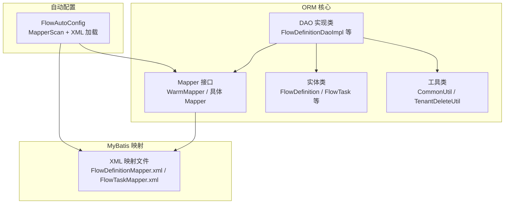
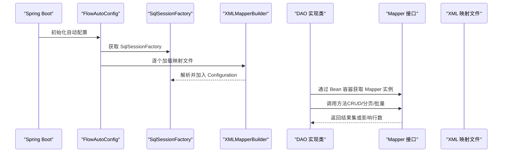
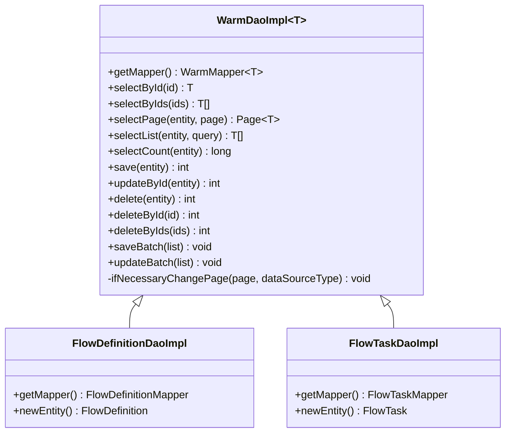
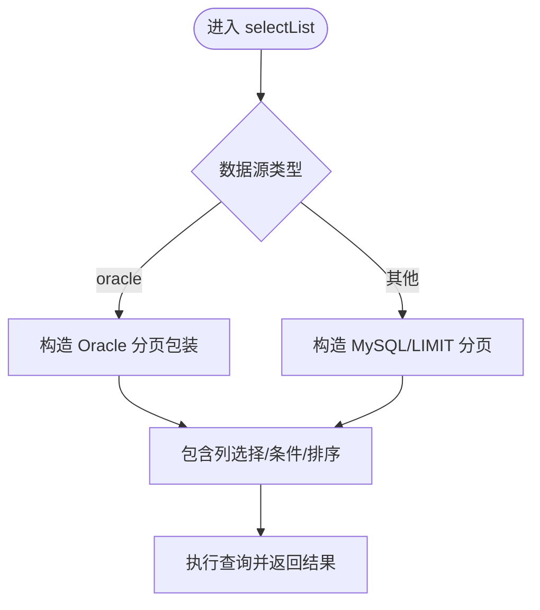
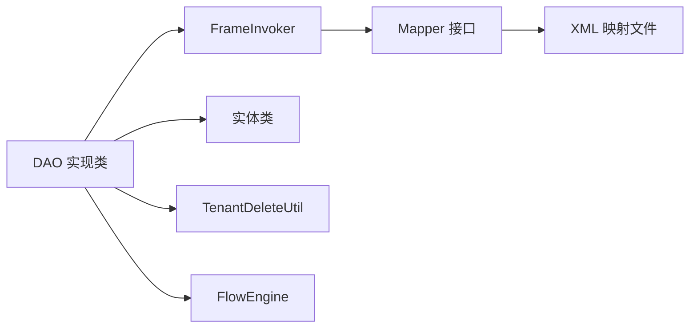

# MyBatis 集成

<cite>
**本文引用的文件**
- [WarmDaoImpl.java](file://warm-flow-orm/warm-flow-mybatis/warm-flow-mybatis-core/src/main/java/org/dromara/warm/flow/orm/dao/WarmDaoImpl.java)
- [FlowDefinitionDaoImpl.java](file://warm-flow-orm/warm-flow-mybatis/warm-flow-mybatis-core/src/main/java/org/dromara/warm/flow/orm/dao/FlowDefinitionDaoImpl.java)
- [FlowTaskDaoImpl.java](file://warm-flow-orm/warm-flow-mybatis/warm-flow-mybatis-core/src/main/java/org/dromara/warm/flow/orm/dao/FlowTaskDaoImpl.java)
- [FlowHisTaskDaoImpl.java](file://warm-flow-orm/warm-flow-mybatis/warm-flow-mybatis-core/src/main/java/org/dromara/warm/flow/orm/dao/FlowHisTaskDaoImpl.java)
- [FlowInstanceDaoImpl.java](file://warm-flow-orm/warm-flow-mybatis/warm-flow-mybatis-core/src/main/java/org/dromara/warm/flow/orm/dao/FlowInstanceDaoImpl.java)
- [FlowNodeDaoImpl.java](file://warm-flow-orm/warm-flow-mybatis/warm-flow-mybatis-core/src/main/java/org/dromara/warm/flow/orm/dao/FlowNodeDaoImpl.java)
- [FlowFormDaoImpl.java](file://warm-flow-orm/warm-flow-mybatis/warm-flow-mybatis-core/src/main/java/org/dromara/warm/flow/orm/dao/FlowFormDaoImpl.java)
- [FlowSkipDaoImpl.java](file://warm-flow-orm/warm-flow-mybatis/warm-flow-mybatis-core/src/main/java/org/dromara/warm/flow/orm/dao/FlowSkipDaoImpl.java)
- [FlowUserDaoImpl.java](file://warm-flow-orm/warm-flow-mybatis/warm-flow-mybatis-core/src/main/java/org/dromara/warm/flow/orm/dao/FlowUserDaoImpl.java)
- [WarmMapper.java](file://warm-flow-orm/warm-flow-mybatis/warm-flow-mybatis-core/src/main/java/org/dromara/warm/flow/orm/mapper/WarmMapper.java)
- [FlowDefinitionMapper.java](file://warm-flow-orm/warm-flow-mybatis/warm-flow-mybatis-core/src/main/java/org/dromara/warm/flow/orm/mapper/FlowDefinitionMapper.java)
- [FlowTaskMapper.java](file://warm-flow-orm/warm-flow-mybatis/warm-flow-mybatis-core/src/main/java/org/dromara/warm/flow/orm/mapper/FlowTaskMapper.java)
- [FlowDefinition.java](file://warm-flow-orm/warm-flow-mybatis/warm-flow-mybatis-core/src/main/java/org/dromara/warm/flow/orm/entity/FlowDefinition.java)
- [FlowTask.java](file://warm-flow-orm/warm-flow-mybatis/warm-flow-mybatis-core/src/main/java/org/dromara/warm/flow/orm/entity/FlowTask.java)
- [FlowDefinitionMapper.xml](file://warm-flow-orm/warm-flow-mybatis/warm-flow-mybatis-core/src/main/resources/warm/flow/FlowDefinitionMapper.xml)
- [FlowTaskMapper.xml](file://warm-flow-orm/warm-flow-mybatis/warm-flow-mybatis-core/src/main/resources/warm/flow/FlowTaskMapper.xml)
- [FlowAutoConfig.java](file://warm-flow-orm/warm-flow-mybatis/warm-flow-mybatis-sb-starter/src/main/java/org/dromara/warm/flow/spring/boot/config/FlowAutoConfig.java)
- [CommonUtil.java](file://warm-flow-orm/warm-flow-mybatis/warm-flow-mybatis-core/src/main/java/org/dromara/warm/flow/orm/utils/CommonUtil.java)
</cite>

## 目录
1. [简介](#简介)
2. [项目结构](#项目结构)
3. [核心组件](#核心组件)
4. [架构总览](#架构总览)
5. [详细组件分析](#详细组件分析)
6. [依赖分析](#依赖分析)
7. [性能考虑](#性能考虑)
8. [故障排查指南](#故障排查指南)
9. [结论](#结论)
10. [附录](#附录)

## 简介
本文件面向 MyBatis 集成场景，系统性梳理 Warm-Flow 在 MyBatis 方案下的适配层设计与实现细节，重点覆盖：
- 适配层基类 WarmDaoImpl 的设计模式与继承关系
- 各 DAO 实现类的职责分工与扩展点
- Mapper 接口与 XML 映射文件的配置方式、SQL 编写规范与参数绑定
- 自动配置类 FlowAutoConfig 的作用与配置项
- MyBatis 特有功能使用示例（动态 SQL、批量操作）
- 性能优化建议与最佳实践

## 项目结构
MyBatis 集成位于 warm-flow-orm 模块下，核心目录组织如下：
- orm/dao：DAO 层实现，统一继承 WarmDaoImpl
- orm/mapper：Mapper 接口与 XML 映射文件
- orm/entity：实体类
- utils：通用工具类（数据源类型识别、租户/逻辑删除辅助）
- starter：Spring Boot 自动配置，负责扫描 Mapper 并加载 XML

图表来源
- [FlowAutoConfig.java:38-72](file://warm-flow-orm/warm-flow-mybatis/warm-flow-mybatis-sb-starter/src/main/java/org/dromara/warm/flow/spring/boot/config/FlowAutoConfig.java#L38-L72)
- [WarmDaoImpl.java:38-155](file://warm-flow-orm/warm-flow-mybatis/warm-flow-mybatis-core/src/main/java/org/dromara/warm/flow/orm/dao/WarmDaoImpl.java#L38-L155)
- [WarmMapper.java:31-148](file://warm-flow-orm/warm-flow-mybatis/warm-flow-mybatis-core/src/main/java/org/dromara/warm/flow/orm/mapper/WarmMapper.java#L31-L148)

章节来源
- [FlowAutoConfig.java:38-72](file://warm-flow-orm/warm-flow-mybatis/warm-flow-mybatis-sb-starter/src/main/java/org/dromara/warm/flow/spring/boot/config/FlowAutoConfig.java#L38-L72)
- [WarmDaoImpl.java:38-155](file://warm-flow-orm/warm-flow-mybatis/warm-flow-mybatis-core/src/main/java/org/dromara/warm/flow/orm/dao/WarmDaoImpl.java#L38-L155)

## 核心组件
- WarmDaoImpl：DAO 适配层基类，封装通用 CRUD、分页、批量、逻辑删除等能力，并注入租户过滤与数据源类型感知
- WarmMapper：基础 Mapper 接口，定义统一的查询、更新、删除、批量插入等方法签名
- 各具体 DAO 实现类：按领域划分（流程定义、任务、历史任务、实例、节点、表单、跳转、用户），复用基类能力并扩展领域方法
- XML 映射文件：基于 MyBatis 动态 SQL 实现条件查询、分页、批量插入（MySQL/Oracle 两套方言）

章节来源
- [WarmDaoImpl.java:38-155](file://warm-flow-orm/warm-flow-mybatis/warm-flow-mybatis-core/src/main/java/org/dromara/warm/flow/orm/dao/WarmDaoImpl.java#L38-L155)
- [WarmMapper.java:31-148](file://warm-flow-orm/warm-flow-mybatis/warm-flow-mybatis-core/src/main/java/org/dromara/warm/flow/orm/mapper/WarmMapper.java#L31-L148)

## 架构总览
MyBatis 集成采用“接口 + XML”的约定优于配置策略，结合自动配置完成：
- Mapper 接口扫描与注册
- XML 映射文件动态加载
- 数据源类型识别与分页参数转换
- DAO 层统一能力下沉至 WarmDaoImpl

图表来源
- [FlowAutoConfig.java:55-70](file://warm-flow-orm/warm-flow-mybatis/warm-flow-mybatis-sb-starter/src/main/java/org/dromara/warm/flow/spring/boot/config/FlowAutoConfig.java#L55-L70)
- [FlowDefinitionDaoImpl.java:34-37](file://warm-flow-orm/warm-flow-mybatis/warm-flow-mybatis-core/src/main/java/org/dromara/warm/flow/orm/dao/FlowDefinitionDaoImpl.java#L34-L37)
- [FlowTaskDaoImpl.java:36-39](file://warm-flow-orm/warm-flow-mybatis/warm-flow-mybatis-core/src/main/java/org/dromara/warm/flow/orm/dao/FlowTaskDaoImpl.java#L36-L39)

## 详细组件分析

### WarmDaoImpl 基类设计与继承关系
- 设计模式：模板方法 + 组合（通过 getMapper() 获取具体 Mapper 实例）
- 关键职责：
  - 统一处理租户过滤（TenantDeleteUtil）
  - 统一分页参数转换（根据数据源类型调整偏移/上限）
  - 统一逻辑删除与物理删除分支
  - 统一批量保存（saveBatch）与批量更新（updateBatch）
- 继承关系：各领域 DAO 实现类继承 WarmDaoImpl，仅需实现 getMapper() 与 newEntity()

图表来源
- [WarmDaoImpl.java:38-155](file://warm-flow-orm/warm-flow-mybatis/warm-flow-mybatis-core/src/main/java/org/dromara/warm/flow/orm/dao/WarmDaoImpl.java#L38-L155)
- [FlowDefinitionDaoImpl.java:32-55](file://warm-flow-orm/warm-flow-mybatis/warm-flow-mybatis-core/src/main/java/org/dromara/warm/flow/orm/dao/FlowDefinitionDaoImpl.java#L32-L55)
- [FlowTaskDaoImpl.java:34-66](file://warm-flow-orm/warm-flow-mybatis/warm-flow-mybatis-core/src/main/java/org/dromara/warm/flow/orm/dao/FlowTaskDaoImpl.java#L34-L66)

章节来源
- [WarmDaoImpl.java:38-155](file://warm-flow-orm/warm-flow-mybatis/warm-flow-mybatis-core/src/main/java/org/dromara/warm/flow/orm/dao/WarmDaoImpl.java#L38-L155)

### Mapper 接口与 XML 映射文件
- Mapper 接口：定义标准 CRUD、分页、批量、逻辑删除等方法，参数通过 @Param 注解绑定
- XML 映射：
  - 使用 <sql> 抽象公共片段（列选择、条件拼接、分页、批量插入）
  - 使用 <choose>/<when>/<otherwise> 支持 Oracle/MySQL 双方言
  - 使用 <include refid="..."/> 复用片段，提升可维护性
  - 使用 <foreach> 实现 in 子句与批量插入

图表来源
- [FlowDefinitionMapper.xml:180-203](file://warm-flow-orm/warm-flow-mybatis/warm-flow-mybatis-core/src/main/resources/warm/flow/FlowDefinitionMapper.xml#L180-L203)
- [FlowTaskMapper.xml:161-183](file://warm-flow-orm/warm-flow-mybatis/warm-flow-mybatis-core/src/main/resources/warm/flow/FlowTaskMapper.xml#L161-L183)

章节来源
- [WarmMapper.java:31-148](file://warm-flow-orm/warm-flow-mybatis/warm-flow-mybatis-core/src/main/java/org/dromara/warm/flow/orm/mapper/WarmMapper.java#L31-L148)
- [FlowDefinitionMapper.xml:180-427](file://warm-flow-orm/warm-flow-mybatis/warm-flow-mybatis-core/src/main/resources/warm/flow/FlowDefinitionMapper.xml#L180-L427)
- [FlowTaskMapper.xml:161-378](file://warm-flow-orm/warm-flow-mybatis/warm-flow-mybatis-core/src/main/resources/warm/flow/FlowTaskMapper.xml#L161-L378)

### 各 DAO 实现类职责分工
- FlowDefinitionDaoImpl：流程定义相关查询（按编码列表）、发布状态更新等
- FlowTaskDaoImpl：待办任务相关（按实例+节点编码查询、按实例 ID 列表删除）
- FlowHisTaskDaoImpl：历史任务相关（排除退回、按实例+节点编码查询、按实例 ID 列表删除、按任务 ID+协作类型查询）
- FlowInstanceDaoImpl：流程实例按定义 ID 列表查询
- FlowNodeDaoImpl：流程节点按节点编码+定义 ID 查询、按定义 ID 列表批量删除（含逻辑删除）
- FlowFormDaoImpl：表单按编码列表查询
- FlowSkipDaoImpl：按定义 ID 列表批量删除跳转关联（含逻辑删除）
- FlowUserDaoImpl：按任务 ID 列表删除、按关联与类型组合查询、按处理人与类型组合查询

章节来源
- [FlowDefinitionDaoImpl.java:32-55](file://warm-flow-orm/warm-flow-mybatis/warm-flow-mybatis-core/src/main/java/org/dromara/warm/flow/orm/dao/FlowDefinitionDaoImpl.java#L32-L55)
- [FlowTaskDaoImpl.java:34-66](file://warm-flow-orm/warm-flow-mybatis/warm-flow-mybatis-core/src/main/java/org/dromara/warm/flow/orm/dao/FlowTaskDaoImpl.java#L34-L66)
- [FlowHisTaskDaoImpl.java:34-71](file://warm-flow-orm/warm-flow-mybatis/warm-flow-mybatis-core/src/main/java/org/dromara/warm/flow/orm/dao/FlowHisTaskDaoImpl.java#L34-L71)
- [FlowInstanceDaoImpl.java:32-49](file://warm-flow-orm/warm-flow-mybatis/warm-flow-mybatis-core/src/main/java/org/dromara/warm/flow/orm/dao/FlowInstanceDaoImpl.java#L32-L49)
- [FlowNodeDaoImpl.java:37-69](file://warm-flow-orm/warm-flow-mybatis/warm-flow-mybatis-core/src/main/java/org/dromara/warm/flow/orm/dao/FlowNodeDaoImpl.java#L37-L69)
- [FlowFormDaoImpl.java:32-48](file://warm-flow-orm/warm-flow-mybatis/warm-flow-mybatis-core/src/main/java/org/dromara/warm/flow/orm/dao/FlowFormDaoImpl.java#L32-L48)
- [FlowSkipDaoImpl.java:35-63](file://warm-flow-orm/warm-flow-mybatis/warm-flow-mybatis-core/src/main/java/org/dromara/warm/flow/orm/dao/FlowSkipDaoImpl.java#L35-L63)
- [FlowUserDaoImpl.java:35-79](file://warm-flow-orm/warm-flow-mybatis/warm-flow-mybatis-core/src/main/java/org/dromara/warm/flow/orm/dao/FlowUserDaoImpl.java#L35-L79)

### 自动配置类 FlowAutoConfig
- 作用：
  - 通过 @MapperScan 扫描 Mapper 接口
  - 在 after 回调中加载指定 XML 映射文件
  - 识别数据源类型并设置到全局配置
- 关键配置项：
  - warm-flow.enabled：控制自动装配开关（默认启用）
  - Mapper 接口包扫描：org.dromara.warm.flow.orm.mapper
  - XML 文件清单：FlowDefinitionMapper.xml、FlowHisTaskMapper.xml、FlowInstanceMapper.xml、FlowNodeMapper.xml、FlowFormMapper.xml、FlowSkipMapper.xml、FlowTaskMapper.xml、FlowUserMapper.xml

章节来源
- [FlowAutoConfig.java:38-72](file://warm-flow-orm/warm-flow-mybatis/warm-flow-mybatis-sb-starter/src/main/java/org/dromara/warm/flow/spring/boot/config/FlowAutoConfig.java#L38-L72)
- [CommonUtil.java:34-61](file://warm-flow-orm/warm-flow-mybatis/warm-flow-mybatis-core/src/main/java/org/dromara/warm/flow/orm/utils/CommonUtil.java#L34-L61)

## 依赖分析
- DAO 与 Mapper：DAO 通过 FrameInvoker 获取具体 Mapper 实例，实现低耦合
- DAO 与实体：DAO 通过 newEntity() 与 TenantDeleteUtil 统一构造实体，确保租户与逻辑删除字段一致
- DAO 与工具：WarmDaoImpl 依赖 FlowEngine 与 CommonUtil 进行数据源类型识别与分页转换
- XML 与 Mapper：XML 中的 namespace 必须与 Mapper 接口全限定名一致，方法 id 与接口方法签名匹配

图表来源
- [FlowDefinitionDaoImpl.java:34-37](file://warm-flow-orm/warm-flow-mybatis/warm-flow-mybatis-core/src/main/java/org/dromara/warm/flow/orm/dao/FlowDefinitionDaoImpl.java#L34-L37)
- [FlowTaskDaoImpl.java:36-39](file://warm-flow-orm/warm-flow-mybatis/warm-flow-mybatis-core/src/main/java/org/dromara/warm/flow/orm/dao/FlowTaskDaoImpl.java#L36-L39)
- [WarmDaoImpl.java:66-68](file://warm-flow-orm/warm-flow-mybatis/warm-flow-mybatis-core/src/main/java/org/dromara/warm/flow/orm/dao/WarmDaoImpl.java#L66-L68)

章节来源
- [FlowDefinitionDaoImpl.java:32-55](file://warm-flow-orm/warm-flow-mybatis/warm-flow-mybatis-core/src/main/java/org/dromara/warm/flow/orm/dao/FlowDefinitionDaoImpl.java#L32-L55)
- [FlowTaskDaoImpl.java:34-66](file://warm-flow-orm/warm-flow-mybatis/warm-flow-mybatis-core/src/main/java/org/dromara/warm/flow/orm/dao/FlowTaskDaoImpl.java#L34-L66)
- [WarmDaoImpl.java:38-155](file://warm-flow-orm/warm-flow-mybatis/warm-flow-mybatis-core/src/main/java/org/dromara/warm/flow/orm/dao/WarmDaoImpl.java#L38-L155)

## 性能考虑
- 分页与数据源适配
  - Oracle 分页采用子查询包裹 ROWNUM 方式；MySQL 使用 LIMIT/OFFSET
  - WarmDaoImpl 在 selectPage 中根据数据源类型转换 pageNum/pageSize，避免跨库分页差异导致的性能问题
- 动态 SQL
  - XML 中大量使用 <where>、<if>、<choose> 组合，按需拼接条件，减少无效查询
- 批量操作
  - saveBatch 根据数据源类型选择不同批量插入语法（MySQL 直插 vs Oracle union all）
  - updateBatch 默认逐条 updateById，适合小批量；大批量建议在 XML 中补充批量更新语句以降低往返
- 逻辑删除
  - 通过 updateLogic/updateByIdLogic 将删除标记写入 delFlag 字段，避免真实删除带来的索引维护成本
- 参数绑定
  - 使用 @Param("entity")、@Param("ids") 等命名参数，提升可读性与可维护性

章节来源
- [WarmDaoImpl.java:65-75](file://warm-flow-orm/warm-flow-mybatis/warm-flow-mybatis-core/src/main/java/org/dromara/warm/flow/orm/dao/WarmDaoImpl.java#L65-L75)
- [FlowDefinitionMapper.xml:180-203](file://warm-flow-orm/warm-flow-mybatis/warm-flow-mybatis-core/src/main/resources/warm/flow/FlowDefinitionMapper.xml#L180-L203)
- [FlowTaskMapper.xml:161-183](file://warm-flow-orm/warm-flow-mybatis/warm-flow-mybatis-core/src/main/resources/warm/flow/FlowTaskMapper.xml#L161-L183)
- [FlowDefinitionMapper.xml:417-427](file://warm-flow-orm/warm-flow-mybatis/warm-flow-mybatis-core/src/main/resources/warm/flow/FlowDefinitionMapper.xml#L417-L427)
- [FlowTaskMapper.xml:368-378](file://warm-flow-orm/warm-flow-mybatis/warm-flow-mybatis-core/src/main/resources/warm/flow/FlowTaskMapper.xml#L368-L378)

## 故障排查指南
- 自动配置未生效
  - 检查 warm-flow.enabled 是否为 true（默认启用）
  - 确认 Mapper 接口包扫描路径与实际包一致
- XML 映射加载失败
  - 确认 XML 文件路径与 FlowAutoConfig 中清单一致
  - 检查 XML namespace 与 Mapper 接口全限定名一致
- 分页异常（Oracle）
  - 确认传入 Page 的 pageNum/pageSize 已被 WarmDaoImpl 正确转换
- 逻辑删除不生效
  - 确认实体 delFlag 字段已正确设置，且逻辑删除值与配置一致
- 数据源类型识别失败
  - CommonUtil 会尝试从连接元数据推断，若失败则兜底为 mysql；可在配置中显式指定

章节来源
- [FlowAutoConfig.java:38-72](file://warm-flow-orm/warm-flow-mybatis/warm-flow-mybatis-sb-starter/src/main/java/org/dromara/warm/flow/spring/boot/config/FlowAutoConfig.java#L38-L72)
- [CommonUtil.java:34-61](file://warm-flow-orm/warm-flow-mybatis/warm-flow-mybatis-core/src/main/java/org/dromara/warm/flow/orm/utils/CommonUtil.java#L34-L61)
- [WarmDaoImpl.java:148-153](file://warm-flow-orm/warm-flow-mybatis/warm-flow-mybatis-core/src/main/java/org/dromara/warm/flow/orm/dao/WarmDaoImpl.java#L148-L153)

## 结论
MyBatis 集成通过 WarmDaoImpl 提供统一的 CRUD、分页、批量与逻辑删除能力，DAO 实现类专注于领域方法扩展；Mapper 接口与 XML 映射文件配合，利用动态 SQL 与方言适配实现高性能与高可维护性；FlowAutoConfig 负责自动装配与 XML 加载，简化接入成本。遵循本文最佳实践，可在多数据源环境下稳定运行并获得良好性能。

## 附录
- 实体类参考
  - [FlowDefinition.java:36-141](file://warm-flow-orm/warm-flow-mybatis/warm-flow-mybatis-core/src/main/java/org/dromara/warm/flow/orm/entity/FlowDefinition.java#L36-L141)
  - [FlowTask.java:34-133](file://warm-flow-orm/warm-flow-mybatis/warm-flow-mybatis-core/src/main/java/org/dromara/warm/flow/orm/entity/FlowTask.java#L34-L133)
- Mapper 接口参考
  - [WarmMapper.java:31-148](file://warm-flow-orm/warm-flow-mybatis/warm-flow-mybatis-core/src/main/java/org/dromara/warm/flow/orm/mapper/WarmMapper.java#L31-L148)
  - [FlowDefinitionMapper.java:29-40](file://warm-flow-orm/warm-flow-mybatis/warm-flow-mybatis-core/src/main/java/org/dromara/warm/flow/orm/mapper/FlowDefinitionMapper.java#L29-L40)
  - [FlowTaskMapper.java:31-65](file://warm-flow-orm/warm-flow-mybatis/warm-flow-mybatis-core/src/main/java/org/dromara/warm/flow/orm/mapper/FlowTaskMapper.java#L31-L65)
- XML 映射参考
  - [FlowDefinitionMapper.xml:1-428](file://warm-flow-orm/warm-flow-mybatis/warm-flow-mybatis-core/src/main/resources/warm/flow/FlowDefinitionMapper.xml#L1-L428)
  - [FlowTaskMapper.xml:1-379](file://warm-flow-orm/warm-flow-mybatis/warm-flow-mybatis-core/src/main/resources/warm/flow/FlowTaskMapper.xml#L1-L379)