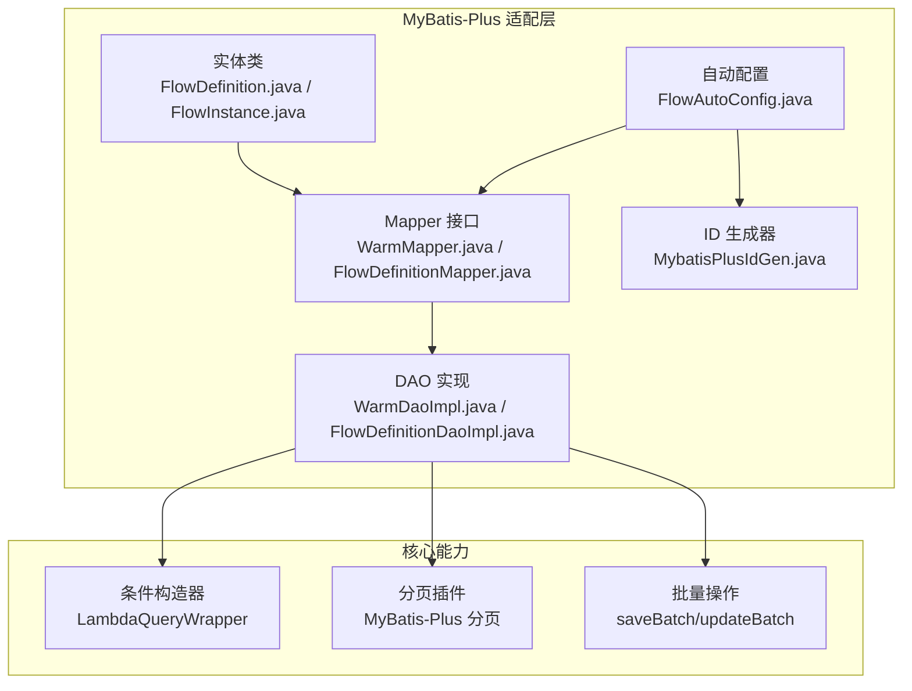
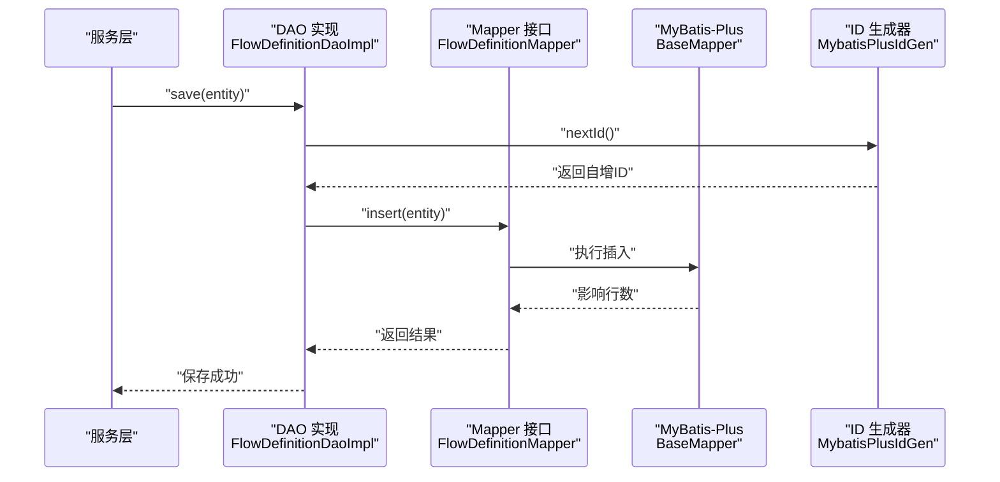
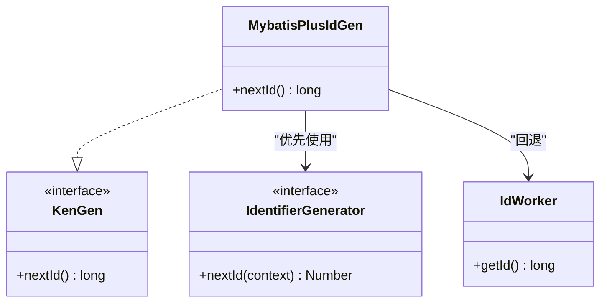
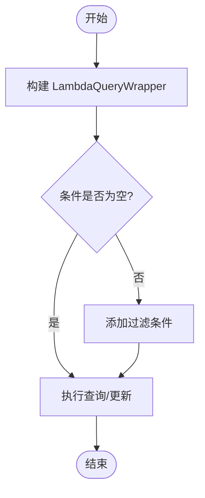
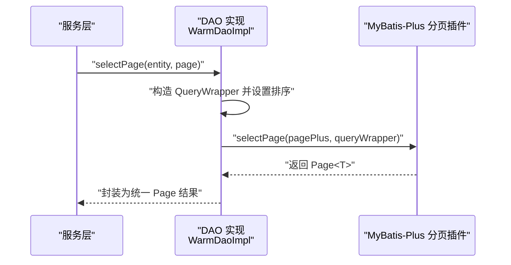
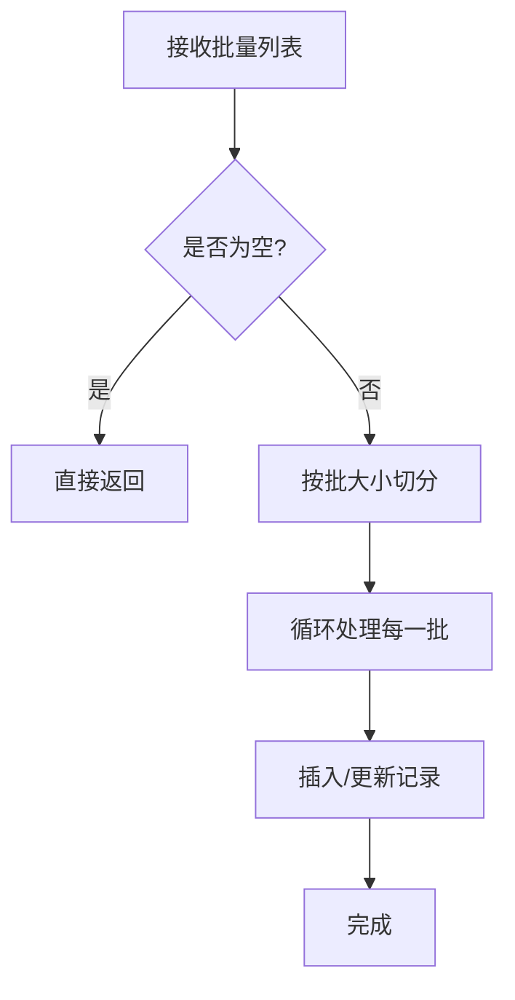
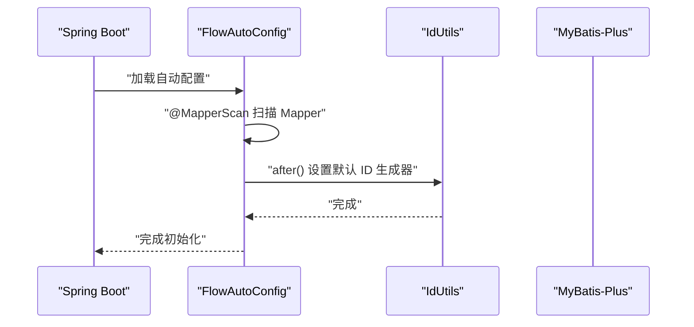
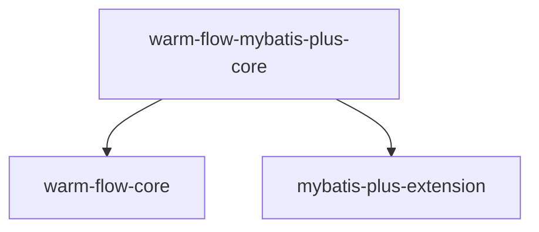

# MyBatis-Plus 集成

<cite>
**本文引用的文件**
- [MybatisPlusIdGen.java](file://warm-flow-orm/warm-flow-mybatis-plus/warm-flow-mybatis-plus-core/src/main/java/org/dromara/warm/flow/orm/keygen/MybatisPlusIdGen.java)
- [FlowDefinition.java](file://warm-flow-orm/warm-flow-mybatis-plus/warm-flow-mybatis-plus-core/src/main/java/org/dromara/warm/flow/orm/entity/FlowDefinition.java)
- [FlowInstance.java](file://warm-flow-orm/warm-flow-mybatis-plus/warm-flow-mybatis-plus-core/src/main/java/org/dromara/warm/flow/orm/entity/FlowInstance.java)
- [FlowDefinitionMapper.java](file://warm-flow-orm/warm-flow-mybatis-plus/warm-flow-mybatis-plus-core/src/main/java/org/dromara/warm/flow/orm/mapper/FlowDefinitionMapper.java)
- [FlowDefinitionMapper.xml](file://warm-flow-orm/warm-flow-mybatis-plus/warm-flow-mybatis-plus-core/src/main/resources/warm/flow/FlowDefinitionMapper.xml)
- [FlowDefinitionDaoImpl.java](file://warm-flow-orm/warm-flow-mybatis-plus/warm-flow-mybatis-plus-core/src/main/java/org/dromara/warm/flow/orm/dao/FlowDefinitionDaoImpl.java)
- [WarmMapper.java](file://warm-flow-orm/warm-flow-mybatis-plus/warm-flow-mybatis-plus-core/src/main/java/org/dromara/warm/flow/orm/mapper/WarmMapper.java)
- [WarmDaoImpl.java](file://warm-flow-orm/warm-flow-mybatis-plus/warm-flow-mybatis-plus-core/src/main/java/org/dromara/warm/flow/orm/dao/WarmDaoImpl.java)
- [FlowAutoConfig.java](file://warm-flow-orm/warm-flow-mybatis-plus/warm-flow-mybatis-plus-sb-starter/src/main/java/org/dromara/warm/flow/spring/boot/config/FlowAutoConfig.java)
- [WarmServiceImpl.java](file://warm-flow-core/src/main/java/org/dromara/warm/flow/core/orm/service/impl/WarmServiceImpl.java)
- [pom.xml](file://warm-flow-orm/warm-flow-mybatis-plus/warm-flow-mybatis-plus-core/pom.xml)
</cite>

## 目录
1. [简介](#简介)
2. [项目结构](#项目结构)
3. [核心组件](#核心组件)
4. [架构总览](#架构总览)
5. [详细组件分析](#详细组件分析)
6. [依赖分析](#依赖分析)
7. [性能考虑](#性能考虑)
8. [故障排查指南](#故障排查指南)
9. [结论](#结论)
10. [附录](#附录)

## 简介
本文件面向 MyBatis-Plus 集成场景，系统性梳理 Warm-Flow 在 MyBatis-Plus 适配层中的设计与实现，重点覆盖以下方面：
- 自动 ID 生成器 MybatisPlusIdGen 的实现原理与扩展点
- 与标准 MyBatis 相比的优势：条件构造器、分页插件、批量操作、实体注解映射等
- 实体类注解使用规范：表名映射、字段映射、主键策略、逻辑删除等
- 条件构造器 QueryWrapper/LambdaQueryWrapper 的使用方法与最佳实践
- 分页查询、批量保存/更新等高级功能的实现示例
- 与 Spring Boot 自动配置的集成方式与关键配置参数说明

## 项目结构
MyBatis-Plus 适配层位于 warm-flow-orm/warm-flow-mybatis-plus 下，核心模块包括：
- 实体与映射：ORM 实体类与 MyBatis-Plus 注解结合，定义表结构与字段映射
- Mapper 接口：基于 BaseMapper 的 WarmMapper 抽象，统一 CRUD 能力
- DAO 实现：基于 WarmDaoImpl 的具体 DAO，封装分页、条件查询、批量操作
- ID 生成：MybatisPlusIdGen 基于 MyBatis-Plus IdentifierGenerator，支持框架注入与降级
- 自动配置：Spring Boot Starter 中的 FlowAutoConfig，负责 Mapper 扫描与默认 ID 生成器设置

图表来源
- [FlowDefinition.java:37-44](file://warm-flow-orm/warm-flow-mybatis-plus/warm-flow-mybatis-plus-core/src/main/java/org/dromara/warm/flow/orm/entity/FlowDefinition.java#L37-L44)
- [FlowInstance.java:33-40](file://warm-flow-orm/warm-flow-mybatis-plus/warm-flow-mybatis-plus-core/src/main/java/org/dromara/warm/flow/orm/entity/FlowInstance.java#L33-L40)
- [WarmMapper.java:27-29](file://warm-flow-orm/warm-flow-mybatis-plus/warm-flow-mybatis-plus-core/src/main/java/org/dromara/warm/flow/orm/mapper/WarmMapper.java#L27-L29)
- [FlowDefinitionMapper.java:26-28](file://warm-flow-orm/warm-flow-mybatis-plus/warm-flow-mybatis-plus-core/src/main/java/org/dromara/warm/flow/orm/mapper/FlowDefinitionMapper.java#L26-L28)
- [WarmDaoImpl.java:39-145](file://warm-flow-orm/warm-flow-mybatis-plus/warm-flow-mybatis-plus-core/src/main/java/org/dromara/warm/flow/orm/dao/WarmDaoImpl.java#L39-L145)
- [FlowDefinitionDaoImpl.java:32-58](file://warm-flow-orm/warm-flow-mybatis-plus/warm-flow-mybatis-plus-core/src/main/java/org/dromara/warm/flow/orm/dao/FlowDefinitionDaoImpl.java#L32-L58)
- [MybatisPlusIdGen.java:28-45](file://warm-flow-orm/warm-flow-mybatis-plus/warm-flow-mybatis-plus-core/src/main/java/org/dromara/warm/flow/orm/keygen/MybatisPlusIdGen.java#L28-L45)
- [FlowAutoConfig.java:32-42](file://warm-flow-orm/warm-flow-mybatis-plus/warm-flow-mybatis-plus-sb-starter/src/main/java/org/dromara/warm/flow/spring/boot/config/FlowAutoConfig.java#L32-L42)

章节来源
- [pom.xml:16-30](file://warm-flow-orm/warm-flow-mybatis-plus/warm-flow-mybatis-plus-core/pom.xml#L16-L30)

## 核心组件
- 实体注解与映射
  - 表名映射：@TableName 明确实体与物理表的对应关系
  - 字段映射：@TableField 控制字段与列的映射及填充策略
  - 主键策略：@TableId 定义主键字段；MyBatis-Plus 默认雪花算法，可通过自定义 ID 生成器替换
  - 逻辑删除：@TableLogic 定义逻辑删除字段与删除值
- Mapper 接口：WarmMapper 继承 BaseMapper，提供通用 CRUD 能力
- DAO 实现：WarmDaoImpl 封装分页、条件查询、批量操作等通用逻辑
- 条件构造器：LambdaQueryWrapper 提供类型安全的链式条件构建
- 分页插件：基于 MyBatis-Plus 分页插件，统一 Page 结果封装
- 批量操作：saveBatch、updateBatch 支持分批提交，提升吞吐
- ID 生成：MybatisPlusIdGen 优先使用容器中的 IdentifierGenerator，否则回退到 IdWorker

章节来源
- [FlowDefinition.java:37-77](file://warm-flow-orm/warm-flow-mybatis-plus/warm-flow-mybatis-plus-core/src/main/java/org/dromara/warm/flow/orm/entity/FlowDefinition.java#L37-L77)
- [FlowInstance.java:33-73](file://warm-flow-orm/warm-flow-mybatis-plus/warm-flow-mybatis-plus-core/src/main/java/org/dromara/warm/flow/orm/entity/FlowInstance.java#L33-L73)
- [WarmMapper.java:27-29](file://warm-flow-orm/warm-flow-mybatis-plus/warm-flow-mybatis-plus-core/src/main/java/org/dromara/warm/flow/orm/mapper/WarmMapper.java#L27-L29)
- [WarmDaoImpl.java:66-143](file://warm-flow-orm/warm-flow-mybatis-plus/warm-flow-mybatis-plus-core/src/main/java/org/dromara/warm/flow/orm/dao/WarmDaoImpl.java#L66-L143)
- [MybatisPlusIdGen.java:36-43](file://warm-flow-orm/warm-flow-mybatis-plus/warm-flow-mybatis-plus-core/src/main/java/org/dromara/warm/flow/orm/keygen/MybatisPlusIdGen.java#L36-L43)

## 架构总览
下图展示从服务层到 DAO、Mapper、MyBatis-Plus 的调用链路，以及 ID 生成器的装配过程。

图表来源
- [FlowDefinitionDaoImpl.java:40-42](file://warm-flow-orm/warm-flow-mybatis-plus/warm-flow-mybatis-plus-core/src/main/java/org/dromara/warm/flow/orm/dao/FlowDefinitionDaoImpl.java#L40-L42)
- [FlowDefinitionMapper.java:26-28](file://warm-flow-orm/warm-flow-mybatis-plus/warm-flow-mybatis-plus-core/src/main/java/org/dromara/warm/flow/orm/mapper/FlowDefinitionMapper.java#L26-L28)
- [MybatisPlusIdGen.java:36-43](file://warm-flow-orm/warm-flow-mybatis-plus/warm-flow-mybatis-plus-core/src/main/java/org/dromara/warm/flow/orm/keygen/MybatisPlusIdGen.java#L36-L43)

## 详细组件分析

### 自动 ID 生成器 MybatisPlusIdGen
- 设计目标：在不直接依赖具体数据库的情况下，提供统一的 ID 生成能力，并兼容 MyBatis-Plus 的 IdentifierGenerator
- 实现要点：
  - 通过容器获取 IdentifierGenerator，若存在则委托其生成 ID
  - 若容器中不存在，则回退到 IdWorker 雪花算法
  - 同步方法保证并发安全
- 扩展建议：
  - 可在 Spring 上下文中注册自定义 IdentifierGenerator Bean，以替换默认雪花算法
  - 适用于多租户或分片场景时，可结合业务规则定制 ID 生成策略

图表来源
- [MybatisPlusIdGen.java:28-45](file://warm-flow-orm/warm-flow-mybatis-plus/warm-flow-mybatis-plus-core/src/main/java/org/dromara/warm/flow/orm/keygen/MybatisPlusIdGen.java#L28-L45)

章节来源
- [MybatisPlusIdGen.java:36-43](file://warm-flow-orm/warm-flow-mybatis-plus/warm-flow-mybatis-plus-core/src/main/java/org/dromara/warm/flow/orm/keygen/MybatisPlusIdGen.java#L36-L43)

### 条件构造器与查询封装
- 使用 LambdaQueryWrapper 构建类型安全的查询条件
- 示例场景：
  - 批量查询：按列表字段 in 查询
  - 批量更新：按主键集合批量更新状态
- 最佳实践：
  - 优先使用 LambdaQueryWrapper，避免硬编码字符串
  - 复杂条件组合时，拆分为多个子条件并复用
  - 注意空值与集合判空，避免生成无效 SQL

图表来源
- [FlowDefinitionDaoImpl.java:45-56](file://warm-flow-orm/warm-flow-mybatis-plus/warm-flow-mybatis-plus-core/src/main/java/org/dromara/warm/flow/orm/dao/FlowDefinitionDaoImpl.java#L45-L56)

章节来源
- [FlowDefinitionDaoImpl.java:44-56](file://warm-flow-orm/warm-flow-mybatis-plus/warm-flow-mybatis-plus-core/src/main/java/org/dromara/warm/flow/orm/dao/FlowDefinitionDaoImpl.java#L44-L56)

### 分页查询实现
- 通过 WarmDaoImpl.selectPage 将传入 Page 转换为 MyBatis-Plus 的分页对象
- 自动拼接排序字段与方向
- 返回统一封装的 Page 结果

图表来源
- [WarmDaoImpl.java:66-83](file://warm-flow-orm/warm-flow-mybatis-plus/warm-flow-mybatis-plus-core/src/main/java/org/dromara/warm/flow/orm/dao/WarmDaoImpl.java#L66-L83)

章节来源
- [WarmDaoImpl.java:66-83](file://warm-flow-orm/warm-flow-mybatis-plus/warm-flow-mybatis-plus-core/src/main/java/org/dromara/warm/flow/orm/dao/WarmDaoImpl.java#L66-L83)

### 批量操作实现
- 保存批次：saveBatch 支持分批插入，默认批大小 1000
- 更新批次：updateBatch 支持分批更新
- 建议：
  - 根据数据库与网络情况调整批大小
  - 大数据量时注意内存占用与事务边界

图表来源
- [WarmServiceImpl.java:120-139](file://warm-flow-core/src/main/java/org/dromara/warm/flow/core/orm/service/impl/WarmServiceImpl.java#L120-L139)

章节来源
- [WarmServiceImpl.java:120-148](file://warm-flow-core/src/main/java/org/dromara/warm/flow/core/orm/service/impl/WarmServiceImpl.java#L120-L148)

### 实体注解使用规范
- 表名映射：@TableName("表名") 明确映射关系
- 字段映射：@TableField 控制列名、是否存在、插入/更新填充策略
- 主键策略：@TableId 定义主键字段；配合 ID 生成器决定生成时机
- 逻辑删除：@TableLogic(value="未删除值", delval="删除值") 统一软删除语义
- 典型字段：
  - createTime/updateTime：结合 FieldFill.INSERT/INSERT_UPDATE 实现自动填充
  - createBy/updateBy：用于审计信息
  - tenantId：多租户隔离
  - delFlag：逻辑删除标记

章节来源
- [FlowDefinition.java:37-77](file://warm-flow-orm/warm-flow-mybatis-plus/warm-flow-mybatis-plus-core/src/main/java/org/dromara/warm/flow/orm/entity/FlowDefinition.java#L37-L77)
- [FlowInstance.java:33-73](file://warm-flow-orm/warm-flow-mybatis-plus/warm-flow-mybatis-plus-core/src/main/java/org/dromara/warm/flow/orm/entity/FlowInstance.java#L33-L73)

### Mapper 与 XML 映射
- Mapper 接口：继承 WarmMapper，获得通用 CRUD 能力
- XML 映射：命名空间与接口全限定名一致，可按需扩展 SQL
- 建议：
  - 优先使用注解与条件构造器，减少 XML 维护成本
  - 复杂 SQL 可在 XML 中集中管理并进行性能优化

章节来源
- [FlowDefinitionMapper.java:26-28](file://warm-flow-orm/warm-flow-mybatis-plus/warm-flow-mybatis-plus-core/src/main/java/org/dromara/warm/flow/orm/mapper/FlowDefinitionMapper.java#L26-L28)
- [FlowDefinitionMapper.xml:5-8](file://warm-flow-orm/warm-flow-mybatis-plus/warm-flow-mybatis-plus-core/src/main/resources/warm/flow/FlowDefinitionMapper.xml#L5-L8)

### Spring Boot 自动配置集成
- Mapper 扫描：@MapperScan("org.dromara.warm.flow.orm.mapper")
- 条件启用：通过配置项 warm-flow.enabled 控制是否加载自动配置
- 默认 ID 生成器：在 after 回调中将 IdUtils 的实例设置为 MybatisPlusIdGen
- 使用步骤：
  - 引入 warm-flow-mybatis-plus-sb-starter
  - 配置数据源与 MyBatis-Plus 相关参数
  - 启动后自动注册 Mapper 与 ID 生成器

图表来源
- [FlowAutoConfig.java:32-42](file://warm-flow-orm/warm-flow-mybatis-plus/warm-flow-mybatis-plus-sb-starter/src/main/java/org/dromara/warm/flow/spring/boot/config/FlowAutoConfig.java#L32-L42)

章节来源
- [FlowAutoConfig.java:32-42](file://warm-flow-orm/warm-flow-mybatis-plus/warm-flow-mybatis-plus-sb-starter/src/main/java/org/dromara/warm/flow/spring/boot/config/FlowAutoConfig.java#L32-L42)

## 依赖分析
- 模块依赖：warm-flow-mybatis-plus-core 依赖 warm-flow-core 与 mybatis-plus-extension
- 运行时依赖：MyBatis-Plus 核心能力由 mybatis-plus-extension 提供，包括分页插件、条件构造器等
- Lombok：仅在编译期提供注解处理，运行时不引入

图表来源
- [pom.xml:16-30](file://warm-flow-orm/warm-flow-mybatis-plus/warm-flow-mybatis-plus-core/pom.xml#L16-L30)

章节来源
- [pom.xml:16-30](file://warm-flow-orm/warm-flow-mybatis-plus/warm-flow-mybatis-plus-core/pom.xml#L16-L30)

## 性能考虑
- 批量操作
  - saveBatch/updateBatch 默认批大小为 1000，可根据数据库性能调优
  - 大批量写入建议关闭自动提交并合理设置批大小
- 分页查询
  - 合理设置排序字段与索引，避免全表扫描
  - 分页大小不宜过大，避免内存压力
- 条件构造器
  - 避免在条件中对字段进行函数计算，导致索引失效
  - in 列表长度控制在数据库允许范围内
- ID 生成
  - 优先使用 IdentifierGenerator，减少跨进程协调开销
  - 多租户场景建议结合业务规则定制 ID 生成策略

## 故障排查指南
- 无法扫描到 Mapper
  - 检查 @MapperScan 包路径是否正确
  - 确认启动类或配置类所在包层级包含 Mapper
- ID 生成异常
  - 确认容器中是否存在 IdentifierGenerator Bean
  - 若无 Bean，检查 MyBatis-Plus 版本与雪花算法依赖
- 分页查询结果为空
  - 检查 Page 参数 pageNum/pageSize 是否合理
  - 确认排序字段与索引匹配
- 批量操作失败
  - 检查每批大小与数据库连接池配置
  - 关注事务边界与异常回滚

## 结论
MyBatis-Plus 适配层通过统一的实体注解、Mapper 接口、DAO 实现与自动配置，提供了简洁而强大的 ORM 能力。结合条件构造器、分页插件与批量操作，能够满足复杂业务场景下的高性能数据访问需求。MybatisPlusIdGen 作为默认 ID 生成器，既兼容框架能力又具备良好的扩展性，适合在多租户与分布式环境下灵活部署。

## 附录
- 配置参数
  - warm-flow.enabled：是否启用自动配置（默认 true）
  - 数据源与 MyBatis-Plus 相关参数：请参考 MyBatis-Plus 官方文档
- 常见问题
  - 如何自定义 ID 生成策略：在容器中注册 IdentifierGenerator Bean 即可生效
  - 如何扩展复杂 SQL：在对应的 Mapper XML 中编写 SQL 并保持命名空间一致