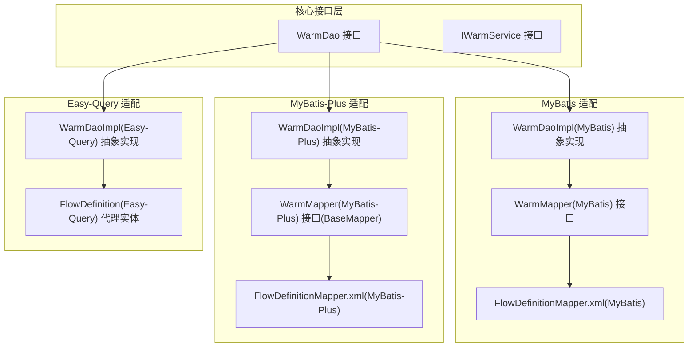
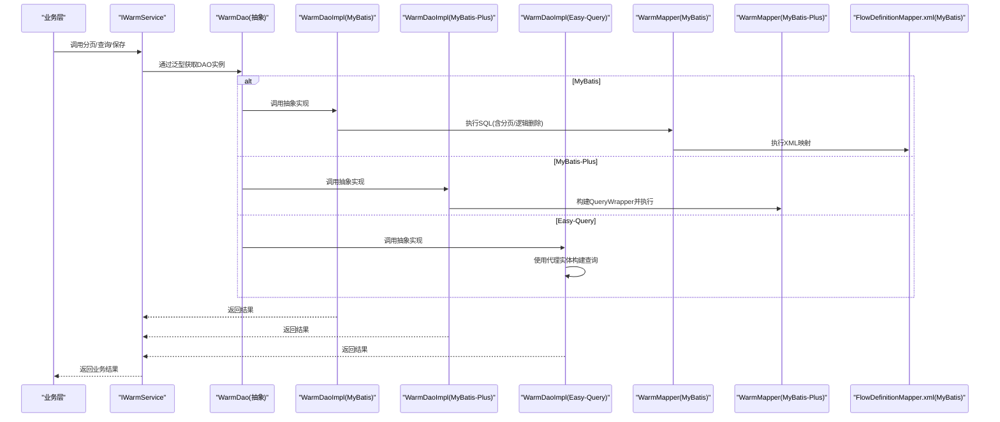
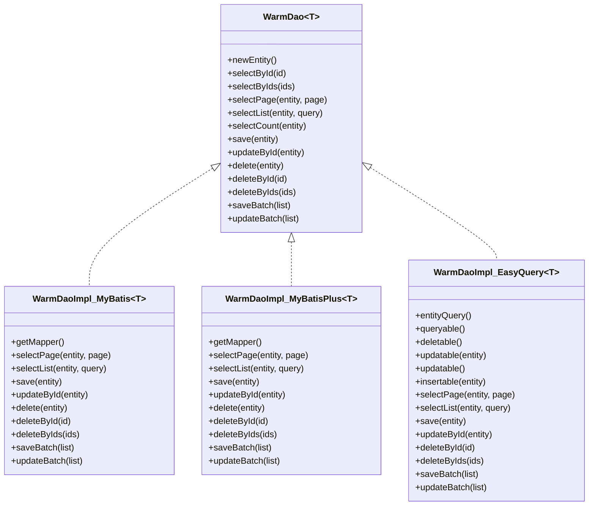
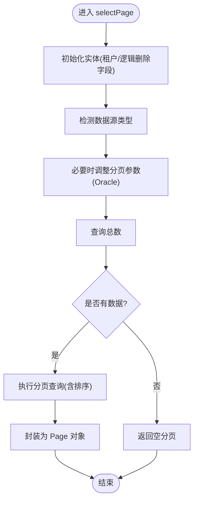
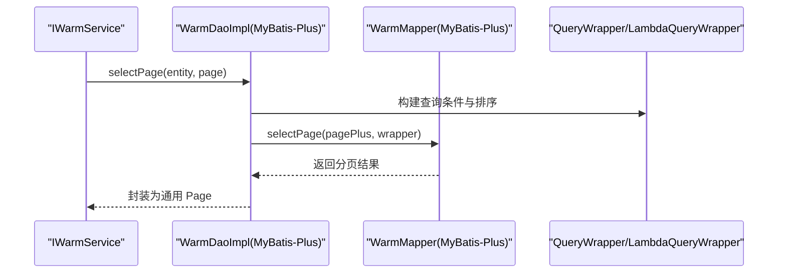
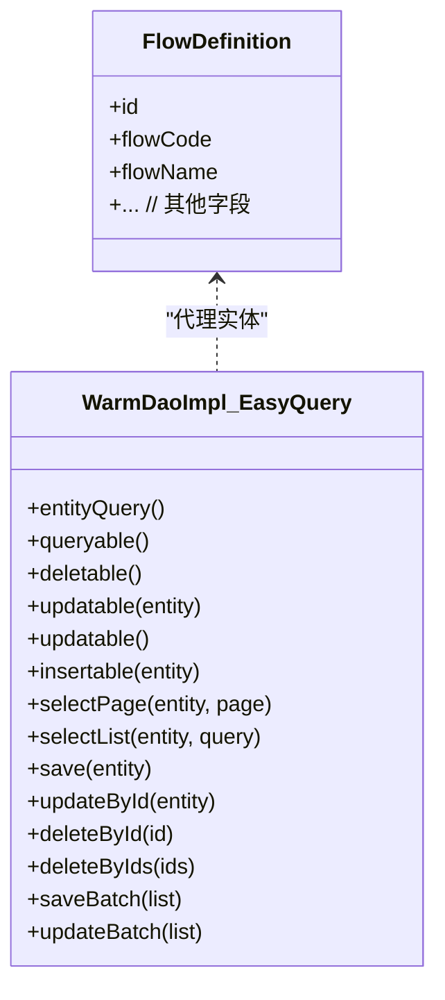
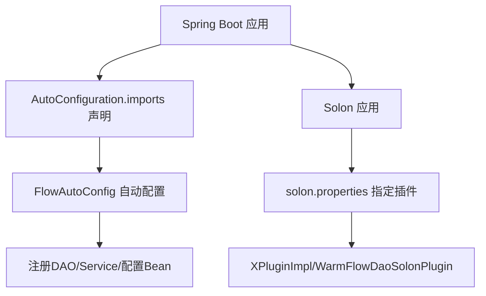
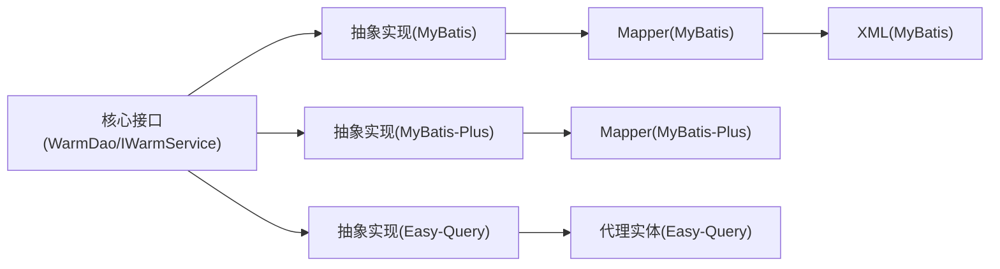

# ORM 适配层

<cite>
**本文引用的文件**
- [WarmDao.java](file://warm-flow-core/src/main/java/org/dromara/warm/flow/core/orm/dao/WarmDao.java)
- [IWarmService.java](file://warm-flow-core/src/main/java/org/dromara/warm/flow/core/orm/service/IWarmService.java)
- [WarmDaoImpl(MyBatis).java](file://warm-flow-orm/warm-flow-mybatis/warm-flow-mybatis-core/src/main/java/org/dromara/warm/flow/orm/dao/WarmDaoImpl.java)
- [WarmMapper.java(MyBatis)](file://warm-flow-orm/warm-flow-mybatis/warm-flow-mybatis-core/src/main/java/org/dromara/warm/flow/orm/mapper/WarmMapper.java)
- [FlowDefinitionMapper.xml(MyBatis)](file://warm-flow-orm/warm-flow-mybatis/warm-flow-mybatis-core/src/main/resources/warm/flow/FlowDefinitionMapper.xml)
- [WarmDaoImpl(MyBatis-Plus).java](file://warm-flow-orm/warm-flow-mybatis-plus/warm-flow-mybatis-plus-core/src/main/java/org/dromara/warm/flow/orm/dao/WarmDaoImpl.java)
- [WarmMapper.java(MyBatis-Plus)](file://warm-flow-orm/warm-flow-mybatis-plus/warm-flow-mybatis-plus-core/src/main/java/org/dromara/warm/flow/orm/mapper/WarmMapper.java)
- [FlowDefinitionMapper.xml(MyBatis-Plus)](file://warm-flow-orm/warm-flow-mybatis-plus/warm-flow-mybatis-plus-core/src/main/resources/warm/flow/FlowDefinitionMapper.xml)
- [WarmDaoImpl(Easy-Query).java](file://warm-flow-orm/warm-flow-easy-query/warm-flow-easy-query-core/src/main/java/org/dromara/warm/flow/orm/dao/WarmDaoImpl.java)
- [FlowDefinition.java(Easy-Query)](file://warm-flow-orm/warm-flow-easy-query/warm-flow-easy-query-core/src/main/java/org/dromara/warm/flow/orm/entity/FlowDefinition.java)
- [FlowAutoConfig(Spring Boot Starter).java](file://warm-flow-orm/warm-flow-mybatis/warm-flow-mybatis-sb-starter/src/main/java/org/dromara/warm/flow/spring/boot/config/FlowAutoConfig.java)
- [AutoConfiguration.imports(MyBatis)](file://warm-flow-orm/warm-flow-mybatis/warm-flow-mybatis-sb-starter/src/main/resources/META-INF/spring/org.springframework.boot.autoconfigure.AutoConfiguration.imports)
- [AutoConfiguration.imports(MyBatis-Plus)](file://warm-flow-orm/warm-flow-mybatis-plus/warm-flow-mybatis-plus-sb-starter/src/main/resources/META-INF/spring/org.springframework.boot.autoconfigure.AutoConfiguration.imports)
- [AutoConfiguration.imports(Easy-Query)](file://warm-flow-orm/warm-flow-easy-query/warm-flow-easy-query-sb-starter/src/main/resources/META-INF/spring/org.springframework.boot.autoconfigure.AutoConfiguration.imports)
- [solon.properties(MyBatis)](file://warm-flow-orm/warm-flow-mybatis/warm-flow-mybatis-solon-plugin/src/main/resources/META-INF/solon/org.dromara.warm.flow.solon.properties)
- [solon.properties(Easy-Query)](file://warm-flow-orm/warm-flow-easy-query/warm-flow-easy-query-solon-plugin/src/main/resources/META-INF/solon/org.dromara.warm.flow.solon.properties)
</cite>

## 目录
1. [引言](#引言)
2. [项目结构](#项目结构)
3. [核心组件](#核心组件)
4. [架构总览](#架构总览)
5. [详细组件分析](#详细组件分析)
6. [依赖分析](#依赖分析)
7. [性能考虑](#性能考虑)
8. [故障排查指南](#故障排查指南)
9. [结论](#结论)
10. [附录](#附录)

## 引言
本技术文档聚焦于 Warm-Flow 的 ORM 适配层，系统性介绍对 MyBatis、MyBatis-Plus、Easy-Query 三种 ORM 框架的适配实现与使用方式。文档涵盖：
- 通用 DAO 接口与抽象实现的设计思想与职责边界
- 各框架的集成方式、自动配置与依赖注入机制
- DAO 层设计模式与实现原理（分页、条件查询、逻辑删除、批量操作）
- 多数据库支持（MySQL、Oracle）的实现机制与配置要点
- 性能对比与选型建议
- 自定义 ORM 适配器的开发指南与最佳实践
- 常见问题与排障思路

## 项目结构
ORM 适配层位于 warm-flow-orm 模块下，按框架拆分为子模块，并在每个子模块中提供 core 核心包与 Spring Boot/Solon 启动器或插件。核心目录组织如下：
- core 层：统一的 DAO 接口与抽象实现，屏蔽不同 ORM 的差异
- mapper 层：MyBatis 的 Mapper 接口与 XML 映射；MyBatis-Plus 继承 BaseMapper
- starter/plugin 层：Spring Boot 自动配置与 Solon 插件，负责扫描、注册与装配
- 实体层：Easy-Query 使用代理实体注解映射

图表来源
- [WarmDao.java:31-129](file://warm-flow-core/src/main/java/org/dromara/warm/flow/core/orm/dao/WarmDao.java#L31-L129)
- [IWarmService.java:33-209](file://warm-flow-core/src/main/java/org/dromara/warm/flow/core/orm/service/IWarmService.java#L33-L209)
- [WarmDaoImpl(MyBatis).java:38-154](file://warm-flow-orm/warm-flow-mybatis/warm-flow-mybatis-core/src/main/java/org/dromara/warm/flow/orm/dao/WarmDaoImpl.java#L38-L154)
- [WarmMapper.java(MyBatis):31-147](file://warm-flow-orm/warm-flow-mybatis/warm-flow-mybatis-core/src/main/java/org/dromara/warm/flow/orm/mapper/WarmMapper.java#L31-L147)
- [FlowDefinitionMapper.xml(MyBatis):5-427](file://warm-flow-orm/warm-flow-mybatis/warm-flow-mybatis-core/src/main/resources/warm/flow/FlowDefinitionMapper.xml#L5-L427)
- [WarmDaoImpl(MyBatis-Plus).java:39-145](file://warm-flow-orm/warm-flow-mybatis-plus/warm-flow-mybatis-plus-core/src/main/java/org/dromara/warm/flow/orm/dao/WarmDaoImpl.java#L39-L145)
- [WarmMapper.java(MyBatis-Plus):27-29](file://warm-flow-orm/warm-flow-mybatis-plus/warm-flow-mybatis-plus-core/src/main/java/org/dromara/warm/flow/orm/mapper/WarmMapper.java#L27-L29)
- [FlowDefinitionMapper.xml(MyBatis-Plus):5-8](file://warm-flow-orm/warm-flow-mybatis-plus/warm-flow-mybatis-plus-core/src/main/resources/warm/flow/FlowDefinitionMapper.xml#L5-L8)
- [WarmDaoImpl(Easy-Query).java:47-212](file://warm-flow-orm/warm-flow-easy-query/warm-flow-easy-query-core/src/main/java/org/dromara/warm/flow/orm/dao/WarmDaoImpl.java#L47-L212)
- [FlowDefinition.java(Easy-Query):44-116](file://warm-flow-orm/warm-flow-easy-query/warm-flow-easy-query-core/src/main/java/org/dromara/warm/flow/orm/entity/FlowDefinition.java#L44-L116)

章节来源
- [WarmDao.java:31-129](file://warm-flow-core/src/main/java/org/dromara/warm/flow/core/orm/dao/WarmDao.java#L31-L129)
- [IWarmService.java:33-209](file://warm-flow-core/src/main/java/org/dromara/warm/flow/core/orm/service/IWarmService.java#L33-L209)

## 核心组件
- 通用 DAO 接口：定义统一的 CRUD、分页、批量、排序等能力，屏蔽不同 ORM 的差异
- 通用 Service 接口：面向业务的服务契约，依赖通用 DAO
- 抽象 DAO 实现：针对不同 ORM 提供统一的实现模板，封装分页转换、逻辑删除、租户过滤等横切逻辑
- Mapper 接口与 XML：MyBatis 的 Mapper 接口与 XML 映射；MyBatis-Plus 继承 BaseMapper
- Easy-Query 实体：基于代理实体注解，提供强类型的查询构建能力

章节来源
- [WarmDao.java:31-129](file://warm-flow-core/src/main/java/org/dromara/warm/flow/core/orm/dao/WarmDao.java#L31-L129)
- [IWarmService.java:33-209](file://warm-flow-core/src/main/java/org/dromara/warm/flow/core/orm/service/IWarmService.java#L33-L209)

## 架构总览
ORM 适配层通过“统一接口 + 抽象实现 + 具体框架适配”的分层设计，实现对多种 ORM 的无缝替换。核心流程：
- 业务调用 Service 接口
- Service 调用通用 DAO 接口
- DAO 抽象实现根据具体框架执行查询、分页、批量等操作
- MyBatis 通过 Mapper 接口与 XML 映射执行 SQL
- MyBatis-Plus 通过 QueryWrapper/LambdaQueryWrapper 构建条件
- Easy-Query 通过代理实体与 EasyEntityQuery 执行查询

图表来源
- [IWarmService.java:33-209](file://warm-flow-core/src/main/java/org/dromara/warm/flow/core/orm/service/IWarmService.java#L33-L209)
- [WarmDaoImpl(MyBatis).java:65-84](file://warm-flow-orm/warm-flow-mybatis/warm-flow-mybatis-core/src/main/java/org/dromara/warm/flow/orm/dao/WarmDaoImpl.java#L65-L84)
- [WarmDaoImpl(MyBatis-Plus).java:66-92](file://warm-flow-orm/warm-flow-mybatis-plus/warm-flow-mybatis-plus-core/src/main/java/org/dromara/warm/flow/orm/dao/WarmDaoImpl.java#L66-L92)
- [WarmDaoImpl(Easy-Query).java:132-154](file://warm-flow-orm/warm-flow-easy-query/warm-flow-easy-query-core/src/main/java/org/dromara/warm/flow/orm/dao/WarmDaoImpl.java#L132-L154)
- [WarmMapper.java(MyBatis):31-147](file://warm-flow-orm/warm-flow-mybatis/warm-flow-mybatis-core/src/main/java/org/dromara/warm/flow/orm/mapper/WarmMapper.java#L31-L147)
- [FlowDefinitionMapper.xml(MyBatis):180-203](file://warm-flow-orm/warm-flow-mybatis/warm-flow-mybatis-core/src/main/resources/warm/flow/FlowDefinitionMapper.xml#L180-L203)

## 详细组件分析

### 通用 DAO 接口与抽象实现
- 通用 DAO 接口定义了基础 CRUD、分页、批量、排序等能力，确保上层业务不依赖具体 ORM
- 抽象实现封装了分页换算（如 Oracle）、逻辑删除、租户过滤等横切关注点，降低重复代码

图表来源
- [WarmDao.java:31-129](file://warm-flow-core/src/main/java/org/dromara/warm/flow/core/orm/dao/WarmDao.java#L31-L129)
- [WarmDaoImpl(MyBatis).java:38-154](file://warm-flow-orm/warm-flow-mybatis/warm-flow-mybatis-core/src/main/java/org/dromara/warm/flow/orm/dao/WarmDaoImpl.java#L38-L154)
- [WarmDaoImpl(MyBatis-Plus).java:39-145](file://warm-flow-orm/warm-flow-mybatis-plus/warm-flow-mybatis-plus-core/src/main/java/org/dromara/warm/flow/orm/dao/WarmDaoImpl.java#L39-L145)
- [WarmDaoImpl(Easy-Query).java:47-212](file://warm-flow-orm/warm-flow-easy-query/warm-flow-easy-query-core/src/main/java/org/dromara/warm/flow/orm/dao/WarmDaoImpl.java#L47-L212)

章节来源
- [WarmDao.java:31-129](file://warm-flow-core/src/main/java/org/dromara/warm/flow/core/orm/dao/WarmDao.java#L31-L129)
- [IWarmService.java:33-209](file://warm-flow-core/src/main/java/org/dromara/warm/flow/core/orm/service/IWarmService.java#L33-L209)

### MyBatis 适配
- Mapper 接口：定义 selectList/selectCount/saveBatch 等方法，并通过参数传递分页与数据源类型
- XML 映射：实现条件拼接、分页（MySQL/Oracle 不同方言）、批量插入（MySQL 直接插入，Oracle 使用 union all）
- 抽象实现：处理分页偏移（Oracle 特殊换算）、逻辑删除、租户过滤、批量保存

图表来源
- [WarmDaoImpl(MyBatis).java:65-75](file://warm-flow-orm/warm-flow-mybatis/warm-flow-mybatis-core/src/main/java/org/dromara/warm/flow/orm/dao/WarmDaoImpl.java#L65-L75)
- [FlowDefinitionMapper.xml(MyBatis):51-59](file://warm-flow-orm/warm-flow-mybatis/warm-flow-mybatis-core/src/main/resources/warm/flow/FlowDefinitionMapper.xml#L51-L59)
- [FlowDefinitionMapper.xml(MyBatis):180-196](file://warm-flow-orm/warm-flow-mybatis/warm-flow-mybatis-core/src/main/resources/warm/flow/FlowDefinitionMapper.xml#L180-L196)

章节来源
- [WarmMapper.java(MyBatis):31-147](file://warm-flow-orm/warm-flow-mybatis/warm-flow-mybatis-core/src/main/java/org/dromara/warm/flow/orm/mapper/WarmMapper.java#L31-L147)
- [FlowDefinitionMapper.xml(MyBatis):5-427](file://warm-flow-orm/warm-flow-mybatis/warm-flow-mybatis-core/src/main/resources/warm/flow/FlowDefinitionMapper.xml#L5-L427)
- [WarmDaoImpl(MyBatis).java:65-153](file://warm-flow-orm/warm-flow-mybatis/warm-flow-mybatis-core/src/main/java/org/dromara/warm/flow/orm/dao/WarmDaoImpl.java#L65-L153)

### MyBatis-Plus 适配
- Mapper 接口：继承 BaseMapper，复用其 CRUD 能力
- 抽象实现：使用 QueryWrapper/LambdaQueryWrapper 构建条件与排序，分页通过 MyBatis-Plus 的 Page 对象完成

图表来源
- [WarmDaoImpl(MyBatis-Plus).java:66-83](file://warm-flow-orm/warm-flow-mybatis-plus/warm-flow-mybatis-plus-core/src/main/java/org/dromara/warm/flow/orm/dao/WarmDaoImpl.java#L66-L83)
- [WarmMapper.java(MyBatis-Plus):27-29](file://warm-flow-orm/warm-flow-mybatis-plus/warm-flow-mybatis-plus-core/src/main/java/org/dromara/warm/flow/orm/mapper/WarmMapper.java#L27-L29)

章节来源
- [WarmDaoImpl(MyBatis-Plus).java:39-145](file://warm-flow-orm/warm-flow-mybatis-plus/warm-flow-mybatis-plus-core/src/main/java/org/dromara/warm/flow/orm/dao/WarmDaoImpl.java#L39-L145)
- [WarmMapper.java(MyBatis-Plus):27-29](file://warm-flow-orm/warm-flow-mybatis-plus/warm-flow-mybatis-plus-core/src/main/java/org/dromara/warm/flow/orm/mapper/WarmMapper.java#L27-L29)

### Easy-Query 适配
- 实体：使用 @Table/@Column/@EntityProxy 注解映射表与列，实现代理实体
- 抽象实现：通过 EasyEntityQuery 获取查询、删除、更新、插入对象，支持批量与仅非空列策略

图表来源
- [FlowDefinition.java(Easy-Query):44-116](file://warm-flow-orm/warm-flow-easy-query/warm-flow-easy-query-core/src/main/java/org/dromara/warm/flow/orm/entity/FlowDefinition.java#L44-L116)
- [WarmDaoImpl(Easy-Query).java:47-212](file://warm-flow-orm/warm-flow-easy-query/warm-flow-easy-query-core/src/main/java/org/dromara/warm/flow/orm/dao/WarmDaoImpl.java#L47-L212)

章节来源
- [FlowDefinition.java(Easy-Query):44-116](file://warm-flow-orm/warm-flow-easy-query/warm-flow-easy-query-core/src/main/java/org/dromara/warm/flow/orm/entity/FlowDefinition.java#L44-L116)
- [WarmDaoImpl(Easy-Query).java:47-212](file://warm-flow-orm/warm-flow-easy-query/warm-flow-easy-query-core/src/main/java/org/dromara/warm/flow/orm/dao/WarmDaoImpl.java#L47-L212)

### Spring Boot 自动配置与依赖注入
- MyBatis/MyBatis-Plus/Easy-Query 的 starter 在 META-INF 中声明自动配置类，实现零样板代码接入
- Solon 插件通过 solon.properties 指定插件入口类，完成扫描与装配

图表来源
- [AutoConfiguration.imports(MyBatis):1-2](file://warm-flow-orm/warm-flow-mybatis/warm-flow-mybatis-sb-starter/src/main/resources/META-INF/spring/org.springframework.boot.autoconfigure.AutoConfiguration.imports#L1-L2)
- [AutoConfiguration.imports(MyBatis-Plus):1-2](file://warm-flow-orm/warm-flow-mybatis-plus/warm-flow-mybatis-plus-sb-starter/src/main/resources/META-INF/spring/org.springframework.boot.autoconfigure.AutoConfiguration.imports#L1-L2)
- [AutoConfiguration.imports(Easy-Query):1-2](file://warm-flow-orm/warm-flow-easy-query/warm-flow-easy-query-sb-starter/src/main/resources/META-INF/spring/org.springframework.boot.autoconfigure.AutoConfiguration.imports#L1-L2)
- [solon.properties(MyBatis):1-2](file://warm-flow-orm/warm-flow-mybatis/warm-flow-mybatis-solon-plugin/src/main/resources/META-INF/solon/org.dromara.warm.flow.solon.properties#L1-L2)
- [solon.properties(Easy-Query):1-2](file://warm-flow-orm/warm-flow-easy-query/warm-flow-easy-query-solon-plugin/src/main/resources/META-INF/solon/org.dromara.warm.flow.solon.properties#L1-L2)

章节来源
- [AutoConfiguration.imports(MyBatis):1-2](file://warm-flow-orm/warm-flow-mybatis/warm-flow-mybatis-sb-starter/src/main/resources/META-INF/spring/org.springframework.boot.autoconfigure.AutoConfiguration.imports#L1-L2)
- [AutoConfiguration.imports(MyBatis-Plus):1-2](file://warm-flow-orm/warm-flow-mybatis-plus/warm-flow-mybatis-plus-sb-starter/src/main/resources/META-INF/spring/org.springframework.boot.autoconfigure.AutoConfiguration.imports#L1-L2)
- [AutoConfiguration.imports(Easy-Query):1-2](file://warm-flow-orm/warm-flow-easy-query/warm-flow-easy-query-sb-starter/src/main/resources/META-INF/spring/org.springframework.boot.autoconfigure.AutoConfiguration.imports#L1-L2)
- [solon.properties(MyBatis):1-2](file://warm-flow-orm/warm-flow-mybatis/warm-flow-mybatis-solon-plugin/src/main/resources/META-INF/solon/org.dromara.warm.flow.solon.properties#L1-L2)
- [solon.properties(Easy-Query):1-2](file://warm-flow-orm/warm-flow-easy-query/warm-flow-easy-query-solon-plugin/src/main/resources/META-INF/solon/org.dromara.warm.flow.solon.properties#L1-L2)

## 依赖分析
- 解耦策略：核心接口与抽象实现隔离具体 ORM；Service 依赖 DAO 接口，DAO 实现依赖具体 Mapper
- 外部依赖：MyBatis 依赖 XML 映射；MyBatis-Plus 依赖 QueryWrapper；Easy-Query 依赖代理实体与 EasyEntityQuery
- 循环依赖：未发现直接循环依赖；若自定义扩展需避免在抽象实现中引入上层业务依赖

图表来源
- [WarmDao.java:31-129](file://warm-flow-core/src/main/java/org/dromara/warm/flow/core/orm/dao/WarmDao.java#L31-L129)
- [IWarmService.java:33-209](file://warm-flow-core/src/main/java/org/dromara/warm/flow/core/orm/service/IWarmService.java#L33-L209)
- [WarmDaoImpl(MyBatis).java:38-154](file://warm-flow-orm/warm-flow-mybatis/warm-flow-mybatis-core/src/main/java/org/dromara/warm/flow/orm/dao/WarmDaoImpl.java#L38-L154)
- [WarmDaoImpl(MyBatis-Plus).java:39-145](file://warm-flow-orm/warm-flow-mybatis-plus/warm-flow-mybatis-plus-core/src/main/java/org/dromara/warm/flow/orm/dao/WarmDaoImpl.java#L39-L145)
- [WarmDaoImpl(Easy-Query).java:47-212](file://warm-flow-orm/warm-flow-easy-query/warm-flow-easy-query-core/src/main/java/org/dromara/warm/flow/orm/dao/WarmDaoImpl.java#L47-L212)
- [WarmMapper.java(MyBatis):31-147](file://warm-flow-orm/warm-flow-mybatis/warm-flow-mybatis-core/src/main/java/org/dromara/warm/flow/orm/mapper/WarmMapper.java#L31-L147)
- [FlowDefinitionMapper.xml(MyBatis):5-427](file://warm-flow-orm/warm-flow-mybatis/warm-flow-mybatis-core/src/main/resources/warm/flow/FlowDefinitionMapper.xml#L5-L427)
- [WarmMapper.java(MyBatis-Plus):27-29](file://warm-flow-orm/warm-flow-mybatis-plus/warm-flow-mybatis-plus-core/src/main/java/org/dromara/warm/flow/orm/mapper/WarmMapper.java#L27-L29)
- [FlowDefinitionMapper.xml(MyBatis-Plus):5-8](file://warm-flow-orm/warm-flow-mybatis-plus/warm-flow-mybatis-plus-core/src/main/resources/warm/flow/FlowDefinitionMapper.xml#L5-L8)
- [FlowDefinition.java(Easy-Query):44-116](file://warm-flow-orm/warm-flow-easy-query/warm-flow-easy-query-core/src/main/java/org/dromara/warm/flow/orm/entity/FlowDefinition.java#L44-L116)

## 性能考虑
- 分页与排序
  - MyBatis：通过 XML 动态拼接排序与分页；Oracle 需特殊换算（起始偏移与上限），注意 SQL 片段的可读性与维护性
  - MyBatis-Plus：使用 Page 对象与 QueryWrapper，分页由框架处理，易用性高
  - Easy-Query：通过代理实体与 UISort 支持排序，批量策略可仅更新非空列，减少无效写入
- 批量操作
  - MyBatis：提供 saveBatch 并区分 MySQL/Oracle 方言，批量插入效率较高
  - MyBatis-Plus：默认逐条执行，可通过自定义优化或使用底层批量能力
  - Easy-Query：提供 batch() 批量执行，适合大批量场景
- 逻辑删除
  - MyBatis：通过 updateLogic/updateByIdLogic 实现，需在 XML 中正确拼接条件
  - MyBatis-Plus：Lambda 条件构造器，逻辑删除更直观
  - Easy-Query：代理实体可直接构建条件，逻辑删除与普通更新一致
- 选型建议
  - 追求灵活性与 SQL 控制：MyBatis
  - 快速开发与分页/条件丰富：MyBatis-Plus
  - 类型安全与链式 API：Easy-Query

[本节为通用性能讨论，无需列出章节来源]

## 故障排查指南
- 分页异常（Oracle）
  - 现象：分页起始位置错误或越界
  - 排查：确认抽象实现中的分页换算逻辑与 XML 中的分页片段
  - 参考
    - [WarmDaoImpl(MyBatis).java:148-153](file://warm-flow-orm/warm-flow-mybatis/warm-flow-mybatis-core/src/main/java/org/dromara/warm/flow/orm/dao/WarmDaoImpl.java#L148-L153)
    - [FlowDefinitionMapper.xml(MyBatis):51-59](file://warm-flow-orm/warm-flow-mybatis/warm-flow-mybatis-core/src/main/resources/warm/flow/FlowDefinitionMapper.xml#L51-L59)
- 逻辑删除未生效
  - 现象：删除后仍可查询到数据
  - 排查：确认实体的 delFlag 字段与逻辑删除值配置，检查 XML 中的条件拼接
  - 参考
    - [WarmDaoImpl(MyBatis).java:108-111](file://warm-flow-orm/warm-flow-mybatis/warm-flow-mybatis-core/src/main/java/org/dromara/warm/flow/orm/dao/WarmDaoImpl.java#L108-L111)
    - [FlowDefinitionMapper.xml(MyBatis):336-343](file://warm-flow-orm/warm-flow-mybatis/warm-flow-mybatis-core/src/main/resources/warm/flow/FlowDefinitionMapper.xml#L336-L343)
- 批量插入失败或性能差
  - 现象：大量小事务或 SQL 不兼容
  - 排查：确认方言选择与批量插入片段；MyBatis-Plus 可考虑优化批量策略
  - 参考
    - [FlowDefinitionMapper.xml(MyBatis):417-426](file://warm-flow-orm/warm-flow-mybatis/warm-flow-mybatis-core/src/main/resources/warm/flow/FlowDefinitionMapper.xml#L417-L426)
    - [WarmDaoImpl(MyBatis-Plus).java:132-136](file://warm-flow-orm/warm-flow-mybatis-plus/warm-flow-mybatis-plus-core/src/main/java/org/dromara/warm/flow/orm/dao/WarmDaoImpl.java#L132-L136)
- Easy-Query 代理实体未生成或查询异常
  - 现象：编译期缺少代理类或运行时报错
  - 排查：确认注解与代理实体生成器配置，确保实体实现 ProxyEntityAvailable
  - 参考
    - [FlowDefinition.java(Easy-Query):44-44](file://warm-flow-orm/warm-flow-easy-query/warm-flow-easy-query-core/src/main/java/org/dromara/warm/flow/orm/entity/FlowDefinition.java#L44-L44)

章节来源
- [WarmDaoImpl(MyBatis).java:108-153](file://warm-flow-orm/warm-flow-mybatis/warm-flow-mybatis-core/src/main/java/org/dromara/warm/flow/orm/dao/WarmDaoImpl.java#L108-L153)
- [FlowDefinitionMapper.xml(MyBatis):51-59](file://warm-flow-orm/warm-flow-mybatis/warm-flow-mybatis-core/src/main/resources/warm/flow/FlowDefinitionMapper.xml#L51-L59)
- [FlowDefinitionMapper.xml(MyBatis):336-343](file://warm-flow-orm/warm-flow-mybatis/warm-flow-mybatis-core/src/main/resources/warm/flow/FlowDefinitionMapper.xml#L336-L343)
- [FlowDefinitionMapper.xml(MyBatis):417-426](file://warm-flow-orm/warm-flow-mybatis/warm-flow-mybatis-core/src/main/resources/warm/flow/FlowDefinitionMapper.xml#L417-L426)
- [WarmDaoImpl(MyBatis-Plus).java:132-136](file://warm-flow-orm/warm-flow-mybatis-plus/warm-flow-mybatis-plus-core/src/main/java/org/dromara/warm/flow/orm/dao/WarmDaoImpl.java#L132-L136)
- [FlowDefinition.java(Easy-Query):44-44](file://warm-flow-orm/warm-flow-easy-query/warm-flow-easy-query-core/src/main/java/org/dromara/warm/flow/orm/entity/FlowDefinition.java#L44-L44)

## 结论
Warm-Flow ORM 适配层以统一接口与抽象实现为核心，有效屏蔽了 MyBatis、MyBatis-Plus、Easy-Query 的差异，提供了清晰的扩展点与良好的可维护性。在实际选型中，可根据团队对 SQL 控制、开发效率与类型安全的需求进行权衡。

[本节为总结性内容，无需列出章节来源]

## 附录

### 自定义 ORM 适配器开发指南与最佳实践
- 设计原则
  - 保持与 WarmDao 接口一致的方法签名与行为约定
  - 在抽象实现中集中处理分页、逻辑删除、租户过滤等横切逻辑
- 关键步骤
  - 定义抽象实现类，实现 WarmDao 接口
  - 提供 Mapper 接口（如需）或直接使用框架提供的查询对象
  - 在 XML 或框架 DSL 中实现条件、分页、批量等能力
  - 通过 Spring Boot 自动配置或 Solon 插件完成装配
- 最佳实践
  - 明确分页与排序的边界，避免在 DAO 层过度拼接 SQL
  - 批量操作优先使用框架提供的批量能力，减少循环调用
  - 逻辑删除与软删字段保持一致，避免误删
  - 单元测试覆盖常见查询、分页、批量与逻辑删除场景

[本节为通用指导，无需列出章节来源]