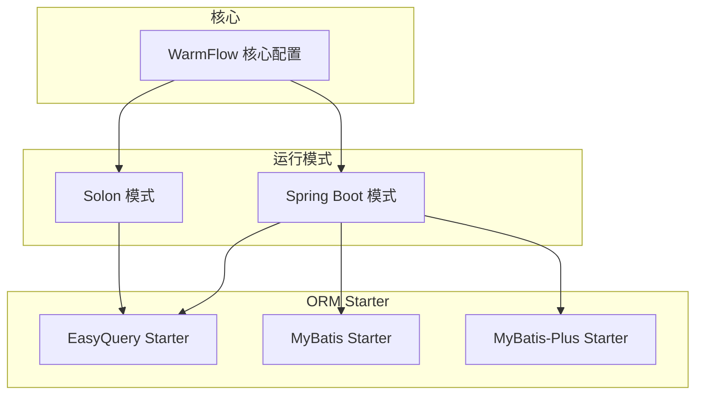
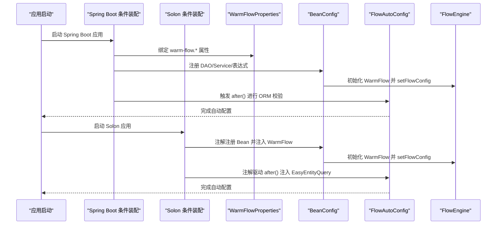
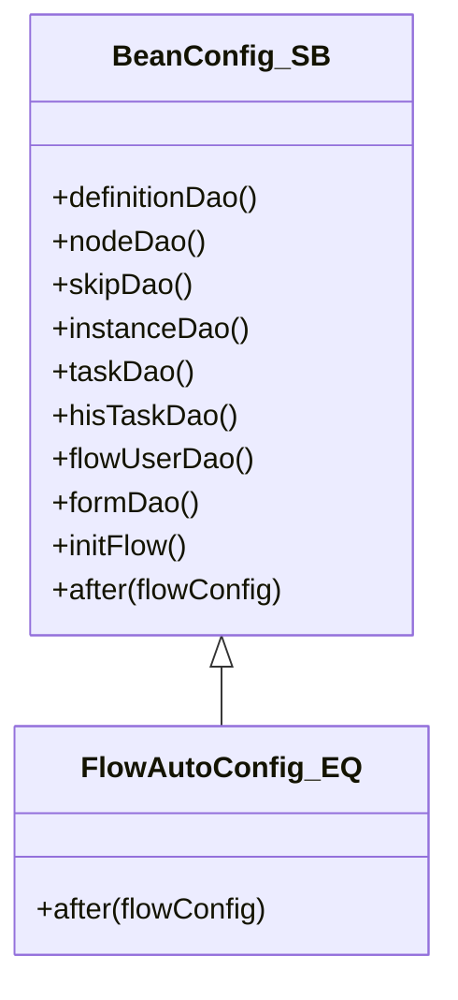
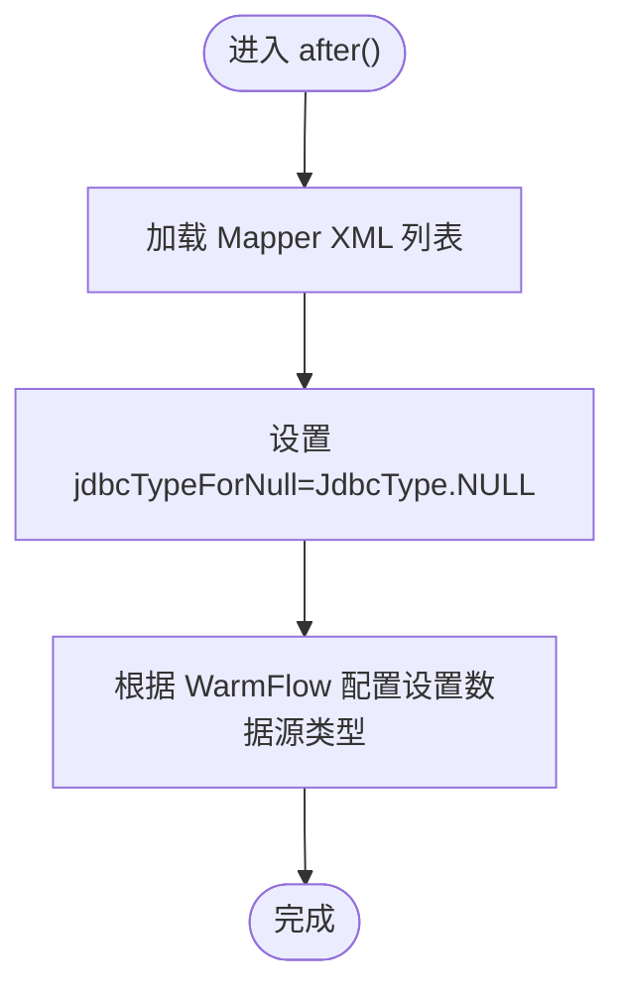
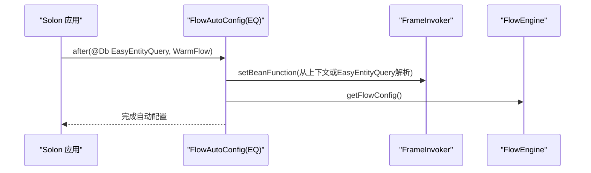
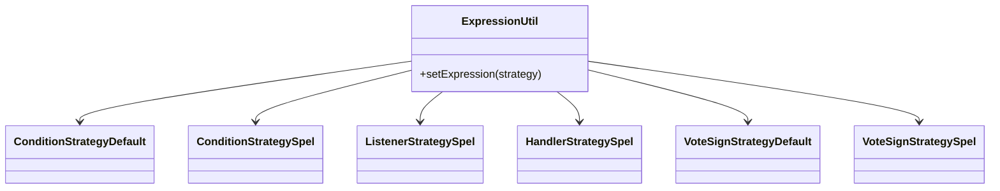
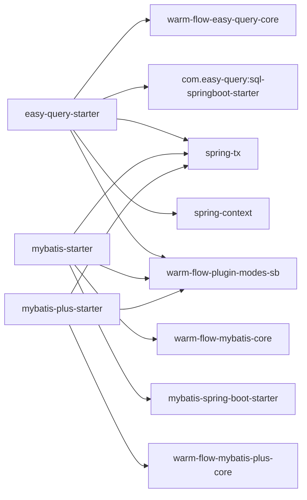

# Starter 配置

<cite>
**本文引用的文件**
- [warm-flow-core/src/main/java/org/dromara/warm/flow/core/config/WarmFlow.java](file://warm-flow-core/src/main/java/org/dromara/warm/flow/core/config/WarmFlow.java)
- [warm-flow-plugin/warm-flow-plugin-modes/warm-flow-plugin-modes-sb/src/main/java/org/dromara/warm/plugin/modes/sb/config/WarmFlowProperties.java](file://warm-flow-plugin/warm-flow-plugin-modes/warm-flow-plugin-modes-sb/src/main/java/org/dromara/warm/plugin/modes/sb/config/WarmFlowProperties.java)
- [warm-flow-plugin/warm-flow-plugin-modes/warm-flow-plugin-modes-sb/src/main/java/org/dromara/warm/plugin/modes/sb/config/BeanConfig.java](file://warm-flow-plugin/warm-flow-plugin-modes/warm-flow-plugin-modes-sb/src/main/java/org/dromara/warm/plugin/modes/sb/config/BeanConfig.java)
- [warm-flow-plugin/warm-flow-plugin-modes/warm-flow-plugin-modes-solon/src/main/java/org/dromara/warm/plugin/modes/solon/config/BeanConfig.java](file://warm-flow-plugin/warm-flow-plugin-modes/warm-flow-plugin-modes-solon/src/main/java/org/dromara/warm/plugin/modes/solon/config/BeanConfig.java)
- [warm-flow-orm/warm-flow-easy-query/warm-flow-easy-query-sb-starter/src/main/java/org/dromara/warm/flow/spring/boot/config/FlowAutoConfig.java](file://warm-flow-orm/warm-flow-easy-query/warm-flow-easy-query-sb-starter/src/main/java/org/dromara/warm/flow/spring/boot/config/FlowAutoConfig.java)
- [warm-flow-orm/warm-flow-easy-query/warm-flow-easy-query-sb3-starter/src/main/java/org/dromara/warm/flow/spring/boot/config/FlowAutoConfig.java](file://warm-flow-orm/warm-flow-easy-query/warm-flow-easy-query-sb3-starter/src/main/java/org/dromara/warm/flow/spring/boot/config/FlowAutoConfig.java)
- [warm-flow-orm/warm-flow-easy-query/warm-flow-easy-query-sb4-starter/src/main/java/org/dromara/warm/flow/spring/boot/config/FlowAutoConfig.java](file://warm-flow-orm/warm-flow-easy-query/warm-flow-easy-query-sb4-starter/src/main/java/org/dromara/warm/flow/spring/boot/config/FlowAutoConfig.java)
- [warm-flow-orm/warm-flow-easy-query/warm-flow-easy-query-solon-plugin/src/main/java/org/dromara/warm/flow/solon/config/FlowAutoConfig.java](file://warm-flow-orm/warm-flow-easy-query/warm-flow-easy-query-solon-plugin/src/main/java/org/dromara/warm/flow/solon/config/FlowAutoConfig.java)
- [warm-flow-orm/warm-flow-mybatis/warm-flow-mybatis-sb-starter/src/main/java/org/dromara/warm/flow/spring/boot/config/FlowAutoConfig.java](file://warm-flow-orm/warm-flow-mybatis/warm-flow-mybatis-sb-starter/src/main/java/org/dromara/warm/flow/spring/boot/config/FlowAutoConfig.java)
- [warm-flow-orm/warm-flow-mybatis-plus/warm-flow-mybatis-plus-sb-starter/src/main/java/org/dromara/warm/flow/spring/boot/config/FlowAutoConfig.java](file://warm-flow-orm/warm-flow-mybatis-plus/warm-flow-mybatis-plus-sb-starter/src/main/java/org/dromara/warm/flow/spring/boot/config/FlowAutoConfig.java)
- [warm-flow-orm/warm-flow-easy-query/warm-flow-easy-query-sb-starter/pom.xml](file://warm-flow-orm/warm-flow-easy-query/warm-flow-easy-query-sb-starter/pom.xml)
- [warm-flow-orm/warm-flow-mybatis/warm-flow-mybatis-sb-starter/pom.xml](file://warm-flow-orm/warm-flow-mybatis/warm-flow-mybatis-sb-starter/pom.xml)
- [warm-flow-plugin/warm-flow-plugin-modes/warm-flow-plugin-modes-sb/src/main/java/org/dromara/warm/plugin/modes/sb/expression/ConditionStrategyDefault.java](file://warm-flow-plugin/warm-flow-plugin-modes/warm-flow-plugin-modes-sb/src/main/java/org/dromara/warm/plugin/modes/sb/expression/ConditionStrategyDefault.java)
- [warm-flow-plugin/warm-flow-plugin-modes/warm-flow-plugin-modes-sb/src/main/java/org/dromara/warm/plugin/modes/sb/expression/ConditionStrategySpel.java](file://warm-flow-plugin/warm-flow-plugin-modes/warm-flow-plugin-modes-sb/src/main/java/org/dromara/warm/plugin/modes/sb/expression/ConditionStrategySpel.java)
- [warm-flow-plugin/warm-flow-plugin-modes/warm-flow-plugin-modes-sb/src/main/java/org/dromara/warm/plugin/modes/sb/expression/HandlerStrategySpel.java](file://warm-flow-plugin/warm-flow-plugin-modes/warm-flow-plugin-modes-sb/src/main/java/org/dromara/warm/plugin/modes/sb/expression/HandlerStrategySpel.java)
- [warm-flow-plugin/warm-flow-plugin-modes/warm-flow-plugin-modes-sb/src/main/java/org/dromara/warm/plugin/modes/sb/expression/ListenerStrategySpel.java](file://warm-flow-plugin/warm-flow-plugin-modes/warm-flow-plugin-modes-sb/src/main/java/org/dromara/warm/plugin/modes/sb/expression/ListenerStrategySpel.java)
- [warm-flow-plugin/warm-flow-plugin-modes/warm-flow-plugin-modes-sb/src/main/java/org/dromara/warm/plugin/modes/sb/expression/VoteSignStrategyDefault.java](file://warm-flow-plugin/warm-flow-plugin-modes/warm-flow-plugin-modes-sb/src/main/java/org/dromara/warm/plugin/modes/sb/expression/VoteSignStrategyDefault.java)
- [warm-flow-plugin/warm-flow-plugin-modes/warm-flow-plugin-modes-sb/src/main/java/org/dromara/warm/plugin/modes/sb/expression/VoteSignStrategySpel.java](file://warm-flow-plugin/warm-flow-plugin-modes/warm-flow-plugin-modes-sb/src/main/java/org/dromara/warm/plugin/modes/sb/expression/VoteSignStrategySpel.java)
</cite>

## 目录
1. [简介](#简介)
2. [项目结构](#项目结构)
3. [核心组件](#核心组件)
4. [架构总览](#架构总览)
5. [组件详解](#组件详解)
6. [依赖关系分析](#依赖关系分析)
7. [性能与配置建议](#性能与配置建议)
8. [故障排查指南](#故障排查指南)
9. [结论](#结论)
10. [附录](#附录)

## 简介
本指南面向使用 Spring Boot 与 Solon 的开发者，系统讲解 Warm Flow Starter 的自动配置机制与 ORM 对应 Starter 的依赖配置。重点覆盖：
- 自动配置类 FlowAutoConfig 的实现原理与触发条件
- 不同 ORM（Easy Query、MyBatis、MyBatis-Plus） Starter 的依赖与版本兼容性
- 在 Solon 下的插件配置方式与差异点
- 完整的 Maven 依赖配置示例与版本选择建议
- 关键配置参数说明（数据库连接、事务、缓存、表达式、UI 等）
- 常见配置问题的排查与解决思路

## 项目结构
本项目采用多模块组织，Starter 与 ORM 实现分离，便于按需引入。关键结构如下：
- warm-flow-core：核心配置与运行时能力
- warm-flow-plugin：运行模式与表达式策略（Spring Boot 与 Solon）
- warm-flow-orm：ORM 实现与 Starter
  - easy-query：基于 EasyQuery 的 Starter
  - mybatis：基于 MyBatis 的 Starter
  - mybatis-plus：基于 MyBatis-Plus 的 Starter

**图表来源**
- [warm-flow-core/src/main/java/org/dromara/warm/flow/core/config/WarmFlow.java:36-174](file://warm-flow-core/src/main/java/org/dromara/warm/flow/core/config/WarmFlow.java#L36-L174)
- [warm-flow-plugin/warm-flow-plugin-modes/warm-flow-plugin-modes-sb/src/main/java/org/dromara/warm/plugin/modes/sb/config/BeanConfig.java:47-178](file://warm-flow-plugin/warm-flow-plugin-modes/warm-flow-plugin-modes-sb/src/main/java/org/dromara/warm/plugin/modes/sb/config/BeanConfig.java#L47-L178)
- [warm-flow-plugin/warm-flow-plugin-modes/warm-flow-plugin-modes-solon/src/main/java/org/dromara/warm/plugin/modes/solon/config/BeanConfig.java:49-176](file://warm-flow-plugin/warm-flow-plugin-modes/warm-flow-plugin-modes-solon/src/main/java/org/dromara/warm/plugin/modes/solon/config/BeanConfig.java#L49-L176)

**章节来源**
- [warm-flow-core/src/main/java/org/dromara/warm/flow/core/config/WarmFlow.java:36-174](file://warm-flow-core/src/main/java/org/dromara/warm/flow/core/config/WarmFlow.java#L36-L174)
- [warm-flow-plugin/warm-flow-plugin-modes/warm-flow-plugin-modes-sb/src/main/java/org/dromara/warm/plugin/modes/sb/config/BeanConfig.java:47-178](file://warm-flow-plugin/warm-flow-plugin-modes/warm-flow-plugin-modes-sb/src/main/java/org/dromara/warm/plugin/modes/sb/config/BeanConfig.java#L47-L178)
- [warm-flow-plugin/warm-flow-plugin-modes/warm-flow-plugin-modes-solon/src/main/java/org/dromara/warm/plugin/modes/solon/config/BeanConfig.java:49-176](file://warm-flow-plugin/warm-flow-plugin-modes/warm-flow-plugin-modes-solon/src/main/java/org/dromara/warm/plugin/modes/solon/config/BeanConfig.java#L49-L176)

## 核心组件
- WarmFlow 核心配置：集中定义开关、框架类型、逻辑删除、处理器路径、数据源类型、UI 开关、令牌名、状态颜色等。
- WarmFlowProperties：将 WarmFlow 暴露为 Spring Boot 配置属性，支持 application.yml 中的 warm-flow.* 键值映射。
- BeanConfig（Spring Boot）：负责注册 DAO、Service、表达式策略、初始化 WarmFlow 并注入到 FlowEngine。
- BeanConfig（Solon）：在 Solon 下以注解方式注册 Bean，注入 WarmFlow 并初始化。

**章节来源**
- [warm-flow-core/src/main/java/org/dromara/warm/flow/core/config/WarmFlow.java:36-174](file://warm-flow-core/src/main/java/org/dromara/warm/flow/core/config/WarmFlow.java#L36-L174)
- [warm-flow-plugin/warm-flow-plugin-modes/warm-flow-plugin-modes-sb/src/main/java/org/dromara/warm/plugin/modes/sb/config/WarmFlowProperties.java:24-26](file://warm-flow-plugin/warm-flow-plugin-modes/warm-flow-plugin-modes-sb/src/main/java/org/dromara/warm/plugin/modes/sb/config/WarmFlowProperties.java#L24-L26)
- [warm-flow-plugin/warm-flow-plugin-modes/warm-flow-plugin-modes-sb/src/main/java/org/dromara/warm/plugin/modes/sb/config/BeanConfig.java:47-178](file://warm-flow-plugin/warm-flow-plugin-modes/warm-flow-plugin-modes-sb/src/main/java/org/dromara/warm/plugin/modes/sb/config/BeanConfig.java#L47-L178)
- [warm-flow-plugin/warm-flow-plugin-modes/warm-flow-plugin-modes-solon/src/main/java/org/dromara/warm/plugin/modes/solon/config/BeanConfig.java:49-176](file://warm-flow-plugin/warm-flow-plugin-modes/warm-flow-plugin-modes-solon/src/main/java/org/dromara/warm/plugin/modes/solon/config/BeanConfig.java#L49-L176)

## 架构总览
Warm Flow 的自动配置遵循“条件装配 + 属性绑定 + Bean 注册”的模式。Spring Boot 与 Solon 的差异主要体现在 Bean 注入方式与条件注解上。

**图表来源**
- [warm-flow-plugin/warm-flow-plugin-modes/warm-flow-plugin-modes-sb/src/main/java/org/dromara/warm/plugin/modes/sb/config/BeanConfig.java:140-153](file://warm-flow-plugin/warm-flow-plugin-modes/warm-flow-plugin-modes-sb/src/main/java/org/dromara/warm/plugin/modes/sb/config/BeanConfig.java#L140-L153)
- [warm-flow-orm/warm-flow-easy-query/warm-flow-easy-query-sb-starter/src/main/java/org/dromara/warm/flow/spring/boot/config/FlowAutoConfig.java:36-43](file://warm-flow-orm/warm-flow-easy-query/warm-flow-easy-query-sb-starter/src/main/java/org/dromara/warm/flow/spring/boot/config/FlowAutoConfig.java#L36-L43)
- [warm-flow-orm/warm-flow-easy-query/warm-flow-easy-query-solon-plugin/src/main/java/org/dromara/warm/flow/solon/config/FlowAutoConfig.java:36-50](file://warm-flow-orm/warm-flow-easy-query/warm-flow-easy-query-solon-plugin/src/main/java/org/dromara/warm/flow/solon/config/FlowAutoConfig.java#L36-L50)

## 组件详解

### FlowAutoConfig（Spring Boot）
- 触发条件：warm-flow.enabled=true（默认启用）
- 职责：
  - 继承 BeanConfig，复用 WarmFlow 初始化与 Bean 注册
  - 在 after() 中校验 EasyEntityQuery 是否存在，确保 EasyQuery 数据源已正确装配
- 适用 ORM：EasyQuery

**图表来源**
- [warm-flow-plugin/warm-flow-plugin-modes/warm-flow-plugin-modes-sb/src/main/java/org/dromara/warm/plugin/modes/sb/config/BeanConfig.java:47-178](file://warm-flow-plugin/warm-flow-plugin-modes/warm-flow-plugin-modes-sb/src/main/java/org/dromara/warm/plugin/modes/sb/config/BeanConfig.java#L47-L178)
- [warm-flow-orm/warm-flow-easy-query/warm-flow-easy-query-sb-starter/src/main/java/org/dromara/warm/flow/spring/boot/config/FlowAutoConfig.java:32-43](file://warm-flow-orm/warm-flow-easy-query/warm-flow-easy-query-sb-starter/src/main/java/org/dromara/warm/flow/spring/boot/config/FlowAutoConfig.java#L32-L43)

**章节来源**
- [warm-flow-orm/warm-flow-easy-query/warm-flow-easy-query-sb-starter/src/main/java/org/dromara/warm/flow/spring/boot/config/FlowAutoConfig.java:32-43](file://warm-flow-orm/warm-flow-easy-query/warm-flow-easy-query-sb-starter/src/main/java/org/dromara/warm/flow/spring/boot/config/FlowAutoConfig.java#L32-L43)

### FlowAutoConfig（MyBatis）
- 触发条件：warm-flow.enabled=true（默认启用）
- 职责：
  - 继承 BeanConfig，注册 DAO/Service
  - 在 after() 中加载 Mapper XML、设置 jdbcTypeForNull、根据 WarmFlow 配置设置数据源类型
- 适用 ORM：MyBatis

**图表来源**
- [warm-flow-orm/warm-flow-mybatis/warm-flow-mybatis-sb-starter/src/main/java/org/dromara/warm/flow/spring/boot/config/FlowAutoConfig.java:49-70](file://warm-flow-orm/warm-flow-mybatis/warm-flow-mybatis-sb-starter/src/main/java/org/dromara/warm/flow/spring/boot/config/FlowAutoConfig.java#L49-L70)

**章节来源**
- [warm-flow-orm/warm-flow-mybatis/warm-flow-mybatis-sb-starter/src/main/java/org/dromara/warm/flow/spring/boot/config/FlowAutoConfig.java:38-72](file://warm-flow-orm/warm-flow-mybatis/warm-flow-mybatis-sb-starter/src/main/java/org/dromara/warm/flow/spring/boot/config/FlowAutoConfig.java#L38-L72)

### FlowAutoConfig（MyBatis-Plus）
- 触发条件：warm-flow.enabled=true（默认启用）
- 职责：
  - 继承 BeanConfig，注册 DAO/Service
  - 在 after() 中设置默认主键生成器为 MyBatis-Plus ID 生成器
- 适用 ORM：MyBatis-Plus

**章节来源**
- [warm-flow-orm/warm-flow-mybatis-plus/warm-flow-mybatis-plus-sb-starter/src/main/java/org/dromara/warm/flow/spring/boot/config/FlowAutoConfig.java:32-42](file://warm-flow-orm/warm-flow-mybatis-plus/warm-flow-mybatis-plus-sb-starter/src/main/java/org/dromara/warm/flow/spring/boot/config/FlowAutoConfig.java#L32-L42)

### Solon 插件配置（EasyQuery）
- 条件注解：基于 Solon 的 @Condition 注解，属性格式为 ${warm-flow.enabled:true}=true
- 职责：
  - 使用 @Bean 注入 EasyEntityQuery，并设置 FrameInvoker 的 Bean 获取函数
  - 返回 FlowEngine 的 FlowConfig，完成初始化
- 差异点：
  - 使用 Solon 的上下文获取 Bean，而非 Spring 的 Environment
  - 注解驱动的 Bean 注册与生命周期管理

**图表来源**
- [warm-flow-orm/warm-flow-easy-query/warm-flow-easy-query-solon-plugin/src/main/java/org/dromara/warm/flow/solon/config/FlowAutoConfig.java:36-50](file://warm-flow-orm/warm-flow-easy-query/warm-flow-easy-query-solon-plugin/src/main/java/org/dromara/warm/flow/solon/config/FlowAutoConfig.java#L36-L50)

**章节来源**
- [warm-flow-orm/warm-flow-easy-query/warm-flow-easy-query-solon-plugin/src/main/java/org/dromara/warm/flow/solon/config/FlowAutoConfig.java:36-50](file://warm-flow-orm/warm-flow-easy-query/warm-flow-easy-query-solon-plugin/src/main/java/org/dromara/warm/flow/solon/config/FlowAutoConfig.java#L36-L50)

### 表达式策略（Spring Boot）
Warm Flow 提供多种表达式策略，用于条件判断、监听器、处理器与会签场景。默认策略与 SPEL 策略均被注册。

**图表来源**
- [warm-flow-plugin/warm-flow-plugin-modes/warm-flow-plugin-modes-sb/src/main/java/org/dromara/warm/plugin/modes/sb/config/BeanConfig.java:155-162](file://warm-flow-plugin/warm-flow-plugin-modes/warm-flow-plugin-modes-sb/src/main/java/org/dromara/warm/plugin/modes/sb/config/BeanConfig.java#L155-L162)
- [warm-flow-plugin/warm-flow-plugin-modes/warm-flow-plugin-modes-sb/src/main/java/org/dromara/warm/plugin/modes/sb/expression/ConditionStrategyDefault.java:30-40](file://warm-flow-plugin/warm-flow-plugin-modes/warm-flow-plugin-modes-sb/src/main/java/org/dromara/warm/plugin/modes/sb/expression/ConditionStrategyDefault.java#L30-L40)
- [warm-flow-plugin/warm-flow-plugin-modes/warm-flow-plugin-modes-sb/src/main/java/org/dromara/warm/plugin/modes/sb/expression/ConditionStrategySpel.java:29-39](file://warm-flow-plugin/warm-flow-plugin-modes/warm-flow-plugin-modes-sb/src/main/java/org/dromara/warm/plugin/modes/sb/expression/ConditionStrategySpel.java#L29-L39)
- [warm-flow-plugin/warm-flow-plugin-modes/warm-flow-plugin-modes-sb/src/main/java/org/dromara/warm/plugin/modes/sb/expression/ListenerStrategySpel.java:28-39](file://warm-flow-plugin/warm-flow-plugin-modes/warm-flow-plugin-modes-sb/src/main/java/org/dromara/warm/plugin/modes/sb/expression/ListenerStrategySpel.java#L28-L39)
- [warm-flow-plugin/warm-flow-plugin-modes/warm-flow-plugin-modes-sb/src/main/java/org/dromara/warm/plugin/modes/sb/expression/HandlerStrategySpel.java:28-38](file://warm-flow-plugin/warm-flow-plugin-modes/warm-flow-plugin-modes-sb/src/main/java/org/dromara/warm/plugin/modes/sb/expression/HandlerStrategySpel.java#L28-L38)
- [warm-flow-plugin/warm-flow-plugin-modes/warm-flow-plugin-modes-sb/src/main/java/org/dromara/warm/plugin/modes/sb/expression/VoteSignStrategyDefault.java:30-39](file://warm-flow-plugin/warm-flow-plugin-modes/warm-flow-plugin-modes-sb/src/main/java/org/dromara/warm/plugin/modes/sb/expression/VoteSignStrategyDefault.java#L30-L39)
- [warm-flow-plugin/warm-flow-plugin-modes/warm-flow-plugin-modes-sb/src/main/java/org/dromara/warm/plugin/modes/sb/expression/VoteSignStrategySpel.java:29-39](file://warm-flow-plugin/warm-flow-plugin-modes/warm-flow-plugin-modes-sb/src/main/java/org/dromara/warm/plugin/modes/sb/expression/VoteSignStrategySpel.java#L29-L39)

**章节来源**
- [warm-flow-plugin/warm-flow-plugin-modes/warm-flow-plugin-modes-sb/src/main/java/org/dromara/warm/plugin/modes/sb/config/BeanConfig.java:155-162](file://warm-flow-plugin/warm-flow-plugin-modes/warm-flow-plugin-modes-sb/src/main/java/org/dromara/warm/plugin/modes/sb/config/BeanConfig.java#L155-L162)

## 依赖关系分析

### Spring Boot Starter 依赖与版本兼容性
- EasyQuery Starter
  - 依赖：warm-flow-easy-query-core、com.easy-query:sql-springboot-starter、spring-tx、spring-context、warm-flow-plugin-modes-sb
  - 版本：随父工程统一管理，建议与 Spring Boot 主版本匹配
- MyBatis Starter
  - 依赖：warm-flow-mybatis-core、mybatis-spring-boot-starter、spring-tx、warm-flow-plugin-modes-sb
  - 版本：随父工程统一管理，注意与 Spring Boot 版本兼容
- MyBatis-Plus Starter
  - 依赖：warm-flow-mybatis-plus-core、spring-tx、warm-flow-plugin-modes-sb
  - 版本：随父工程统一管理，注意与 Spring Boot 版本兼容

**图表来源**
- [warm-flow-orm/warm-flow-easy-query/warm-flow-easy-query-sb-starter/pom.xml:16-41](file://warm-flow-orm/warm-flow-easy-query/warm-flow-easy-query-sb-starter/pom.xml#L16-L41)
- [warm-flow-orm/warm-flow-mybatis/warm-flow-mybatis-sb-starter/pom.xml:18-39](file://warm-flow-orm/warm-flow-mybatis/warm-flow-mybatis-sb-starter/pom.xml#L18-L39)

**章节来源**
- [warm-flow-orm/warm-flow-easy-query/warm-flow-easy-query-sb-starter/pom.xml:16-41](file://warm-flow-orm/warm-flow-easy-query/warm-flow-easy-query-sb-starter/pom.xml#L16-L41)
- [warm-flow-orm/warm-flow-mybatis/warm-flow-mybatis-sb-starter/pom.xml:18-39](file://warm-flow-orm/warm-flow-mybatis/warm-flow-mybatis-sb-starter/pom.xml#L18-L39)

## 性能与配置建议
- 启用开关：warm-flow.enabled=true（默认启用），可按需关闭
- 数据源类型：warm-flow.dataSourceType 可显式指定数据库类型，避免反射推断带来的不确定性
- 逻辑删除：warm-flow.logicDelete 与逻辑值配置，统一处理软删
- 主键生成：MyBatis-Plus Starter 在 after() 中设置默认 ID 生成器，确保分布式唯一性
- 表达式策略：默认与 SPEL 策略均已注册，按需选择表达式前缀与写法
- UI 开关：warm-flow.ui 控制是否启用 UI 相关功能

[本节为通用建议，不直接分析具体文件]

## 故障排查指南
- EasyQuery 启动报错：提示未找到 EasyEntityQuery
  - 现象：after() 中抛出 BeanCreationException
  - 排查：确认已引入 com.easy-query:sql-springboot-starter，且 EasyQuery 数据源已正确配置
  - 解决：添加 EasyQuery Starter 依赖并检查数据源配置
- MyBatis 启动报错：Mapper XML 加载失败
  - 现象：after() 中抛出 RuntimeException
  - 排查：确认 Mapper XML 路径与资源可见性；检查 jdbcTypeForNull 设置
  - 解决：修正资源路径或排除不受支持的数据库类型
- MyBatis-Plus 主键冲突
  - 现象：ID 冲突或重复
  - 排查：确认 after() 中已设置 MyBatis-Plus ID 生成器
  - 解决：确保 Starter 正常加载，或手动设置 ID 生成策略
- Solon 下 EasyEntityQuery 注入失败
  - 现象：after() 中无法获取 EasyEntityQuery
  - 排查：确认 @Db 注解与 EasyQuery 插件已正确声明
  - 解决：检查插件声明与上下文扫描

**章节来源**
- [warm-flow-orm/warm-flow-easy-query/warm-flow-easy-query-sb-starter/src/main/java/org/dromara/warm/flow/spring/boot/config/FlowAutoConfig.java:36-43](file://warm-flow-orm/warm-flow-easy-query/warm-flow-easy-query-sb-starter/src/main/java/org/dromara/warm/flow/spring/boot/config/FlowAutoConfig.java#L36-L43)
- [warm-flow-orm/warm-flow-mybatis/warm-flow-mybatis-sb-starter/src/main/java/org/dromara/warm/flow/spring/boot/config/FlowAutoConfig.java:49-70](file://warm-flow-orm/warm-flow-mybatis/warm-flow-mybatis-sb-starter/src/main/java/org/dromara/warm/flow/spring/boot/config/FlowAutoConfig.java#L49-L70)
- [warm-flow-orm/warm-flow-mybatis-plus/warm-flow-mybatis-plus-sb-starter/src/main/java/org/dromara/warm/flow/spring/boot/config/FlowAutoConfig.java:37-41](file://warm-flow-orm/warm-flow-mybatis-plus/warm-flow-mybatis-plus-sb-starter/src/main/java/org/dromara/warm/flow/spring/boot/config/FlowAutoConfig.java#L37-L41)
- [warm-flow-orm/warm-flow-easy-query/warm-flow-easy-query-solon-plugin/src/main/java/org/dromara/warm/flow/solon/config/FlowAutoConfig.java:36-50](file://warm-flow-orm/warm-flow-easy-query/warm-flow-easy-query-solon-plugin/src/main/java/org/dromara/warm/flow/solon/config/FlowAutoConfig.java#L36-L50)

## 结论
- Warm Flow Starter 通过条件装配与属性绑定实现零样板代码接入
- Spring Boot 与 Solon 在 Bean 注入与条件注解上存在差异，但核心 WarmFlow 初始化一致
- ORM Starter 侧重点不同：EasyQuery 强调查询能力校验；MyBatis 强调 XML 加载与数据源类型；MyBatis-Plus 强调主键生成策略
- 建议优先使用与项目 Spring Boot/Solon 版本匹配的 Starter，并结合 warm-flow.* 参数进行精细化配置

[本节为总结，不直接分析具体文件]

## 附录

### 配置参数一览（warm-flow.*）
- enabled：布尔，控制是否启用 Warm Flow
- framework：枚举，框架类型（Spring Boot 或 Solon）
- banner：布尔，是否打印启动横幅
- keyType：字符串，主键生成策略类型
- logicDelete：布尔，是否启用逻辑删除
- logicDeleteValue：字符串，逻辑删除标记值
- logicNotDeleteValue：字符串，逻辑未删除标记值
- dataFillHandlerPath：字符串，数据填充处理器类路径
- tenantHandlerPath：字符串，租户处理器类路径
- permissionHandlerPath：字符串，权限处理器类路径
- globalListenerPath：字符串，全局监听器类路径
- dataSourceType：字符串，显式指定数据源类型（如 mysql、oracle 等）
- ui：布尔，是否启用 UI 功能
- tokenName：字符串，共享权限时的令牌名
- chartStatusColor：列表，公共模型流程状态颜色
- chartStatusColorClassics：列表，经典模式流程状态颜色
- chartStatusColorMimic：列表，仿钉钉模式流程状态颜色
- topTextShow：布尔，是否显示流程图顶部文字

**章节来源**
- [warm-flow-core/src/main/java/org/dromara/warm/flow/core/config/WarmFlow.java:36-174](file://warm-flow-core/src/main/java/org/dromara/warm/flow/core/config/WarmFlow.java#L36-L174)

### Maven 依赖示例（按需选择其一）
- EasyQuery（Spring Boot）
  - 依赖：warm-flow-easy-query-sb-starter
  - 依赖：com.easy-query:sql-springboot-starter
  - 依赖：spring-tx、spring-context
  - 依赖：warm-flow-plugin-modes-sb
- MyBatis（Spring Boot）
  - 依赖：warm-flow-mybatis-sb-starter
  - 依赖：mybatis-spring-boot-starter
  - 依赖：spring-tx
  - 依赖：warm-flow-plugin-modes-sb
- MyBatis-Plus（Spring Boot）
  - 依赖：warm-flow-mybatis-plus-sb-starter
  - 依赖：spring-tx
  - 依赖：warm-flow-plugin-modes-sb
- Solon 插件（EasyQuery）
  - 依赖：warm-flow-easy-query-solon-plugin
  - 依赖：com.easy-query:solon-starter（由插件内部声明）

**章节来源**
- [warm-flow-orm/warm-flow-easy-query/warm-flow-easy-query-sb-starter/pom.xml:16-41](file://warm-flow-orm/warm-flow-easy-query/warm-flow-easy-query-sb-starter/pom.xml#L16-L41)
- [warm-flow-orm/warm-flow-mybatis/warm-flow-mybatis-sb-starter/pom.xml:18-39](file://warm-flow-orm/warm-flow-mybatis/warm-flow-mybatis-sb-starter/pom.xml#L18-L39)