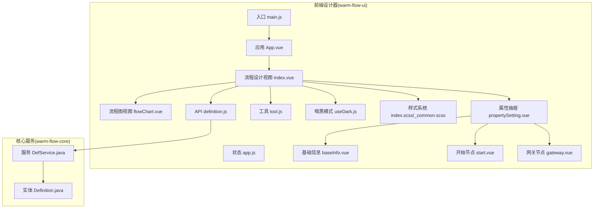
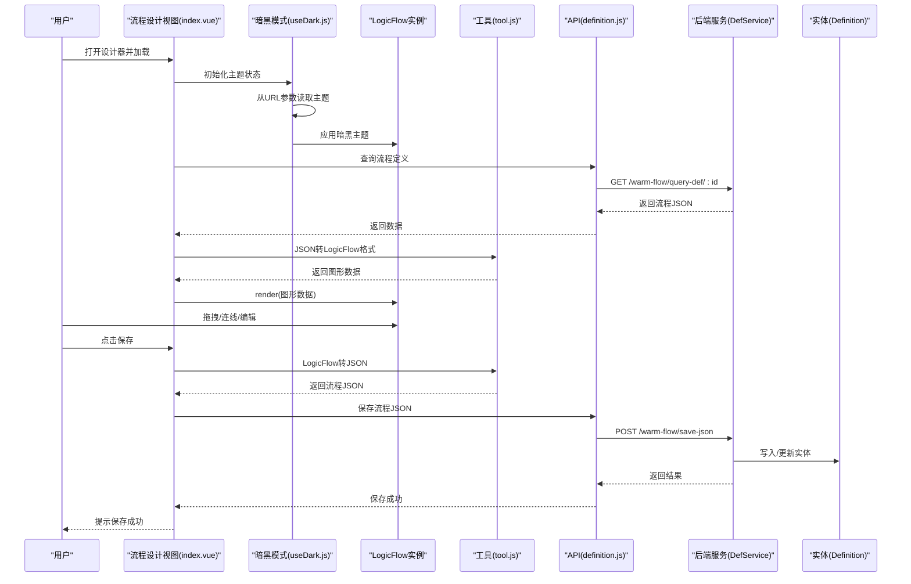
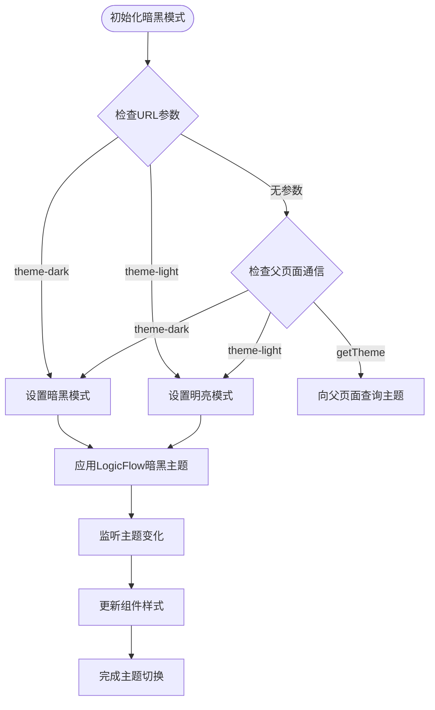
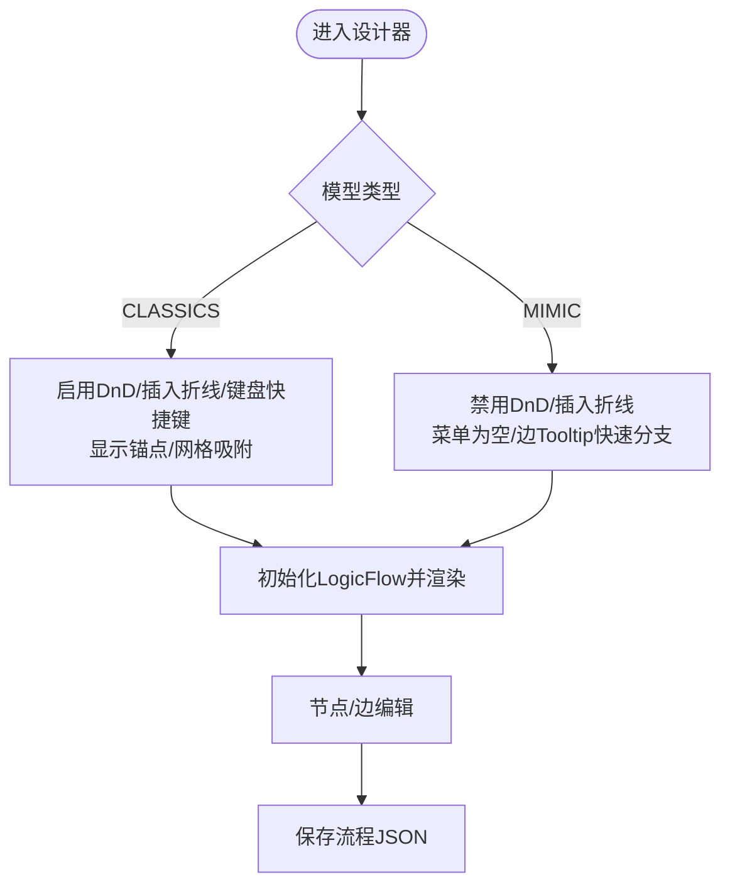
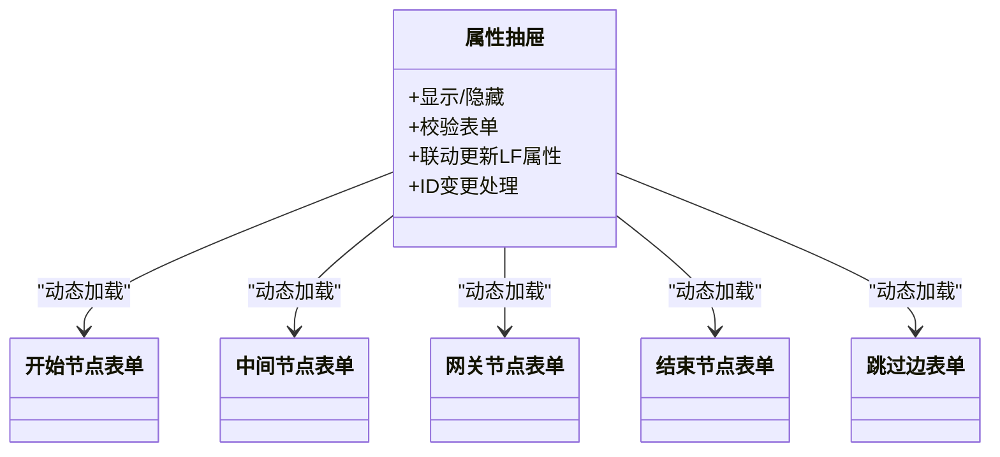
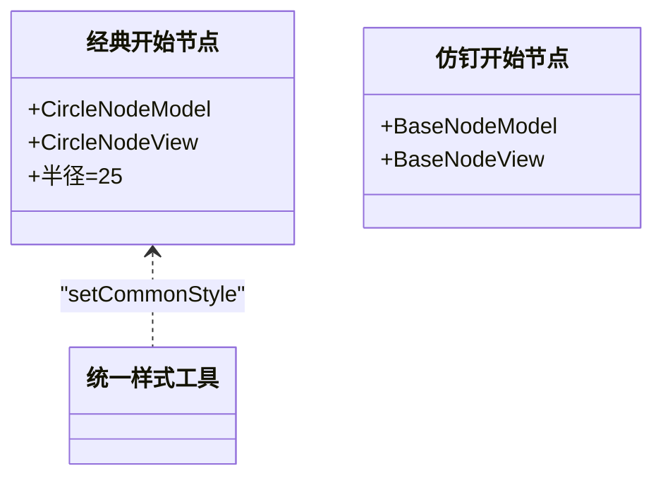
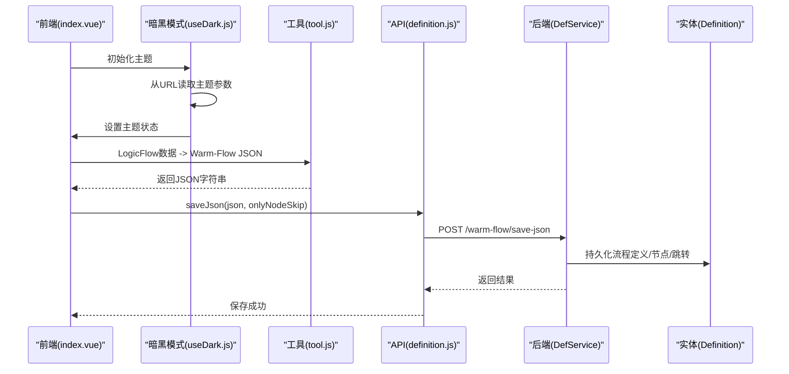
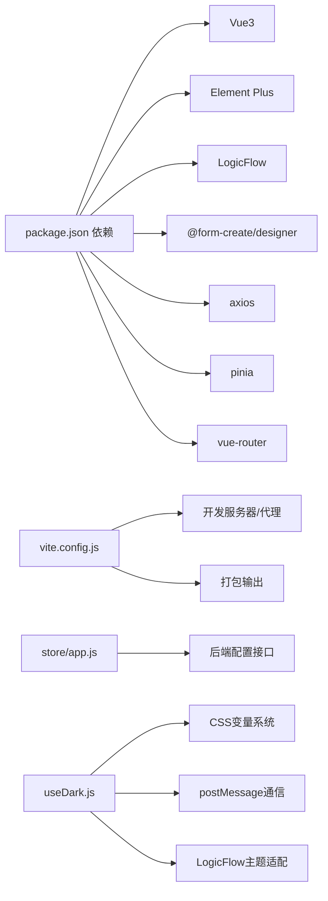

# 可视化设计器

<cite>
**本文档引用的文件**
- [warm-flow-ui/src/main.js](file://warm-flow-ui/src/main.js)
- [warm-flow-ui/package.json](file://warm-flow-ui/package.json)
- [warm-flow-ui/vite.config.js](file://warm-flow-ui/vite.config.js)
- [warm-flow-ui/src/App.vue](file://warm-flow-ui/src/App.vue)
- [warm-flow-ui/src/views/flow-design/index.vue](file://warm-flow-ui/src/views/flow-design/index.vue)
- [warm-flow-ui/src/views/flow-design/flowChart.vue](file://warm-flow-ui/src/views/flow-design/flowChart.vue)
- [warm-flow-ui/src/components/design/common/js/tool.js](file://warm-flow-ui/src/components/design/common/js/tool.js)
- [warm-flow-ui/src/api/flow/definition.js](file://warm-flow-ui/src/api/flow/definition.js)
- [warm-flow-ui/src/store/app.js](file://warm-flow-ui/src/store/app.js)
- [warm-flow-ui/src/composables/useDark.js](file://warm-flow-ui/src/composables/useDark.js)
- [warm-flow-ui/src/assets/styles/index.scss](file://warm-flow-ui/src/assets/styles/index.scss)
- [warm-flow-ui/src/assets/styles/_common.scss](file://warm-flow-ui/src/assets/styles/_common.scss)
- [warm-flow-ui/src/assets/styles/variables.module.scss](file://warm-flow-ui/src/assets/styles/variables.module.scss)
- [warm-flow-ui/src/components/design/common/vue/baseInfo.vue](file://warm-flow-ui/src/components/design/common/vue/baseInfo.vue)
- [warm-flow-ui/src/components/design/common/vue/propertySetting.vue](file://warm-flow-ui/src/components/design/common/vue/propertySetting.vue)
- [warm-flow-ui/src/components/design/common/vue/start.vue](file://warm-flow-ui/src/components/design/common/vue/start.vue)
- [warm-flow-ui/src/components/design/common/vue/gateway.vue](file://warm-flow-ui/src/components/design/common/vue/gateway.vue)
- [warm-flow-ui/src/components/design/classics/js/start.js](file://warm-flow-ui/src/components/design/classics/js/start.js)
- [warm-flow-ui/src/components/design/mimic/js/start.js](file://warm-flow-ui/src/components/design/mimic/js/start.js)
- [warm-flow-core/src/main/java/org/dromara/warm/flow/core/entity/Definition.java](file://warm-flow-core/src/main/java/org/dromara/warm/flow/core/entity/Definition.java)
- [warm-flow-core/src/main/java/org/dromara/warm/flow/core/service/DefService.java](file://warm-flow-core/src/main/java/org/dromara/warm/flow/core/service/DefService.java)
</cite>

## 目录
1. [简介](#简介)
2. [项目结构](#项目结构)
3. [核心组件](#核心组件)
4. [架构总览](#架构总览)
5. [详细组件分析](#详细组件分析)
6. [依赖关系分析](#依赖关系分析)
7. [性能考量](#性能考量)
8. [故障排查指南](#故障排查指南)
9. [结论](#结论)
10. [附录](#附录)

## 简介
本文件面向 Warm-Flow 可视化设计器，系统性梳理其前端 Vue3 + Element Plus 技术栈选型与应用、经典模型与仿钉钉模型的设计差异与实现原理、节点属性配置系统、新增的暗黑模式功能与UI美化增强、设计器与后端服务的交互协议与数据传输格式，并提供集成指南、自定义节点扩展与主题定制开发指南。目标读者既包括前端开发者，也包括需要将设计器嵌入现有项目的后端与全栈工程师。

## 项目结构
Warm-Flow 采用多模块分层组织：
- warm-flow-ui：Vue3 前端设计器，基于 Vite 构建，使用 LogicFlow 作为图形引擎，Element Plus 作为 UI 组件库。
- warm-flow-core：核心业务与实体定义，包含流程定义、节点、跳转、监听器等实体与服务接口。
- warm-flow-orm：ORM 层适配 MyBatis/MyBatis-Plus/EasyQuery 等多种实现。
- warm-flow-plugin：插件层，包含表达式策略、UI 扩展、Spring Boot/Solon 启动器等。
- warm-flow-ui-dist：构建产物目录，包含最终可部署的静态资源。

**图表来源**
- [warm-flow-ui/src/main.js:1-42](file://warm-flow-ui/src/main.js#L1-L42)
- [warm-flow-ui/src/App.vue:1-26](file://warm-flow-ui/src/App.vue#L1-L26)
- [warm-flow-ui/src/views/flow-design/index.vue:1-957](file://warm-flow-ui/src/views/flow-design/index.vue#L1-L957)
- [warm-flow-ui/src/views/flow-design/flowChart.vue:246-318](file://warm-flow-ui/src/views/flow-design/flowChart.vue#L246-L318)
- [warm-flow-ui/src/composables/useDark.js:1-85](file://warm-flow-ui/src/composables/useDark.js#L1-L85)
- [warm-flow-ui/src/assets/styles/index.scss:1-587](file://warm-flow-ui/src/assets/styles/index.scss#L1-L587)
- [warm-flow-ui/src/assets/styles/_common.scss:1-138](file://warm-flow-ui/src/assets/styles/_common.scss#L1-L138)

**章节来源**
- [warm-flow-ui/src/main.js:1-42](file://warm-flow-ui/src/main.js#L1-L42)
- [warm-flow-ui/package.json:1-42](file://warm-flow-ui/package.json#L1-L42)
- [warm-flow-ui/vite.config.js:1-71](file://warm-flow-ui/vite.config.js#L1-L71)
- [warm-flow-ui/src/App.vue:1-26](file://warm-flow-ui/src/App.vue#L1-L26)

## 核心组件
- 应用入口与依赖注入：注册 Element Plus、SVG 图标、Pinia Store、路由、全局方法与设计器插件，挂载应用。
- 视图与路由：根据参数动态切换表单设计、流程设计、表单创建等视图。
- 流程设计视图：封装 LogicFlow 实例，提供拖拽面板、菜单、快照、撤销/重做、缩放、下载、保存等能力；按模型切换经典/仿钉钉节点与行为。
- 暗黑模式系统：通过 useDark 组合式函数统一管理主题状态、URL 参数初始化、postMessage 监听，支持 LogicFlow 画布主题切换。
- 样式系统：基于 CSS 变量的主题系统，支持明暗模式自动切换，包含 Element Plus 暗黑模式适配。
- 工具链：负责 JSON 与 LogicFlow 数据格式互转、节点样式通用处理、网关前置节点计算、模型判断等。
- 属性抽屉：统一的节点/边属性编辑器，支持校验、联动更新、ID 变更、扩展字段等。
- API 层：封装保存、查询、流程图、监听器、表单等后端接口调用。
- 状态管理：从 URL 参数与后端配置中注入令牌名、框架类型等运行时参数。

**章节来源**
- [warm-flow-ui/src/main.js:1-42](file://warm-flow-ui/src/main.js#L1-L42)
- [warm-flow-ui/src/App.vue:1-26](file://warm-flow-ui/src/App.vue#L1-L26)
- [warm-flow-ui/src/views/flow-design/index.vue:1-957](file://warm-flow-ui/src/views/flow-design/index.vue#L1-L957)
- [warm-flow-ui/src/composables/useDark.js:1-85](file://warm-flow-ui/src/composables/useDark.js#L1-L85)
- [warm-flow-ui/src/assets/styles/index.scss:1-587](file://warm-flow-ui/src/assets/styles/index.scss#L1-L587)
- [warm-flow-ui/src/components/design/common/js/tool.js:1-330](file://warm-flow-ui/src/components/design/common/js/tool.js#L1-L330)
- [warm-flow-ui/src/components/design/common/vue/propertySetting.vue:1-384](file://warm-flow-ui/src/components/design/common/vue/propertySetting.vue#L1-L384)
- [warm-flow-ui/src/api/flow/definition.js:1-95](file://warm-flow-ui/src/api/flow/definition.js#L1-L95)
- [warm-flow-ui/src/store/app.js:1-42](file://warm-flow-ui/src/store/app.js#L1-L42)

## 架构总览
设计器采用"前端图形引擎 + 统一属性编辑 + 暗黑模式主题系统 + 后端服务"的分层架构。前端通过 LogicFlow 渲染流程图，属性抽屉统一承载节点/边属性编辑；暗黑模式系统通过 CSS 变量和组合式函数实现主题切换；后端提供流程定义的增删改查、发布、导出等能力，前后端通过 JSON 字符串进行数据交换。

**图表来源**
- [warm-flow-ui/src/views/flow-design/index.vue:1-957](file://warm-flow-ui/src/views/flow-design/index.vue#L1-L957)
- [warm-flow-ui/src/composables/useDark.js:1-85](file://warm-flow-ui/src/composables/useDark.js#L1-L85)
- [warm-flow-ui/src/components/design/common/js/tool.js:1-330](file://warm-flow-ui/src/components/design/common/js/tool.js#L1-L330)
- [warm-flow-ui/src/api/flow/definition.js:1-95](file://warm-flow-ui/src/api/flow/definition.js#L1-L95)
- [warm-flow-core/src/main/java/org/dromara/warm/flow/core/service/DefService.java:1-210](file://warm-flow-core/src/main/java/org/dromara/warm/flow/core/service/DefService.java#L1-L210)
- [warm-flow-core/src/main/java/org/dromara/warm/flow/core/entity/Definition.java:1-196](file://warm-flow-core/src/main/java/org/dromara/warm/flow/core/entity/Definition.java#L1-L196)

## 详细组件分析

### 暗黑模式系统与主题定制

**新增功能**：设计器现已集成完整的暗黑模式系统，通过 CSS 变量和组合式函数实现动态主题切换。

- **主题系统架构**：
  - CSS 变量定义：`index.scss` 中定义了 `--wf-*` 前缀的 CSS 变量，支持明暗模式自动切换
  - 暗黑模式检测：`useDark.js` 组合式函数统一管理主题状态，支持 URL 参数初始化和 postMessage 通信
  - LogicFlow 画布适配：自动切换背景色、网格颜色、边文字背景等
  - 组件级适配：所有组件样式通过 CSS 变量实现主题切换

- **主题切换机制**：
  - URL 参数：通过 `?theme=theme-dark` 或 `?theme=theme-light` 设置初始主题
  - 父页面通信：支持 postMessage 接收主题切换指令
  - 实时切换：watch 监听主题状态变化，实时更新 LogicFlow 和组件样式

- **样式系统增强**：
  - 基础信息组件：`baseInfo.vue` 实现了完整的暗黑模式适配
  - 属性抽屉：`propertySetting.vue` 适配暗黑模式下的抽屉背景和边框
  - 节点组件：开始节点、网关节点等组件均支持暗黑模式
  - Element Plus 适配：完整的暗黑模式样式覆盖

**图表来源**
- [warm-flow-ui/src/composables/useDark.js:1-85](file://warm-flow-ui/src/composables/useDark.js#L1-L85)
- [warm-flow-ui/src/views/flow-design/index.vue:297-335](file://warm-flow-ui/src/views/flow-design/index.vue#L297-L335)
- [warm-flow-ui/src/assets/styles/index.scss:32-56](file://warm-flow-ui/src/assets/styles/index.scss#L32-L56)

**章节来源**
- [warm-flow-ui/src/composables/useDark.js:1-85](file://warm-flow-ui/src/composables/useDark.js#L1-L85)
- [warm-flow-ui/src/views/flow-design/index.vue:297-335](file://warm-flow-ui/src/views/flow-design/index.vue#L297-L335)
- [warm-flow-ui/src/assets/styles/index.scss:1-587](file://warm-flow-ui/src/assets/styles/index.scss#L1-L587)
- [warm-flow-ui/src/components/design/common/vue/baseInfo.vue:766-805](file://warm-flow-ui/src/components/design/common/vue/baseInfo.vue#L766-L805)
- [warm-flow-ui/src/components/design/common/vue/propertySetting.vue:340-382](file://warm-flow-ui/src/components/design/common/vue/propertySetting.vue#L340-L382)

### 经典模型 vs 仿钉钉模型
- 模型标识：通过流程定义中的模型值区分 CLASSICS 与 MIMIC。
- 经典模型(Classics)：
  - 支持 DnD 拖拽面板、插入折线节点、键盘快捷键删除、显示/隐藏锚点、网格吸附、hover/选中轮廓等。
  - 节点类型：开始、中间、串行网关、并行网关、包含网关、结束、跳过。
- 仿钉钉模型(Mimic)：
  - 不启用 DnD 与插入折线，禁用键盘快捷键；菜单为空；节点点击即编辑，支持边 Tooltip 快速添加分支节点。
  - 节点类型：开始、中间、串行/并行/包含网关、结束、跳过。
- 主题与交互差异：两模型在 Grid、Snapline、Edge 文字背景、暗黑主题消息同步等方面存在差异化配置。

**图表来源**
- [warm-flow-ui/src/views/flow-design/index.vue:258-321](file://warm-flow-ui/src/views/flow-design/index.vue#L258-L321)
- [warm-flow-ui/src/components/design/common/js/tool.js:316-330](file://warm-flow-ui/src/components/design/common/js/tool.js#L316-L330)

**章节来源**
- [warm-flow-ui/src/views/flow-design/index.vue:258-321](file://warm-flow-ui/src/views/flow-design/index.vue#L258-L321)
- [warm-flow-ui/src/components/design/common/js/tool.js:316-330](file://warm-flow-ui/src/components/design/common/js/tool.js#L316-L330)

### 节点属性配置系统
- 统一抽屉：通过属性抽屉组件根据节点类型动态加载对应表单组件，支持校验、联动更新、ID 变更、扩展字段等。
- 属性联动：
  - 节点名称变更 -> 同步更新 LogicFlow 文本与 properties。
  - 跳转类型/条件/名称变更 -> 实时写入 properties 并更新边 ID。
  - 权限标志、协作方式、节点比例、监听器类型/路径、表单自定义等均通过 watch 实时同步。
- 表单组件：start/between/serial/parallel/inclusive/end/skip 对应不同表单组件，支持条件表达式、监听器列表、表单路径等。

**图表来源**
- [warm-flow-ui/src/components/design/common/vue/propertySetting.vue:1-384](file://warm-flow-ui/src/components/design/common/vue/propertySetting.vue#L1-L384)

**章节来源**
- [warm-flow-ui/src/components/design/common/vue/propertySetting.vue:1-384](file://warm-flow-ui/src/components/design/common/vue/propertySetting.vue#L1-L384)

### 节点与视图模型
- 经典模型节点：基于 CircleNode/CircleNodeModel，统一设置半径与样式。
- 仿钉钉模型节点：基于 BaseNodeModel/BaseNodeView，复用统一基类与视图。

**图表来源**
- [warm-flow-ui/src/components/design/classics/js/start.js:1-23](file://warm-flow-ui/src/components/design/classics/js/start.js#L1-L23)
- [warm-flow-ui/src/components/design/mimic/js/start.js:1-14](file://warm-flow-ui/src/components/design/mimic/js/start.js#L1-L14)
- [warm-flow-ui/src/components/design/common/js/tool.js:255-285](file://warm-flow-ui/src/components/design/common/js/tool.js#L255-L285)

**章节来源**
- [warm-flow-ui/src/components/design/classics/js/start.js:1-23](file://warm-flow-ui/src/components/design/classics/js/start.js#L1-L23)
- [warm-flow-ui/src/components/design/mimic/js/start.js:1-14](file://warm-flow-ui/src/components/design/mimic/js/start.js#L1-L14)
- [warm-flow-ui/src/components/design/common/js/tool.js:255-285](file://warm-flow-ui/src/components/design/common/js/tool.js#L255-L285)

### 数据格式与交互协议
- 前端 JSON 与后端 JSON：
  - 前端通过工具函数在 LogicFlow 图形数据与 Warm-Flow 定义 JSON 之间双向转换。
  - 保存时携带 onlyNodeSkip 请求头，控制仅保存节点与跳转。
- 接口清单：
  - 保存流程 JSON：POST /warm-flow/save-json
  - 查询流程定义：GET /warm-flow/query-def/:id
  - 查询流程图：GET /warm-flow/query-flow-chart/:id
  - 办理人权限/监听器/表单等辅助接口：GET /warm-flow/handler-*、/listener-list、/published-form 等

**图表来源**
- [warm-flow-ui/src/views/flow-design/index.vue:468-500](file://warm-flow-ui/src/views/flow-design/index.vue#L468-L500)
- [warm-flow-ui/src/composables/useDark.js:14-24](file://warm-flow-ui/src/composables/useDark.js#L14-L24)
- [warm-flow-ui/src/components/design/common/js/tool.js:138-253](file://warm-flow-ui/src/components/design/common/js/tool.js#L138-L253)
- [warm-flow-ui/src/api/flow/definition.js:1-95](file://warm-flow-ui/src/api/flow/definition.js#L1-L95)
- [warm-flow-core/src/main/java/org/dromara/warm/flow/core/service/DefService.java:72-82](file://warm-flow-core/src/main/java/org/dromara/warm/flow/core/service/DefService.java#L72-L82)

**章节来源**
- [warm-flow-ui/src/components/design/common/js/tool.js:138-253](file://warm-flow-ui/src/components/design/common/js/tool.js#L138-L253)
- [warm-flow-ui/src/api/flow/definition.js:1-95](file://warm-flow-ui/src/api/flow/definition.js#L1-L95)
- [warm-flow-core/src/main/java/org/dromara/warm/flow/core/service/DefService.java:72-82](file://warm-flow-core/src/main/java/org/dromara/warm/flow/core/service/DefService.java#L72-L82)

### 集成指南
- 运行与构建
  - 使用 Yarn 安装依赖，开发模式启动 Vite，生产构建生成 dist。
  - 代理配置指向后端服务地址，便于联调。
- 嵌入方式
  - 通过 URL 参数传入设计器所需的令牌名、框架类型与业务参数，应用启动时自动拉取配置并注入运行时参数。
  - 支持主题参数：`?theme=theme-dark` 或 `?theme=theme-light`。
  - 支持仅展示设计界面模式，通过参数控制。
- 与后端对接
  - 通过环境变量前缀拼接后端接口地址，遵循统一的请求/响应格式。
  - 保存时携带 onlyNodeSkip 头部，控制保存范围。

**章节来源**
- [warm-flow-ui/package.json:1-42](file://warm-flow-ui/package.json#L1-L42)
- [warm-flow-ui/vite.config.js:1-71](file://warm-flow-ui/vite.config.js#L1-L71)
- [warm-flow-ui/src/store/app.js:1-42](file://warm-flow-ui/src/store/app.js#L1-L42)
- [warm-flow-ui/src/api/flow/definition.js:1-95](file://warm-flow-ui/src/api/flow/definition.js#L1-L95)

### 自定义节点扩展与主题定制
- 自定义节点
  - 经典模型：基于 LogicFlow 圆形节点，复用统一样式工具。
  - 仿钉模型：基于 BaseNodeModel/BaseNodeView，保持一致的交互体验。
  - 注册与使用：在视图中按模型注册对应节点，启用/禁用 DnD 与菜单。
- 主题定制
  - CSS 变量系统：通过 `--wf-*` 前缀的 CSS 变量实现主题切换。
  - 组件适配：所有组件通过 CSS 变量实现暗黑模式适配。
  - LogicFlow 适配：自动切换画布背景、网格、边文字等样式。
  - Element Plus 适配：完整的暗黑模式样式覆盖。

**章节来源**
- [warm-flow-ui/src/views/flow-design/index.vue:258-321](file://warm-flow-ui/src/views/flow-design/index.vue#L258-L321)
- [warm-flow-ui/src/components/design/classics/js/start.js:1-23](file://warm-flow-ui/src/components/design/classics/js/start.js#L1-L23)
- [warm-flow-ui/src/components/design/mimic/js/start.js:1-14](file://warm-flow-ui/src/components/design/mimic/js/start.js#L1-L14)
- [warm-flow-ui/src/assets/styles/index.scss:32-586](file://warm-flow-ui/src/assets/styles/index.scss#L32-L586)

## 依赖关系分析
- 前端依赖
  - Vue3、Element Plus、LogicFlow、@form-create/designer、axios、pinia、vue-router 等。
- 构建与开发
  - Vite、Sass、自动导入、SVG 图标、压缩插件等。
- 运行时参数
  - 从后端配置接口获取令牌名列表与框架类型，注入到应用参数中，用于鉴权与功能开关。
- 主题系统
  - CSS 变量、组合式函数、postMessage 通信、LogicFlow 主题适配。

**图表来源**
- [warm-flow-ui/package.json:1-42](file://warm-flow-ui/package.json#L1-L42)
- [warm-flow-ui/vite.config.js:1-71](file://warm-flow-ui/vite.config.js#L1-L71)
- [warm-flow-ui/src/store/app.js:1-42](file://warm-flow-ui/src/store/app.js#L1-L42)
- [warm-flow-ui/src/composables/useDark.js:1-85](file://warm-flow-ui/src/composables/useDark.js#L1-L85)
- [warm-flow-ui/src/assets/styles/index.scss:1-587](file://warm-flow-ui/src/assets/styles/index.scss#L1-L587)

**章节来源**
- [warm-flow-ui/package.json:1-42](file://warm-flow-ui/package.json#L1-L42)
- [warm-flow-ui/vite.config.js:1-71](file://warm-flow-ui/vite.config.js#L1-L71)
- [warm-flow-ui/src/store/app.js:1-42](file://warm-flow-ui/src/store/app.js#L1-L42)
- [warm-flow-ui/src/composables/useDark.js:1-85](file://warm-flow-ui/src/composables/useDark.js#L1-L85)

## 性能考量
- 图形渲染优化
  - 合理设置网格大小与可见性，避免过多节点时的重绘压力。
  - 使用快照导出 PNG/WebP/JPEG/SVG，按需选择格式与背景色。
  - 暗黑模式下 LogicFlow 画布背景色和网格颜色优化，减少渲染开销。
- 交互性能
  - 仅在必要时渲染 DnD 与菜单，减少 DOM 与事件绑定数量。
  - 通过 watch 联动更新属性时，注意去抖与批量更新，避免频繁重绘。
  - CSS 变量主题切换比传统样式切换性能更好。
- 构建优化
  - 分包与命名策略降低首屏体积，按需引入样式与图标。
  - 生产构建开启压缩与缓存策略，提升加载速度。
  - 暗黑模式样式通过 CSS 变量实现，无需额外样式文件。

## 故障排查指南
- 无法连接后端
  - 检查代理配置与环境变量前缀，确认 /dev-api 代理是否正确转发。
- 保存失败
  - 确认 onlyNodeSkip 头部是否正确传递；检查后端返回码与错误信息。
- 模型切换异常
  - 确认流程定义中的模型值是否为 CLASSICS 或 MIMIC；切换时确保重新渲染。
- 暗黑主题不同步
  - 确认父子页面消息通信是否正常，检查主题消息监听与类名切换逻辑。
  - 检查 URL 参数格式是否正确：`?theme=theme-dark` 或 `?theme=theme-light`。
  - 确认 CSS 变量是否正确应用到 LogicFlow 画布。
- 样式异常
  - 检查 `index.scss` 中的 CSS 变量定义是否完整。
  - 确认组件中是否正确使用了 CSS 变量而非硬编码颜色。

**章节来源**
- [warm-flow-ui/vite.config.js:43-50](file://warm-flow-ui/vite.config.js#L43-L50)
- [warm-flow-ui/src/api/flow/definition.js:1-95](file://warm-flow-ui/src/api/flow/definition.js#L1-L95)
- [warm-flow-ui/src/views/flow-design/index.vue:353-378](file://warm-flow-ui/src/views/flow-design/index.vue#L353-L378)
- [warm-flow-ui/src/composables/useDark.js:14-24](file://warm-flow-ui/src/composables/useDark.js#L14-L24)

## 结论
Warm-Flow 可视化设计器以 Vue3 + Element Plus 为基础，结合 LogicFlow 提供了强大的流程图绘制能力，并通过统一的属性抽屉与工具链实现了前后端 JSON 的无缝转换。新增的暗黑模式系统通过 CSS 变量和组合式函数实现了完整的主题切换功能，所有组件均支持明暗模式自动适配。经典模型与仿钉钉模型在交互与可视化的差异上满足不同场景需求；通过清晰的 API 协议与状态注入机制，设计器易于嵌入现有系统。建议在实际集成中关注构建优化、主题一致性与后端接口稳定性，以获得最佳的用户体验与开发效率。

## 附录
- 关键实现路径参考
  - 应用入口与依赖：[warm-flow-ui/src/main.js:1-42](file://warm-flow-ui/src/main.js#L1-L42)
  - 视图与路由切换：[warm-flow-ui/src/App.vue:1-26](file://warm-flow-ui/src/App.vue#L1-L26)
  - 流程设计视图与交互：[warm-flow-ui/src/views/flow-design/index.vue:1-957](file://warm-flow-ui/src/views/flow-design/index.vue#L1-L957)
  - 暗黑模式系统：[warm-flow-ui/src/composables/useDark.js:1-85](file://warm-flow-ui/src/composables/useDark.js#L1-L85)
  - 样式系统：[warm-flow-ui/src/assets/styles/index.scss:1-587](file://warm-flow-ui/src/assets/styles/index.scss#L1-L587)
  - JSON 转换工具：[warm-flow-ui/src/components/design/common/js/tool.js:1-330](file://warm-flow-ui/src/components/design/common/js/tool.js#L1-L330)
  - 属性抽屉组件：[warm-flow-ui/src/components/design/common/vue/propertySetting.vue:1-384](file://warm-flow-ui/src/components/design/common/vue/propertySetting.vue#L1-L384)
  - 基础信息组件：[warm-flow-ui/src/components/design/common/vue/baseInfo.vue:1-840](file://warm-flow-ui/src/components/design/common/vue/baseInfo.vue#L1-L840)
  - API 接口封装：[warm-flow-ui/src/api/flow/definition.js:1-95](file://warm-flow-ui/src/api/flow/definition.js#L1-L95)
  - 状态注入与参数：[warm-flow-ui/src/store/app.js:1-42](file://warm-flow-ui/src/store/app.js#L1-L42)
  - 后端服务接口：[warm-flow-core/src/main/java/org/dromara/warm/flow/core/service/DefService.java:1-210](file://warm-flow-core/src/main/java/org/dromara/warm/flow/core/service/DefService.java#L1-L210)
  - 流程定义实体：[warm-flow-core/src/main/java/org/dromara/warm/flow/core/entity/Definition.java:1-196](file://warm-flow-core/src/main/java/org/dromara/warm/flow/core/entity/Definition.java#L1-L196)