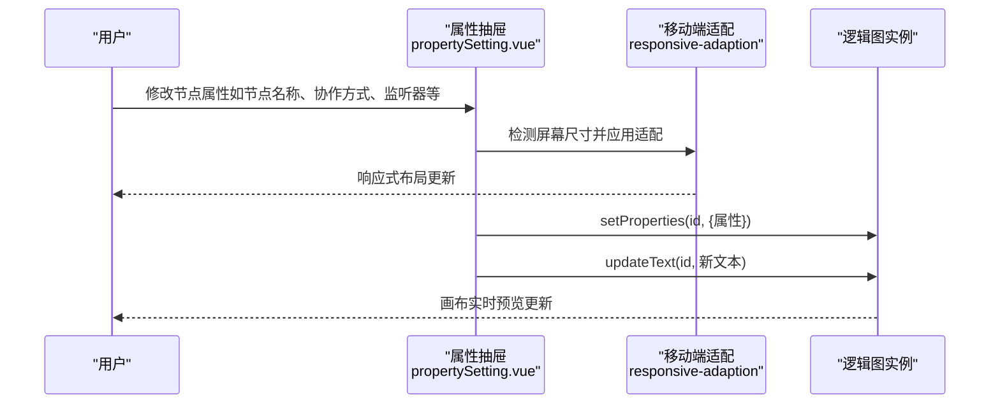
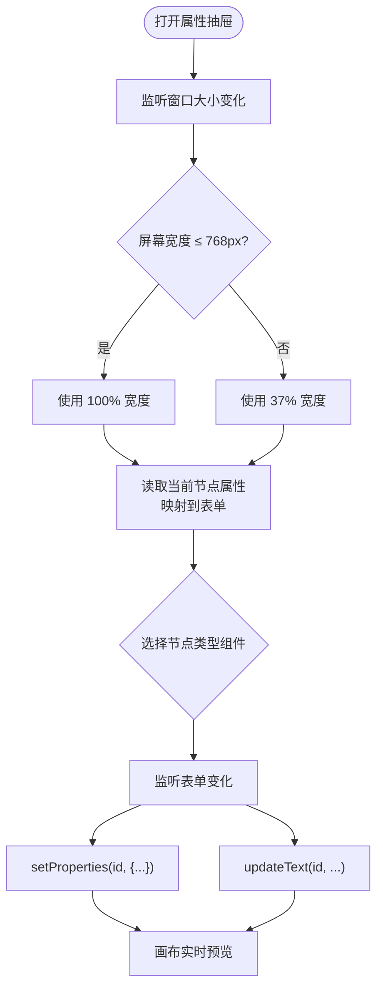
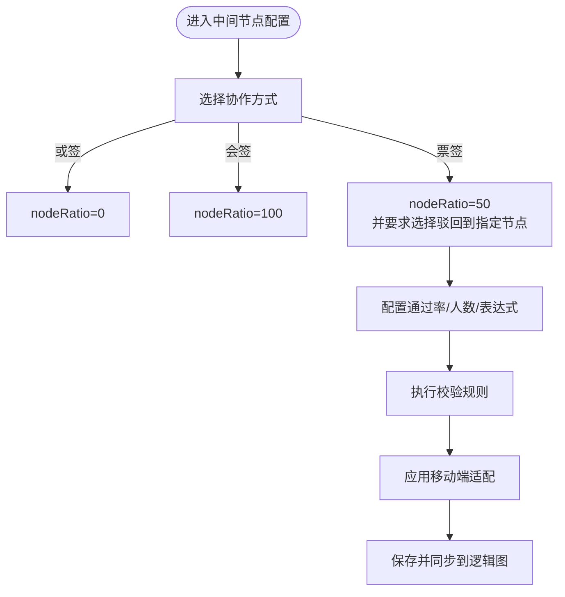
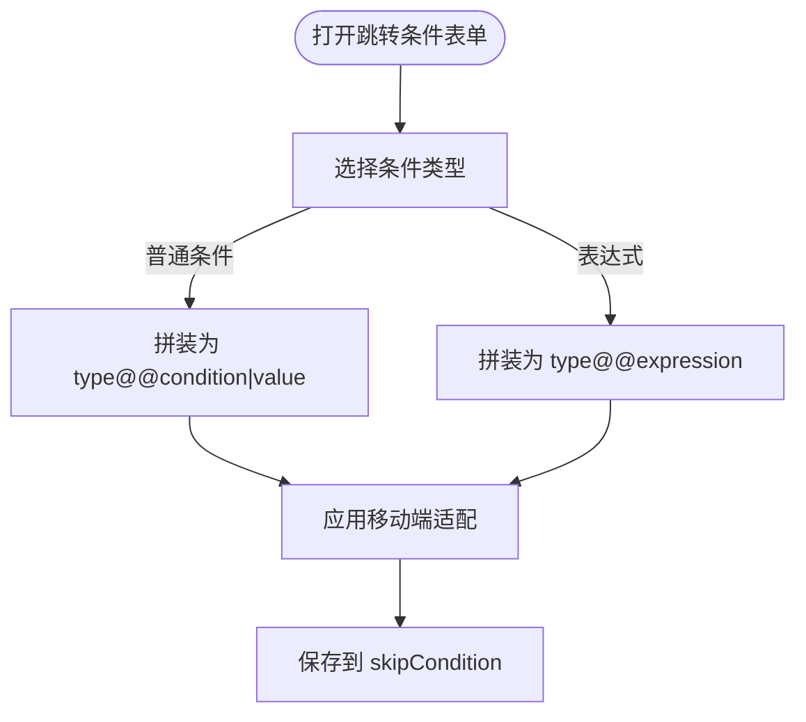
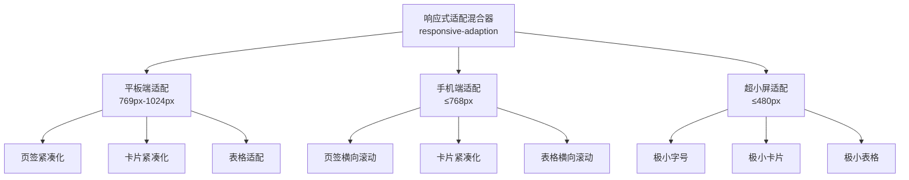
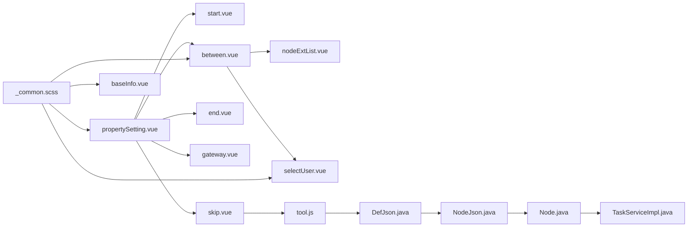

# 节点属性配置

<cite>
**本文档引用的文件**
- [propertySetting.vue](file://warm-flow-ui/src/components/design/common/vue/propertySetting.vue)
- [baseInfo.vue](file://warm-flow-ui/src/components/design/common/vue/baseInfo.vue)
- [between.vue](file://warm-flow-ui/src/components/design/common/vue/between.vue)
- [start.vue](file://warm-flow-ui/src/components/design/common/vue/start.vue)
- [end.vue](file://warm-flow-ui/src/components/design/common/vue/end.vue)
- [gateway.vue](file://warm-flow-ui/src/components/design/common/vue/gateway.vue)
- [skip.vue](file://warm-flow-ui/src/components/design/common/vue/skip.vue)
- [nodeExtList.vue](file://warm-flow-ui/src/components/design/common/vue/nodeExtList.vue)
- [selectUser.vue](file://warm-flow-ui/src/components/design/common/vue/selectUser.vue)
- [tool.js](file://warm-flow-ui/src/components/design/common/js/tool.js)
- [baseNodeView.js](file://warm-flow-ui/src/components/design/mimic/js/baseNodeView.js)
- [_common.scss](file://warm-flow-ui/src/assets/styles/_common.scss)
- [Node.java](file://warm-flow-core/src/main/java/org/dromara/warm/flow/core/entity/Node.java)
- [DefJson.java](file://warm-flow-core/src/main/java/org/dromara/warm/flow/core/dto/DefJson.java)
- [NodeJson.java](file://warm-flow-core/src/main/java/org/dromara/warm/flow/core/dto/NodeJson.java)
- [JsonConvert.java](file://warm-flow-core/src/main/java/org/dromara/warm/flow/core/json/JsonConvert.java)
- [NodeType.java](file://warm-flow-core/src/main/java/org/dromara/warm/flow/core/enums/NodeType.java)
- [TaskServiceImpl.java](file://warm-flow-core/src/main/java/org/dromara/warm/flow/core/service/impl/TaskServiceImpl.java)
</cite>

## 更新摘要
**所做更改**
- 新增响应式适配章节，详细介绍移动端优化的布局和交互模式
- 更新属性抽屉章节，增加移动端抽屉宽度自适应和防抖机制
- 新增基础信息面板移动端优化章节，包括垂直排列的单选卡片和紧凑布局
- 更新中间节点配置章节，增加移动端协作方式和表单布局优化
- 新增监听器表格移动端适配章节，介绍横向滚动和紧凑显示
- 更新扩展属性列表章节，增加移动端垂直布局和紧凑显示
- 新增用户选择对话框移动端优化章节，介绍响应式布局和标签显示

## 目录
1. [简介](#简介)
2. [项目结构](#项目结构)
3. [核心组件](#核心组件)
4. [架构总览](#架构总览)
5. [详细组件分析](#详细组件分析)
6. [响应式适配与移动端优化](#响应式适配与移动端优化)
7. [依赖分析](#依赖分析)
8. [性能考虑](#性能考虑)
9. [故障排查指南](#故障排查指南)
10. [结论](#结论)
11. [附录](#附录)

## 简介
本文件面向 Warm-Flow 的"节点属性配置系统"，系统性梳理前端属性面板设计与实现、属性绑定机制、数据验证规则、实时预览联动、不同节点类型的特殊配置、以及属性数据的序列化与反序列化流程。特别关注最新的响应式适配和移动端优化功能，包括基础信息面板、属性抽屉、监听器表格等组件的移动端友好布局和交互模式。同时提供扩展指南，帮助开发者新增配置项与自定义验证规则。

## 项目结构
Warm-Flow 的节点属性配置主要由以下层次构成：
- 前端属性面板层：基于 Vue 组件的属性抽屉与各节点类型专用表单组件
- 前端工具层：逻辑图与流程定义之间的转换工具
- 前端样式层：响应式适配和移动端优化的 SCSS 混合器
- 后端实体与 DTO 层：节点与流程定义的 Java 实体与 JSON 映射
- 运行时服务层：节点协作策略、监听器、权限等运行期逻辑

```mermaid
graph TB
subgraph "前端"
PS["属性抽屉<br/>propertySetting.vue"]
BI["基础信息<br/>baseInfo.vue"]
BT["中间节点表单<br/>between.vue"]
ST["开始节点表单<br/>start.vue"]
ED["结束节点表单<br/>end.vue"]
GW["网关节点表单<br/>gateway.vue"]
SK["跳转条件表单<br/>skip.vue"]
NE["扩展属性列表<br/>nodeExtList.vue"]
SU["用户选择对话框<br/>selectUser.vue"]
TL["工具函数<br/>tool.js"]
BV["节点视图桥接<br/>baseNodeView.js"]
CS["公共样式<br/>_common.scss"]
end
subgraph "后端"
NJ["Node 实体<br/>Node.java"]
DJ["DefJson DTO<br/>DefJson.java"]
NJs["NodeJson DTO<br/>NodeJson.java"]
JC["JsonConvert 接口<br/>JsonConvert.java"]
NT["节点类型枚举<br/>NodeType.java"]
TS["任务服务<br/>TaskServiceImpl.java"]
end
PS --> BI
PS --> BT
PS --> ST
PS --> ED
PS --> GW
PS --> SK
BT --> NE
BT --> SU
SK --> TL
BV --> PS
TL --> DJ
DJ --> NJs
NJs --> NJ
JC --> DJ
TS --> NJ
CS --> PS
CS --> BI
CS --> BT
CS --> SU
```

**图表来源**
- [propertySetting.vue:1-428](file://warm-flow-ui/src/components/design/common/vue/propertySetting.vue#L1-L428)
- [baseInfo.vue:1-800](file://warm-flow-ui/src/components/design/common/vue/baseInfo.vue#L1-L800)
- [between.vue:1-800](file://warm-flow-ui/src/components/design/common/vue/between.vue#L1-L800)
- [nodeExtList.vue:1-547](file://warm-flow-ui/src/components/design/common/vue/nodeExtList.vue#L1-L547)
- [selectUser.vue:1-918](file://warm-flow-ui/src/components/design/common/vue/selectUser.vue#L1-L918)
- [_common.scss:1-434](file://warm-flow-ui/src/assets/styles/_common.scss#L1-L434)

**章节来源**
- [propertySetting.vue:1-428](file://warm-flow-ui/src/components/design/common/vue/propertySetting.vue#L1-L428)
- [tool.js:1-258](file://warm-flow-ui/src/components/design/common/js/tool.js#L1-L258)

## 核心组件
- 属性抽屉（propertySetting.vue）：统一承载节点属性编辑，按节点类型动态渲染对应表单组件，并将表单变更实时写入逻辑图节点属性。新增响应式适配功能，支持移动端全屏显示和桌面端宽度自适应。
- 节点表单组件：start、between、end、gateway、skip 等，分别负责对应节点类型的属性配置。所有组件均集成响应式适配，支持移动端垂直布局和紧凑显示。
- 扩展属性列表（nodeExtList.vue）：支持多种输入控件（文本、多行文本、下拉、单选/多选、数值、日期/时间、用户权限等），并提供校验与回显。移动端采用垂直布局和紧凑间距。
- 用户选择（selectUser.vue）：提供树形组织架构与权限分组，支持多选并回显权限名称。移动端采用响应式布局和智能标签显示。
- 工具函数（tool.js）：负责流程定义与逻辑图数据的双向转换，包括坐标、属性、扩展字段等。
- 节点视图桥接（baseNodeView.js）：将逻辑图节点与 Vue 组件桥接，支持节点名称、权限、状态等属性的实时更新与事件透传。
- 公共样式（_common.scss）：提供响应式适配混合器，支持平板端和手机端的布局优化。

**章节来源**
- [propertySetting.vue:1-428](file://warm-flow-ui/src/components/design/common/vue/propertySetting.vue#L1-L428)
- [between.vue:1-800](file://warm-flow-ui/src/components/design/common/vue/between.vue#L1-L800)
- [nodeExtList.vue:1-547](file://warm-flow-ui/src/components/design/common/vue/nodeExtList.vue#L1-L547)
- [selectUser.vue:1-918](file://warm-flow-ui/src/components/design/common/vue/selectUser.vue#L1-L918)
- [_common.scss:1-434](file://warm-flow-ui/src/assets/styles/_common.scss#L1-L434)

## 架构总览
属性配置系统采用"组件驱动 + 数据绑定 + 工具转换 + 响应式适配"的架构：
- 组件层：每个节点类型拥有独立的表单组件，统一挂载在属性抽屉下，通过 v-model 与逻辑图节点 properties 同步。
- 绑定层：watch 监听表单变化，调用逻辑图 API 更新节点属性与文本，保证画布实时预览。
- 转换层：tool.js 提供定义与逻辑图之间的序列化/反序列化，确保持久化与渲染一致。
- 适配层：_common.scss 提供响应式混合器，支持平板端和手机端的布局优化。
- 实体层：后端 Node/NodeJson/DefJson 与枚举 NodeType 映射前端属性，保障运行期一致性。

**图表来源**
- [propertySetting.vue:35-44](file://warm-flow-ui/src/components/design/common/vue/propertySetting.vue#L35-L44)
- [propertySetting.vue:347-351](file://warm-flow-ui/src/components/design/common/vue/propertySetting.vue#L347-L351)
- [baseNodeView.js:19-32](file://warm-flow-ui/src/components/design/mimic/js/baseNodeView.js#L19-L32)

## 详细组件分析

### 属性抽屉与节点类型路由
- 动态组件渲染：根据当前选中节点类型，从 COMPONENT_LIST 中选择对应表单组件进行渲染。
- 属性同步：通过 watch 监听表单值变化，调用逻辑图 setProperties 与 updateText，实现属性与文本的双向同步。
- 特殊联动：如协作方式与 nodeRatio 的联动、权限标识的数组拼接、监听器类型数组的逗号拼接等。
- 响应式适配：新增窗口宽度监听，移动端（≤768px）使用 100% 宽度，桌面端使用 37% 宽度。
- 防抖机制：节点点击打开抽屉时的防抖标记，防止 blank:click 立即关闭。

**图表来源**
- [propertySetting.vue:35-44](file://warm-flow-ui/src/components/design/common/vue/propertySetting.vue#L35-L44)
- [propertySetting.vue:134-205](file://warm-flow-ui/src/components/design/common/vue/propertySetting.vue#L134-L205)
- [propertySetting.vue:219-226](file://warm-flow-ui/src/components/design/common/vue/propertySetting.vue#L219-L226)

**章节来源**
- [propertySetting.vue:1-428](file://warm-flow-ui/src/components/design/common/vue/propertySetting.vue#L1-L428)

### 中间节点（between）配置
- 协作方式：或签、票签、会签三种模式，通过 collaborativeWay 控制，与 nodeRatio 联动（0/50/100 对应不同协作策略）。
- 票签策略：支持通过率、固定通过人数、固定驳回人数，以及默认表达式/SpEL/SPEL 表达式三类表达式策略，具备严格的输入校验。
- 办理人设置：支持权限标识的多选与回显，提供"选择"弹窗，支持树形组织架构筛选。
- 监听器：支持监听器类型与路径的表格配置，支持手动输入或下拉选择。
- 扩展属性：通过 nodeExtList.vue 支持多类型扩展字段，含必填校验与回显。
- 响应式优化：移动端采用垂直排列的协作方式卡片，表单控件堆叠显示，表格隐藏入库主键列。

**图表来源**
- [between.vue:40-80](file://warm-flow-ui/src/components/design/common/vue/between.vue#L40-L80)
- [between.vue:82-107](file://warm-flow-ui/src/components/design/common/vue/between.vue#L82-L107)
- [between.vue:754-795](file://warm-flow-ui/src/components/design/common/vue/between.vue#L754-L795)

**章节来源**
- [between.vue:1-800](file://warm-flow-ui/src/components/design/common/vue/between.vue#L1-L800)

### 跳转条件（skip）配置
- 跳转类型：审批通过/退回两种。
- 跳转条件：支持条件名 + 条件类型 + 条件值，或直接使用表达式（默认/SpEL/SPEL）。
- 表达式校验：对默认表达式、SpEL、SPEL 的格式进行严格校验，确保表达式闭合与格式正确。
- 属性拼装：将条件类型、条件名、条件值按约定格式拼装为 skipCondition 字段。
- 响应式优化：移动端跳转条件区域的输入框采用堆叠显示，确保在小屏幕上良好的可读性和可操作性。

**图表来源**
- [skip.vue:17-22](file://warm-flow-ui/src/components/design/common/vue/skip.vue#L17-L22)
- [skip.vue:23-40](file://warm-flow-ui/src/components/design/common/vue/skip.vue#L23-L40)
- [skip.vue:195-208](file://warm-flow-ui/src/components/design/common/vue/skip.vue#L195-L208)

**章节来源**
- [skip.vue:1-210](file://warm-flow-ui/src/components/design/common/vue/skip.vue#L1-L210)

### 扩展属性列表（nodeExtList）
- 输入类型丰富：文本、多行文本、下拉、单选/多选、数值、日期/时间、用户权限等。
- 必填校验：根据 must 字段生成必填规则。
- 用户权限回显：当字段类型为 5（用户权限）时，自动调用接口回显权限名称。
- 类型初始化：对数值类型字段进行类型转换，避免字符串参与计算。
- 响应式优化：移动端采用垂直布局，单选/多选卡片缩小间距，标签显示紧凑，对话框全屏显示。

**章节来源**
- [nodeExtList.vue:1-547](file://warm-flow-ui/src/components/design/common/vue/nodeExtList.vue#L1-L547)

### 用户选择（selectUser）
- 多标签已选：顶部展示已选权限标识与名称，支持智能显示和溢出提示。
- 树形筛选：支持按部门名称过滤树节点，点击树节点自动查询该分组下的权限结果。
- 分页与搜索：支持权限编码/名称、创建时间范围搜索，分页加载。
- 多选提交：支持全选与逐条勾选，提交时回调父组件并关闭弹窗。
- 响应式优化：移动端采用响应式布局，左侧树状选择和右侧列表数据自适应，智能标签显示策略。

**章节来源**
- [selectUser.vue:1-918](file://warm-flow-ui/src/components/design/common/vue/selectUser.vue#L1-L918)

### 基础信息（baseInfo）
- 流程基本信息：流程编码、流程名称、设计器模型（经典/仿钉钉）、流程类别、表单配置（自定义/非自定义）。
- 设计器模型：采用垂直排列的单选卡片，支持经典模型和仿钉钉模型的选择。
- 监听器配置：支持监听器类型与路径的表格配置，支持手动输入或下拉选择。
- 表单校验：对必填字段进行校验，支持动态提示与错误信息。
- 响应式优化：移动端采用紧凑布局，单选卡片垂直排列，表格支持横向滚动。

**章节来源**
- [baseInfo.vue:1-800](file://warm-flow-ui/src/components/design/common/vue/baseInfo.vue#L1-L800)

### 节点类型专用表单
- 开始节点（start）：节点编码、节点名称、监听器配置。
- 结束节点（end）：节点编码、节点名称。
- 网关节点（gateway）：节点编码（串行/并行/包容网关通用）。

**章节来源**
- [start.vue:1-190](file://warm-flow-ui/src/components/design/common/vue/start.vue#L1-L190)
- [end.vue:1-58](file://warm-flow-ui/src/components/design/common/vue/end.vue#L1-L58)
- [gateway.vue:1-58](file://warm-flow-ui/src/components/design/common/vue/gateway.vue#L1-L58)

## 响应式适配与移动端优化

### 响应式适配架构
Warm-Flow 采用统一的响应式适配架构，通过 SCSS 混合器和组件级别的适配策略，确保在不同设备上都能提供良好的用户体验：

- **统一适配策略**：通过 `_common.scss` 中的 `responsive-adaption` 混合器，为所有组件提供一致的响应式行为
- **多层级适配**：支持平板端（769px-1024px）、手机端（≤768px）和超小屏（≤480px）的差异化适配
- **智能布局调整**：根据屏幕尺寸自动调整布局密度、字体大小、间距和控件尺寸

**图表来源**
- [_common.scss:227-433](file://warm-flow-ui/src/assets/styles/_common.scss#L227-L433)

### 属性抽屉移动端优化
- **动态宽度调整**：基于窗口宽度监听，移动端使用 100% 宽度，桌面端使用 37% 宽度
- **防抖机制**：防止节点打开后立即关闭的交互问题
- **自动适配**：抽屉关闭后自动调整画布位置，确保移动端节点显示正确

**章节来源**
- [propertySetting.vue:35-44](file://warm-flow-ui/src/components/design/common/vue/propertySetting.vue#L35-L44)
- [propertySetting.vue:347-351](file://warm-flow-ui/src/components/design/common/vue/propertySetting.vue#L347-L351)

### 基础信息面板移动端优化
- **垂直单选卡片**：设计器模型选择采用垂直排列的单选卡片，提升移动端触摸体验
- **紧凑布局**：表单项间距和字体大小在移动端自动缩小
- **智能标签**：已选权限标签在移动端采用智能显示策略，支持溢出提示

**章节来源**
- [baseInfo.vue:14-40](file://warm-flow-ui/src/components/design/common/vue/baseInfo.vue#L14-L40)
- [baseInfo.vue:670-724](file://warm-flow-ui/src/components/design/common/vue/baseInfo.vue#L670-L724)

### 中间节点移动端优化
- **协作方式垂直布局**：移动端采用垂直排列的协作方式卡片，替代原有的水平布局
- **表单控件堆叠**：票签策略的 select 和 input 控件在移动端堆叠显示
- **表格优化**：隐藏入库主键列，减少横向空间占用
- **扩展属性紧凑**：扩展属性区域采用紧凑布局，减少垂直空间占用

**章节来源**
- [between.vue:754-795](file://warm-flow-ui/src/components/design/common/vue/between.vue#L754-L795)
- [between.vue:784-788](file://warm-flow-ui/src/components/design/common/vue/between.vue#L784-L788)

### 监听器表格移动端适配
- **横向滚动支持**：表格区域支持横向滚动，确保所有列在小屏幕上可见
- **紧凑显示**：单元格内边距和字体大小在移动端自动缩小
- **按钮垂直排列**：操作按钮在移动端采用垂直排列，提升触摸可达性

**章节来源**
- [baseInfo.vue:354-373](file://warm-flow-ui/src/components/design/common/vue/baseInfo.vue#L354-L373)
- [between.vue:354-373](file://warm-flow-ui/src/components/design/common/vue/between.vue#L354-L373)

### 扩展属性列表移动端优化
- **垂直布局**：单选和多选卡片在移动端采用垂直布局
- **紧凑间距**：单选/多选卡片间距在移动端自动缩小
- **标签紧凑**：权限选择标签在移动端采用更小的字号和内边距
- **对话框全屏**：用户选择对话框在移动端采用全屏显示

**章节来源**
- [nodeExtList.vue:494-546](file://warm-flow-ui/src/components/design/common/vue/nodeExtList.vue#L494-L546)

### 用户选择对话框移动端优化
- **响应式布局**：左侧树状选择和右侧列表数据根据屏幕尺寸自适应
- **智能标签显示**：已选权限采用智能显示策略，支持溢出标签和 tooltip 提示
- **紧凑操作栏**：底部操作栏在移动端采用紧凑布局

**章节来源**
- [selectUser.vue:21-61](file://warm-flow-ui/src/components/design/common/vue/selectUser.vue#L21-L61)
- [selectUser.vue:105-151](file://warm-flow-ui/src/components/design/common/vue/selectUser.vue#L105-L151)

## 依赖分析
- 前端组件依赖：属性抽屉依赖各节点表单组件；中间节点依赖扩展属性列表与用户选择；跳转条件依赖工具函数进行表达式拼装。所有组件均依赖响应式适配混合器。
- 工具函数依赖：tool.js 依赖节点类型映射与坐标解析，负责定义与逻辑图之间的转换。
- 样式依赖：所有节点表单组件依赖 _common.scss 中的响应式适配混合器。
- 后端实体依赖：Node/NodeJson/DefJson 映射前端属性，枚举 NodeType 定义节点类型常量，运行时服务（TaskServiceImpl）依据 nodeRatio 决策协作策略。

**图表来源**
- [propertySetting.vue:49-57](file://warm-flow-ui/src/components/design/common/vue/propertySetting.vue#L49-L57)
- [between.vue:296-299](file://warm-flow-ui/src/components/design/common/vue/between.vue#L296-L299)
- [skip.vue:47-49](file://warm-flow-ui/src/components/design/common/vue/skip.vue#L47-L49)
- [tool.js:1-258](file://warm-flow-ui/src/components/design/common/js/tool.js#L1-L258)
- [_common.scss:1-434](file://warm-flow-ui/src/assets/styles/_common.scss#L1-L434)

**章节来源**
- [tool.js:1-258](file://warm-flow-ui/src/components/design/common/js/tool.js#L1-L258)
- [DefJson.java:238-262](file://warm-flow-core/src/main/java/org/dromara/warm/flow/core/dto/DefJson.java#L238-L262)
- [Node.java:1-162](file://warm-flow-core/src/main/java/org/dromara/warm/flow/core/entity/Node.java#L1-L162)
- [NodeType.java:1-58](file://warm-flow-core/src/main/java/org/dromara/warm/flow/core/enums/NodeType.java#L1-L58)
- [TaskServiceImpl.java:720-753](file://warm-flow-core/src/main/java/org/dromara/warm/flow/core/service/impl/TaskServiceImpl.java#L720-L753)

## 性能考虑
- 表单校验：复杂表单（如中间节点）包含多项校验规则，建议在切换页签或提交时按需触发校验，避免频繁重绘。
- 扩展属性：大量扩展字段时，建议延迟加载与懒渲染，减少初始渲染压力。
- 用户选择：树节点与权限列表分页加载，避免一次性渲染过多数据。
- 逻辑图更新：属性更新通过 setProperties 与 updateText 批量合并，避免频繁重绘。
- 响应式适配：媒体查询和布局计算可能影响性能，建议合理使用防抖和节流机制。
- 移动端优化：触摸事件和滚动性能需要特别关注，避免过度的 DOM 操作。

## 故障排查指南
- 属性未生效：检查属性抽屉中的 watch 是否触发 setProperties 与 updateText；确认逻辑图实例是否正确注入。
- 表单校验失败：核对必填字段与校验规则，特别是表达式格式（默认/SpEL/SPEL）。
- 扩展属性回显异常：确认字段类型与 must 标记，检查权限回显接口返回结构。
- 跳转条件拼装错误：确认条件类型与表达式格式，确保按约定拼装为 skipCondition。
- 运行期协作策略异常：核对 nodeRatio 与协作方式的映射关系，确保与运行时服务决策一致。
- 响应式适配问题：检查媒体查询断点设置，确认移动端布局是否正确应用。
- 移动端触摸问题：验证触摸事件处理，确保按钮和表单控件在移动端的可点击性。

**章节来源**
- [propertySetting.vue:316-329](file://warm-flow-ui/src/components/design/common/vue/propertySetting.vue#L316-L329)
- [between.vue:313-377](file://warm-flow-ui/src/components/design/common/vue/between.vue#L313-L377)
- [skip.vue:117-148](file://warm-flow-ui/src/components/design/common/vue/skip.vue#L117-L148)
- [TaskServiceImpl.java:720-753](file://warm-flow-core/src/main/java/org/dromara/warm/flow/core/service/impl/TaskServiceImpl.java#L720-L753)

## 结论
Warm-Flow 的节点属性配置系统通过组件化表单、严格的属性绑定与校验、完善的扩展机制、工具转换以及全面的响应式适配，实现了从设计到运行期的一致性与可维护性。最新的移动端优化进一步提升了跨设备的用户体验，包括垂直排列的单选卡片、横向滚动表格、紧凑的工具栏等特性。遵循本文档的扩展指南，可快速为新节点类型添加配置项与自定义规则，并确保在各种设备上都能提供优秀的使用体验。

## 附录

### 属性绑定机制与实时预览
- 绑定机制：属性抽屉通过 v-model 与逻辑图节点 properties 同步，watch 监听表单变化并调用 setProperties 与 updateText。
- 实时预览：逻辑图节点视图桥接（baseNodeView.js）接收更新事件，刷新节点渲染，实现画布实时预览。

**章节来源**
- [propertySetting.vue:219-226](file://warm-flow-ui/src/components/design/common/vue/propertySetting.vue#L219-L226)
- [baseNodeView.js:19-32](file://warm-flow-ui/src/components/design/mimic/js/baseNodeView.js#L19-L32)

### 不同节点类型的特殊属性配置
- 开始节点：仅节点编码与节点名称、监听器配置。
- 中间节点：协作方式、票签策略、办理人设置、监听器、扩展属性。
- 结束节点：节点编码与节点名称。
- 网关节点：节点编码（串行/并行/包容网关通用）。
- 跳转条件：跳转类型与跳转条件（含表达式）。

**章节来源**
- [start.vue:1-190](file://warm-flow-ui/src/components/design/common/vue/start.vue#L1-L190)
- [between.vue:1-800](file://warm-flow-ui/src/components/design/common/vue/between.vue#L1-L800)
- [end.vue:1-58](file://warm-flow-ui/src/components/design/common/vue/end.vue#L1-L58)
- [gateway.vue:1-58](file://warm-flow-ui/src/components/design/common/vue/gateway.vue#L1-L58)
- [skip.vue:1-210](file://warm-flow-ui/src/components/design/common/vue/skip.vue#L1-L210)

### 数据验证规则
- 中间节点票签策略：通过率（0.001-100，最多三位小数）、固定通过/驳回人数（正整数）、默认/表达式（格式校验）。
- 跳转条件：默认/表达式（格式校验），普通条件（条件名 + 条件类型 + 条件值）。
- 监听器：监听器类型与路径必填，支持手动输入或下拉选择。

**章节来源**
- [between.vue:366-480](file://warm-flow-ui/src/components/design/common/vue/between.vue#L366-L480)
- [skip.vue:72-174](file://warm-flow-ui/src/components/design/common/vue/skip.vue#L72-L174)

### 序列化与反序列化流程
- 定义到逻辑图：tool.js 将后端定义 JSON 转换为逻辑图数据，解析节点坐标、属性、扩展字段等。
- 逻辑图到定义：tool.js 将逻辑图数据还原为定义 JSON，拼装节点与跳转信息，序列化为字符串。

**图表来源**
- [tool.js:8-253](file://warm-flow-ui/src/components/design/common/js/tool.js#L8-L253)
- [DefJson.java:238-262](file://warm-flow-core/src/main/java/org/dromara/warm/flow/core/dto/DefJson.java#L238-L262)

**章节来源**
- [tool.js:1-258](file://warm-flow-ui/src/components/design/common/js/tool.js#L1-L258)
- [DefJson.java:238-262](file://warm-flow-core/src/main/java/org/dromara/warm/flow/core/dto/DefJson.java#L238-L262)
- [NodeJson.java:1-44](file://warm-flow-core/src/main/java/org/dromara/warm/flow/core/dto/NodeJson.java#L1-L44)

### 属性配置扩展指南
- 新增节点类型表单：在 COMPONENT_LIST 中注册新组件，并在属性抽屉中处理其属性同步。
- 新增配置项：在对应表单组件中添加字段与校验规则，必要时在属性抽屉中添加 watch 同步逻辑。
- 自定义验证规则：在表单组件中新增校验方法，并在 rules 中引用。
- 扩展属性：通过 nodeExtList.vue 的表单项类型与字典配置，支持多类型输入与回显。
- 运行期策略：如协作策略、监听器、权限等，需与后端实体与服务保持一致。
- 响应式适配：新组件应集成响应式适配混合器，确保在不同设备上的良好表现。

**章节来源**
- [propertySetting.vue:49-57](file://warm-flow-ui/src/components/design/common/vue/propertySetting.vue#L49-L57)
- [between.vue:259-296](file://warm-flow-ui/src/components/design/common/vue/between.vue#L259-L296)
- [nodeExtList.vue:1-547](file://warm-flow-ui/src/components/design/common/vue/nodeExtList.vue#L1-L547)
- [_common.scss:227-433](file://warm-flow-ui/src/assets/styles/_common.scss#L227-L433)

### 响应式适配最佳实践
- **媒体查询断点**：合理设置断点，确保在不同设备间的平滑过渡
- **触摸友好**：确保按钮和交互元素在移动端有足够的点击区域
- **性能优化**：避免在滚动和触摸事件中执行昂贵的操作
- **可访问性**：确保屏幕阅读器能够正确读取响应式布局的信息
- **测试覆盖**：在目标设备上充分测试响应式行为

**章节来源**
- [_common.scss:227-433](file://warm-flow-ui/src/assets/styles/_common.scss#L227-L433)
- [propertySetting.vue:35-44](file://warm-flow-ui/src/components/design/common/vue/propertySetting.vue#L35-L44)