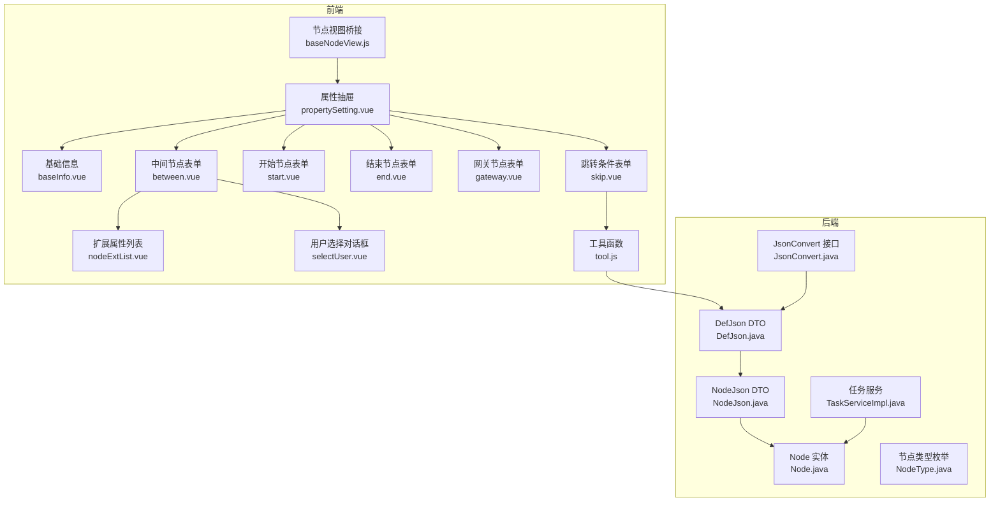
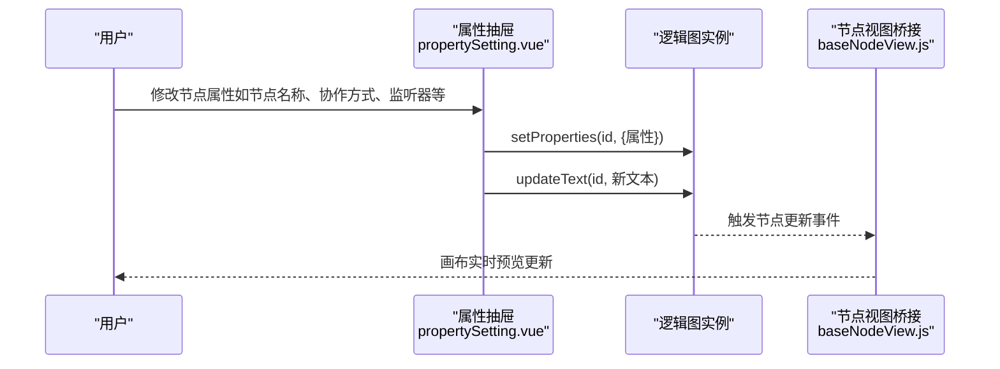
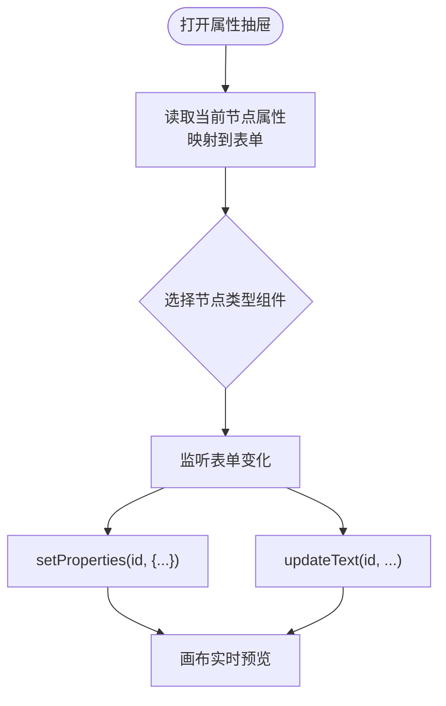
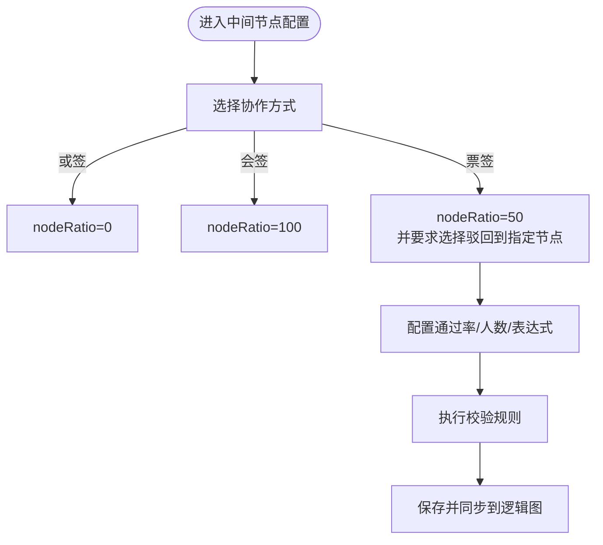
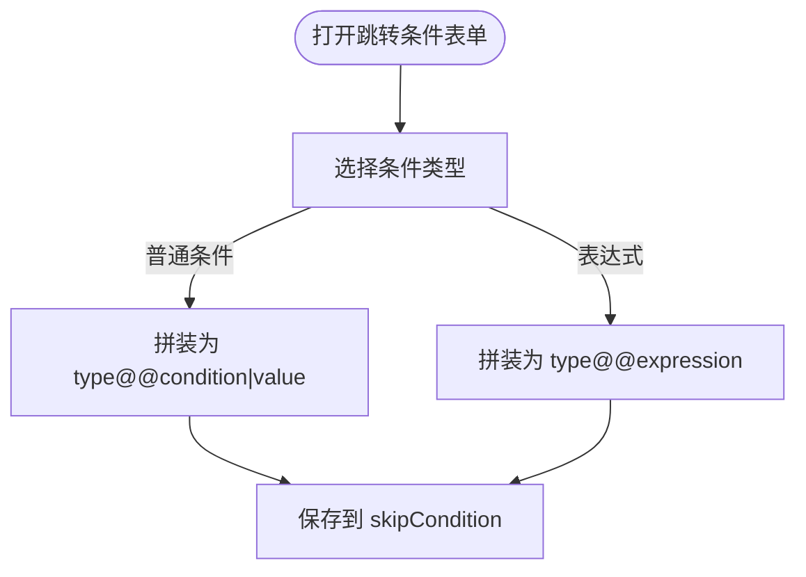
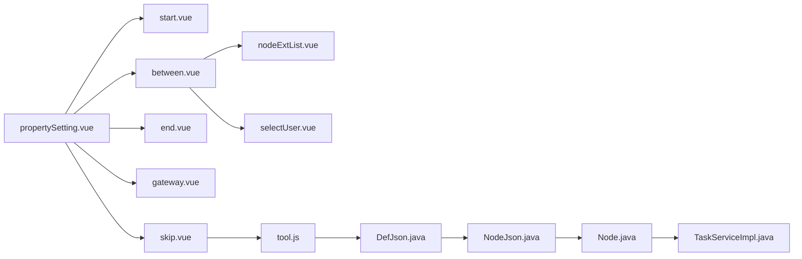
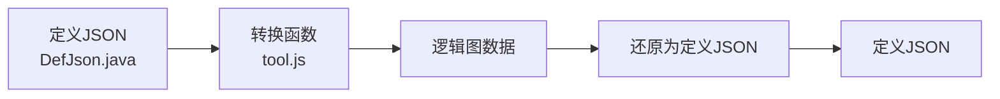

# 节点属性配置

<cite>
**本文档引用的文件**
- [propertySetting.vue](file://warm-flow-ui/src/components/design/common/vue/propertySetting.vue)
- [baseInfo.vue](file://warm-flow-ui/src/components/design/common/vue/baseInfo.vue)
- [between.vue](file://warm-flow-ui/src/components/design/common/vue/between.vue)
- [start.vue](file://warm-flow-ui/src/components/design/common/vue/start.vue)
- [end.vue](file://warm-flow-ui/src/components/design/common/vue/end.vue)
- [gateway.vue](file://warm-flow-ui/src/components/design/common/vue/gateway.vue)
- [skip.vue](file://warm-flow-ui/src/components/design/common/vue/skip.vue)
- [nodeExtList.vue](file://warm-flow-ui/src/components/design/common/vue/nodeExtList.vue)
- [selectUser.vue](file://warm-flow-ui/src/components/design/common/vue/selectUser.vue)
- [tool.js](file://warm-flow-ui/src/components/design/common/js/tool.js)
- [baseNodeView.js](file://warm-flow-ui/src/components/design/mimic/js/baseNodeView.js)
- [Node.java](file://warm-flow-core/src/main/java/org/dromara/warm/flow/core/entity/Node.java)
- [DefJson.java](file://warm-flow-core/src/main/java/org/dromara/warm/flow/core/dto/DefJson.java)
- [NodeJson.java](file://warm-flow-core/src/main/java/org/dromara/warm/flow/core/dto/NodeJson.java)
- [JsonConvert.java](file://warm-flow-core/src/main/java/org/dromara/warm/flow/core/json/JsonConvert.java)
- [NodeType.java](file://warm-flow-core/src/main/java/org/dromara/warm/flow/core/enums/NodeType.java)
- [TaskServiceImpl.java](file://warm-flow-core/src/main/java/org/dromara/warm/flow/core/service/impl/TaskServiceImpl.java)
</cite>

## 目录
1. [简介](#简介)
2. [项目结构](#项目结构)
3. [核心组件](#核心组件)
4. [架构总览](#架构总览)
5. [详细组件分析](#详细组件分析)
6. [依赖分析](#依赖分析)
7. [性能考虑](#性能考虑)
8. [故障排查指南](#故障排查指南)
9. [结论](#结论)
10. [附录](#附录)

## 简介
本文件面向 Warm-Flow 的“节点属性配置系统”，系统性梳理前端属性面板设计与实现、属性绑定机制、数据验证规则、实时预览联动、不同节点类型的特殊配置、以及属性数据的序列化与反序列化流程。同时提供扩展指南，帮助开发者新增配置项与自定义验证规则。

## 项目结构
Warm-Flow 的节点属性配置主要由以下层次构成：
- 前端属性面板层：基于 Vue 组件的属性抽屉与各节点类型专用表单组件
- 前端工具层：逻辑图与流程定义之间的转换工具
- 后端实体与 DTO 层：节点与流程定义的 Java 实体与 JSON 映射
- 运行时服务层：节点协作策略、监听器、权限等运行期逻辑

**图表来源**
- [propertySetting.vue:1-248](file://warm-flow-ui/src/components/design/common/vue/propertySetting.vue#L1-L248)
- [between.vue:1-709](file://warm-flow-ui/src/components/design/common/vue/between.vue#L1-L709)
- [skip.vue:1-172](file://warm-flow-ui/src/components/design/common/vue/skip.vue#L1-L172)
- [tool.js:1-258](file://warm-flow-ui/src/components/design/common/js/tool.js#L1-L258)
- [baseNodeView.js:1-39](file://warm-flow-ui/src/components/design/mimic/js/baseNodeView.js#L1-L39)
- [Node.java:1-162](file://warm-flow-core/src/main/java/org/dromara/warm/flow/core/entity/Node.java#L1-L162)
- [DefJson.java:238-262](file://warm-flow-core/src/main/java/org/dromara/warm/flow/core/dto/DefJson.java#L238-L262)
- [NodeJson.java:1-44](file://warm-flow-core/src/main/java/org/dromara/warm/flow/core/dto/NodeJson.java#L1-L44)
- [JsonConvert.java:1-62](file://warm-flow-core/src/main/java/org/dromara/warm/flow/core/json/JsonConvert.java#L1-L62)
- [NodeType.java:1-58](file://warm-flow-core/src/main/java/org/dromara/warm/flow/core/enums/NodeType.java#L1-L58)
- [TaskServiceImpl.java:720-753](file://warm-flow-core/src/main/java/org/dromara/warm/flow/core/service/impl/TaskServiceImpl.java#L720-L753)

**章节来源**
- [propertySetting.vue:1-248](file://warm-flow-ui/src/components/design/common/vue/propertySetting.vue#L1-L248)
- [tool.js:1-258](file://warm-flow-ui/src/components/design/common/js/tool.js#L1-L258)

## 核心组件
- 属性抽屉（propertySetting.vue）：统一承载节点属性编辑，按节点类型动态渲染对应表单组件，并将表单变更实时写入逻辑图节点属性。
- 节点表单组件：start、between、end、gateway、skip 等，分别负责对应节点类型的属性配置。
- 扩展属性列表（nodeExtList.vue）：支持多种输入控件（文本、多行文本、下拉、单选/多选、数值、日期/时间、用户权限等），并提供校验与回显。
- 用户选择（selectUser.vue）：提供树形组织架构与权限分组，支持多选并回显权限名称。
- 工具函数（tool.js）：负责流程定义与逻辑图数据的双向转换，包括坐标、属性、扩展字段等。
- 节点视图桥接（baseNodeView.js）：将逻辑图节点与 Vue 组件桥接，支持节点名称、权限、状态等属性的实时更新与事件透传。

**章节来源**
- [propertySetting.vue:1-248](file://warm-flow-ui/src/components/design/common/vue/propertySetting.vue#L1-L248)
- [between.vue:1-709](file://warm-flow-ui/src/components/design/common/vue/between.vue#L1-L709)
- [nodeExtList.vue:1-202](file://warm-flow-ui/src/components/design/common/vue/nodeExtList.vue#L1-L202)
- [selectUser.vue:1-361](file://warm-flow-ui/src/components/design/common/vue/selectUser.vue#L1-L361)
- [tool.js:1-258](file://warm-flow-ui/src/components/design/common/js/tool.js#L1-L258)
- [baseNodeView.js:1-39](file://warm-flow-ui/src/components/design/mimic/js/baseNodeView.js#L1-L39)

## 架构总览
属性配置系统采用“组件驱动 + 数据绑定 + 工具转换”的架构：
- 组件层：每个节点类型拥有独立的表单组件，统一挂载在属性抽屉下，通过 v-model 与逻辑图节点 properties 同步。
- 绑定层：watch 监听表单变化，调用逻辑图 API 更新节点属性与文本，保证画布实时预览。
- 转换层：tool.js 提供定义与逻辑图之间的序列化/反序列化，确保持久化与渲染一致。
- 实体层：后端 Node/NodeJson/DefJson 与枚举 NodeType 映射前端属性，保障运行期一致性。

**图表来源**
- [propertySetting.vue:197-248](file://warm-flow-ui/src/components/design/common/vue/propertySetting.vue#L197-L248)
- [baseNodeView.js:19-32](file://warm-flow-ui/src/components/design/mimic/js/baseNodeView.js#L19-L32)

## 详细组件分析

### 属性抽屉与节点类型路由
- 动态组件渲染：根据当前选中节点类型，从 COMPONENT_LIST 中选择对应表单组件进行渲染。
- 属性同步：通过 watch 监听表单值变化，调用逻辑图 setProperties 与 updateText，实现属性与文本的双向同步。
- 特殊联动：如协作方式与 nodeRatio 的联动、权限标识的数组拼接、监听器类型数组的逗号拼接等。

**图表来源**
- [propertySetting.vue:34-42](file://warm-flow-ui/src/components/design/common/vue/propertySetting.vue#L34-L42)
- [propertySetting.vue:197-248](file://warm-flow-ui/src/components/design/common/vue/propertySetting.vue#L197-L248)

**章节来源**
- [propertySetting.vue:1-248](file://warm-flow-ui/src/components/design/common/vue/propertySetting.vue#L1-L248)

### 中间节点（between）配置
- 协作方式：或签、票签、会签三种模式，通过 collaborativeWay 控制，与 nodeRatio 联动（0/50/100 对应不同协作策略）。
- 票签策略：支持通过率、固定通过人数、固定驳回人数，以及默认表达式/SpEL/SPEL 表达式三类表达式策略，具备严格的输入校验。
- 办理人设置：支持权限标识的多选与回显，提供“选择”弹窗，支持树形组织架构筛选。
- 监听器：支持监听器类型与路径的表格配置，支持手动输入或下拉选择。
- 扩展属性：通过 nodeExtList.vue 支持多类型扩展字段，含必填校验与回显。

**图表来源**
- [between.vue:15-62](file://warm-flow-ui/src/components/design/common/vue/between.vue#L15-L62)
- [between.vue:298-311](file://warm-flow-ui/src/components/design/common/vue/between.vue#L298-L311)

**章节来源**
- [between.vue:1-709](file://warm-flow-ui/src/components/design/common/vue/between.vue#L1-L709)

### 跳转条件（skip）配置
- 跳转类型：审批通过/退回两种。
- 跳转条件：支持条件名 + 条件类型 + 条件值，或直接使用表达式（默认/SpEL/SPEL）。
- 表达式校验：对默认表达式、SpEL、SPEL 的格式进行严格校验，确保表达式闭合与格式正确。
- 属性拼装：将条件类型、条件名、条件值按约定格式拼装为 skipCondition 字段。

**图表来源**
- [skip.vue:86-97](file://warm-flow-ui/src/components/design/common/vue/skip.vue#L86-L97)

**章节来源**
- [skip.vue:1-172](file://warm-flow-ui/src/components/design/common/vue/skip.vue#L1-L172)

### 扩展属性列表（nodeExtList）
- 输入类型丰富：文本、多行文本、下拉、单选/多选、数值、日期/时间、用户权限等。
- 必填校验：根据 must 字段生成必填规则。
- 用户权限回显：当字段类型为 5（用户权限）时，自动调用接口回显权限名称。
- 类型初始化：对数值类型字段进行类型转换，避免字符串参与计算。

**章节来源**
- [nodeExtList.vue:1-202](file://warm-flow-ui/src/components/design/common/vue/nodeExtList.vue#L1-L202)

### 用户选择（selectUser）
- 多标签已选：顶部展示已选权限标识与名称。
- 树形筛选：支持按部门名称过滤树节点，点击树节点自动查询该分组下的权限结果。
- 分页与搜索：支持权限编码/名称、创建时间范围搜索，分页加载。
- 多选提交：支持全选与逐条勾选，提交时回调父组件并关闭弹窗。

**章节来源**
- [selectUser.vue:1-361](file://warm-flow-ui/src/components/design/common/vue/selectUser.vue#L1-L361)

### 基础信息（baseInfo）
- 流程基本信息：流程编码、流程名称、设计器模型（经典/仿钉钉）、流程类别、表单配置（自定义/非自定义）。
- 监听器配置：支持监听器类型与路径的表格配置，支持手动输入或下拉选择。
- 表单校验：对必填字段进行校验，支持动态提示与错误信息。

**章节来源**
- [baseInfo.vue:1-630](file://warm-flow-ui/src/components/design/common/vue/baseInfo.vue#L1-L630)

### 节点类型专用表单
- 开始节点（start）：节点编码、节点名称、监听器配置。
- 结束节点（end）：节点编码、节点名称。
- 网关节点（gateway）：节点编码（串行/并行/包容网关通用）。

**章节来源**
- [start.vue:1-130](file://warm-flow-ui/src/components/design/common/vue/start.vue#L1-L130)
- [end.vue:1-47](file://warm-flow-ui/src/components/design/common/vue/end.vue#L1-L47)
- [gateway.vue:1-34](file://warm-flow-ui/src/components/design/common/vue/gateway.vue#L1-L34)

## 依赖分析
- 前端组件依赖：属性抽屉依赖各节点表单组件；中间节点依赖扩展属性列表与用户选择；跳转条件依赖工具函数进行表达式拼装。
- 工具函数依赖：tool.js 依赖节点类型映射与坐标解析，负责定义与逻辑图之间的转换。
- 后端实体依赖：Node/NodeJson/DefJson 映射前端属性，枚举 NodeType 定义节点类型常量，运行时服务（TaskServiceImpl）依据 nodeRatio 决策协作策略。

**图表来源**
- [propertySetting.vue:34-42](file://warm-flow-ui/src/components/design/common/vue/propertySetting.vue#L34-L42)
- [between.vue:199-200](file://warm-flow-ui/src/components/design/common/vue/between.vue#L199-L200)
- [skip.vue:37-58](file://warm-flow-ui/src/components/design/common/vue/skip.vue#L37-L58)
- [tool.js:1-258](file://warm-flow-ui/src/components/design/common/js/tool.js#L1-L258)
- [DefJson.java:238-262](file://warm-flow-core/src/main/java/org/dromara/warm/flow/core/dto/DefJson.java#L238-L262)
- [NodeJson.java:1-44](file://warm-flow-core/src/main/java/org/dromara/warm/flow/core/dto/NodeJson.java#L1-L44)
- [Node.java:1-162](file://warm-flow-core/src/main/java/org/dromara/warm/flow/core/entity/Node.java#L1-L162)
- [TaskServiceImpl.java:720-753](file://warm-flow-core/src/main/java/org/dromara/warm/flow/core/service/impl/TaskServiceImpl.java#L720-L753)

**章节来源**
- [tool.js:1-258](file://warm-flow-ui/src/components/design/common/js/tool.js#L1-L258)
- [DefJson.java:238-262](file://warm-flow-core/src/main/java/org/dromara/warm/flow/core/dto/DefJson.java#L238-L262)
- [Node.java:1-162](file://warm-flow-core/src/main/java/org/dromara/warm/flow/core/entity/Node.java#L1-L162)
- [NodeType.java:1-58](file://warm-flow-core/src/main/java/org/dromara/warm/flow/core/enums/NodeType.java#L1-L58)
- [TaskServiceImpl.java:720-753](file://warm-flow-core/src/main/java/org/dromara/warm/flow/core/service/impl/TaskServiceImpl.java#L720-L753)

## 性能考虑
- 表单校验：复杂表单（如中间节点）包含多项校验规则，建议在切换页签或提交时按需触发校验，避免频繁重绘。
- 扩展属性：大量扩展字段时，建议延迟加载与懒渲染，减少初始渲染压力。
- 用户选择：树节点与权限列表分页加载，避免一次性渲染过多数据。
- 逻辑图更新：属性更新通过 setProperties 与 updateText 批量合并，避免频繁重绘。

## 故障排查指南
- 属性未生效：检查属性抽屉中的 watch 是否触发 setProperties 与 updateText；确认逻辑图实例是否正确注入。
- 表单校验失败：核对必填字段与校验规则，特别是表达式格式（默认/SpEL/SPEL）。
- 扩展属性回显异常：确认字段类型与 must 标记，检查权限回显接口返回结构。
- 跳转条件拼装错误：确认条件类型与表达式格式，确保按约定拼装为 skipCondition。
- 运行期协作策略异常：核对 nodeRatio 与协作方式的映射关系，确保与运行时服务决策一致。

**章节来源**
- [propertySetting.vue:197-248](file://warm-flow-ui/src/components/design/common/vue/propertySetting.vue#L197-L248)
- [between.vue:298-311](file://warm-flow-ui/src/components/design/common/vue/between.vue#L298-L311)
- [skip.vue:86-97](file://warm-flow-ui/src/components/design/common/vue/skip.vue#L86-L97)
- [TaskServiceImpl.java:720-753](file://warm-flow-core/src/main/java/org/dromara/warm/flow/core/service/impl/TaskServiceImpl.java#L720-L753)

## 结论
Warm-Flow 的节点属性配置系统通过组件化表单、严格的属性绑定与校验、完善的扩展机制与工具转换，实现了从设计到运行期的一致性与可维护性。遵循本文档的扩展指南，可快速为新节点类型添加配置项与自定义规则。

## 附录

### 属性绑定机制与实时预览
- 绑定机制：属性抽屉通过 v-model 与逻辑图节点 properties 同步，watch 监听表单变化并调用 setProperties 与 updateText。
- 实时预览：逻辑图节点视图桥接（baseNodeView.js）接收更新事件，刷新节点渲染，实现画布实时预览。

**章节来源**
- [propertySetting.vue:197-248](file://warm-flow-ui/src/components/design/common/vue/propertySetting.vue#L197-L248)
- [baseNodeView.js:19-32](file://warm-flow-ui/src/components/design/mimic/js/baseNodeView.js#L19-L32)

### 不同节点类型的特殊属性配置
- 开始节点：仅节点编码与节点名称、监听器配置。
- 中间节点：协作方式、票签策略、办理人设置、监听器、扩展属性。
- 结束节点：节点编码与节点名称。
- 网关节点：节点编码（串行/并行/包容网关通用）。
- 跳转条件：跳转类型与跳转条件（含表达式）。

**章节来源**
- [start.vue:1-130](file://warm-flow-ui/src/components/design/common/vue/start.vue#L1-L130)
- [between.vue:1-709](file://warm-flow-ui/src/components/design/common/vue/between.vue#L1-L709)
- [end.vue:1-47](file://warm-flow-ui/src/components/design/common/vue/end.vue#L1-L47)
- [gateway.vue:1-34](file://warm-flow-ui/src/components/design/common/vue/gateway.vue#L1-L34)
- [skip.vue:1-172](file://warm-flow-ui/src/components/design/common/vue/skip.vue#L1-L172)

### 数据验证规则
- 中间节点票签策略：通过率（0.001-100，最多三位小数）、固定通过/驳回人数（正整数）、默认/表达式（格式校验）。
- 跳转条件：默认/表达式（格式校验），普通条件（条件名 + 条件类型 + 条件值）。
- 监听器：监听器类型与路径必填，支持手动输入或下拉选择。

**章节来源**
- [between.vue:313-377](file://warm-flow-ui/src/components/design/common/vue/between.vue#L313-L377)
- [skip.vue:117-148](file://warm-flow-ui/src/components/design/common/vue/skip.vue#L117-L148)

### 序列化与反序列化流程
- 定义到逻辑图：tool.js 将后端定义 JSON 转换为逻辑图数据，解析节点坐标、属性、扩展字段等。
- 逻辑图到定义：tool.js 将逻辑图数据还原为定义 JSON，拼装节点与跳转信息，序列化为字符串。

**图表来源**
- [tool.js:8-253](file://warm-flow-ui/src/components/design/common/js/tool.js#L8-L253)
- [DefJson.java:238-262](file://warm-flow-core/src/main/java/org/dromara/warm/flow/core/dto/DefJson.java#L238-L262)

**章节来源**
- [tool.js:1-258](file://warm-flow-ui/src/components/design/common/js/tool.js#L1-L258)
- [DefJson.java:238-262](file://warm-flow-core/src/main/java/org/dromara/warm/flow/core/dto/DefJson.java#L238-L262)
- [NodeJson.java:1-44](file://warm-flow-core/src/main/java/org/dromara/warm/flow/core/dto/NodeJson.java#L1-L44)

### 属性配置扩展指南
- 新增节点类型表单：在 COMPONENT_LIST 中注册新组件，并在属性抽屉中处理其属性同步。
- 新增配置项：在对应表单组件中添加字段与校验规则，必要时在属性抽屉中添加 watch 同步逻辑。
- 自定义验证规则：在表单组件中新增校验方法，并在 rules 中引用。
- 扩展属性：通过 nodeExtList.vue 的表单项类型与字典配置，支持多类型输入与回显。
- 运行期策略：如协作策略、监听器、权限等，需与后端实体与服务保持一致。

**章节来源**
- [propertySetting.vue:34-42](file://warm-flow-ui/src/components/design/common/vue/propertySetting.vue#L34-L42)
- [between.vue:259-296](file://warm-flow-ui/src/components/design/common/vue/between.vue#L259-L296)
- [nodeExtList.vue:1-202](file://warm-flow-ui/src/components/design/common/vue/nodeExtList.vue#L1-L202)