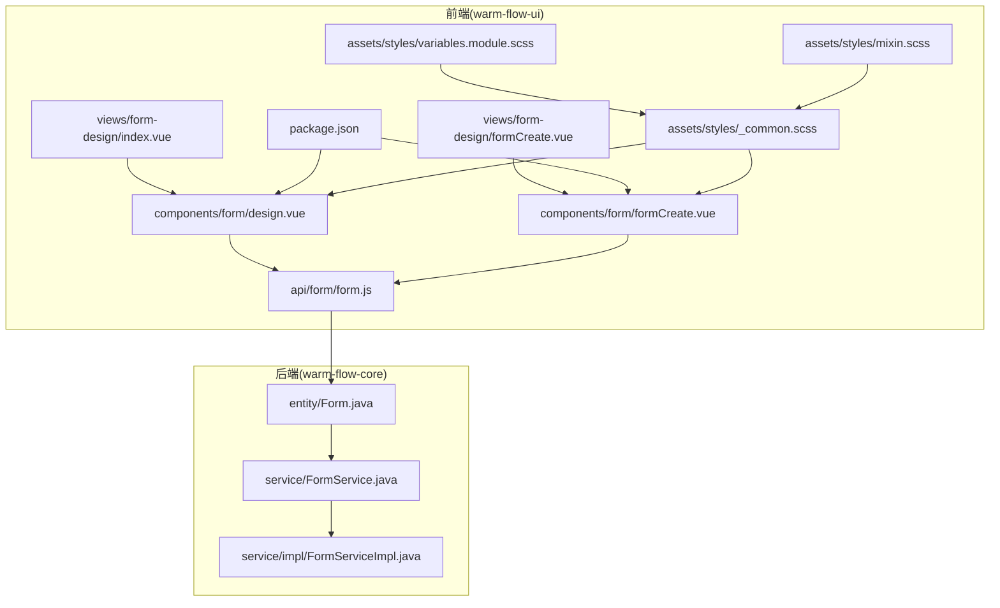
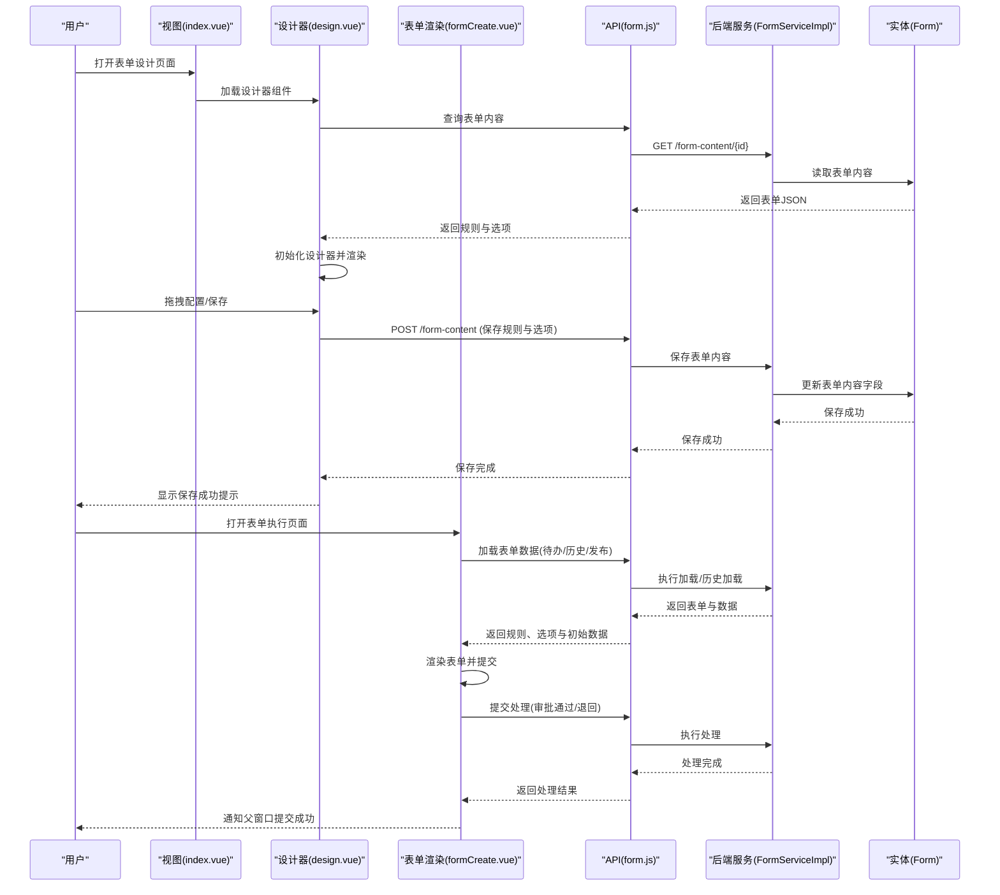
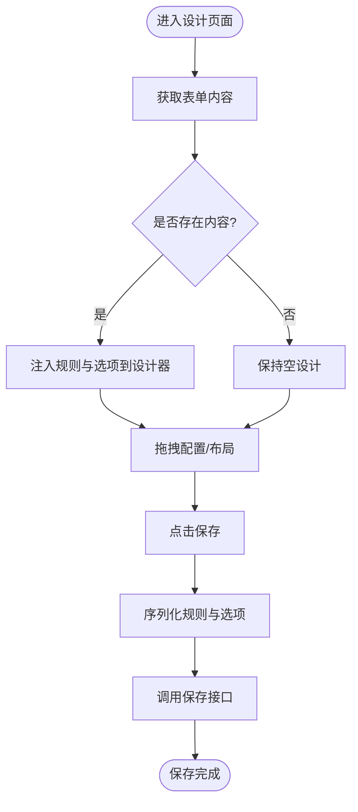
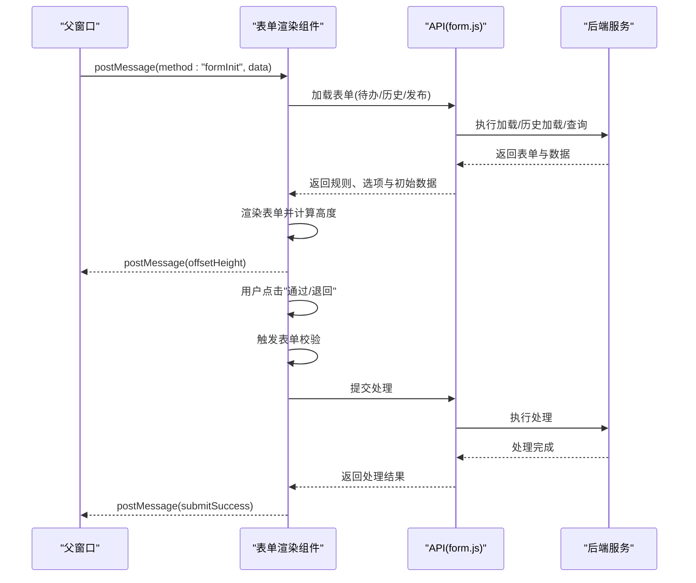
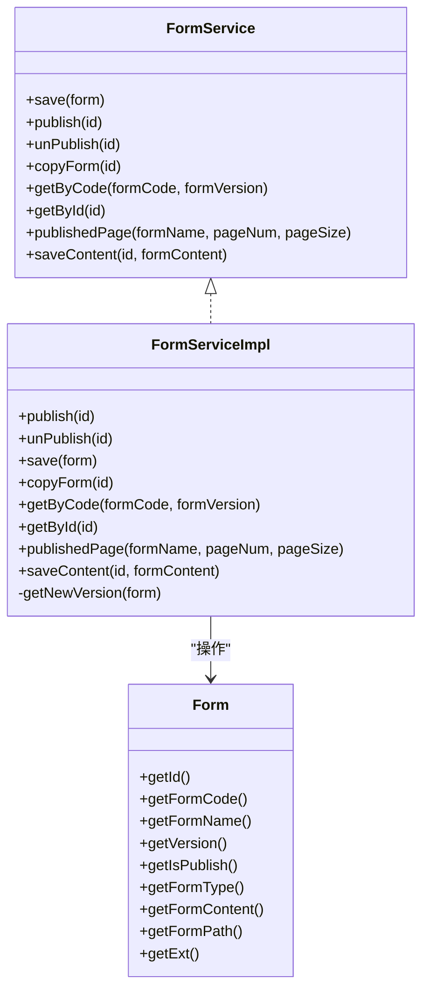
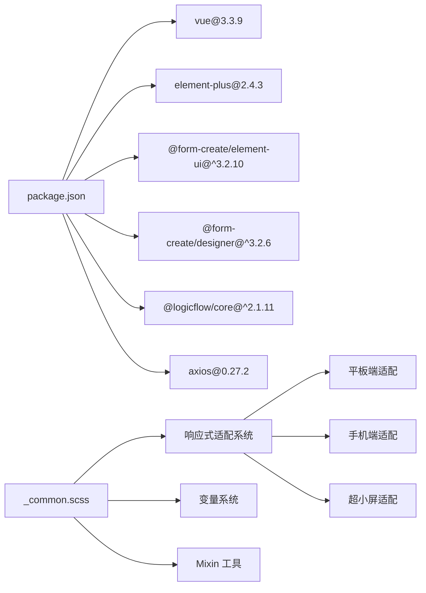

# 表单设计器

<cite>
**本文档引用的文件**
- [warm-flow-ui/src/views/form-design/index.vue](file://warm-flow-ui/src/views/form-design/index.vue)
- [warm-flow-ui/src/views/form-design/formCreate.vue](file://warm-flow-ui/src/views/form-design/formCreate.vue)
- [warm-flow-ui/src/components/form/design.vue](file://warm-flow-ui/src/components/form/design.vue)
- [warm-flow-ui/src/components/form/formCreate.vue](file://warm-flow-ui/src/components/form/formCreate.vue)
- [warm-flow-ui/src/api/form/form.js](file://warm-flow-ui/src/api/form/form.js)
- [warm-flow-ui/package.json](file://warm-flow-ui/package.json)
- [warm-flow-core/src/main/java/org/dromara/warm/flow/core/entity/Form.java](file://warm-flow-core/src/main/java/org/dromara/warm/flow/core/entity/Form.java)
- [warm-flow-core/src/main/java/org/dromara/warm/flow/core/service/FormService.java](file://warm-flow-core/src/main/java/org/dromara/warm/flow/core/service/FormService.java)
- [warm-flow-core/src/main/java/org/dromara/warm/flow/core/service/impl/FormServiceImpl.java](file://warm-flow-core/src/main/java/org/dromara/warm/flow/core/service/impl/FormServiceImpl.java)
- [warm-flow-plugin/warm-flow-plugin-ui/warm-flow-plugin-ui-sb-web/src/main/resources/META-INF/spring.factories](file://warm-flow-plugin/warm-flow-plugin-ui/warm-flow-plugin-ui-sb-web/src/main/resources/META-INF/spring.factories)
- [warm-flow-ui/src/assets/styles/_common.scss](file://warm-flow-ui/src/assets/styles/_common.scss)
- [warm-flow-ui/src/assets/styles/variables.module.scss](file://warm-flow-ui/src/assets/styles/variables.module.scss)
- [warm-flow-ui/src/assets/styles/mixin.scss](file://warm-flow-ui/src/assets/styles/mixin.scss)
</cite>

## 更新摘要
**所做更改**
- 新增响应式适配和移动优化章节，详细说明表单组件在不同屏幕尺寸下的布局表现
- 更新表单渲染组件章节，增加移动端友好的按钮布局和紧凑表单标签说明
- 新增响应式样式系统分析，包括平板端和手机端的适配策略
- 增强表单组件扩展指南，补充响应式设计最佳实践

## 目录
1. [简介](#简介)
2. [项目结构](#项目结构)
3. [核心组件](#核心组件)
4. [架构总览](#架构总览)
5. [详细组件分析](#详细组件分析)
6. [响应式适配与移动优化](#响应式适配与移动优化)
7. [依赖分析](#依赖分析)
8. [性能考虑](#性能考虑)
9. [故障排除指南](#故障排除指南)
10. [结论](#结论)
11. [附录](#附录)

## 简介
本文件面向 Warm-Flow 表单设计器，围绕基于 FormCreate 的拖拽式表单构建能力进行系统化技术文档整理。重点涵盖：
- 表单设计器的拖拽构建、组件库集成与布局管理
- 字段配置选项、验证规则与样式定制
- 表单数据结构设计（字段元数据、布局信息、校验配置）
- 表单与流程节点的关联机制与数据传递
- **新增**：响应式适配和移动优化，确保表单组件在不同屏幕尺寸下都有良好的布局表现
- 扩展指南：如何添加自定义表单组件与集成第三方组件库

## 项目结构
Warm-Flow 前端采用 Vue 3 + Vite 构建，表单相关代码集中在 warm-flow-ui 模块；后端核心实体与服务位于 warm-flow-core 模块。

**图表来源**
- [warm-flow-ui/src/views/form-design/index.vue:1-8](file://warm-flow-ui/src/views/form-design/index.vue#L1-L8)
- [warm-flow-ui/src/views/form-design/formCreate.vue:1-8](file://warm-flow-ui/src/views/form-design/formCreate.vue#L1-L8)
- [warm-flow-ui/src/components/form/design.vue:1-82](file://warm-flow-ui/src/components/form/design.vue#L1-L82)
- [warm-flow-ui/src/components/form/formCreate.vue:1-106](file://warm-flow-ui/src/components/form/formCreate.vue#L1-L106)
- [warm-flow-ui/src/api/form/form.js:1-46](file://warm-flow-ui/src/api/form/form.js#L1-L46)
- [warm-flow-ui/package.json:1-42](file://warm-flow-ui/package.json#L1-L42)
- [warm-flow-core/src/main/java/org/dromara/warm/flow/core/entity/Form.java:1-112](file://warm-flow-core/src/main/java/org/dromara/warm/flow/core/entity/Form.java#L1-L112)
- [warm-flow-core/src/main/java/org/dromara/warm/flow/core/service/FormService.java:1-99](file://warm-flow-core/src/main/java/org/dromara/warm/flow/core/service/FormService.java#L1-L99)
- [warm-flow-core/src/main/java/org/dromara/warm/flow/core/service/impl/FormServiceImpl.java:1-147](file://warm-flow-core/src/main/java/org/dromara/warm/flow/core/service/impl/FormServiceImpl.java#L1-L147)
- [warm-flow-ui/src/assets/styles/_common.scss:1-434](file://warm-flow-ui/src/assets/styles/_common.scss#L1-L434)
- [warm-flow-ui/src/assets/styles/variables.module.scss:1-66](file://warm-flow-ui/src/assets/styles/variables.module.scss#L1-L66)
- [warm-flow-ui/src/assets/styles/mixin.scss:1-67](file://warm-flow-ui/src/assets/styles/mixin.scss#L1-L67)

**章节来源**
- [warm-flow-ui/src/views/form-design/index.vue:1-8](file://warm-flow-ui/src/views/form-design/index.vue#L1-L8)
- [warm-flow-ui/src/views/form-design/formCreate.vue:1-8](file://warm-flow-ui/src/views/form-design/formCreate.vue#L1-L8)
- [warm-flow-ui/src/components/form/design.vue:1-82](file://warm-flow-ui/src/components/form/design.vue#L1-L82)
- [warm-flow-ui/src/components/form/formCreate.vue:1-106](file://warm-flow-ui/src/components/form/formCreate.vue#L1-L106)
- [warm-flow-ui/src/api/form/form.js:1-46](file://warm-flow-ui/src/api/form/form.js#L1-L46)
- [warm-flow-ui/package.json:1-42](file://warm-flow-ui/package.json#L1-L42)
- [warm-flow-core/src/main/java/org/dromara/warm/flow/core/entity/Form.java:1-112](file://warm-flow-core/src/main/java/org/dromara/warm/flow/core/entity/Form.java#L1-L112)
- [warm-flow-core/src/main/java/org/dromara/warm/flow/core/service/FormService.java:1-99](file://warm-flow-core/src/main/java/org/dromara/warm/flow/core/service/FormService.java#L1-L99)
- [warm-flow-core/src/main/java/org/dromara/warm/flow/core/service/impl/FormServiceImpl.java:1-147](file://warm-flow-core/src/main/java/org/dromara/warm/flow/core/service/impl/FormServiceImpl.java#L1-L147)

## 核心组件
- 表单设计器页面容器：负责加载 fc-designer 并提供保存回调，将规则与选项序列化持久化。
- 表单渲染组件：基于 @form-create/element-ui 渲染动态表单，支持提交、审批意见与消息回传。
- API 层：封装表单内容查询、保存、执行加载与处理等接口。
- 后端实体与服务：Form 实体承载表单内容与元数据；FormService 提供保存、发布、复制、分页查询与内容保存等能力。
- **新增**：响应式样式系统：提供完整的移动端适配方案，包括紧凑的表单标签、适配的小尺寸输入框和移动端友好的按钮布局。

**章节来源**
- [warm-flow-ui/src/components/form/design.vue:1-82](file://warm-flow-ui/src/components/form/design.vue#L1-L82)
- [warm-flow-ui/src/components/form/formCreate.vue:1-106](file://warm-flow-ui/src/components/form/formCreate.vue#L1-L106)
- [warm-flow-ui/src/api/form/form.js:1-46](file://warm-flow-ui/src/api/form/form.js#L1-L46)
- [warm-flow-core/src/main/java/org/dromara/warm/flow/core/entity/Form.java:1-112](file://warm-flow-core/src/main/java/org/dromara/warm/flow/core/entity/Form.java#L1-L112)
- [warm-flow-core/src/main/java/org/dromara/warm/flow/core/service/FormService.java:1-99](file://warm-flow-core/src/main/java/org/dromara/warm/flow/core/service/FormService.java#L1-L99)

## 架构总览
表单设计器从前端到后端的数据流如下：

**图表来源**
- [warm-flow-ui/src/views/form-design/index.vue:1-8](file://warm-flow-ui/src/views/form-design/index.vue#L1-L8)
- [warm-flow-ui/src/components/form/design.vue:1-82](file://warm-flow-ui/src/components/form/design.vue#L1-L82)
- [warm-flow-ui/src/components/form/formCreate.vue:1-106](file://warm-flow-ui/src/components/form/formCreate.vue#L1-L106)
- [warm-flow-ui/src/api/form/form.js:1-46](file://warm-flow-ui/src/api/form/form.js#L1-L46)
- [warm-flow-core/src/main/java/org/dromara/warm/flow/core/service/impl/FormServiceImpl.java:1-147](file://warm-flow-core/src/main/java/org/dromara/warm/flow/core/service/impl/FormServiceImpl.java#L1-L147)
- [warm-flow-core/src/main/java/org/dromara/warm/flow/core/entity/Form.java:1-112](file://warm-flow-core/src/main/java/org/dromara/warm/flow/core/entity/Form.java#L1-L112)

## 详细组件分析

### 设计器组件（design.vue）
- 负责加载 fc-designer，提供保存回调，将规则与选项序列化后调用保存接口。
- 支持从后端拉取已有表单内容并注入设计器。
- 保存时将规则与选项分别解析为 JSON，并以统一结构体保存。
- **新增**：完整的响应式布局支持，适配不同屏幕尺寸的设计器界面。

**图表来源**
- [warm-flow-ui/src/components/form/design.vue:1-82](file://warm-flow-ui/src/components/form/design.vue#L1-L82)

**章节来源**
- [warm-flow-ui/src/components/form/design.vue:1-82](file://warm-flow-ui/src/components/form/design.vue#L1-L82)

### 表单渲染组件（formCreate.vue）
- 基于 @form-create/element-ui 渲染动态表单，绑定规则与选项。
- 支持审批意见输入与"通过/退回"按钮，提交时先触发表单校验再调用处理接口。
- 通过 postMessage 与父窗口通信，实现初始化、重置、高度反馈与提交成功通知。
- 根据不同场景（待办、历史、发布）加载对应的数据与规则。
- **更新**：移动端友好的按钮布局，紧凑的表单标签设计，适配小尺寸输入框。

**图表来源**
- [warm-flow-ui/src/components/form/formCreate.vue:1-106](file://warm-flow-ui/src/components/form/formCreate.vue#L1-L106)
- [warm-flow-ui/src/api/form/form.js:1-46](file://warm-flow-ui/src/api/form/form.js#L1-L46)

**章节来源**
- [warm-flow-ui/src/components/form/formCreate.vue:1-106](file://warm-flow-ui/src/components/form/formCreate.vue#L1-L106)
- [warm-flow-ui/src/api/form/form.js:1-46](file://warm-flow-ui/src/api/form/form.js#L1-L46)

### API 层（form.js）
- 提供表单内容查询、保存、执行加载、历史加载与处理提交等接口。
- 接口方法与后端控制器对接，统一前缀由环境变量控制。

**章节来源**
- [warm-flow-ui/src/api/form/form.js:1-46](file://warm-flow-ui/src/api/form/form.js#L1-L46)

### 后端实体与服务（Form 实体、FormService、FormServiceImpl）
- Form 实体：包含表单编码、名称、版本、发布状态、表单类型、表单内容、表单路径与扩展字段等。
- FormService：定义保存、发布、取消发布、复制、按编码与版本查询、分页查询与保存内容等接口。
- FormServiceImpl：实现具体逻辑，如保存时生成新版本号、发布/取消发布前的使用检查、保存内容时的版本与状态约束。

**图表来源**
- [warm-flow-core/src/main/java/org/dromara/warm/flow/core/entity/Form.java:1-112](file://warm-flow-core/src/main/java/org/dromara/warm/flow/core/entity/Form.java#L1-L112)
- [warm-flow-core/src/main/java/org/dromara/warm/flow/core/service/FormService.java:1-99](file://warm-flow-core/src/main/java/org/dromara/warm/flow/core/service/FormService.java#L1-L99)
- [warm-flow-core/src/main/java/org/dromara/warm/flow/core/service/impl/FormServiceImpl.java:1-147](file://warm-flow-core/src/main/java/org/dromara/warm/flow/core/service/impl/FormServiceImpl.java#L1-L147)

**章节来源**
- [warm-flow-core/src/main/java/org/dromara/warm/flow/core/entity/Form.java:1-112](file://warm-flow-core/src/main/java/org/dromara/warm/flow/core/entity/Form.java#L1-L112)
- [warm-flow-core/src/main/java/org/dromara/warm/flow/core/service/FormService.java:1-99](file://warm-flow-core/src/main/java/org/dromara/warm/flow/core/service/FormService.java#L1-L99)
- [warm-flow-core/src/main/java/org/dromara/warm/flow/core/service/impl/FormServiceImpl.java:1-147](file://warm-flow-core/src/main/java/org/dromara/warm/flow/core/service/impl/FormServiceImpl.java#L1-L147)

## 响应式适配与移动优化

### 响应式样式系统概述
Warm-Flow 表单设计器采用了完整的响应式适配方案，针对不同屏幕尺寸提供优化的布局表现：

- **平板端适配（769px - 1024px）**：提供紧凑的界面布局，减少空间占用
- **手机端适配（<=768px）**：全面优化移动端体验，包括表单标签、输入框和按钮
- **超小屏适配（<=480px）**：针对极小屏幕设备的特殊优化

### 平板端（769px - 1024px）优化
- **页签区域**：减少内边距和字体大小，提供更紧凑的标签布局
- **基础配置卡片**：缩小标题和内容区域的间距，适应有限的屏幕空间
- **Section 卡片**：优化图标尺寸和文本大小，保持视觉层次
- **表格适配**：提供横向滚动支持，确保表格内容完整显示

### 手机端（<=768px）全面优化
- **表单标签压缩**：限制标签宽度为 70-90px，使用断词策略确保内容完整显示
- **输入框适配**：统一将输入框高度设置为 32px，字体大小调整为 12px
- **按钮优化**：提供更小尺寸的按钮，适合单手操作
- **卡片布局**：减少内边距和边距，最大化内容显示区域
- **表格横向滚动**：所有表格组件都支持横向滚动，解决小屏幕显示问题

### 超小屏（<=480px）特殊处理
- **进一步压缩**：在 480px 以下的极小屏幕上，继续压缩标签宽度和字体大小
- **间距优化**：减少所有组件间的间距，提高信息密度
- **触摸友好**：确保所有交互元素都适合手指操作

### 移动端友好的按钮布局
表单渲染组件在移动端提供了优化的按钮布局：
- **右对齐布局**：按钮采用右对齐方式，符合移动端操作习惯
- **紧凑间距**：按钮之间的间距减少，适应小屏幕空间
- **响应式尺寸**：按钮大小根据屏幕尺寸自动调整

### 响应式样式的实现机制
响应式适配通过 SCSS Mixin 系统实现，主要特点：
- **模块化设计**：每个组件都可以选择性地应用响应式样式
- **渐进增强**：从桌面端开始，逐步优化移动端体验
- **性能优化**：只在需要的组件上应用响应式样式，避免全局影响

**章节来源**
- [warm-flow-ui/src/assets/styles/_common.scss:227-434](file://warm-flow-ui/src/assets/styles/_common.scss#L227-L434)
- [warm-flow-ui/src/components/form/formCreate.vue:15-18](file://warm-flow-ui/src/components/form/formCreate.vue#L15-L18)

## 依赖分析
- 前端依赖：Vue 3、Element Plus、@form-create/element-ui、@form-create/designer、@logicflow/core/extension 等。
- 设计器与渲染均基于 @form-create 生态，保证组件一致性与可扩展性。
- 包管理器为 Yarn，版本与脚手架工具在 package.json 中声明。
- **新增**：完整的响应式样式系统，基于 SCSS Mixin 提供移动端适配。

**图表来源**
- [warm-flow-ui/package.json:1-42](file://warm-flow-ui/package.json#L1-L42)
- [warm-flow-ui/src/assets/styles/_common.scss:1-434](file://warm-flow-ui/src/assets/styles/_common.scss#L1-L434)

**章节来源**
- [warm-flow-ui/package.json:1-42](file://warm-flow-ui/package.json#L1-L42)
- [warm-flow-ui/src/assets/styles/_common.scss:1-434](file://warm-flow-ui/src/assets/styles/_common.scss#L1-L434)

## 性能考虑
- 表单规则与选项的序列化与反序列化应避免频繁大对象深拷贝，建议在设计器侧仅在保存时一次性序列化。
- 表单渲染时尽量减少不必要的响应式样式计算，通过合理的数据拆分与懒加载策略降低首屏压力。
- 对于复杂表单，建议拆分子表单或延迟加载部分字段，提升交互流畅度。
- 前端与后端接口调用需注意并发控制与错误重试，避免重复请求造成资源浪费。
- **新增**：响应式样式的性能优化，确保在不同设备上都有良好的渲染性能。

## 故障排除指南
- 表单保存失败
  - 检查后端保存内容接口的状态与版本约束，确认表单是否已发布且允许修改。
  - 前端保存时确保规则与选项均已正确序列化并传入接口。
- 表单渲染空白或报错
  - 确认规则与选项结构完整，且字段 ID 与组件类型匹配。
  - 检查 @form-create 组件库版本兼容性与 Element Plus 主题配置。
- 提交审批异常
  - 确保表单校验通过后再提交，检查审批意见字段是否必填。
  - 核对 postMessage 通信链路，确保父窗口接收并处理提交成功事件。
- **新增**：移动端显示异常
  - 检查响应式样式是否正确应用，确认设备屏幕尺寸触发了相应的媒体查询。
  - 验证表单标签宽度限制和输入框尺寸设置是否正常工作。
  - 确认按钮布局在移动端是否正确显示为右对齐。

**章节来源**
- [warm-flow-ui/src/components/form/design.vue:25-45](file://warm-flow-ui/src/components/form/design.vue#L25-L45)
- [warm-flow-ui/src/components/form/formCreate.vue:63-73](file://warm-flow-ui/src/components/form/formCreate.vue#L63-L73)
- [warm-flow-core/src/main/java/org/dromara/warm/flow/core/service/impl/FormServiceImpl.java:112-119](file://warm-flow-core/src/main/java/org/dromara/warm/flow/core/service/impl/FormServiceImpl.java#L112-L119)

## 结论
Warm-Flow 表单设计器以 FormCreate 为核心，结合 Element Plus 与 LogicFlow，实现了从拖拽配置到运行时渲染的完整闭环。通过清晰的前后端职责划分与稳定的 API 接口，既能满足快速搭建表单的需求，也为后续扩展与集成提供了良好基础。**新增的响应式适配系统确保了表单组件在不同屏幕尺寸下都有优秀的布局表现，为移动办公提供了良好的用户体验。**

## 附录

### 表单数据结构设计要点
- 字段元数据：规则（rule）描述字段类型、属性与布局；选项（option）描述渲染行为与交互。
- 布局信息：通过规则中的层级与分组组织字段布局，支持栅格与容器嵌套。
- 校验配置：在规则中定义校验规则，渲染组件自动应用 Element Plus 校验体系。
- 样式定制：通过选项与组件属性调整外观，必要时引入自定义样式覆盖。
- **新增**：响应式样式配置：支持在规则中配置移动端特定的样式属性。

### 表单与流程节点关联机制
- 流程节点属性中可配置表单路径（formPath），用于指定该节点使用的表单。
- 节点支持自定义表单开关（formCustom），可启用内置表单或外挂表单。
- 运行时根据节点属性选择对应表单，加载规则与选项并渲染。

### 扩展指南：添加自定义表单组件与集成第三方组件库
- 自定义组件注册
  - 在 @form-create/element-ui 的组件注册机制下，将自定义组件注册为可用字段类型。
  - 确保组件具备标准的 props 与事件接口，便于规则驱动渲染与数据绑定。
- 第三方组件库集成
  - 引入第三方 UI 组件库并在组件注册阶段统一桥接。
  - 通过规则中的组件类型与属性映射，实现第三方组件在设计器中的可视化配置。
- 样式与主题
  - 通过全局样式或组件级样式覆盖，确保第三方组件与现有主题一致。
  - 注意响应式与暗色模式适配，避免样式冲突。
- **新增**：响应式设计最佳实践
  - 在开发自定义组件时，遵循响应式设计原则，确保在不同屏幕尺寸下都有良好的显示效果。
  - 使用 SCSS Mixin 系统提供响应式样式支持，避免硬编码的媒体查询。
  - 测试组件在平板端和手机端的表现，确保用户体验的一致性。