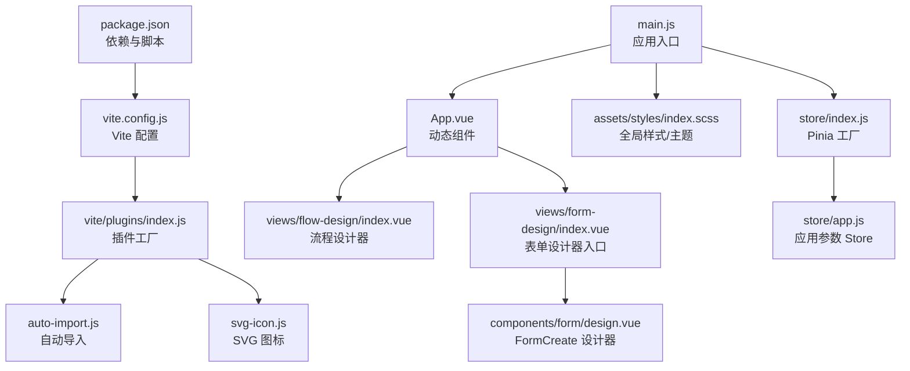
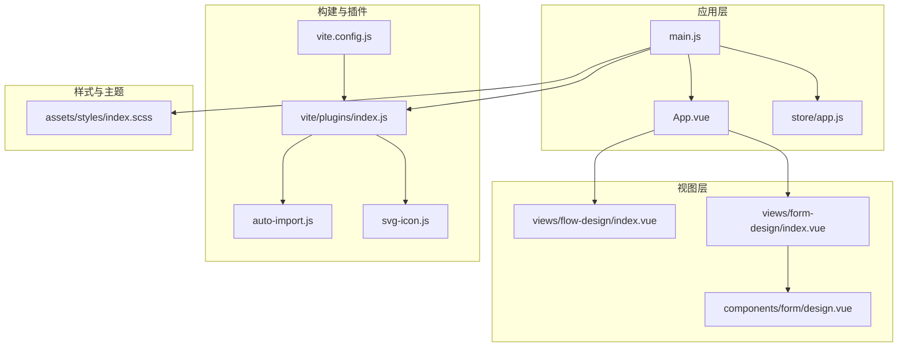
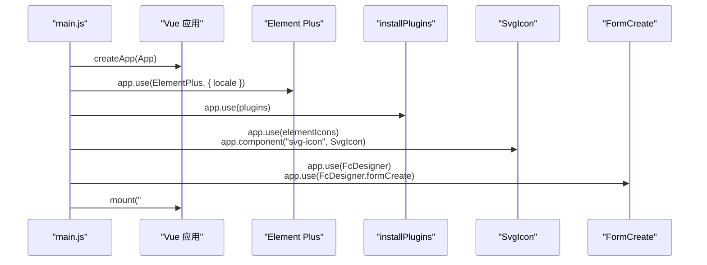
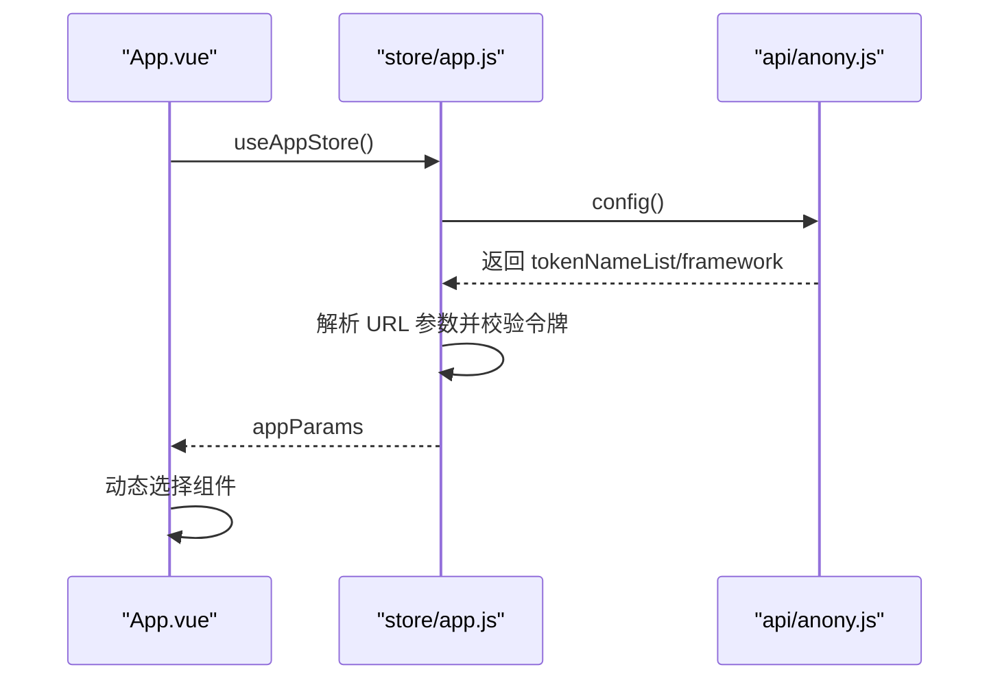
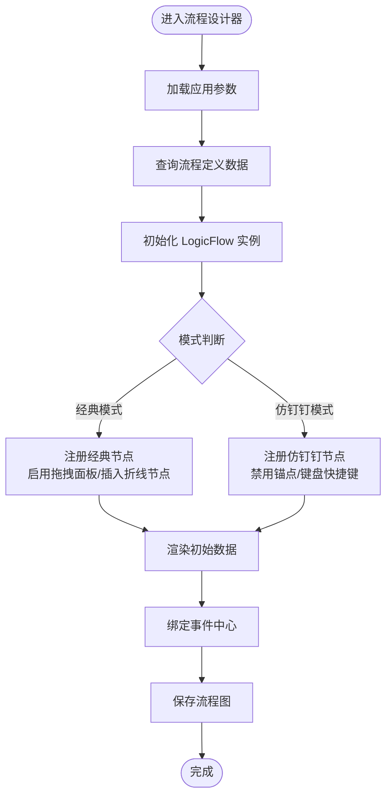
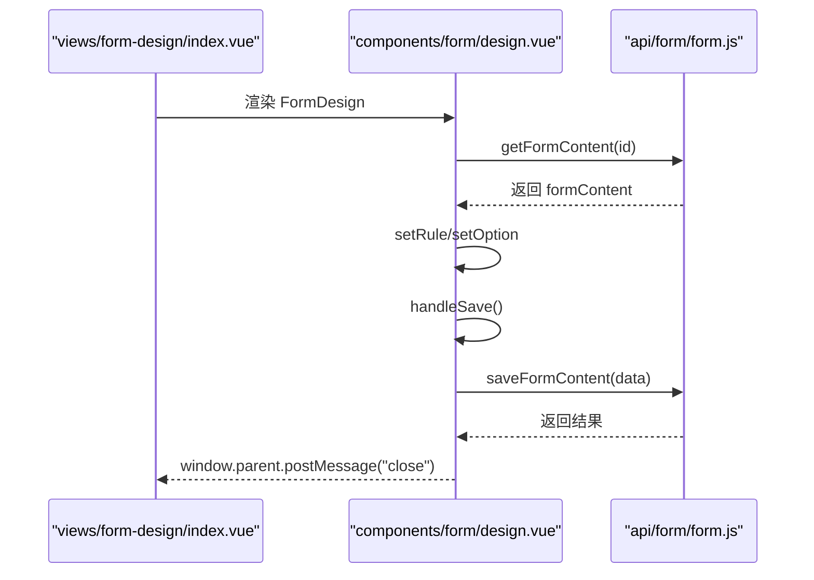
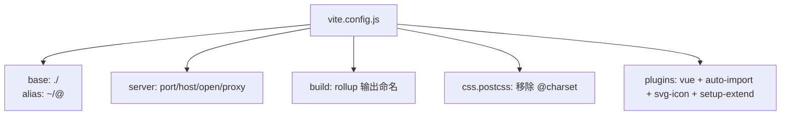
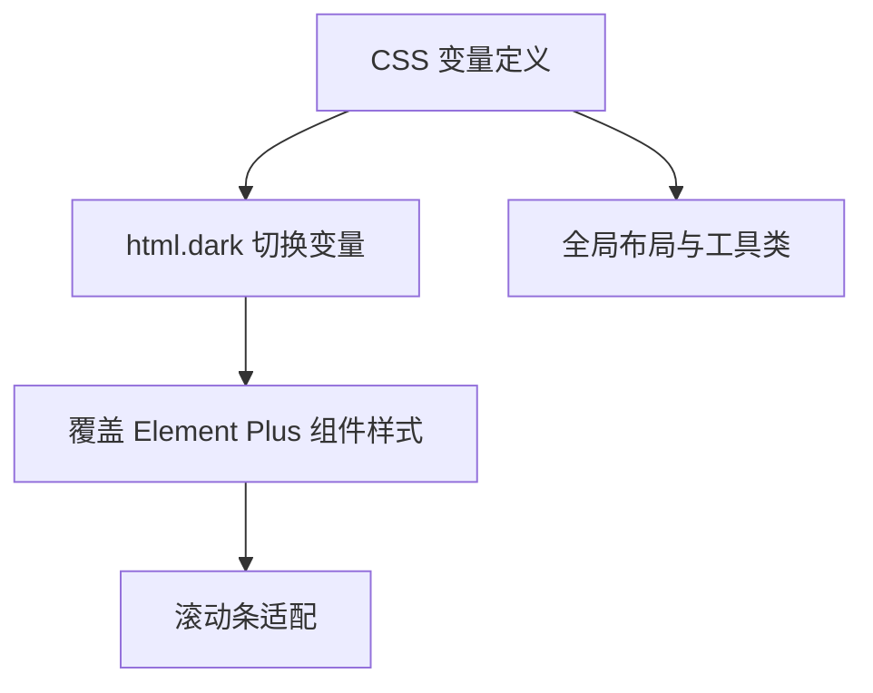
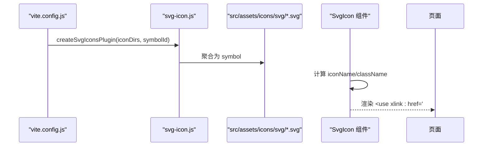
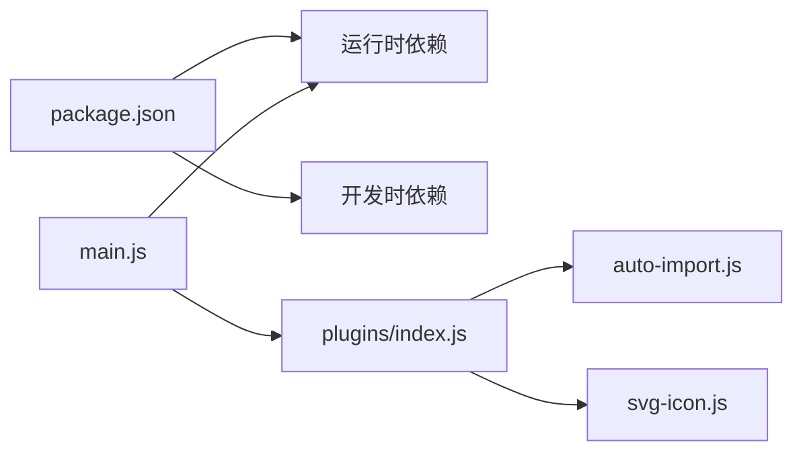

# 设计器架构设计

<cite>
**本文引用的文件**
- [package.json](file://warm-flow-ui/package.json)
- [vite.config.js](file://warm-flow-ui/vite.config.js)
- [main.js](file://warm-flow-ui/src/main.js)
- [App.vue](file://warm-flow-ui/src/App.vue)
- [index.js（插件入口）](file://warm-flow-ui/src/plugins/index.js)
- [index.js（Vite 插件工厂）](file://warm-flow-ui/vite/plugins/index.js)
- [auto-import.js](file://warm-flow-ui/vite/plugins/auto-import.js)
- [svg-icon.js](file://warm-flow-ui/vite/plugins/svg-icon.js)
- [index.vue（流程设计器入口）](file://warm-flow-ui/src/views/flow-design/index.vue)
- [index.vue（表单设计器入口）](file://warm-flow-ui/src/views/form-design/index.vue)
- [design.vue（表单设计器组件）](file://warm-flow-ui/src/components/form/design.vue)
- [index.vue（SVG 图标组件）](file://warm-flow-ui/src/components/SvgIcon/index.vue)
- [index.scss（全局样式）](file://warm-flow-ui/src/assets/styles/index.scss)
- [index.js（Pinia Store 工厂）](file://warm-flow-ui/src/store/index.js)
- [app.js（应用 Store）](file://warm-flow-ui/src/store/app.js)
</cite>

## 目录
1. [引言](#引言)
2. [项目结构](#项目结构)
3. [核心组件](#核心组件)
4. [架构总览](#架构总览)
5. [详细组件分析](#详细组件分析)
6. [依赖关系分析](#依赖关系分析)
7. [性能考量](#性能考量)
8. [故障排查指南](#故障排查指南)
9. [结论](#结论)
10. [附录](#附录)

## 引言
本文件面向 Warm-Flow 可视化设计器的前端架构，系统性梳理 Vue3、Element Plus、FormCreate、LogicFlow 等核心依赖的选型与集成方式；详解应用入口配置、插件注册机制、国际化与主题适配；阐述 Vite 构建与开发服务器配置；解释组件注册体系、全局样式管理与 SVG 图标系统；并提供架构扩展指南，帮助开发者安全地添加新 UI 组件与第三方库。

## 项目结构
warm-flow-ui 作为设计器前端工程，采用 Vite + Vue3 + Element Plus + FormCreate + LogicFlow 的组合：
- 依赖管理与脚本：通过 package.json 管理运行时与开发时依赖，提供 dev/build/preview 脚本。
- 应用入口：main.js 完成应用实例创建、插件安装、全局组件注册、国际化与第三方库初始化。
- 视图层：App.vue 动态路由到流程设计器与表单设计器；流程设计器基于 LogicFlow 实现；表单设计器基于 FormCreate 实现。
- 构建与插件：vite.config.js 配置基础路径、代理、CSS 处理、构建产物命名；vite/plugins 提供统一插件工厂与自动导入、SVG 图标、setup 语法增强等能力。
- 样式与主题：index.scss 定义变量与暗黑模式适配，覆盖 Element Plus 组件。
- 状态管理：Pinia store 工厂与应用参数 store。

**图表来源**
- [package.json:1-42](file://warm-flow-ui/package.json#L1-L42)
- [vite.config.js:1-71](file://warm-flow-ui/vite.config.js#L1-L71)
- [vite/plugins/index.js:1-14](file://warm-flow-ui/vite/plugins/index.js#L1-L14)
- [main.js:1-42](file://warm-flow-ui/src/main.js#L1-L42)
- [App.vue:1-26](file://warm-flow-ui/src/App.vue#L1-L26)
- [index.vue（流程设计器入口）:1-800](file://warm-flow-ui/src/views/flow-design/index.vue#L1-L800)
- [index.vue（表单设计器入口）:1-8](file://warm-flow-ui/src/views/form-design/index.vue#L1-L8)
- [design.vue（表单设计器组件）:1-82](file://warm-flow-ui/src/components/form/design.vue#L1-L82)
- [index.scss（全局样式）:1-561](file://warm-flow-ui/src/assets/styles/index.scss#L1-L561)
- [index.js（Pinia Store 工厂）:1-3](file://warm-flow-ui/src/store/index.js#L1-L3)
- [app.js（应用 Store）:1-42](file://warm-flow-ui/src/store/app.js#L1-L42)

**章节来源**
- [package.json:1-42](file://warm-flow-ui/package.json#L1-L42)
- [vite.config.js:1-71](file://warm-flow-ui/vite.config.js#L1-L71)
- [main.js:1-42](file://warm-flow-ui/src/main.js#L1-L42)
- [App.vue:1-26](file://warm-flow-ui/src/App.vue#L1-L26)

## 核心组件
- Vue3 与 Composition API：全栈使用 setup 语法与响应式 API，提升组件复用与可维护性。
- Element Plus：提供 UI 组件库与国际化支持，配合暗黑模式变量实现主题切换。
- FormCreate：表单可视化设计器，提供拖拽、规则生成与保存能力。
- LogicFlow：流程图可视化引擎，支持经典模式与仿钉钉模式，提供拖拽面板、菜单、截图、快照等扩展。
- Vite 插件体系：自动导入、SVG 图标、setup 语法增强，降低样板代码与提升开发效率。
- Pinia：轻量状态管理，集中管理应用参数与令牌配置。

**章节来源**
- [main.js:1-42](file://warm-flow-ui/src/main.js#L1-L42)
- [index.vue（流程设计器入口）:1-800](file://warm-flow-ui/src/views/flow-design/index.vue#L1-L800)
- [design.vue（表单设计器组件）:1-82](file://warm-flow-ui/src/components/form/design.vue#L1-L82)
- [index.js（Vite 插件工厂）:1-14](file://warm-flow-ui/vite/plugins/index.js#L1-L14)

## 架构总览
设计器采用“入口应用 + 动态视图 + 插件化构建 + 主题化样式”的架构：
- 入口应用负责第三方库初始化、全局组件注册、国际化与插件安装。
- 动态视图根据参数决定渲染流程或表单设计器。
- Vite 插件工厂统一注入自动导入、SVG 图标与语法增强，减少重复配置。
- 全局样式通过 CSS 变量与暗黑模式适配，覆盖 Element Plus 组件。

**图表来源**
- [main.js:1-42](file://warm-flow-ui/src/main.js#L1-L42)
- [App.vue:1-26](file://warm-flow-ui/src/App.vue#L1-L26)
- [index.vue（流程设计器入口）:1-800](file://warm-flow-ui/src/views/flow-design/index.vue#L1-L800)
- [index.vue（表单设计器入口）:1-8](file://warm-flow-ui/src/views/form-design/index.vue#L1-L8)
- [design.vue（表单设计器组件）:1-82](file://warm-flow-ui/src/components/form/design.vue#L1-L82)
- [vite.config.js:1-71](file://warm-flow-ui/vite.config.js#L1-L71)
- [vite/plugins/index.js:1-14](file://warm-flow-ui/vite/plugins/index.js#L1-L14)
- [auto-import.js:1-13](file://warm-flow-ui/vite/plugins/auto-import.js#L1-L13)
- [svg-icon.js:1-11](file://warm-flow-ui/vite/plugins/svg-icon.js#L1-L11)
- [index.scss（全局样式）:1-561](file://warm-flow-ui/src/assets/styles/index.scss#L1-L561)

## 详细组件分析

### 应用入口与插件注册
- 应用入口完成以下关键步骤：
  - 创建 Vue 应用实例。
  - 安装 Element Plus 国际化与全局样式。
  - 注册全局插件（缓存、模态框）、全局 SVG 图标组件与虚拟注册。
  - 安装 FormCreate 设计器插件。
  - 挂载应用。
- 插件注册机制：
  - 插件通过 installPlugins 将缓存与模态框挂载到全局属性，便于组件内直接调用。
  - Vite 插件工厂统一注入 Vue、自动导入、SVG 图标与 setup 语法增强，减少重复配置。

**图表来源**
- [main.js:1-42](file://warm-flow-ui/src/main.js#L1-L42)
- [index.js（插件入口）:1-10](file://warm-flow-ui/src/plugins/index.js#L1-L10)

**章节来源**
- [main.js:1-42](file://warm-flow-ui/src/main.js#L1-L42)
- [index.js（插件入口）:1-10](file://warm-flow-ui/src/plugins/index.js#L1-L10)

### 动态视图与参数驱动
- App.vue 根据应用参数动态选择渲染组件（流程设计器、流程图预览、表单设计器），并在挂载时从应用 Store 获取参数。
- 应用 Store 从后端接口获取令牌名称列表与框架配置，解析 URL 参数，校验令牌键值并持久化，最终将参数写入 store。

**图表来源**
- [App.vue:1-26](file://warm-flow-ui/src/App.vue#L1-L26)
- [app.js（应用 Store）:1-42](file://warm-flow-ui/src/store/app.js#L1-L42)

**章节来源**
- [App.vue:1-26](file://warm-flow-ui/src/App.vue#L1-L26)
- [app.js（应用 Store）:1-42](file://warm-flow-ui/src/store/app.js#L1-L42)

### 流程设计器（LogicFlow）
- 功能要点：
  - 支持经典模式与仿钉钉模式，按模式加载不同节点与拖拽面板。
  - 提供缩放、撤销/重做、清空、截图、导出 JSON 等操作。
  - 事件系统：节点点击/双击、边点击、边 Tooltip、空白点击等，联动属性面板与快捷操作。
  - 主题适配：监听父页面主题消息，切换暗黑模式并更新网格与边文字背景。
- 关键流程：初始化 LogicFlow → 注册节点/边 → 初始化拖拽面板/菜单/快照 → 渲染数据 → 事件绑定。

**图表来源**
- [index.vue（流程设计器入口）:1-800](file://warm-flow-ui/src/views/flow-design/index.vue#L1-L800)

**章节来源**
- [index.vue（流程设计器入口）:1-800](file://warm-flow-ui/src/views/flow-design/index.vue#L1-L800)

### 表单设计器（FormCreate）
- 功能要点：
  - 基于 fc-designer 容器，提供拖拽与可视化配置。
  - 保存时将规则与选项序列化为 JSON，提交后向父窗口发送关闭消息。
  - 加载时从后端获取已保存的表单内容并回填。
- 关键流程：初始化设计器 → 获取表单内容 → 设置规则与选项 → 保存并关闭。

**图表来源**
- [index.vue（表单设计器入口）:1-8](file://warm-flow-ui/src/views/form-design/index.vue#L1-L8)
- [design.vue（表单设计器组件）:1-82](file://warm-flow-ui/src/components/form/design.vue#L1-L82)

**章节来源**
- [index.vue（表单设计器入口）:1-8](file://warm-flow-ui/src/views/form-design/index.vue#L1-L8)
- [design.vue（表单设计器组件）:1-82](file://warm-flow-ui/src/components/form/design.vue#L1-L82)

### Vite 构建与开发服务器
- 基础路径与别名：base 为相对路径，resolve.alias 提供 ~ 与 @ 别名，提升路径可读性。
- 开发服务器：端口 8083、自动打开浏览器、代理 /dev-api 到后端服务。
- 构建优化：chunkSizeWarningLimit 上限、Rollup 输出命名策略、PostCSS 移除 @charset 警告。
- 插件工厂：统一注入 Vue、自动导入、setup 语法增强、SVG 图标插件。

**图表来源**
- [vite.config.js:1-71](file://warm-flow-ui/vite.config.js#L1-L71)
- [index.js（Vite 插件工厂）:1-14](file://warm-flow-ui/vite/plugins/index.js#L1-L14)
- [auto-import.js:1-13](file://warm-flow-ui/vite/plugins/auto-import.js#L1-L13)
- [svg-icon.js:1-11](file://warm-flow-ui/vite/plugins/svg-icon.js#L1-L11)

**章节来源**
- [vite.config.js:1-71](file://warm-flow-ui/vite.config.js#L1-L71)
- [index.js（Vite 插件工厂）:1-14](file://warm-flow-ui/vite/plugins/index.js#L1-L14)

### 全局样式与主题适配
- CSS 变量：定义主题色、文本色、边框色、阴影、圆角等变量，支持明暗两套。
- 暗黑模式：通过 html.dark 类切换变量值，覆盖 Element Plus 组件的输入框、表格、树选择等。
- 滚动条适配：提供暗黑模式下的滚动条样式。
- 全局布局：统一 body、#app、容器等基础样式。

**图表来源**
- [index.scss（全局样式）:1-561](file://warm-flow-ui/src/assets/styles/index.scss#L1-L561)

**章节来源**
- [index.scss（全局样式）:1-561](file://warm-flow-ui/src/assets/styles/index.scss#L1-L561)

### SVG 图标系统
- 构建期处理：vite-plugin-svg-icons 将 src/assets/icons/svg 下的 SVG 聚合为 symbol，并以 icon-[dir]-[name] 命名。
- 运行时使用：通过虚拟模块注册，组件以 <svg-icon icon-class="..."/> 方式使用。
- 组件封装：index.vue（SVG 图标组件）接收 iconClass、className、color，计算 xlink:href 与类名。

**图表来源**
- [vite.config.js:1-71](file://warm-flow-ui/vite.config.js#L1-L71)
- [svg-icon.js:1-11](file://warm-flow-ui/vite/plugins/svg-icon.js#L1-L11)
- [index.vue（SVG 图标组件）:1-54](file://warm-flow-ui/src/components/SvgIcon/index.vue#L1-L54)

**章节来源**
- [svg-icon.js:1-11](file://warm-flow-ui/vite/plugins/svg-icon.js#L1-L11)
- [index.vue（SVG 图标组件）:1-54](file://warm-flow-ui/src/components/SvgIcon/index.vue#L1-L54)

## 依赖关系分析
- 运行时依赖：
  - Vue3、Element Plus、Element Plus Icons、FormCreate（设计器）、LogicFlow（流程图引擎）、Axios（HTTP）、Pinia（状态）、Vue Router（路由）。
- 开发时依赖：
  - Vite、@vitejs/plugin-vue、unplugin-auto-import、vite-plugin-svg-icons、sass、vite-plugin-compression 等。
- 入口与插件：
  - main.js 依赖 Element Plus、FormCreate、SvgIcon、plugins、store。
  - 插件工厂统一注入自动导入与 SVG 图标，减少重复配置。

**图表来源**
- [package.json:1-42](file://warm-flow-ui/package.json#L1-L42)
- [main.js:1-42](file://warm-flow-ui/src/main.js#L1-L42)
- [index.js（插件入口）:1-10](file://warm-flow-ui/src/plugins/index.js#L1-L10)
- [auto-import.js:1-13](file://warm-flow-ui/vite/plugins/auto-import.js#L1-L13)
- [svg-icon.js:1-11](file://warm-flow-ui/vite/plugins/svg-icon.js#L1-L11)

**章节来源**
- [package.json:1-42](file://warm-flow-ui/package.json#L1-L42)
- [main.js:1-42](file://warm-flow-ui/src/main.js#L1-L42)

## 性能考量
- 构建体积控制：通过 chunkSizeWarningLimit 与 Rollup 输出命名策略降低警告与提升缓存命中。
- 插件优化：自动导入避免手动引入，减少样板代码；SVG 图标按需聚合，减小运行时体积。
- 运行时优化：Element Plus 按需引入（已在入口中引入全局样式），避免全量引入导致体积膨胀。
- 开发体验：代理与热更新提升调试效率；暗黑模式变量切换避免频繁重绘。

## 故障排查指南
- 国际化与主题：
  - 若 Element Plus 语言包不生效，检查 main.js 中 locale 导入与 use 参数。
  - 暗黑模式未切换：确认父页面是否正确发送 theme-dark/theme-light 消息，以及 html.dark 类是否正确添加/移除。
- 构建与运行：
  - 代理无效：检查 vite.config.js 中 server.proxy 的 target、changeOrigin、rewrite 配置。
  - SVG 图标不显示：确认 vite.config.js 中 svg-icons 插件配置与图标目录路径一致；组件中 icon-class 与 symbolId 命名一致。
- 设计器行为异常：
  - 流程图无法渲染：检查 LogicFlow 初始化参数与模式判断逻辑，确认拖拽面板与扩展是否按模式启用。
  - 表单设计器保存失败：检查后端接口返回码与 handleSave 中的序列化逻辑。

**章节来源**
- [main.js:1-42](file://warm-flow-ui/src/main.js#L1-L42)
- [vite.config.js:1-71](file://warm-flow-ui/vite.config.js#L1-L71)
- [index.vue（流程设计器入口）:1-800](file://warm-flow-ui/src/views/flow-design/index.vue#L1-L800)
- [design.vue（表单设计器组件）:1-82](file://warm-flow-ui/src/components/form/design.vue#L1-L82)

## 结论
Warm-Flow 设计器前端以 Vue3 为核心，结合 Element Plus、FormCreate、LogicFlow 构建了高可用的可视化设计器。通过 Vite 插件工厂与全局样式体系，实现了良好的开发体验与主题一致性。动态视图与应用 Store 的参数驱动设计，使设计器可在不同上下文中灵活复用。建议在扩展新功能时遵循现有插件与样式规范，确保一致性与可维护性。

## 附录
- 扩展指南（新增 UI 组件与第三方库）：
  - 新增组件：
    - 在 components 目录下创建组件，如需全局使用，在 main.js 中注册。
    - 如需自动导入，可在 auto-import.js 的 imports 中添加对应模块。
  - 新增第三方库：
    - 在 package.json 中添加依赖。
    - 在 main.js 中按需引入全局样式与初始化逻辑。
    - 如涉及构建期处理（如 SVG、自动导入），在 vite/plugins 中扩展插件工厂。
  - 新增 SVG 图标：
    - 将图标放入 src/assets/icons/svg，保持命名规范；运行时通过 <svg-icon icon-class="..."/> 使用。
  - 新增样式：
    - 在 assets/styles 下新增 scss 文件，按需引入；若涉及 Element Plus 组件，参考 index.scss 的覆盖方式。