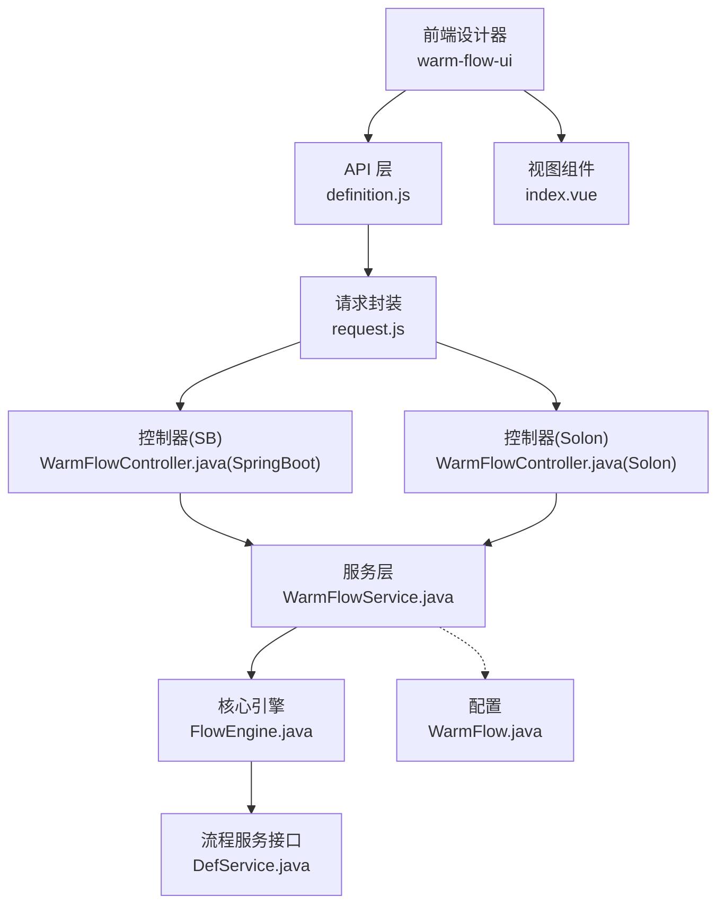
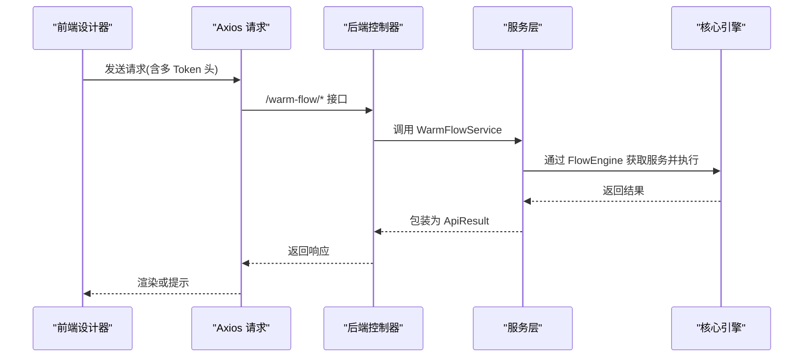
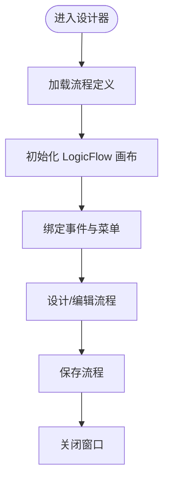
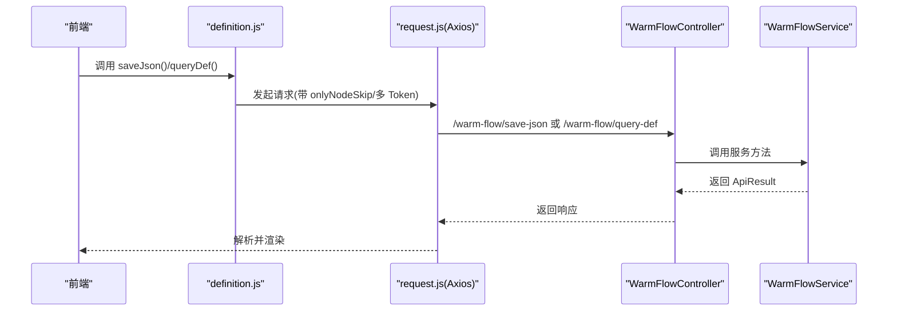
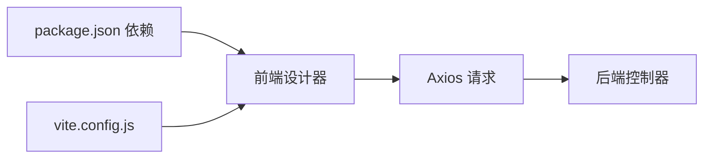

# 设计器集成指南

<cite>
**本文档引用的文件**
- [package.json](file://warm-flow-ui/package.json)
- [vite.config.js](file://warm-flow-ui/vite.config.js)
- [main.js](file://warm-flow-ui/src/main.js)
- [index.vue](file://warm-flow-ui/src/views/flow-design/index.vue)
- [definition.js](file://warm-flow-ui/src/api/flow/definition.js)
- [request.js](file://warm-flow-ui/src/utils/request.js)
- [WarmFlowUiConfig.java](file://warm-flow-plugin/warm-flow-plugin-ui/warm-flow-plugin-ui-sb-web/src/main/java/org/dromara/warm/flow/ui/config/WarmFlowUiConfig.java)
- [WarmFlowController.java(SpringBoot)](file://warm-flow-plugin/warm-flow-plugin-ui/warm-flow-plugin-ui-sb-web/src/main/java/org/dromara/warm/flow/ui/controller/WarmFlowController.java)
- [WarmFlowController.java(Solon)](file://warm-flow-plugin/warm-flow-plugin-ui/warm-flow-plugin-ui-solon-web/src/main/java/org/dromara/warm/flow/ui/controller/WarmFlowController.java)
- [WarmFlowService.java](file://warm-flow-plugin/warm-flow-plugin-ui/warm-flow-plugin-ui-core/src/main/java/org/dromara/warm/flow/ui/service/WarmFlowService.java)
- [DefService.java](file://warm-flow-core/src/main/java/org/dromara/warm/flow/core/service/DefService.java)
- [FlowEngine.java](file://warm-flow-core/src/main/java/org/dromara/warm/flow/core/FlowEngine.java)
- [WarmFlow.java](file://warm-flow-core/src/main/java/org/dromara/warm/flow/core/config/WarmFlow.java)
</cite>

## 目录
1. [简介](#简介)
2. [项目结构](#项目结构)
3. [核心组件](#核心组件)
4. [架构总览](#架构总览)
5. [详细组件分析](#详细组件分析)
6. [依赖分析](#依赖分析)
7. [性能考虑](#性能考虑)
8. [故障排查指南](#故障排查指南)
9. [结论](#结论)
10. [附录](#附录)

## 简介
本指南面向希望在现有项目中集成 Warm-Flow 设计器的开发者，提供从后端 API 规范、前端交互协议、认证机制、嵌入步骤、部署打包、定制化选项到常见集成场景的最佳实践。Warm-Flow 设计器由 Vue3 前端与 Spring Boot/Solon 后端共同组成，前端通过 Axios 发起 REST 请求，后端提供统一的 /warm-flow 接口前缀，支持流程定义、表单、执行、权限等能力。

## 项目结构
Warm-Flow 采用多模块组织：
- warm-flow-ui：Vue3 前端设计器，包含流程设计、表单设计、工具库、API 请求封装等
- warm-flow-plugin：后端插件层，提供 UI 控制器、服务、Web 集成
- warm-flow-core：核心引擎与实体、服务接口、配置等
- warm-flow-orm：ORM 扩展（MyBatis/MyBatis-Plus/EasyQuery），Spring Boot/Solon Starter
- warm-flow-plugin-ui：UI 插件核心与 Web 控制器
- warm-flow-ui-dist：构建产物（dist）

图表来源
- [index.vue:1-900](file://warm-flow-ui/src/views/flow-design/index.vue#L1-L900)
- [definition.js:1-95](file://warm-flow-ui/src/api/flow/definition.js#L1-L95)
- [request.js:1-105](file://warm-flow-ui/src/utils/request.js#L1-L105)
- [WarmFlowController.java(SpringBoot):1-217](file://warm-flow-plugin/warm-flow-plugin-ui/warm-flow-plugin-ui-sb-web/src/main/java/org/dromara/warm/flow/ui/controller/WarmFlowController.java#L1-L217)
- [WarmFlowController.java(Solon):1-244](file://warm-flow-plugin/warm-flow-plugin-ui/warm-flow-plugin-ui-solon-web/src/main/java/org/dromara/warm/flow/ui/controller/WarmFlowController.java#L1-L244)
- [WarmFlowService.java:1-376](file://warm-flow-plugin/warm-flow-plugin-ui/warm-flow-plugin-ui-core/src/main/java/org/dromara/warm/flow/ui/service/WarmFlowService.java#L1-L376)
- [FlowEngine.java:1-270](file://warm-flow-core/src/main/java/org/dromara/warm/flow/core/FlowEngine.java#L1-L270)
- [DefService.java:1-210](file://warm-flow-core/src/main/java/org/dromara/warm/flow/core/service/DefService.java#L1-L210)
- [WarmFlow.java:1-174](file://warm-flow-core/src/main/java/org/dromara/warm/flow/core/config/WarmFlow.java#L1-L174)

章节来源
- [package.json:1-42](file://warm-flow-ui/package.json#L1-L42)
- [vite.config.js:1-71](file://warm-flow-ui/vite.config.js#L1-L71)
- [main.js:1-42](file://warm-flow-ui/src/main.js#L1-L42)

## 核心组件
- 前端设计器：基于 Vue3 + Element Plus + LogicFlow，提供流程设计、属性面板、导出导入、主题切换等能力
- API 层：统一前缀 /warm-flow，封装 GET/POST 请求，自动注入多 Token 认证头
- 控制器层：Spring Boot 与 Solon 两套实现，暴露流程定义、表单、执行、权限等接口
- 服务层：WarmFlowService 组织调用核心引擎与业务扩展点
- 核心引擎：FlowEngine 提供服务获取、Bean 初始化、配置注入等
- 配置：WarmFlow 支持框架类型、Token 名称、状态色、Banner 等配置项

章节来源
- [index.vue:1-900](file://warm-flow-ui/src/views/flow-design/index.vue#L1-L900)
- [definition.js:1-95](file://warm-flow-ui/src/api/flow/definition.js#L1-L95)
- [request.js:1-105](file://warm-flow-ui/src/utils/request.js#L1-L105)
- [WarmFlowController.java(SpringBoot):1-217](file://warm-flow-plugin/warm-flow-plugin-ui/warm-flow-plugin-ui-sb-web/src/main/java/org/dromara/warm/flow/ui/controller/WarmFlowController.java#L1-L217)
- [WarmFlowController.java(Solon):1-244](file://warm-flow-plugin/warm-flow-plugin-ui/warm-flow-plugin-ui-solon-web/src/main/java/org/dromara/warm/flow/ui/controller/WarmFlowController.java#L1-L244)
- [WarmFlowService.java:1-376](file://warm-flow-plugin/warm-flow-plugin-ui/warm-flow-plugin-ui-core/src/main/java/org/dromara/warm/flow/ui/service/WarmFlowService.java#L1-L376)
- [FlowEngine.java:1-270](file://warm-flow-core/src/main/java/org/dromara/warm/flow/core/FlowEngine.java#L1-L270)
- [WarmFlow.java:1-174](file://warm-flow-core/src/main/java/org/dromara/warm/flow/core/config/WarmFlow.java#L1-L174)

## 架构总览
设计器前后端交互遵循“前端 Axios → 后端控制器 → 服务层 → 核心引擎”的调用链路，支持多 Token 认证与跨域代理。

图表来源
- [definition.js:1-95](file://warm-flow-ui/src/api/flow/definition.js#L1-L95)
- [request.js:1-105](file://warm-flow-ui/src/utils/request.js#L1-L105)
- [WarmFlowController.java(SpringBoot):1-217](file://warm-flow-plugin/warm-flow-plugin-ui/warm-flow-plugin-ui-sb-web/src/main/java/org/dromara/warm/flow/ui/controller/WarmFlowController.java#L1-L217)
- [WarmFlowController.java(Solon):1-244](file://warm-flow-plugin/warm-flow-plugin-ui/warm-flow-plugin-ui-solon-web/src/main/java/org/dromara/warm/flow/ui/controller/WarmFlowController.java#L1-L244)
- [WarmFlowService.java:1-376](file://warm-flow-plugin/warm-flow-plugin-ui/warm-flow-plugin-ui-core/src/main/java/org/dromara/warm/flow/ui/service/WarmFlowService.java#L1-L376)
- [FlowEngine.java:1-270](file://warm-flow-core/src/main/java/org/dromara/warm/flow/core/FlowEngine.java#L1-L270)

## 详细组件分析

### 前端设计器组件
- 入口注册：Element Plus、FcDesigner、Pinia、路由等
- 画布初始化：LogicFlow 实例化、DnD 面板、菜单、快照、键盘快捷键
- 事件绑定：节点/边点击、双击、连线、撤销/重做、清空、下载
- 主题适配：监听父窗口主题消息，动态切换深色/浅色模式
- 保存流程：收集画布数据，转换为 Warm-Flow JSON，调用保存接口

图表来源
- [main.js:1-42](file://warm-flow-ui/src/main.js#L1-L42)
- [index.vue:216-255](file://warm-flow-ui/src/views/flow-design/index.vue#L216-L255)
- [index.vue:258-321](file://warm-flow-ui/src/views/flow-design/index.vue#L258-L321)
- [index.vue:551-653](file://warm-flow-ui/src/views/flow-design/index.vue#L551-L653)

章节来源
- [main.js:1-42](file://warm-flow-ui/src/main.js#L1-L42)
- [index.vue:1-900](file://warm-flow-ui/src/views/flow-design/index.vue#L1-L900)

### API 接口规范与数据传输
- 基础路径：VITE_URL_PREFIX + /warm-flow/*
- 认证头：支持多 Token 名称（如 Authorization, X-AUTH-TOKEN），由配置注入
- 请求体：默认 application/json；GET 参数通过 params 传递
- 响应体：统一 ApiResult 结构，包含 code、msg、data 字段

图表来源
- [definition.js:1-95](file://warm-flow-ui/src/api/flow/definition.js#L1-L95)
- [request.js:1-105](file://warm-flow-ui/src/utils/request.js#L1-L105)
- [WarmFlowController.java(SpringBoot):1-217](file://warm-flow-plugin/warm-flow-plugin-ui/warm-flow-plugin-ui-sb-web/src/main/java/org/dromara/warm/flow/ui/controller/WarmFlowController.java#L1-L217)
- [WarmFlowController.java(Solon):1-244](file://warm-flow-plugin/warm-flow-plugin-ui/warm-flow-plugin-ui-solon-web/src/main/java/org/dromara/warm/flow/ui/controller/WarmFlowController.java#L1-L244)
- [WarmFlowService.java:1-376](file://warm-flow-plugin/warm-flow-plugin-ui/warm-flow-plugin-ui-core/src/main/java/org/dromara/warm/flow/ui/service/WarmFlowService.java#L1-L376)

章节来源
- [definition.js:1-95](file://warm-flow-ui/src/api/flow/definition.js#L1-L95)
- [request.js:1-105](file://warm-flow-ui/src/utils/request.js#L1-L105)

### 认证机制与权限控制
- 多 Token 支持：WarmFlow 配置 tokenName，前端按逗号拆分逐个注入请求头
- 权限扩展：HandlerSelectService、HandlerDictService、NodeExtService、ListenerListService 等可由业务系统实现
- 审批执行：/warm-flow/execute/handle 接口支持 skipType、message、nodeCode 等参数

章节来源
- [WarmFlow.java:105-108](file://warm-flow-core/src/main/java/org/dromara/warm/flow/core/config/WarmFlow.java#L105-L108)
- [request.js:20-31](file://warm-flow-ui/src/utils/request.js#L20-L31)
- [WarmFlowService.java:158-246](file://warm-flow-plugin/warm-flow-plugin-ui/warm-flow-plugin-ui-core/src/main/java/org/dromara/warm/flow/ui/service/WarmFlowService.java#L158-L246)
- [WarmFlowController.java(SpringBoot):188-194](file://warm-flow-plugin/warm-flow-plugin-ui/warm-flow-plugin-ui-sb-web/src/main/java/org/dromara/warm/flow/ui/controller/WarmFlowController.java#L188-L194)
- [WarmFlowController.java(Solon):214-220](file://warm-flow-plugin/warm-flow-plugin-ui/warm-flow-plugin-ui-solon-web/src/main/java/org/dromara/warm/flow/ui/controller/WarmFlowController.java#L214-L220)

### 后端控制器与服务层
- Spring Boot：WarmFlowUiConfig 注册 /warm-flow-ui/** 静态资源映射，控制器暴露 /warm-flow/* 接口
- Solon：控制器使用 @Mapping/@Post/@Get 注解，行为与 Spring Boot 对应
- WarmFlowService：封装流程保存、查询、表单读写、执行、权限字典等

章节来源
- [WarmFlowUiConfig.java:1-44](file://warm-flow-plugin/warm-flow-plugin-ui/warm-flow-plugin-ui-sb-web/src/main/java/org/dromara/warm/flow/ui/config/WarmFlowUiConfig.java#L1-L44)
- [WarmFlowController.java(SpringBoot):1-217](file://warm-flow-plugin/warm-flow-plugin-ui/warm-flow-plugin-ui-sb-web/src/main/java/org/dromara/warm/flow/ui/controller/WarmFlowController.java#L1-L217)
- [WarmFlowController.java(Solon):1-244](file://warm-flow-plugin/warm-flow-plugin-ui/warm-flow-plugin-ui-solon-web/src/main/java/org/dromara/warm/flow/ui/controller/WarmFlowController.java#L1-L244)
- [WarmFlowService.java:1-376](file://warm-flow-plugin/warm-flow-plugin-ui/warm-flow-plugin-ui-core/src/main/java/org/dromara/warm/flow/ui/service/WarmFlowService.java#L1-L376)

### 核心引擎与流程服务
- FlowEngine：提供 DefService/NodeService/SkipService/InsService/TaskService/FormService/ChartService 获取与 Bean 初始化
- DefService：流程定义导入/导出、保存、查询、发布/激活等

章节来源
- [FlowEngine.java:1-270](file://warm-flow-core/src/main/java/org/dromara/warm/flow/core/FlowEngine.java#L1-L270)
- [DefService.java:1-210](file://warm-flow-core/src/main/java/org/dromara/warm/flow/core/service/DefService.java#L1-L210)

## 依赖分析
- 前端依赖：Vue3、Element Plus、LogicFlow、Axios、Pinia、Vue Router 等
- 构建配置：Vite 基础路径 ./、资源命名、代理 dev-api 到后端 8080
- 运行时：前端通过 import.meta.env.VITE_APP_BASE_API 与 VITE_URL_PREFIX 组合请求后端

图表来源
- [package.json:1-42](file://warm-flow-ui/package.json#L1-L42)
- [vite.config.js:1-71](file://warm-flow-ui/vite.config.js#L1-L71)
- [request.js:1-105](file://warm-flow-ui/src/utils/request.js#L1-L105)

章节来源
- [package.json:1-42](file://warm-flow-ui/package.json#L1-L42)
- [vite.config.js:1-71](file://warm-flow-ui/vite.config.js#L1-L71)

## 性能考虑
- 前端：LogicFlow 画布渲染与事件绑定较多时，建议在仅设计模式下禁用经典模式的 DnD 面板与键盘快捷键，减少 DOM 与事件开销
- 请求：避免大体积请求体，防重复提交拦截器对超过 5MB 的请求会跳过校验
- 构建：rollupOptions 输出按哈希命名，利于浏览器缓存；chunkSizeWarningLimit 提示过大包

章节来源
- [index.vue:283-296](file://warm-flow-ui/src/views/flow-design/index.vue#L283-L296)
- [request.js:45-66](file://warm-flow-ui/src/utils/request.js#L45-L66)
- [vite.config.js:16-25](file://warm-flow-ui/vite.config.js#L16-L25)

## 故障排查指南
- 无法加载流程定义：检查 /warm-flow/query-def 接口返回与 onlyNodeSkip 参数
- 保存失败：确认 onlyNodeSkip 传参、请求头注入的 Token 名称与值
- 权限字典为空：确认 HandlerDictService/HandlerSelectService 是否实现并注入
- 审批执行报错：核对 taskId、skipType、message、nodeCode 参数
- 跨域问题：开发时确保 Vite 代理 /dev-api 指向后端地址

章节来源
- [definition.js:1-95](file://warm-flow-ui/src/api/flow/definition.js#L1-L95)
- [request.js:1-105](file://warm-flow-ui/src/utils/request.js#L1-L105)
- [WarmFlowController.java(SpringBoot):51-55](file://warm-flow-plugin/warm-flow-plugin-ui/warm-flow-plugin-ui-sb-web/src/main/java/org/dromara/warm/flow/ui/controller/WarmFlowController.java#L51-L55)
- [WarmFlowController.java(SpringBoot):188-194](file://warm-flow-plugin/warm-flow-plugin-ui/warm-flow-plugin-ui-sb-web/src/main/java/org/dromara/warm/flow/ui/controller/WarmFlowController.java#L188-L194)
- [WarmFlowController.java(Solon):52-55](file://warm-flow-plugin/warm-flow-plugin-ui/warm-flow-plugin-ui-solon-web/src/main/java/org/dromara/warm/flow/ui/controller/WarmFlowController.java#L52-L55)
- [WarmFlowController.java(Solon):216-220](file://warm-flow-plugin/warm-flow-plugin-ui/warm-flow-plugin-ui-solon-web/src/main/java/org/dromara/warm/flow/ui/controller/WarmFlowController.java#L216-L220)
- [vite.config.js:43-50](file://warm-flow-ui/vite.config.js#L43-L50)

## 结论
Warm-Flow 设计器提供了完整的前后端集成方案：前端通过 Axios 与后端 /warm-flow 接口通信，后端通过控制器与服务层对接核心引擎。通过多 Token 认证、权限扩展点与丰富的配置项，可在不同框架（Spring Boot/Solon）与部署环境下灵活集成。建议在生产环境中结合 CDN 缓存、版本管理与安全策略，确保稳定与安全。

## 附录

### 集成步骤（Spring Boot）
- 引入依赖：warm-flow-plugin-ui-sb-web 与 warm-flow-ui-dist
- 配置 WarmFlow：设置 tokenName、ui 开关、状态色等
- 启动后端：WarmFlowUiConfig 自动注册 /warm-flow-ui/** 静态资源映射
- 前端请求：设置 VITE_APP_BASE_API 与 VITE_URL_PREFIX，确保 /warm-flow/* 可达

章节来源
- [WarmFlowUiConfig.java:32-42](file://warm-flow-plugin/warm-flow-plugin-ui/warm-flow-plugin-ui-sb-web/src/main/java/org/dromara/warm/flow/ui/config/WarmFlowUiConfig.java#L32-L42)
- [WarmFlow.java:105-108](file://warm-flow-core/src/main/java/org/dromara/warm/flow/core/config/WarmFlow.java#L105-L108)

### 集成步骤（Solon）
- 引入 warm-flow-plugin-ui-solon-web
- 使用 @Mapping 注解的控制器与 WarmFlowService 协同
- 配置 tokenName 与状态色，保持与前端一致

章节来源
- [WarmFlowController.java(Solon):38-40](file://warm-flow-plugin/warm-flow-plugin-ui/warm-flow-plugin-ui-solon-web/src/main/java/org/dromara/warm/flow/ui/controller/WarmFlowController.java#L38-L40)
- [WarmFlow.java:105-108](file://warm-flow-core/src/main/java/org/dromara/warm/flow/core/config/WarmFlow.java#L105-L108)

### 部署方式
- 静态资源打包：使用 Vite 构建，输出至 dist，静态资源按哈希命名
- CDN 配置：将 dist 目录托管至 CDN，前端通过 VITE_URL_PREFIX 指向 CDN
- 版本管理：package.json 中 version 作为版本标识，建议配合缓存失效策略

章节来源
- [package.json:1-42](file://warm-flow-ui/package.json#L1-L42)
- [vite.config.js:16-25](file://warm-flow-ui/vite.config.js#L16-L25)

### 定制化选项
- 主题配置：前端通过主题切换与深色模式适配；后端 WarmFlow 支持 chartStatusColor 系列配置
- 功能开关：WarmFlow.ui 控制 UI 是否启用；WarmFlow.enabled 控制整体开关
- 权限控制：实现 HandlerSelectService/HandlerDictService/NodeExtService/ListenerListService

章节来源
- [index.vue:353-378](file://warm-flow-ui/src/views/flow-design/index.vue#L353-L378)
- [WarmFlow.java:113-128](file://warm-flow-core/src/main/java/org/dromara/warm/flow/core/config/WarmFlow.java#L113-L128)
- [WarmFlowService.java:158-246](file://warm-flow-plugin/warm-flow-plugin-ui/warm-flow-plugin-ui-core/src/main/java/org/dromara/warm/flow/ui/service/WarmFlowService.java#L158-L246)

### 常见集成场景
- 微服务架构：前端通过网关统一转发 /warm-flow/*，后端按需暴露控制器；Token 名称与权限由网关/鉴权中心集中管理
- 安全配置：建议在 Nginx/网关层开启 CORS、限流与 WAF；后端 WarmFlow.tokenName 支持多 Token 名称，便于与业务系统共享权限

章节来源
- [WarmFlow.java:105-108](file://warm-flow-core/src/main/java/org/dromara/warm/flow/core/config/WarmFlow.java#L105-L108)
- [vite.config.js:43-50](file://warm-flow-ui/vite.config.js#L43-L50)