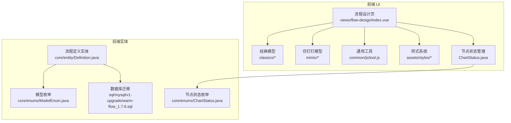
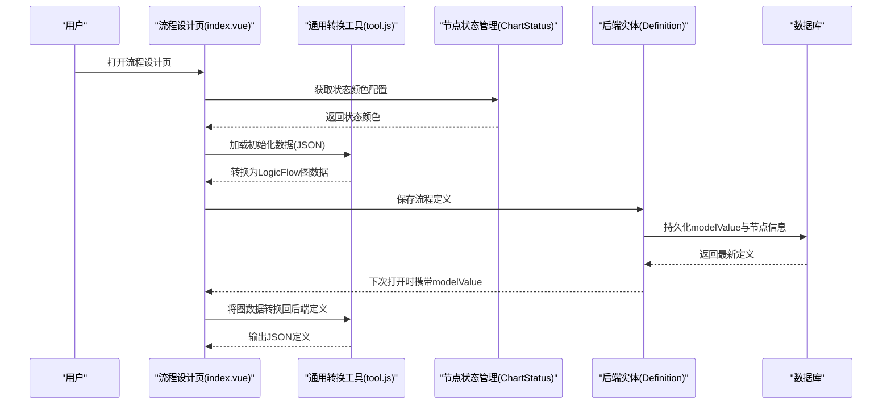
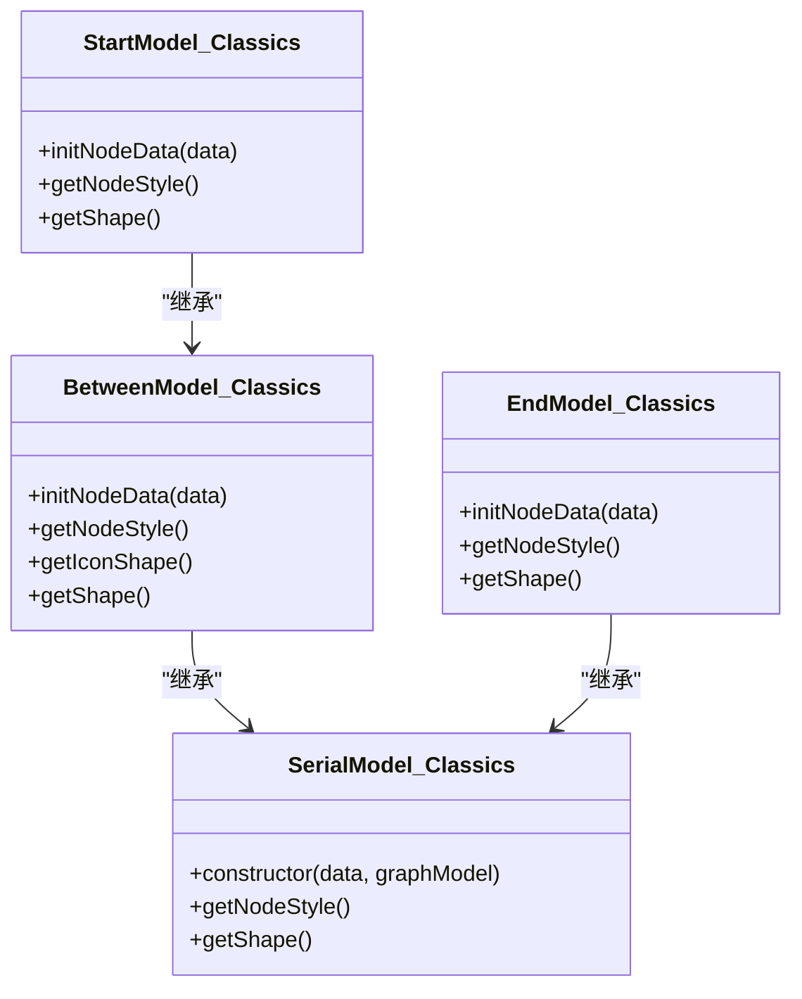
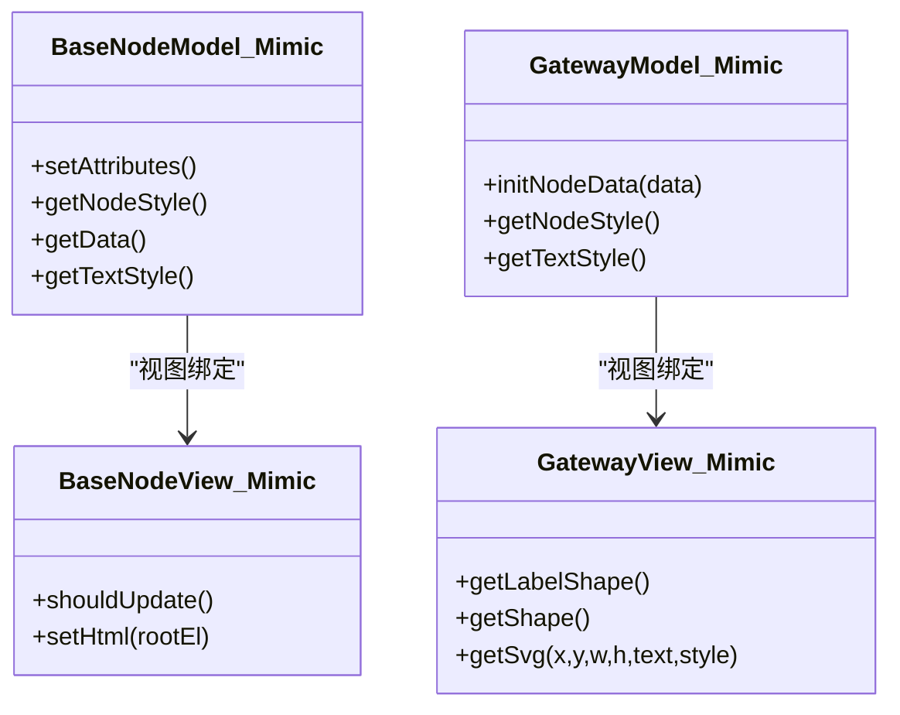
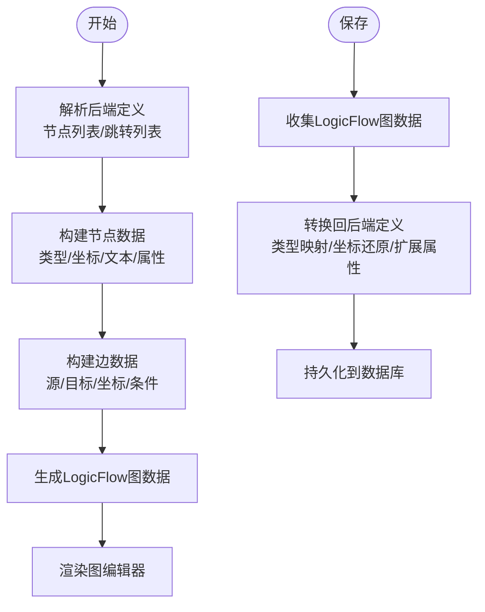
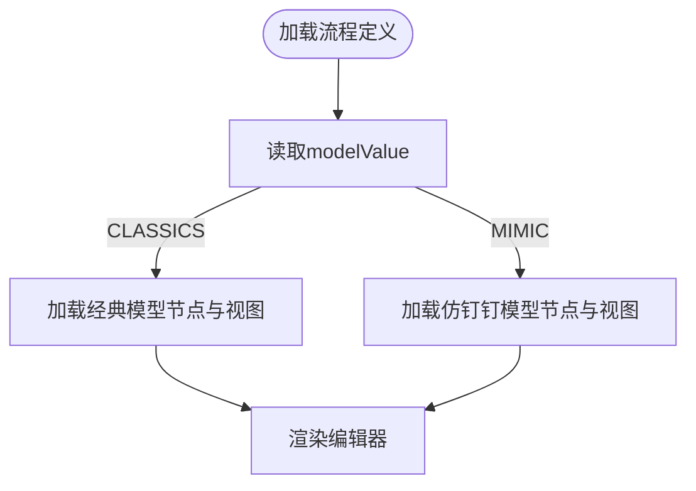
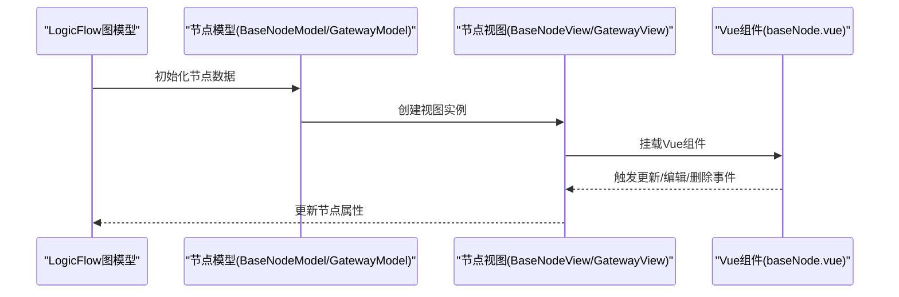
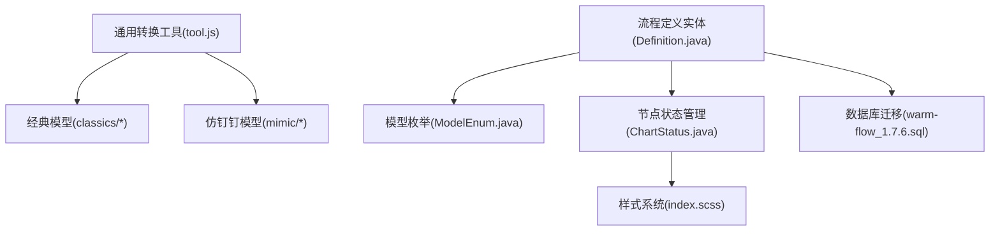

# 设计模型系统

<cite>
**本文档引用的文件**
- [ModelEnum.java](file://warm-flow-core/src/main/java/org/dromara/warm/flow/core/enums/ModelEnum.java)
- [Definition.java](file://warm-flow-core/src/main/java/org/dromara/warm/flow/core/entity/Definition.java)
- [ChartStatus.java](file://warm-flow-core/src/main/java/org/dromara/warm/flow/core/enums/ChartStatus.java)
- [tool.js](file://warm-flow-ui/src/components/design/common/js/tool.js)
- [index.scss](file://warm-flow-ui/src/assets/styles/index.scss)
- [variables.module.scss](file://warm-flow-ui/src/assets/styles/variables.module.scss)
- [initClassicsData.json](file://warm-flow-ui/src/components/design/classics/initClassicsData.json)
- [initMimicData.json](file://warm-flow-ui/src/components/design/mimic/initMimicData.json)
- [start.js（经典）](file://warm-flow-ui/src/components/design/classics/js/start.js)
- [serial.js（经典）](file://warm-flow-ui/src/components/design/classics/js/serial.js)
- [between.js（经典）](file://warm-flow-ui/src/components/design/classics/js/between.js)
- [end.js（经典）](file://warm-flow-ui/src/components/design/classics/js/end.js)
- [start.js（仿钉钉）](file://warm-flow-ui/src/components/design/mimic/js/start.js)
- [baseNodeModel.js（仿钉钉）](file://warm-flow-ui/src/components/design/mimic/js/baseNodeModel.js)
- [baseNodeView.js（仿钉钉）](file://warm-flow-ui/src/components/design/mimic/js/baseNodeView.js)
- [gatewayModel.ts（仿钉钉）](file://warm-flow-ui/src/components/design/mimic/js/gatewayModel.ts)
- [gatewayView.ts（仿钉钉）](file://warm-flow-ui/src/components/design/mimic/js/gatewayView.ts)
- [serial.ts（仿钉钉）](file://warm-flow-ui/src/components/design/mimic/js/serial.ts)
- [parallel.ts（仿钉钉）](file://warm-flow-ui/src/components/design/mimic/js/parallel.ts)
- [baseNode.vue（仿钉钉）](file://warm-flow-ui/src/components/design/mimic/vue/baseNode.vue)
- [index.vue（流程设计页面）](file://warm-flow-ui/src/views/flow-design/index.vue)
- [flowChart.vue（流程图视图）](file://warm-flow-ui/src/views/flow-design/flowChart.vue)
- [warm-flow_1.7.6.sql](file://sql/mysql/v1-upgrade/warm-flow_1.7.6.sql)
</cite>

## 目录
1. [引言](#引言)
2. [项目结构](#项目结构)
3. [核心组件](#核心组件)
4. [架构总览](#架构总览)
5. [详细组件分析](#详细组件分析)
6. [现代化节点设计规范](#现代化节点设计规范)
7. [节点状态颜色管理系统](#节点状态颜色管理系统)
8. [暗黑模式适配规范](#暗黑模式适配规范)
9. [依赖分析](#依赖分析)
10. [性能考虑](#性能考虑)
11. [故障排查指南](#故障排查指南)
12. [结论](#结论)
13. [附录](#附录)

## 引言
本技术文档围绕 Warm-Flow 的"设计模型系统"展开，系统性解析两类设计器模型：经典模型（CLASSICS）与仿钉钉模型（MIMIC）。文档重点覆盖以下方面：
- 两类模型的设计理念、视觉差异与实现原理
- 数据结构定义、节点类型支持与布局算法
- 模型切换机制、数据转换规则与兼容性处理
- 节点组件实现方式（基础节点、网关节点、分支节点等）与渲染逻辑
- **现代化节点设计规范**（全新卡片式设计风格、渐变圆形开始节点、文档卡片中间节点等）
- **节点状态颜色管理系统**（工作流语义色与自定义颜色）
- **暗黑模式适配规范**（全站暗黑模式支持与节点适配）
- 模型扩展指南（新增节点类型与自定义节点样式）

## 项目结构
设计模型系统主要分布在前端 UI 层与后端实体层：
- 前端 UI 层包含经典模型与仿钉钉模型的节点定义、视图组件与初始化数据
- 后端实体层通过枚举与数据库字段支撑模型标识与持久化
- **新增**：现代化节点设计规范与暗黑模式适配

**图表来源**
- [index.vue（流程设计页面）:381-411](file://warm-flow-ui/src/views/flow-design/index.vue#L381-L411)
- [tool.js:1-330](file://warm-flow-ui/src/components/design/common/js/tool.js#L1-L330)
- [ModelEnum.java:21-40](file://warm-flow-core/src/main/java/org/dromara/warm/flow/core/enums/ModelEnum.java#L21-L40)
- [Definition.java:99-106](file://warm-flow-core/src/main/java/org/dromara/warm/flow/core/entity/Definition.java#L99-L106)
- [ChartStatus.java:1-155](file://warm-flow-core/src/main/java/org/dromara/warm/flow/core/enums/ChartStatus.java#L1-L155)
- [index.scss:1-608](file://warm-flow-ui/src/assets/styles/index.scss#L1-L608)
- [warm-flow_1.7.6.sql:1-2](file://sql/mysql/v1-upgrade/warm-flow_1.7.6.sql#L1-L2)

**章节来源**
- [index.vue（流程设计页面）:381-411](file://warm-flow-ui/src/views/flow-design/index.vue#L381-L411)
- [tool.js:1-330](file://warm-flow-ui/src/components/design/common/js/tool.js#L1-L330)
- [ModelEnum.java:21-40](file://warm-flow-core/src/main/java/org/dromara/warm/flow/core/enums/ModelEnum.java#L21-L40)
- [Definition.java:99-106](file://warm-flow-core/src/main/java/org/dromara/warm/flow/core/entity/Definition.java#L99-L106)
- [ChartStatus.java:1-155](file://warm-flow-core/src/main/java/org/dromara/warm/flow/core/enums/ChartStatus.java#L1-L155)
- [index.scss:1-608](file://warm-flow-ui/src/assets/styles/index.scss#L1-L608)
- [warm-flow_1.7.6.sql:1-2](file://sql/mysql/v1-upgrade/warm-flow_1.7.6.sql#L1-L2)

## 核心组件
- 模型枚举：定义 CLASSICS 与 MIMIC 两种模型常量，作为前后端统一的模型标识
- 流程定义实体：提供 modelValue 字段存储当前流程使用的模型
- **节点状态枚举**：定义工作流状态（未办理、待办理、已办理）及其默认颜色
- 通用转换工具：负责将 Warm-Flow 的定义 JSON 与 LogicFlow 的图数据相互转换
- **现代化节点样式**：统一的节点样式增强（阴影、描边、状态色）
- 经典模型节点：圆形开始节点、矩形中间节点、多边形串行网关等
- 仿钉钉模型节点：矩形基础节点、网关节点（串行/并行/包容式）、HTML 节点视图与 Vue 组件

**章节来源**
- [ModelEnum.java:21-40](file://warm-flow-core/src/main/java/org/dromara/warm/flow/core/enums/ModelEnum.java#L21-L40)
- [Definition.java:99-106](file://warm-flow-core/src/main/java/org/dromara/warm/flow/core/entity/Definition.java#L99-L106)
- [ChartStatus.java:35-46](file://warm-flow-core/src/main/java/org/dromara/warm/flow/core/enums/ChartStatus.java#L35-L46)
- [tool.js:1-330](file://warm-flow-ui/src/components/design/common/js/tool.js#L1-L330)
- [tool.js:255-302](file://warm-flow-ui/src/components/design/common/js/tool.js#L255-L302)
- [start.js（经典）:1-79](file://warm-flow-ui/src/components/design/classics/js/start.js#L1-L79)
- [serial.js（经典）:1-89](file://warm-flow-ui/src/components/design/classics/js/serial.js#L1-L89)
- [baseNodeModel.js（仿钉钉）:1-30](file://warm-flow-ui/src/components/design/mimic/js/baseNodeModel.js#L1-L30)
- [gatewayModel.ts（仿钉钉）:1-22](file://warm-flow-ui/src/components/design/mimic/js/gatewayModel.ts#L1-L22)
- [gatewayView.ts（仿钉钉）:1-65](file://warm-flow-ui/src/components/design/mimic/js/gatewayView.ts#L1-L65)

## 架构总览
设计模型系统采用"前端模型定义 + 通用转换工具 + 后端实体"的分层架构：
- 前端根据 modelValue 决定加载经典或仿钉钉模型的节点定义与视图
- 通用工具负责将后端返回的流程定义转换为 LogicFlow 图数据，或将用户编辑后的图数据回写为后端定义
- 后端实体通过 modelValue 字段持久化当前流程的模型类型
- **新增**：节点状态颜色管理系统与暗黑模式适配

**图表来源**
- [index.vue（流程设计页面）:381-411](file://warm-flow-ui/src/views/flow-design/index.vue#L381-L411)
- [tool.js:8-131](file://warm-flow-ui/src/components/design/common/js/tool.js#L8-L131)
- [ChartStatus.java:55-90](file://warm-flow-core/src/main/java/org/dromara/warm/flow/core/enums/ChartStatus.java#L55-L90)
- [Definition.java:99-106](file://warm-flow-core/src/main/java/org/dromara/warm/flow/core/entity/Definition.java#L99-L106)
- [warm-flow_1.7.6.sql:1-2](file://sql/mysql/v1-upgrade/warm-flow_1.7.6.sql#L1-L2)

## 详细组件分析

### 经典模型（CLASSICS）
- 设计理念：强调简洁与标准流程形状，使用圆形表示开始/结束，矩形表示普通节点，多边形表示网关
- **现代化节点设计**：
  - 开始节点：渐变圆形设计，包含外环渐变、内核实心渐变、发光效果
  - 中间节点：卡片式设计，带阴影、光泽渐变、文档图标装饰
  - 结束节点：双环渐变设计，内圈装饰圆环
  - 网关节点：统一阴影效果，X图标装饰
- 节点类型支持：
  - 开始节点：圆形，半径固定，渐变设计
  - 中间节点：矩形，支持协作方式等属性，卡片式设计
  - 结束节点：圆形，双环渐变设计
  - 网关节点：串行（三角形）、并行（菱形）、包容（多边形）
- 初始化数据：提供默认节点与边的示例，便于快速体验
- 拖拽面板：仅在经典模式启用，包含节点类型与默认属性

**图表来源**
- [start.js（经典）:1-79](file://warm-flow-ui/src/components/design/classics/js/start.js#L1-L79)
- [between.js（经典）:1-137](file://warm-flow-ui/src/components/design/classics/js/between.js#L1-L137)
- [end.js（经典）:1-80](file://warm-flow-ui/src/components/design/classics/js/end.js#L1-L80)
- [serial.js（经典）:1-89](file://warm-flow-ui/src/components/design/classics/js/serial.js#L1-L89)

**章节来源**
- [initClassicsData.json:1-147](file://warm-flow-ui/src/components/design/classics/initClassicsData.json#L1-L147)
- [start.js（经典）:1-79](file://warm-flow-ui/src/components/design/classics/js/start.js#L1-L79)
- [between.js（经典）:1-137](file://warm-flow-ui/src/components/design/classics/js/between.js#L1-L137)
- [end.js（经典）:1-80](file://warm-flow-ui/src/components/design/classics/js/end.js#L1-L80)
- [serial.js（经典）:1-89](file://warm-flow-ui/src/components/design/classics/js/serial.js#L1-L89)
- [index.vue（流程设计页面）:381-411](file://warm-flow-ui/src/views/flow-design/index.vue#L381-L411)

### 仿钉钉模型（MIMIC）
- 设计理念：强调卡片式节点与可视化交互，节点以矩形卡片呈现，顶部展示名称与权限，底部展示处理人信息
- **现代化节点设计**：
  - 基础节点：统一的卡片式设计，220x80尺寸，20px圆角
  - 网关节点：统一矩形模型，支持多输入边图标显示
- 节点类型支持：
  - 基础节点：矩形卡片，支持权限标志、状态色等属性
  - 网关节点：串行、并行、包容式，通过 SVG 图标区分输入边数量
- 渲染逻辑：
  - 基础节点模型：设置默认宽高、圆角、文本输入；提供样式合并与文本样式隐藏
  - 基础节点视图：基于 HTML 节点渲染，挂载 Vue 组件，支持更新节点名、编辑与删除事件
  - 网关节点：统一矩形模型，视图根据输入边数量动态选择图标

**图表来源**
- [baseNodeModel.js（仿钉钉）:1-30](file://warm-flow-ui/src/components/design/mimic/js/baseNodeModel.js#L1-L30)
- [baseNodeView.js（仿钉钉）:1-71](file://warm-flow-ui/src/components/design/mimic/js/baseNodeView.js#L1-L71)
- [gatewayModel.ts（仿钉钉）:1-22](file://warm-flow-ui/src/components/design/mimic/js/gatewayModel.ts#L1-L22)
- [gatewayView.ts（仿钉钉）:1-65](file://warm-flow-ui/src/components/design/mimic/js/gatewayView.ts#L1-L65)

**章节来源**
- [baseNodeModel.js（仿钉钉）:1-30](file://warm-flow-ui/src/components/design/mimic/js/baseNodeModel.js#L1-L30)
- [baseNodeView.js（仿钉钉）:1-71](file://warm-flow-ui/src/components/design/mimic/js/baseNodeView.js#L1-L71)
- [gatewayModel.ts（仿钉钉）:1-22](file://warm-flow-ui/src/components/design/mimic/js/gatewayModel.ts#L1-L22)
- [gatewayView.ts（仿钉钉）:1-65](file://warm-flow-ui/src/components/design/mimic/js/gatewayView.ts#L1-L65)
- [baseNode.vue（仿钉钉）:1-195](file://warm-flow-ui/src/components/design/mimic/vue/baseNode.vue#L1-L195)

### 数据结构与转换规则
- 节点类型映射：通用工具中定义了节点类型到 Warm-Flow 节点类型的映射表，用于序列化/反序列化
- 初始化数据：
  - 经典模型：包含开始、中间、结束节点及跳转边的默认配置
  - 仿钉钉模型：包含卡片式节点与垂直连线的默认配置
- 数据转换：
  - 从后端定义到 LogicFlow：解析节点坐标、文本位置、扩展属性与跳转坐标
  - 从 LogicFlow 回写到后端：还原节点类型、坐标、跳转坐标与扩展属性

**图表来源**
- [tool.js:8-131](file://warm-flow-ui/src/components/design/common/js/tool.js#L8-L131)
- [tool.js:138-253](file://warm-flow-ui/src/components/design/common/js/tool.js#L138-L253)
- [initClassicsData.json:1-147](file://warm-flow-ui/src/components/design/classics/initClassicsData.json#L1-L147)
- [initMimicData.json:1-111](file://warm-flow-ui/src/components/design/mimic/initMimicData.json#L1-L111)

**章节来源**
- [tool.js:1-330](file://warm-flow-ui/src/components/design/common/js/tool.js#L1-L330)
- [initClassicsData.json:1-147](file://warm-flow-ui/src/components/design/classics/initClassicsData.json#L1-L147)
- [initMimicData.json:1-111](file://warm-flow-ui/src/components/design/mimic/initMimicData.json#L1-L111)

### 模型切换机制与兼容性
- 模型标识：后端实体定义 modelValue 字段，数据库迁移脚本新增该列并默认为经典模型
- 前端判断：通用工具提供 isClassics 判断函数，流程设计页据此决定是否启用经典拖拽面板
- 兼容性处理：
  - 节点类型映射：通过映射表保证不同模型下的节点类型一致性
  - 属性兼容：通用样式函数根据状态与模型类型应用不同样式，确保视觉一致
  - 初始化数据：两套初始化模板分别适配不同模型的默认布局

**图表来源**
- [Definition.java:99-106](file://warm-flow-core/src/main/java/org/dromara/warm/flow/core/entity/Definition.java#L99-L106)
- [ModelEnum.java:21-40](file://warm-flow-core/src/main/java/org/dromara/warm/flow/core/enums/ModelEnum.java#L21-L40)
- [tool.js:319-321](file://warm-flow-ui/src/components/design/common/js/tool.js#L319-L321)
- [index.vue（流程设计页面）:381-411](file://warm-flow-ui/src/views/flow-design/index.vue#L381-L411)
- [warm-flow_1.7.6.sql:1-2](file://sql/mysql/v1-upgrade/warm-flow_1.7.6.sql#L1-L2)

**章节来源**
- [Definition.java:99-106](file://warm-flow-core/src/main/java/org/dromara/warm/flow/core/entity/Definition.java#L99-L106)
- [ModelEnum.java:21-40](file://warm-flow-core/src/main/java/org/dromara/warm/flow/core/enums/ModelEnum.java#L21-L40)
- [tool.js:319-321](file://warm-flow-ui/src/components/design/common/js/tool.js#L319-L321)
- [index.vue（流程设计页面）:381-411](file://warm-flow-ui/src/views/flow-design/index.vue#L381-L411)
- [warm-flow_1.7.6.sql:1-2](file://sql/mysql/v1-upgrade/warm-flow_1.7.6.sql#L1-L2)

### 节点组件实现与渲染逻辑
- 基础节点（仿钉钉）：
  - 模型：设置默认尺寸、圆角与文本输入，提供样式合并与文本样式隐藏
  - 视图：基于 HTML 节点挂载 Vue 组件，支持节点名编辑、编辑与删除事件
  - Vue 组件：顶部展示名称与权限，底部展示处理人，支持点击编辑与删除
- 网关节点（仿钉钉）：
  - 模型：统一矩形模型，设置宽高与圆角
  - 视图：根据输入边数量动态选择图标；SVG 图标随样式填充与描边变化
  - 串行/并行/包容式：通过抽象基类派生，各自实现 getSvg 生成对应图标

**图表来源**
- [baseNodeModel.js（仿钉钉）:1-30](file://warm-flow-ui/src/components/design/mimic/js/baseNodeModel.js#L1-L30)
- [baseNodeView.js（仿钉钉）:1-71](file://warm-flow-ui/src/components/design/mimic/js/baseNodeView.js#L1-L71)
- [gatewayModel.ts（仿钉钉）:1-22](file://warm-flow-ui/src/components/design/mimic/js/gatewayModel.ts#L1-L22)
- [gatewayView.ts（仿钉钉）:1-65](file://warm-flow-ui/src/components/design/mimic/js/gatewayView.ts#L1-L65)
- [baseNode.vue（仿钉钉）:1-195](file://warm-flow-ui/src/components/design/mimic/vue/baseNode.vue#L1-L195)

**章节来源**
- [baseNodeModel.js（仿钉钉）:1-30](file://warm-flow-ui/src/components/design/mimic/js/baseNodeModel.js#L1-L30)
- [baseNodeView.js（仿钉钉）:1-71](file://warm-flow-ui/src/components/design/mimic/js/baseNodeView.js#L1-L71)
- [gatewayModel.ts（仿钉钉）:1-22](file://warm-flow-ui/src/components/design/mimic/js/gatewayModel.ts#L1-L22)
- [gatewayView.ts（仿钉钉）:1-65](file://warm-flow-ui/src/components/design/mimic/js/gatewayView.ts#L1-L65)
- [baseNode.vue（仿钉钉）:1-195](file://warm-flow-ui/src/components/design/mimic/vue/baseNode.vue#L1-L195)

## 现代化节点设计规范

### 卡片式设计风格
所有经典节点模型都采用了新的卡片式设计风格，提供统一的视觉体验：

- **开始节点渐变设计**：
  - 外环渐变描边：从节点色到透明的线性渐变
  - 内核实心渐变：从高浓度到低浓度的径向渐变
  - 发光效果：半透明大圆环和高斯模糊发光滤镜
  - 暗黑模式适配：使用深色背景渐变替代白色背景

- **中间节点文档卡片**：
  - 卡片阴影：双重阴影滤镜（3px和1px）
  - 顶部光泽：线性渐变光泽条
  - 文档图标：圆角矩形背景、对勾图标、装饰线条
  - 状态色集成：使用节点状态色进行图标着色

- **结束节点双环设计**：
  - 外层光晕：半透明大圆环
  - 内圈填充：渐变填充（暗黑模式加深）
  - 粗外环：主视觉描边
  - 细内环：装饰圆环

- **网关节点阴影效果**：
  - 统一阴影滤镜
  - X图标装饰：加粗对角线和四端装饰圆点

**章节来源**
- [start.js（经典）:25-71](file://warm-flow-ui/src/components/design/classics/js/start.js#L25-L71)
- [between.js（经典）:82-129](file://warm-flow-ui/src/components/design/classics/js/between.js#L82-L129)
- [end.js（经典）:27-72](file://warm-flow-ui/src/components/design/classics/js/end.js#L27-L72)
- [serial.js（经典）:48-81](file://warm-flow-ui/src/components/design/classics/js/serial.js#L48-L81)

### 统一样式增强
通用工具提供现代化样式增强功能：

- **统一描边宽度**：1.5px
- **统一光标样式**：pointer
- **统一线条连接**：round
- **柔和阴影**：drop-shadow(0 2px 8px rgba(currentColor, 0.12)) drop-shadow(0 1px 3px rgba(0, 0, 0, 0.06))
- **状态色传递**：_statusColorRGB、_statusHex、_statusRgba方法

**章节来源**
- [tool.js:287-302](file://warm-flow-ui/src/components/design/common/js/tool.js#L287-L302)

## 节点状态颜色管理系统

### 工作流语义色
系统定义了标准的工作流状态颜色：

- **未办理**：灰色（107,114,128）
- **待办理**：橙色（245,158,11）  
- **已办理**：绿色（56,161,105）

### 自定义颜色配置
支持为不同模型配置独立的颜色：

- **全局自定义颜色**：通过 chartStatusColor 参数传入
- **经典模型颜色**：通过 chartStatusColorClassics 参数传入
- **仿钉钉模型颜色**：通过 chartStatusColorMimic 参数传入

### 颜色获取机制
颜色获取遵循优先级原则：

1. 模型特定颜色（CLASSICS 或 MIMIC）
2. 全局自定义颜色
3. 默认工作流颜色

**章节来源**
- [ChartStatus.java:35-46](file://warm-flow-core/src/main/java/org/dromara/warm/flow/core/enums/ChartStatus.java#L35-L46)
- [ChartStatus.java:55-90](file://warm-flow-core/src/main/java/org/dromara/warm/flow/core/enums/ChartStatus.java#L55-L90)
- [ChartStatus.java:104-115](file://warm-flow-core/src/main/java/org/dromara/warm/flow/core/enums/ChartStatus.java#L104-L115)
- [tool.js:257-302](file://warm-flow-ui/src/components/design/common/js/tool.js#L257-L302)

## 暗黑模式适配规范

### 全站暗黑模式支持
系统提供完整的暗黑模式适配：

- **CSS变量适配**：:root 和 html.dark 两套变量体系
- **Element Plus覆盖**：针对 EP 组件的暗黑模式样式覆盖
- **滚动条适配**：暗黑模式下的滚动条样式
- **LogicFlow组件适配**：拖拽面板和控制栏的暗黑模式样式

### 节点暗黑模式适配
节点组件自动适配暗黑模式：

- **开始节点**：背景渐变从白色/浅灰改为深色/黑色
- **中间节点**：图标和装饰元素使用暗黑模式颜色
- **结束节点**：内圈填充使用更深的暗黑模式颜色
- **网关节点**：图标填充色自动适配暗黑模式

### 暗黑模式检测
节点组件通过检查 documentElement.classList.contains('dark') 来检测暗黑模式状态。

**章节来源**
- [index.scss:32-608](file://warm-flow-ui/src/assets/styles/index.scss#L32-L608)
- [start.js（经典）:23](file://warm-flow-ui/src/components/design/classics/js/start.js#L23)
- [end.js（经典）:25](file://warm-flow-ui/src/components/design/classics/js/end.js#L25)
- [flowChart.vue（流程图视图）:372-376](file://warm-flow-ui/src/views/flow-design/flowChart.vue#L372-L376)

## 依赖分析
- 前端模块耦合：
  - 经典模型与仿钉钉模型各自独立，通过通用工具进行数据转换
  - 仿钉钉模型的节点视图依赖 Vue 组件与 Element Plus 指令
  - **新增**：节点状态管理依赖 ChartStatus 枚举
  - **新增**：样式系统依赖 CSS 变量和暗黑模式类
- 后端实体依赖：
  - 流程定义实体依赖模型枚举与数据库迁移脚本中的字段定义
  - **新增**：节点状态枚举提供颜色管理功能
- 耦合与内聚：
  - 通用转换工具承担数据桥接职责，降低模型间的耦合
  - 模型内部保持高内聚，节点模型与视图分离，便于扩展
  - **新增**：状态管理与样式系统解耦，支持灵活的颜色配置

**图表来源**
- [tool.js:1-330](file://warm-flow-ui/src/components/design/common/js/tool.js#L1-L330)
- [start.js（经典）:1-79](file://warm-flow-ui/src/components/design/classics/js/start.js#L1-L79)
- [baseNodeModel.js（仿钉钉）:1-30](file://warm-flow-ui/src/components/design/mimic/js/baseNodeModel.js#L1-L30)
- [Definition.java:99-106](file://warm-flow-core/src/main/java/org/dromara/warm/flow/core/entity/Definition.java#L99-L106)
- [ModelEnum.java:21-40](file://warm-flow-core/src/main/java/org/dromara/warm/flow/core/enums/ModelEnum.java#L21-L40)
- [ChartStatus.java:1-155](file://warm-flow-core/src/main/java/org/dromara/warm/flow/core/enums/ChartStatus.java#L1-L155)
- [index.scss:1-608](file://warm-flow-ui/src/assets/styles/index.scss#L1-L608)
- [warm-flow_1.7.6.sql:1-2](file://sql/mysql/v1-upgrade/warm-flow_1.7.6.sql#L1-L2)

**章节来源**
- [tool.js:1-330](file://warm-flow-ui/src/components/design/common/js/tool.js#L1-L330)
- [Definition.java:99-106](file://warm-flow-core/src/main/java/org/dromara/warm/flow/core/entity/Definition.java#L99-L106)
- [ModelEnum.java:21-40](file://warm-flow-core/src/main/java/org/dromara/warm/flow/core/enums/ModelEnum.java#L21-L40)
- [ChartStatus.java:1-155](file://warm-flow-core/src/main/java/org/dromara/warm/flow/core/enums/ChartStatus.java#L1-L155)
- [index.scss:1-608](file://warm-flow-ui/src/assets/styles/index.scss#L1-L608)
- [warm-flow_1.7.6.sql:1-2](file://sql/mysql/v1-upgrade/warm-flow_1.7.6.sql#L1-L2)

## 性能考虑
- 节点渲染优化：仿钉钉模型通过 HTML 节点与 Vue 组件结合，避免频繁重绘；视图层提供 shouldUpdate 判定减少不必要的更新
- 数据转换效率：通用工具在转换过程中尽量复用已有结构，避免重复解析与字符串拼接
- 模型切换成本：前端按需加载模型资源，经典模式启用拖拽面板，减少不必要的 DOM 与事件绑定
- **新增**：CSS变量缓存：暗黑模式样式通过 CSS 变量实现，避免 JavaScript 动态计算
- **新增**：渐变预定义：SVG 渐变定义在 defs 中，避免重复计算

## 故障排查指南
- 模型切换无效：
  - 检查后端定义的 modelValue 是否正确保存
  - 确认前端 isClassics 判断逻辑与数据库值一致
- 节点样式异常：
  - 检查通用样式函数中状态与模型类型分支是否正确
  - 确认节点模型的 getNodeStyle 是否被正确调用
  - **新增**：检查 CSS 变量是否正确加载
- 节点名无法编辑：
  - 检查仿钉钉节点视图中事件发射与 Vue 组件的双向绑定
- 初始化数据不生效：
  - 确认经典/仿钉钉初始化数据文件路径与内容正确
  - 检查流程设计页是否根据 modelValue 加载对应初始化数据
- **新增**：暗黑模式适配问题：
  - 检查 html 元素是否正确添加 dark 类
  - 确认 CSS 变量是否正确覆盖
- **新增**：节点状态颜色异常：
  - 检查 ChartStatus 枚举中的颜色配置
  - 确认自定义颜色参数是否正确传入

**章节来源**
- [tool.js:255-285](file://warm-flow-ui/src/components/design/common/js/tool.js#L255-L285)
- [baseNodeView.js（仿钉钉）:36-55](file://warm-flow-ui/src/components/design/mimic/js/baseNodeView.js#L36-L55)
- [baseNode.vue（仿钉钉）:122-141](file://warm-flow-ui/src/components/design/mimic/vue/baseNode.vue#L122-L141)
- [index.vue（流程设计页面）:381-411](file://warm-flow-ui/src/views/flow-design/index.vue#L381-L411)
- [ChartStatus.java:55-90](file://warm-flow-core/src/main/java/org/dromara/warm/flow/core/enums/ChartStatus.java#L55-L90)

## 结论
Warm-Flow 的设计模型系统通过清晰的前后端分工与通用转换工具，实现了经典模型与仿钉钉模型的并存与切换。**本次更新引入了现代化节点设计规范**，所有经典节点都采用了新的卡片式设计风格，包括渐变圆形开始节点、文档卡片中间节点和统一视觉风格的网关节点。**新增的节点状态颜色管理系统**提供了灵活的颜色配置能力，支持工作流语义色和自定义颜色。**完整的暗黑模式适配规范**确保了在不同主题下的良好用户体验。通过节点类型映射、样式合并与初始化数据模板，系统在保证兼容性的同时提供了优秀的扩展性和视觉一致性。

## 附录

### 节点类型与属性对照
- 开始节点：圆形（经典）/卡片（仿钉钉），支持权限标志与状态色，**新增**：渐变设计与发光效果
- 中间节点：矩形（经典）/卡片（仿钉钉），支持协作方式与表单路径，**新增**：文档卡片设计与图标装饰
- 结束节点：圆形（经典）/卡片（仿钉钉），支持状态色，**新增**：双环渐变设计
- 网关节点：串行/并行/包容（经典与仿钉钉均支持），通过 SVG 图标区分输入边数量，**新增**：统一阴影效果

**章节来源**
- [start.js（经典）:1-79](file://warm-flow-ui/src/components/design/classics/js/start.js#L1-L79)
- [between.js（经典）:1-137](file://warm-flow-ui/src/components/design/classics/js/between.js#L1-L137)
- [end.js（经典）:1-80](file://warm-flow-ui/src/components/design/classics/js/end.js#L1-L80)
- [serial.js（经典）:1-89](file://warm-flow-ui/src/components/design/classics/js/serial.js#L1-L89)
- [baseNodeModel.js（仿钉钉）:1-30](file://warm-flow-ui/src/components/design/mimic/js/baseNodeModel.js#L1-L30)
- [gatewayModel.ts（仿钉钉）:1-22](file://warm-flow-ui/src/components/design/mimic/js/gatewayModel.ts#L1-L22)
- [gatewayView.ts（仿钉钉）:1-65](file://warm-flow-ui/src/components/design/mimic/js/gatewayView.ts#L1-L65)

### 模型扩展指南
- 新增节点类型步骤：
  - 在对应模型目录下创建节点模型与视图文件
  - 在通用工具中完善节点类型映射与转换逻辑
  - 如需拖拽面板，更新流程设计页的拖拽项配置
  - 若为仿钉钉模型，建议复用基础节点模型与视图，减少重复代码
  - **新增**：遵循现代化设计规范，使用统一的卡片式设计和状态色系统
- 自定义节点样式：
  - 通过通用样式函数合并属性，确保不同模型下的一致性
  - 仿钉钉模型可通过 Vue 组件的样式变量控制主题色与状态色
  - **新增**：支持暗黑模式适配，自动检测并应用合适的颜色方案
- **新增**：节点状态颜色配置：
  - 支持全局自定义颜色配置
  - 支持模型特定颜色配置
  - 提供 ChartStatus 枚举进行颜色管理

**章节来源**
- [tool.js:1-330](file://warm-flow-ui/src/components/design/common/js/tool.js#L1-L330)
- [index.vue（流程设计页面）:381-411](file://warm-flow-ui/src/views/flow-design/index.vue#L381-L411)
- [baseNodeModel.js（仿钉钉）:1-30](file://warm-flow-ui/src/components/design/mimic/js/baseNodeModel.js#L1-L30)
- [baseNodeView.js（仿钉钉）:1-71](file://warm-flow-ui/src/components/design/mimic/js/baseNodeView.js#L1-L71)
- [ChartStatus.java:55-90](file://warm-flow-core/src/main/java/org/dromara/warm/flow/core/enums/ChartStatus.java#L55-L90)