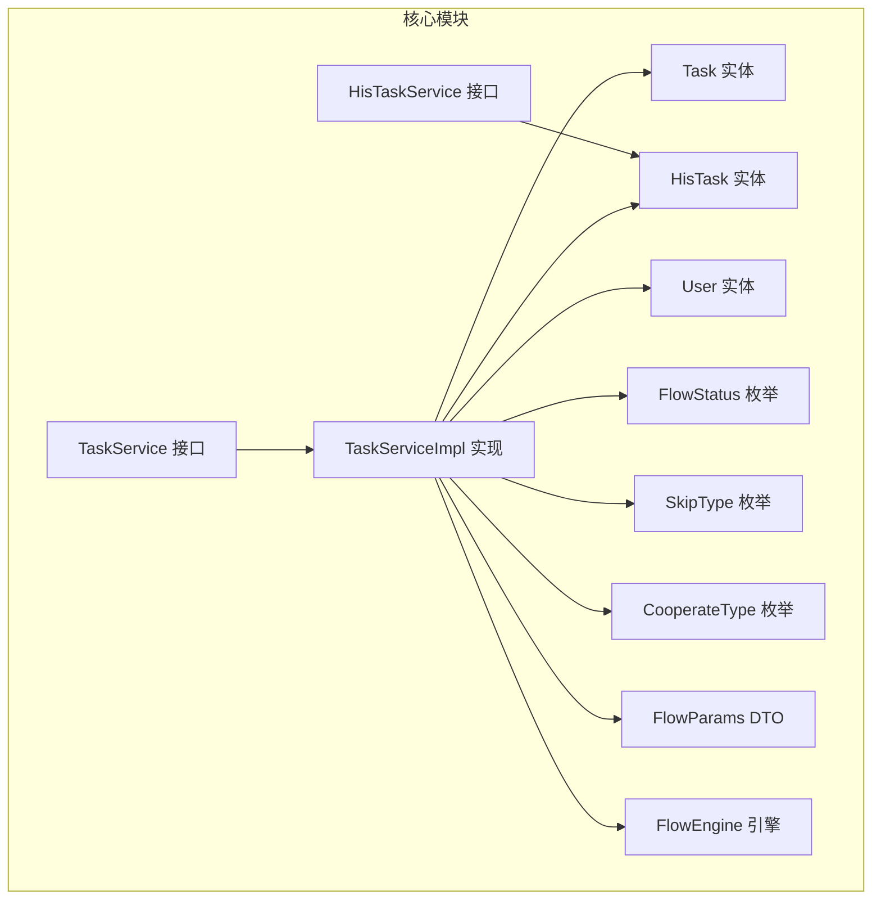
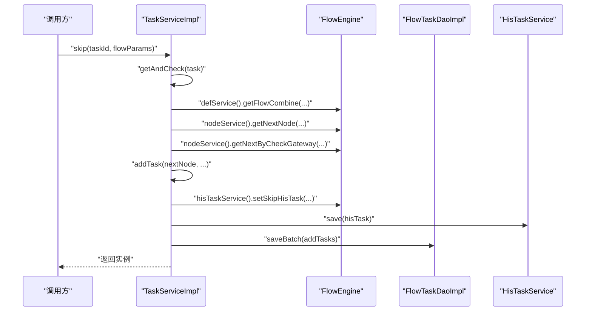
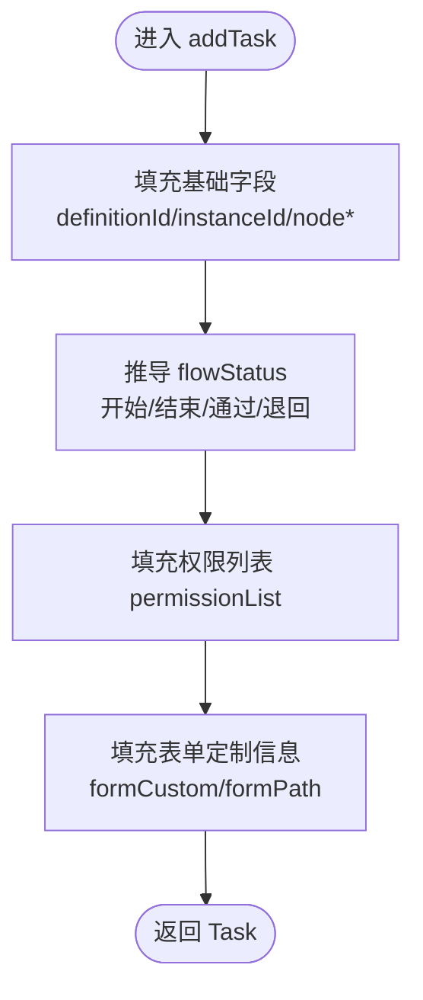
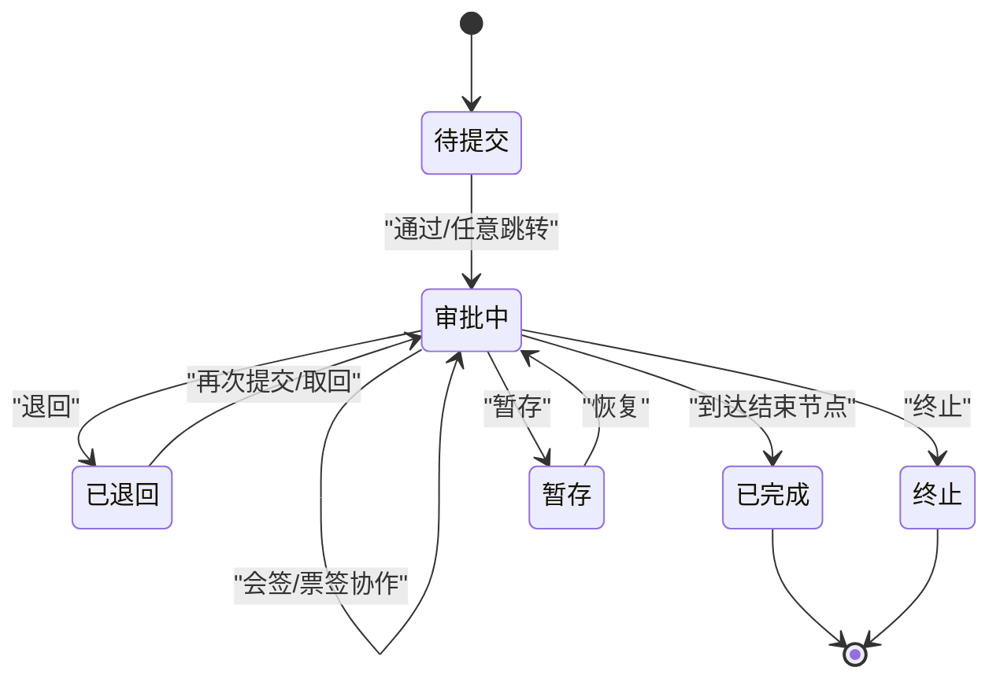
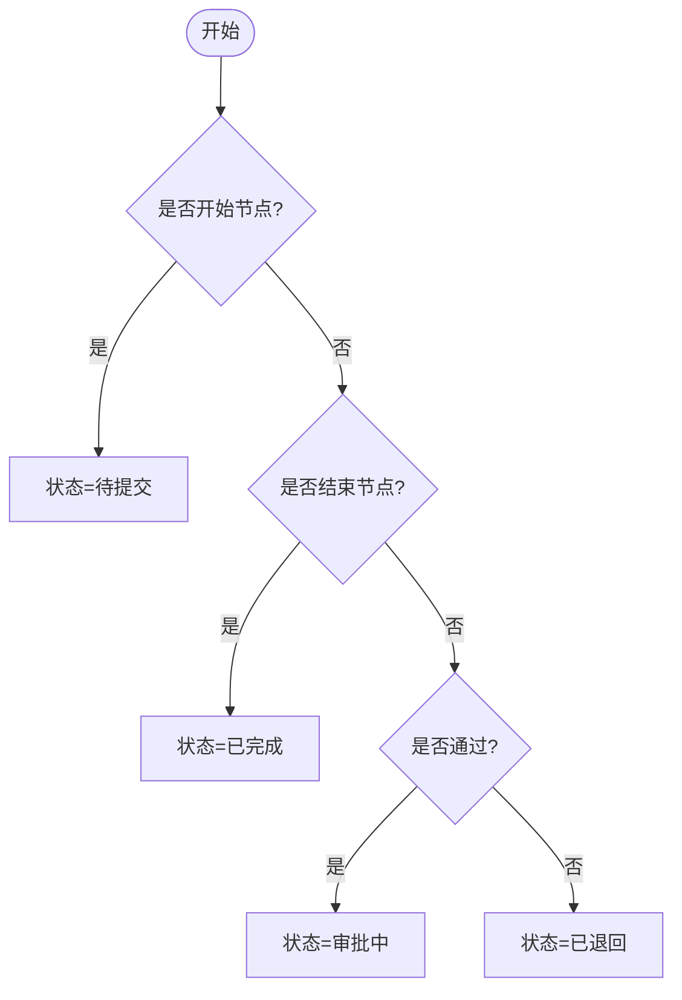
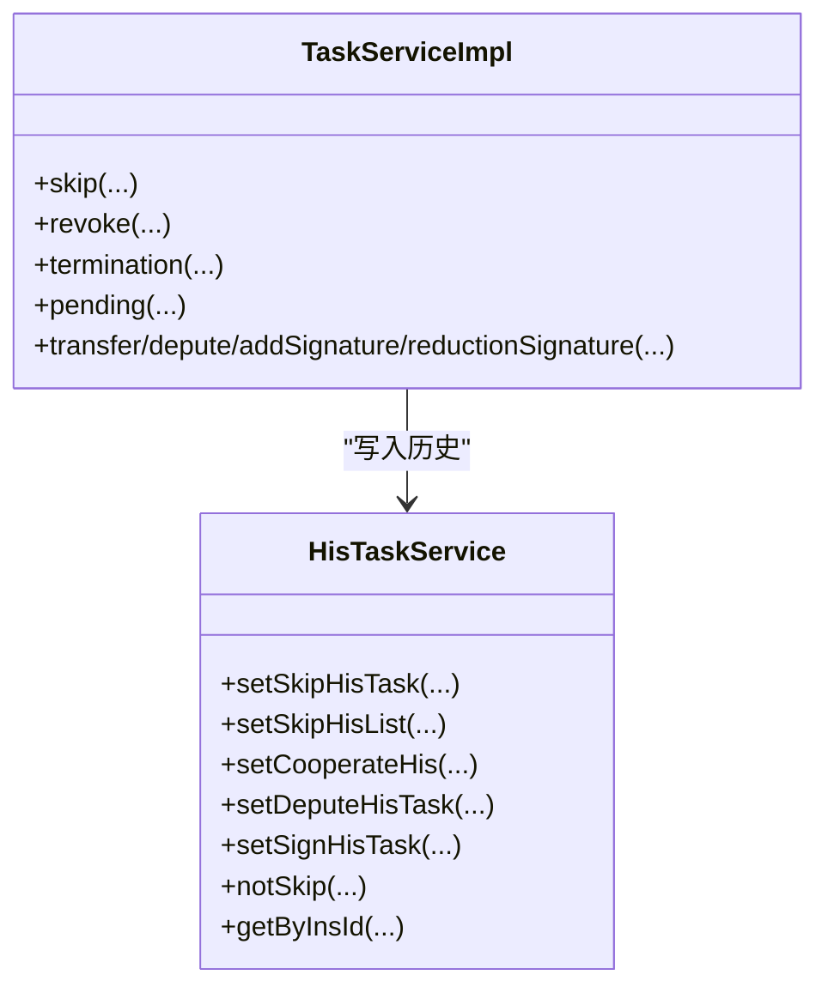
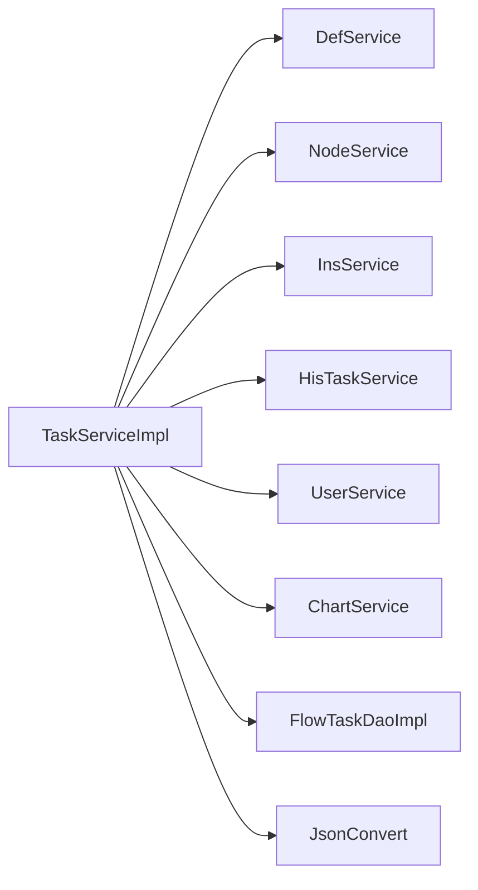

# 任务管理

<cite>
**本文引用的文件**
- [Task.java](file://warm-flow-core/src/main/java/org/dromara/warm/flow/core/entity/Task.java)
- [HisTask.java](file://warm-flow-core/src/main/java/org/dromara/warm/flow/core/entity/HisTask.java)
- [TaskService.java](file://warm-flow-core/src/main/java/org/dromara/warm/flow/core/service/TaskService.java)
- [TaskServiceImpl.java](file://warm-flow-core/src/main/java/org/dromara/warm/flow/core/service/impl/TaskServiceImpl.java)
- [HisTaskService.java](file://warm-flow-core/src/main/java/org/dromara/warm/flow/core/service/HisTaskService.java)
- [FlowStatus.java](file://warm-flow-core/src/main/java/org/dromara/warm/flow/core/enums/FlowStatus.java)
- [SkipType.java](file://warm-flow-core/src/main/java/org/dromara/warm/flow/core/enums/SkipType.java)
- [CooperateType.java](file://warm-flow-core/src/main/java/org/dromara/warm/flow/core/enums/CooperateType.java)
- [FlowParams.java](file://warm-flow-core/src/main/java/org/dromara/warm/flow/core/dto/FlowParams.java)
- [User.java](file://warm-flow-core/src/main/java/org/dromara/warm/flow/core/entity/User.java)
- [FlowEngine.java](file://warm-flow-core/src/main/java/org/dromara/warm/flow/core/FlowEngine.java)
- [FlowTaskDaoImpl.java](file://warm-flow-orm/warm-flow-easy-query/warm-flow-easy-query-core/src/main/java/org/dromara/warm/flow/orm/dao/FlowTaskDaoImpl.java)
</cite>

## 目录
1. [简介](#简介)
2. [项目结构](#项目结构)
3. [核心组件](#核心组件)
4. [架构总览](#架构总览)
5. [详细组件分析](#详细组件分析)
6. [依赖分析](#依赖分析)
7. [性能考量](#性能考量)
8. [故障排查指南](#故障排查指南)
9. [结论](#结论)
10. [附录](#附录)

## 简介
本文件面向“任务管理”子系统，围绕待办任务的创建与生命周期管理进行深入解析，涵盖任务分配规则、参与者选择、任务优先级设置、状态管理、历史任务记录与查询、高级查询与筛选排序、处理最佳实践与性能优化建议。目标是帮助开发者与使用者全面掌握任务流转机制与扩展点。

## 项目结构
任务管理位于 warm-flow-core 模块，采用“接口 + 实现 + DTO/枚举”的清晰分层：
- 接口层：TaskService、HisTaskService 定义对外能力
- 实现层：TaskServiceImpl 负责任务流转、状态变更、协作处理、历史归档
- 实体层：Task、HisTask、User 描述待办、历史与用户权限
- 枚举层：FlowStatus、SkipType、CooperateType 描述状态与协作类型
- DTO 层：FlowParams 封装流程参数与上下文
- 引擎入口：FlowEngine 提供服务获取与工厂方法

图表来源
- [TaskService.java:36-534](file://warm-flow-core/src/main/java/org/dromara/warm/flow/core/service/TaskService.java#L36-L534)
- [TaskServiceImpl.java:44-1043](file://warm-flow-core/src/main/java/org/dromara/warm/flow/core/service/impl/TaskServiceImpl.java#L44-L1043)
- [HisTaskService.java:33-140](file://warm-flow-core/src/main/java/org/dromara/warm/flow/core/service/HisTaskService.java#L33-L140)
- [Task.java:27-136](file://warm-flow-core/src/main/java/org/dromara/warm/flow/core/entity/Task.java#L27-L136)
- [HisTask.java:30-164](file://warm-flow-core/src/main/java/org/dromara/warm/flow/core/entity/HisTask.java#L30-L164)
- [User.java:26-95](file://warm-flow-core/src/main/java/org/dromara/warm/flow/core/entity/User.java#L26-L95)
- [FlowStatus.java:30-103](file://warm-flow-core/src/main/java/org/dromara/warm/flow/core/enums/FlowStatus.java#L30-L103)
- [SkipType.java:30-101](file://warm-flow-core/src/main/java/org/dromara/warm/flow/core/enums/SkipType.java#L30-L101)
- [CooperateType.java:39-197](file://warm-flow-core/src/main/java/org/dromara/warm/flow/core/enums/CooperateType.java#L39-L197)
- [FlowParams.java:33-336](file://warm-flow-core/src/main/java/org/dromara/warm/flow/core/dto/FlowParams.java#L33-L336)
- [FlowEngine.java:109-163](file://warm-flow-core/src/main/java/org/dromara/warm/flow/core/FlowEngine.java#L109-L163)

章节来源
- [TaskService.java:36-534](file://warm-flow-core/src/main/java/org/dromara/warm/flow/core/service/TaskService.java#L36-L534)
- [TaskServiceImpl.java:44-1043](file://warm-flow-core/src/main/java/org/dromara/warm/flow/core/service/impl/TaskServiceImpl.java#L44-L1043)
- [HisTaskService.java:33-140](file://warm-flow-core/src/main/java/org/dromara/warm/flow/core/service/HisTaskService.java#L33-L140)
- [FlowEngine.java:109-163](file://warm-flow-core/src/main/java/org/dromara/warm/flow/core/FlowEngine.java#L109-L163)

## 核心组件
- 任务实体 Task：承载待办任务的关键属性（流程定义ID、实例ID、节点编码/名称/类型、流程状态、权限列表、用户列表、表单定制信息等）
- 历史任务实体 HisTask：记录任务流转历史（节点、目标节点、审批人、协作类型、跳转类型、流程状态、变量、扩展字段等）
- 任务服务 TaskService/TaskServiceImpl：提供审批通过/退回、任意跳转、撤销、终止、暂存、转办/委派/加签/减签、协作处理、状态设置、历史归档等能力
- 历史任务服务 HisTaskService：提供历史查询、协作历史、委派历史、会/票签历史、跳转历史等构建与持久化
- 参数 DTO FlowParams：封装 handler、permissionFlag、skipType、message、variable、flowStatus、hisStatus、协作类型、下个处理人等
- 枚举 FlowStatus/SkipType/CooperateType：统一状态与动作语义
- 用户实体 User：记录任务关联的处理人、转办人、委托人等

章节来源
- [Task.java:27-136](file://warm-flow-core/src/main/java/org/dromara/warm/flow/core/entity/Task.java#L27-L136)
- [HisTask.java:30-164](file://warm-flow-core/src/main/java/org/dromara/warm/flow/core/entity/HisTask.java#L30-L164)
- [TaskService.java:36-534](file://warm-flow-core/src/main/java/org/dromara/warm/flow/core/service/TaskService.java#L36-L534)
- [TaskServiceImpl.java:44-1043](file://warm-flow-core/src/main/java/org/dromara/warm/flow/core/service/impl/TaskServiceImpl.java#L44-L1043)
- [HisTaskService.java:33-140](file://warm-flow-core/src/main/java/org/dromara/warm/flow/core/service/HisTaskService.java#L33-L140)
- [FlowParams.java:33-336](file://warm-flow-core/src/main/java/org/dromara/warm/flow/core/dto/FlowParams.java#L33-L336)
- [FlowStatus.java:30-103](file://warm-flow-core/src/main/java/org/dromara/warm/flow/core/enums/FlowStatus.java#L30-L103)
- [SkipType.java:30-101](file://warm-flow-core/src/main/java/org/dromara/warm/flow/core/enums/SkipType.java#L30-L101)
- [CooperateType.java:39-197](file://warm-flow-core/src/main/java/org/dromara/warm/flow/core/enums/CooperateType.java#L39-L197)
- [User.java:26-95](file://warm-flow-core/src/main/java/org/dromara/warm/flow/core/entity/User.java#L26-L95)

## 架构总览
任务管理以 TaskServiceImpl 为核心，围绕 FlowEngine 的各服务协作完成任务创建、流转、状态变更与历史归档。关键路径包括：
- 任务创建：根据下一节点生成待办任务，填充权限列表与表单定制信息
- 权限与协作：校验当前处理人权限，支持或签、会签、票签、转办、委派、加签/减签
- 状态管理：依据节点类型与跳转类型推导流程状态，更新实例与待办任务状态
- 历史记录：每次流转、协作、暂存、终止均写入 HisTask，便于审计与统计

图表来源
- [TaskServiceImpl.java:166-235](file://warm-flow-core/src/main/java/org/dromara/warm/flow/core/service/impl/TaskServiceImpl.java#L166-L235)
- [FlowTaskDaoImpl.java:33-63](file://warm-flow-orm/warm-flow-easy-query/warm-flow-easy-query-core/src/main/java/org/dromara/warm/flow/orm/dao/FlowTaskDaoImpl.java#L33-L63)
- [HisTaskService.java:129-139](file://warm-flow-core/src/main/java/org/dromara/warm/flow/core/service/HisTaskService.java#L129-L139)

## 详细组件分析

### 任务创建机制与参与者选择
- 创建规则
  - 根据下一节点生成待办任务，填充 definitionId、instanceId、nodeCode/name/type、flowStatus（基于节点类型与跳转类型推导）、权限列表、表单定制信息
  - 若节点配置了自定义表单，则优先使用节点级定制，否则回退到流程定义级定制
- 参与者选择
  - 通过 FlowParams 的 handler 与 permissionFlag 进行权限校验
  - 支持通过 PermissionHandler 自动注入 handler 与权限标识
  - 协作处理时，动态维护 User 表中与任务关联的处理人、转办人、委托人

图表来源
- [TaskServiceImpl.java:532-554](file://warm-flow-core/src/main/java/org/dromara/warm/flow/core/service/impl/TaskServiceImpl.java#L532-L554)
- [FlowParams.java:266-290](file://warm-flow-core/src/main/java/org/dromara/warm/flow/core/dto/FlowParams.java#L266-L290)

章节来源
- [TaskServiceImpl.java:532-554](file://warm-flow-core/src/main/java/org/dromara/warm/flow/core/service/impl/TaskServiceImpl.java#L532-L554)
- [FlowParams.java:266-290](file://warm-flow-core/src/main/java/org/dromara/warm/flow/core/dto/FlowParams.java#L266-L290)

### 任务生命周期管理
- 生命周期阶段
  - 创建：生成待办任务，写入权限与表单定制
  - 分配：根据节点规则与权限标识分配处理人
  - 处理：通过/退回/暂存/任意跳转
  - 完成：推进到下一节点或结束节点
  - 撤销/终止：撤销流程或提前终止，将待办转历史
  - 转办/委派/加签/减签：中途变更处理人
- 关键流程
  - 通过/退回：计算下一节点，生成新待办，写入历史，更新实例状态
  - 任意跳转：支持指定 nodeCode，严格限制“后置节点”禁止退回
  - 撤销：仅允许发起人撤销，回退到开始节点，重建待办
  - 终止：提前结束，所有待办转历史，实例状态置为终止
  - 暂存：仅更新状态与历史，不推进流程

图表来源
- [FlowStatus.java:34-60](file://warm-flow-core/src/main/java/org/dromara/warm/flow/core/enums/FlowStatus.java#L34-L60)
- [TaskServiceImpl.java:238-313](file://warm-flow-core/src/main/java/org/dromara/warm/flow/core/service/impl/TaskServiceImpl.java#L238-L313)
- [TaskServiceImpl.java:326-375](file://warm-flow-core/src/main/java/org/dromara/warm/flow/core/service/impl/TaskServiceImpl.java#L326-L375)
- [TaskServiceImpl.java:494-529](file://warm-flow-core/src/main/java/org/dromara/warm/flow/core/service/impl/TaskServiceImpl.java#L494-L529)

章节来源
- [TaskService.java:38-534](file://warm-flow-core/src/main/java/org/dromara/warm/flow/core/service/TaskService.java#L38-L534)
- [TaskServiceImpl.java:52-375](file://warm-flow-core/src/main/java/org/dromara/warm/flow/core/service/impl/TaskServiceImpl.java#L52-L375)
- [FlowStatus.java:34-60](file://warm-flow-core/src/main/java/org/dromara/warm/flow/core/enums/FlowStatus.java#L34-L60)

### 任务状态管理
- 状态推导
  - 开始节点：待提交
  - 结束节点：已完成
  - 通过：审批中 → 已完成
  - 退回：审批中 → 已退回
  - 其他：审批中
- 状态持久化
  - 实例状态：随流程推进更新
  - 历史状态：HisTask 中记录 hisStatus（可自定义）

图表来源
- [TaskServiceImpl.java:640-651](file://warm-flow-core/src/main/java/org/dromara/warm/flow/core/service/impl/TaskServiceImpl.java#L640-L651)
- [FlowStatus.java:34-60](file://warm-flow-core/src/main/java/org/dromara/warm/flow/core/enums/FlowStatus.java#L34-L60)

章节来源
- [TaskServiceImpl.java:640-651](file://warm-flow-core/src/main/java/org/dromara/warm/flow/core/service/impl/TaskServiceImpl.java#L640-L651)
- [FlowStatus.java:34-60](file://warm-flow-core/src/main/java/org/dromara/warm/flow/core/enums/FlowStatus.java#L34-L60)

### 历史任务记录与管理
- 记录内容
  - 节点信息：nodeCode/nodeName/nodeType、targetNodeCode/targetNodeName
  - 审批信息：approver、collaborator、skipType、message
  - 状态与变量：flowStatus、variable、ext、hisTaskExt
  - 协作类型：cooperateType（转办/委派/加签/减签）
- 写入时机
  - 流转跳转：setSkipHisTask/setSkipHisList
  - 协作处理：setCooperateHis（转办/委派/加签/减签）
  - 委派处理：setDeputeHisTask（受托人处理后回写委托人）
  - 会/票签：setSignHisTask（记录通过/驳回历史）
  - 暂存：notSkip（仅状态变更，不推进流程）
  - 终止/撤销：setSkipInsHis（批量历史）
- 查询与统计
  - 按实例ID查询：getByInsId
  - 按任务ID查询：listByTaskId
  - 按任务ID+协作类型：listByTaskIdAndCooperateTypes
  - 按实例ID+节点编码集合：getByInsAndNodeCodes

图表来源
- [TaskServiceImpl.java:166-313](file://warm-flow-core/src/main/java/org/dromara/warm/flow/core/service/impl/TaskServiceImpl.java#L166-L313)
- [HisTaskService.java:69-139](file://warm-flow-core/src/main/java/org/dromara/warm/flow/core/service/HisTaskService.java#L69-L139)

章节来源
- [HisTaskService.java:33-140](file://warm-flow-core/src/main/java/org/dromara/warm/flow/core/service/HisTaskService.java#L33-L140)
- [TaskServiceImpl.java:166-313](file://warm-flow-core/src/main/java/org/dromara/warm/flow/core/service/impl/TaskServiceImpl.java#L166-L313)

### 任务查询、筛选、排序与高级功能
- 查询能力
  - 按实例ID获取待办任务集合：getByInsId
  - 按实例ID+节点编码集合过滤：getByInsIdAndNodeCodes
  - 按任务ID查询历史：listByTaskId
  - 按任务ID+协作类型集合过滤：listByTaskIdAndCooperateTypes
  - 按实例ID+节点编码集合查询历史：getByInsAndNodeCodes
- 筛选与排序
  - 通过 FlowTaskDaoImpl 的查询条件组合（实例ID、节点编码集合）实现高效筛选
  - 建议在业务层结合 FlowParams.variable 与节点表达式进行动态筛选
- 高级功能
  - 任意跳转：rejectAtWill/passAtWill（严格限制“后置节点”禁止退回）
  - 任意退回：rejectLast（基于历史任务定位上一节点）
  - 拿回：taskBack（从最近已办历史中定位并回退）
  - 自定义状态：flowStatus/hisStatus 可在参数中指定

章节来源
- [TaskServiceImpl.java:557-564](file://warm-flow-core/src/main/java/org/dromara/warm/flow/core/service/impl/TaskServiceImpl.java#L557-L564)
- [FlowTaskDaoImpl.java:57-63](file://warm-flow-orm/warm-flow-easy-query/warm-flow-easy-query-core/src/main/java/org/dromara/warm/flow/orm/dao/FlowTaskDaoImpl.java#L57-L63)
- [TaskService.java:180-264](file://warm-flow-core/src/main/java/org/dromara/warm/flow/core/service/TaskService.java#L180-L264)

### 任务处理最佳实践
- 权限与安全
  - 明确节点权限标识 permissionFlag，避免越权处理
  - 使用 PermissionHandler 注入 handler 与权限标识，减少重复校验
- 协作处理
  - 会签/票签：合理设置 nodeRatio（通过率/固定人数/表达式），确保流程可控
  - 委派：受托人处理后自动回写委托人，避免重复审批
  - 转办/加签/减签：严格校验 addHandlers/reductionHandlers，避免重复与遗漏
- 状态一致性
  - 通过/退回/暂存等操作务必写入历史，保证审计链完整
  - 终止/撤销时清理待办与处理人，避免脏数据
- 并发与一致性
  - 注意并发场景下的待办与实例同步问题，必要时引入锁策略（注释中已提示）

章节来源
- [TaskServiceImpl.java:166-235](file://warm-flow-core/src/main/java/org/dromara/warm/flow/core/service/impl/TaskServiceImpl.java#L166-L235)
- [TaskServiceImpl.java:388-491](file://warm-flow-core/src/main/java/org/dromara/warm/flow/core/service/impl/TaskServiceImpl.java#L388-L491)

## 依赖分析
- 组件耦合
  - TaskServiceImpl 对 FlowEngine 的多服务强依赖（def、node、ins、hisTask、user、chart、dataFillHandler 等）
  - HisTaskService 与 TaskServiceImpl 双向协作，前者负责历史持久化，后者负责业务流程推进
- 外部依赖
  - ORM 层通过 FlowTaskDaoImpl 提供按实例ID与节点编码集合的查询能力
  - JSON 序列化通过 FlowEngine.jsonConvert 统一封装

图表来源
- [TaskServiceImpl.java:166-235](file://warm-flow-core/src/main/java/org/dromara/warm/flow/core/service/impl/TaskServiceImpl.java#L166-L235)
- [FlowTaskDaoImpl.java:33-63](file://warm-flow-orm/warm-flow-easy-query/warm-flow-easy-query-core/src/main/java/org/dromara/warm/flow/orm/dao/FlowTaskDaoImpl.java#L33-L63)
- [FlowEngine.java:109-163](file://warm-flow-core/src/main/java/org/dromara/warm/flow/core/FlowEngine.java#L109-L163)

章节来源
- [TaskServiceImpl.java:166-235](file://warm-flow-core/src/main/java/org/dromara/warm/flow/core/service/impl/TaskServiceImpl.java#L166-L235)
- [FlowTaskDaoImpl.java:33-63](file://warm-flow-orm/warm-flow-easy-query/warm-flow-easy-query-core/src/main/java/org/dromara/warm/flow/orm/dao/FlowTaskDaoImpl.java#L33-L63)

## 性能考量
- 查询优化
  - 使用 FlowTaskDaoImpl 的组合条件（instanceId + nodeCode in 集合）进行批量筛选
  - 历史查询建议按实例ID分页或限制时间范围
- 写入优化
  - 批量保存 addTasks 与历史记录，减少事务次数
  - 协作处理时尽量合并删除/新增操作
- 并发控制
  - 注释中已提示并发问题（待办与实例不同步），建议对 taskId 加锁或采用分布式锁策略
- 变量处理
  - 变量合并与序列化应避免大对象频繁序列化，建议按需传递

[本节为通用指导，无需列出具体文件来源]

## 故障排查指南
- 常见异常与定位
  - 未找到任务/实例：检查 taskId/instanceId 与权限标识
  - 权限不足：确认 permissionFlag 与 handler 是否正确注入
  - 退回方向错误：任意退回不允许选择后置节点
  - 协作冲突：转办/委派/加签/减签对象重复或缺失
- 审计与复盘
  - 通过 HisTaskService 查询历史，核对 skipType、cooperateType、approver、collaborator
  - 使用 getByInsId/getByInsAndNodeCodes 定位特定流程实例与节点的历史
- 操作建议
  - 在关键节点开启监听器（开始/分派/完成/创建），便于追踪流程状态
  - 对高并发场景引入锁或幂等设计，避免重复处理

章节来源
- [TaskServiceImpl.java:118-142](file://warm-flow-core/src/main/java/org/dromara/warm/flow/core/service/impl/TaskServiceImpl.java#L118-L142)
- [TaskServiceImpl.java:388-491](file://warm-flow-core/src/main/java/org/dromara/warm/flow/core/service/impl/TaskServiceImpl.java#L388-L491)
- [HisTaskService.java:137-139](file://warm-flow-core/src/main/java/org/dromara/warm/flow/core/service/HisTaskService.java#L137-L139)

## 结论
任务管理子系统通过清晰的职责划分与完善的流程编排，实现了从任务创建、权限校验、协作处理到历史归档的全生命周期管理。借助 FlowParams 的灵活参数与 FlowEngine 的服务聚合，系统既具备良好的扩展性，又能满足复杂业务场景下的流转需求。建议在生产环境中重点关注权限注入、协作策略与并发控制，以确保流程稳定与数据一致。

[本节为总结性内容，无需列出具体文件来源]

## 附录
- 术语
  - 流程状态：待提交、审批中、审批通过、自动完成、终止、作废、撤销、取回、已完成、已退回、失效、拿回、重启、暂存
  - 审批动作：审批通过、退回、无动作
  - 协作类型：无、转办、委派、会签、票签、加签、减签
- 建议
  - 在节点设计器中合理配置权限标识与协作策略
  - 对关键节点启用监听器，增强可观测性
  - 对高并发场景引入锁或分布式锁，保障一致性

[本节为补充说明，无需列出具体文件来源]