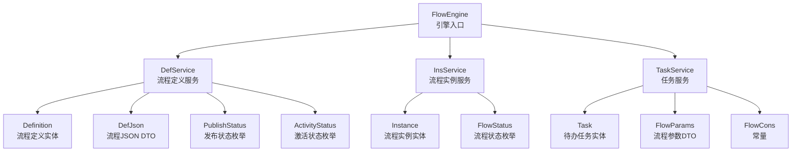
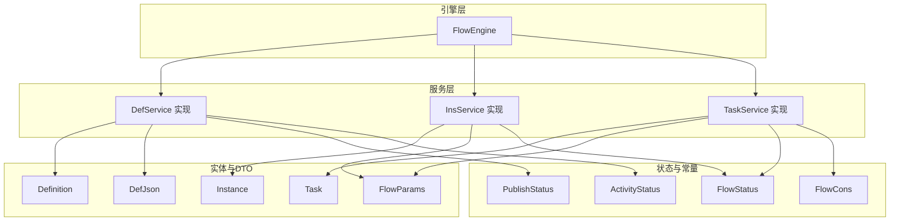
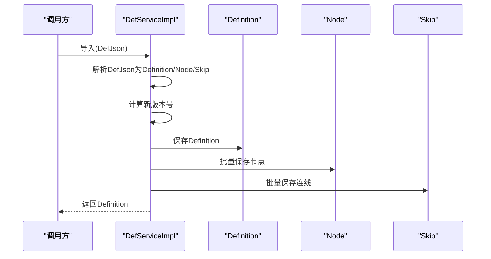
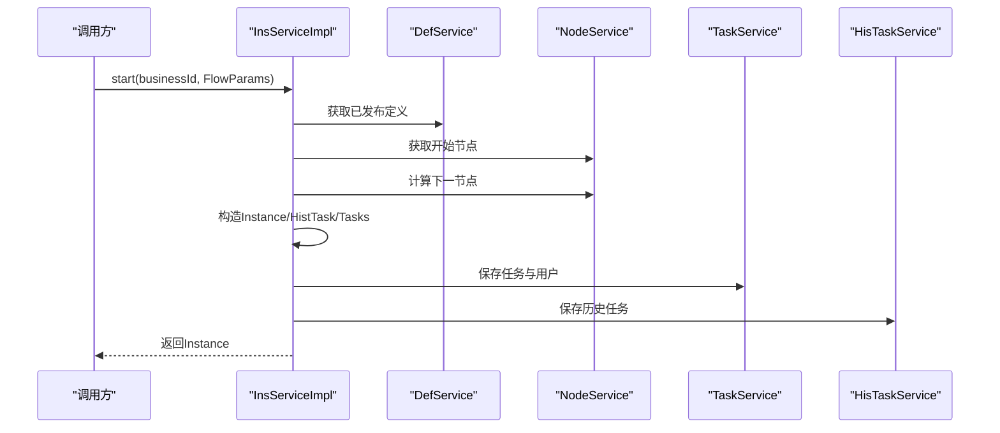
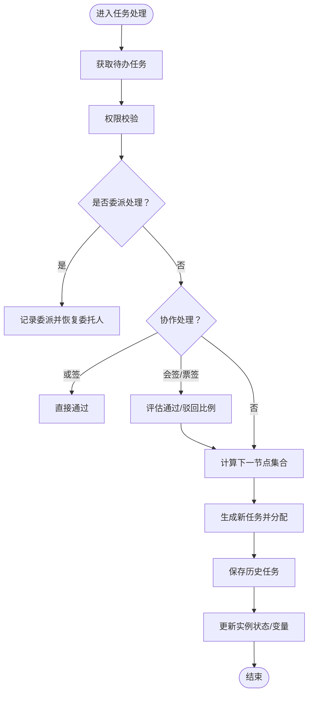
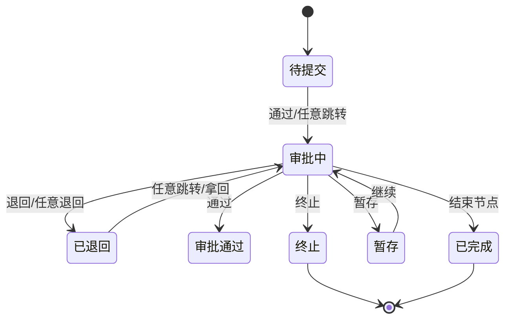
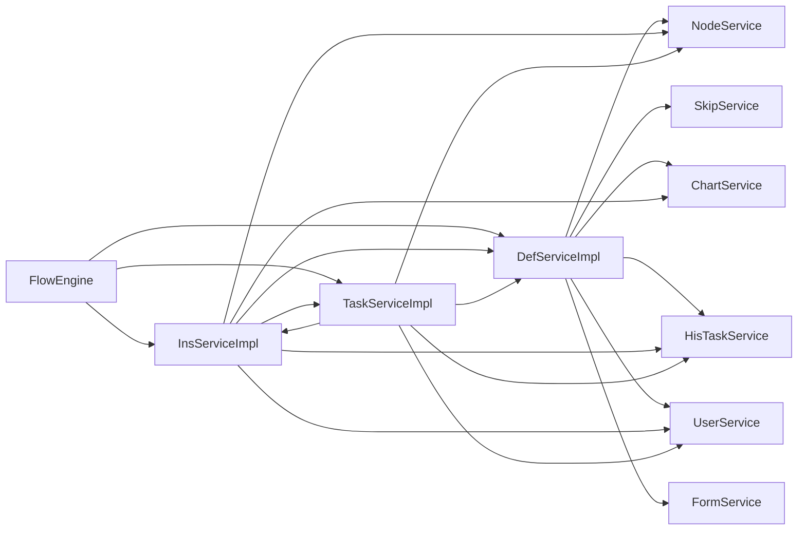

# 工作流管理

<cite>
**本文引用的文件**   
- [FlowEngine.java](file://warm-flow-core/src/main/java/org/dromara/warm/flow/core/FlowEngine.java)
- [DefServiceImpl.java](file://warm-flow-core/src/main/java/org/dromara/warm/flow/core/service/impl/DefServiceImpl.java)
- [DefService.java](file://warm-flow-core/src/main/java/org/dromara/warm/flow/core/service/DefService.java)
- [InsServiceImpl.java](file://warm-flow-core/src/main/java/org/dromara/warm/flow/core/service/impl/InsServiceImpl.java)
- [InsService.java](file://warm-flow-core/src/main/java/org/dromara/warm/flow/core/service/InsService.java)
- [TaskServiceImpl.java](file://warm-flow-core/src/main/java/org/dromara/warm/flow/core/service/impl/TaskServiceImpl.java)
- [TaskService.java](file://warm-flow-core/src/main/java/org/dromara/warm/flow/core/service/TaskService.java)
- [Definition.java](file://warm-flow-core/src/main/java/org/dromara/warm/flow/core/entity/Definition.java)
- [Instance.java](file://warm-flow-core/src/main/java/org/dromara/warm/flow/core/entity/Instance.java)
- [Task.java](file://warm-flow-core/src/main/java/org/dromara/warm/flow/core/entity/Task.java)
- [FlowParams.java](file://warm-flow-core/src/main/java/org/dromara/warm/flow/core/dto/FlowParams.java)
- [DefJson.java](file://warm-flow-core/src/main/java/org/dromara/warm/flow/core/dto/DefJson.java)
- [FlowStatus.java](file://warm-flow-core/src/main/java/org/dromara/warm/flow/core/enums/FlowStatus.java)
- [PublishStatus.java](file://warm-flow-core/src/main/java/org/dromara/warm/flow/core/enums/PublishStatus.java)
- [ActivityStatus.java](file://warm-flow-core/src/main/java/org/dromara/warm/flow/core/enums/ActivityStatus.java)
- [FlowCons.java](file://warm-flow-core/src/main/java/org/dromara/warm/flow/core/constant/FlowCons.java)
</cite>

## 目录
1. [简介](#简介)
2. [项目结构](#项目结构)
3. [核心组件](#核心组件)
4. [架构总览](#架构总览)
5. [详细组件分析](#详细组件分析)
6. [依赖分析](#依赖分析)
7. [性能考量](#性能考量)
8. [故障排查指南](#故障排查指南)
9. [结论](#结论)
10. [附录](#附录)

## 简介
本文件面向“工作流管理”能力，围绕流程定义管理（导入/导出/版本控制/发布管理）、流程执行引擎（实例创建/节点流转/状态管理）、任务管理（创建/分配/完成/撤销）、实例状态管理（生命周期与状态转换规则）以及 API 接口与使用示例展开，帮助开发者与使用者快速理解并高效集成。

## 项目结构
- 核心引擎入口：FlowEngine 提供服务获取、实体构造器注入、处理器初始化等能力
- 服务层：DefService/InsService/TaskService 及其实现类负责流程定义、实例、任务的业务编排
- 实体层：Definition/Instance/Task 等核心实体抽象
- DTO/枚举/常量：FlowParams/DefJson/FlowStatus/PublishStatus/ActivityStatus/FlowCons
- 执行链路：流程启动 → 节点计算 → 任务生成/历史归档 → 状态更新 → 监听器回调

图表来源
- [FlowEngine.java:39-270](file://warm-flow-core/src/main/java/org/dromara/warm/flow/core/FlowEngine.java#L39-L270)
- [DefService.java:34-210](file://warm-flow-core/src/main/java/org/dromara/warm/flow/core/service/DefService.java#L34-L210)
- [InsService.java:30-94](file://warm-flow-core/src/main/java/org/dromara/warm/flow/core/service/InsService.java#L30-L94)
- [TaskService.java:36-534](file://warm-flow-core/src/main/java/org/dromara/warm/flow/core/service/TaskService.java#L36-L534)
- [Definition.java:29-196](file://warm-flow-core/src/main/java/org/dromara/warm/flow/core/entity/Definition.java#L29-L196)
- [Instance.java:29-166](file://warm-flow-core/src/main/java/org/dromara/warm/flow/core/entity/Instance.java#L29-L166)
- [Task.java:27-136](file://warm-flow-core/src/main/java/org/dromara/warm/flow/core/entity/Task.java#L27-L136)
- [FlowParams.java:33-336](file://warm-flow-core/src/main/java/org/dromara/warm/flow/core/dto/FlowParams.java#L33-L336)
- [DefJson.java:44-292](file://warm-flow-core/src/main/java/org/dromara/warm/flow/core/dto/DefJson.java#L44-L292)
- [FlowStatus.java:30-103](file://warm-flow-core/src/main/java/org/dromara/warm/flow/core/enums/FlowStatus.java#L30-L103)
- [PublishStatus.java:29-71](file://warm-flow-core/src/main/java/org/dromara/warm/flow/core/enums/PublishStatus.java#L29-L71)
- [ActivityStatus.java:30-56](file://warm-flow-core/src/main/java/org/dromara/warm/flow/core/enums/ActivityStatus.java#L30-L56)
- [FlowCons.java:25-85](file://warm-flow-core/src/main/java/org/dromara/warm/flow/core/constant/FlowCons.java#L25-L85)

章节来源
- [FlowEngine.java:39-270](file://warm-flow-core/src/main/java/org/dromara/warm/flow/core/FlowEngine.java#L39-L270)
- [DefService.java:34-210](file://warm-flow-core/src/main/java/org/dromara/warm/flow/core/service/DefService.java#L34-L210)
- [InsService.java:30-94](file://warm-flow-core/src/main/java/org/dromara/warm/flow/core/service/InsService.java#L30-L94)
- [TaskService.java:36-534](file://warm-flow-core/src/main/java/org/dromara/warm/flow/core/service/TaskService.java#L36-L534)

## 核心组件
- 流程引擎入口：统一获取服务、实体构造器、处理器初始化
- 流程定义服务：导入/导出/版本控制/发布管理/复制/激活/挂起
- 流程实例服务：启动流程、删除实例、激活/挂起、变量维护
- 任务服务：通过/退回/任意跳转/撤销/终止/转办/委派/加签/减签/暂存等
- 实体与DTO：Definition/Instance/Task/DefJson/FlowParams
- 状态与常量：FlowStatus/PublishStatus/ActivityStatus/FlowCons

章节来源
- [FlowEngine.java:39-270](file://warm-flow-core/src/main/java/org/dromara/warm/flow/core/FlowEngine.java#L39-L270)
- [DefServiceImpl.java:54-374](file://warm-flow-core/src/main/java/org/dromara/warm/flow/core/service/impl/DefServiceImpl.java#L54-L374)
- [InsServiceImpl.java:46-245](file://warm-flow-core/src/main/java/org/dromara/warm/flow/core/service/impl/InsServiceImpl.java#L46-L245)
- [TaskServiceImpl.java:44-1043](file://warm-flow-core/src/main/java/org/dromara/warm/flow/core/service/impl/TaskServiceImpl.java#L44-L1043)
- [Definition.java:29-196](file://warm-flow-core/src/main/java/org/dromara/warm/flow/core/entity/Definition.java#L29-L196)
- [Instance.java:29-166](file://warm-flow-core/src/main/java/org/dromara/warm/flow/core/entity/Instance.java#L29-L166)
- [Task.java:27-136](file://warm-flow-core/src/main/java/org/dromara/warm/flow/core/entity/Task.java#L27-L136)
- [DefJson.java:44-292](file://warm-flow-core/src/main/java/org/dromara/warm/flow/core/dto/DefJson.java#L44-L292)
- [FlowParams.java:33-336](file://warm-flow-core/src/main/java/org/dromara/warm/flow/core/dto/FlowParams.java#L33-L336)
- [FlowStatus.java:30-103](file://warm-flow-core/src/main/java/org/dromara/warm/flow/core/enums/FlowStatus.java#L30-L103)
- [PublishStatus.java:29-71](file://warm-flow-core/src/main/java/org/dromara/warm/flow/core/enums/PublishStatus.java#L29-L71)
- [ActivityStatus.java:30-56](file://warm-flow-core/src/main/java/org/dromara/warm/flow/core/enums/ActivityStatus.java#L30-L56)
- [FlowCons.java:25-85](file://warm-flow-core/src/main/java/org/dromara/warm/flow/core/constant/FlowCons.java#L25-L85)

## 架构总览
工作流管理采用“引擎 + 服务 + 实体 + DTO + 枚举”的分层架构：
- 引擎层：FlowEngine 提供统一的服务与实体工厂、处理器装配
- 业务层：DefService/InsService/TaskService 封装流程定义、实例、任务的复杂业务
- 数据层：Definition/Instance/Task 等实体承载数据结构；DefJson/FlowParams 作为跨层数据载体
- 状态层：FlowStatus/PublishStatus/ActivityStatus 管理状态机
- 常量层：FlowCons 提供通用常量与正则、标识符等

图表来源
- [FlowEngine.java:39-270](file://warm-flow-core/src/main/java/org/dromara/warm/flow/core/FlowEngine.java#L39-L270)
- [DefServiceImpl.java:54-374](file://warm-flow-core/src/main/java/org/dromara/warm/flow/core/service/impl/DefServiceImpl.java#L54-L374)
- [InsServiceImpl.java:46-245](file://warm-flow-core/src/main/java/org/dromara/warm/flow/core/service/impl/InsServiceImpl.java#L46-L245)
- [TaskServiceImpl.java:44-1043](file://warm-flow-core/src/main/java/org/dromara/warm/flow/core/service/impl/TaskServiceImpl.java#L44-L1043)
- [Definition.java:29-196](file://warm-flow-core/src/main/java/org/dromara/warm/flow/core/entity/Definition.java#L29-L196)
- [Instance.java:29-166](file://warm-flow-core/src/main/java/org/dromara/warm/flow/core/entity/Instance.java#L29-L166)
- [Task.java:27-136](file://warm-flow-core/src/main/java/org/dromara/warm/flow/core/entity/Task.java#L27-L136)
- [DefJson.java:44-292](file://warm-flow-core/src/main/java/org/dromara/warm/flow/core/dto/DefJson.java#L44-L292)
- [FlowParams.java:33-336](file://warm-flow-core/src/main/java/org/dromara/warm/flow/core/dto/FlowParams.java#L33-L336)
- [FlowStatus.java:30-103](file://warm-flow-core/src/main/java/org/dromara/warm/flow/core/enums/FlowStatus.java#L30-L103)
- [PublishStatus.java:29-71](file://warm-flow-core/src/main/java/org/dromara/warm/flow/core/enums/PublishStatus.java#L29-L71)
- [ActivityStatus.java:30-56](file://warm-flow-core/src/main/java/org/dromara/warm/flow/core/enums/ActivityStatus.java#L30-L56)
- [FlowCons.java:25-85](file://warm-flow-core/src/main/java/org/dromara/warm/flow/core/constant/FlowCons.java#L25-L85)

## 详细组件分析

### 流程定义管理（导入/导出/版本控制/发布）
- 导入：支持 InputStream/JSON 字符串/DefJson 对象三种导入方式，内部解析为 Definition/Node/Skip 并入库
- 导出：根据定义 ID 查询完整数据（含节点与连线），序列化为 DefJson 字符串
- 版本控制：基于流程编码生成新版本号，兼容数字与时间戳混合策略
- 发布管理：发布时处理“已发布已使用/未使用”与“已失效/未发布”的状态迁移；取消发布需校验是否存在运行中实例
- 复制/激活/挂起：复制定义并生成新版本；对定义的激活状态进行切换

图表来源
- [DefServiceImpl.java:84-100](file://warm-flow-core/src/main/java/org/dromara/warm/flow/core/service/impl/DefServiceImpl.java#L84-L100)
- [DefJson.java:215-271](file://warm-flow-core/src/main/java/org/dromara/warm/flow/core/dto/DefJson.java#L215-L271)

章节来源
- [DefServiceImpl.java:64-100](file://warm-flow-core/src/main/java/org/dromara/warm/flow/core/service/impl/DefServiceImpl.java#L64-L100)
- [DefServiceImpl.java:151-154](file://warm-flow-core/src/main/java/org/dromara/warm/flow/core/service/impl/DefServiceImpl.java#L151-L154)
- [DefServiceImpl.java:220-253](file://warm-flow-core/src/main/java/org/dromara/warm/flow/core/service/impl/DefServiceImpl.java#L220-L253)
- [DefServiceImpl.java:255-262](file://warm-flow-core/src/main/java/org/dromara/warm/flow/core/service/impl/DefServiceImpl.java#L255-L262)
- [DefServiceImpl.java:265-280](file://warm-flow-core/src/main/java/org/dromara/warm/flow/core/service/impl/DefServiceImpl.java#L265-L280)
- [DefServiceImpl.java:283-298](file://warm-flow-core/src/main/java/org/dromara/warm/flow/core/service/impl/DefServiceImpl.java#L283-L298)
- [DefService.java:36-210](file://warm-flow-core/src/main/java/org/dromara/warm/flow/core/service/DefService.java#L36-L210)
- [DefJson.java:158-213](file://warm-flow-core/src/main/java/org/dromara/warm/flow/core/dto/DefJson.java#L158-L213)

### 流程执行引擎（实例创建/节点流转/状态管理）
- 启动流程：根据流程编码获取已发布定义，定位开始节点，计算下一节点，创建实例、历史任务与待办任务，执行监听器
- 节点流转：支持通过/退回/任意跳转/驳回上一任务/拿回最近已办/撤销/终止/暂存等
- 状态管理：依据节点类型与跳转类型设置流程状态，支持自定义状态；实例与任务均维护状态与变量

图表来源
- [InsServiceImpl.java:55-111](file://warm-flow-core/src/main/java/org/dromara/warm/flow/core/service/impl/InsServiceImpl.java#L55-L111)

章节来源
- [InsServiceImpl.java:55-111](file://warm-flow-core/src/main/java/org/dromara/warm/flow/core/service/impl/InsServiceImpl.java#L55-L111)
- [InsService.java:32-46](file://warm-flow-core/src/main/java/org/dromara/warm/flow/core/service/InsService.java#L32-L46)
- [TaskServiceImpl.java:97-235](file://warm-flow-core/src/main/java/org/dromara/warm/flow/core/service/impl/TaskServiceImpl.java#L97-L235)
- [TaskServiceImpl.java:238-313](file://warm-flow-core/src/main/java/org/dromara/warm/flow/core/service/impl/TaskServiceImpl.java#L238-L313)
- [TaskServiceImpl.java:316-375](file://warm-flow-core/src/main/java/org/dromara/warm/flow/core/service/impl/TaskServiceImpl.java#L316-L375)
- [TaskServiceImpl.java:494-529](file://warm-flow-core/src/main/java/org/dromara/warm/flow/core/service/impl/TaskServiceImpl.java#L494-L529)

### 任务管理（创建/分配/完成/撤销）
- 创建：根据节点与实例生成待办任务，继承表单配置
- 分配：支持转办/委派/加签/减签，变更权限人并记录历史
- 完成：通过/退回/任意跳转/撤销/终止/暂存，更新实例状态与变量
- 协作：或签、会签、票签策略，支持表达式评估与阈值计算

图表来源
- [TaskServiceImpl.java:166-235](file://warm-flow-core/src/main/java/org/dromara/warm/flow/core/service/impl/TaskServiceImpl.java#L166-L235)
- [TaskServiceImpl.java:737-800](file://warm-flow-core/src/main/java/org/dromara/warm/flow/core/service/impl/TaskServiceImpl.java#L737-L800)

章节来源
- [TaskServiceImpl.java:532-554](file://warm-flow-core/src/main/java/org/dromara/warm/flow/core/service/impl/TaskServiceImpl.java#L532-L554)
- [TaskServiceImpl.java:389-424](file://warm-flow-core/src/main/java/org/dromara/warm/flow/core/service/impl/TaskServiceImpl.java#L389-L424)
- [TaskServiceImpl.java:440-491](file://warm-flow-core/src/main/java/org/dromara/warm/flow/core/service/impl/TaskServiceImpl.java#L440-L491)
- [TaskServiceImpl.java:737-800](file://warm-flow-core/src/main/java/org/dromara/warm/flow/core/service/impl/TaskServiceImpl.java#L737-L800)

### 实例状态管理（生命周期与状态转换）
- 生命周期：创建 → 流转 → 完成/撤销/终止/挂起/激活
- 状态机：FlowStatus 定义了多种状态；根据节点类型与跳转类型动态更新
- 激活状态：ActivityStatus 控制流程定义与实例的挂起/激活

图表来源
- [FlowStatus.java:34-60](file://warm-flow-core/src/main/java/org/dromara/warm/flow/core/enums/FlowStatus.java#L34-L60)
- [TaskServiceImpl.java:640-651](file://warm-flow-core/src/main/java/org/dromara/warm/flow/core/service/impl/TaskServiceImpl.java#L640-L651)

章节来源
- [FlowStatus.java:30-103](file://warm-flow-core/src/main/java/org/dromara/warm/flow/core/enums/FlowStatus.java#L30-L103)
- [ActivityStatus.java:30-56](file://warm-flow-core/src/main/java/org/dromara/warm/flow/core/enums/ActivityStatus.java#L30-L56)
- [Instance.java:133-135](file://warm-flow-core/src/main/java/org/dromara/warm/flow/core/entity/Instance.java#L133-L135)
- [TaskServiceImpl.java:640-651](file://warm-flow-core/src/main/java/org/dromara/warm/flow/core/service/impl/TaskServiceImpl.java#L640-L651)

## 依赖分析
- FlowEngine 作为门面，统一注入 DefService/InsService/TaskService 等服务与实体构造器
- DefServiceImpl 依赖 NodeService/SkipService/ChartService/HisTaskService/UserService/FormService 等进行数据组装与持久化
- InsServiceImpl 依赖 DefService/NodeService/TaskService/HisTaskService/UserService/ChartService 进行启动与状态更新
- TaskServiceImpl 依赖 DefService/NodeService/InsService/HisTaskService/UserService 进行流转与协作处理

图表来源
- [FlowEngine.java:72-106](file://warm-flow-core/src/main/java/org/dromara/warm/flow/core/FlowEngine.java#L72-L106)
- [DefServiceImpl.java:96-98](file://warm-flow-core/src/main/java/org/dromara/warm/flow/core/service/impl/DefServiceImpl.java#L96-L98)
- [InsServiceImpl.java:87-88](file://warm-flow-core/src/main/java/org/dromara/warm/flow/core/service/impl/InsServiceImpl.java#L87-L88)
- [TaskServiceImpl.java:197-200](file://warm-flow-core/src/main/java/org/dromara/warm/flow/core/service/impl/TaskServiceImpl.java#L197-L200)

章节来源
- [FlowEngine.java:72-106](file://warm-flow-core/src/main/java/org/dromara/warm/flow/core/FlowEngine.java#L72-L106)
- [DefServiceImpl.java:96-98](file://warm-flow-core/src/main/java/org/dromara/warm/flow/core/service/impl/DefServiceImpl.java#L96-L98)
- [InsServiceImpl.java:87-88](file://warm-flow-core/src/main/java/org/dromara/warm/flow/core/service/impl/InsServiceImpl.java#L87-L88)
- [TaskServiceImpl.java:197-200](file://warm-flow-core/src/main/java/org/dromara/warm/flow/core/service/impl/TaskServiceImpl.java#L197-L200)

## 性能考量
- 批量写入：节点与连线保存采用批量接口，降低 IO 次数
- 变量合并：流程变量以 JSON 存储，避免频繁字段拆分
- 监听器与表达式：在关键节点执行监听器与表达式评估，建议合理裁剪监听器数量与表达式复杂度
- 并发风险：任务处理涉及实例与任务状态一致性，建议在高并发场景引入分布式锁或幂等设计

## 故障排查指南
- 常见异常来源与定位
  - 流程定义未发布/未激活：启动失败或流转中断
  - 缺失开始节点/无效连线：导入校验失败
  - 任务不存在/权限不足：流转失败
  - 实例已结束/非活动状态：撤销/终止失败
- 建议排查步骤
  - 核查流程定义的发布状态与激活状态
  - 校验 DefJson 的节点/连线完整性
  - 检查 FlowParams 的 handler/permissionFlag/variable 等关键字段
  - 查看监听器与表达式配置是否正确
  - 关注异常抛出位置与错误码映射

章节来源
- [DefServiceImpl.java:220-253](file://warm-flow-core/src/main/java/org/dromara/warm/flow/core/service/impl/DefServiceImpl.java#L220-L253)
- [DefServiceImpl.java:345-371](file://warm-flow-core/src/main/java/org/dromara/warm/flow/core/service/impl/DefServiceImpl.java#L345-L371)
- [InsServiceImpl.java:55-111](file://warm-flow-core/src/main/java/org/dromara/warm/flow/core/service/impl/InsServiceImpl.java#L55-L111)
- [TaskServiceImpl.java:166-235](file://warm-flow-core/src/main/java/org/dromara/warm/flow/core/service/impl/TaskServiceImpl.java#L166-L235)

## 结论
本工作流管理模块以 FlowEngine 为核心，通过 DefService/InsService/TaskService 实现流程定义、实例与任务的全生命周期管理；配合 FlowParams/DefJson/FlowStatus/PublishStatus/ActivityStatus/FlowCons 等组件，形成清晰的状态机与数据流。建议在生产环境关注批量写入、监听器与表达式性能、并发一致性与异常处理策略，确保系统稳定与可运维性。

## 附录

### API 接口与使用示例（概述）
- 流程定义
  - 导入：支持 InputStream/JSON 字符串/DefJson 对象
  - 导出：按定义 ID 导出完整流程数据
  - 发布/取消发布：按定义 ID 控制发布状态
  - 复制/激活/挂起：对定义进行复制与状态切换
- 流程实例
  - 启动：传入业务 ID 与 FlowParams，返回实例
  - 删除/激活/挂起：按实例 ID 批量删除与状态切换
  - 变量维护：按实例 ID 删除变量键
- 任务处理
  - 通过/退回/任意跳转/撤销/终止/暂存
  - 转办/委派/加签/减签/修改办理人
  - 驳回上一任务/拿回最近已办

章节来源
- [DefService.java:36-210](file://warm-flow-core/src/main/java/org/dromara/warm/flow/core/service/DefService.java#L36-L210)
- [InsService.java:32-94](file://warm-flow-core/src/main/java/org/dromara/warm/flow/core/service/InsService.java#L32-L94)
- [TaskService.java:36-534](file://warm-flow-core/src/main/java/org/dromara/warm/flow/core/service/TaskService.java#L36-L534)
- [FlowParams.java:33-336](file://warm-flow-core/src/main/java/org/dromara/warm/flow/core/dto/FlowParams.java#L33-L336)
- [DefJson.java:44-292](file://warm-flow-core/src/main/java/org/dromara/warm/flow/core/dto/DefJson.java#L44-L292)