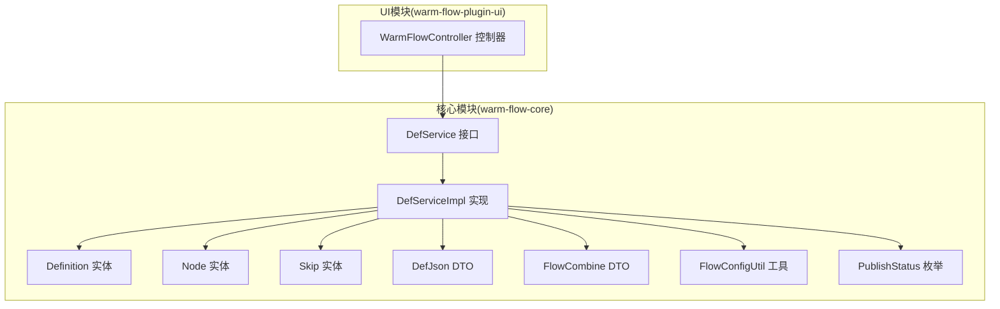
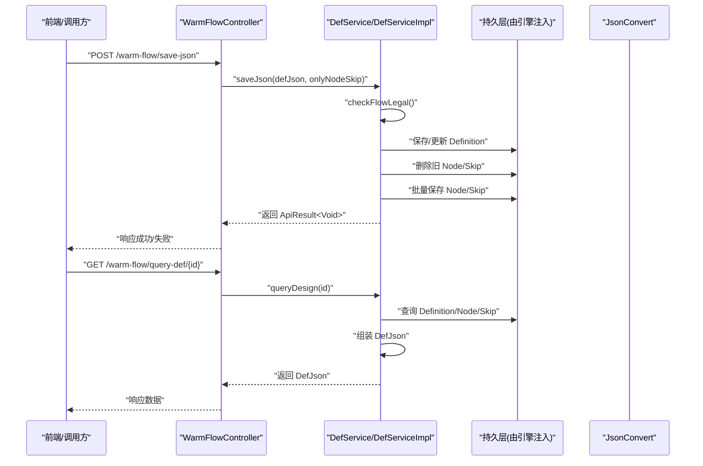
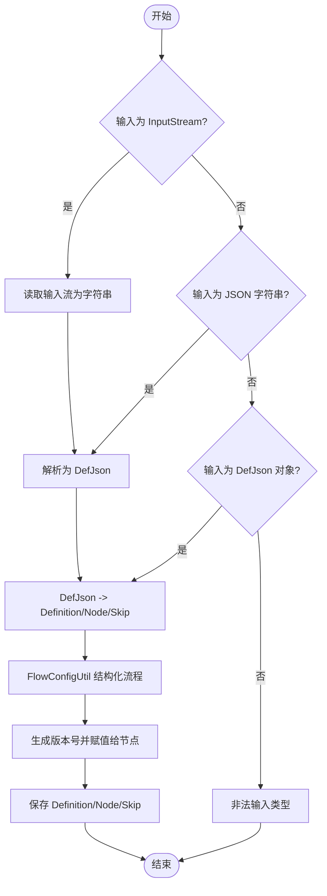
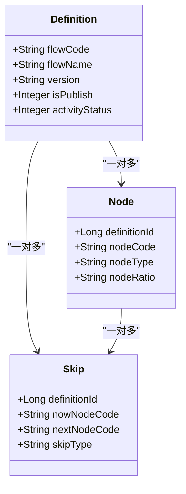
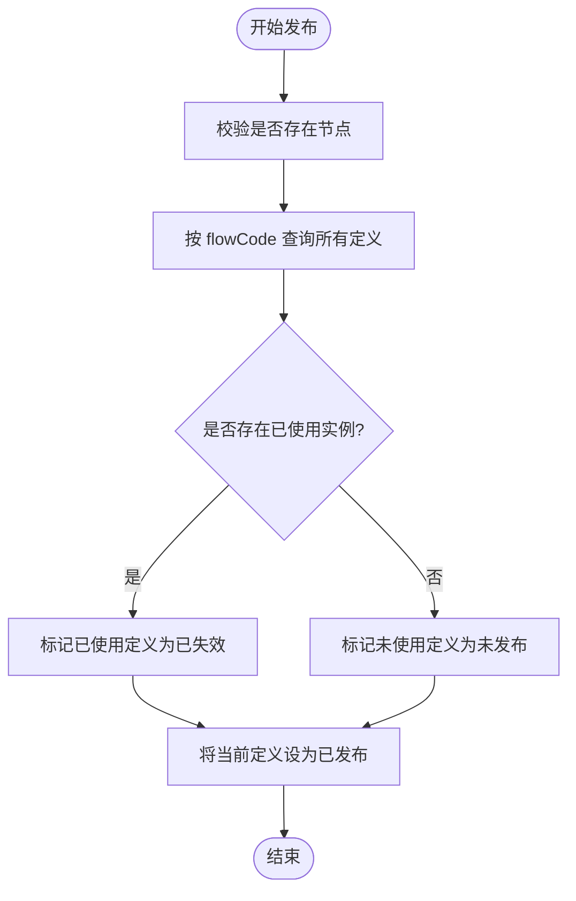
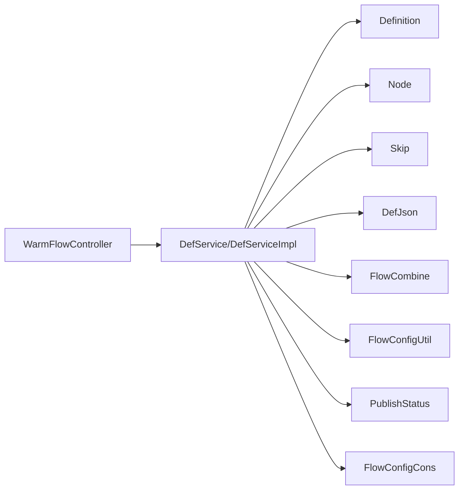

# 流程定义管理

<cite>
**本文引用的文件**
- [DefService.java](file://warm-flow-core/src/main/java/org/dromara/warm/flow/core/service/DefService.java)
- [DefServiceImpl.java](file://warm-flow-core/src/main/java/org/dromara/warm/flow/core/service/impl/DefServiceImpl.java)
- [Definition.java](file://warm-flow-core/src/main/java/org/dromara/warm/flow/core/entity/Definition.java)
- [Node.java](file://warm-flow-core/src/main/java/org/dromara/warm/flow/core/entity/Node.java)
- [Skip.java](file://warm-flow-core/src/main/java/org/dromara/warm/flow/core/entity/Skip.java)
- [DefJson.java](file://warm-flow-core/src/main/java/org/dromara/warm/flow/core/dto/DefJson.java)
- [FlowCombine.java](file://warm-flow-core/src/main/java/org/dromara/warm/flow/core/dto/FlowCombine.java)
- [FlowConfigUtil.java](file://warm-flow-core/src/main/java/org/dromara/warm/flow/core/utils/FlowConfigUtil.java)
- [PublishStatus.java](file://warm-flow-core/src/main/java/org/dromara/warm/flow/core/enums/PublishStatus.java)
- [FlowConfigCons.java](file://warm-flow-core/src/main/java/org/dromara/warm/flow/core/constant/FlowConfigCons.java)
- [FlowException.java](file://warm-flow-core/src/main/java/org/dromara/warm/flow/core/exception/FlowException.java)
- [WarmFlowController.java](file://warm-flow-plugin/warm-flow-plugin-ui/warm-flow-plugin-ui-sb-web/src/main/java/org/dromara/warm/flow/ui/controller/WarmFlowController.java)
</cite>

## 目录
1. [简介](#简介)
2. [项目结构](#项目结构)
3. [核心组件](#核心组件)
4. [架构总览](#架构总览)
5. [详细组件分析](#详细组件分析)
6. [依赖分析](#依赖分析)
7. [性能考虑](#性能考虑)
8. [故障排查指南](#故障排查指南)
9. [结论](#结论)
10. [附录](#附录)

## 简介
本文件围绕“流程定义管理”能力，系统性梳理导入导出机制、CRUD与版本发布管理、流程定义与节点/跳转数据的关系与完整性保障，并给出API接口说明与使用示例、错误处理策略。读者无需深入源码即可理解如何在系统中进行流程定义的全生命周期管理。

## 项目结构
- 核心服务接口与实现位于 warm-flow-core 模块，定义了流程定义的导入、导出、保存、发布、复制、激活/挂起等能力。
- DTO/实体/工具类位于 core 子包，负责数据结构转换、流程组合、配置校验等。
- UI 控制器位于 warm-flow-plugin-ui 模块，提供对外 API 接口，便于前端设计器与业务系统集成。

图表来源
- [DefService.java:34-209](file://warm-flow-core/src/main/java/org/dromara/warm/flow/core/service/DefService.java#L34-L209)
- [DefServiceImpl.java:54-374](file://warm-flow-core/src/main/java/org/dromara/warm/flow/core/service/impl/DefServiceImpl.java#L54-L374)
- [Definition.java:29-195](file://warm-flow-core/src/main/java/org/dromara/warm/flow/core/entity/Definition.java#L29-L195)
- [Node.java:30-161](file://warm-flow-core/src/main/java/org/dromara/warm/flow/core/entity/Node.java#L30-L161)
- [Skip.java:28-127](file://warm-flow-core/src/main/java/org/dromara/warm/flow/core/entity/Skip.java#L28-L127)
- [DefJson.java:44-291](file://warm-flow-core/src/main/java/org/dromara/warm/flow/core/dto/DefJson.java#L44-L291)
- [FlowCombine.java:42-58](file://warm-flow-core/src/main/java/org/dromara/warm/flow/core/dto/FlowCombine.java#L42-L58)
- [FlowConfigUtil.java:35-184](file://warm-flow-core/src/main/java/org/dromara/warm/flow/core/utils/FlowConfigUtil.java#L35-L184)
- [PublishStatus.java:29-70](file://warm-flow-core/src/main/java/org/dromara/warm/flow/core/enums/PublishStatus.java#L29-L70)
- [WarmFlowController.java:40-216](file://warm-flow-plugin/warm-flow-plugin-ui/warm-flow-plugin-ui-sb-web/src/main/java/org/dromara/warm/flow/ui/controller/WarmFlowController.java#L40-L216)

章节来源
- [DefService.java:34-209](file://warm-flow-core/src/main/java/org/dromara/warm/flow/core/service/DefService.java#L34-L209)
- [DefServiceImpl.java:54-374](file://warm-flow-core/src/main/java/org/dromara/warm/flow/core/service/impl/DefServiceImpl.java#L54-L374)
- [WarmFlowController.java:40-216](file://warm-flow-plugin/warm-flow-plugin-ui/warm-flow-plugin-ui-sb-web/src/main/java/org/dromara/warm/flow/ui/controller/WarmFlowController.java#L40-L216)

## 核心组件
- 流程定义服务接口与实现：提供导入/导出、保存、发布/取消发布、复制、激活/挂起、版本生成、合法性校验等能力。
- 数据传输对象：DefJson 将 Definition/Node/Skip 组合为前后端交互的统一结构；FlowCombine 作为服务层内部的流程数据聚合载体。
- 实体模型：Definition/Node/Skip 描述流程定义、节点与跳转关系。
- 配置与校验：FlowConfigUtil 提供流程合法性检查、节点/跳转规则校验；PublishStatus 定义发布状态枚举。
- 异常体系：FlowException 提供统一异常承载。

章节来源
- [DefService.java:34-209](file://warm-flow-core/src/main/java/org/dromara/warm/flow/core/service/DefService.java#L34-L209)
- [DefServiceImpl.java:54-374](file://warm-flow-core/src/main/java/org/dromara/warm/flow/core/service/impl/DefServiceImpl.java#L54-L374)
- [DefJson.java:44-291](file://warm-flow-core/src/main/java/org/dromara/warm/flow/core/dto/DefJson.java#L44-L291)
- [FlowCombine.java:42-58](file://warm-flow-core/src/main/java/org/dromara/warm/flow/core/dto/FlowCombine.java#L42-L58)
- [Definition.java:29-195](file://warm-flow-core/src/main/java/org/dromara/warm/flow/core/entity/Definition.java#L29-L195)
- [Node.java:30-161](file://warm-flow-core/src/main/java/org/dromara/warm/flow/core/entity/Node.java#L30-L161)
- [Skip.java:28-127](file://warm-flow-core/src/main/java/org/dromara/warm/flow/core/entity/Skip.java#L28-L127)
- [FlowConfigUtil.java:35-184](file://warm-flow-core/src/main/java/org/dromara/warm/flow/core/utils/FlowConfigUtil.java#L35-L184)
- [PublishStatus.java:29-70](file://warm-flow-core/src/main/java/org/dromara/warm/flow/core/enums/PublishStatus.java#L29-L70)
- [FlowException.java:25-80](file://warm-flow-core/src/main/java/org/dromara/warm/flow/core/exception/FlowException.java#L25-L80)

## 架构总览
流程定义管理以“服务层为核心”，通过 DefService/DefServiceImpl 统一编排 Definition/Node/Skip 的导入、保存、发布与复制；通过 DefJson/FlowCombine 在 DTO 层完成结构化数据转换；通过 FlowConfigUtil 进行流程合法性校验；通过 PublishStatus 管理发布状态；通过 FlowException 统一异常处理。

图表来源
- [WarmFlowController.java:51-68](file://warm-flow-plugin/warm-flow-plugin-ui/warm-flow-plugin-ui-sb-web/src/main/java/org/dromara/warm/flow/ui/controller/WarmFlowController.java#L51-L68)
- [DefService.java:82-130](file://warm-flow-core/src/main/java/org/dromara/warm/flow/core/service/DefService.java#L82-L130)
- [DefServiceImpl.java:108-149](file://warm-flow-core/src/main/java/org/dromara/warm/flow/core/service/impl/DefServiceImpl.java#L108-L149)
- [DefJson.java:158-213](file://warm-flow-core/src/main/java/org/dromara/warm/flow/core/dto/DefJson.java#L158-L213)

## 详细组件分析

### 导入机制（JSON/输入流/DefJson）
- 支持三种导入入口：
  - 输入流导入：将 InputStream 读取为字符串后交由 JSON 解析。
  - JSON 字符串导入：直接解析为 DefJson 后进入导入流程。
  - DefJson 对象导入：直接从 DTO 转换为 Definition/Node/Skip 并入库。
- 导入流程要点：
  - 使用 FlowConfigUtil 结构化流程，生成 FlowCombine。
  - 生成新版本号并同步赋给节点。
  - 通过 DefService.save/DefService.saveBatch 完成持久化。

图表来源
- [DefServiceImpl.java:64-88](file://warm-flow-core/src/main/java/org/dromara/warm/flow/core/service/impl/DefServiceImpl.java#L64-L88)
- [DefServiceImpl.java:108-149](file://warm-flow-core/src/main/java/org/dromara/warm/flow/core/service/impl/DefServiceImpl.java#L108-L149)
- [FlowConfigUtil.java:43-79](file://warm-flow-core/src/main/java/org/dromara/warm/flow/core/utils/FlowConfigUtil.java#L43-L79)

章节来源
- [DefService.java:36-55](file://warm-flow-core/src/main/java/org/dromara/warm/flow/core/service/DefService.java#L36-L55)
- [DefServiceImpl.java:64-88](file://warm-flow-core/src/main/java/org/dromara/warm/flow/core/service/impl/DefServiceImpl.java#L64-L88)

### 导出机制（流程定义+节点+跳转）
- 导出为 JSON 字符串，基于 DefJson 组装 Definition/Node/Skip 的完整数据。
- 导出时会移除发布状态标记，确保导出数据可复用。

章节来源
- [DefService.java:84-90](file://warm-flow-core/src/main/java/org/dromara/warm/flow/core/service/DefService.java#L84-L90)
- [DefServiceImpl.java:151-154](file://warm-flow-core/src/main/java/org/dromara/warm/flow/core/service/impl/DefServiceImpl.java#L151-L154)
- [DefJson.java:158-213](file://warm-flow-core/src/main/java/org/dromara/warm/flow/core/dto/DefJson.java#L158-L213)

### CRUD 与版本控制
- 新增/保存：
  - saveDef(DefJson, onlyNodeSkip)：支持仅保存节点/跳转或连同定义一起保存。
  - checkAndSave(Definition)：仅保存 Definition，并生成新版本号。
- 修改：
  - 若传入 Definition.id 非空且 onlyNodeSkip=false，则更新 Definition。
  - 否则仅更新节点/跳转。
- 删除：
  - removeDef(List<Long>)：删除前校验是否存在已启动的流程实例，避免破坏一致性。
- 版本控制：
  - getNewVersion(Definition)：根据流程编码查找历史版本，生成递增版本号或时间戳+后缀形式。

图表来源
- [Definition.java:74-159](file://warm-flow-core/src/main/java/org/dromara/warm/flow/core/entity/Definition.java#L74-L159)
- [Node.java:74-140](file://warm-flow-core/src/main/java/org/dromara/warm/flow/core/entity/Node.java#L74-L140)
- [Skip.java:72-124](file://warm-flow-core/src/main/java/org/dromara/warm/flow/core/entity/Skip.java#L72-L124)

章节来源
- [DefService.java:57-106](file://warm-flow-core/src/main/java/org/dromara/warm/flow/core/service/DefService.java#L57-L106)
- [DefServiceImpl.java:108-149](file://warm-flow-core/src/main/java/org/dromara/warm/flow/core/service/impl/DefServiceImpl.java#L108-L149)
- [DefServiceImpl.java:209-217](file://warm-flow-core/src/main/java/org/dromara/warm/flow/core/service/impl/DefServiceImpl.java#L209-L217)
- [DefServiceImpl.java:311-343](file://warm-flow-core/src/main/java/org/dromara/warm/flow/core/service/impl/DefServiceImpl.java#L311-L343)

### 发布管理与激活/挂起
- 发布 publish(id)：
  - 校验是否存在已绘制的节点。
  - 对同一 flowCode 的其他已发布定义进行状态迁移：
    - 已使用的定义标记为“已失效”；
    - 未使用的定义标记为“未发布”。
  - 将当前定义标记为“已发布”。
- 取消发布 unPublish(id)：
  - 校验是否存在已启动的流程实例，避免影响运行中实例。
- 激活/挂起：
  - active(id)/unActive(id)：更新 Definition.activityStatus。

图表来源
- [DefServiceImpl.java:220-253](file://warm-flow-core/src/main/java/org/dromara/warm/flow/core/service/impl/DefServiceImpl.java#L220-L253)
- [DefServiceImpl.java:255-262](file://warm-flow-core/src/main/java/org/dromara/warm/flow/core/service/impl/DefServiceImpl.java#L255-L262)
- [PublishStatus.java:29-38](file://warm-flow-core/src/main/java/org/dromara/warm/flow/core/enums/PublishStatus.java#L29-L38)

章节来源
- [DefService.java:140-192](file://warm-flow-core/src/main/java/org/dromara/warm/flow/core/service/DefService.java#L140-L192)
- [DefServiceImpl.java:220-262](file://warm-flow-core/src/main/java/org/dromara/warm/flow/core/service/impl/DefServiceImpl.java#L220-L262)
- [PublishStatus.java:29-38](file://warm-flow-core/src/main/java/org/dromara/warm/flow/core/enums/PublishStatus.java#L29-L38)

### 复制流程定义
- 复制 Definition、Node、Skip，并重新生成版本号与 ID 填充。
- 节点/跳转数据一一对应复制并写入。

章节来源
- [DefService.java:172-178](file://warm-flow-core/src/main/java/org/dromara/warm/flow/core/service/DefService.java#L172-L178)
- [DefServiceImpl.java:264-280](file://warm-flow-core/src/main/java/org/dromara/warm/flow/core/service/impl/DefServiceImpl.java#L264-L280)

### 与节点、跳转数据的关系与完整性保障
- 关系映射：
  - Definition 与 Node 为一对多；
  - Node 与 Skip 为一对多；
  - Skip 记录当前节点与下一节点的编码与类型。
- 完整性保障：
  - FlowConfigUtil 校验：
    - 起始节点唯一性；
    - 节点编码唯一性；
    - 跳转合法性（串行/并行/分支）；
    - 目标节点存在性；
    - 条件/目标去重。
  - saveDef 保存前删除旧节点/跳转，确保一致性。

章节来源
- [FlowConfigUtil.java:81-128](file://warm-flow-core/src/main/java/org/dromara/warm/flow/core/utils/FlowConfigUtil.java#L81-L128)
- [DefServiceImpl.java:108-149](file://warm-flow-core/src/main/java/org/dromara/warm/flow/core/service/impl/DefServiceImpl.java#L108-L149)

### API 接口说明与使用示例
- 保存流程 JSON
  - 方法：POST /warm-flow/save-json
  - 请求体：DefJson
  - 参数：onlyNodeSkip（布尔，是否仅保存节点/跳转）
  - 响应：ApiResult<Void>
- 查询流程定义
  - 方法：GET /warm-flow/query-def 或 /warm-flow/query-def/{id}
  - 响应：ApiResult<DefJson>
- 查询流程图
  - 方法：GET /warm-flow/query-flow-chart/{id}
  - 响应：ApiResult<DefJson>
- 发布/取消发布/激活/挂起（通过服务层接口）
  - publish(id)/unPublish(id)/active(id)/unActive(id)
  - 建议在业务侧提供对应 HTTP 接口封装上述服务方法

章节来源
- [WarmFlowController.java:51-79](file://warm-flow-plugin/warm-flow-plugin-ui/warm-flow-plugin-ui-sb-web/src/main/java/org/dromara/warm/flow/ui/controller/WarmFlowController.java#L51-L79)
- [DefService.java:140-192](file://warm-flow-core/src/main/java/org/dromara/warm/flow/core/service/DefService.java#L140-L192)

## 依赖分析
- 服务层依赖 FlowEngine 注入的 DefService/NodeService/SkipService 等，形成松耦合。
- DTO/实体之间通过 DefJson/FlowCombine 进行转换，降低跨层耦合。
- 配置常量 FlowConfigCons 提供全局配置开关，便于扩展与兼容不同环境。

图表来源
- [WarmFlowController.java:40-216](file://warm-flow-plugin/warm-flow-plugin-ui/warm-flow-plugin-ui-sb-web/src/main/java/org/dromara/warm/flow/ui/controller/WarmFlowController.java#L40-L216)
- [DefServiceImpl.java:54-374](file://warm-flow-core/src/main/java/org/dromara/warm/flow/core/service/impl/DefServiceImpl.java#L54-L374)
- [FlowConfigCons.java:23-75](file://warm-flow-core/src/main/java/org/dromara/warm/flow/core/constant/FlowConfigCons.java#L23-L75)

章节来源
- [FlowConfigCons.java:23-75](file://warm-flow-core/src/main/java/org/dromara/warm/flow/core/constant/FlowConfigCons.java#L23-L75)

## 性能考虑
- 批量保存：节点与跳转采用 saveBatch，减少多次往返数据库的开销。
- 版本生成：按流程编码聚合历史版本，避免并发冲突导致的版本重复。
- 导入/导出：基于内存构建 DefJson，建议在大流程场景下注意内存占用与分段处理策略。

## 故障排查指南
- 导入异常
  - 输入流读取失败：抛出 FlowException，错误码参考 ExceptionCons.READ_IS_ERROR。
  - JSON 解析失败：抛出 FlowException，需检查 JSON 格式与字段完整性。
- 发布异常
  - 未绘制流程：抛出 FlowException，提示未绘制流程。
  - 已存在已启动实例：抛出 FlowException，提示存在已启动任务。
- 校验异常
  - 缺少起始节点或多起点：抛出 FlowException，提示缺少起始节点或多起点。
  - 节点编码重复：抛出 FlowException，提示重复节点编码。
  - 跳转条件/目标重复：抛出 FlowException，提示相同条件或目标。
  - 目标节点不存在：抛出 FlowException，提示空节点编码。

章节来源
- [DefServiceImpl.java:72-74](file://warm-flow-core/src/main/java/org/dromara/warm/flow/core/service/impl/DefServiceImpl.java#L72-L74)
- [DefServiceImpl.java:220-222](file://warm-flow-core/src/main/java/org/dromara/warm/flow/core/service/impl/DefServiceImpl.java#L220-L222)
- [DefServiceImpl.java:255-258](file://warm-flow-core/src/main/java/org/dromara/warm/flow/core/service/impl/DefServiceImpl.java#L255-L258)
- [FlowConfigUtil.java:81-128](file://warm-flow-core/src/main/java/org/dromara/warm/flow/core/utils/FlowConfigUtil.java#L81-L128)
- [FlowException.java:25-80](file://warm-flow-core/src/main/java/org/dromara/warm/flow/core/exception/FlowException.java#L25-L80)

## 结论
流程定义管理以 DefService/DefServiceImpl 为核心，通过 DefJson/FlowCombine 实现前后端数据一致，借助 FlowConfigUtil 严格校验流程合法性，配合 PublishStatus 与版本控制实现稳定的发布与演进。UI 控制器提供标准 API，便于业务系统快速集成。

## 附录
- 常用配置键（来自 FlowConfigCons）
  - warm-flow.logic_delete：是否开启逻辑删除
  - warm-flow.data-fill-handler-path：数据填充处理类路径
  - warm-flow.tenant_handler_path：租户处理类路径
  - warm-flow.data_source_type：数据源类型
  - warm-flow.ui：是否支持 UI
  - warm-flow.token-name：共享权限令牌名

章节来源
- [FlowConfigCons.java:23-75](file://warm-flow-core/src/main/java/org/dromara/warm/flow/core/constant/FlowConfigCons.java#L23-L75)