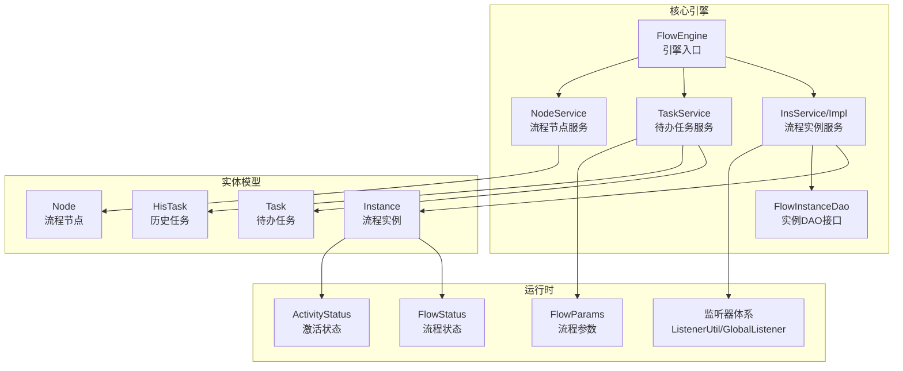
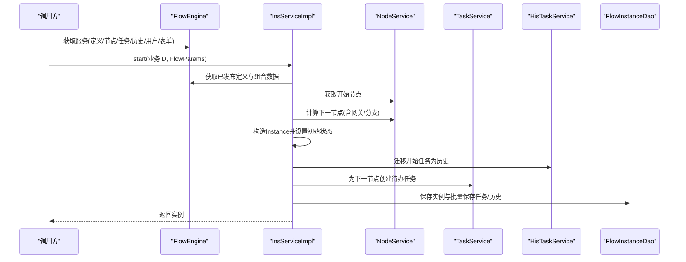
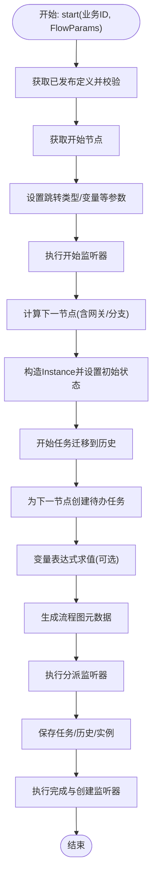
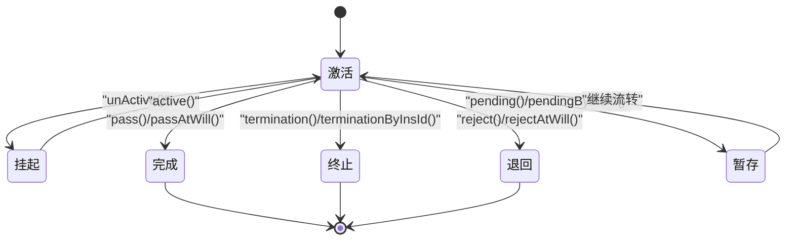
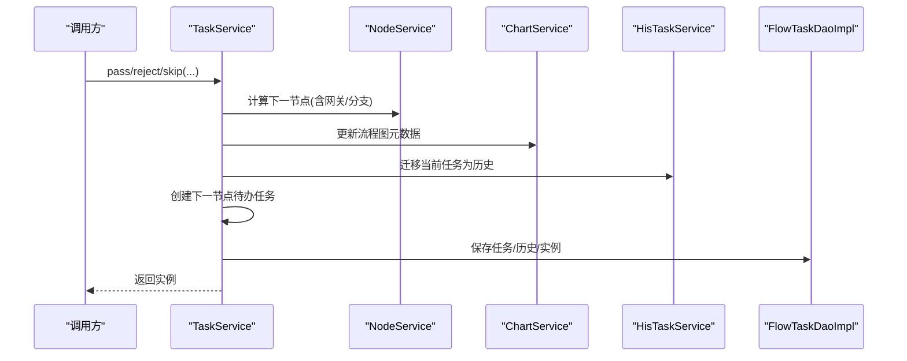
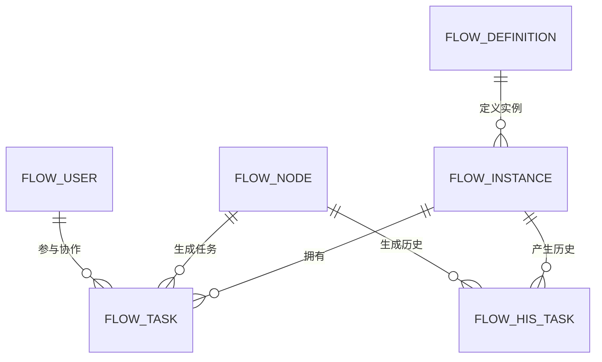
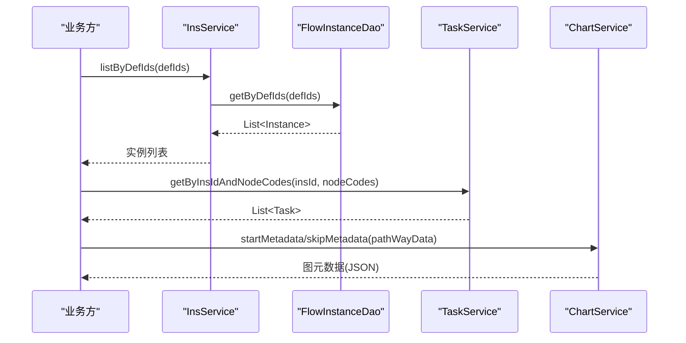
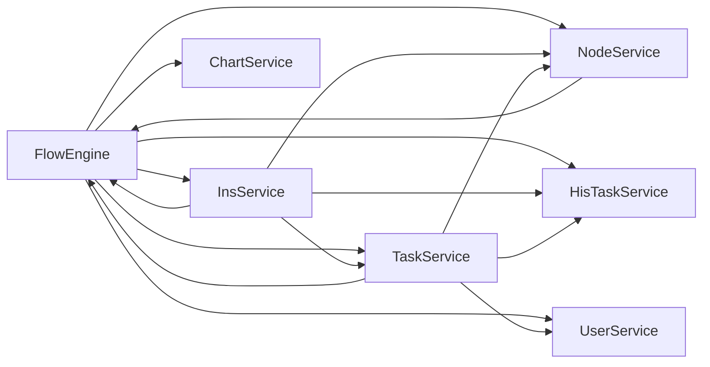

# 流程执行引擎

<cite>
**本文引用的文件**
- [FlowEngine.java](file://warm-flow-core/src/main/java/org/dromara/warm/flow/core/FlowEngine.java)
- [InsService.java](file://warm-flow-core/src/main/java/org/dromara/warm/flow/core/service/InsService.java)
- [InsServiceImpl.java](file://warm-flow-core/src/main/java/org/dromara/warm/flow/core/service/impl/InsServiceImpl.java)
- [Instance.java](file://warm-flow-core/src/main/java/org/dromara/warm/flow/core/entity/Instance.java)
- [TaskService.java](file://warm-flow-core/src/main/java/org/dromara/warm/flow/core/service/TaskService.java)
- [Task.java](file://warm-flow-core/src/main/java/org/dromara/warm/flow/core/entity/Task.java)
- [NodeService.java](file://warm-flow-core/src/main/java/org/dromara/warm/flow/core/service/NodeService.java)
- [Node.java](file://warm-flow-core/src/main/java/org/dromara/warm/flow/core/entity/Node.java)
- [FlowParams.java](file://warm-flow-core/src/main/java/org/dromara/warm/flow/core/dto/FlowParams.java)
- [FlowStatus.java](file://warm-flow-core/src/main/java/org/dromara/warm/flow/core/enums/FlowStatus.java)
- [ActivityStatus.java](file://warm-flow-core/src/main/java/org/dromara/warm/flow/core/enums/ActivityStatus.java)
- [FlowInstanceDao.java](file://warm-flow-core/src/main/java/org/dromara/warm/flow/core/orm/dao/FlowInstanceDao.java)
- [HisTask.java](file://warm-flow-core/src/main/java/org/dromara/warm/flow/core/entity/HisTask.java)
- [ChartServiceImpl.java](file://warm-flow-core/src/main/java/org/dromara/warm/flow/core/service/impl/ChartServiceImpl.java)
- [ListenerUtil.java](file://warm-flow-core/src/main/java/org/dromara/warm/flow/core/utils/ListenerUtil.java)
- [GlobalListener.java](file://warm-flow-core/src/main/java/org/dromara/warm/flow/core/listener/GlobalListener.java)
- [Listener.java](file://warm-flow-core/src/main/java/org/dromara/warm/flow/core/listener/Listener.java)
- [ListenerVariable.java](file://warm-flow-core/src/main/java/org/dromara/warm/flow/core/listener/ListenerVariable.java)
- [FlowTaskDaoImpl.java](file://warm-flow-orm/warm-flow-easy-query/warm-flow-easy-query-core/src/main/java/org/dromara/warm/flow/orm/dao/FlowTaskDaoImpl.java)
- [sqlserver.sql](file://sql/sqlserver/sqlserver.sql)
</cite>

## 目录
1. [简介](#简介)
2. [项目结构](#项目结构)
3. [核心组件](#核心组件)
4. [架构总览](#架构总览)
5. [详细组件分析](#详细组件分析)
6. [依赖分析](#依赖分析)
7. [性能考虑](#性能考虑)
8. [故障排查指南](#故障排查指南)
9. [结论](#结论)
10. [附录](#附录)

## 简介
本文件面向“流程执行引擎”的使用者与维护者，系统性阐述流程实例的创建机制、状态管理、生命周期控制、实例与任务/节点的关联关系与数据一致性保障，以及查询、统计与监控的相关能力与最佳实践。文档以源码为依据，结合流程引擎的接口与实现，帮助读者快速理解并正确使用流程实例的全生命周期管理。

## 项目结构
- 核心模块：warm-flow-core 提供流程引擎的核心接口、实体、服务、工具与枚举。
- ORM 模块：warm-flow-orm 提供多种持久化实现（MyBatis、MyBatis-Plus、EasyQuery）。
- 插件模块：warm-flow-plugin 提供表达式、UI、JSON 等插件能力。
- UI 模块：warm-flow-ui 提供前端可视化设计器与示例页面。
- SQL 脚本：各数据库方言的建表脚本，包含流程实例表结构与注释。

图表来源
- [FlowEngine.java:39-270](file://warm-flow-core/src/main/java/org/dromara/warm/flow/core/FlowEngine.java#L39-L270)
- [InsService.java:24-94](file://warm-flow-core/src/main/java/org/dromara/warm/flow/core/service/InsService.java#L24-L94)
- [InsServiceImpl.java:46-245](file://warm-flow-core/src/main/java/org/dromara/warm/flow/core/service/impl/InsServiceImpl.java#L46-L245)
- [TaskService.java:30-534](file://warm-flow-core/src/main/java/org/dromara/warm/flow/core/service/TaskService.java#L30-L534)
- [NodeService.java:28-229](file://warm-flow-core/src/main/java/org/dromara/warm/flow/core/service/NodeService.java#L28-L229)
- [FlowInstanceDao.java:22-38](file://warm-flow-core/src/main/java/org/dromara/warm/flow/core/orm/dao/FlowInstanceDao.java#L22-L38)
- [Instance.java:23-166](file://warm-flow-core/src/main/java/org/dromara/warm/flow/core/entity/Instance.java#L23-L166)
- [Task.java:21-136](file://warm-flow-core/src/main/java/org/dromara/warm/flow/core/entity/Task.java#L21-L136)
- [HisTask.java:24-164](file://warm-flow-core/src/main/java/org/dromara/warm/flow/core/entity/HisTask.java#L24-L164)
- [Node.java:24-162](file://warm-flow-core/src/main/java/org/dromara/warm/flow/core/entity/Node.java#L24-L162)
- [FlowStatus.java:22-103](file://warm-flow-core/src/main/java/org/dromara/warm/flow/core/enums/FlowStatus.java#L22-L103)
- [ActivityStatus.java:22-56](file://warm-flow-core/src/main/java/org/dromara/warm/flow/core/enums/ActivityStatus.java#L22-L56)
- [FlowParams.java:27-336](file://warm-flow-core/src/main/java/org/dromara/warm/flow/core/dto/FlowParams.java#L27-L336)
- [ListenerUtil.java:72-98](file://warm-flow-core/src/main/java/org/dromara/warm/flow/core/utils/ListenerUtil.java#L72-L98)
- [GlobalListener.java:20-46](file://warm-flow-core/src/main/java/org/dromara/warm/flow/core/listener/GlobalListener.java#L20-L46)

章节来源
- [FlowEngine.java:39-270](file://warm-flow-core/src/main/java/org/dromara/warm/flow/core/FlowEngine.java#L39-L270)
- [sqlserver.sql:516-567](file://sql/sqlserver/sqlserver.sql#L516-L567)

## 核心组件
- 流程引擎入口：FlowEngine 提供统一的服务获取与对象工厂，负责装配 Def/Node/Skip/Ins/Task/HisTask/User/Form 等对象实例，以及监听器、数据填充、权限与租户处理器的初始化。
- 流程实例服务：InsService/Impl 负责流程实例的创建、状态变更（激活/挂起）、变量维护与批量删除等。
- 待办任务服务：TaskService 负责流程推进（通过/退回/跳转/终止/撤销/暂存等）、任务协作（转办/委派/加签/减签）、任务加载与历史迁移等。
- 流程节点服务：NodeService 负责节点查询、前后置节点检索、下一节点计算（含网关分支逻辑）与流程图元数据生成。
- 实体与DAO：Instance/Task/HisTask/Node 为持久化实体接口；FlowInstanceDao 为实例查询接口；FlowTaskDaoImpl 展示了按实例ID批量删除等典型实现。
- 参数与状态：FlowParams 封装流程调用参数；FlowStatus/ActivityStatus 定义流程状态与激活状态枚举。
- 监听器体系：ListenerUtil/GlobalListener/Listener/ListenerVariable 支持在开始、分派、完成、创建等阶段注入业务逻辑。

章节来源
- [InsService.java:24-94](file://warm-flow-core/src/main/java/org/dromara/warm/flow/core/service/InsService.java#L24-L94)
- [InsServiceImpl.java:46-245](file://warm-flow-core/src/main/java/org/dromara/warm/flow/core/service/impl/InsServiceImpl.java#L46-L245)
- [TaskService.java:30-534](file://warm-flow-core/src/main/java/org/dromara/warm/flow/core/service/TaskService.java#L30-L534)
- [NodeService.java:28-229](file://warm-flow-core/src/main/java/org/dromara/warm/flow/core/service/NodeService.java#L28-L229)
- [FlowInstanceDao.java:22-38](file://warm-flow-core/src/main/java/org/dromara/warm/flow/core/orm/dao/FlowInstanceDao.java#L22-L38)
- [FlowTaskDaoImpl.java:33-63](file://warm-flow-orm/warm-flow-easy-query/warm-flow-easy-query-core/src/main/java/org/dromara/warm/flow/orm/dao/FlowTaskDaoImpl.java#L33-L63)
- [FlowParams.java:27-336](file://warm-flow-core/src/main/java/org/dromara/warm/flow/core/dto/FlowParams.java#L27-L336)
- [FlowStatus.java:22-103](file://warm-flow-core/src/main/java/org/dromara/warm/flow/core/enums/FlowStatus.java#L22-L103)
- [ActivityStatus.java:22-56](file://warm-flow-core/src/main/java/org/dromara/warm/flow/core/enums/ActivityStatus.java#L22-L56)
- [ListenerUtil.java:72-98](file://warm-flow-core/src/main/java/org/dromara/warm/flow/core/utils/ListenerUtil.java#L72-L98)
- [GlobalListener.java:20-46](file://warm-flow-core/src/main/java/org/dromara/warm/flow/core/listener/GlobalListener.java#L20-L46)
- [Listener.java:20-58](file://warm-flow-core/src/main/java/org/dromara/warm/flow/core/listener/Listener.java#L20-L58)
- [ListenerVariable.java:93-134](file://warm-flow-core/src/main/java/org/dromara/warm/flow/core/listener/ListenerVariable.java#L93-L134)

## 架构总览
流程引擎采用“服务层 + 实体层 + DAO 层 + 监听器 + 参数/枚举”的分层架构。引擎通过 FlowEngine 统一装配各服务与工具，InsServiceImpl 在启动流程时协调节点、任务、历史与监听器，最终持久化保存。

图表来源
- [InsServiceImpl.java:54-111](file://warm-flow-core/src/main/java/org/dromara/warm/flow/core/service/impl/InsServiceImpl.java#L54-L111)
- [NodeService.java:144-200](file://warm-flow-core/src/main/java/org/dromara/warm/flow/core/service/NodeService.java#L144-L200)
- [TaskService.java:473-506](file://warm-flow-core/src/main/java/org/dromara/warm/flow/core/service/TaskService.java#L473-L506)
- [FlowInstanceDao.java:28-38](file://warm-flow-core/src/main/java/org/dromara/warm/flow/core/orm/dao/FlowInstanceDao.java#L28-L38)

## 详细组件分析

### 流程实例创建机制
- 输入与约束：业务ID与 FlowParams（必须包含流程编码、当前办理人等）。引擎根据流程编码获取已发布定义，校验流程定义处于激活状态，确保存在开始节点。
- 初始状态设置：实例的节点类型、节点编码、节点名称、流程状态（默认“待提交”或自定义）、激活状态（激活）、变量（JSON 字符串）等被设置。
- 监听器与元数据：启动监听器、分派监听器、完成与创建监听器依次执行；流程图元数据（含节点/连线状态）通过 ChartService 生成并写入实例。
- 任务与历史迁移：开始节点任务被迁移到历史任务；下一节点任务被创建并持久化；实例保存。

图表来源
- [InsServiceImpl.java:54-111](file://warm-flow-core/src/main/java/org/dromara/warm/flow/core/service/impl/InsServiceImpl.java#L54-L111)
- [NodeService.java:144-200](file://warm-flow-core/src/main/java/org/dromara/warm/flow/core/service/NodeService.java#L144-L200)
- [TaskService.java:473-506](file://warm-flow-core/src/main/java/org/dromara/warm/flow/core/service/TaskService.java#L473-L506)
- [ChartServiceImpl.java:68-86](file://warm-flow-core/src/main/java/org/dromara/warm/flow/core/service/impl/ChartServiceImpl.java#L68-L86)
- [ListenerUtil.java:72-98](file://warm-flow-core/src/main/java/org/dromara/warm/flow/core/utils/ListenerUtil.java#L72-L98)

章节来源
- [InsServiceImpl.java:54-111](file://warm-flow-core/src/main/java/org/dromara/warm/flow/core/service/impl/InsServiceImpl.java#L54-L111)
- [FlowParams.java:27-336](file://warm-flow-core/src/main/java/org/dromara/warm/flow/core/dto/FlowParams.java#L27-L336)
- [FlowStatus.java:22-103](file://warm-flow-core/src/main/java/org/dromara/warm/flow/core/enums/FlowStatus.java#L22-L103)
- [ActivityStatus.java:22-56](file://warm-flow-core/src/main/java/org/dromara/warm/flow/core/enums/ActivityStatus.java#L22-L56)

### 流程实例状态管理
- 流程状态（FlowStatus）：涵盖“待提交、审批中、审批通过、自动完成、终止、作废、撤销、取回、已完成、已退回、失效、拿回、重启、暂存”等。
- 激活状态（ActivityStatus）：支持“挂起/激活”，用于控制流程实例是否允许流转。
- 状态检查与持久化：InsServiceImpl 提供激活/挂起操作，均基于实例当前状态进行校验并更新；FlowStatus/ActivityStatus 枚举提供状态映射与判定方法。

图表来源
- [ActivityStatus.java:28-56](file://warm-flow-core/src/main/java/org/dromara/warm/flow/core/enums/ActivityStatus.java#L28-L56)
- [FlowStatus.java:28-103](file://warm-flow-core/src/main/java/org/dromara/warm/flow/core/enums/FlowStatus.java#L28-L103)
- [InsServiceImpl.java:216-230](file://warm-flow-core/src/main/java/org/dromara/warm/flow/core/service/impl/InsServiceImpl.java#L216-L230)
- [TaskService.java:300-345](file://warm-flow-core/src/main/java/org/dromara/warm/flow/core/service/TaskService.java#L300-L345)

章节来源
- [FlowStatus.java:22-103](file://warm-flow-core/src/main/java/org/dromara/warm/flow/core/enums/FlowStatus.java#L22-L103)
- [ActivityStatus.java:22-56](file://warm-flow-core/src/main/java/org/dromara/warm/flow/core/enums/ActivityStatus.java#L22-L56)
- [InsServiceImpl.java:216-230](file://warm-flow-core/src/main/java/org/dromara/warm/flow/core/service/impl/InsServiceImpl.java#L216-L230)
- [TaskService.java:300-345](file://warm-flow-core/src/main/java/org/dromara/warm/flow/core/service/TaskService.java#L300-L345)

### 生命周期管理
- 启动：start() 完成实例初始化、下一节点计算、任务创建与历史迁移、监听器执行与持久化。
- 推进：pass/reject/skip 等推进操作，支持任意跳转、自定义状态、协作方式（转办/委派/加签/减签）。
- 终止/撤销：termination/revocation 将流程提前结束或将流程撤销。
- 暂存：pending/pendingByInsId 仅修改任务状态并新增历史记录，不改变流程走向。
- 删除：remove/removeByInsIds 批量删除实例及其关联任务/历史。

图表来源
- [TaskService.java:140-345](file://warm-flow-core/src/main/java/org/dromara/warm/flow/core/service/TaskService.java#L140-L345)
- [NodeService.java:144-200](file://warm-flow-core/src/main/java/org/dromara/warm/flow/core/service/NodeService.java#L144-L200)
- [ChartServiceImpl.java:68-86](file://warm-flow-core/src/main/java/org/dromara/warm/flow/core/service/impl/ChartServiceImpl.java#L68-L86)
- [FlowTaskDaoImpl.java:33-63](file://warm-flow-orm/warm-flow-easy-query/warm-flow-easy-query-core/src/main/java/org/dromara/warm/flow/orm/dao/FlowTaskDaoImpl.java#L33-L63)

章节来源
- [TaskService.java:140-345](file://warm-flow-core/src/main/java/org/dromara/warm/flow/core/service/TaskService.java#L140-L345)
- [NodeService.java:144-200](file://warm-flow-core/src/main/java/org/dromara/warm/flow/core/service/NodeService.java#L144-L200)
- [ChartServiceImpl.java:68-86](file://warm-flow-core/src/main/java/org/dromara/warm/flow/core/service/impl/ChartServiceImpl.java#L68-L86)
- [FlowTaskDaoImpl.java:33-63](file://warm-flow-orm/warm-flow-easy-query/warm-flow-easy-query-core/src/main/java/org/dromara/warm/flow/orm/dao/FlowTaskDaoImpl.java#L33-L63)

### 实例与任务/节点的关联关系与数据一致性
- 关联关系：Instance 与 Node/Definition 对应；Task/HisTask 与 Instance/Node/Definition 对应；Task/User 通过用户列表关联。
- 数据一致性：
  - 启动时：开始任务迁移至历史，下一节点任务创建，实例保存，形成一致的“当前任务+历史任务+实例状态”视图。
  - 推进时：当前任务迁移到历史，下一节点任务创建，流程图元数据同步更新，保证 UI 与后端状态一致。
  - 删除时：按实例ID批量删除任务/历史/实例，避免悬挂数据。

图表来源
- [Instance.java:23-166](file://warm-flow-core/src/main/java/org/dromara/warm/flow/core/entity/Instance.java#L23-L166)
- [Task.java:21-136](file://warm-flow-core/src/main/java/org/dromara/warm/flow/core/entity/Task.java#L21-L136)
- [HisTask.java:24-164](file://warm-flow-core/src/main/java/org/dromara/warm/flow/core/entity/HisTask.java#L24-L164)
- [Node.java:24-162](file://warm-flow-core/src/main/java/org/dromara/warm/flow/core/entity/Node.java#L24-L162)

章节来源
- [Instance.java:23-166](file://warm-flow-core/src/main/java/org/dromara/warm/flow/core/entity/Instance.java#L23-L166)
- [Task.java:21-136](file://warm-flow-core/src/main/java/org/dromara/warm/flow/core/entity/Task.java#L21-L136)
- [HisTask.java:24-164](file://warm-flow-core/src/main/java/org/dromara/warm/flow/core/entity/HisTask.java#L24-L164)
- [Node.java:24-162](file://warm-flow-core/src/main/java/org/dromara/warm/flow/core/entity/Node.java#L24-L162)

### 查询、统计与监控
- 实例查询：InsService.listByDefIds/getByDefId 支持按定义ID集合/单个定义ID查询实例列表；FlowInstanceDao.getByDefIds 提供底层查询能力。
- 任务查询：TaskService.getByInsId/getByInsIdAndNodeCodes 支持按实例ID与节点编码集合查询任务；FlowTaskDaoImpl.deleteByInsIds 展示按实例ID批量删除任务。
- 监控与元数据：ChartService.startMetadata/skipMetadata 生成流程图元数据，用于前端渲染与监控展示。
- 监听器：GlobalListener/ListenerUtil 支持在关键节点注入业务逻辑，便于审计与扩展。

图表来源
- [InsService.java:77-83](file://warm-flow-core/src/main/java/org/dromara/warm/flow/core/service/InsService.java#L77-L83)
- [FlowInstanceDao.java:28-38](file://warm-flow-core/src/main/java/org/dromara/warm/flow/core/orm/dao/FlowInstanceDao.java#L28-L38)
- [TaskService.java:480-497](file://warm-flow-core/src/main/java/org/dromara/warm/flow/core/service/TaskService.java#L480-L497)
- [ChartServiceImpl.java:68-86](file://warm-flow-core/src/main/java/org/dromara/warm/flow/core/service/impl/ChartServiceImpl.java#L68-L86)
- [FlowTaskDaoImpl.java:33-63](file://warm-flow-orm/warm-flow-easy-query/warm-flow-easy-query-core/src/main/java/org/dromara/warm/flow/orm/dao/FlowTaskDaoImpl.java#L33-L63)

章节来源
- [InsService.java:77-83](file://warm-flow-core/src/main/java/org/dromara/warm/flow/core/service/InsService.java#L77-L83)
- [FlowInstanceDao.java:28-38](file://warm-flow-core/src/main/java/org/dromara/warm/flow/core/orm/dao/FlowInstanceDao.java#L28-L38)
- [TaskService.java:480-497](file://warm-flow-core/src/main/java/org/dromara/warm/flow/core/service/TaskService.java#L480-L497)
- [ChartServiceImpl.java:68-86](file://warm-flow-core/src/main/java/org/dromara/warm/flow/core/service/impl/ChartServiceImpl.java#L68-L86)
- [FlowTaskDaoImpl.java:33-63](file://warm-flow-orm/warm-flow-easy-query/warm-flow-easy-query-core/src/main/java/org/dromara/warm/flow/orm/dao/FlowTaskDaoImpl.java#L33-L63)

## 依赖分析
- 松耦合：FlowEngine 作为统一入口，通过服务接口与工厂方法解耦具体实现；InsServiceImpl/TaskService 等通过 FlowEngine 获取所需服务，避免直接依赖 Spring 上下文。
- 监听器链路：ListenerUtil 统一调度节点监听器、定义监听器与全局监听器，支持灵活扩展。
- 枚举与参数：FlowStatus/ActivityStatus/FlowParams 提供标准化的状态与参数模型，降低调用方心智负担。

图表来源
- [FlowEngine.java:72-106](file://warm-flow-core/src/main/java/org/dromara/warm/flow/core/FlowEngine.java#L72-L106)
- [InsServiceImpl.java:46-111](file://warm-flow-core/src/main/java/org/dromara/warm/flow/core/service/impl/InsServiceImpl.java#L46-L111)
- [TaskService.java:30-534](file://warm-flow-core/src/main/java/org/dromara/warm/flow/core/service/TaskService.java#L30-L534)
- [NodeService.java:28-229](file://warm-flow-core/src/main/java/org/dromara/warm/flow/core/service/NodeService.java#L28-L229)

章节来源
- [FlowEngine.java:72-106](file://warm-flow-core/src/main/java/org/dromara/warm/flow/core/FlowEngine.java#L72-L106)
- [ListenerUtil.java:72-98](file://warm-flow-core/src/main/java/org/dromara/warm/flow/core/utils/ListenerUtil.java#L72-L98)

## 性能考虑
- 批量操作：删除实例时先删除其关联任务/历史再删除实例，避免多次往返；批量保存任务与用户可减少事务开销。
- 查询优化：按定义ID批量查询实例与任务，减少 N+1 查询；使用索引覆盖常见过滤字段（定义ID、实例ID、节点编码）。
- 监听器与表达式：监听器与变量表达式尽量轻量化，避免在热路径做重 IO 或复杂计算。
- 图元数据：流程图元数据生成仅在必要时触发，避免频繁序列化/反序列化。

## 故障排查指南
- 启动失败：检查流程编码是否存在已发布定义、开始节点是否存在、流程定义是否处于激活状态。
- 推进异常：确认当前任务归属与权限标识匹配、跳转类型与节点类型合法、变量表达式正确。
- 监听器问题：检查节点/定义监听器路径与类型配置、全局监听器是否正确注册。
- 删除异常：确认实例ID有效、是否存在未清理的任务/历史导致外键约束冲突。

章节来源
- [InsServiceImpl.java:54-111](file://warm-flow-core/src/main/java/org/dromara/warm/flow/core/service/impl/InsServiceImpl.java#L54-L111)
- [TaskService.java:140-345](file://warm-flow-core/src/main/java/org/dromara/warm/flow/core/service/TaskService.java#L140-L345)
- [ListenerUtil.java:72-98](file://warm-flow-core/src/main/java/org/dromara/warm/flow/core/utils/ListenerUtil.java#L72-L98)

## 结论
流程执行引擎通过清晰的分层与标准化的接口，提供了从实例创建、状态管理到生命周期推进与数据一致性的完整能力。借助监听器与参数模型，系统具备良好的扩展性与可运维性。建议在生产环境中遵循批量操作、索引优化与轻量化监听器的最佳实践，确保高并发下的稳定性与性能。

## 附录
- 表结构参考（SQL Server 示例）：flow_instance 包含主键、定义ID、业务ID、节点类型/编码/名称、流程状态、激活状态、变量、扩展字段、租户与时间戳等列，满足实例全生命周期存储需求。

章节来源
- [sqlserver.sql:516-567](file://sql/sqlserver/sqlserver.sql#L516-L567)