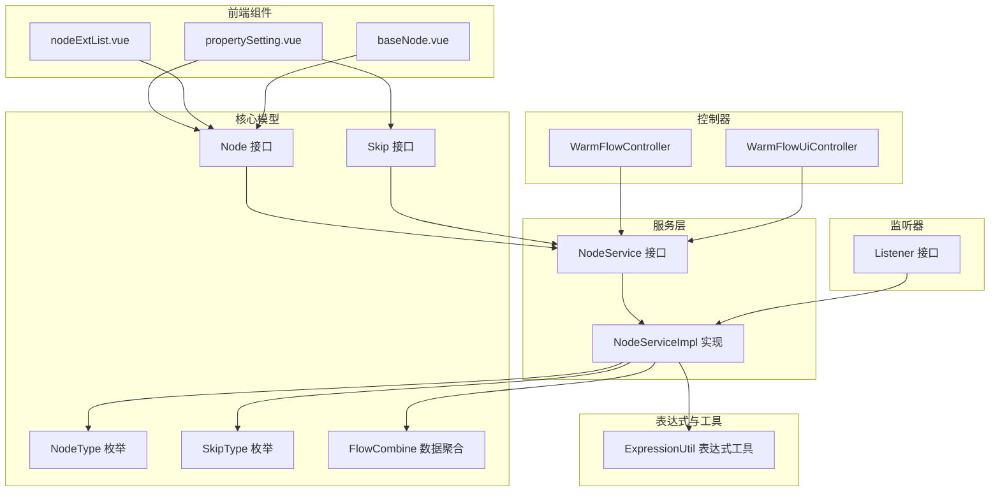
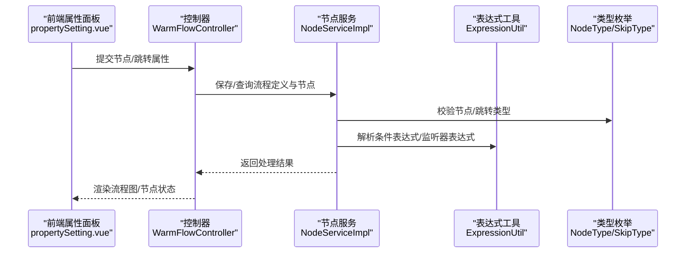
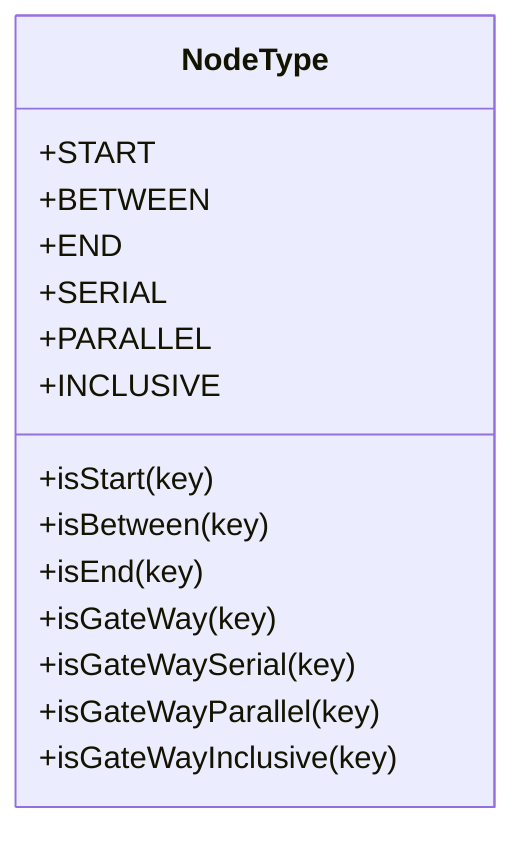
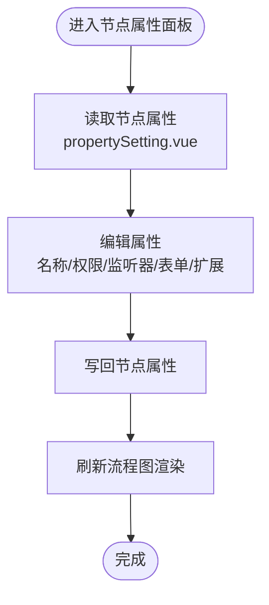
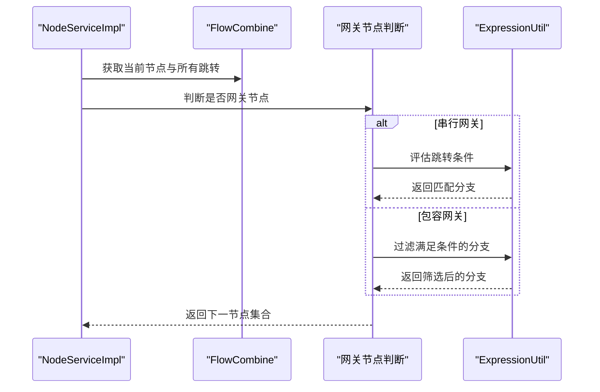
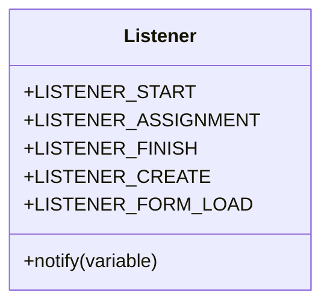
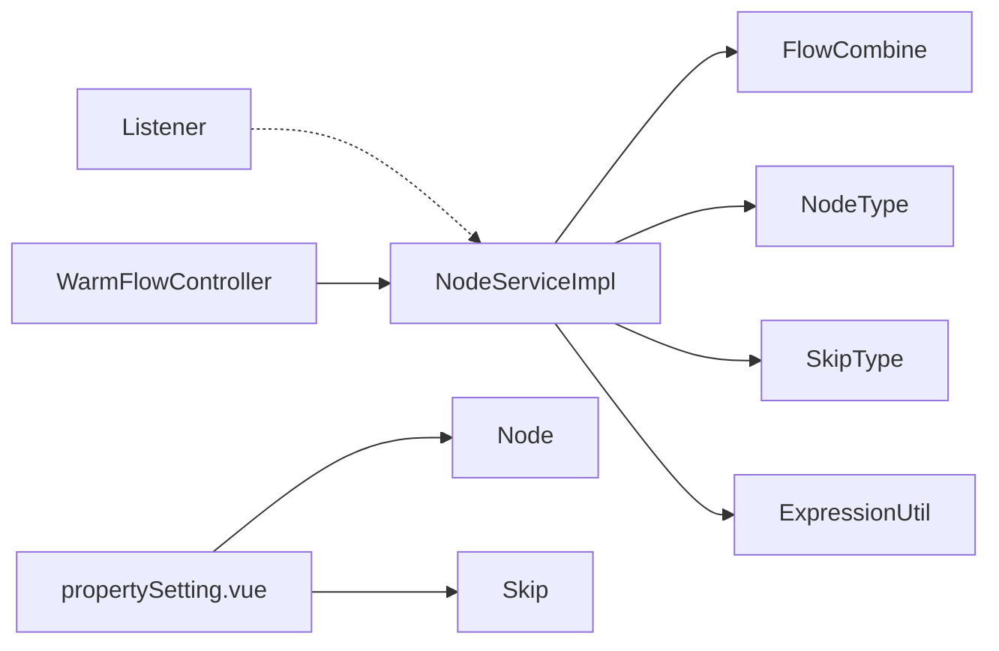

# 节点管理

<cite>
**本文引用的文件**
- [Node.java](file://warm-flow-core/src/main/java/org/dromara/warm/flow/core/entity/Node.java)
- [Skip.java](file://warm-flow-core/src/main/java/org/dromara/warm/flow/core/entity/Skip.java)
- [NodeService.java](file://warm-flow-core/src/main/java/org/dromara/warm/flow/core/service/NodeService.java)
- [NodeServiceImpl.java](file://warm-flow-core/src/main/java/org/dromara/warm/flow/core/service/impl/NodeServiceImpl.java)
- [NodeType.java](file://warm-flow-core/src/main/java/org/dromara/warm/flow/core/enums/NodeType.java)
- [SkipType.java](file://warm-flow-core/src/main/java/org/dromara/warm/flow/core/enums/SkipType.java)
- [ExpressionUtil.java](file://warm-flow-core/src/main/java/org/dromara/warm/flow/core/utils/ExpressionUtil.java)
- [FlowCombine.java](file://warm-flow-core/src/main/java/org/dromara/warm/flow/core/dto/FlowCombine.java)
- [Listener.java](file://warm-flow-core/src/main/java/org/dromara/warm/flow/core/listener/Listener.java)
- [WarmFlowController.java](file://warm-flow-plugin/warm-flow-plugin-ui/warm-flow-plugin-ui-sb-web/src/main/java/org/dromara/warm/flow/ui/controller/WarmFlowController.java)
- [WarmFlowUiController.java](file://warm-flow-plugin/warm-flow-plugin-ui/warm-flow-plugin-ui-sb-web/src/main/java/org/dromara/warm/flow/ui/controller/WarmFlowUiController.java)
- [propertySetting.vue](file://warm-flow-ui/src/components/design/common/vue/propertySetting.vue)
- [nodeExtList.vue](file://warm-flow-ui/src/components/design/common/vue/nodeExtList.vue)
- [baseNode.vue](file://warm-flow-ui/src/components/design/mimic/vue/baseNode.vue)
</cite>

## 目录
1. [简介](#简介)
2. [项目结构](#项目结构)
3. [核心组件](#核心组件)
4. [架构总览](#架构总览)
5. [详细组件分析](#详细组件分析)
6. [依赖分析](#依赖分析)
7. [性能考虑](#性能考虑)
8. [故障排查指南](#故障排查指南)
9. [结论](#结论)
10. [附录](#附录)

## 简介
本文件系统化梳理“节点管理”的设计与实现，覆盖节点类型分类与特性、节点属性配置机制、节点间跳转关系与规则、节点监听器配置与事件处理，以及节点管理相关的API与前端交互方式。目标是帮助开发者与产品人员快速理解并正确使用节点管理能力。

## 项目结构
围绕节点管理的关键模块分布如下：
- 核心模型与服务
  - 节点实体与跳转实体：Node、Skip
  - 节点服务接口与实现：NodeService、NodeServiceImpl
  - 节点类型与跳转类型枚举：NodeType、SkipType
  - 表达式工具：ExpressionUtil
  - 流程组合数据：FlowCombine
- 监听器机制
  - 监听器接口：Listener
- 控制器与前端
  - UI控制器：WarmFlowController、WarmFlowUiController
  - 属性设置面板：propertySetting.vue
  - 节点扩展表单：nodeExtList.vue
  - 基础节点视图：baseNode.vue

图表来源
- [Node.java:1-162](file://warm-flow-core/src/main/java/org/dromara/warm/flow/core/entity/Node.java#L1-L162)
- [Skip.java:1-128](file://warm-flow-core/src/main/java/org/dromara/warm/flow/core/entity/Skip.java#L1-L128)
- [NodeService.java:1-229](file://warm-flow-core/src/main/java/org/dromara/warm/flow/core/service/NodeService.java#L1-L229)
- [NodeServiceImpl.java:1-368](file://warm-flow-core/src/main/java/org/dromara/warm/flow/core/service/impl/NodeServiceImpl.java#L1-L368)
- [NodeType.java:1-161](file://warm-flow-core/src/main/java/org/dromara/warm/flow/core/enums/NodeType.java#L1-L161)
- [SkipType.java:1-101](file://warm-flow-core/src/main/java/org/dromara/warm/flow/core/enums/SkipType.java#L1-L101)
- [ExpressionUtil.java:1-196](file://warm-flow-core/src/main/java/org/dromara/warm/flow/core/utils/ExpressionUtil.java#L1-L196)
- [FlowCombine.java:1-59](file://warm-flow-core/src/main/java/org/dromara/warm/flow/core/dto/FlowCombine.java#L1-L59)
- [Listener.java:1-59](file://warm-flow-core/src/main/java/org/dromara/warm/flow/core/listener/Listener.java#L1-L59)
- [WarmFlowController.java:1-217](file://warm-flow-plugin/warm-flow-plugin-ui/warm-flow-plugin-ui-sb-web/src/main/java/org/dromara/warm/flow/ui/controller/WarmFlowController.java#L1-L217)
- [WarmFlowUiController.java:1-45](file://warm-flow-plugin/warm-flow-plugin-ui/warm-flow-plugin-ui-sb-web/src/main/java/org/dromara/warm/flow/ui/controller/WarmFlowUiController.java#L1-L45)
- [propertySetting.vue:1-337](file://warm-flow-ui/src/components/design/common/vue/propertySetting.vue#L1-L337)
- [nodeExtList.vue:1-202](file://warm-flow-ui/src/components/design/common/vue/nodeExtList.vue#L1-L202)
- [baseNode.vue:1-195](file://warm-flow-ui/src/components/design/mimic/vue/baseNode.vue#L1-L195)

章节来源
- [Node.java:1-162](file://warm-flow-core/src/main/java/org/dromara/warm/flow/core/entity/Node.java#L1-L162)
- [Skip.java:1-128](file://warm-flow-core/src/main/java/org/dromara/warm/flow/core/entity/Skip.java#L1-L128)
- [NodeService.java:1-229](file://warm-flow-core/src/main/java/org/dromara/warm/flow/core/service/NodeService.java#L1-L229)
- [NodeServiceImpl.java:1-368](file://warm-flow-core/src/main/java/org/dromara/warm/flow/core/service/impl/NodeServiceImpl.java#L1-L368)
- [NodeType.java:1-161](file://warm-flow-core/src/main/java/org/dromara/warm/flow/core/enums/NodeType.java#L1-L161)
- [SkipType.java:1-101](file://warm-flow-core/src/main/java/org/dromara/warm/flow/core/enums/SkipType.java#L1-L101)
- [ExpressionUtil.java:1-196](file://warm-flow-core/src/main/java/org/dromara/warm/flow/core/utils/ExpressionUtil.java#L1-L196)
- [FlowCombine.java:1-59](file://warm-flow-core/src/main/java/org/dromara/warm/flow/core/dto/FlowCombine.java#L1-L59)
- [Listener.java:1-59](file://warm-flow-core/src/main/java/org/dromara/warm/flow/core/listener/Listener.java#L1-L59)
- [WarmFlowController.java:1-217](file://warm-flow-plugin/warm-flow-plugin-ui/warm-flow-plugin-ui-sb-web/src/main/java/org/dromara/warm/flow/ui/controller/WarmFlowController.java#L1-L217)
- [WarmFlowUiController.java:1-45](file://warm-flow-plugin/warm-flow-plugin-ui/warm-flow-plugin-ui-sb-web/src/main/java/org/dromara/warm/flow/ui/controller/WarmFlowUiController.java#L1-L45)
- [propertySetting.vue:1-337](file://warm-flow-ui/src/components/design/common/vue/propertySetting.vue#L1-L337)
- [nodeExtList.vue:1-202](file://warm-flow-ui/src/components/design/common/vue/nodeExtList.vue#L1-L202)
- [baseNode.vue:1-195](file://warm-flow-ui/src/components/design/mimic/vue/baseNode.vue#L1-L195)

## 核心组件
- 节点实体 Node：承载节点基础属性（类型、坐标、监听器、表单绑定、扩展属性等），并提供复制能力。
- 跳转实体 Skip：承载边（从当前节点到下一节点）的属性（名称、类型、条件、坐标等）。
- 节点服务 NodeService/NodeServiceImpl：提供节点查询、前后置节点解析、下一节点计算、网关条件判断、扩展属性解析等能力。
- 节点类型 NodeType：统一管理开始、中间、结束、串行/互斥、并行、包容等节点类型。
- 跳转类型 SkipType：统一管理审批通过、退回、无动作等跳转类型。
- 表达式工具 ExpressionUtil：提供条件表达式、监听器表达式、变量表达式等求值能力。
- 流程组合 FlowCombine：聚合流程定义、节点、跳转，作为服务层计算的基础数据容器。
- 监听器 Listener：定义节点生命周期事件（开始、分派、完成、创建、表单加载）的回调接口。

章节来源
- [Node.java:1-162](file://warm-flow-core/src/main/java/org/dromara/warm/flow/core/entity/Node.java#L1-L162)
- [Skip.java:1-128](file://warm-flow-core/src/main/java/org/dromara/warm/flow/core/entity/Skip.java#L1-L128)
- [NodeService.java:1-229](file://warm-flow-core/src/main/java/org/dromara/warm/flow/core/service/NodeService.java#L1-L229)
- [NodeServiceImpl.java:1-368](file://warm-flow-core/src/main/java/org/dromara/warm/flow/core/service/impl/NodeServiceImpl.java#L1-L368)
- [NodeType.java:1-161](file://warm-flow-core/src/main/java/org/dromara/warm/flow/core/enums/NodeType.java#L1-L161)
- [SkipType.java:1-101](file://warm-flow-core/src/main/java/org/dromara/warm/flow/core/enums/SkipType.java#L1-L101)
- [ExpressionUtil.java:1-196](file://warm-flow-core/src/main/java/org/dromara/warm/flow/core/utils/ExpressionUtil.java#L1-L196)
- [FlowCombine.java:1-59](file://warm-flow-core/src/main/java/org/dromara/warm/flow/core/dto/FlowCombine.java#L1-L59)
- [Listener.java:1-59](file://warm-flow-core/src/main/java/org/dromara/warm/flow/core/listener/Listener.java#L1-L59)

## 架构总览
节点管理贯穿“模型—服务—表达式—监听器—控制器—前端”的完整链路。服务层以 FlowCombine 为数据源，结合 NodeType/SkipType 与 ExpressionUtil 的条件求值，完成下一节点选择、网关分流、监听器触发等核心逻辑；控制器提供节点管理相关 API；前端通过属性面板与节点视图进行可视化配置与展示。

图表来源
- [propertySetting.vue:1-337](file://warm-flow-ui/src/components/design/common/vue/propertySetting.vue#L1-L337)
- [WarmFlowController.java:1-217](file://warm-flow-plugin/warm-flow-plugin-ui/warm-flow-plugin-ui-sb-web/src/main/java/org/dromara/warm/flow/ui/controller/WarmFlowController.java#L1-L217)
- [NodeServiceImpl.java:1-368](file://warm-flow-core/src/main/java/org/dromara/warm/flow/core/service/impl/NodeServiceImpl.java#L1-L368)
- [ExpressionUtil.java:1-196](file://warm-flow-core/src/main/java/org/dromara/warm/flow/core/utils/ExpressionUtil.java#L1-L196)
- [NodeType.java:1-161](file://warm-flow-core/src/main/java/org/dromara/warm/flow/core/enums/NodeType.java#L1-L161)
- [SkipType.java:1-101](file://warm-flow-core/src/main/java/org/dromara/warm/flow/core/enums/SkipType.java#L1-L101)

## 详细组件分析

### 节点类型与特性
- 开始节点：流程入口，不可被退回。
- 中间节点：普通处理节点，可配置协同方式与比例、权限标志、监听器、表单绑定等。
- 结束节点：流程出口，不可作为下一节点。
- 网关节点：
  - 串行/互斥：只有一条分支通过，支持条件表达式匹配。
  - 并行：多条分支同时执行。
  - 包容：满足条件的分支执行，未满足的分支被过滤。

图表来源
- [NodeType.java:1-161](file://warm-flow-core/src/main/java/org/dromara/warm/flow/core/enums/NodeType.java#L1-L161)

章节来源
- [NodeType.java:1-161](file://warm-flow-core/src/main/java/org/dromara/warm/flow/core/enums/NodeType.java#L1-L161)

### 节点属性配置机制
- 基础属性：节点名称、节点编码、坐标、协同方式与比例、权限标志、任意跳转节点等。
- 监听器：监听器类型与路径，支持多条监听器配置。
- 表单绑定：自定义表单开关与表单路径。
- 扩展属性：以键值对形式存储在 ext 字段，支持多组扩展项。
- 前端属性面板 propertySetting.vue 将上述属性映射为表单控件，实时更新节点属性。

图表来源
- [propertySetting.vue:1-337](file://warm-flow-ui/src/components/design/common/vue/propertySetting.vue#L1-L337)
- [Node.java:1-162](file://warm-flow-core/src/main/java/org/dromara/warm/flow/core/entity/Node.java#L1-L162)

章节来源
- [Node.java:1-162](file://warm-flow-core/src/main/java/org/dromara/warm/flow/core/entity/Node.java#L1-L162)
- [propertySetting.vue:1-337](file://warm-flow-ui/src/components/design/common/vue/propertySetting.vue#L1-L337)

### 节点间跳转关系管理
- 跳转类型：通过/退回/无动作，决定下一节点选择与网关分流。
- 跳转条件：支持表达式条件，串行网关按条件匹配第一条，包容网关仅保留满足条件的分支。
- 任意跳转：节点可配置“任意跳转节点”，在退回场景下优先使用。
- 循环处理：服务层通过递归与去重逻辑避免无限循环，保证路径解析稳定。

图表来源
- [NodeServiceImpl.java:1-368](file://warm-flow-core/src/main/java/org/dromara/warm/flow/core/service/impl/NodeServiceImpl.java#L1-L368)
- [ExpressionUtil.java:1-196](file://warm-flow-core/src/main/java/org/dromara/warm/flow/core/utils/ExpressionUtil.java#L1-L196)
- [FlowCombine.java:1-59](file://warm-flow-core/src/main/java/org/dromara/warm/flow/core/dto/FlowCombine.java#L1-L59)

章节来源
- [NodeServiceImpl.java:1-368](file://warm-flow-core/src/main/java/org/dromara/warm/flow/core/service/impl/NodeServiceImpl.java#L1-L368)
- [SkipType.java:1-101](file://warm-flow-core/src/main/java/org/dromara/warm/flow/core/enums/SkipType.java#L1-L101)
- [ExpressionUtil.java:1-196](file://warm-flow-core/src/main/java/org/dromara/warm/flow/core/utils/ExpressionUtil.java#L1-L196)

### 节点监听器配置与事件处理
- 监听器类型：开始、分派、完成、创建、表单加载等。
- 配置方式：在节点属性中维护监听器类型与路径数组，前端 propertySetting.vue 支持多行配置。
- 执行时机：在节点生命周期关键节点触发，由监听器接口统一接收并处理。

图表来源
- [Listener.java:1-59](file://warm-flow-core/src/main/java/org/dromara/warm/flow/core/listener/Listener.java#L1-L59)

章节来源
- [Listener.java:1-59](file://warm-flow-core/src/main/java/org/dromara/warm/flow/core/listener/Listener.java#L1-L59)
- [propertySetting.vue:1-337](file://warm-flow-ui/src/components/design/common/vue/propertySetting.vue#L1-L337)

### 节点管理API接口文档
- 保存流程JSON
  - 方法：POST
  - 路径：/warm-flow/save-json
  - 请求体：DefJson
  - 参数：onlyNodeSkip（请求头）
- 查询流程定义
  - 方法：GET
  - 路径：/warm-flow/query-def 或 /warm-flow/query-def/{id}
  - 响应：DefJson
- 查询流程图
  - 方法：GET
  - 路径：/warm-flow/query-flow-chart/{id}
  - 响应：DefJson
- 办理人权限设置
  - 获取权限类型：GET /warm-flow/handler-type
  - 获取权限结果：GET /warm-flow/handler-result?...
  - 名称回显：GET /warm-flow/handler-feedback
  - 权限字典：GET /warm-flow/handler-dict
- 表单内容
  - 读取：GET /warm-flow/form-content/{id}
  - 保存：POST /warm-flow/form-content
- 执行阶段
  - 加载待办：GET /warm-flow/execute/load/{taskId}
  - 加载已办：GET /warm-flow/execute/hisLoad/{taskId}
  - 审批处理：POST /warm-flow/execute/handle
- 节点扩展与监听器
  - 节点扩展属性：GET /warm-flow/node-ext
  - 监听器列表：GET /warm-flow/listener-list
- UI配置
  - GET /warm-flow-ui/config

章节来源
- [WarmFlowController.java:1-217](file://warm-flow-plugin/warm-flow-plugin-ui/warm-flow-plugin-ui-sb-web/src/main/java/org/dromara/warm/flow/ui/controller/WarmFlowController.java#L1-L217)
- [WarmFlowUiController.java:1-45](file://warm-flow-plugin/warm-flow-plugin-ui/warm-flow-plugin-ui-sb-web/src/main/java/org/dromara/warm/flow/ui/controller/WarmFlowUiController.java#L1-L45)

### 实际应用示例
- 在流程设计器中，通过 propertySetting.vue 设置节点名称、权限标志、监听器类型与路径、表单绑定等；节点视图 baseNode.vue 展示节点状态与处理人回显。
- 保存流程时，控制器调用服务层持久化节点与跳转关系；运行时，服务层根据 SkipType 与表达式条件计算下一节点，包容/串行网关按条件分流。
- 前端 nodeExtList.vue 支持扩展属性的多种输入控件（文本、多行、下拉、单选/多选、数值、日期时间、权限选择等），并提供必填校验与回显。

章节来源
- [propertySetting.vue:1-337](file://warm-flow-ui/src/components/design/common/vue/propertySetting.vue#L1-L337)
- [baseNode.vue:1-195](file://warm-flow-ui/src/components/design/mimic/vue/baseNode.vue#L1-L195)
- [nodeExtList.vue:1-202](file://warm-flow-ui/src/components/design/common/vue/nodeExtList.vue#L1-L202)
- [WarmFlowController.java:1-217](file://warm-flow-plugin/warm-flow-plugin-ui/warm-flow-plugin-ui-sb-web/src/main/java/org/dromara/warm/flow/ui/controller/WarmFlowController.java#L1-L217)

## 依赖分析
- 节点服务依赖 FlowCombine 聚合数据，依赖 NodeType/SkipType 进行类型判断，依赖 ExpressionUtil 进行条件求值。
- 监听器接口与服务层解耦，通过统一的监听器类型常量与表达式策略实现灵活扩展。
- 控制器依赖服务层完成节点管理与流程执行；前端组件通过属性面板与节点视图驱动节点属性变更。

图表来源
- [NodeServiceImpl.java:1-368](file://warm-flow-core/src/main/java/org/dromara/warm/flow/core/service/impl/NodeServiceImpl.java#L1-L368)
- [FlowCombine.java:1-59](file://warm-flow-core/src/main/java/org/dromara/warm/flow/core/dto/FlowCombine.java#L1-L59)
- [NodeType.java:1-161](file://warm-flow-core/src/main/java/org/dromara/warm/flow/core/enums/NodeType.java#L1-L161)
- [SkipType.java:1-101](file://warm-flow-core/src/main/java/org/dromara/warm/flow/core/enums/SkipType.java#L1-L101)
- [ExpressionUtil.java:1-196](file://warm-flow-core/src/main/java/org/dromara/warm/flow/core/utils/ExpressionUtil.java#L1-L196)
- [Listener.java:1-59](file://warm-flow-core/src/main/java/org/dromara/warm/flow/core/listener/Listener.java#L1-L59)
- [WarmFlowController.java:1-217](file://warm-flow-plugin/warm-flow-plugin-ui/warm-flow-plugin-ui-sb-web/src/main/java/org/dromara/warm/flow/ui/controller/WarmFlowController.java#L1-L217)
- [propertySetting.vue:1-337](file://warm-flow-ui/src/components/design/common/vue/propertySetting.vue#L1-L337)

章节来源
- [NodeServiceImpl.java:1-368](file://warm-flow-core/src/main/java/org/dromara/warm/flow/core/service/impl/NodeServiceImpl.java#L1-L368)
- [ExpressionUtil.java:1-196](file://warm-flow-core/src/main/java/org/dromara/warm/flow/core/utils/ExpressionUtil.java#L1-L196)
- [Listener.java:1-59](file://warm-flow-core/src/main/java/org/dromara/warm/flow/core/listener/Listener.java#L1-L59)
- [WarmFlowController.java:1-217](file://warm-flow-plugin/warm-flow-plugin-ui/warm-flow-plugin-ui-sb-web/src/main/java/org/dromara/warm/flow/ui/controller/WarmFlowController.java#L1-L217)

## 性能考虑
- 路径解析采用流式收集与去重策略，避免重复节点与循环访问，提升复杂网关场景下的稳定性。
- 表达式求值通过策略注册与倒序匹配，减少无效尝试，提高条件判断效率。
- 扩展属性解析按需处理，避免不必要的JSON解析与字符串拼接。

## 故障排查指南
- 缺失节点编码或定义ID：检查流程保存时是否正确生成节点编码与定义ID。
- 跳转类型不匹配：确认 SkipType 配置与流程变量是否一致。
- 网关条件未命中：核对表达式格式与变量命名，确保表达式策略已注册。
- 监听器未触发：检查监听器类型与路径配置，确认监听器实现可用。
- 任意跳转节点非网关：当指定任意跳转节点时，需确保目标节点为网关类型。

章节来源
- [NodeServiceImpl.java:1-368](file://warm-flow-core/src/main/java/org/dromara/warm/flow/core/service/impl/NodeServiceImpl.java#L1-L368)
- [ExpressionUtil.java:1-196](file://warm-flow-core/src/main/java/org/dromara/warm/flow/core/utils/ExpressionUtil.java#L1-L196)

## 结论
节点管理以清晰的类型体系、完善的属性配置、严谨的跳转规则与灵活的监听器机制为核心，配合控制器与前端组件，形成从设计到执行的完整闭环。通过合理使用表达式与监听器，可实现复杂的业务流转与可观测性需求。

## 附录
- 节点扩展属性与监听器列表可通过控制器接口获取，便于在业务侧进行二次集成与扩展。

章节来源
- [WarmFlowController.java:1-217](file://warm-flow-plugin/warm-flow-plugin-ui/warm-flow-plugin-ui-sb-web/src/main/java/org/dromara/warm/flow/ui/controller/WarmFlowController.java#L1-L217)