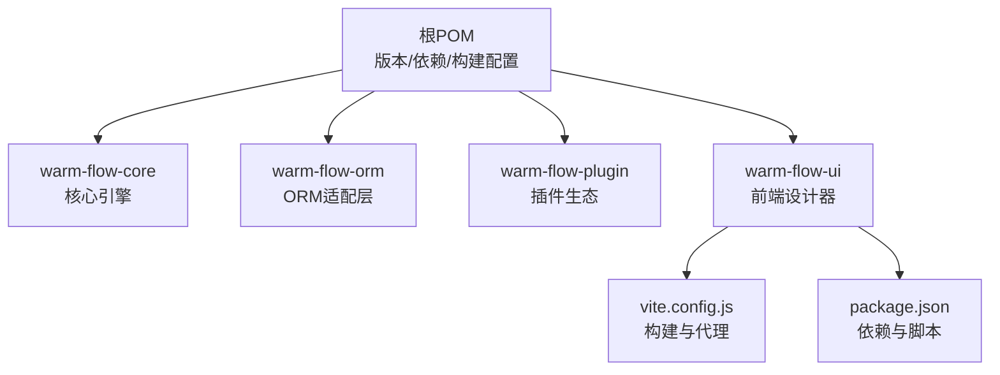
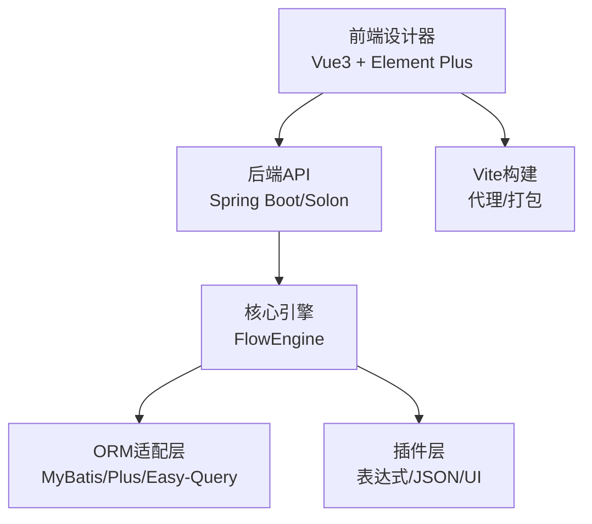
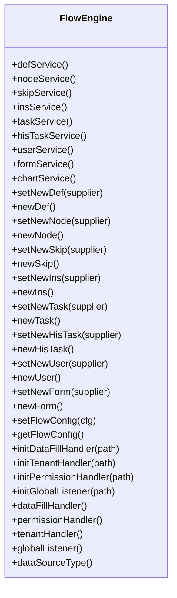
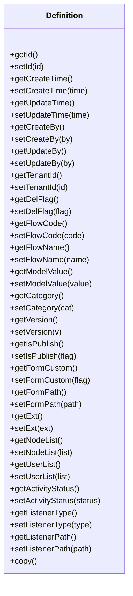
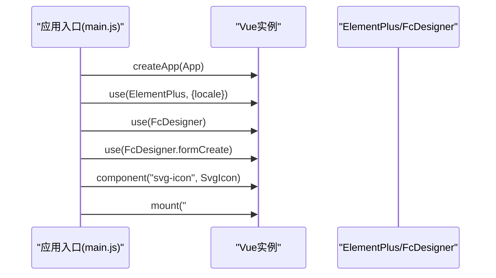
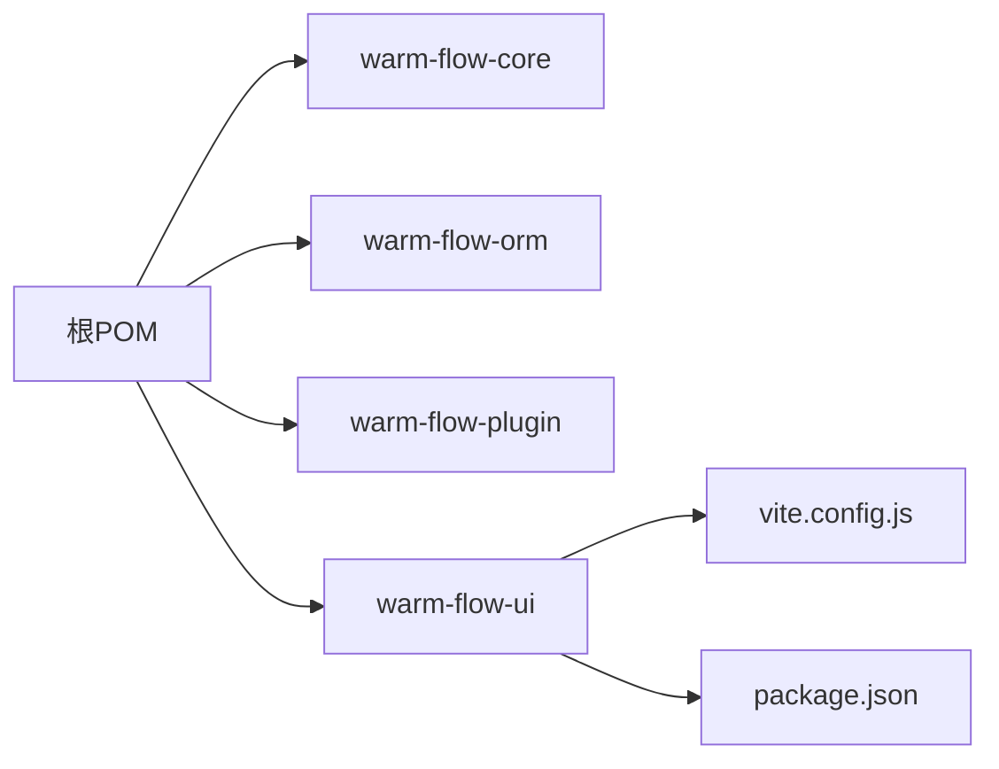

# 代码贡献指南

<cite>
**本文引用的文件**
- [README.md](file://README.md)
- [.editorconfig](file://.editorconfig)
- [pom.xml](file://pom.xml)
- [warm-flow-core/pom.xml](file://warm-flow-core/pom.xml)
- [warm-flow-ui/package.json](file://warm-flow-ui/package.json)
- [warm-flow-ui/vite.config.js](file://warm-flow-ui/vite.config.js)
- [.gitee/ISSUE_TEMPLATE.zh-CN.md](file://.gitee/ISSUE_TEMPLATE.zh-CN.md)
- [.gitee/PULL_REQUEST_TEMPLATE.zh-CN.md](file://.gitee/PULL_REQUEST_TEMPLATE.zh-CN.md)
- [.github/workflows/release.yml](file://.github/workflows/release.yml)
- [warm-flow-core/src/main/java/org/dromara/warm/flow/core/FlowEngine.java](file://warm-flow-core/src/main/java/org/dromara/warm/flow/core/FlowEngine.java)
- [warm-flow-core/src/main/java/org/dromara/warm/flow/core/entity/Definition.java](file://warm-flow-core/src/main/java/org/dromara/warm/flow/core/entity/Definition.java)
- [warm-flow-ui/src/main.js](file://warm-flow-ui/src/main.js)
</cite>

## 目录
1. [简介](#简介)
2. [项目结构](#项目结构)
3. [核心组件](#核心组件)
4. [架构总览](#架构总览)
5. [详细组件分析](#详细组件分析)
6. [依赖关系分析](#依赖关系分析)
7. [性能考虑](#性能考虑)
8. [故障排查指南](#故障排查指南)
9. [结论](#结论)
10. [附录](#附录)

## 简介
本指南面向 Warm-Flow 项目的代码贡献者，覆盖从 Fork 项目到提交 Pull Request 的完整流程；统一 Java 与前端代码风格与注释规范；明确分支管理策略（主分支保护、功能分支命名、版本发布流程）；规范 Issue 提交与 Pull Request 模板使用；并提供代码审查要点、反馈处理与合并要求建议。

## 项目结构
Warm-Flow 采用多模块聚合工程组织，核心模块包括：
- warm-flow-core：流程引擎核心能力
- warm-flow-orm：多 ORM 框架适配（MyBatis、MyBatis-Plus、Easy-Query 等）
- warm-flow-plugin：表达式、JSON、UI 插件生态
- warm-flow-ui：Vue3 前端设计器与页面
- 根 pom 管理版本与发布配置

图表来源
- [pom.xml:58-62](file://pom.xml#L58-L62)
- [warm-flow-core/pom.xml:5-14](file://warm-flow-core/pom.xml#L5-L14)
- [warm-flow-ui/package.json:1-42](file://warm-flow-ui/package.json#L1-L42)
- [warm-flow-ui/vite.config.js:1-71](file://warm-flow-ui/vite.config.js#L1-L71)

章节来源
- [pom.xml:58-62](file://pom.xml#L58-L62)
- [warm-flow-core/pom.xml:5-14](file://warm-flow-core/pom.xml#L5-L14)
- [warm-flow-ui/package.json:1-42](file://warm-flow-ui/package.json#L1-L42)
- [warm-flow-ui/vite.config.js:1-71](file://warm-flow-ui/vite.config.js#L1-L71)

## 核心组件
- 流程引擎入口：提供服务获取、实体构造器注入、处理器初始化等能力
- 定义实体接口：统一流程定义字段与扩展能力
- 前端应用入口：注册设计器、UI 组件、国际化与全局方法

章节来源
- [warm-flow-core/src/main/java/org/dromara/warm/flow/core/FlowEngine.java:34-270](file://warm-flow-core/src/main/java/org/dromara/warm/flow/core/FlowEngine.java#L34-L270)
- [warm-flow-core/src/main/java/org/dromara/warm/flow/core/entity/Definition.java:23-196](file://warm-flow-core/src/main/java/org/dromara/warm/flow/core/entity/Definition.java#L23-L196)
- [warm-flow-ui/src/main.js:1-42](file://warm-flow-ui/src/main.js#L1-L42)

## 架构总览
整体采用“核心引擎 + 多 ORM 适配 + 插件化 UI + 前端设计器”的分层架构。核心引擎通过 SPI/配置注入实体构造器与处理器；ORM 层提供多框架支持；插件层扩展表达式与 JSON 实现；前端通过 Vite 构建并使用 Element Plus、LogicFlow 等生态组件。

图表来源
- [warm-flow-ui/src/main.js:1-42](file://warm-flow-ui/src/main.js#L1-L42)
- [warm-flow-core/src/main/java/org/dromara/warm/flow/core/FlowEngine.java:34-270](file://warm-flow-core/src/main/java/org/dromara/warm/flow/core/FlowEngine.java#L34-L270)
- [warm-flow-ui/vite.config.js:1-71](file://warm-flow-ui/vite.config.js#L1-L71)

## 详细组件分析

### 流程引擎组件分析
- 职责：集中管理服务实例、实体构造器、处理器与全局监听器的初始化与获取
- 关键点：支持通过配置路径、Spring 容器与 Supplier 三种方式加载 Bean；提供统一的实体构造器注入点
- 代码路径参考：[FlowEngine 类:34-270](file://warm-flow-core/src/main/java/org/dromara/warm/flow/core/FlowEngine.java#L34-L270)

图表来源
- [warm-flow-core/src/main/java/org/dromara/warm/flow/core/FlowEngine.java:34-270](file://warm-flow-core/src/main/java/org/dromara/warm/flow/core/FlowEngine.java#L34-L270)

章节来源
- [warm-flow-core/src/main/java/org/dromara/warm/flow/core/FlowEngine.java:34-270](file://warm-flow-core/src/main/java/org/dromara/warm/flow/core/FlowEngine.java#L34-L270)

### 定义实体接口分析
- 职责：抽象流程定义的核心字段与行为，支持复制、扩展与多模型（经典/仿钉钉）
- 关键点：继承通用根实体接口，提供标准化的 getter/setter 与扩展字段
- 代码路径参考：[Definition 接口:23-196](file://warm-flow-core/src/main/java/org/dromara/warm/flow/core/entity/Definition.java#L23-L196)

图表来源
- [warm-flow-core/src/main/java/org/dromara/warm/flow/core/entity/Definition.java:23-196](file://warm-flow-core/src/main/java/org/dromara/warm/flow/core/entity/Definition.java#L23-L196)

章节来源
- [warm-flow-core/src/main/java/org/dromara/warm/flow/core/entity/Definition.java:23-196](file://warm-flow-core/src/main/java/org/dromara/warm/flow/core/entity/Definition.java#L23-L196)

### 前端应用入口分析
- 职责：初始化 Vue 应用、注册设计器与 UI 组件、挂载全局方法与国际化
- 关键点：Element Plus 国际化、FcDesigner 设计器、SVG 图标注册、全局属性挂载
- 代码路径参考：[main.js:1-42](file://warm-flow-ui/src/main.js#L1-L42)

图表来源
- [warm-flow-ui/src/main.js:1-42](file://warm-flow-ui/src/main.js#L1-L42)

章节来源
- [warm-flow-ui/src/main.js:1-42](file://warm-flow-ui/src/main.js#L1-L42)

## 依赖关系分析
- 根 POM 管理多模块与版本，统一依赖与构建插件
- 核心模块依赖 JUnit 与 SLF4J，便于单元测试与日志
- 前端模块使用 Vue3、Element Plus、LogicFlow 等生态库
- Vite 配置提供开发代理与产物命名策略

图表来源
- [pom.xml:58-62](file://pom.xml#L58-L62)
- [warm-flow-core/pom.xml:16-33](file://warm-flow-core/pom.xml#L16-L33)
- [warm-flow-ui/package.json:1-42](file://warm-flow-ui/package.json#L1-L42)
- [warm-flow-ui/vite.config.js:1-71](file://warm-flow-ui/vite.config.js#L1-L71)

章节来源
- [pom.xml:58-62](file://pom.xml#L58-L62)
- [warm-flow-core/pom.xml:16-33](file://warm-flow-core/pom.xml#L16-L33)
- [warm-flow-ui/package.json:1-42](file://warm-flow-ui/package.json#L1-L42)
- [warm-flow-ui/vite.config.js:1-71](file://warm-flow-ui/vite.config.js#L1-L71)

## 性能考虑
- 前端构建：Vite 默认开启较大块警告阈值，建议关注打包体积与分包策略
- 代理与开发：开发服务器代理目标与重写规则需与后端保持一致，避免跨域与路径问题
- 日志与测试：核心模块依赖 SLF4J，建议在本地开发中合理配置日志级别，减少冗余输出

章节来源
- [warm-flow-ui/vite.config.js:16-25](file://warm-flow-ui/vite.config.js#L16-L25)
- [warm-flow-ui/vite.config.js:43-50](file://warm-flow-ui/vite.config.js#L43-L50)
- [warm-flow-core/pom.xml:23-27](file://warm-flow-core/pom.xml#L23-L27)

## 故障排查指南
- 前端依赖冲突：检查 package-lock/yarn.lock 是否存在冲突，清理缓存后重新安装
- 开发代理异常：确认代理目标地址与路径重写规则，避免 404 或 CORS
- 编辑器格式化：遵循 EditorConfig 统一缩进、换行与字符集，避免不必要的差异
- 提交规范：使用约定式提交类型（feat/fix/perf/refactor/style/update/upgrade/revert）

章节来源
- [.gitee/ISSUE_TEMPLATE.zh-CN.md:1-49](file://.gitee/ISSUE_TEMPLATE.zh-CN.md#L1-L49)
- [.gitee/PULL_REQUEST_TEMPLATE.zh-CN.md:1-7](file://.gitee/PULL_REQUEST_TEMPLATE.zh-CN.md#L1-L7)
- [.editorconfig:4-11](file://.editorconfig#L4-L11)
- [README.md:159-171](file://README.md#L159-L171)

## 结论
本指南提供了从贡献流程、代码规范、分支策略到审查与发布的完整实践建议。建议贡献者在提交前统一风格、完善测试与文档，并严格遵循模板与流程，以提高协作效率与代码质量。

## 附录

### 代码贡献流程与规范

- Fork 项目与本地初始化
  - 在 Gitee/GitHub 上 Fork 仓库，克隆到本地并配置上游源
  - 安装必要工具：JDK、Maven、Node.js/Yarn
  - 初次构建：在根目录执行打包与安装命令，确保本地环境可用

- 创建功能分支
  - 基于 dev 分支创建功能分支，命名建议使用语义化前缀（如 feature/xxx、docs/xxx、fix/xxx）
  - 保持分支短命与专注，避免在分支上做过多无关改动

- 提交与推送
  - 提交前使用 EditorConfig 统一格式，确保换行、缩进与字符集一致
  - 使用约定式提交类型，保证提交历史清晰可读
  - 推送前在本地执行构建与测试，确保无编译与单元测试失败

- 创建 Pull Request
  - PR 模板已在仓库中提供，请按模板填写“更改目的”“改动逻辑”“测试情况”
  - 说明改动动机、影响范围与回归测试结果
  - 关联相关 Issue（如适用）

- 代码风格与注释规范
  - Java 代码
    - 统一缩进与换行：遵循 EditorConfig 配置（空格缩进、LF 换行、UTF-8）
    - 注释：类与公共方法建议提供中文注释，说明职责、参数与返回值
    - 包结构：按功能域划分（service、entity、dto、enums、utils 等）
  - 前端代码
    - 统一缩进与换行：遵循 EditorConfig 配置（JS/JSON/YAML/JS 文件缩进为 2）
    - 组件与路由：使用语义化命名，保持目录结构清晰
    - 构建与代理：遵循现有 Vite 配置，避免破坏代理与产物命名

- 分支管理策略
  - 主分支保护：master/dev 等受保护分支禁止直接推送，必须通过 PR 合并
  - 功能分支命名：feature/xxx、docs/xxx、fix/xxx、perf/xxx、refactor/xxx
  - 版本发布流程：遵循根 POM 中的发布配置与脚本，使用 Maven Profile 进行签名与发布

- 代码审查流程与标准
  - 审查要点：功能正确性、边界条件、性能影响、可维护性、测试覆盖
  - 反馈处理：逐条回复与修改，必要时补充测试用例
  - 合并要求：至少一名维护者批准，无修改请求，CI 通过，PR 模板填写完整

- Issue 提交规范
  - 模板已在仓库中提供，请按模板填写“使用版本”“问题前提”“异常模块”“问题描述”“希望结果”“重现步骤”“相关代码与报错信息”
  - 提供最小可复现步骤与环境信息，便于快速定位问题

- Pull Request 模板使用指南
  - 模板文件位于 .gitee/PULL_REQUEST_TEMPLATE.zh-CN.md
  - 必须填写“更改目的”“改动逻辑”“测试情况”，未经过测试的 PR 不予合并

章节来源
- [.editorconfig:4-11](file://.editorconfig#L4-L11)
- [README.md:159-171](file://README.md#L159-L171)
- [.gitee/ISSUE_TEMPLATE.zh-CN.md:1-49](file://.gitee/ISSUE_TEMPLATE.zh-CN.md#L1-L49)
- [.gitee/PULL_REQUEST_TEMPLATE.zh-CN.md:1-7](file://.gitee/PULL_REQUEST_TEMPLATE.zh-CN.md#L1-L7)
- [.github/workflows/release.yml:1-42](file://.github/workflows/release.yml#L1-L42)
- [pom.xml:465-525](file://pom.xml#L465-L525)