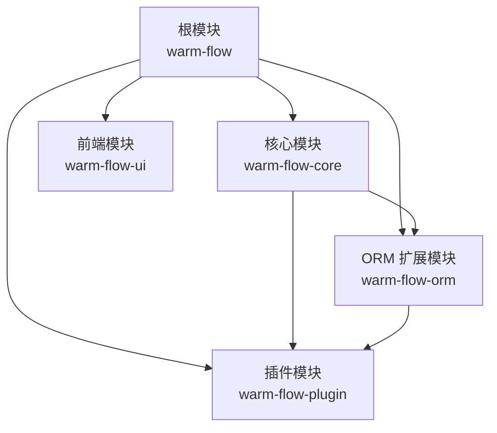
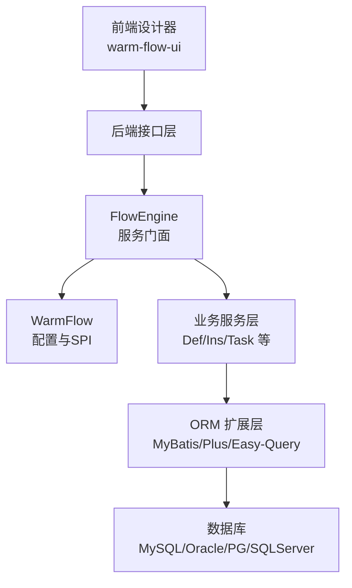
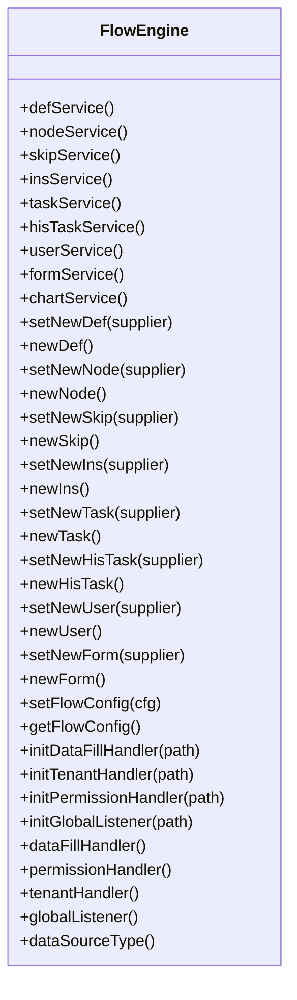
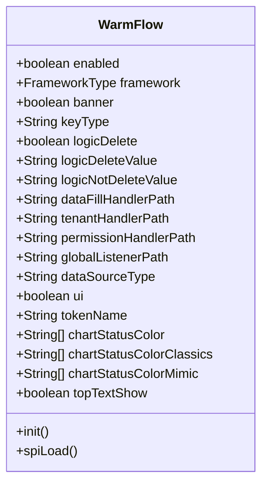
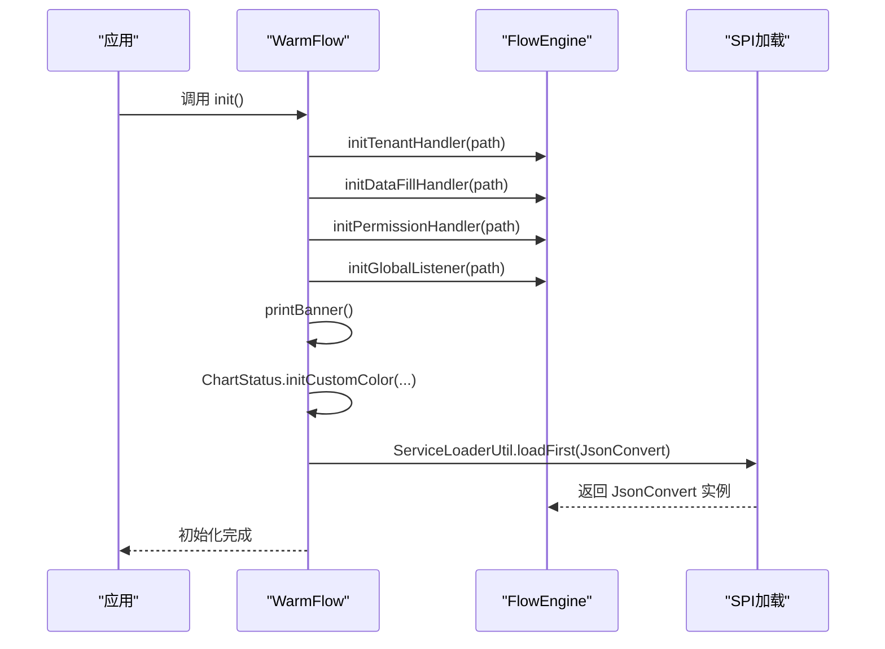
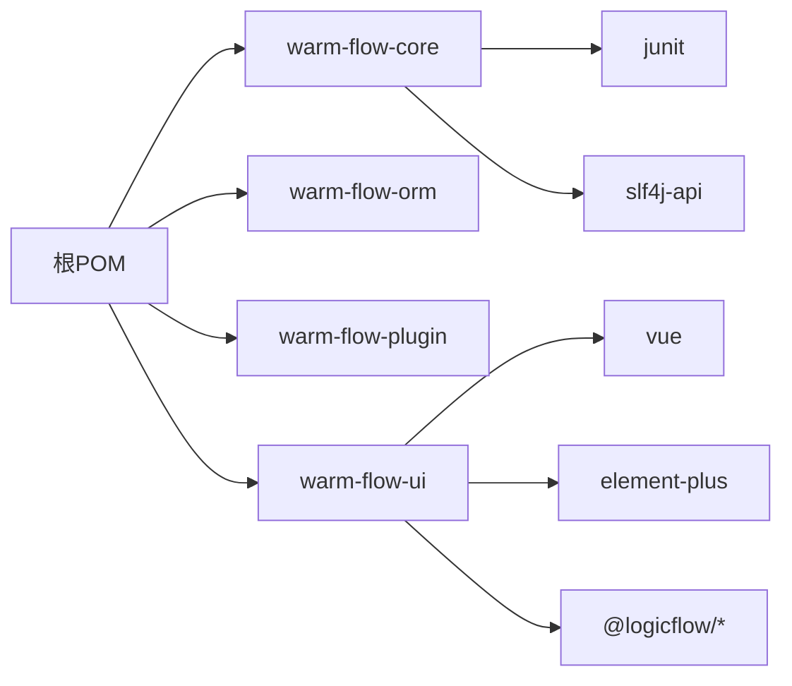

# 开发指南

<cite>
**本文引用的文件**
- [根 POM 文件](file://pom.xml)
- [核心模块 POM 文件](file://warm-flow-core/pom.xml)
- [核心引擎类 FlowEngine](file://warm-flow-core/src/main/java/org/dromara/warm/flow/core/FlowEngine.java)
- [核心配置类 WarmFlow](file://warm-flow-core/src/main/java/org/dromara/warm/flow/core/config/WarmFlow.java)
- [UI 包管理配置 package.json](file://warm-flow-ui/package.json)
- [编辑器配置 .editorconfig](file://.editorconfig)
- [Gitee 提交模板](file://.gitee/PULL_REQUEST_TEMPLATE.zh-CN.md)
- [Gitee 问题模板](file://.gitee/ISSUE_TEMPLATE.zh-CN.md)
- [项目自述 README](file://README.md)
- [数据库脚本目录](file://sql/)
</cite>

## 目录
1. [简介](#简介)
2. [项目结构](#项目结构)
3. [核心组件](#核心组件)
4. [架构总览](#架构总览)
5. [详细组件分析](#详细组件分析)
6. [依赖关系分析](#依赖关系分析)
7. [性能考虑](#性能考虑)
8. [测试指南](#测试指南)
9. [调试与开发工具](#调试与开发工具)
10. [代码风格与最佳实践](#代码风格与最佳实践)
11. [贡献流程与分支管理](#贡献流程与分支管理)
12. [故障排查](#故障排查)
13. [结论](#结论)

## 简介
本开发指南面向 Warm-Flow 的贡献者与二次开发者，覆盖开发环境准备、IDE 配置、依赖安装、项目导入、核心组件与架构理解、测试策略、调试技巧、代码风格与最佳实践，以及贡献流程与分支管理。Warm-Flow 是一个简洁、可扩展、支持多 ORM 与多框架的国产工作流引擎，提供流程设计器与流程图能力，并支持多数据库与多租户。

## 项目结构
项目采用 Maven 多模块结构，核心模块包括：
- warm-flow-core：核心引擎与通用能力
- warm-flow-orm：ORM 扩展模块（MyBatis、MyBatis-Plus、Easy-Query 等）
- warm-flow-plugin：插件生态（表达式、JSON 实现、UI 插件等）
- warm-flow-ui：前端设计器与资源
- 根 POM：统一版本与依赖管理、构建与发布配置

图表来源
- [根 POM 文件](file://pom.xml)
- [核心模块 POM 文件](file://warm-flow-core/pom.xml)

章节来源
- [根 POM 文件](file://pom.xml)
- [项目自述 README](file://README.md)

## 核心组件
- FlowEngine：流程引擎入口，提供服务获取、实体构造器注入、处理器初始化、全局配置注入等能力。
- WarmFlow：核心配置类，负责框架类型、数据源类型、逻辑删除、UI 开关、SPI 加载 JSON 转换器、状态颜色等配置项的初始化。

章节来源
- [核心引擎类 FlowEngine:39-270](file://warm-flow-core/src/main/java/org/dromara/warm/flow/core/FlowEngine.java#L39-L270)
- [核心配置类 WarmFlow:36-174](file://warm-flow-core/src/main/java/org/dromara/warm/flow/core/config/WarmFlow.java#L36-L174)

## 架构总览
Warm-Flow 通过 FlowEngine 统一对外暴露服务接口，WarmFlow 负责初始化与装配各类处理器与 SPI 实现。ORM 扩展模块提供多框架适配，插件模块提供表达式、JSON、UI 等能力扩展，前端模块提供可视化设计器与流程图展示。

图表来源
- [核心引擎类 FlowEngine:39-270](file://warm-flow-core/src/main/java/org/dromara/warm/flow/core/FlowEngine.java#L39-L270)
- [核心配置类 WarmFlow:36-174](file://warm-flow-core/src/main/java/org/dromara/warm/flow/core/config/WarmFlow.java#L36-L174)
- [根 POM 文件](file://pom.xml)

## 详细组件分析

### FlowEngine 组件分析
- 服务门面：通过静态方法获取 DefService、NodeService、SkipService、InsService、TaskService、HisTaskService、UserService、FormService、ChartService。
- 实体工厂：通过 Supplier 注入 Definition、Node、Skip、Instance、Task、HisTask、User、Form 的构造器，便于替换实现。
- 处理器初始化：支持 DataFillHandler、TenantHandler、PermissionHandler、GlobalListener 的初始化与注入。
- 配置桥接：通过 WarmFlow 获取数据源类型、UI 开关等配置；通过 FrameInvoker 从框架容器获取 Bean。

图表来源
- [核心引擎类 FlowEngine:39-270](file://warm-flow-core/src/main/java/org/dromara/warm/flow/core/FlowEngine.java#L39-L270)

章节来源
- [核心引擎类 FlowEngine:39-270](file://warm-flow-core/src/main/java/org/dromara/warm/flow/core/FlowEngine.java#L39-L270)

### WarmFlow 组件分析
- 配置项：enabled、framework、banner、keyType、logicDelete、logicDeleteValue、logicNotDeleteValue、dataFillHandlerPath、tenantHandlerPath、permissionHandlerPath、globalListenerPath、dataSourceType、ui、tokenName、chartStatusColor、chartStatusColorClassics、chartStatusColorMimic、topTextShow。
- 初始化流程：设置租户、数据填充、权限处理、全局监听器；打印 Banner；初始化流程状态颜色；SPI 加载 JSON 转换器。

图表来源
- [核心配置类 WarmFlow:36-174](file://warm-flow-core/src/main/java/org/dromara/warm/flow/core/config/WarmFlow.java#L36-L174)

章节来源
- [核心配置类 WarmFlow:36-174](file://warm-flow-core/src/main/java/org/dromara/warm/flow/core/config/WarmFlow.java#L36-L174)

### WarmFlow 初始化流程（序列图）

图表来源
- [核心配置类 WarmFlow:130-157](file://warm-flow-core/src/main/java/org/dromara/warm/flow/core/config/WarmFlow.java#L130-L157)
- [核心引擎类 FlowEngine:180-222](file://warm-flow-core/src/main/java/org/dromara/warm/flow/core/FlowEngine.java#L180-L222)

## 依赖关系分析
- 根 POM 管理多模块与版本，统一依赖管理（Spring Boot/Solon、MyBatis/Plus、Easy-Query、Jackson/Gson/Fastjson、日志等）。
- 核心模块依赖 JUnit 与 SLF4J，供测试与日志使用。
- UI 模块使用 Vite、Vue3、Element Plus、LogicFlow 等技术栈。

图表来源
- [根 POM 文件](file://pom.xml)
- [核心模块 POM 文件](file://warm-flow-core/pom.xml)
- [UI 包管理配置 package.json:17-39](file://warm-flow-ui/package.json#L17-L39)

章节来源
- [根 POM 文件](file://pom.xml)
- [核心模块 POM 文件](file://warm-flow-core/pom.xml)
- [UI 包管理配置 package.json:1-42](file://warm-flow-ui/package.json#L1-L42)

## 性能考虑
- ORM 层支持 MyBatis、MyBatis-Plus、Easy-Query 等，建议根据业务规模与复杂度选择合适实现。
- WarmFlow 支持逻辑删除与多租户，合理配置可降低无效数据扫描成本。
- UI 设计器与流程图渲染建议在生产构建时启用压缩与缓存策略（Vite 插件已包含压缩插件）。

## 测试指南
- 单元测试：核心模块依赖 JUnit，可在 warm-flow-core 中新增测试类验证服务与工具类行为。
- 集成测试：结合 warm-flow-orm 各 Starter 或 Solon 插件，验证不同 ORM 框架下的流程执行。
- 性能测试：可基于 warm-flow-ui 的设计器与流程图渲染进行前端性能压测；后端可结合不同 ORM 实现进行吞吐对比。
- 数据库脚本：首次导入与版本升级脚本位于 sql 目录，建议在测试环境执行以验证迁移与兼容性。

章节来源
- [根 POM 文件](file://pom.xml)
- [项目自述 README](file://README.md)
- [数据库脚本目录](file://sql/)

## 调试与开发工具
- IDE 配置：建议使用支持 EditorConfig 的 IDE（如 IntelliJ IDEA），启用 EditorConfig 规则以统一缩进与编码。
- 编辑器配置：遵循 .editorconfig 统一缩进、字符集与换行符。
- 前端开发：warm-flow-ui 使用 Vite，提供 dev/build/preview 脚本，建议使用 Yarn 并在本地安装依赖后运行 dev。
- 后端开发：使用 Maven 导入根 POM，确保 Java 版本与依赖解析正确。

章节来源
- [.editorconfig](file://.editorconfig)
- [UI 包管理配置 package.json:8-12](file://warm-flow-ui/package.json#L8-L12)

## 代码风格与最佳实践
- 缩进与编码：统一使用空格缩进、UTF-8 编码、LF 换行，避免尾随空白。
- 日志与断言：使用 SLF4J 输出日志，使用断言工具进行前置校验。
- 配置与 SPI：通过 WarmFlow 集中管理配置，必要时使用 SPI 扩展 JSON 转换器等实现。
- 实体与服务：通过 FlowEngine 的实体工厂注入自定义实现，保持服务接口稳定。

章节来源
- [.editorconfig](file://.editorconfig)
- [核心配置类 WarmFlow:130-157](file://warm-flow-core/src/main/java/org/dromara/warm/flow/core/config/WarmFlow.java#L130-L157)
- [核心引擎类 FlowEngine:108-170](file://warm-flow-core/src/main/java/org/dromara/warm/flow/core/FlowEngine.java#L108-L170)

## 贡献流程与分支管理
- 分支策略：PR 提交至 dev 分支，遵循 Gitee 提交模板与问题模板。
- 提交规范：参考 README 中的提交类型规范（init/feat/fix/perf/refactor/revert/style/update/upgrade）。
- PR 模板：在 PR 描述中说明“解决的问题”、“改动逻辑”、“测试情况”。

章节来源
- [Gitee 提交模板](file://.gitee/PULL_REQUEST_TEMPLATE.zh-CN.md)
- [Gitee 问题模板](file://.gitee/ISSUE_TEMPLATE.zh-CN.md)
- [项目自述 README](file://README.md)

## 故障排查
- 数据库初始化：首次导入与版本升级请执行 sql 目录中的脚本，确保表结构与数据一致。
- 配置检查：确认 WarmFlow 的数据源类型、UI 开关、逻辑删除配置与实际环境一致。
- 处理器与监听器：若权限或租户逻辑异常，检查相应处理器路径是否正确配置并可被容器加载。
- UI 访问：前端本地开发需安装依赖并运行 dev 脚本；生产构建使用 build:prod。

章节来源
- [项目自述 README](file://README.md)
- [数据库脚本目录](file://sql/)
- [核心配置类 WarmFlow:130-157](file://warm-flow-core/src/main/java/org/dromara/warm/flow/core/config/WarmFlow.java#L130-L157)
- [核心引擎类 FlowEngine:180-222](file://warm-flow-core/src/main/java/org/dromara/warm/flow/core/FlowEngine.java#L180-L222)
- [UI 包管理配置 package.json:8-12](file://warm-flow-ui/package.json#L8-L12)

## 结论
Warm-Flow 提供了清晰的模块划分与可扩展架构，开发者可基于核心引擎与配置类快速集成到不同框架与 ORM 实现中。建议在开发过程中严格遵循代码风格、测试策略与贡献流程，配合完善的数据库脚本与 UI 工具链，高效完成功能开发与问题定位。