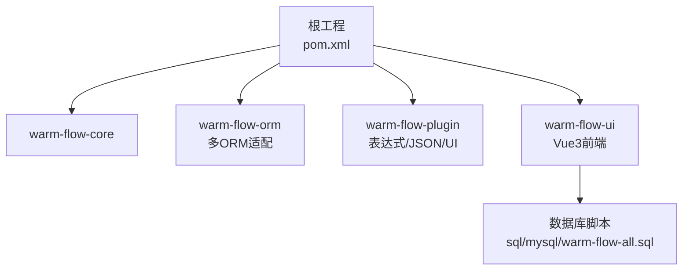
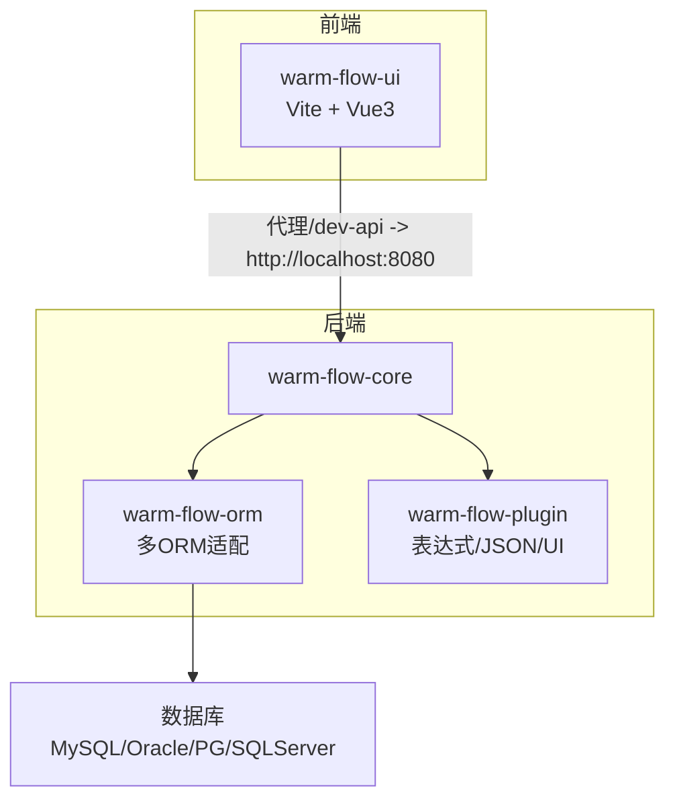
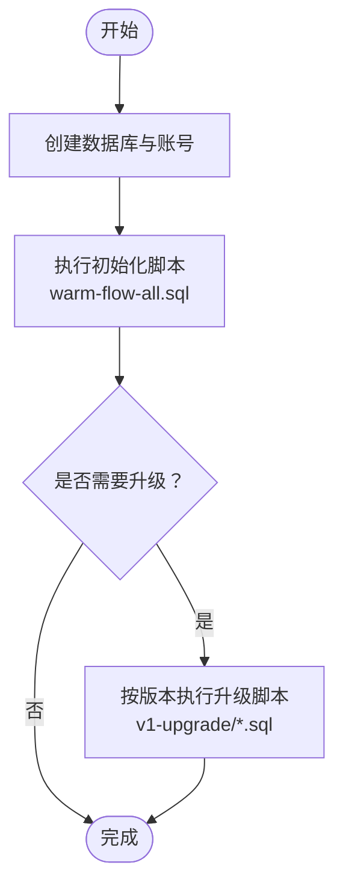
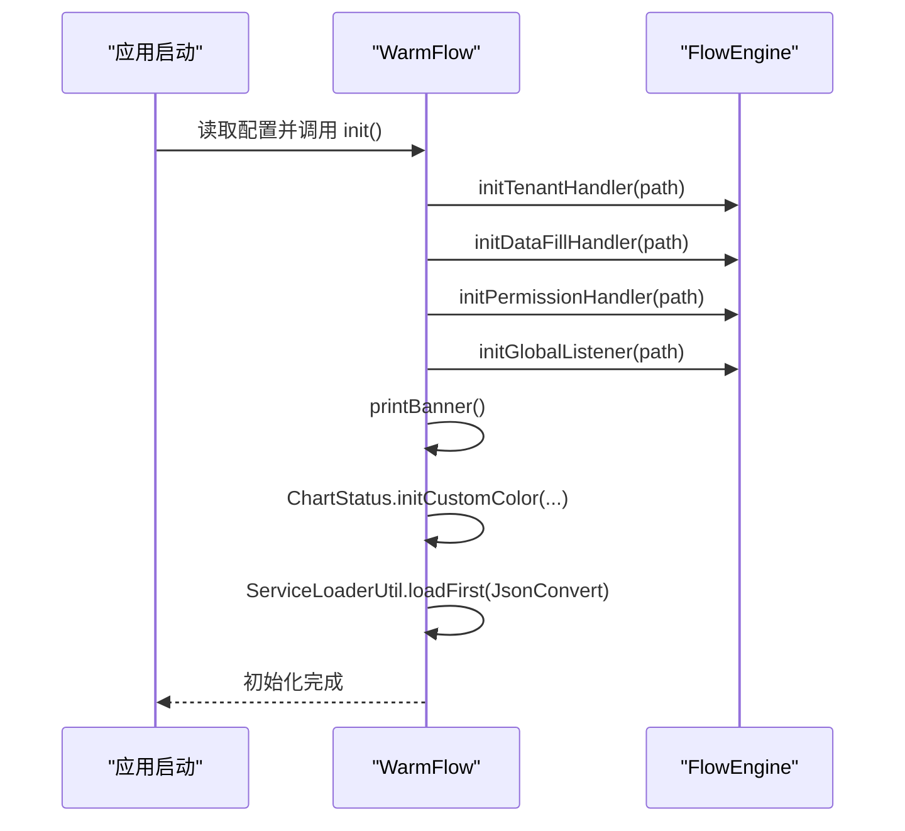

# 开发环境搭建

<cite>
**本文引用的文件**
- [pom.xml](file://pom.xml)
- [README.md](file://README.md)
- [warm-flow-all.sql](file://sql/mysql/warm-flow-all.sql)
- [package.json](file://warm-flow-ui/package.json)
- [vite.config.js](file://warm-flow-ui/vite.config.js)
- [.editorconfig](file://.editorconfig)
- [.gitignore](file://warm-flow-ui/.gitignore)
- [WarmFlow.java](file://warm-flow-core/src/main/java/org/dromara/warm/flow/core/config/WarmFlow.java)
</cite>

## 目录
1. [简介](#简介)
2. [项目结构](#项目结构)
3. [核心组件](#核心组件)
4. [架构总览](#架构总览)
5. [详细组件分析](#详细组件分析)
6. [依赖关系分析](#依赖关系分析)
7. [性能考虑](#性能考虑)
8. [故障排查指南](#故障排查指南)
9. [结论](#结论)
10. [附录](#附录)

## 简介
本指南面向 Warm-Flow 的本地开发环境搭建，覆盖硬件与软件要求、数据库准备、项目克隆与依赖安装、IDE 配置、开发工具链（Git、构建工具、代理）以及常见问题排查。文档同时给出与实际源码映射的架构与流程图，帮助开发者快速理解并落地开发环境。

## 项目结构
Warm-Flow 采用多模块 Maven 结构，核心模块包括：
- warm-flow-core：核心引擎与通用能力
- warm-flow-orm：ORM 生态适配（MyBatis、MyBatis-Plus、Easy-Query 等）
- warm-flow-plugin：插件生态（表达式、JSON 实现、UI 插件等）
- warm-flow-ui：Vue3 前端设计器与可视化界面
- sql：多数据库初始化与升级脚本

图表来源
- [pom.xml](file://pom.xml)
- [warm-flow-all.sql](file://sql/mysql/warm-flow-all.sql)

章节来源
- [pom.xml](file://pom.xml)
- [README.md](file://README.md)

## 核心组件
- Java 与构建
  - Java 版本：源码编译目标为 Java 8；同时提供 Java 17 路径属性，便于本地 JDK 切换与工具链使用。
  - 构建工具：Maven（根 POM 提供统一版本与 profile）。
- Spring/Solon 生态
  - Spring Boot 2.7、Spring Boot 3、Spring Boot 4 与 Solon 多框架兼容。
- ORM 生态
  - MyBatis、MyBatis-Plus、Easy-Query 等多 ORM 支持。
- JSON 实现
  - Jackson、Jackson3、Fastjson、Gson 等多实现可选。
- 前端
  - Vue3 + Vite，提供设计器与可视化界面。
- 数据库
  - MySQL、Oracle、PostgreSQL、SQL Server；提供初始化与升级脚本。

章节来源
- [pom.xml](file://pom.xml)
- [README.md](file://README.md)

## 架构总览
整体开发环境由后端（warm-flow-core/orm/plugin）、前端（warm-flow-ui）与数据库（MySQL/Oracle/PG/SQLServer）组成。前端通过 Vite 代理访问后端接口，后端根据配置选择 ORM 与框架生态。

图表来源
- [vite.config.js](file://warm-flow-ui/vite.config.js)
- [pom.xml](file://pom.xml)

## 详细组件分析

### 硬件与软件要求
- 操作系统：Windows/Linux/macOS（建议使用最新 LTS 版本）
- JDK
  - 源码编译目标：Java 8
  - 运行与工具链：可使用 Java 17（根 POM 提供 java17.path 属性）
- IDE：IntelliJ IDEA 或 VS Code（配合 EditorConfig 与插件）
- 数据库：MySQL 8.0.33（推荐），或 Oracle、PostgreSQL、SQL Server
- 前端运行：Node.js（随包管理器 Yarn 使用）

章节来源
- [pom.xml](file://pom.xml)
- [package.json](file://warm-flow-ui/package.json)

### 数据库环境与初始化
- 初始化脚本位置：sql/mysql/warm-flow-all.sql
- 更新脚本：sql/mysql/v1-upgrade 下按版本执行
- 建议步骤
  1) 创建数据库与账号
  2) 执行全量脚本初始化
  3) 如需升级，按版本目录执行对应升级脚本

图表来源
- [warm-flow-all.sql](file://sql/mysql/warm-flow-all.sql)
- [README.md](file://README.md)

章节来源
- [warm-flow-all.sql](file://sql/mysql/warm-flow-all.sql)
- [README.md](file://README.md)

### 项目克隆与依赖安装
- 克隆仓库后，按顺序执行：
  1) Maven 安装后端依赖（warm-flow-core、warm-flow-orm、warm-flow-plugin）
  2) 前端安装依赖（warm-flow-ui）
  3) 数据库初始化（见“数据库环境与初始化”）
- 注意事项
  - 若网络受限，可配置 Maven 代理或镜像
  - 前端依赖安装失败时，检查 Node.js 与包管理器版本

章节来源
- [pom.xml](file://pom.xml)
- [package.json](file://warm-flow-ui/package.json)

### IDE 配置指南
- EditorConfig
  - 统一缩进与换行：空格缩进、缩进大小 4、LF 结尾、UTF-8
  - 针对 JSON/YAML/JS 等文件使用更小缩进
- 插件推荐
  - Lombok（简化实体类）
  - Alibaba Java Coding Guidelines（代码规范）
  - EditorConfig（保持一致风格）
  - Vue Language Features（Volar/Vetur，视 IDE 而定）
- 调试配置
  - 后端：选择 warm-flow-core 或具体 Starter 模块作为入口，配置 VM 参数与环境变量
  - 前端：使用 Vite 开发服务器（端口 8083），通过代理访问后端

章节来源
- [.editorconfig](file://.editorconfig)
- [vite.config.js](file://warm-flow-ui/vite.config.js)

### 开发工具链配置
- Git
  - 提交规范：feat/fix/perf/refactor/revert/style/update/upgrade 等
- 构建工具
  - Maven：clean package -DskipTests（跳过测试打包）
  - 前端：yarn dev（开发）、yarn build:prod（生产构建）
- 热部署与代理
  - 前端 Vite 代理：/dev-api -> http://localhost:8080
  - 后端热部署：可结合 DevTools 或 Spring Boot DevTools（按需启用）

章节来源
- [README.md](file://README.md)
- [vite.config.js](file://warm-flow-ui/vite.config.js)
- [package.json](file://warm-flow-ui/package.json)

### 关键配置与启动流程
WarmFlow 属性配置类负责初始化租户、数据填充、权限、监听器、UI 开关与状态颜色等。其初始化流程如下：

图表来源
- [WarmFlow.java](file://warm-flow-core/src/main/java/org/dromara/warm/flow/core/config/WarmFlow.java)

章节来源
- [WarmFlow.java](file://warm-flow-core/src/main/java/org/dromara/warm/flow/core/config/WarmFlow.java)

## 依赖关系分析
- 版本与模块
  - Spring Boot 2.7、3、4 与 Solon 并存，ORM 与 JSON 实现可按需切换
  - 多模块聚合管理，统一版本与插件配置
- 前后端交互
  - 前端通过 /dev-api 代理访问后端 8080 端口，避免跨域与本地联调问题

图表来源
- [vite.config.js](file://warm-flow-ui/vite.config.js)
- [pom.xml](file://pom.xml)

章节来源
- [pom.xml](file://pom.xml)
- [vite.config.js](file://warm-flow-ui/vite.config.js)

## 性能考虑
- 依赖精简：按需引入 ORM 与 JSON 实现，避免冗余依赖
- 前端资源：合理拆分打包，关注 chunkSizeWarningLimit 配置
- 数据库：索引与分页策略（ORM 模块已适配多数据库方言）

## 故障排查指南
- 前端依赖安装失败
  - 检查 Node.js 与 Yarn 版本，清理缓存后重试
  - 参考前端 .gitignore 中排除 node_modules、yarn.lock 等
- 前端无法访问后端接口
  - 确认 Vite 代理配置与后端端口（默认 8080）
  - 检查 /dev-api 代理是否正确指向后端
- 数据库连接异常
  - 确认数据库已初始化（执行 warm-flow-all.sql）
  - 检查连接串、账号与权限
- 编码与换行问题
  - 使用 EditorConfig 统一缩进与换行（LF、UTF-8）
- Java 版本不匹配
  - 源码目标为 Java 8；若使用更高版本 JDK，请确认编译与运行兼容性

章节来源
- [.gitignore](file://warm-flow-ui/.gitignore)
- [.editorconfig](file://.editorconfig)
- [vite.config.js](file://warm-flow-ui/vite.config.js)
- [warm-flow-all.sql](file://sql/mysql/warm-flow-all.sql)

## 结论
按照本指南完成硬件与软件准备、数据库初始化、前后端依赖安装与 IDE 配置后，即可顺利开展 Warm-Flow 的二次开发与集成。建议优先使用 Java 8 与 Maven 清晰的模块划分进行开发，并通过 EditorConfig 与 IDE 插件保证代码风格一致。

## 附录
- 常用命令
  - Maven：mvn clean package -DskipTests
  - 前端：yarn dev / yarn build:prod
- 提交规范参考
  - init/feat/fix/perf/refactor/revert/style/update/upgrade