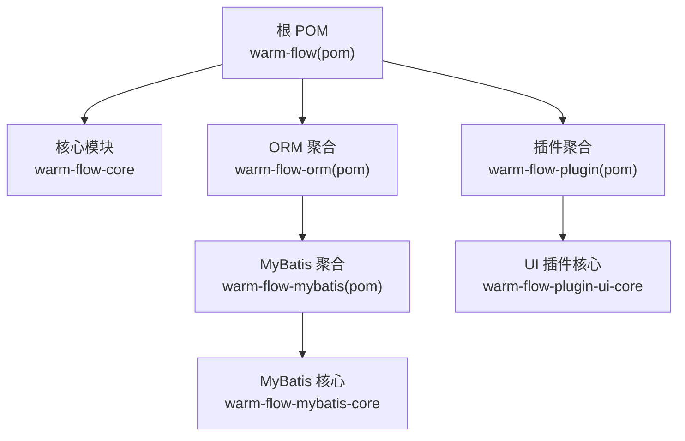
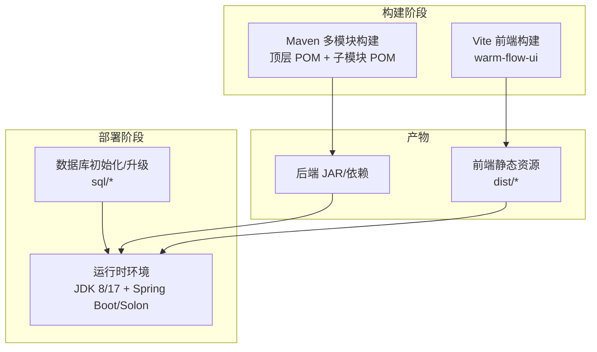
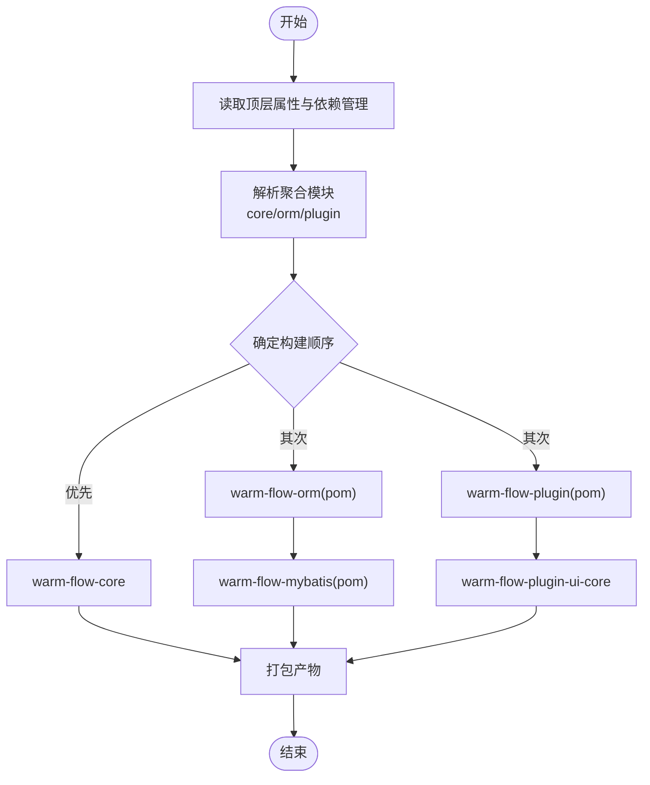
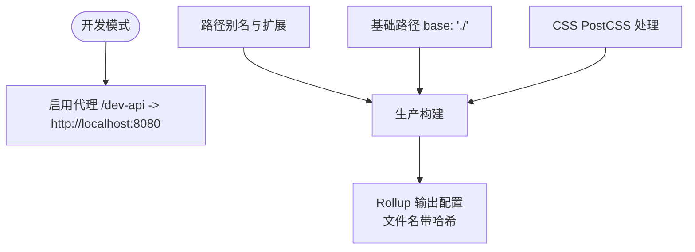
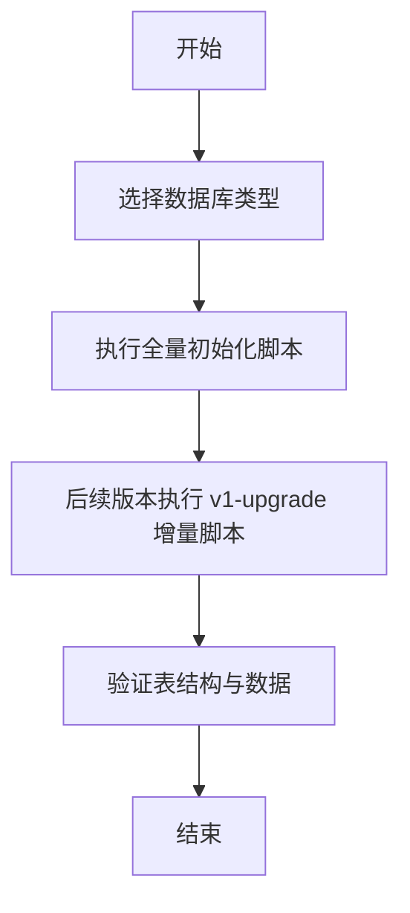
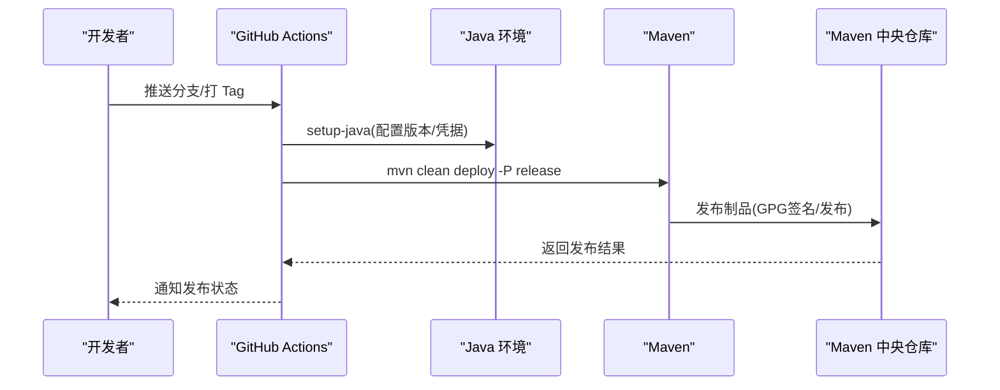
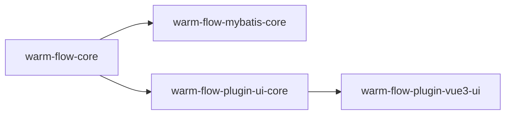

# 构建与部署

<cite>
**本文引用的文件**   
- [根 POM](file://pom.xml)
- [核心模块 POM](file://warm-flow-core/pom.xml)
- [ORM 聚合 POM](file://warm-flow-orm/pom.xml)
- [ORM(MyBatis) 聚合 POM](file://warm-flow-orm/warm-flow-mybatis/pom.xml)
- [ORM(MyBatis) 核心 POM](file://warm-flow-orm/warm-flow-mybatis/warm-flow-mybatis-core/pom.xml)
- [插件聚合 POM](file://warm-flow-plugin/pom.xml)
- [UI 插件核心 POM](file://warm-flow-plugin/warm-flow-plugin-ui/warm-flow-plugin-ui-core/pom.xml)
- [前端 Vite 配置](file://warm-flow-ui/vite.config.js)
- [前端包管理配置](file://warm-flow-ui/package.json)
- [GitHub Actions 发布工作流](file://.github/workflows/release.yml)
- [项目总览说明](file://README.md)
- [数据库脚本目录](file://sql/)
</cite>

## 目录
1. [简介](#简介)
2. [项目结构](#项目结构)
3. [核心组件](#核心组件)
4. [架构总览](#架构总览)
5. [详细组件分析](#详细组件分析)
6. [依赖关系分析](#依赖关系分析)
7. [性能考虑](#性能考虑)
8. [故障排查指南](#故障排查指南)
9. [结论](#结论)
10. [附录](#附录)

## 简介
本章节面向 Warm-Flow 的构建与部署，覆盖 Maven 多模块构建顺序、前端打包配置、数据库初始化与升级脚本、CI/CD 工作流、以及不同部署方式（传统部署、容器化、云平台）的实践要点。文档同时给出部署后验证、监控与回滚策略、性能调优与安全加固建议，帮助团队在生产环境中稳定交付与运维。

## 项目结构
Warm-Flow 采用 Maven 聚合工程组织，顶层 POM 管理版本与插件，核心模块包括：
- warm-flow-core：核心引擎与实体、服务、工具
- warm-flow-orm：ORM 生态聚合（MyBatis、MyBatis-Plus、Easy-Query）
- warm-flow-plugin：插件生态聚合（JSON 实现、表达式模式、UI 插件）

前端位于 warm-flow-ui，使用 Vite 构建，产出静态资源供后端或独立部署使用。

图表来源
- [根 POM:58-62](file://pom.xml#L58-L62)
- [ORM 聚合 POM:17-21](file://warm-flow-orm/pom.xml#L17-L21)
- [ORM(MyBatis) 聚合 POM:17-23](file://warm-flow-orm/warm-flow-mybatis/pom.xml#L17-L23)
- [核心模块 POM:1-35](file://warm-flow-core/pom.xml#L1-L35)
- [UI 插件核心 POM:1-36](file://warm-flow-plugin/warm-flow-plugin-ui/warm-flow-plugin-ui-core/pom.xml#L1-L36)

章节来源
- [根 POM:58-62](file://pom.xml#L58-L62)
- [ORM 聚合 POM:1-24](file://warm-flow-orm/pom.xml#L1-L24)
- [ORM(MyBatis) 聚合 POM:1-26](file://warm-flow-orm/warm-flow-mybatis/pom.xml#L1-L26)
- [核心模块 POM:1-35](file://warm-flow-core/pom.xml#L1-L35)
- [插件聚合 POM:1-25](file://warm-flow-plugin/pom.xml#L1-L25)
- [UI 插件核心 POM:1-36](file://warm-flow-plugin/warm-flow-plugin-ui/warm-flow-plugin-ui-core/pom.xml#L1-L36)

## 核心组件
- 核心引擎与工具：提供流程定义、实例、任务、节点、用户、跳过、表单等实体与服务接口，以及通用工具与异常体系。
- ORM 生态：提供 MyBatis、MyBatis-Plus、Easy-Query 三种实现，配套 Spring Boot/Solon Starter 与插件，适配多框架与多数据库。
- 插件生态：JSON 序列化插件、表达式模式插件（SpEL/自定义）、UI 插件（Vue3 设计器与后端 Web 集成）。
- 前端 UI：基于 Vue 3 + Element Plus 的流程设计器与表单设计器，使用 Vite 构建，支持代理与静态资源输出。

章节来源
- [核心模块 POM:16-33](file://warm-flow-core/pom.xml#L16-L33)
- [ORM(MyBatis) 核心 POM:16-31](file://warm-flow-orm/warm-flow-mybatis/warm-flow-mybatis-core/pom.xml#L16-L31)
- [UI 插件核心 POM:16-33](file://warm-flow-plugin/warm-flow-plugin-ui/warm-flow-plugin-ui-core/pom.xml#L16-L33)
- [前端 Vite 配置:1-71](file://warm-flow-ui/vite.config.js#L1-L71)
- [前端包管理配置:1-42](file://warm-flow-ui/package.json#L1-L42)

## 架构总览
下图展示从源码到产物的关键路径：Maven 多模块构建 → 前端 Vite 打包 → 数据库脚本准备 → 部署与运行。

图表来源
- [根 POM:58-62](file://pom.xml#L58-L62)
- [前端 Vite 配置:15-25](file://warm-flow-ui/vite.config.js#L15-L25)
- [数据库脚本目录](file://sql/)

## 详细组件分析

### Maven 构建配置与多模块顺序
- 版本与属性：顶层 POM 统一管理 Java 版本（JDK 8/17 可选）、Spring Boot/Solon 版本、ORM 与 JSON 库版本等。
- 依赖管理：通过 dependencyManagement 集中声明各子模块依赖，避免版本漂移。
- 插件：提供源码打包、JAR 清单信息、发布到 Maven 中央仓库的 GPG 与发布插件（release profile）。
- 模块顺序：顶层聚合模块包含 core、orm、plugin 三大模块；各子模块内部再细分具体实现模块（如 MyBatis 聚合内含 core 与多个 Starter/Plugin）。

图表来源
- [根 POM:64-102](file://pom.xml#L64-L102)
- [根 POM:58-62](file://pom.xml#L58-L62)
- [ORM 聚合 POM:17-21](file://warm-flow-orm/pom.xml#L17-L21)
- [插件聚合 POM:17-21](file://warm-flow-plugin/pom.xml#L17-L21)

章节来源
- [根 POM:64-102](file://pom.xml#L64-L102)
- [根 POM:104-433](file://pom.xml#L104-L433)
- [根 POM:435-463](file://pom.xml#L435-L463)
- [根 POM:465-525](file://pom.xml#L465-L525)
- [根 POM:527-535](file://pom.xml#L527-L535)

### 前端打包配置（Vite）
- 基础路径：使用相对路径 base: "./"，便于部署到子路径。
- 构建输出：rollupOptions 输出 JS/CSS/资源命名带哈希，利于缓存控制。
- 别名与扩展：配置 @ 指向 src，支持常见扩展名。
- 开发服务器：端口 8083，开启本地代理 /dev-api 指向后端 8080。
- CSS 处理：移除 @charset 规则以避免警告。

图表来源
- [前端 Vite 配置:12-14](file://warm-flow-ui/vite.config.js#L12-L14)
- [前端 Vite 配置:16-25](file://warm-flow-ui/vite.config.js#L16-L25)
- [前端 Vite 配置:26-37](file://warm-flow-ui/vite.config.js#L26-L37)
- [前端 Vite 配置:39-51](file://warm-flow-ui/vite.config.js#L39-L51)
- [前端 Vite 配置:53-68](file://warm-flow-ui/vite.config.js#L53-L68)

章节来源
- [前端 Vite 配置:1-71](file://warm-flow-ui/vite.config.js#L1-L71)
- [前端包管理配置:8-12](file://warm-flow-ui/package.json#L8-L12)

### 数据库准备与升级
- 数据库类型：支持 MySQL、Oracle、PostgreSQL、SQL Server；其他数据库只需转换表结构即可使用 MyBatis/MyBatis-Plus/Easy-Query。
- 初始化脚本：首次导入需执行对应数据库的全量脚本；版本升级时执行对应 v1-upgrade 下的增量脚本。
- 脚本位置：sql/mysql、sql/oracle、sql/postgresql、sql/sqlserver。

图表来源
- [项目总览说明:67-68](file://README.md#L67-L68)
- [数据库脚本目录](file://sql/)

章节来源
- [项目总览说明:111-118](file://README.md#L111-L118)
- [项目总览说明:67-68](file://README.md#L67-L68)
- [数据库脚本目录](file://sql/)

### CI/CD 流程配置（GitHub Actions）
- 当前仓库包含 release.yml，注释掉的配置展示了使用 Java 环境、GPG 秘钥与 OSSRH 凭据，执行 mvn clean deploy -P release 的流程。
- 建议：在实际使用时取消注释，并在仓库 Secrets 中配置 OSSRH_USER、OSSRH_PASSWORD、GPG_SECRET、GPG_PASSWORD。

图表来源
- [GitHub Actions 发布工作流:1-42](file://.github/workflows/release.yml#L1-L42)

章节来源
- [GitHub Actions 发布工作流:1-42](file://.github/workflows/release.yml#L1-L42)

### 部署方式指南

#### 传统部署（JAR + 外置数据库）
- 步骤概览
  - 后端：使用 Maven 构建得到 JAR 与依赖，配合 Spring Boot 或 Solon 启动。
  - 前端：使用 Vite 生产构建，将 dist 目录静态资源部署至 Nginx/Apache。
  - 数据库：根据目标数据库类型执行初始化与升级脚本。
- 关键点
  - 选择合适的 ORM Starter/Plugin 与 JSON 实现，保证与运行框架一致。
  - 配置数据库连接池（如 HikariCP）与连接参数。
  - 将前端静态资源映射到后端路由，确保 /dev-api 代理正确指向后端服务。

章节来源
- [根 POM:76-83](file://pom.xml#L76-L83)
- [根 POM:146-237](file://pom.xml#L146-L237)
- [前端 Vite 配置:43-50](file://warm-flow-ui/vite.config.js#L43-L50)
- [数据库脚本目录](file://sql/)

#### Docker 容器化部署
- 思路
  - 后端：构建多阶段镜像，复制 JAR 与依赖，暴露端口，设置 JVM 参数。
  - 前端：使用 Nginx 镜像承载 dist 静态资源，反向代理 /dev-api 到后端。
  - 数据库：使用独立容器或云数据库服务。
- 注意事项
  - 明确 JAVA_OPTS/JVM 参数与日志输出路径。
  - 前端 Nginx 配置 base 与代理规则，确保与 Vite 构建产物一致。

章节来源
- [前端 Vite 配置:12-14](file://warm-flow-ui/vite.config.js#L12-L14)
- [前端 Vite 配置:43-50](file://warm-flow-ui/vite.config.js#L43-L50)

#### 云平台部署（Kubernetes/Docker Swarm/云容器服务）
- 建议
  - 使用 ConfigMap/Secret 管理配置与密钥。
  - 通过 Ingress/LoadBalancer 暴露服务，配置健康检查与灰度发布。
  - 数据库存储使用云托管服务，确保网络连通与备份策略。
- 与传统部署一致，重点在于编排与弹性扩缩容。

[本节为通用实践建议，无需特定文件引用]

### 部署后验证与监控
- 验证
  - 接口连通性：访问后端健康检查与业务接口。
  - 前端页面：确认设计器与表单设计器可用，静态资源加载正常。
  - 数据库：核对初始化/升级脚本执行结果与关键表状态。
- 监控
  - JVM 指标：堆内存、GC、线程数。
  - 应用指标：QPS、响应时间、错误率。
  - 日志：后端业务日志与前端错误日志。
- 回滚策略
  - 快照与镜像：保留上一版本的 JAR/Nginx 镜像与数据库快照。
  - 灰度回滚：逐步切换流量，观察指标后再决定是否完全回退。
- 应急处理
  - 紧急停机：关闭非必要服务，释放资源。
  - 数据库恢复：基于备份快速恢复，验证一致性。

[本节为通用实践建议，无需特定文件引用]

### 性能调优与安全加固
- 性能
  - JVM：合理设置堆大小、GC 参数，启用并行 GC。
  - 数据库：索引优化、慢查询分析、连接池参数调优。
  - 前端：资源压缩、缓存策略、CDN 加速。
- 安全
  - 传输安全：HTTPS、TLS 最低版本与加密套件。
  - 访问控制：鉴权与授权、CORS 白名单、敏感头过滤。
  - 依赖安全：定期扫描依赖漏洞，及时升级。

[本节为通用实践建议，无需特定文件引用]

## 依赖关系分析

图表来源
- [核心模块 POM:16-33](file://warm-flow-core/pom.xml#L16-L33)
- [ORM(MyBatis) 核心 POM:16-31](file://warm-flow-orm/warm-flow-mybatis/warm-flow-mybatis-core/pom.xml#L16-L31)
- [UI 插件核心 POM:16-33](file://warm-flow-plugin/warm-flow-plugin-ui/warm-flow-plugin-ui-core/pom.xml#L16-L33)

章节来源
- [核心模块 POM:16-33](file://warm-flow-core/pom.xml#L16-L33)
- [ORM(MyBatis) 核心 POM:16-31](file://warm-flow-orm/warm-flow-mybatis/warm-flow-mybatis-core/pom.xml#L16-L31)
- [UI 插件核心 POM:16-33](file://warm-flow-plugin/warm-flow-plugin-ui/warm-flow-plugin-ui-core/pom.xml#L16-L33)

## 性能考虑
- 构建性能
  - 并行构建：使用 Maven 并行构建能力，减少构建时间。
  - 缓存利用：利用本地/远程仓库缓存，避免重复下载。
- 运行性能
  - JVM 参数：根据业务峰值调整堆大小与 GC 策略。
  - 数据库连接池：合理配置最大连接数与超时时间。
  - 前端资源：开启 gzip/br 压缩，使用 CDN 分发静态资源。

[本节为通用实践建议，无需特定文件引用]

## 故障排查指南
- 构建失败
  - 检查 JDK 版本与 Maven 版本匹配，确认 release profile 是否正确激活。
  - 校验 GPG 密钥与 OSSRH 凭据是否配置正确。
- 前端构建异常
  - 确认 Node/Yarn 版本与 package.json 一致，清理 node_modules 后重试。
  - 检查 Vite 代理配置与后端服务端口是否一致。
- 数据库问题
  - 核对数据库类型与驱动版本，确保初始化/升级脚本执行成功。
- 部署后访问异常
  - 检查 Nginx/Apache 静态资源映射与 /dev-api 代理规则。
  - 查看后端日志与数据库连接状态。

章节来源
- [根 POM:465-525](file://pom.xml#L465-L525)
- [前端 Vite 配置:43-50](file://warm-flow-ui/vite.config.js#L43-L50)
- [前端包管理配置:30-39](file://warm-flow-ui/package.json#L30-L39)
- [项目总览说明:67-68](file://README.md#L67-L68)

## 结论
Warm-Flow 提供了清晰的多模块 Maven 架构与现代化的前端构建链路，配合完善的数据库脚本与可扩展的 ORM/插件生态，能够支撑从传统部署到容器化与云平台的多样化交付场景。建议在生产环境中结合 CI/CD 自动化发布、完善的监控与回滚策略，确保系统的稳定性与可维护性。

## 附录
- 数据库脚本位置：sql/mysql、sql/oracle、sql/postgresql、sql/sqlserver
- 前端构建命令：dev/build:prod/preview
- 发布命令：clean package/install/deploy（含 release profile）

章节来源
- [数据库脚本目录](file://sql/)
- [前端包管理配置:8-12](file://warm-flow-ui/package.json#L8-L12)
- [根 POM:527-535](file://pom.xml#L527-L535)