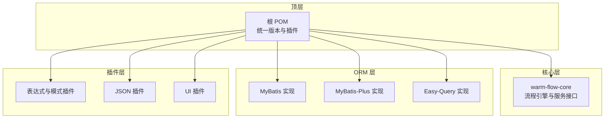
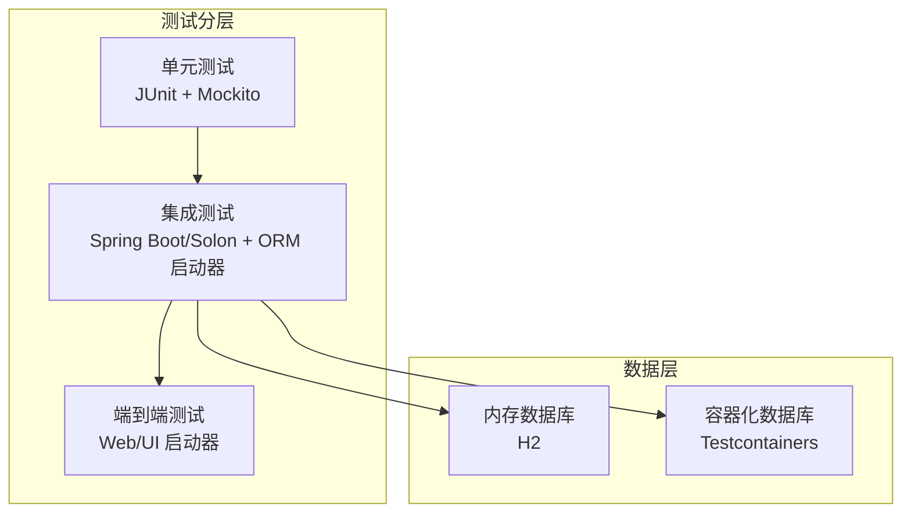
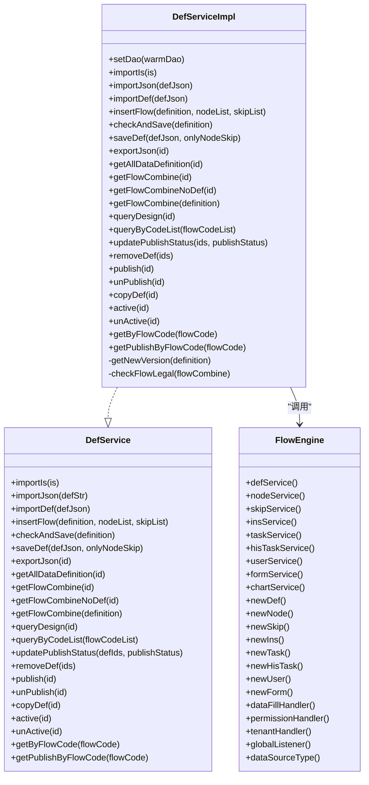
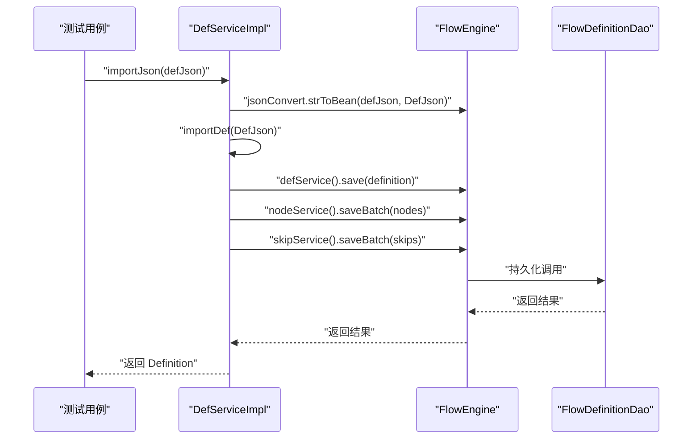
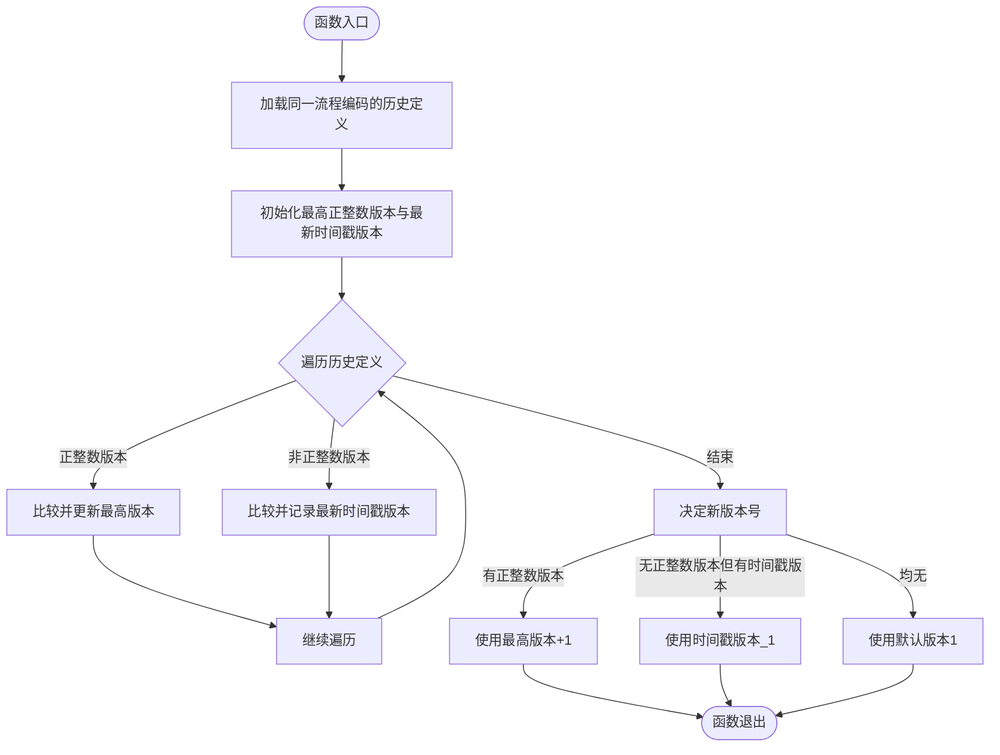
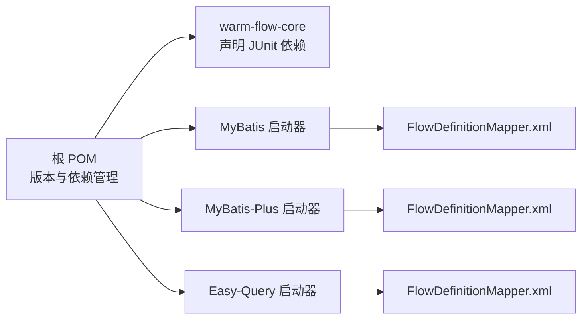

# 测试策略与实践

<cite>
**本文引用的文件**   
- [pom.xml](file://pom.xml)
- [warm-flow-core/pom.xml](file://warm-flow-core/pom.xml)
- [warm-flow-core/src/main/java/org/dromara/warm/flow/core/service/impl/DefServiceImpl.java](file://warm-flow-core/src/main/java/org/dromara/warm/flow/core/service/impl/DefServiceImpl.java)
- [warm-flow-core/src/main/java/org/dromara/warm/flow/core/service/DefService.java](file://warm-flow-core/src/main/java/org/dromara/warm/flow/core/service/DefService.java)
- [warm-flow-core/src/main/java/org/dromara/warm/flow/core/FlowEngine.java](file://warm-flow-core/src/main/java/org/dromara/warm/flow/core/FlowEngine.java)
- [warm-flow-orm/warm-flow-mybatis/warm-flow-mybatis-core/src/main/resources/warm/flow/FlowDefinitionMapper.xml](file://warm-flow-orm/warm-flow-mybatis/warm-flow-mybatis-core/src/main/resources/warm/flow/FlowDefinitionMapper.xml)
- [warm-flow-orm/warm-flow-mybatis-plus/warm-flow-mybatis-plus-core/src/main/resources/warm/flow/FlowDefinitionMapper.xml](file://warm-flow-orm/warm-flow-mybatis-plus/warm-flow-mybatis-plus-core/src/main/resources/warm/flow/FlowDefinitionMapper.xml)
- [warm-flow-orm/warm-flow-easy-query/warm-flow-easy-query-core/src/main/resources/warm/flow/FlowDefinitionMapper.xml](file://warm-flow-orm/warm-flow-easy-query/warm-flow-easy-query-core/src/main/resources/warm/flow/FlowDefinitionMapper.xml)
</cite>

## 目录
1. [引言](#引言)
2. [项目结构](#项目结构)
3. [核心组件](#核心组件)
4. [架构总览](#架构总览)
5. [详细组件分析](#详细组件分析)
6. [依赖分析](#依赖分析)
7. [性能考虑](#性能考虑)
8. [故障排查指南](#故障排查指南)
9. [结论](#结论)
10. [附录](#附录)

## 引言
本文件面向 Warm-Flow 项目，系统化阐述其测试策略与实践，覆盖测试分层（单元测试、集成测试、端到端测试）、测试框架选择与配置（JUnit、Mockito、Testcontainers 等）、测试用例编写规范、数据库测试策略（内存数据库、测试隔离、事务回滚）、性能与压力测试方法、测试覆盖率要求与监控，以及测试自动化与持续集成配置建议。文档以代码为依据，结合实际可落地的工程实践，帮助开发者高效构建高质量的测试体系。

## 项目结构
Warm-Flow 采用 Maven 多模块结构，核心模块 warm-flow-core 提供流程引擎与服务接口；ORM 层提供 MyBatis、MyBatis-Plus、Easy-Query 三种实现；插件层提供表达式、JSON 序列化、UI 等扩展能力。测试策略需围绕这些模块进行分层设计与实施。

图表来源
- [pom.xml:1-535](file://pom.xml#L1-L535)
- [warm-flow-core/pom.xml:1-35](file://warm-flow-core/pom.xml#L1-L35)

章节来源
- [pom.xml:58-62](file://pom.xml#L58-L62)
- [warm-flow-core/pom.xml:12-14](file://warm-flow-core/pom.xml#L12-L14)

## 核心组件
- 流程引擎与服务接口：FlowEngine 提供静态工厂与上下文访问，各 Service 接口定义业务边界，如 DefService 负责流程定义导入、导出、发布等。
- ORM 映射：各 ORM 实现均提供 FlowDefinitionMapper.xml，包含条件查询片段，便于测试中构造复杂查询场景。
- 单元测试依赖：核心模块已声明 JUnit 依赖，满足基础单元测试需求。

章节来源
- [warm-flow-core/src/main/java/org/dromara/warm/flow/core/FlowEngine.java:39-270](file://warm-flow-core/src/main/java/org/dromara/warm/flow/core/FlowEngine.java#L39-L270)
- [warm-flow-core/src/main/java/org/dromara/warm/flow/core/service/DefService.java:1-210](file://warm-flow-core/src/main/java/org/dromara/warm/flow/core/service/DefService.java#L1-L210)
- [warm-flow-core/src/main/java/org/dromara/warm/flow/core/service/impl/DefServiceImpl.java:1-374](file://warm-flow-core/src/main/java/org/dromara/warm/flow/core/service/impl/DefServiceImpl.java#L1-L374)
- [warm-flow-core/pom.xml:16-32](file://warm-flow-core/pom.xml#L16-L32)

## 架构总览
Warm-Flow 的测试架构建议遵循“分层解耦、可替换注入”的原则：
- 单元测试：针对 Service 层与工具类，使用 JUnit + Mockito 进行行为验证与桩/替身对象注入。
- 集成测试：基于 Spring Boot/Solon 启动器或 ORM 启动器，验证 DAO/Service 与数据库交互。
- 端到端测试：通过 Web 启动器或 UI 插件，模拟真实用户操作链路。
- 数据层测试：优先使用内存数据库（H2）或 Testcontainers 启动真实数据库容器，确保隔离与一致性。

## 详细组件分析

### 组件 A：流程定义服务（DefService/DefServiceImpl）
该组件负责流程定义的导入、导出、发布、复制、激活/挂起等核心业务，是测试重点。

图表来源
- [warm-flow-core/src/main/java/org/dromara/warm/flow/core/service/DefService.java:34-209](file://warm-flow-core/src/main/java/org/dromara/warm/flow/core/service/DefService.java#L34-L209)
- [warm-flow-core/src/main/java/org/dromara/warm/flow/core/service/impl/DefServiceImpl.java:54-374](file://warm-flow-core/src/main/java/org/dromara/warm/flow/core/service/impl/DefServiceImpl.java#L54-L374)
- [warm-flow-core/src/main/java/org/dromara/warm/flow/core/FlowEngine.java:72-237](file://warm-flow-core/src/main/java/org/dromara/warm/flow/core/FlowEngine.java#L72-L237)

章节来源
- [warm-flow-core/src/main/java/org/dromara/warm/flow/core/service/impl/DefServiceImpl.java:54-374](file://warm-flow-core/src/main/java/org/dromara/warm/flow/core/service/impl/DefServiceImpl.java#L54-L374)
- [warm-flow-core/src/main/java/org/dromara/warm/flow/core/service/DefService.java:34-209](file://warm-flow-core/src/main/java/org/dromara/warm/flow/core/service/DefService.java#L34-L209)
- [warm-flow-core/src/main/java/org/dromara/warm/flow/core/FlowEngine.java:72-237](file://warm-flow-core/src/main/java/org/dromara/warm/flow/core/FlowEngine.java#L72-L237)

### API/服务组件调用时序（导入流程定义）

图表来源
- [warm-flow-core/src/main/java/org/dromara/warm/flow/core/service/impl/DefServiceImpl.java:78-100](file://warm-flow-core/src/main/java/org/dromara/warm/flow/core/service/impl/DefServiceImpl.java#L78-L100)
- [warm-flow-core/src/main/java/org/dromara/warm/flow/core/FlowEngine.java:72-106](file://warm-flow-core/src/main/java/org/dromara/warm/flow/core/FlowEngine.java#L72-L106)

### 复杂逻辑组件：流程版本生成算法

图表来源
- [warm-flow-core/src/main/java/org/dromara/warm/flow/core/service/impl/DefServiceImpl.java:311-343](file://warm-flow-core/src/main/java/org/dromara/warm/flow/core/service/impl/DefServiceImpl.java#L311-L343)

## 依赖分析
- 版本与生态：根 POM 统一管理 Spring Boot/Solon、MyBatis/MyBatis-Plus/Easy-Query、JSON 库、JDBC 驱动与连接池版本。
- 核心模块测试依赖：warm-flow-core 声明 JUnit 依赖，满足单元测试基础。
- ORM 映射：MyBatis/MyBatis-Plus/Easy-Query 均提供 FlowDefinitionMapper.xml，包含条件片段，便于测试构造复杂查询。

图表来源
- [pom.xml:64-102](file://pom.xml#L64-L102)
- [warm-flow-core/pom.xml:16-32](file://warm-flow-core/pom.xml#L16-L32)
- [warm-flow-orm/warm-flow-mybatis/warm-flow-mybatis-core/src/main/resources/warm/flow/FlowDefinitionMapper.xml:51-80](file://warm-flow-orm/warm-flow-mybatis/warm-flow-mybatis-core/src/main/resources/warm/flow/FlowDefinitionMapper.xml#L51-L80)
- [warm-flow-orm/warm-flow-mybatis-plus/warm-flow-mybatis-plus-core/src/main/resources/warm/flow/FlowDefinitionMapper.xml:51-80](file://warm-flow-orm/warm-flow-mybatis-plus/warm-flow-mybatis-plus-core/src/main/resources/warm/flow/FlowDefinitionMapper.xml#L51-L80)
- [warm-flow-orm/warm-flow-easy-query/warm-flow-easy-query-core/src/main/resources/warm/flow/FlowDefinitionMapper.xml:51-80](file://warm-flow-orm/warm-flow-easy-query/warm-flow-easy-query-core/src/main/resources/warm/flow/FlowDefinitionMapper.xml#L51-L80)

章节来源
- [pom.xml:64-102](file://pom.xml#L64-L102)
- [warm-flow-core/pom.xml:16-32](file://warm-flow-core/pom.xml#L16-L32)

## 性能考虑
- 单元测试：避免真实 IO，使用 Mockito 替换外部依赖；对热点算法（如版本生成）进行独立基准测试。
- 集成测试：使用内存数据库（H2）快速验证 SQL 与 ORM 映射；对慢查询与批量写入进行压测。
- 端到端测试：控制并发与数据规模，关注响应时间与吞吐量。
- 监控指标：覆盖率（语句/分支/行/方法）、失败率、平均/95 分位延迟、错误分布。

## 故障排查指南
- 断言与异常：使用断言工具验证前置条件与边界值；对异常路径进行显式断言，确保异常消息与业务含义一致。
- 数据隔离：测试间共享数据库时，使用唯一标识与事务回滚；对并发场景增加重试与幂等性校验。
- 日志与追踪：在关键路径输出上下文日志，便于定位问题；对慢查询与异常堆栈进行专项分析。

## 结论
Warm-Flow 的测试策略应以“分层清晰、可替换注入、可重复执行”为核心，结合 JUnit/Mockito/Testcontainers 等工具，覆盖单元、集成与端到端测试。通过 ORM 映射与 FlowEngine 的抽象，测试可聚焦于业务规则与边界条件；同时建立性能与覆盖率监控，保障质量与稳定性。

## 附录

### 测试分层与组织建议
- 单元测试
  - 目标：验证 Service 方法的行为与边界条件
  - 工具：JUnit、Mockito
  - 隔离：使用 Mockito 注入依赖，避免真实数据库
- 集成测试
  - 目标：验证 DAO/Service 与数据库交互
  - 工具：Spring Boot/Solon 启动器 + H2 或 Testcontainers
  - 隔离：每个测试使用独立 Schema/表前缀或事务回滚
- 端到端测试
  - 目标：验证完整业务链路
  - 工具：Web 启动器 + UI 插件
  - 隔离：使用独立环境与测试数据集

### 测试用例编写指南
- 命名规范
  - 动宾结构：testXxxWhenConditionThenExpectation()
  - 行为驱动：testShouldXxxGivenYyy()
- 断言使用
  - 使用断言工具验证前置条件与返回值
  - 对异常路径进行明确断言
- 测试数据准备
  - 使用工厂方法或 DTO 构造最小可运行数据
  - 对并发与边界值进行覆盖

### 数据库测试策略
- 内存数据库：H2 作为首选，支持 SQL 标准与事务回滚
- 容器化数据库：Testcontainers 启动 MySQL/PostgreSQL/Oracle，保证与生产一致
- 事务回滚：每个测试方法包裹在事务中，结束后回滚，确保隔离
- 数据清理：测试完成后清理临时数据，避免污染

### 性能与压力测试
- 场景设计：导入/导出、发布/复制、批量节点/连线操作
- 工具：JUnit + 自定义计时器、JMH（热点算法）、容器化数据库压测
- 指标：吞吐量、延迟分布、资源占用、错误率

### 测试覆盖率与监控
- 覆盖率：语句/分支/行/方法综合达标，关键路径必须覆盖
- 监控：CI 中集成覆盖率报告与阈值告警

### 测试自动化与持续集成
- CI 配置：在流水线中执行单元测试、集成测试与覆盖率检查
- 触发策略：PR/合并请求触发，夜间全量回归
- 报告：生成测试报告与覆盖率报告，接入平台展示