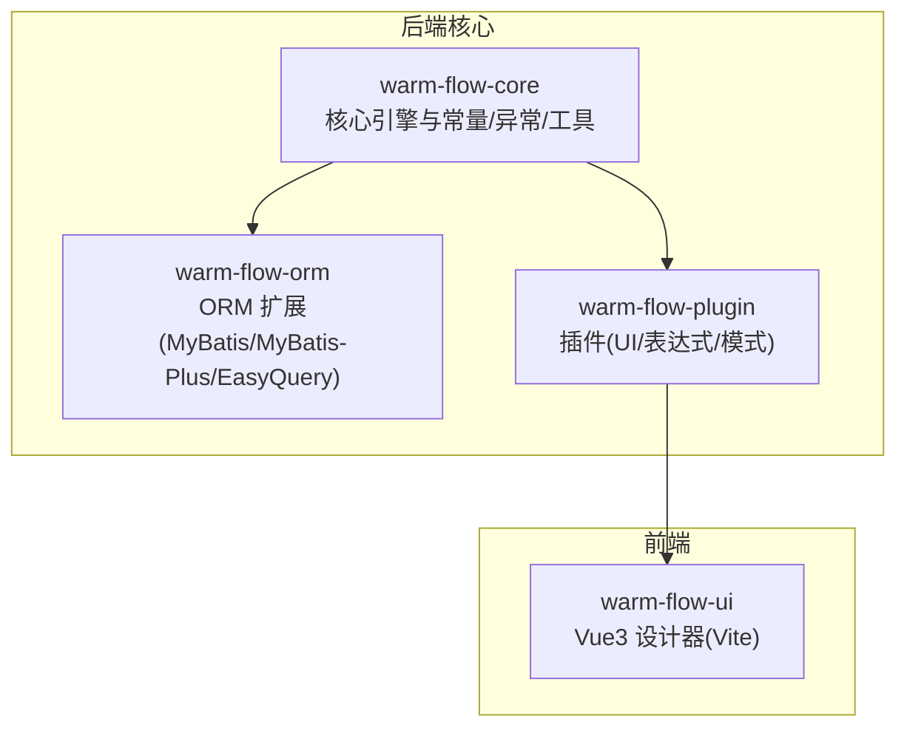
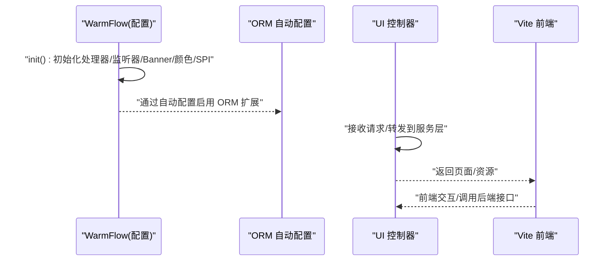
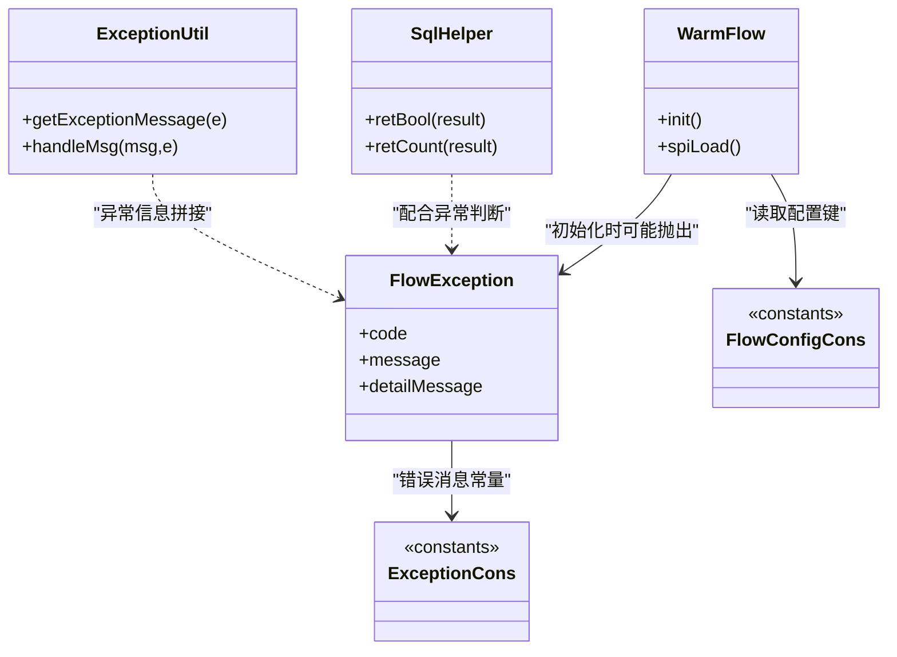
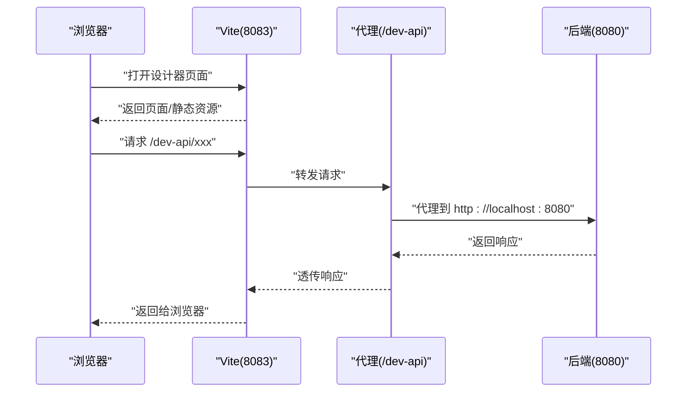
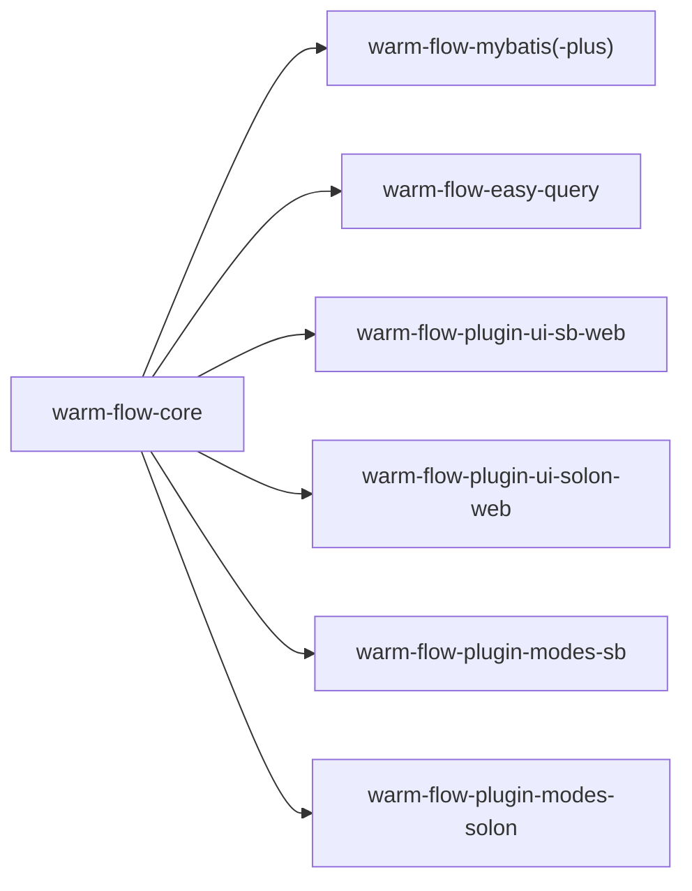

# 调试技巧与开发工具

<cite>
**本文引用的文件**
- [WarmFlow.java](file://warm-flow-core/src/main/java/org/dromara/warm/flow/core/config/WarmFlow.java)
- [FlowException.java](file://warm-flow-core/src/main/java/org/dromara/warm/flow/core/exception/FlowException.java)
- [ExceptionCons.java](file://warm-flow-core/src/main/java/org/dromara/warm/flow/core/constant/ExceptionCons.java)
- [FlowConfigCons.java](file://warm-flow-core/src/main/java/org/dromara/warm/flow/core/constant/FlowConfigCons.java)
- [FlowCons.java](file://warm-flow-core/src/main/java/org/dromara/warm/flow/core/constant/FlowCons.java)
- [SqlHelper.java](file://warm-flow-core/src/main/java/org/dromara/warm/flow/core/utils/SqlHelper.java)
- [ExceptionUtil.java](file://warm-flow-core/src/main/java/org/dromara/warm/flow/core/utils/ExceptionUtil.java)
- [WarmFlowController.java](file://warm-flow-plugin/warm-flow-plugin-ui/spring-boot-ui/starter/src/main/java/org/dromara/warm/flow/ui/controller/WarmFlowController.java)
- [WarmFlowUiController.java](file://warm-flow-plugin/warm-flow-plugin-ui/spring-boot-ui/starter/src/main/java/org/dromara/warm/flow/ui/controller/WarmFlowUiController.java)
- [package.json](file://warm-flow-ui/package.json)
- [vite.config.js](file://warm-flow-ui/vite.config.js)
- [FlowAutoConfig.java](file://warm-flow-orm/warm-flow-mybatis-sb-starter/src/main/java/org/dromara/warm/flow/spring/boot/config/FlowAutoConfig.java)
- [WarmFlowDaoSolonPlugin.java](file://warm-flow-orm/warm-flow-mybatis-solon-plugin/src/main/java/org/dromara/warm/flow/solon/WarmFlowDaoSolonPlugin.java)
- [WarmFlowModesSolonPlugin.java](file://warm-flow-plugin/warm-flow-plugin-modes/solon/src/main/java/org/dromara/warm/plugin/modes/solon/WarmFlowModesSolonPlugin.java)
- [BeanConfig.java](file://warm-flow-plugin/warm-flow-plugin-modes/spring-boot-modes/starter/src/main/java/org/dromara/warm/plugin/modes/sb/config/BeanConfig.java)
- [WarmFlowProperties.java](file://warm-flow-plugin/warm-flow-plugin-modes/spring-boot-modes/starter/src/main/java/org/dromara/warm/plugin/modes/sb/config/WarmFlowProperties.java)
- [warm-flow-easy-query-sb-starter](file://warm-flow-orm/warm-flow-easy-query/warm-flow-easy-query-sb-starter/pom.xml)
- [warm-flow-mybatis-sb-starter](file://warm-flow-orm/warm-flow-mybatis-sb-starter/pom.xml)
- [warm-flow-mybatis-plus-sb-starter](file://warm-flow-orm/warm-flow-mybatis-plus-sb-starter/pom.xml)
- [warm-flow-plugin-ui-sb-web](file://warm-flow-plugin/warm-flow-plugin-ui/spring-boot-ui/starter/pom.xml)
- [warm-flow-plugin-modes-sb](file://warm-flow-plugin/warm-flow-plugin-modes/spring-boot-modes/starter/pom.xml)
- [warm-flow-plugin-ui-solon-web](file://warm-flow-plugin/warm-flow-plugin-ui/solon-ui/starter/pom.xml)
- [warm-flow-plugin-modes-solon](file://warm-flow-plugin/warm-flow-plugin-modes/solon/pom.xml)
- [warm-flow-easy-query-solon-plugin](file://warm-flow-orm/warm-flow-easy-query/warm-flow-easy-query-solon-plugin/pom.xml)
- [warm-flow-mybatis-solon-plugin](file://warm-flow-orm/warm-flow-mybatis-solon-plugin/pom.xml)
- [warm-flow-mybatis-plus-solon-plugin](file://warm-flow-orm/warm-flow-mybatis-plus-solon-plugin/pom.xml)
- [warm-flow-ui-vite](file://warm-flow-ui/vite.config.js)
- [warm-flow-ui-package](file://warm-flow-ui/package.json)
</cite>

## 目录
1. [简介](#简介)
2. [项目结构](#项目结构)
3. [核心组件](#核心组件)
4. [架构总览](#架构总览)
5. [详细组件分析](#详细组件分析)
6. [依赖分析](#依赖分析)
7. [性能考虑](#性能考虑)
8. [故障排查指南](#故障排查指南)
9. [结论](#结论)
10. [附录](#附录)

## 简介
本文件面向 Warm-Flow 的开发者与运维人员，提供从后端到前端、从数据库到性能分析的全链路调试指南。内容涵盖：
- 后端调试：IDE 断点调试、日志配置、远程调试、异常与常量体系、SQL 辅助工具
- 前端调试：浏览器开发者工具、Vue DevTools 使用、Vite 热重载与代理配置
- 数据库调试：SQL 日志输出、慢查询分析、事务调试
- 性能分析：JVM 分析器、内存与线程分析
- 常见问题：流程卡死、任务异常、性能瓶颈的定位与解决
- 开发工具推荐与配置优化

## 项目结构
Warm-Flow 采用多模块分层设计，核心由“核心引擎”“ORM 扩展”“UI 插件”“前端设计器”组成；支持 Spring Boot 与 Solon 两种运行框架。

图表来源
- [WarmFlow.java:130-157](file://warm-flow-core/src/main/java/org/dromara/warm/flow/core/config/WarmFlow.java#L130-L157)
- [FlowAutoConfig.java](file://warm-flow-orm/warm-flow-mybatis-sb-starter/src/main/java/org/dromara/warm/flow/spring/boot/config/FlowAutoConfig.java)
- [WarmFlowController.java](file://warm-flow-plugin/warm-flow-plugin-ui/spring-boot-ui/starter/src/main/java/org/dromara/warm/flow/ui/controller/WarmFlowController.java)
- [vite.config.js:39-51](file://warm-flow-ui/vite.config.js#L39-L51)

章节来源
- [WarmFlow.java:130-157](file://warm-flow-core/src/main/java/org/dromara/warm/flow/core/config/WarmFlow.java#L130-L157)
- [FlowAutoConfig.java](file://warm-flow-orm/warm-flow-mybatis-sb-starter/src/main/java/org/dromara/warm/flow/spring/boot/config/FlowAutoConfig.java)
- [WarmFlowController.java](file://warm-flow-plugin/warm-flow-plugin-ui/spring-boot-ui/starter/src/main/java/org/dromara/warm/flow/ui/controller/WarmFlowController.java)
- [vite.config.js:39-51](file://warm-flow-ui/vite.config.js#L39-L51)

## 核心组件
- 配置与启动
  - WarmFlow 属性配置与 SPI 加载，负责初始化租户/数据填充/权限/全局监听器、打印 Banner、状态色初始化等。
  - 关键入口参考：[WarmFlow.java:130-157](file://warm-flow-core/src/main/java/org/dromara/warm/flow/core/config/WarmFlow.java#L130-L157)
- 异常与常量
  - FlowException 提供统一异常模型（含 code/detailMessage）
  - ExceptionCons 定义流程相关错误常量
  - FlowConfigCons/FlowCons 定义配置键与通用常量
  - 参考：[FlowException.java:25-80](file://warm-flow-core/src/main/java/org/dromara/warm/flow/core/exception/FlowException.java#L25-L80)，[ExceptionCons.java:24-158](file://warm-flow-core/src/main/java/org/dromara/warm/flow/core/constant/ExceptionCons.java#L24-L158)，[FlowConfigCons.java:23-75](file://warm-flow-core/src/main/java/org/dromara/warm/flow/core/constant/FlowConfigCons.java#L23-L75)，[FlowCons.java:25-84](file://warm-flow-core/src/main/java/org/dromara/warm/flow/core/constant/FlowCons.java#L25-L84)
- SQL 辅助
  - SqlHelper 提供影响行数判断与计数返回等辅助方法
  - 参考：[SqlHelper.java:24-57](file://warm-flow-core/src/main/java/org/dromara/warm/flow/core/utils/SqlHelper.java#L24-L57)
- 异常信息工具
  - ExceptionUtil 提供异常堆栈转字符串与消息拼接
  - 参考：[ExceptionUtil.java:27-47](file://warm-flow-core/src/main/java/org/dromara/warm/flow/core/utils/ExceptionUtil.java#L27-L47)

章节来源
- [WarmFlow.java:130-157](file://warm-flow-core/src/main/java/org/dromara/warm/flow/core/config/WarmFlow.java#L130-L157)
- [FlowException.java:25-80](file://warm-flow-core/src/main/java/org/dromara/warm/flow/core/exception/FlowException.java#L25-L80)
- [ExceptionCons.java:24-158](file://warm-flow-core/src/main/java/org/dromara/warm/flow/core/constant/ExceptionCons.java#L24-L158)
- [FlowConfigCons.java:23-75](file://warm-flow-core/src/main/java/org/dromara/warm/flow/core/constant/FlowConfigCons.java#L23-L75)
- [FlowCons.java:25-84](file://warm-flow-core/src/main/java/org/dromara/warm/flow/core/constant/FlowCons.java#L25-L84)
- [SqlHelper.java:24-57](file://warm-flow-core/src/main/java/org/dromara/warm/flow/core/utils/SqlHelper.java#L24-L57)
- [ExceptionUtil.java:27-47](file://warm-flow-core/src/main/java/org/dromara/warm/flow/core/utils/ExceptionUtil.java#L27-L47)

## 架构总览
Warm-Flow 的运行时由“配置初始化 → ORM 数据访问 → UI 控制器 → 前端设计器”构成，并通过插件扩展表达式与模式能力。

图表来源
- [WarmFlow.java:130-157](file://warm-flow-core/src/main/java/org/dromara/warm/flow/core/config/WarmFlow.java#L130-L157)
- [FlowAutoConfig.java](file://warm-flow-orm/warm-flow-mybatis-sb-starter/src/main/java/org/dromara/warm/flow/spring/boot/config/FlowAutoConfig.java)
- [WarmFlowController.java](file://warm-flow-plugin/warm-flow-plugin-ui/spring-boot-ui/starter/src/main/java/org/dromara/warm/flow/ui/controller/WarmFlowController.java)
- [vite.config.js:39-51](file://warm-flow-ui/vite.config.js#L39-L51)

## 详细组件分析

### 后端调试要点
- IDE 断点调试
  - 在 WarmFlow.init() 中设置断点，验证处理器与监听器初始化顺序与参数
  - 在 FlowException 抛出点设置断点，捕获业务异常上下文
  - 在 UI 控制器入口设置断点，观察请求参数与响应结构
  - 参考：[WarmFlow.java:130-157](file://warm-flow-core/src/main/java/org/dromara/warm/flow/core/config/WarmFlow.java#L130-L157)，[FlowException.java:25-80](file://warm-flow-core/src/main/java/org/dromara/warm/flow/core/exception/FlowException.java#L25-L80)，[WarmFlowController.java](file://warm-flow-plugin/warm-flow-plugin-ui/spring-boot-ui/starter/src/main/java/org/dromara/warm/flow/ui/controller/WarmFlowController.java)
- 远程调试
  - 在启动参数中添加 JVM 远程调试参数（如 -agentlib:jdwp=transport=dt_socket,server=y,suspend=n,address=*:5005），在 IDE 中以“远程”方式附加
  - 结合 WarmFlow.init() 与控制器方法进行远程断点验证
- 日志配置
  - 使用 FlowConfigCons 中的键（如 warm-flow.banner、warm-flow.ui、warm-flow.token-name）在配置文件中控制行为
  - 参考：[FlowConfigCons.java:23-75](file://warm-flow-core/src/main/java/org/dromara/warm/flow/core/constant/FlowConfigCons.java#L23-L75)
- 异常与常量
  - 使用 ExceptionCons 快速定位流程约束错误（如节点编码、权限、网关条件等）
  - 参考：[ExceptionCons.java:24-158](file://warm-flow-core/src/main/java/org/dromara/warm/flow/core/constant/ExceptionCons.java#L24-L158)
- SQL 辅助
  - 使用 SqlHelper 对影响行数进行断言式判断，便于快速定位插入/更新/删除是否生效
  - 参考：[SqlHelper.java:24-57](file://warm-flow-core/src/main/java/org/dromara/warm/flow/core/utils/SqlHelper.java#L24-L57)

图表来源
- [WarmFlow.java:130-157](file://warm-flow-core/src/main/java/org/dromara/warm/flow/core/config/WarmFlow.java#L130-L157)
- [FlowException.java:25-80](file://warm-flow-core/src/main/java/org/dromara/warm/flow/core/exception/FlowException.java#L25-L80)
- [ExceptionCons.java:24-158](file://warm-flow-core/src/main/java/org/dromara/warm/flow/core/constant/ExceptionCons.java#L24-L158)
- [FlowConfigCons.java:23-75](file://warm-flow-core/src/main/java/org/dromara/warm/flow/core/constant/FlowConfigCons.java#L23-L75)
- [SqlHelper.java:24-57](file://warm-flow-core/src/main/java/org/dromara/warm/flow/core/utils/SqlHelper.java#L24-L57)
- [ExceptionUtil.java:27-47](file://warm-flow-core/src/main/java/org/dromara/warm/flow/core/utils/ExceptionUtil.java#L27-L47)

章节来源
- [WarmFlow.java:130-157](file://warm-flow-core/src/main/java/org/dromara/warm/flow/core/config/WarmFlow.java#L130-L157)
- [FlowException.java:25-80](file://warm-flow-core/src/main/java/org/dromara/warm/flow/core/exception/FlowException.java#L25-L80)
- [ExceptionCons.java:24-158](file://warm-flow-core/src/main/java/org/dromara/warm/flow/core/constant/ExceptionCons.java#L24-L158)
- [FlowConfigCons.java:23-75](file://warm-flow-core/src/main/java/org/dromara/warm/flow/core/constant/FlowConfigCons.java#L23-L75)
- [SqlHelper.java:24-57](file://warm-flow-core/src/main/java/org/dromara/warm/flow/core/utils/SqlHelper.java#L24-L57)
- [ExceptionUtil.java:27-47](file://warm-flow-core/src/main/java/org/dromara/warm/flow/core/utils/ExceptionUtil.java#L27-L47)

### 前端调试要点
- 浏览器开发者工具
  - 使用 Network 面板观察 /dev-api 代理转发的后端接口响应，确认鉴权头与返回体结构
  - 使用 Console 面板查看 Vue3 运行时警告与错误
  - 使用 Elements/Components 面板检查组件渲染与状态
- Vue DevTools
  - 安装浏览器扩展后，切换到 Components 标签，查看 Warm-Flow 设计器组件树与状态变化
- Vite 热重载与代理
  - 端口与代理已在 vite.config.js 中配置，确保本地后端运行在 http://localhost:8080，前端可直接通过 /dev-api 访问
  - 参考：[vite.config.js:39-51](file://warm-flow-ui/vite.config.js#L39-L51)，[package.json:8-12](file://warm-flow-ui/package.json#L8-L12)

图表来源
- [vite.config.js:39-51](file://warm-flow-ui/vite.config.js#L39-L51)
- [package.json:8-12](file://warm-flow-ui/package.json#L8-L12)

章节来源
- [vite.config.js:39-51](file://warm-flow-ui/vite.config.js#L39-L51)
- [package.json:8-12](file://warm-flow-ui/package.json#L8-L12)

### 数据库调试要点
- SQL 日志输出
  - 通过 ORM starter 的自动配置启用对应框架的日志输出（MyBatis/MyBatis-Plus/EasyQuery），结合 FlowConfigCons 中的数据源类型键进行核对
  - 参考：[FlowConfigCons.java:60-64](file://warm-flow-core/src/main/java/org/dromara/warm/flow/core/constant/FlowConfigCons.java#L60-L64)，[warm-flow-mybatis-sb-starter](file://warm-flow-orm/warm-flow-mybatis-sb-starter/pom.xml)，[warm-flow-mybatis-plus-sb-starter](file://warm-flow-orm/warm-flow-mybatis-plus-sb-starter/pom.xml)，[warm-flow-easy-query-sb-starter](file://warm-flow-orm/warm-flow-easy-query/warm-flow-easy-query-sb-starter/pom.xml)
- 慢查询分析
  - 在数据库侧开启慢查询日志，结合后端 SQL 输出定位热点语句；使用 SqlHelper 的返回值断言确认影响行数是否异常
  - 参考：[SqlHelper.java:24-57](file://warm-flow-core/src/main/java/org/dromara/warm/flow/core/utils/SqlHelper.java#L24-L57)
- 事务调试
  - 在 WarmFlowController 或服务层方法中设置断点，观察事务边界与异常回滚路径
  - 参考：[WarmFlowController.java](file://warm-flow-plugin/warm-flow-plugin-ui/spring-boot-ui/starter/src/main/java/org/dromara/warm/flow/ui/controller/WarmFlowController.java)

章节来源
- [FlowConfigCons.java:60-64](file://warm-flow-core/src/main/java/org/dromara/warm/flow/core/constant/FlowConfigCons.java#L60-L64)
- [SqlHelper.java:24-57](file://warm-flow-core/src/main/java/org/dromara/warm/flow/core/utils/SqlHelper.java#L24-L57)
- [WarmFlowController.java](file://warm-flow-plugin/warm-flow-plugin-ui/spring-boot-ui/starter/src/main/java/org/dromara/warm/flow/ui/controller/WarmFlowController.java)

### 性能分析工具
- JVM 分析器
  - 使用 JDK Mission Control/JProfiler/Arthas 等工具采集 CPU/内存/线程快照
  - 在 WarmFlow.init() 与控制器方法中设置采样点，定位热点路径
- 内存分析
  - 关注 FlowException 与异常堆栈信息的拼接与缓存，避免频繁字符串拼接导致内存抖动
  - 参考：[ExceptionUtil.java:27-47](file://warm-flow-core/src/main/java/org/dromara/warm/flow/core/utils/ExceptionUtil.java#L27-L47)
- 线程分析
  - 使用 jstack/jconsole 观察线程阻塞与死锁，重点检查 ORM 查询与 UI 控制器同步处理

章节来源
- [ExceptionUtil.java:27-47](file://warm-flow-core/src/main/java/org/dromara/warm/flow/core/utils/ExceptionUtil.java#L27-L47)

## 依赖分析
Warm-Flow 的模块间依赖清晰，核心引擎驱动 ORM 与 UI 插件，前端通过 Vite 与后端代理对接。

图表来源
- [warm-flow-core](file://warm-flow-core/pom.xml)
- [warm-flow-mybatis-sb-starter](file://warm-flow-orm/warm-flow-mybatis-sb-starter/pom.xml)
- [warm-flow-mybatis-plus-sb-starter](file://warm-flow-orm/warm-flow-mybatis-plus-sb-starter/pom.xml)
- [warm-flow-easy-query-sb-starter](file://warm-flow-orm/warm-flow-easy-query/warm-flow-easy-query-sb-starter/pom.xml)
- [warm-flow-plugin-ui-sb-web](file://warm-flow-plugin/warm-flow-plugin-ui/spring-boot-ui/starter/pom.xml)
- [warm-flow-plugin-ui-solon-web](file://warm-flow-plugin/warm-flow-plugin-ui/solon-ui/starter/pom.xml)
- [warm-flow-plugin-modes-sb](file://warm-flow-plugin/warm-flow-plugin-modes/spring-boot-modes/starter/pom.xml)
- [warm-flow-plugin-modes-solon](file://warm-flow-plugin/warm-flow-plugin-modes/solon/pom.xml)

章节来源
- [warm-flow-core](file://warm-flow-core/pom.xml)
- [warm-flow-mybatis-sb-starter](file://warm-flow-orm/warm-flow-mybatis-sb-starter/pom.xml)
- [warm-flow-mybatis-plus-sb-starter](file://warm-flow-orm/warm-flow-mybatis-plus-sb-starter/pom.xml)
- [warm-flow-easy-query-sb-starter](file://warm-flow-orm/warm-flow-easy-query/warm-flow-easy-query-sb-starter/pom.xml)
- [warm-flow-plugin-ui-sb-web](file://warm-flow-plugin/warm-flow-plugin-ui/spring-boot-ui/starter/pom.xml)
- [warm-flow-plugin-ui-solon-web](file://warm-flow-plugin/warm-flow-plugin-ui/solon-ui/starter/pom.xml)
- [warm-flow-plugin-modes-sb](file://warm-flow-plugin/warm-flow-plugin-modes/spring-boot-modes/starter/pom.xml)
- [warm-flow-plugin-modes-solon](file://warm-flow-plugin/warm-flow-plugin-modes/solon/pom.xml)

## 性能考虑
- 启动与初始化
  - WarmFlow.init() 中的 SPI 加载与处理器初始化应避免阻塞主线程，必要时拆分为异步或延迟初始化
- ORM 与 SQL
  - 使用 SqlHelper 对影响行数进行断言，减少无效写入；合理分页与索引提升查询性能
- 前端构建
  - Vite 构建时的 chunkSizeWarningLimit 与 Rollup 输出命名策略需结合实际包大小调整，避免体积过大导致冷启动变慢
  - 参考：[vite.config.js:16-25](file://warm-flow-ui/vite.config.js#L16-L25)

章节来源
- [WarmFlow.java:130-157](file://warm-flow-core/src/main/java/org/dromara/warm/flow/core/config/WarmFlow.java#L130-L157)
- [SqlHelper.java:24-57](file://warm-flow-core/src/main/java/org/dromara/warm/flow/core/utils/SqlHelper.java#L24-L57)
- [vite.config.js:16-25](file://warm-flow-ui/vite.config.js#L16-L25)

## 故障排查指南
- 流程卡死
  - 检查网关/节点条件与跳转配置，参考 ExceptionCons 中的网关与条件相关常量
  - 使用 IDE 断点跟踪 FlowEngine 的流转过程，确认当前节点与目标节点映射
  - 参考：[ExceptionCons.java:24-158](file://warm-flow-core/src/main/java/org/dromara/warm/flow/core/constant/ExceptionCons.java#L24-L158)
- 任务异常
  - 捕获 FlowException 并结合 detailMessage 定位具体环节；使用 ExceptionUtil 拼接完整堆栈
  - 参考：[FlowException.java:25-80](file://warm-flow-core/src/main/java/org/dromara/warm/flow/core/exception/FlowException.java#L25-L80)，[ExceptionUtil.java:27-47](file://warm-flow-core/src/main/java/org/dromara/warm/flow/core/utils/ExceptionUtil.java#L27-L47)
- 性能瓶颈
  - 使用 JVM 分析器采集热点方法；关注 UI 控制器与 ORM 查询的耗时
  - 参考：[WarmFlowController.java](file://warm-flow-plugin/warm-flow-plugin-ui/spring-boot-ui/starter/src/main/java/org/dromara/warm/flow/ui/controller/WarmFlowController.java)
- 前端交互异常
  - 检查 /dev-api 代理配置与后端接口返回体；确认 Vue 组件状态与路由参数
  - 参考：[vite.config.js:39-51](file://warm-flow-ui/vite.config.js#L39-L51)，[package.json:8-12](file://warm-flow-ui/package.json#L8-L12)

章节来源
- [ExceptionCons.java:24-158](file://warm-flow-core/src/main/java/org/dromara/warm/flow/core/constant/ExceptionCons.java#L24-L158)
- [FlowException.java:25-80](file://warm-flow-core/src/main/java/org/dromara/warm/flow/core/exception/FlowException.java#L25-L80)
- [ExceptionUtil.java:27-47](file://warm-flow-core/src/main/java/org/dromara/warm/flow/core/utils/ExceptionUtil.java#L27-L47)
- [WarmFlowController.java](file://warm-flow-plugin/warm-flow-plugin-ui/spring-boot-ui/starter/src/main/java/org/dromara/warm/flow/ui/controller/WarmFlowController.java)
- [vite.config.js:39-51](file://warm-flow-ui/vite.config.js#L39-L51)
- [package.json:8-12](file://warm-flow-ui/package.json#L8-L12)

## 结论
通过以上后端配置、异常与常量体系、SQL 辅助、前端代理与热重载、以及 JVM 性能分析工具的组合使用，可以高效完成 Warm-Flow 的全流程调试与性能优化。建议在开发环境中开启必要的日志与断点，在测试/生产环境谨慎开启高开销的调试功能。

## 附录
- 开发工具推荐
  - IDE：IntelliJ IDEA（断点/远程调试/覆盖率）
  - 前端：Chrome DevTools + Vue DevTools
  - 数据库：Navicat/DBeaver + 慢查询日志
  - JVM：JDK Mission Control/Arthas/JProfiler
- 配置优化建议
  - 启动参数：开启远程调试与 GC 日志
  - ORM：按需开启 SQL 日志，区分 dev/test/prod
  - 前端：合理拆分 chunk，启用 Gzip 压缩
  - 参考：[vite.config.js:16-25](file://warm-flow-ui/vite.config.js#L16-L25)，[FlowConfigCons.java:23-75](file://warm-flow-core/src/main/java/org/dromara/warm/flow/core/constant/FlowConfigCons.java#L23-L75)