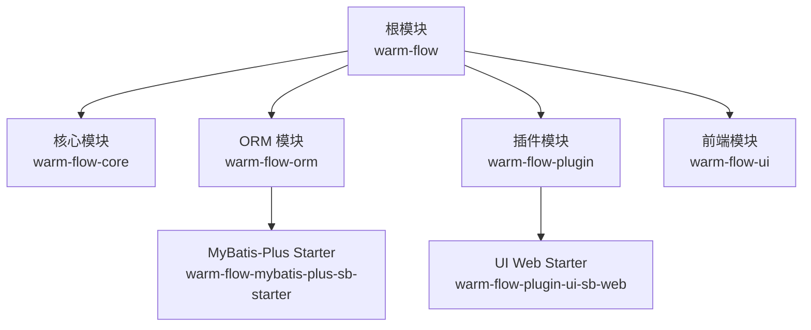
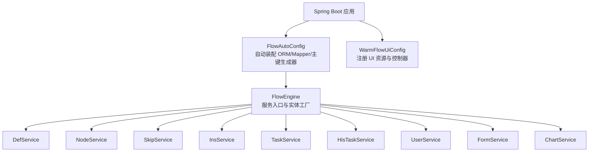
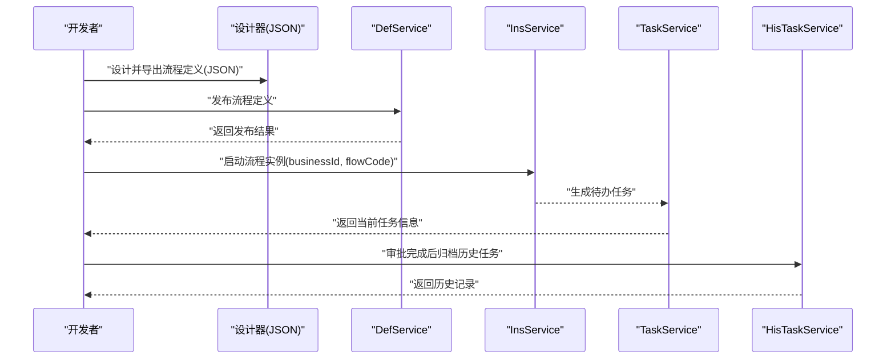
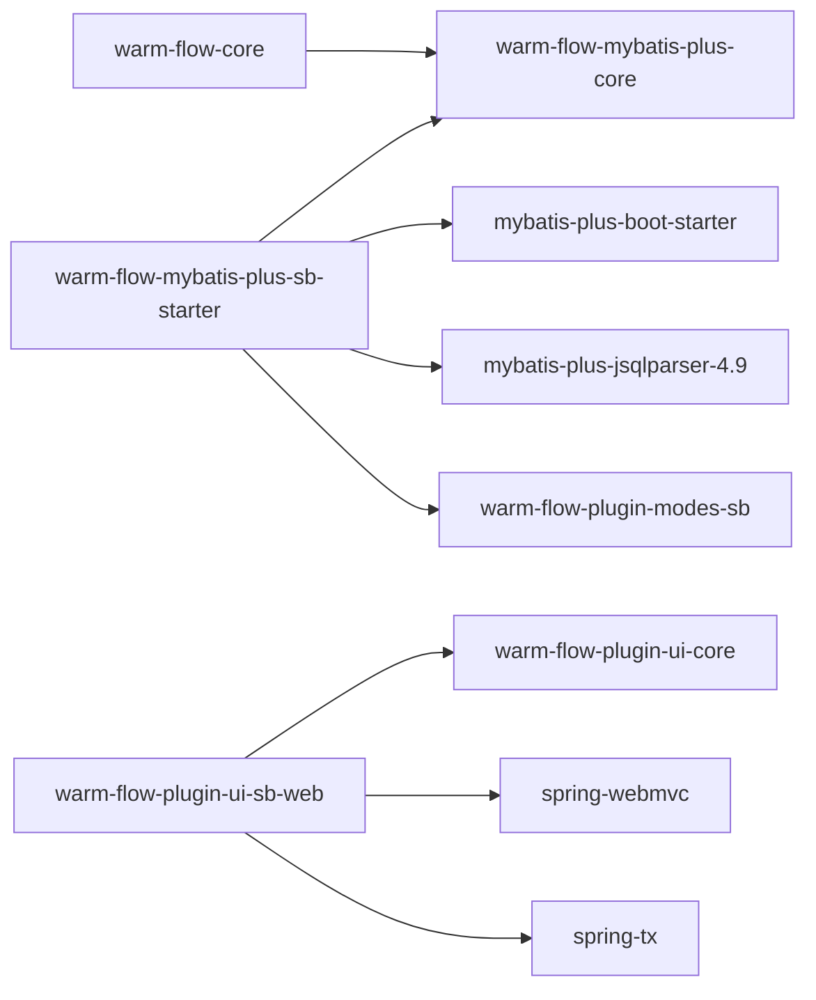

# 快速开始

<cite>
**本文引用的文件**
- [根 POM 文件](file://pom.xml)
- [项目说明文档](file://README.md)
- [核心模块 POM](file://warm-flow-core/pom.xml)
- [MyBatis-Plus Starter POM](file://warm-flow-orm/warm-flow-mybatis-plus/warm-flow-mybatis-plus-sb-starter/pom.xml)
- [UI Web Starter POM](file://warm-flow-plugin/warm-flow-plugin-ui/warm-flow-plugin-ui-sb-web/pom.xml)
- [Spring Boot 自动配置类](file://warm-flow-orm/warm-flow-mybatis-plus/warm-flow-mybatis-plus-sb-starter/src/main/java/org/dromara/warm/flow/spring/boot/config/FlowAutoConfig.java)
- [UI 自动配置类](file://warm-flow-plugin/warm-flow-plugin-ui/warm-flow-plugin-ui-sb-web/src/main/java/org/dromara/warm/flow/ui/config/WarmFlowUiConfig.java)
- [WarmFlow 属性配置类](file://warm-flow-core/src/main/java/org/dromara/warm/flow/core/config/WarmFlow.java)
- [FlowEngine 引擎入口类](file://warm-flow-core/src/main/java/org/dromara/warm/flow/core/FlowEngine.java)
- [数据库初始化脚本（MySQL 全量）](file://sql/mysql/warm-flow-all.sql)
- [Vue3 UI 资源目录](file://warm-flow-ui/src/)
</cite>

## 目录
1. [简介](#简介)
2. [项目结构](#项目结构)
3. [核心组件](#核心组件)
4. [架构总览](#架构总览)
5. [详细组件解析](#详细组件解析)
6. [依赖关系分析](#依赖关系分析)
7. [性能与配置建议](#性能与配置建议)
8. [故障排查指南](#故障排查指南)
9. [结论](#结论)
10. [附录](#附录)

## 简介
Warm-Flow 是一款简洁、轻量且功能完备的国产工作流引擎，支持经典与仿钉钉双模式流程设计器，内置条件表达式、监听器、流程变量与动态权限等能力；同时提供多 ORM 框架与多数据库支持，并兼容 Spring Boot 与 Solon 运行框架。官方提供了基于 RuoYi-Vue 的实战项目，便于快速落地。

## 项目结构
项目采用多模块聚合结构，核心模块包括：
- warm-flow-core：引擎核心与通用能力
- warm-flow-orm：ORM 封装与多框架适配（MyBatis、MyBatis-Plus、Easy-Query 等）
- warm-flow-plugin：生态插件（表达式模式、UI 控制台、JSON 实现等）
- warm-flow-ui：前端设计器与可视化资源

图表来源
- [根 POM 文件](file://pom.xml)
- [核心模块 POM](file://warm-flow-core/pom.xml)
- [MyBatis-Plus Starter POM](file://warm-flow-orm/warm-flow-mybatis-plus/warm-flow-mybatis-plus-sb-starter/pom.xml)
- [UI Web Starter POM](file://warm-flow-plugin/warm-flow-plugin-ui/warm-flow-plugin-ui-sb-web/pom.xml)

章节来源
- [根 POM 文件](file://pom.xml)
- [项目说明文档](file://README.md)

## 核心组件
- 引擎入口与服务装配：FlowEngine 提供统一的服务入口与实体工厂方法，负责装配 DefService、NodeService、SkipService、InsService、TaskService、HisTaskService、UserService、FormService、ChartService 等。
- 自动配置：FlowAutoConfig 在 Spring Boot 条件满足时启用，扫描 Mapper 并设置默认主键生成器；WarmFlowUiConfig 注册 UI 资源与控制器。
- 属性配置：WarmFlow 提供开关、多租户、数据填充、权限处理器、全局监听器、UI 开关、流程状态颜色等配置项，并通过 SPI 加载 JSON 转换实现。

章节来源
- [FlowEngine 引擎入口类](file://warm-flow-core/src/main/java/org/dromara/warm/flow/core/FlowEngine.java)
- [Spring Boot 自动配置类](file://warm-flow-orm/warm-flow-mybatis-plus/warm-flow-mybatis-plus-sb-starter/src/main/java/org/dromara/warm/flow/spring/boot/config/FlowAutoConfig.java)
- [UI 自动配置类](file://warm-flow-plugin/warm-flow-plugin-ui/warm-flow-plugin-ui-sb-web/src/main/java/org/dromara/warm/flow/ui/config/WarmFlowUiConfig.java)
- [WarmFlow 属性配置类](file://warm-flow-core/src/main/java/org/dromara/warm/flow/core/config/WarmFlow.java)

## 架构总览
Warm-Flow 的运行架构围绕“引擎 + ORM 适配 + 插件生态 + UI 设计器”展开。Spring Boot 场景下，通过 Starter 自动装配 ORM 与表达式模式，配合 UI Web Starter 提供设计器与可视化资源。

图表来源
- [Spring Boot 自动配置类](file://warm-flow-orm/warm-flow-mybatis-plus/warm-flow-mybatis-plus-sb-starter/src/main/java/org/dromara/warm/flow/spring/boot/config/FlowAutoConfig.java)
- [UI 自动配置类](file://warm-flow-plugin/warm-flow-plugin-ui/warm-flow-plugin-ui-sb-web/src/main/java/org/dromara/warm/flow/ui/config/WarmFlowUiConfig.java)
- [FlowEngine 引擎入口类](file://warm-flow-core/src/main/java/org/dromara/warm/flow/core/FlowEngine.java)

## 详细组件解析

### 环境准备
- JDK 版本：工程属性中声明 Java 源与目标版本为 1.8，同时保留 Java 17 路径配置，可在多版本环境中切换。
- 数据库：支持 MySQL、Oracle、PostgreSQL、SQL Server；官方提供各数据库全量与升级脚本。
- IDE：推荐使用 IntelliJ IDEA 或 Eclipse；前端资源位于 warm-flow-ui，需安装 Node.js 以构建 UI。
- Spring Boot 版本：工程管理中包含 Spring Boot 2.x 与 3.x、4.x 的 Starter 与插件，按需选择。

章节来源
- [根 POM 文件](file://pom.xml)
- [项目说明文档](file://README.md)

### 数据库初始化
- 创建数据库后，执行对应数据库的全量初始化脚本，完成 7 张核心表的建表与索引。
- 若为版本升级，请在 v1-upgrade 目录中查找对应版本的增量脚本并执行。

章节来源
- [数据库初始化脚本（MySQL 全量）](file://sql/mysql/warm-flow-all.sql)
- [项目说明文档](file://README.md)

### 项目下载与导入
- 下载源码后，使用 Maven 导入根 POM，IDE 会自动解析子模块。
- 如需本地调试 UI，进入 warm-flow-ui 目录安装依赖并启动前端资源。

章节来源
- [根 POM 文件](file://pom.xml)
- [Vue3 UI 资源目录](file://warm-flow-ui/src/)

### 集成方式与配置

#### Maven 依赖配置
- 引入核心模块与 ORM 适配 Starter（以 MyBatis-Plus 为例）：
  - warm-flow-core：引擎核心
  - warm-flow-mybatis-plus-sb-starter：Spring Boot 自动装配
  - warm-flow-plugin-modes-sb：表达式模式（SpEL 等）
  - warm-flow-plugin-ui-sb-web：UI 控制台与资源（可选）

章节来源
- [核心模块 POM](file://warm-flow-core/pom.xml)
- [MyBatis-Plus Starter POM](file://warm-flow-orm/warm-flow-mybatis-plus/warm-flow-mybatis-plus-sb-starter/pom.xml)
- [UI Web Starter POM](file://warm-flow-plugin/warm-flow-plugin-ui/warm-flow-plugin-ui-sb-web/pom.xml)

#### Spring Boot 自动配置
- FlowAutoConfig：启用条件开关、Mapper 扫描、默认主键生成器设置。
- WarmFlowUiConfig：注册 UI 资源映射与控制器，暴露设计器页面。

章节来源
- [Spring Boot 自动配置类](file://warm-flow-orm/warm-flow-mybatis-plus/warm-flow-mybatis-plus-sb-starter/src/main/java/org/dromara/warm/flow/spring/boot/config/FlowAutoConfig.java)
- [UI 自动配置类](file://warm-flow-plugin/warm-flow-plugin-ui/warm-flow-plugin-ui-sb-web/src/main/java/org/dromara/warm/flow/ui/config/WarmFlowUiConfig.java)

#### WarmFlow 属性配置
- 开关与框架类型：enabled、framework
- 多租户与数据填充：tenantHandlerPath、dataFillHandlerPath
- 权限与全局监听器：permissionHandlerPath、globalListenerPath
- UI 开关与令牌名：ui、tokenName
- 流程状态颜色：chartStatusColor、chartStatusColorClassics、chartStatusColorMimic

章节来源
- [WarmFlow 属性配置类](file://warm-flow-core/src/main/java/org/dromara/warm/flow/core/config/WarmFlow.java)

### 第一个工作流示例（从设计到执行）
- 流程设计：通过 warm-flow-ui 的设计器创建流程，保存为 JSON 定义。
- 发布流程：调用定义服务发布流程，使其可被实例化。
- 启动实例：根据业务 ID 与流程定义发起实例，引擎根据节点与跳转规则推进。
- 办理任务：根据当前节点的办理人表达式与监听器，生成待办任务并推进到下一节点。
- 查看历史：通过历史任务记录核验审批轨迹。

图表来源
- [FlowEngine 引擎入口类](file://warm-flow-core/src/main/java/org/dromara/warm/flow/core/FlowEngine.java)
- [UI 自动配置类](file://warm-flow-plugin/warm-flow-plugin-ui/warm-flow-plugin-ui-sb-web/src/main/java/org/dromara/warm/flow/ui/config/WarmFlowUiConfig.java)

章节来源
- [FlowEngine 引擎入口类](file://warm-flow-core/src/main/java/org/dromara/warm/flow/core/FlowEngine.java)
- [UI 自动配置类](file://warm-flow-plugin/warm-flow-plugin-ui/warm-flow-plugin-ui-sb-web/src/main/java/org/dromara/warm/flow/ui/config/WarmFlowUiConfig.java)

## 依赖关系分析
- 核心模块依赖：warm-flow-core 作为基础能力模块，被 ORM 与插件模块复用。
- ORM 适配：MyBatis-Plus Starter 依赖 mybatis-plus-boot-starter 与 jsqlparser，同时引入表达式模式插件。
- UI 集成：UI Web Starter 依赖 Spring MVC 与 warm-flow-plugin-ui-core，提供控制器与资源映射。

图表来源
- [核心模块 POM](file://warm-flow-core/pom.xml)
- [MyBatis-Plus Starter POM](file://warm-flow-orm/warm-flow-mybatis-plus/warm-flow-mybatis-plus-sb-starter/pom.xml)
- [UI Web Starter POM](file://warm-flow-plugin/warm-flow-plugin-ui/warm-flow-plugin-ui-sb-web/pom.xml)

章节来源
- [根 POM 文件](file://pom.xml)

## 性能与配置建议
- 主键生成：默认使用 ORM 扩展自带生成器或内置雪花算法，建议在高并发场景下保持默认策略一致性。
- 逻辑删除：可通过 WarmFlow 配置开启逻辑删除与字段值映射，减少物理删除带来的锁竞争。
- 多租户：通过 TenantHandler 实现隔离策略，避免跨租户数据污染。
- UI 资源：UI Web Starter 默认开启 UI 开关，生产环境可根据需要关闭以减少静态资源占用。

章节来源
- [Spring Boot 自动配置类](file://warm-flow-orm/warm-flow-mybatis-plus/warm-flow-mybatis-plus-sb-starter/src/main/java/org/dromara/warm/flow/spring/boot/config/FlowAutoConfig.java)
- [WarmFlow 属性配置类](file://warm-flow-core/src/main/java/org/dromara/warm/flow/core/config/WarmFlow.java)

## 故障排查指南
- 启动失败（找不到 Mapper 或 Bean）：检查 FlowAutoConfig 的 Mapper 扫描路径与 warm-flow-plugin-modes-sb 的依赖是否正确引入。
- UI 页面 404：确认 WarmFlowUiConfig 的资源映射与 UI 控制器已生效，检查 warm-flow-ui 资源打包位置。
- 数据库连接异常：确认数据库初始化脚本已执行，表结构与字段与当前版本匹配。
- 表达式或监听器不生效：检查 WarmFlow 中相应处理器路径配置与 SPI 实现是否正确加载。
- 多租户/权限问题：核对 TenantHandler 与 PermissionHandler 的实现与注入路径。

章节来源
- [Spring Boot 自动配置类](file://warm-flow-orm/warm-flow-mybatis-plus/warm-flow-mybatis-plus-sb-starter/src/main/java/org/dromara/warm/flow/spring/boot/config/FlowAutoConfig.java)
- [UI 自动配置类](file://warm-flow-plugin/warm-flow-plugin-ui/warm-flow-plugin-ui-sb-web/src/main/java/org/dromara/warm/flow/ui/config/WarmFlowUiConfig.java)
- [WarmFlow 属性配置类](file://warm-flow-core/src/main/java/org/dromara/warm/flow/core/config/WarmFlow.java)
- [数据库初始化脚本（MySQL 全量）](file://sql/mysql/warm-flow-all.sql)

## 结论
通过以上步骤，开发者可以在本地快速搭建 Warm-Flow 工作流引擎，完成数据库初始化、依赖引入与自动配置，并基于 UI 设计器完成首个工作流的发布与执行。遇到问题时，可依据故障排查指南逐项定位并解决。

## 附录
- 官方文档与演示地址见项目说明文档。
- 测试样例与流程定义 JSON 可参考官方测试仓库与文档。

章节来源
- [项目说明文档](file://README.md)