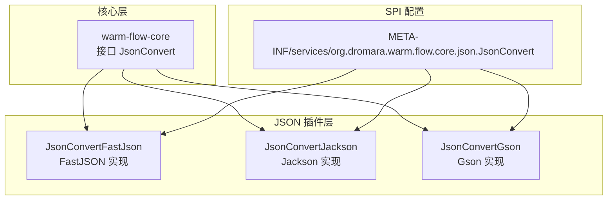
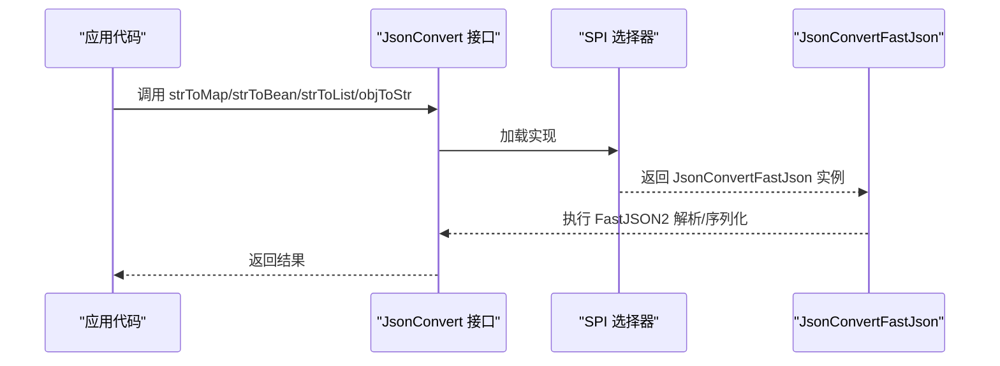
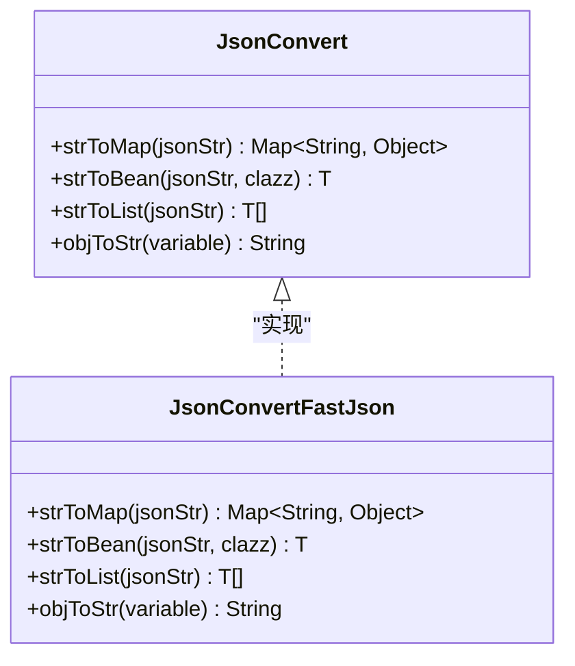
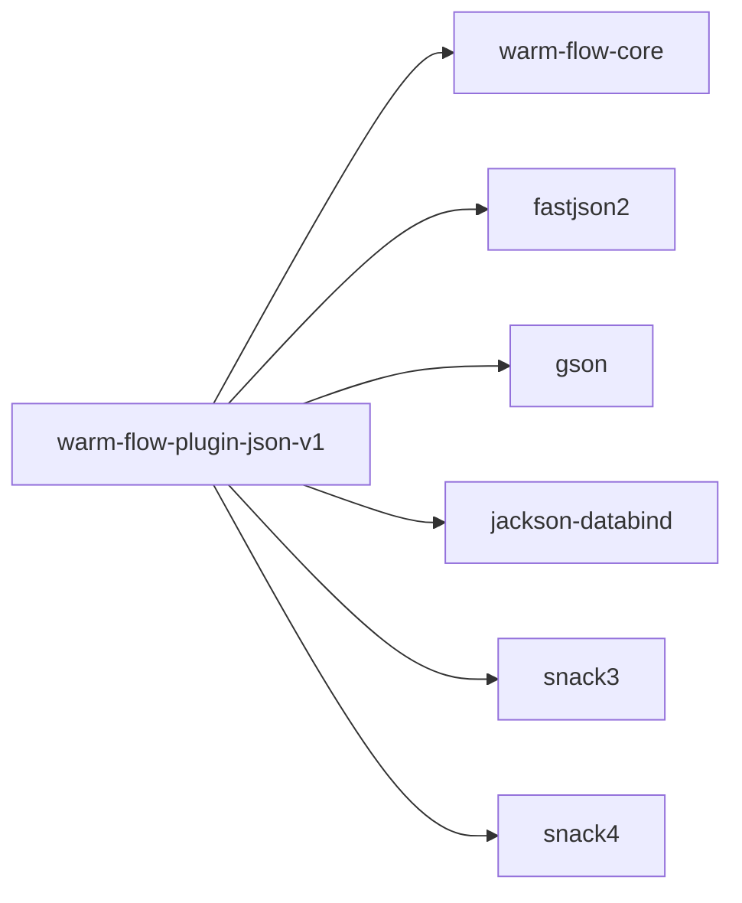

# FastJSON 序列化插件

<cite>
**本文引用的文件**   
- [JsonConvertFastJson.java](file://warm-flow-plugin/warm-flow-plugin-json/warm-flow-plugin-json-v1/src/main/java/org/dromara/warm/plugin/json/JsonConvertFastJson.java)
- [JsonConvert.java](file://warm-flow-core/src/main/java/org/dromara/warm/flow/core/json/JsonConvert.java)
- [ObjectUtil.java](file://warm-flow-core/src/main/java/org/dromara/warm/flow/core/utils/ObjectUtil.java)
- [StringUtils.java](file://warm-flow-core/src/main/java/org/dromara/warm/flow/core/utils/StringUtils.java)
- [服务 SPI 配置](file://warm-flow-plugin/warm-flow-plugin-json/warm-flow-plugin-json-v1/src/main/resources/META-INF/services/org.dromara.warm.flow.core.json.JsonConvert)
- [warm-flow-plugin-json-v1 依赖配置](file://warm-flow-plugin/warm-flow-plugin-json/warm-flow-plugin-json-v1/pom.xml)
- [JsonConvertJackson.java](file://warm-flow-plugin/warm-flow-plugin-json/warm-flow-plugin-json-v1/src/main/java/org/dromara/warm/plugin/json/JsonConvertJackson.java)
- [JsonConvertGson.java](file://warm-flow-plugin/warm-flow-plugin-json/warm-flow-plugin-json-v1/src/main/java/org/dromara/warm/plugin/json/JsonConvertGson.java)
</cite>

## 目录
1. [简介](#简介)
2. [项目结构](#项目结构)
3. [核心组件](#核心组件)
4. [架构总览](#架构总览)
5. [组件详解](#组件详解)
6. [依赖关系分析](#依赖关系分析)
7. [性能考量](#性能考量)
8. [故障排查指南](#故障排查指南)
9. [结论](#结论)
10. [附录](#附录)

## 简介
本文件面向 FastJSON 序列化插件，系统性解析 JsonConvertFastJson 的实现机制与工程集成方式，重点覆盖以下方面：
- FastJSON 的高性能特性在 Warm-Flow 中的应用点
- 内存优化策略与类型安全处理
- 在大数据量场景下的性能优势与与其他序列化库（Jackson、Gson）的对比
- 使用示例与最佳实践
- 常见问题与排障建议

## 项目结构
Warm-Flow 采用多模块结构，FastJSON 插件位于 warm-flow-plugin-json-v1 模块，并通过 Java SPI 机制向核心层暴露 JsonConvert 实现。

图表来源
- [JsonConvert.java](file://warm-flow-core/src/main/java/org/dromara/warm/flow/core/json/JsonConvert.java)
- [JsonConvertFastJson.java](file://warm-flow-plugin/warm-flow-plugin-json/warm-flow-plugin-json-v1/src/main/java/org/dromara/warm/plugin/json/JsonConvertFastJson.java)
- [JsonConvertJackson.java](file://warm-flow-plugin/warm-flow-plugin-json/warm-flow-plugin-json-v1/src/main/java/org/dromara/warm/plugin/json/JsonConvertJackson.java)
- [JsonConvertGson.java](file://warm-flow-plugin/warm-flow-plugin-json/warm-flow-plugin-json-v1/src/main/java/org/dromara/warm/plugin/json/JsonConvertGson.java)
- [服务 SPI 配置](file://warm-flow-plugin/warm-flow-plugin-json/warm-flow-plugin-json-v1/src/main/resources/META-INF/services/org.dromara.warm.flow.core.json.JsonConvert)

章节来源
- [JsonConvert.java](file://warm-flow-core/src/main/java/org/dromara/warm/flow/core/json/JsonConvert.java)
- [JsonConvertFastJson.java](file://warm-flow-plugin/warm-flow-plugin-json/warm-flow-plugin-json-v1/src/main/java/org/dromara/warm/plugin/json/JsonConvertFastJson.java)
- [服务 SPI 配置](file://warm-flow-plugin/warm-flow-plugin-json/warm-flow-plugin-json-v1/src/main/resources/META-INF/services/org.dromara.warm.flow.core.json.JsonConvert)

## 核心组件
- 接口层：JsonConvert 定义统一的 JSON 转换能力，包括字符串到 Map/Bean/集合以及对象到字符串的互转。
- 实现层：JsonConvertFastJson 基于 FastJSON2 提供高性能实现；JsonConvertJackson/Gson 提供对比参考。
- 工具层：ObjectUtil、StringUtils 用于判空与字符串处理，保障边界条件安全。
- SPI 层：通过 META-INF/services 暴露实现，便于运行时按需选择。

章节来源
- [JsonConvert.java](file://warm-flow-core/src/main/java/org/dromara/warm/flow/core/json/JsonConvert.java)
- [JsonConvertFastJson.java](file://warm-flow-plugin/warm-flow-plugin-json/warm-flow-plugin-json-v1/src/main/java/org/dromara/warm/plugin/json/JsonConvertFastJson.java)
- [ObjectUtil.java](file://warm-flow-core/src/main/java/org/dromara/warm/flow/core/utils/ObjectUtil.java)
- [StringUtils.java](file://warm-flow-core/src/main/java/org/dromara/warm/flow/core/utils/StringUtils.java)

## 架构总览
FastJSON 插件通过 SPI 向核心层提供 JsonConvert 实现，核心层以接口编程屏蔽具体实现差异，运行时由 SPI 选择器加载对应实现。

图表来源
- [JsonConvert.java](file://warm-flow-core/src/main/java/org/dromara/warm/flow/core/json/JsonConvert.java)
- [JsonConvertFastJson.java](file://warm-flow-plugin/warm-flow-plugin-json/warm-flow-plugin-json-v1/src/main/java/org/dromara/warm/plugin/json/JsonConvertFastJson.java)
- [服务 SPI 配置](file://warm-flow-plugin/warm-flow-plugin-json/warm-flow-plugin-json-v1/src/main/resources/META-INF/services/org.dromara.warm.flow.core.json.JsonConvert)

## 组件详解

### JsonConvertFastJson 实现机制
- 输入校验：对输入字符串与对象进行判空，避免无效调用。
- 类型安全：
  - Map/Bean/集合解析均通过 TypeReference 或 Class 显式指定泛型类型，确保反序列化目标类型明确。
- 性能特性：
  - 使用 FastJSON2 的 parseObject 与 toJSONString，具备高性能与低内存占用特征。
- 大数据优化：
  - FastJSON2 在流式解析、字段缓存、类型推断等方面有优化，适合大规模 JSON 文本处理。

图表来源
- [JsonConvert.java](file://warm-flow-core/src/main/java/org/dromara/warm/flow/core/json/JsonConvert.java)
- [JsonConvertFastJson.java](file://warm-flow-plugin/warm-flow-plugin-json/warm-flow-plugin-json-v1/src/main/java/org/dromara/warm/plugin/json/JsonConvertFastJson.java)

章节来源
- [JsonConvertFastJson.java](file://warm-flow-plugin/warm-flow-plugin-json/warm-flow-plugin-json-v1/src/main/java/org/dromara/warm/plugin/json/JsonConvertFastJson.java)
- [ObjectUtil.java](file://warm-flow-core/src/main/java/org/dromara/warm/flow/core/utils/ObjectUtil.java)
- [StringUtils.java](file://warm-flow-core/src/main/java/org/dromara/warm/flow/core/utils/StringUtils.java)

### FastJSON 的高性能与内存优化要点
- 高性能解析与序列化：基于 FastJSON2 的内部优化，减少反射与装箱开销，提升吞吐。
- 泛型类型安全：通过 TypeReference/Class 显式声明目标类型，避免运行时类型擦除导致的不确定性。
- 边界安全：在空字符串与空对象时返回安全默认值，降低异常路径与分支判断成本。
- 与 Jackson/Gson 的对比（基于实现差异）：
  - Jackson：支持更丰富的注解与定制化，但解析/序列化路径较复杂，内存与 CPU 成本相对更高。
  - Gson：API 简洁，但在复杂泛型与大对象场景下性能不及 FastJSON2。
  - FastJSON：在大数据量与高并发场景下通常具备更低延迟与更少内存占用。

章节来源
- [JsonConvertJackson.java](file://warm-flow-plugin/warm-flow-plugin-json/warm-flow-plugin-json-v1/src/main/java/org/dromara/warm/plugin/json/JsonConvertJackson.java)
- [JsonConvertGson.java](file://warm-flow-plugin/warm-flow-plugin-json/warm-flow-plugin-json-v1/src/main/java/org/dromara/warm/plugin/json/JsonConvertGson.java)

### 使用示例与场景覆盖
- 处理嵌套对象：通过 strToBean(Class<T>) 指定目标类型，自动映射嵌套属性。
- 处理集合类型：通过 strToList(String) 或带泛型的 TypeReference，解析 List/Map 等容器。
- 处理复杂泛型：结合 TypeReference/TypeToken 等机制，确保泛型信息完整传递。
- 对象序列化：objToStr(Object) 将任意对象序列化为 JSON 字符串，支持循环引用控制与字段过滤（如 Jackson 的 JsonInclude）。

章节来源
- [JsonConvertFastJson.java](file://warm-flow-plugin/warm-flow-plugin-json/warm-flow-plugin-json-v1/src/main/java/org/dromara/warm/plugin/json/JsonConvertFastJson.java)

### 错误处理与边界保护
- 空输入保护：对空字符串与空对象进行短路返回，避免无效调用。
- 异常传播：Jackson 实现在解析失败时抛出业务异常，便于上层统一处理；FastJSON 实现当前未显式捕获异常，建议在上层框架中统一兜底。

章节来源
- [JsonConvertFastJson.java](file://warm-flow-plugin/warm-flow-plugin-json/warm-flow-plugin-json-v1/src/main/java/org/dromara/warm/plugin/json/JsonConvertFastJson.java)
- [JsonConvertJackson.java](file://warm-flow-plugin/warm-flow-plugin-json/warm-flow-plugin-json-v1/src/main/java/org/dromara/warm/plugin/json/JsonConvertJackson.java)

## 依赖关系分析
warm-flow-plugin-json-v1 模块同时引入了多种 JSON 库作为可选依赖，便于在不同运行环境中按需启用。

图表来源
- [warm-flow-plugin-json-v1 依赖配置](file://warm-flow-plugin/warm-flow-plugin-json/warm-flow-plugin-json-v1/pom.xml)

章节来源
- [warm-flow-plugin-json-v1 依赖配置](file://warm-flow-plugin/warm-flow-plugin-json/warm-flow-plugin-json-v1/pom.xml)

## 性能考量
- 大数据量场景优势
  - FastJSON2 在解析与序列化路径上具备更低的内存分配与更快的执行速度，适合高吞吐场景。
  - 通过 TypeReference 显式声明泛型，减少运行时类型推断成本。
- 与 Jackson/Gson 的对比
  - Jackson：功能丰富但解析链路复杂，CPU 与内存占用相对更高。
  - Gson：API 简洁，但在复杂泛型与大对象场景下不及 FastJSON2。
- 实践建议
  - 在高并发、大数据量的流程引擎场景中优先选择 FastJSON 实现。
  - 对需要严格注解控制与复杂类型处理的场景，可考虑 Jackson 实现。

章节来源
- [JsonConvertFastJson.java](file://warm-flow-plugin/warm-flow-plugin-json/warm-flow-plugin-json-v1/src/main/java/org/dromara/warm/plugin/json/JsonConvertFastJson.java)
- [JsonConvertJackson.java](file://warm-flow-plugin/warm-flow-plugin-json/warm-flow-plugin-json-v1/src/main/java/org/dromara/warm/plugin/json/JsonConvertJackson.java)
- [JsonConvertGson.java](file://warm-flow-plugin/warm-flow-plugin-json/warm-flow-plugin-json-v1/src/main/java/org/dromara/warm/plugin/json/JsonConvertGson.java)

## 故障排查指南
- 现象：反序列化结果类型不符或字段缺失
  - 排查：确认传入的 Class/TypeReference 是否与 JSON 结构匹配；确保字段命名一致。
- 现象：空字符串或空对象导致异常
  - 排查：FastJSON 实现已对空输入进行短路处理；若出现异常，检查上层调用是否绕过了空值校验。
- 现象：泛型丢失导致解析异常
  - 排查：使用 TypeReference 显式声明泛型；避免仅传入 raw type。
- 现象：不同实现间行为差异
  - 排查：Jackson 与 Gson 在字段过滤、未知字段处理等方面存在差异，需根据需求选择合适实现。

章节来源
- [JsonConvertFastJson.java](file://warm-flow-plugin/warm-flow-plugin-json/warm-flow-plugin-json-v1/src/main/java/org/dromara/warm/plugin/json/JsonConvertFastJson.java)
- [JsonConvertJackson.java](file://warm-flow-plugin/warm-flow-plugin-json/warm-flow-plugin-json-v1/src/main/java/org/dromara/warm/plugin/json/JsonConvertJackson.java)
- [JsonConvertGson.java](file://warm-flow-plugin/warm-flow-plugin-json/warm-flow-plugin-json-v1/src/main/java/org/dromara/warm/plugin/json/JsonConvertGson.java)

## 结论
JsonConvertFastJson 通过 FastJSON2 在 Warm-Flow 中提供了高性能、低内存占用的 JSON 能力，配合显式的泛型类型声明与完善的空值保护，适用于高并发、大数据量的流程处理场景。与 Jackson/Gson 相比，在解析/序列化效率与内存占用方面具有明显优势。建议在生产环境中优先选用 FastJSON 实现，并结合实际业务场景选择合适的 SPI 配置。

## 附录
- SPI 配置入口：通过 META-INF/services/org.dromara.warm.flow.core.json.JsonConvert 暴露实现，便于运行时选择。
- 依赖选择：warm-flow-plugin-json-v1 模块同时引入 Jackson、Gson、FastJSON、Snack 等多种实现，按需启用。

章节来源
- [服务 SPI 配置](file://warm-flow-plugin/warm-flow-plugin-json/warm-flow-plugin-json-v1/src/main/resources/META-INF/services/org.dromara.warm.flow.core.json.JsonConvert)
- [warm-flow-plugin-json-v1 依赖配置](file://warm-flow-plugin/warm-flow-plugin-json/warm-flow-plugin-json-v1/pom.xml)