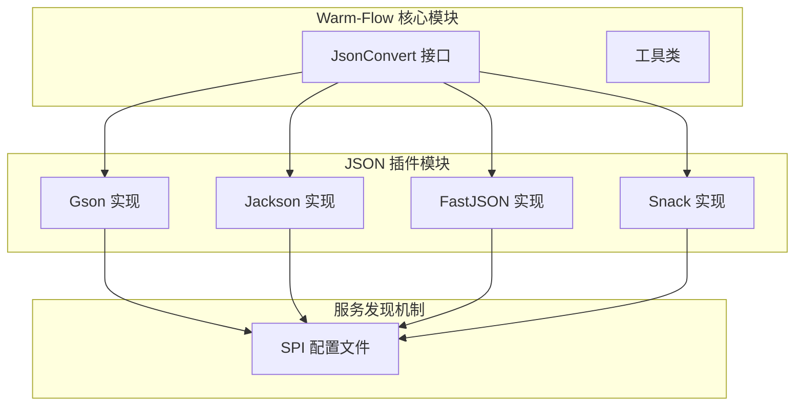
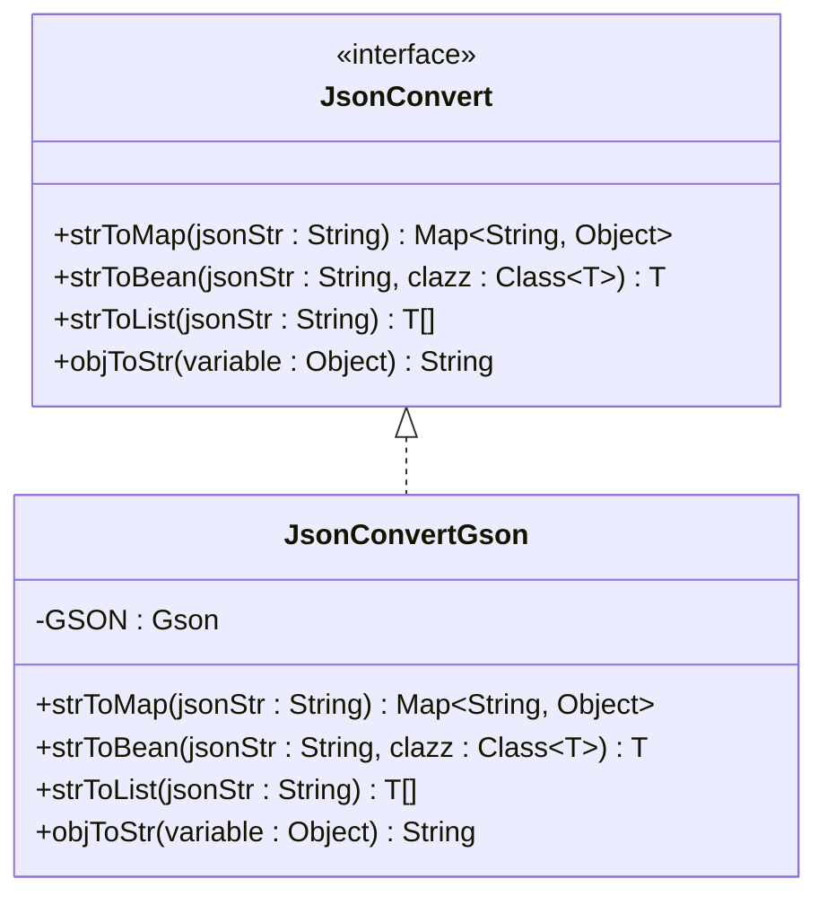
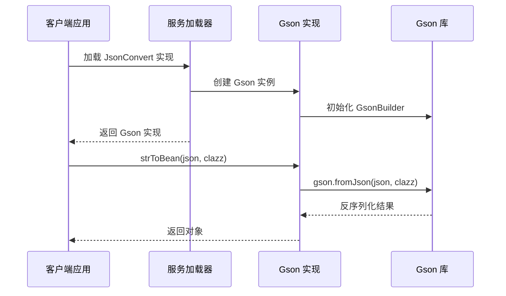
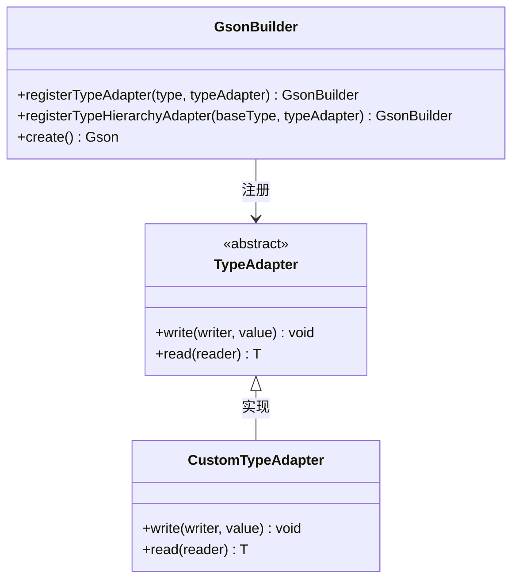
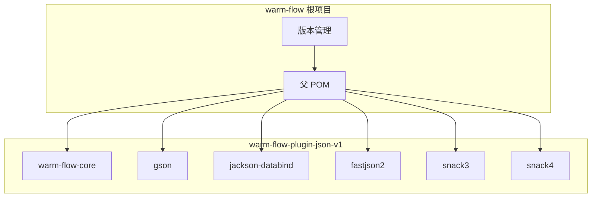

# Gson 序列化插件

<cite>
**本文档引用的文件**
- [JsonConvertGson.java](file://warm-flow-plugin/warm-flow-plugin-json/warm-flow-plugin-json-v1/src/main/java/org/dromara/warm/plugin/json/JsonConvertGson.java)
- [JsonConvert.java](file://warm-flow-core/src/main/java/org/dromara/warm/flow/core/json/JsonConvert.java)
- [ObjectUtil.java](file://warm-flow-core/src/main/java/org/dromara/warm/flow/core/utils/ObjectUtil.java)
- [StringUtils.java](file://warm-flow-core/src/main/java/org/dromara/warm/flow/core/utils/StringUtils.java)
- [org.dromara.warm.flow.core.json.JsonConvert](file://warm-flow-plugin/warm-flow-plugin-json/warm-flow-plugin-json-v1/src/main/resources/META-INF/services/org.dromara.warm.flow.core.json.JsonConvert)
- [pom.xml](file://warm-flow-plugin/warm-flow-plugin-json/warm-flow-plugin-json-v1/pom.xml)
- [pom.xml](file://warm-flow/pom.xml)
</cite>

## 目录
1. [简介](#简介)
2. [项目结构](#项目结构)
3. [核心组件](#核心组件)
4. [架构概览](#架构概览)
5. [详细组件分析](#详细组件分析)
6. [依赖关系分析](#依赖关系分析)
7. [性能考虑](#性能考虑)
8. [故障排除指南](#故障排除指南)
9. [结论](#结论)
10. [附录](#附录)

## 简介

Gson 序列化插件是 Warm-Flow 工作流引擎中的一个重要组成部分，专门负责处理 JSON 数据的序列化和反序列化操作。该插件基于 Google 的 Gson 库实现，提供了简洁高效的 JSON 处理能力，支持基本类型、复杂对象、集合类型和泛型类型的序列化与反序列化操作。

Warm-Flow 是一个轻量级的工作流引擎，旨在简化业务流程的建模和执行。通过集成多种 JSON 序列化插件（包括 Gson、Jackson、FastJSON 等），系统能够灵活地适应不同的应用场景和性能需求。

## 项目结构

Warm-Flow 采用模块化的项目结构，Gson 序列化插件位于 `warm-flow-plugin-json-v1` 模块中，该模块独立于核心引擎，便于按需引入和扩展。



**图表来源**
- [JsonConvertGson.java:1-100](file://warm-flow-plugin/warm-flow-plugin-json/warm-flow-plugin-json-v1/src/main/java/org/dromara/warm/plugin/json/JsonConvertGson.java#L1-L100)
- [JsonConvert.java:1-62](file://warm-flow-core/src/main/java/org/dromara/warm/flow/core/json/JsonConvert.java#L1-L62)

**章节来源**
- [JsonConvertGson.java:1-100](file://warm-flow-plugin/warm-flow-plugin-json/warm-flow-plugin-json-v1/src/main/java/org/dromara/warm/plugin/json/JsonConvertGson.java#L1-L100)
- [JsonConvert.java:1-62](file://warm-flow-core/src/main/java/org/dromara/warm/flow/core/json/JsonConvert.java#L1-L62)

## 核心组件

### JsonConvert 接口设计

JsonConvert 接口定义了统一的 JSON 处理规范，确保不同实现之间的兼容性和一致性。接口提供了四个核心方法：

- `strToMap`: 将 JSON 字符串转换为 Map<String, Object>
- `strToBean`: 将 JSON 字符串转换为指定类型的对象
- `strToList`: 将 JSON 字符串转换为 List<T>
- `objToStr`: 将对象转换为 JSON 字符串



**图表来源**
- [JsonConvert.java:26-61](file://warm-flow-core/src/main/java/org/dromara/warm/flow/core/json/JsonConvert.java#L26-L61)
- [JsonConvertGson.java:35-99](file://warm-flow-plugin/warm-flow-plugin-json/warm-flow-plugin-json-v1/src/main/java/org/dromara/warm/plugin/json/JsonConvertGson.java#L35-L99)

**章节来源**
- [JsonConvert.java:26-61](file://warm-flow-core/src/main/java/org/dromara/warm/flow/core/json/JsonConvert.java#L26-L61)

## 架构概览

Gson 序列化插件采用了 SPI（Service Provider Interface）机制，实现了插件化的 JSON 处理架构。这种设计允许系统在运行时动态选择合适的 JSON 序列化实现。



**图表来源**
- [org.dromara.warm.flow.core.json.JsonConvert:1-6](file://warm-flow-plugin/warm-flow-plugin-json/warm-flow-plugin-json-v1/src/main/resources/META-INF/services/org.dromara.warm.flow.core.json.JsonConvert#L1-L6)
- [JsonConvertGson.java:37](file://warm-flow-plugin/warm-flow-plugin-json/warm-flow-plugin-json-v1/src/main/java/org/dromara/warm/plugin/json/JsonConvertGson.java#L37)

## 详细组件分析

### JsonConvertGson 实现类

JsonConvertGson 是 Gson 序列化插件的核心实现类，它继承了 JsonConvert 接口并提供了完整的 JSON 处理功能。

#### Gson Builder 配置

当前实现使用了最基础的 GsonBuilder 配置，创建了一个默认的 Gson 实例：

```mermaid
flowchart TD
Start([创建 Gson 实例]) --> Builder[GsonBuilder 实例]
Builder --> Create[create() 方法]
Create --> GsonInstance[Gson 实例]
GsonInstance --> Ready[准备就绪]
Ready --> Serialize[序列化操作]
Ready --> Deserialize[反序列化操作]
Serialize --> GsonToJson[gson.toJson()]
Deserialize --> JsonToGson[gson.fromJson()]
GsonToJson --> End([完成])
JsonToGson --> End
```

**图表来源**
- [JsonConvertGson.java:37](file://warm-flow-plugin/warm-flow-plugin-json/warm-flow-plugin-json-v1/src/main/java/org/dromara/warm/plugin/json/JsonConvertGson.java#L37)

#### TypeAdapter 注册机制

虽然当前实现没有显式的 TypeAdapter 注册，但 Gson 提供了强大的扩展机制。可以通过以下方式扩展：



**图表来源**
- [JsonConvertGson.java:18-23](file://warm-flow-plugin/warm-flow-plugin-json/warm-flow-plugin-json-v1/src/main/java/org/dromara/warm/plugin/json/JsonConvertGson.java#L18-L23)

#### 字段命名策略

Gson 支持多种字段命名策略，包括：

- **默认策略**: 保持 Java 字段名不变
- **下划线策略**: 将驼峰命名转换为下划线命名
- **大写策略**: 将字段名转换为大写形式

这些策略可以通过 GsonBuilder 进行配置，以满足不同场景的需求。

**章节来源**
- [JsonConvertGson.java:35-99](file://warm-flow-plugin/warm-flow-plugin-json/warm-flow-plugin-json-v1/src/main/java/org/dromara/warm/plugin/json/JsonConvertGson.java#L35-L99)

### 方法实现详解

#### 字符串转 Map

```mermaid
flowchart TD
Start([strToMap 调用]) --> CheckEmpty{检查 JSON 字符串是否为空}
CheckEmpty --> |为空| ReturnEmpty[返回空 HashMap]
CheckEmpty --> |不为空| CreateType[创建 TypeToken<Map<String, Object>>]
CreateType --> FromJson[gson.fromJson(json, type)]
FromJson --> ReturnResult[返回 Map 结果]
ReturnEmpty --> End([结束])
ReturnResult --> End
```

**图表来源**
- [JsonConvertGson.java:46-53](file://warm-flow-plugin/warm-flow-plugin-json/warm-flow-plugin-json-v1/src/main/java/org/dromara/warm/plugin/json/JsonConvertGson.java#L46-L53)

#### 字符串转 Bean

```mermaid
flowchart TD
Start([strToBean 调用]) --> CheckEmpty{检查 JSON 字符串是否为空}
CheckEmpty --> |为空| ReturnNull[返回 null]
CheckEmpty --> |不为空| FromJson[gson.fromJson(json, clazz)]
FromJson --> ReturnResult[返回转换后的对象]
ReturnNull --> End([结束])
ReturnResult --> End
```

**图表来源**
- [JsonConvertGson.java:63-68](file://warm-flow-plugin/warm-flow-plugin-json/warm-flow-plugin-json-v1/src/main/java/org/dromara/warm/plugin/json/JsonConvertGson.java#L63-L68)

#### 字符串转 List

```mermaid
flowchart TD
Start([strToList 调用]) --> CheckEmpty{检查 JSON 字符串是否为空}
CheckEmpty --> |为空| ReturnNull[返回 null]
CheckEmpty --> |不为空| CreateType[创建 TypeToken<List<T>>]
CreateType --> FromJson[gson.fromJson(json, type)]
FromJson --> ReturnResult[返回 List 结果]
ReturnNull --> End([结束])
ReturnResult --> End
```

**图表来源**
- [JsonConvertGson.java:77-83](file://warm-flow-plugin/warm-flow-plugin-json/warm-flow-plugin-json-v1/src/main/java/org/dromara/warm/plugin/json/JsonConvertGson.java#L77-L83)

#### 对象转字符串

```mermaid
flowchart TD
Start([objToStr 调用]) --> CheckNull{检查对象是否为 null}
CheckNull --> |为 null| ReturnNull[返回 null]
CheckNull --> |不为 null| ToJson[gson.toJson(object)]
ToJson --> ReturnResult[返回 JSON 字符串]
ReturnNull --> End([结束])
ReturnResult --> End
```

**图表来源**
- [JsonConvertGson.java:92-97](file://warm-flow-plugin/warm-flow-plugin-json/warm-flow-plugin-json-v1/src/main/java/org/dromara/warm/plugin/json/JsonConvertGson.java#L92-L97)

**章节来源**
- [JsonConvertGson.java:46-97](file://warm-flow-plugin/warm-flow-plugin-json/warm-flow-plugin-json-v1/src/main/java/org/dromara/warm/plugin/json/JsonConvertGson.java#L46-L97)

## 依赖关系分析

### Maven 依赖配置

Gson 序列化插件作为 warm-flow-plugin-json-v1 模块的一部分，其依赖关系设计体现了模块化和可选依赖的理念。



**图表来源**
- [pom.xml:16-51](file://warm-flow-plugin/warm-flow-plugin-json/warm-flow-plugin-json-v1/pom.xml#L16-L51)
- [pom.xml:245-273](file://warm-flow/pom.xml#L245-L273)

### SPI 服务发现机制

通过 META-INF/services 目录下的配置文件，系统实现了服务提供者的自动发现和加载机制。

**章节来源**
- [pom.xml:16-51](file://warm-flow-plugin/warm-flow-plugin-json/warm-flow-plugin-json-v1/pom.xml#L16-L51)
- [org.dromara.warm.flow.core.json.JsonConvert:1-6](file://warm-flow-plugin/warm-flow-plugin-json/warm-flow-plugin-json-v1/src/main/resources/META-INF/services/org.dromara.warm.flow.core.json.JsonConvert#L1-L6)

## 性能考虑

### Gson 实例管理

当前实现使用静态常量的方式创建和复用 Gson 实例，这有助于避免重复创建实例带来的性能开销。建议在生产环境中保持这种设计，因为 Gson 实例是线程安全的。

### 内存优化策略

1. **延迟初始化**: 可以考虑将 Gson 实例改为延迟初始化，以减少启动时间
2. **缓存策略**: 对常用的类型转换结果进行缓存
3. **内存池**: 对大型 JSON 对象的处理可以考虑使用内存池技术

### 序列化性能优化

1. **字段过滤**: 使用 `@Expose` 注解控制需要序列化的字段
2. **自定义适配器**: 为复杂对象实现自定义 TypeAdapter
3. **批量处理**: 对大量数据的处理建议使用流式 API

## 故障排除指南

### 常见问题及解决方案

#### JSON 解析异常

当 JSON 字符串格式不正确时，Gson 会抛出 `JsonSyntaxException`。建议在调用 `strToBean` 和 `strToMap` 方法时添加适当的异常处理。

#### 泛型类型丢失

由于 Java 泛型擦除机制，在使用 `strToList` 方法时可能会遇到类型信息丢失的问题。当前实现通过 TypeToken 来解决这个问题，确保泛型类型信息的正确传递。

#### 空值处理

插件对空值进行了完善的处理：
- 空字符串返回空集合或空映射
- null 对象返回 null
- 空集合返回空映射

**章节来源**
- [JsonConvertGson.java:46-97](file://warm-flow-plugin/warm-flow-plugin-json/warm-flow-plugin-json-v1/src/main/java/org/dromara/warm/plugin/json/JsonConvertGson.java#L46-L97)

## 结论

Gson 序列化插件为 Warm-Flow 工作流引擎提供了稳定可靠的 JSON 处理能力。通过简洁的 API 设计和灵活的 SPI 机制，该插件能够很好地融入整个系统架构。

### 主要优势

1. **简洁易用**: API 设计直观，易于理解和使用
2. **性能优秀**: 基于成熟的 Gson 库，性能表现良好
3. **扩展性强**: 支持 TypeAdapter 扩展和自定义配置
4. **兼容性好**: 与 Google 生态系统高度兼容

### 发展建议

1. **增强配置选项**: 添加更多的 Gson 配置选项，如日期格式、字段命名策略等
2. **性能监控**: 添加性能指标监控，帮助优化序列化性能
3. **错误处理**: 改进错误处理机制，提供更详细的错误信息
4. **测试覆盖**: 增加单元测试和集成测试的覆盖率

## 附录

### 使用示例

由于本节不直接分析具体文件，此处提供概念性的使用示例说明：

#### 基本类型序列化
- 将字符串、数字、布尔值等基本类型转换为 JSON
- 处理 null 值和空字符串的情况

#### 复杂对象序列化
- 处理嵌套对象和循环引用
- 支持继承层次结构的对象序列化

#### 集合类型序列化
- List、Set、Map 等集合类型的处理
- 泛型类型的序列化和反序列化

#### 泛型类型序列化
- TypeToken 的使用方法
- 泛型边界和通配符的处理

### 集成最佳实践

#### Spring Boot 集成
- 通过 @Component 注解注册为 Spring Bean
- 配置 @Primary 注解确保优先使用 Gson 实现
- 在 @Configuration 类中定义 Gson 实例

#### 性能优化建议
- 复用 Gson 实例，避免重复创建
- 合理使用 TypeAdapter 减少反射开销
- 对大数据量处理使用流式 API