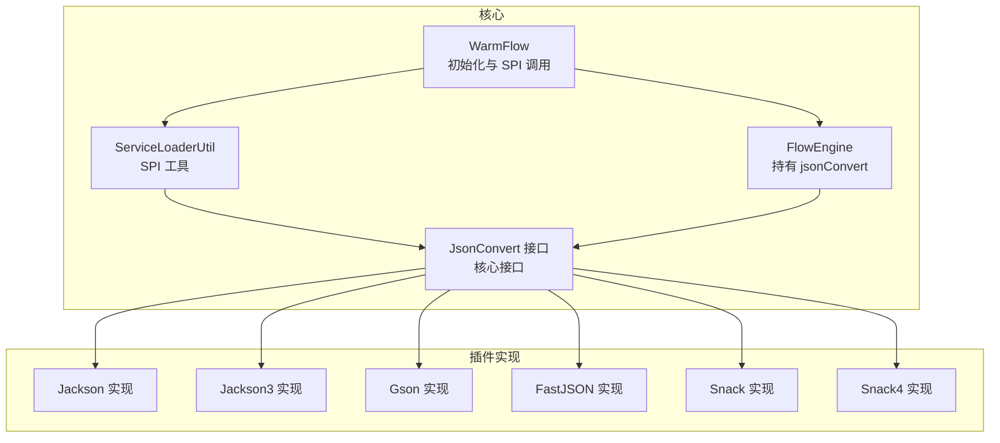
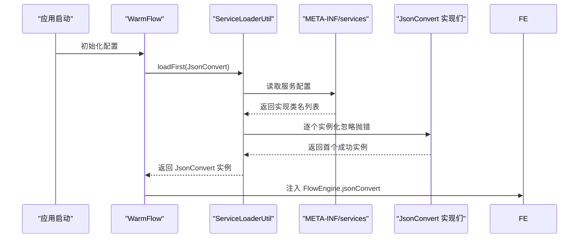
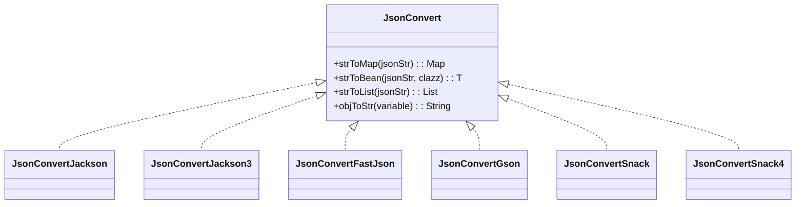

# JSON 序列化插件

<cite>
**本文引用的文件**
- [JsonConvert.java](file://warm-flow-core/src/main/java/org/dromara/warm/flow/core/json/JsonConvert.java)
- [ServiceLoaderUtil.java](file://warm-flow-core/src/main/java/org/dromara/warm/flow/core/utils/ServiceLoaderUtil.java)
- [WarmFlow.java](file://warm-flow-core/src/main/java/org/dromara/warm/flow/core/config/WarmFlow.java)
- [FlowEngine.java](file://warm-flow-core/src/main/java/org/dromara/warm/flow/core/FlowEngine.java)
- [JsonConvertFastJson.java](file://warm-flow-plugin/warm-flow-plugin-json/warm-flow-plugin-json-v1/src/main/java/org/dromara/warm/plugin/json/JsonConvertFastJson.java)
- [JsonConvertGson.java](file://warm-flow-plugin/warm-flow-plugin-json/warm-flow-plugin-json-v1/src/main/java/org/dromara/warm/plugin/json/JsonConvertGson.java)
- [JsonConvertJackson.java](file://warm-flow-plugin/warm-flow-plugin-json/warm-flow-plugin-json-v1/src/main/java/org/dromara/warm/plugin/json/JsonConvertJackson.java)
- [JsonConvertSnack.java](file://warm-flow-plugin/warm-flow-plugin-json/warm-flow-plugin-json-v1/src/main/java/org/dromara/warm/plugin/json/JsonConvertSnack.java)
- [JsonConvertSnack4.java](file://warm-flow-plugin/warm-flow-plugin-json/warm-flow-plugin-json-v1/src/main/java/org/dromara/warm/plugin/json/JsonConvertSnack4.java)
- [JsonConvertJackson3.java](file://warm-flow-plugin/warm-flow-plugin-json/warm-flow-plugin-json-jackson3/src/main/java/org/dromara/warm/plugin/json/JsonConvertJackson3.java)
- [JsonConvert SPI 配置（v1）](file://warm-flow-plugin/warm-flow-plugin-json/warm-flow-plugin-json-v1/src/main/resources/META-INF/services/org.dromara.warm.flow.core.json.JsonConvert)
- [JsonConvert SPI 配置（Jackson3）](file://warm-flow-plugin/warm-flow-plugin-json/warm-flow-plugin-json-jackson3/src/main/resources/META-INF/services/org.dromara.warm.flow.core.json.JsonConvert)
</cite>

## 目录
1. [简介](#简介)
2. [项目结构](#项目结构)
3. [核心组件](#核心组件)
4. [架构总览](#架构总览)
5. [组件详解](#组件详解)
6. [依赖关系分析](#依赖关系分析)
7. [性能与内存考量](#性能与内存考量)
8. [故障排查指南](#故障排查指南)
9. [结论](#结论)
10. [附录](#附录)

## 简介
本文件面向 Warm-Flow 的 JSON 序列化插件体系，系统性解析多套 JSON 实现（Jackson、FastJSON、Gson、Snack 及其 Jackson3 对应实现）在 Warm-Flow 中的集成方式与运行机制。重点覆盖：
- SPI 服务发现与自动装配流程
- 各库的特性、适用场景与差异
- 性能与内存使用建议
- 配置与扩展点（自定义转换器、错误处理）
- 迁移与优化实践

## 项目结构
围绕 JSON 序列化插件的关键模块分布如下：
- 核心接口与 SPI 发现：core 模块提供 JsonConvert 接口与 ServiceLoaderUtil 工具类；WarmFlow 在初始化时通过 SPI 加载实现。
- 插件实现：warm-flow-plugin-json-v1 提供 FastJSON、Gson、Jackson、Snack/Snack4 四个实现；warm-flow-plugin-json-jackson3 提供 Jackson3 实现。
- SPI 配置：各实现模块在 META-INF/services 下声明服务接口实现类全限定名。

图表来源
- [JsonConvert.java:26-61](file://warm-flow-core/src/main/java/org/dromara/warm/flow/core/json/JsonConvert.java#L26-L61)
- [ServiceLoaderUtil.java:36-91](file://warm-flow-core/src/main/java/org/dromara/warm/flow/core/utils/ServiceLoaderUtil.java#L36-L91)
- [WarmFlow.java:154-157](file://warm-flow-core/src/main/java/org/dromara/warm/flow/core/config/WarmFlow.java#L154-L157)
- [FlowEngine.java:70-70](file://warm-flow-core/src/main/java/org/dromara/warm/flow/core/FlowEngine.java#L70-L70)

章节来源
- [JsonConvert.java:26-61](file://warm-flow-core/src/main/java/org/dromara/warm/flow/core/json/JsonConvert.java#L26-L61)
- [ServiceLoaderUtil.java:36-91](file://warm-flow-core/src/main/java/org/dromara/warm/flow/core/utils/ServiceLoaderUtil.java#L36-L91)
- [WarmFlow.java:154-157](file://warm-flow-core/src/main/java/org/dromara/warm/flow/core/config/WarmFlow.java#L154-L157)
- [FlowEngine.java:70-70](file://warm-flow-core/src/main/java/org/dromara/warm/flow/core/FlowEngine.java#L70-L70)

## 核心组件
- JsonConvert 接口：统一定义 JSON 字符串与 Map/Bean/List/对象之间的互转能力，作为 SPI 服务接口。
- ServiceLoaderUtil：封装 SPI 加载逻辑，支持按序加载首个可用实现或返回实现列表，并提供 ClassLoader 解析策略。
- WarmFlow：在初始化阶段调用 SPI 加载 JsonConvert 实现并注入 FlowEngine。
- FlowEngine：全局持有 jsonConvert，供业务流程中进行 JSON 序列化/反序列化。

章节来源
- [JsonConvert.java:26-61](file://warm-flow-core/src/main/java/org/dromara/warm/flow/core/json/JsonConvert.java#L26-L61)
- [ServiceLoaderUtil.java:36-91](file://warm-flow-core/src/main/java/org/dromara/warm/flow/core/utils/ServiceLoaderUtil.java#L36-L91)
- [WarmFlow.java:154-157](file://warm-flow-core/src/main/java/org/dromara/warm/flow/core/config/WarmFlow.java#L154-L157)
- [FlowEngine.java:70-70](file://warm-flow-core/src/main/java/org/dromara/warm/flow/core/FlowEngine.java#L70-L70)

## 架构总览
Warm-Flow 通过标准 Java SPI 机制在启动时动态选择 JSON 实现。加载顺序由 SPI 配置文件决定，ServiceLoaderUtil 提供容错加载策略，确保在存在多个实现时优先使用首个可用实现。

图表来源
- [WarmFlow.java:154-157](file://warm-flow-core/src/main/java/org/dromara/warm/flow/core/config/WarmFlow.java#L154-L157)
- [ServiceLoaderUtil.java:36-91](file://warm-flow-core/src/main/java/org/dromara/warm/flow/core/utils/ServiceLoaderUtil.java#L36-L91)
- [JsonConvert SPI 配置（v1）:1-6](file://warm-flow-plugin/warm-flow-plugin-json/warm-flow-plugin-json-v1/src/main/resources/META-INF/services/org.dromara.warm.flow.core.json.JsonConvert#L1-L6)
- [JsonConvert SPI 配置（Jackson3）:1-2](file://warm-flow-plugin/warm-flow-plugin-json/warm-flow-plugin-json-jackson3/src/main/resources/META-INF/services/org.dromara.warm.flow.core.json.JsonConvert#L1-L2)

## 组件详解

### 接口层：JsonConvert
- 能力范围：字符串与 Map、Bean、List、任意对象之间的双向转换。
- 设计要点：以统一接口屏蔽不同库的 API 差异，便于替换与扩展。

章节来源
- [JsonConvert.java:26-61](file://warm-flow-core/src/main/java/org/dromara/warm/flow/core/json/JsonConvert.java#L26-L61)

### SPI 发现与加载：ServiceLoaderUtil
- 加载策略：
  - loadFirst：尝试按顺序实例化实现类，遇到异常则跳过，返回首个成功实例；若全部失败返回空。
  - loadList：收集所有可用实现，忽略加载异常。
  - load/load(ClassLoader)：支持指定 ClassLoader 或默认解析策略。
- ClassLoader 解析顺序：线程上下文类加载器 → 当前类类加载器 → 系统类加载器。

章节来源
- [ServiceLoaderUtil.java:36-91](file://warm-flow-core/src/main/java/org/dromara/warm/flow/core/utils/ServiceLoaderUtil.java#L36-L91)
- [ServiceLoaderUtil.java:105-147](file://warm-flow-core/src/main/java/org/dromara/warm/flow/core/utils/ServiceLoaderUtil.java#L105-L147)

### 初始化注入：WarmFlow 与 FlowEngine
- WarmFlow 在初始化时调用 spiLoad，通过 ServiceLoaderUtil.loadFirst 加载 JsonConvert 实现。
- FlowEngine 持有全局的 jsonConvert，供后续流程使用。

章节来源
- [WarmFlow.java:154-157](file://warm-flow-core/src/main/java/org/dromara/warm/flow/core/config/WarmFlow.java#L154-L157)
- [FlowEngine.java:70-70](file://warm-flow-core/src/main/java/org/dromara/warm/flow/core/FlowEngine.java#L70-L70)

### 实现层：Jackson（v1）
- 特点：基于 Jackson ObjectMapper，禁用未知属性报错，设置非空序列化包含策略。
- 错误处理：反序列化/序列化异常统一包装为 FlowException 并记录日志。
- 兼容性：适用于需要强类型映射与稳定生态的场景。

章节来源
- [JsonConvertJackson.java:41-127](file://warm-flow-plugin/warm-flow-plugin-json/warm-flow-plugin-json-v1/src/main/java/org/dromara/warm/plugin/json/JsonConvertJackson.java#L41-L127)

### 实现层：Jackson3（独立模块）
- 特点：基于 Jackson 3 的 JsonMapper，构建期禁用未知属性报错。
- 错误处理：与 Jackson 实现一致，异常统一处理。
- 适用场景：对 Jackson 3 生态有明确要求的项目。

章节来源
- [JsonConvertJackson3.java:37-124](file://warm-flow-plugin/warm-flow-plugin-json/warm-flow-plugin-json-jackson3/src/main/java/org/dromara/warm/plugin/json/JsonConvertJackson3.java#L37-L124)

### 实现层：FastJSON
- 特点：基于 FastJSON2，使用 TypeReference 进行泛型反序列化。
- 适用场景：追求高性能与易用性的场景。

章节来源
- [JsonConvertFastJson.java:34-95](file://warm-flow-plugin/warm-flow-plugin-json/warm-flow-plugin-json-v1/src/main/java/org/dromara/warm/plugin/json/JsonConvertFastJson.java#L34-L95)

### 实现层：Gson
- 特点：基于 Gson，使用 TypeToken 进行泛型反序列化。
- 适用场景：Google 生态或对 Gson 有依赖的项目。

章节来源
- [JsonConvertGson.java:35-99](file://warm-flow-plugin/warm-flow-plugin-json/warm-flow-plugin-json-v1/src/main/java/org/dromara/warm/plugin/json/JsonConvertGson.java#L35-L99)

### 实现层：Snack 与 Snack4
- 特点：基于 Snack/OdinNode，提供 deserialize/serialize/stringify 等能力；通过静态字段占位用于 SPI 加载时的依赖检测。
- 适用场景：轻量、简洁的 JSON 处理需求。

章节来源
- [JsonConvertSnack.java:35-90](file://warm-flow-plugin/warm-flow-plugin-json/warm-flow-plugin-json-v1/src/main/java/org/dromara/warm/plugin/json/JsonConvertSnack.java#L35-L90)
- [JsonConvertSnack4.java:33-89](file://warm-flow-plugin/warm-flow-plugin-json/warm-flow-plugin-json-v1/src/main/java/org/dromara/warm/plugin/json/JsonConvertSnack4.java#L33-L89)

### SPI 配置清单
- v1 模块：声明 Snack、Snack4、Jackson、FastJSON、Gson 实现。
- Jackson3 模块：声明 Jackson3 实现。

章节来源
- [JsonConvert SPI 配置（v1）:1-6](file://warm-flow-plugin/warm-flow-plugin-json/warm-flow-plugin-json-v1/src/main/resources/META-INF/services/org.dromara.warm.flow.core.json.JsonConvert#L1-L6)
- [JsonConvert SPI 配置（Jackson3）:1-2](file://warm-flow-plugin/warm-flow-plugin-json/warm-flow-plugin-json-jackson3/src/main/resources/META-INF/services/org.dromara.warm.flow.core.json.JsonConvert#L1-L2)

## 依赖关系分析

图表来源
- [JsonConvert.java:26-61](file://warm-flow-core/src/main/java/org/dromara/warm/flow/core/json/JsonConvert.java#L26-L61)
- [JsonConvertJackson.java:41-127](file://warm-flow-plugin/warm-flow-plugin-json/warm-flow-plugin-json-v1/src/main/java/org/dromara/warm/plugin/json/JsonConvertJackson.java#L41-L127)
- [JsonConvertJackson3.java:37-124](file://warm-flow-plugin/warm-flow-plugin-json/warm-flow-plugin-json-jackson3/src/main/java/org/dromara/warm/plugin/json/JsonConvertJackson3.java#L37-L124)
- [JsonConvertFastJson.java:34-95](file://warm-flow-plugin/warm-flow-plugin-json/warm-flow-plugin-json-v1/src/main/java/org/dromara/warm/plugin/json/JsonConvertFastJson.java#L34-L95)
- [JsonConvertGson.java:35-99](file://warm-flow-plugin/warm-flow-plugin-json/warm-flow-plugin-json-v1/src/main/java/org/dromara/warm/plugin/json/JsonConvertGson.java#L35-L99)
- [JsonConvertSnack.java:35-90](file://warm-flow-plugin/warm-flow-plugin-json/warm-flow-plugin-json-v1/src/main/java/org/dromara/warm/plugin/json/JsonConvertSnack.java#L35-L90)
- [JsonConvertSnack4.java:33-89](file://warm-flow-plugin/warm-flow-plugin-json/warm-flow-plugin-json-v1/src/main/java/org/dromara/warm/plugin/json/JsonConvertSnack4.java#L33-L89)

## 性能与内存考量
- 性能维度（通用建议，不绑定具体实现细节）：
  - 反序列化路径：优先选择与数据模型匹配度高、泛型类型信息完整的实现，减少运行时反射成本。
  - 序列化路径：避免输出冗余字段（如空值），降低带宽与 GC 压力。
  - 缓存策略：对常用对象/模板进行序列化结果缓存（需结合业务幂等性评估）。
  - 流式处理：大对象/大数据集建议采用流式写入/读取，避免一次性构建完整对象树。
- 内存维度（通用建议）：
  - 避免不必要的中间对象（如重复装箱、临时 Map/List）。
  - 控制嵌套层级与键数量，减少哈希冲突与扩容开销。
  - 使用对象池或重用序列化器（如 Jackson ObjectMapper/Gson）以降低分配频率。
- 选择建议：
  - 高吞吐、强类型映射：Jackson/Jackson3。
  - 易用与性能兼顾：FastJSON。
  - 轻量简洁：Snack/Snack4。
  - Google 生态：Gson。

[本节为通用指导，不直接分析具体文件，故无“章节来源”]

## 故障排查指南
- 症状：启动后 JSON 转换不可用或为空。
  - 排查要点：
    - 检查 SPI 配置文件是否正确打包到目标运行环境。
    - 确认所选实现依赖已引入且版本兼容。
    - 观察 ServiceLoaderUtil 是否返回空（loadFirst 返回空表示无可用实现）。
- 症状：反序列化/序列化抛出异常。
  - 排查要点：
    - 查看实现类的日志与异常包装（如 Jackson/FastJSON/Gson 的异常统一包装为 FlowException）。
    - 核对输入 JSON 结构与目标类型是否匹配，尤其是泛型集合与复杂嵌套对象。
- 症状：不同实现间行为差异导致迁移问题。
  - 排查要点：
    - 对比各实现的默认配置（如空值处理、未知字段策略）。
    - 在测试环境对关键路径进行回归验证。

章节来源
- [ServiceLoaderUtil.java:36-91](file://warm-flow-core/src/main/java/org/dromara/warm/flow/core/utils/ServiceLoaderUtil.java#L36-L91)
- [JsonConvertJackson.java:56-125](file://warm-flow-plugin/warm-flow-plugin-json/warm-flow-plugin-json-v1/src/main/java/org/dromara/warm/plugin/json/JsonConvertJackson.java#L56-L125)
- [JsonConvertJackson3.java:52-122](file://warm-flow-plugin/warm-flow-plugin-json/warm-flow-plugin-json-jackson3/src/main/java/org/dromara/warm/plugin/json/JsonConvertJackson3.java#L52-L122)

## 结论
Warm-Flow 通过统一的 JsonConvert 接口与标准 SPI 机制，实现了对多款 JSON 库的无缝接入与动态切换。借助 ServiceLoaderUtil 的容错加载策略，系统可在多实现共存时自动选择首个可用实现，保证稳定性。实际选型应综合考虑性能、生态与团队熟悉度，并在迁移过程中关注默认行为差异与异常处理策略。

[本节为总结性内容，不直接分析具体文件，故无“章节来源”]

## 附录

### 使用与扩展指引
- 自定义转换器：
  - 新建实现类并实现 JsonConvert 接口。
  - 在资源目录下新增 META-INF/services/org.dromara.warm.flow.core.json.JsonConvert，写入你的实现类全限定名。
  - 确保运行时类路径包含该实现与所需依赖。
- 配置与控制：
  - 通过 WarmFlow 初始化流程完成 SPI 加载；如需强制使用某实现，可在 SPI 列表中调整顺序或仅保留一个实现。
- 迁移建议：
  - 从 Jackson/Jackson3 迁移至 FastJSON/Gson/Snack 时，优先对关键路径做对比测试，核对空值、日期格式、枚举序列化等差异。
  - 若历史数据结构复杂，建议先在测试环境验证反序列化兼容性。

章节来源
- [JsonConvert.java:26-61](file://warm-flow-core/src/main/java/org/dromara/warm/flow/core/json/JsonConvert.java#L26-L61)
- [JsonConvert SPI 配置（v1）:1-6](file://warm-flow-plugin/warm-flow-plugin-json/warm-flow-plugin-json-v1/src/main/resources/META-INF/services/org.dromara.warm.flow.core.json.JsonConvert#L1-L6)
- [JsonConvert SPI 配置（Jackson3）:1-2](file://warm-flow-plugin/warm-flow-plugin-json/warm-flow-plugin-json-jackson3/src/main/resources/META-INF/services/org.dromara.warm.flow.core.json.JsonConvert#L1-L2)