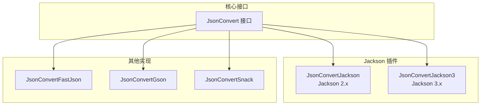
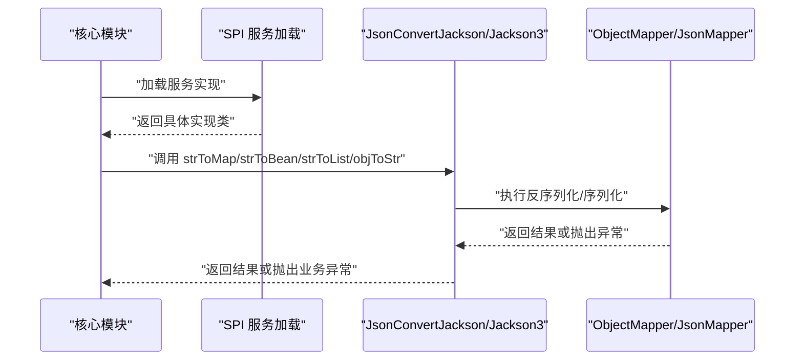
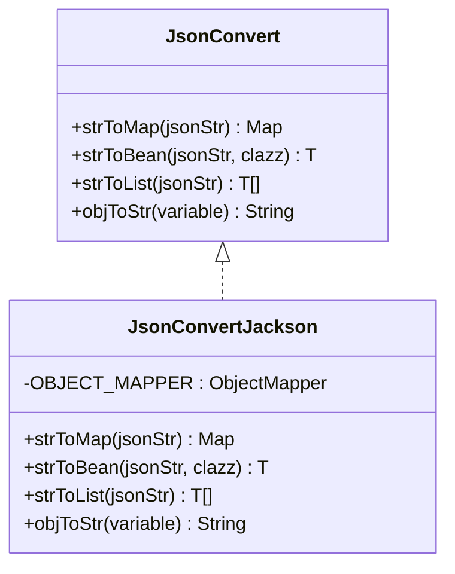
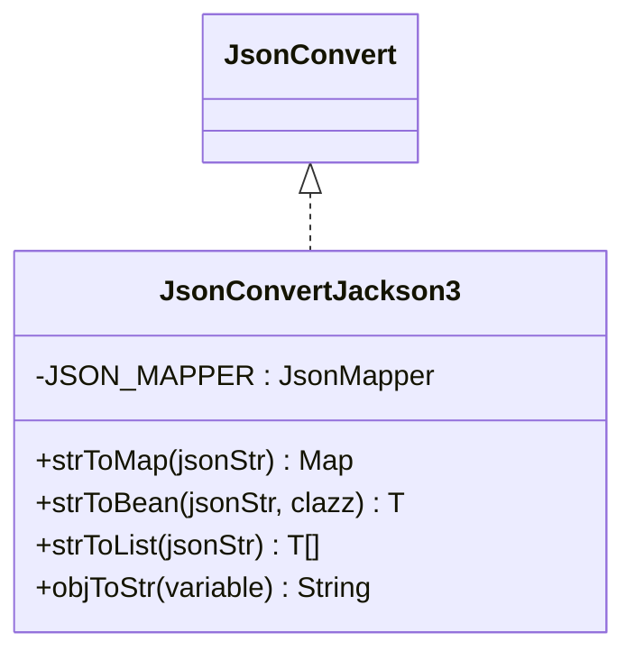
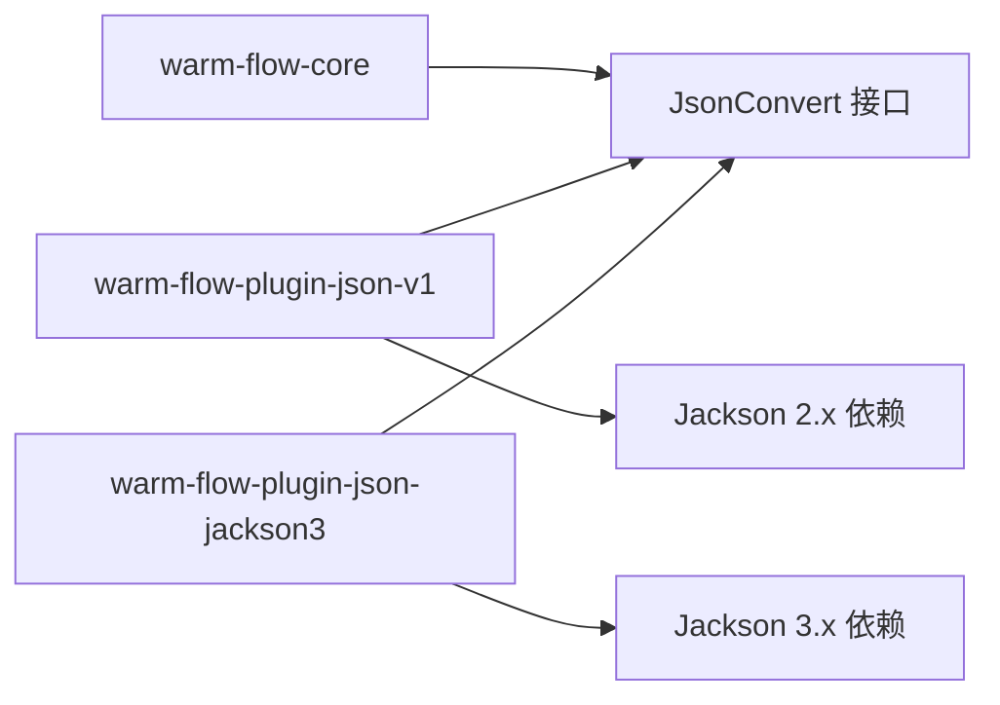

# Jackson 序列化插件

<cite>
**本文档引用的文件**
- [JsonConvert.java](file://warm-flow-core/src/main/java/org/dromara/warm/flow/core/json/JsonConvert.java)
- [JsonConvertJackson.java](file://warm-flow-plugin/warm-flow-plugin-json/warm-flow-plugin-json-v1/src/main/java/org/dromara/warm/plugin/json/JsonConvertJackson.java)
- [JsonConvertJackson3.java](file://warm-flow-plugin/warm-flow-plugin-json/warm-flow-plugin-json-jackson3/src/main/java/org/dromara/warm/plugin/json/JsonConvertJackson3.java)
- [JsonConvertFastJson.java](file://warm-flow-plugin/warm-flow-plugin-json/warm-flow-plugin-json-v1/src/main/java/org/dromara/warm/plugin/json/JsonConvertFastJson.java)
- [JsonConvertGson.java](file://warm-flow-plugin/warm-flow-plugin-json/warm-flow-plugin-json-v1/src/main/java/org/dromara/warm/plugin/json/JsonConvertGson.java)
- [JsonConvertSnack.java](file://warm-flow-plugin/warm-flow-plugin-json/warm-flow-plugin-json-v1/src/main/java/org/dromara/warm/plugin/json/JsonConvertSnack.java)
- [org.dromara.warm.flow.core.json.JsonConvert（SPI）](file://warm-flow-plugin/warm-flow-plugin-json/warm-flow-plugin-json-v1/src/main/resources/META-INF/services/org.dromara.warm.flow.core.json.JsonConvert)
- [org.dromara.warm.flow.core.json.JsonConvert（SPI，Jackson3）](file://warm-flow-plugin/warm-flow-plugin-json/warm-flow-plugin-json-jackson3/src/main/resources/META-INF/services/org.dromara.warm.flow.core.json.JsonConvert)
- [warm-flow-plugin-json-v1/pom.xml](file://warm-flow-plugin/warm-flow-plugin-json/warm-flow-plugin-json-v1/pom.xml)
- [warm-flow-plugin-json-jackson3/pom.xml](file://warm-flow-plugin/warm-flow-plugin-json/warm-flow-plugin-json-jackson3/pom.xml)
</cite>

## 目录
1. [简介](#简介)
2. [项目结构](#项目结构)
3. [核心组件](#核心组件)
4. [架构总览](#架构总览)
5. [详细组件分析](#详细组件分析)
6. [依赖关系分析](#依赖关系分析)
7. [性能考量](#性能考量)
8. [故障排查指南](#故障排查指南)
9. [结论](#结论)
10. [附录](#附录)

## 简介
本文件面向传统 Jackson 序列化插件的技术文档，聚焦 JsonConvertJackson 类的实现机制，涵盖 ObjectMapper 配置、注解支持、模块注册等核心能力；同时对比 Jackson3 实现，明确两者差异与向后兼容性，并给出在传统项目中的应用价值与迁移建议。文档还提供使用指南，覆盖循环引用处理、自定义序列化器、日期格式化、枚举序列化等高级特性，并包含与其他 JSON 库的性能对比与迁移指南。

## 项目结构
Jackson 插件位于 warm-flow-plugin-json 模块中，分为两个实现：
- 传统 Jackson 实现：JsonConvertJackson（基于 Jackson 2.x）
- Jackson3 实现：JsonConvertJackson3（基于 tools.jackson 3.x）

二者均通过 SPI 接口 org.dromara.warm.flow.core.json.JsonConvert 对外暴露统一能力，便于运行时按需选择。

图表来源
- [JsonConvert.java:26-61](file://warm-flow-core/src/main/java/org/dromara/warm/flow/core/json/JsonConvert.java#L26-L61)
- [JsonConvertJackson.java:41-127](file://warm-flow-plugin/warm-flow-plugin-json/warm-flow-plugin-json-v1/src/main/java/org/dromara/warm/plugin/json/JsonConvertJackson.java#L41-L127)
- [JsonConvertJackson3.java:37-124](file://warm-flow-plugin/warm-flow-plugin-json/warm-flow-plugin-json-jackson3/src/main/java/org/dromara/warm/plugin/json/JsonConvertJackson3.java#L37-L124)
- [JsonConvertFastJson.java:34-95](file://warm-flow-plugin/warm-flow-plugin-json/warm-flow-plugin-json-v1/src/main/java/org/dromara/warm/plugin/json/JsonConvertFastJson.java#L34-L95)
- [JsonConvertGson.java:35-99](file://warm-flow-plugin/warm-flow-plugin-json/warm-flow-plugin-json-v1/src/main/java/org/dromara/warm/plugin/json/JsonConvertGson.java#L35-L99)
- [JsonConvertSnack.java:35-90](file://warm-flow-plugin/warm-flow-plugin-json/warm-flow-plugin-json-v1/src/main/java/org/dromara/warm/plugin/json/JsonConvertSnack.java#L35-L90)

章节来源
- [JsonConvert.java:26-61](file://warm-flow-core/src/main/java/org/dromara/warm/flow/core/json/JsonConvert.java#L26-L61)
- [JsonConvertJackson.java:41-127](file://warm-flow-plugin/warm-flow-plugin-json/warm-flow-plugin-json-v1/src/main/java/org/dromara/warm/plugin/json/JsonConvertJackson.java#L41-L127)
- [JsonConvertJackson3.java:37-124](file://warm-flow-plugin/warm-flow-plugin-json/warm-flow-plugin-json-jackson3/src/main/java/org/dromara/warm/plugin/json/JsonConvertJackson3.java#L37-L124)
- [JsonConvertFastJson.java:34-95](file://warm-flow-plugin/warm-flow-plugin-json/warm-flow-plugin-json-v1/src/main/java/org/dromara/warm/plugin/json/JsonConvertFastJson.java#L34-L95)
- [JsonConvertGson.java:35-99](file://warm-flow-plugin/warm-flow-plugin-json/warm-flow-plugin-json-v1/src/main/java/org/dromara/warm/plugin/json/JsonConvertGson.java#L35-L99)
- [JsonConvertSnack.java:35-90](file://warm-flow-plugin/warm-flow-plugin-json/warm-flow-plugin-json-v1/src/main/java/org/dromara/warm/plugin/json/JsonConvertSnack.java#L35-L90)

## 核心组件
- JsonConvert 接口：定义统一的 JSON 能力契约，包括字符串到 Map/Bean/集合的反序列化，以及对象到字符串的序列化。
- JsonConvertJackson：基于 Jackson 2.x 的实现，默认禁用“未知属性报错”，默认排除空值字段，提供 Map、Bean、List 的转换能力。
- JsonConvertJackson3：基于 Jackson 3.x 的实现，采用 JsonMapper.builder 构建，同样禁用“未知属性报错”，提供与接口一致的能力。
- 其他实现：JsonConvertFastJson、JsonConvertGson、JsonConvertSnack 提供多库对比参考。

章节来源
- [JsonConvert.java:26-61](file://warm-flow-core/src/main/java/org/dromara/warm/flow/core/json/JsonConvert.java#L26-L61)
- [JsonConvertJackson.java:41-127](file://warm-flow-plugin/warm-flow-plugin-json/warm-flow-plugin-json-v1/src/main/java/org/dromara/warm/plugin/json/JsonConvertJackson.java#L41-L127)
- [JsonConvertJackson3.java:37-124](file://warm-flow-plugin/warm-flow-plugin-json/warm-flow-plugin-json-jackson3/src/main/java/org/dromara/warm/plugin/json/JsonConvertJackson3.java#L37-L124)

## 架构总览
插件通过 SPI 机制对外暴露实现，运行时由 warm-flow-core 加载具体实现。Jackson 实现内部持有 ObjectMapper 或 JsonMapper 单例，负责实际的序列化与反序列化工作。

图表来源
- [JsonConvert.java:26-61](file://warm-flow-core/src/main/java/org/dromara/warm/flow/core/json/JsonConvert.java#L26-L61)
- [JsonConvertJackson.java:55-125](file://warm-flow-plugin/warm-flow-plugin-json/warm-flow-plugin-json-v1/src/main/java/org/dromara/warm/plugin/json/JsonConvertJackson.java#L55-L125)
- [JsonConvertJackson3.java:51-121](file://warm-flow-plugin/warm-flow-plugin-json/warm-flow-plugin-json-jackson3/src/main/java/org/dromara/warm/plugin/json/JsonConvertJackson3.java#L51-L121)

## 详细组件分析

### JsonConvertJackson 组件分析
- ObjectMapper 配置
  - 默认禁用“未知属性报错”以提升容错性。
  - 设置序列化包含策略为非空字段，避免输出冗余。
- 注解支持
  - 通过 Jackson 默认注解支持（如 @JsonIgnore、@JsonProperty 等）生效，无需额外注册模块。
- 模块注册
  - 未显式注册额外模块，若需扩展（如 JavaTime、Jdk8 等），可在外部初始化时注入自定义 ObjectMapper。
- 处理逻辑
  - 字符串转 Map/Bean/List：使用 TypeFactory 或 TypeReference 完成泛型类型安全解析。
  - 对象转字符串：直接序列化，异常统一包装为业务异常。

图表来源
- [JsonConvert.java:26-61](file://warm-flow-core/src/main/java/org/dromara/warm/flow/core/json/JsonConvert.java#L26-L61)
- [JsonConvertJackson.java:41-127](file://warm-flow-plugin/warm-flow-plugin-json/warm-flow-plugin-json-v1/src/main/java/org/dromara/warm/plugin/json/JsonConvertJackson.java#L41-L127)

章节来源
- [JsonConvertJackson.java:41-127](file://warm-flow-plugin/warm-flow-plugin-json/warm-flow-plugin-json-v1/src/main/java/org/dromara/warm/plugin/json/JsonConvertJackson.java#L41-L127)

### JsonConvertJackson3 组件分析
- JsonMapper 配置
  - 使用 builder 模式构建，禁用“未知属性报错”。
- 注解支持
  - 同样依赖 Jackson 默认注解，无需额外模块。
- 模块注册
  - 未显式注册模块，扩展方式同上。
- 处理逻辑
  - 与 Jackson 2.x 实现一致，提供相同接口能力。

图表来源
- [JsonConvertJackson3.java:37-124](file://warm-flow-plugin/warm-flow-plugin-json/warm-flow-plugin-json-jackson3/src/main/java/org/dromara/warm/plugin/json/JsonConvertJackson3.java#L37-L124)

章节来源
- [JsonConvertJackson3.java:37-124](file://warm-flow-plugin/warm-flow-plugin-json/warm-flow-plugin-json-jackson3/src/main/java/org/dromara/warm/plugin/json/JsonConvertJackson3.java#L37-L124)

### Jackson 与 Jackson3 的差异与兼容性
- 版本差异
  - Jackson 2.x：使用 com.fasterxml.jackson.* 包，ObjectMapper 默认配置更丰富，社区生态成熟。
  - Jackson 3.x：使用 tools.jackson.* 包，API 更加简洁，builder 模式成为主流。
- 兼容性考虑
  - 两者均实现同一接口，运行时可通过 SPI 切换。
  - 若项目已全面升级至 Jackson 3.x，推荐使用 JsonConvertJackson3；若仍使用 Jackson 2.x，使用 JsonConvertJackson。
- 迁移建议
  - 逐步替换依赖坐标与包名，保持接口不变，减少业务侵入。
  - 注意工具类与注解包名变化，确保注解正确生效。

章节来源
- [JsonConvertJackson.java:18-26](file://warm-flow-plugin/warm-flow-plugin-json/warm-flow-plugin-json-v1/src/main/java/org/dromara/warm/plugin/json/JsonConvertJackson.java#L18-L26)
- [JsonConvertJackson3.java:24-26](file://warm-flow-plugin/warm-flow-plugin-json/warm-flow-plugin-json-jackson3/src/main/java/org/dromara/warm/plugin/json/JsonConvertJackson3.java#L24-L26)

### 使用指南与高级特性

- 循环引用处理
  - Jackson 默认不处理循环引用，可能导致序列化异常。可在外部注入自定义 ObjectMapper 并启用相应特性（例如开启特定特性或使用自定义模块）。
  - 建议在系统初始化阶段完成 ObjectMapper 注入，避免运行时切换带来的复杂度。
- 自定义序列化器
  - 可通过注册 SimpleModule 添加 Serializer/Deserializer，配合注解使用。
  - 在 warm-flow 中，如需扩展，可在外部创建 ObjectMapper 并注入到插件使用的上下文中。
- 日期格式化
  - 可通过 Jackson 的 JavaTime 模块或自定义序列化器实现统一格式化。
  - 建议在全局配置中设置默认时间格式，保证跨模块一致性。
- 枚举序列化
  - Jackson 默认将枚举序列化为其名称；可通过注解或自定义序列化器改为序数或其他形式。
  - 在 warm-flow 中，如需统一策略，建议在外部配置 ObjectMapper 的枚举序列化行为。

章节来源
- [JsonConvertJackson.java:45-47](file://warm-flow-plugin/warm-flow-plugin-json/warm-flow-plugin-json-v1/src/main/java/org/dromara/warm/plugin/json/JsonConvertJackson.java#L45-L47)
- [JsonConvertJackson3.java:41-43](file://warm-flow-plugin/warm-flow-plugin-json/warm-flow-plugin-json-jackson3/src/main/java/org/dromara/warm/plugin/json/JsonConvertJackson3.java#L41-L43)

### 与其他 JSON 库的对比与迁移指南

- 性能对比（概念性说明）
  - Jackson 在大数据量场景下通常具备较好的吞吐与内存表现；Gson 语法简洁但解析开销略高；Fastjson 在某些场景下更快但稳定性与安全性需谨慎评估；Snack 轻量但生态相对有限。
  - 本项目通过 SPI 抽象，便于在不同实现间切换以验证性能与稳定性。
- 迁移步骤（概念性说明）
  - 明确目标版本（Jackson 2.x 或 3.x）。
  - 替换依赖坐标与包名，确保注解与模块可用。
  - 通过 SPI 配置选择新实现，进行端到端回归测试。
  - 逐步清理旧实现依赖，固化配置。

章节来源
- [JsonConvertFastJson.java:34-95](file://warm-flow-plugin/warm-flow-plugin-json/warm-flow-plugin-json-v1/src/main/java/org/dromara/warm/plugin/json/JsonConvertFastJson.java#L34-L95)
- [JsonConvertGson.java:35-99](file://warm-flow-plugin/warm-flow-plugin-json/warm-flow-plugin-json-v1/src/main/java/org/dromara/warm/plugin/json/JsonConvertGson.java#L35-L99)
- [JsonConvertSnack.java:35-90](file://warm-flow-plugin/warm-flow-plugin-json/warm-flow-plugin-json-v1/src/main/java/org/dromara/warm/plugin/json/JsonConvertSnack.java#L35-L90)

## 依赖关系分析

图表来源
- [warm-flow-plugin-json-v1/pom.xml:34-38](file://warm-flow-plugin/warm-flow-plugin-json/warm-flow-plugin-json-v1/pom.xml#L34-L38)
- [warm-flow-plugin-json-jackson3/pom.xml:22-26](file://warm-flow-plugin/warm-flow-plugin-json/warm-flow-plugin-json-jackson3/pom.xml#L22-L26)

章节来源
- [warm-flow-plugin-json-v1/pom.xml:34-38](file://warm-flow-plugin/warm-flow-plugin-json/warm-flow-plugin-json-v1/pom.xml#L34-L38)
- [warm-flow-plugin-json-jackson3/pom.xml:22-26](file://warm-flow-plugin/warm-flow-plugin-json/warm-flow-plugin-json-jackson3/pom.xml#L22-L26)

## 性能考量
- ObjectMapper/JsonMapper 单例化：避免重复创建带来的初始化成本。
- 泛型类型安全：使用 TypeFactory/TypeReference 确保泛型正确解析，减少运行时错误与重试。
- 序列化策略：默认排除空值字段有助于减小体积，但需结合业务需求权衡。
- 外部扩展：在需要高性能场景下，建议在系统启动时注入自定义 ObjectMapper/JsonMapper，并集中管理模块与特性。

## 故障排查指南
- 常见问题
  - 未知属性导致反序列化失败：Jackson 2.x 已禁用“未知属性报错”，Jackson 3.x 同样禁用；如仍出现异常，检查是否被外部覆盖。
  - 空值字段过多：默认排除空值字段，如需保留，请在外部配置 ObjectMapper/JsonMapper。
  - 循环引用：默认不处理循环引用，建议启用相应特性或使用自定义模块。
- 异常处理
  - 所有 IO/解析异常统一包装为业务异常，便于上层捕获与记录日志。
- 排查步骤
  - 确认 SPI 配置正确加载所需实现。
  - 检查输入数据格式与类型是否匹配。
  - 如需扩展，确认自定义 ObjectMapper/JsonMapper 是否正确注入。

章节来源
- [JsonConvertJackson.java:55-125](file://warm-flow-plugin/warm-flow-plugin-json/warm-flow-plugin-json-v1/src/main/java/org/dromara/warm/plugin/json/JsonConvertJackson.java#L55-L125)
- [JsonConvertJackson3.java:51-121](file://warm-flow-plugin/warm-flow-plugin-json/warm-flow-plugin-json-jackson3/src/main/java/org/dromara/warm/plugin/json/JsonConvertJackson3.java#L51-L121)

## 结论
JsonConvertJackson 与 JsonConvertJackson3 提供了稳定、简洁的 JSON 能力，满足 warm-flow 在多场景下的序列化与反序列化需求。两者通过 SPI 对接核心接口，便于在传统项目中平滑引入与后续迁移。对于需要更高性能或新特性的项目，可优先考虑 Jackson 3.x；对于广泛兼容的存量项目，Jackson 2.x 仍是可靠选择。通过合理的 ObjectMapper/JsonMapper 配置与模块扩展，可进一步满足循环引用、日期格式化、枚举序列化等高级需求。

## 附录

### SPI 配置与加载
- 传统 Jackson 实现通过 SPI 暴露多个候选实现，Jackson3 实现仅暴露自身实现。
- 运行时由 warm-flow-core 加载具体实现，确保接口一致。

章节来源
- [org.dromara.warm.flow.core.json.JsonConvert（SPI）:1-6](file://warm-flow-plugin/warm-flow-plugin-json/warm-flow-plugin-json-v1/src/main/resources/META-INF/services/org.dromara.warm.flow.core.json.JsonConvert#L1-L6)
- [org.dromara.warm.flow.core.json.JsonConvert（SPI，Jackson3）:1-1](file://warm-flow-plugin/warm-flow-plugin-json/warm-flow-plugin-json-jackson3/src/main/resources/META-INF/services/org.dromara.warm.flow.core.json.JsonConvert#L1-L1)