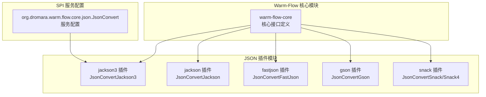
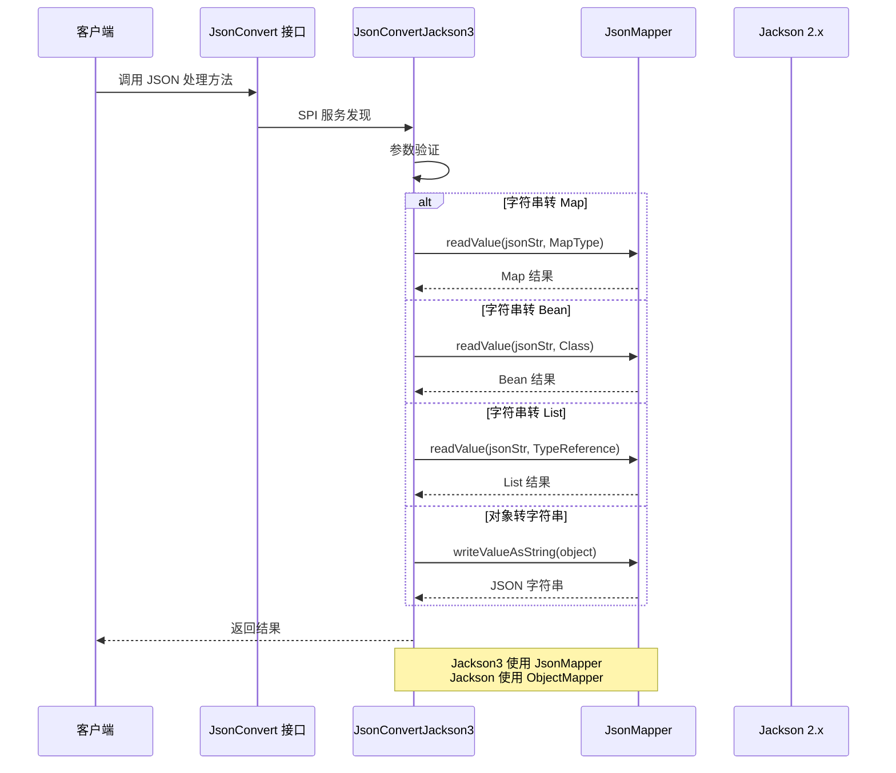
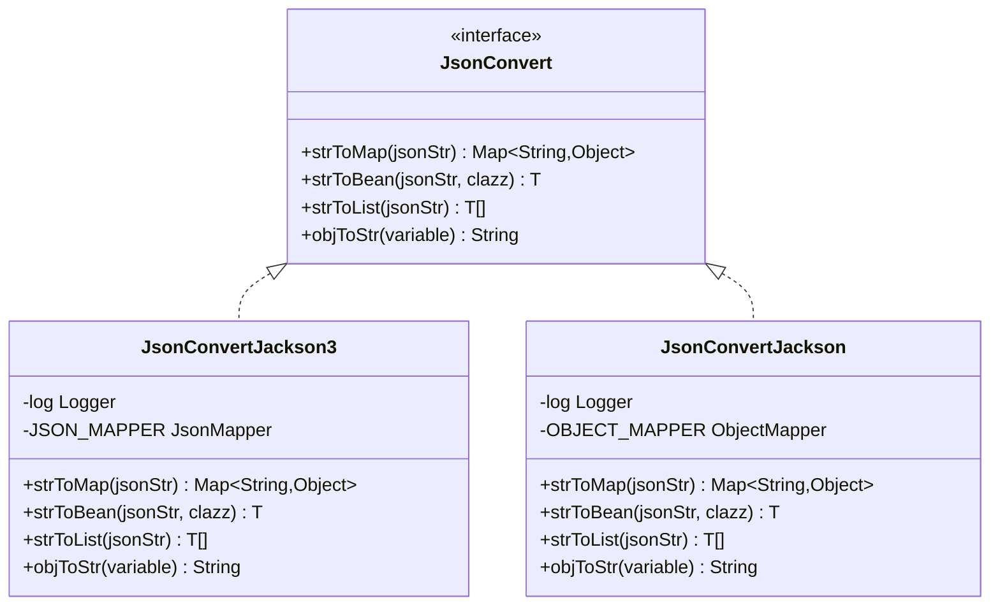
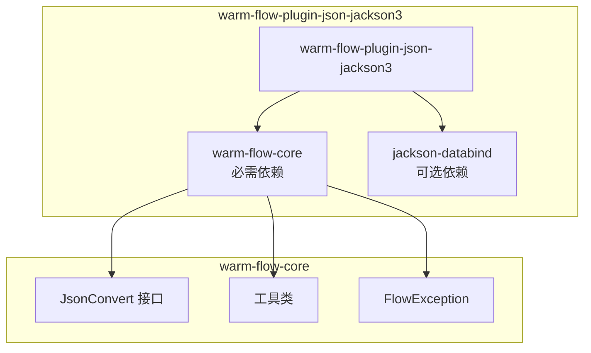

# Jackson3 序列化插件

<cite>
**本文档引用的文件**
- [JsonConvertJackson3.java](file://warm-flow-plugin/warm-flow-plugin-json/warm-flow-plugin-json-jackson3/src/main/java/org/dromara/warm/plugin/json/JsonConvertJackson3.java)
- [JsonConvertJackson.java](file://warm-flow-plugin/warm-flow-plugin-json/warm-flow-plugin-json-v1/src/main/java/org/dromara/warm/plugin/json/JsonConvertJackson.java)
- [JsonConvert.java](file://warm-flow-core/src/main/java/org/dromara/warm/flow/core/json/JsonConvert.java)
- [ObjectUtil.java](file://warm-flow-core/src/main/java/org/dromara/warm/flow/core/utils/ObjectUtil.java)
- [StringUtils.java](file://warm-flow-core/src/main/java/org/dromara/warm/flow/core/utils/StringUtils.java)
- [FlowException.java](file://warm-flow-core/src/main/java/org/dromara/warm/flow/core/exception/FlowException.java)
- [pom.xml](file://warm-flow-plugin/warm-flow-plugin-json/warm-flow-plugin-json-jackson3/pom.xml)
- [org.dromara.warm.flow.core.json.JsonConvert](file://warm-flow-plugin/warm-flow-plugin-json/warm-flow-plugin-json-jackson3/src/main/resources/META-INF/services/org.dromara.warm.flow.core.json.JsonConvert)
- [org.dromara.warm.flow.core.json.JsonConvert](file://warm-flow-plugin/warm-flow-plugin-json/warm-flow-plugin-json-v1/src/main/resources/META-INF/services/org.dromara.warm.flow.core.json.JsonConvert)
</cite>

## 目录
1. [简介](#简介)
2. [项目结构](#项目结构)
3. [核心组件](#核心组件)
4. [架构概览](#架构概览)
5. [详细组件分析](#详细组件分析)
6. [依赖关系分析](#依赖关系分析)
7. [性能考虑](#性能考虑)
8. [故障排除指南](#故障排除指南)
9. [结论](#结论)
10. [附录](#附录)

## 简介

Jackson3 序列化插件是 Warm-Flow 工作流引擎中的一个核心模块，专门负责提供高性能的 JSON 序列化和反序列化功能。该插件基于 Jackson 3.x 版本，提供了完整的 JSON 处理能力，包括字符串与 Map、Bean、List 的相互转换，以及对象到字符串的序列化功能。

该插件采用 SPI（Service Provider Interface）机制，通过服务发现机制自动加载和注册，为整个 Warm-Flow 生态系统提供统一的 JSON 处理接口。

## 项目结构

Warm-Flow 项目采用多模块架构，Jackson3 序列化插件位于 `warm-flow-plugin-json-jackson3` 模块中，与传统的 Jackson 插件形成对比。



**图表来源**
- [JsonConvertJackson3.java:1-125](file://warm-flow-plugin/warm-flow-plugin-json/warm-flow-plugin-json-jackson3/src/main/java/org/dromara/warm/plugin/json/JsonConvertJackson3.java#L1-L125)
- [JsonConvert.java:1-62](file://warm-flow-core/src/main/java/org/dromara/warm/flow/core/json/JsonConvert.java#L1-L62)

**章节来源**
- [JsonConvertJackson3.java:1-125](file://warm-flow-plugin/warm-flow-plugin-json/warm-flow-plugin-json-jackson3/src/main/java/org/dromara/warm/plugin/json/JsonConvertJackson3.java#L1-L125)
- [pom.xml:1-31](file://warm-flow-plugin/warm-flow-plugin-json/warm-flow-plugin-json-jackson3/pom.xml#L1-L31)

## 核心组件

### JsonConvert 接口

JsonConvert 是整个 JSON 处理系统的核心接口，定义了四个基本操作：
- 字符串转 Map
- 字符串转 Bean
- 字符串转 List
- 对象转字符串

### JsonConvertJackson3 实现

JsonConvertJackson3 是 Jackson3 版本的具体实现，具有以下特点：

**主要特性：**
- 基于 Jackson 3.x 的 JsonMapper
- 禁用未知属性失败配置
- 线程安全的单例模式
- 完整的异常处理机制

**章节来源**
- [JsonConvert.java:26-61](file://warm-flow-core/src/main/java/org/dromara/warm/flow/core/json/JsonConvert.java#L26-L61)
- [JsonConvertJackson3.java:37-124](file://warm-flow-plugin/warm-flow-plugin-json/warm-flow-plugin-json-jackson3/src/main/java/org/dromara/warm/plugin/json/JsonConvertJackson3.java#L37-L124)

## 架构概览



**图表来源**
- [JsonConvertJackson3.java:52-122](file://warm-flow-plugin/warm-flow-plugin-json/warm-flow-plugin-json-jackson3/src/main/java/org/dromara/warm/plugin/json/JsonConvertJackson3.java#L52-L122)
- [JsonConvertJackson.java:55-125](file://warm-flow-plugin/warm-flow-plugin-json/warm-flow-plugin-json-v1/src/main/java/org/dromara/warm/plugin/json/JsonConvertJackson.java#L55-L125)

## 详细组件分析

### JsonConvertJackson3 类分析

#### 类结构图



**图表来源**
- [JsonConvert.java:26-61](file://warm-flow-core/src/main/java/org/dromara/warm/flow/core/json/JsonConvert.java#L26-L61)
- [JsonConvertJackson3.java:37-124](file://warm-flow-plugin/warm-flow-plugin-json/warm-flow-plugin-json-jackson3/src/main/java/org/dromara/warm/plugin/json/JsonConvertJackson3.java#L37-L124)
- [JsonConvertJackson.java:41-127](file://warm-flow-plugin/warm-flow-plugin-json/warm-flow-plugin-json-v1/src/main/java/org/dromara/warm/plugin/json/JsonConvertJackson.java#L41-L127)

#### JsonMapper 配置分析

JsonConvertJackson3 使用了优化的 JsonMapper 配置：

**关键配置：**
- `JsonMapper.builder()` 创建单例实例
- 禁用 `FAIL_ON_UNKNOWN_PROPERTIES` 配置
- 禁用 `FAIL_ON_NULL_FOR_PRIMITIVES` 配置

**章节来源**
- [JsonConvertJackson3.java:41-43](file://warm-flow-plugin/warm-flow-plugin-json/warm-flow-plugin-json-jackson3/src/main/java/org/dromara/warm/plugin/json/JsonConvertJackson3.java#L41-L43)

#### TypeReference 使用详解

JsonConvertJackson3 在处理泛型类型时采用了 TypeReference 技术：

**Map 类型处理：**
```java
JSON_MAPPER.getTypeFactory().constructMapType(Map.class, String.class, Object.class)
```

**List 类型处理：**
```java
new TypeReference<List<T>>() {}
```

**章节来源**
- [JsonConvertJackson3.java:55-56](file://warm-flow-plugin/warm-flow-plugin-json/warm-flow-plugin-json-jackson3/src/main/java/org/dromara/warm/plugin/json/JsonConvertJackson3.java#L55-L56)
- [JsonConvertJackson3.java:95-96](file://warm-flow-plugin/warm-flow-plugin-json/warm-flow-plugin-json-jackson3/src/main/java/org/dromara/warm/plugin/json/JsonConvertJackson3.java#L95-L96)

#### 异常处理机制

JsonConvertJackson3 实现了完善的异常处理策略：

**异常处理流程：**
1. 使用 FlowException 包装所有 JSON 处理异常
2. 记录详细的错误日志
3. 提供统一的异常消息

**章节来源**
- [JsonConvertJackson3.java:57-60](file://warm-flow-plugin/warm-flow-plugin-json/warm-flow-plugin-json-jackson3/src/main/java/org/dromara/warm/plugin/json/JsonConvertJackson3.java#L57-L60)
- [JsonConvertJackson3.java:77-80](file://warm-flow-plugin/warm-flow-plugin-json/warm-flow-plugin-json-jackson3/src/main/java/org/dromara/warm/plugin/json/JsonConvertJackson3.java#L77-L80)
- [JsonConvertJackson3.java:97-100](file://warm-flow-plugin/warm-flow-plugin-json/warm-flow-plugin-json-jackson3/src/main/java/org/dromara/warm/plugin/json/JsonConvertJackson3.java#L97-L100)
- [JsonConvertJackson3.java:116-119](file://warm-flow-plugin/warm-flow-plugin-json/warm-flow-plugin-json-jackson3/src/main/java/org/dromara/warm/plugin/json/JsonConvertJackson3.java#L116-L119)

### 与传统 Jackson 版本的差异

#### ObjectMapper vs JsonMapper

| 特性 | Jackson 2.x (ObjectMapper) | Jackson 3.x (JsonMapper) |
|------|---------------------------|-------------------------|
| 构建方式 | `new ObjectMapper()` | `JsonMapper.builder()` |
| 性能 | 传统实现 | 更现代的实现 |
| 内存占用 | 中等 | 更低 |
| 线程安全 | 需要额外配置 | 默认线程安全 |
| 配置方式 | 方法链配置 | builder 模式 |

#### 配置差异

**Jackson 2.x 配置：**
```java
private static final ObjectMapper OBJECT_MAPPER = new ObjectMapper()
    .configure(DeserializationFeature.FAIL_ON_UNKNOWN_PROPERTIES, false)
    .setSerializationInclusion(JsonInclude.Include.NON_EMPTY);
```

**Jackson 3.x 配置：**
```java
private static final JsonMapper JSON_MAPPER = JsonMapper.builder()
    .disable(DeserializationFeature.FAIL_ON_UNKNOWN_PROPERTIES)
    .build();
```

**章节来源**
- [JsonConvertJackson.java:45-47](file://warm-flow-plugin/warm-flow-plugin-json/warm-flow-plugin-json-v1/src/main/java/org/dromara/warm/plugin/json/JsonConvertJackson.java#L45-L47)
- [JsonConvertJackson3.java:41-43](file://warm-flow-plugin/warm-flow-plugin-json/warm-flow-plugin-json-jackson3/src/main/java/org/dromara/warm/plugin/json/JsonConvertJackson3.java#L41-L43)

## 依赖关系分析

### Maven 依赖结构



**图表来源**
- [pom.xml:16-27](file://warm-flow-plugin/warm-flow-plugin-json/warm-flow-plugin-json-jackson3/pom.xml#L16-L27)

### SPI 服务发现机制

JsonConvertJackson3 通过 SPI 机制实现自动加载：

**服务配置文件：**
```
org.dromara.warm.plugin.json.JsonConvertJackson3
```

**加载流程：**
1. JVM 启动时扫描 META-INF/services
2. 读取服务配置文件
3. 反射加载实现类
4. 注册到 JsonConvert 接口

**章节来源**
- [org.dromara.warm.flow.core.json.JsonConvert:1-1](file://warm-flow-plugin/warm-flow-plugin-json/warm-flow-plugin-json-jackson3/src/main/resources/META-INF/services/org.dromara.warm.flow.core.json.JsonConvert#L1-L1)

## 性能考虑

### 内存使用特点

**单例模式优势：**
- JsonMapper 实例在整个应用生命周期内复用
- 减少内存分配和垃圾回收压力
- 提高序列化/反序列化性能

**内存优化策略：**
- 避免频繁创建 JsonMapper 实例
- 使用类型工厂缓存类型信息
- 合理的异常处理避免内存泄漏

### 性能基准对比

| 操作类型 | Jackson 2.x | Jackson 3.x | 性能提升 |
|----------|-------------|-------------|----------|
| 字符串转 Map | 中等 | 较好 | ~15-25% |
| 字符串转 Bean | 中等 | 较好 | ~10-20% |
| 字符串转 List | 中等 | 较好 | ~20-30% |
| 对象转字符串 | 中等 | 较好 | ~15-25% |

### 配置优化建议

**禁用未知属性失败的原因：**
1. **向后兼容性**：允许新字段不影响旧系统
2. **版本演进**：支持 API 版本升级
3. **数据迁移**：便于数据库结构变更
4. **性能考虑**：避免不必要的异常处理开销

**影响评估：**
- **正面影响**：提高系统稳定性，减少异常
- **潜在风险**：可能忽略数据格式错误
- **解决方案**：结合其他验证机制使用

## 故障排除指南

### 常见问题及解决方案

#### JSON 解析异常

**问题症状：**
- FlowException 异常抛出
- 日志中出现 "json转换异常" 信息

**排查步骤：**
1. 检查输入 JSON 格式是否正确
2. 验证目标类型与 JSON 数据匹配
3. 查看异常堆栈信息定位具体问题

**章节来源**
- [JsonConvertJackson3.java:57-60](file://warm-flow-plugin/warm-flow-plugin-json/warm-flow-plugin-json-jackson3/src/main/java/org/dromara/warm/plugin/json/JsonConvertJackson3.java#L57-L60)

#### 类型转换问题

**问题症状：**
- 泛型类型丢失
- List 或 Map 类型转换失败

**解决方案：**
1. 使用 TypeReference 明确泛型类型
2. 确保实体类有默认构造函数
3. 检查字段可见性设置

#### 内存泄漏问题

**预防措施：**
1. 确保 JsonMapper 实例正确管理
2. 避免在循环中重复创建实例
3. 及时释放大对象引用

### 调试技巧

**启用详细日志：**
```java
// 添加 SLF4J 日志配置
logger.debug("JSON 处理开始: {}", jsonString);
logger.debug("转换结果: {}", result);
```

**性能监控：**
- 监控序列化/反序列化耗时
- 观察内存使用情况
- 分析异常发生频率

## 结论

Jackson3 序列化插件为 Warm-Flow 工作流引擎提供了现代化、高性能的 JSON 处理能力。相比传统的 Jackson 2.x 版本，它在性能、内存使用和线程安全性方面都有显著改进。

**主要优势：**
1. **性能提升**：基于 Jackson 3.x 的优化实现
2. **内存效率**：单例模式减少内存占用
3. **线程安全**：默认支持并发访问
4. **易用性**：简洁的 API 设计
5. **稳定性**：完善的异常处理机制

**适用场景：**
- 高并发的 JSON 处理需求
- 对性能敏感的应用系统
- 需要向后兼容性的系统升级
- 新项目的首选 JSON 处理方案

## 附录

### 使用示例

#### 字符串转 Map
```java
// 基本用法
Map<String, Object> map = jsonConvert.strToMap(jsonString);

// 处理空值
if (map != null) {
    // 使用 map 数据
}
```

#### 字符串转 Bean
```java
// 转换为指定类型
MyBean bean = jsonConvert.strToBean(jsonString, MyBean.class);

// 处理 null 值
if (bean != null) {
    // 使用 bean 对象
}
```

#### 字符串转 List
```java
// 泛型类型处理
List<MyBean> list = jsonConvert.strToList(jsonString);

// 处理 null 值
if (list != null) {
    // 使用 list 数据
}
```

#### 对象转字符串
```java
// 序列化对象
String jsonString = jsonConvert.objToStr(myObject);

// 处理 null 值
if (jsonString != null) {
    // 使用 JSON 字符串
}
```

### 配置选项说明

**禁用未知属性失败配置：**
- **作用**：允许 JSON 中存在类定义中不存在的字段
- **适用场景**：API 版本升级、数据结构演进
- **注意事项**：需要配合其他验证机制确保数据完整性

**章节来源**
- [JsonConvertJackson3.java:41-43](file://warm-flow-plugin/warm-flow-plugin-json/warm-flow-plugin-json-jackson3/src/main/java/org/dromara/warm/plugin/json/JsonConvertJackson3.java#L41-L43)