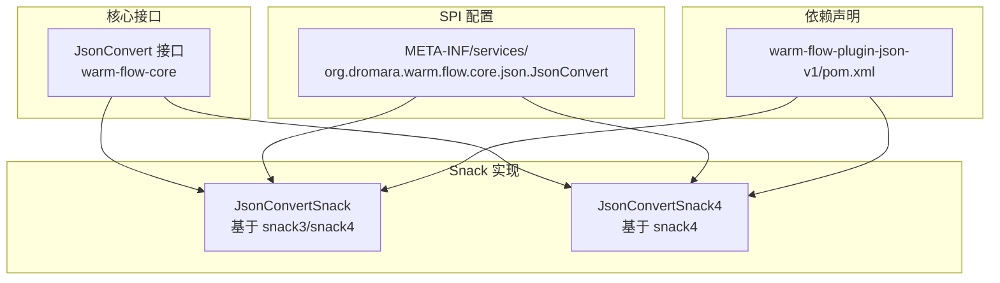
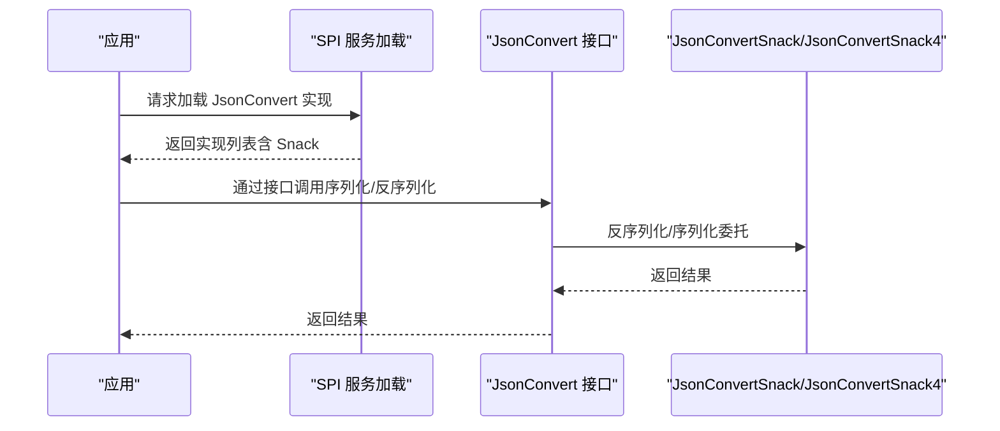
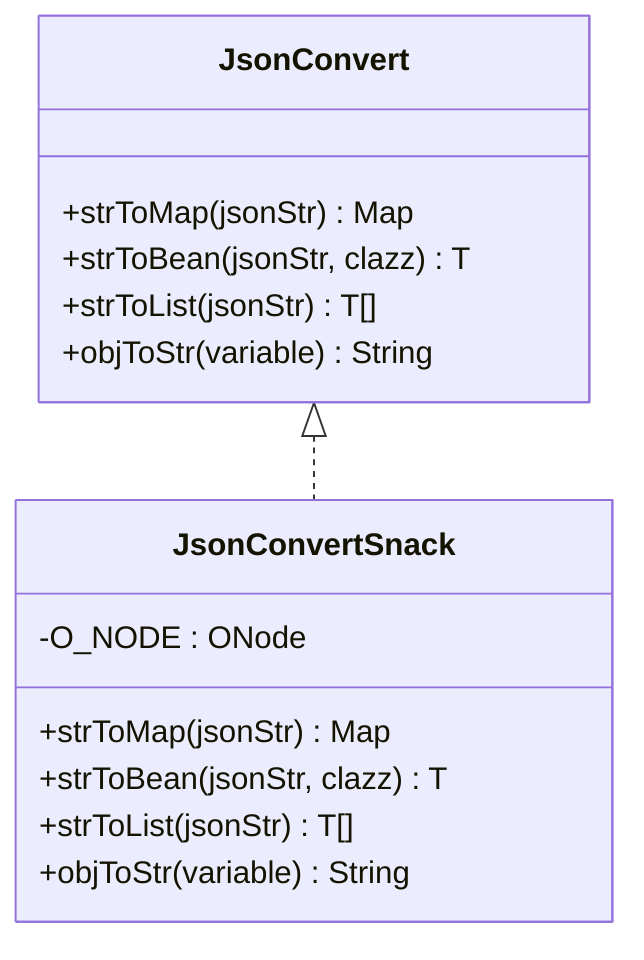
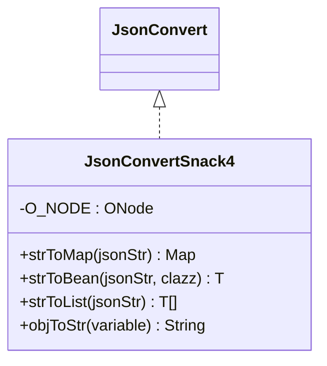
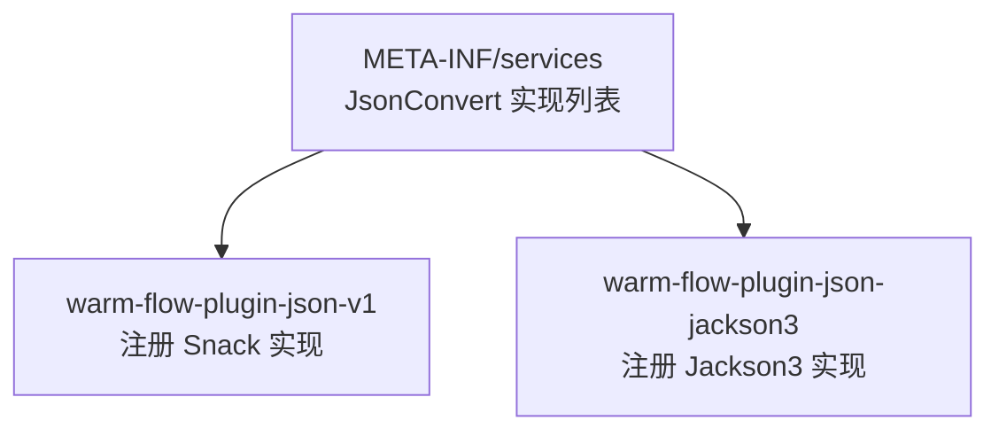
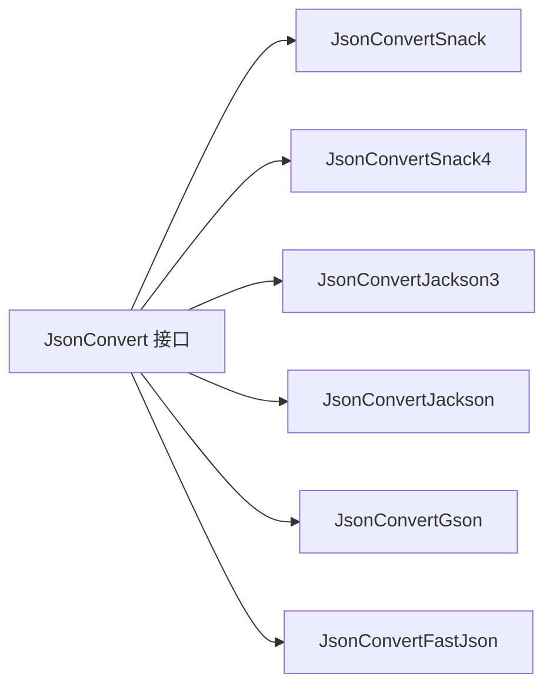

# Snack 序列化插件

<cite>
**本文引用的文件**
- [JsonConvertSnack.java](file://warm-flow-plugin/warm-flow-plugin-json/warm-flow-plugin-json-v1/src/main/java/org/dromara/warm/plugin/json/JsonConvertSnack.java)
- [JsonConvertSnack4.java](file://warm-flow-plugin/warm-flow-plugin-json/warm-flow-plugin-json-v1/src/main/java/org/dromara/warm/plugin/json/JsonConvertSnack4.java)
- [JsonConvert.java](file://warm-flow-core/src/main/java/org/dromara/warm/flow/core/json/JsonConvert.java)
- [ObjectUtil.java](file://warm-flow-core/src/main/java/org/dromara/warm/flow/core/utils/ObjectUtil.java)
- [StringUtils.java](file://warm-flow-core/src/main/java/org/dromara/warm/flow/core/utils/StringUtils.java)
- [org.dromara.warm.flow.core.json.JsonConvert](file://warm-flow-plugin/warm-flow-plugin-json/warm-flow-plugin-json-v1/src/main/resources/META-INF/services/org.dromara.warm.flow.core.json.JsonConvert)
- [org.dromara.warm.flow.core.json.JsonConvert](file://warm-flow-plugin/warm-flow-plugin-json/warm-flow-plugin-json-jackson3/src/main/resources/META-INF/services/org.dromara.warm.flow.core.json.JsonConvert)
- [pom.xml](file://warm-flow-plugin/warm-flow-plugin-json/warm-flow-plugin-json-v1/pom.xml)
</cite>

## 目录
1. [简介](#简介)
2. [项目结构](#项目结构)
3. [核心组件](#核心组件)
4. [架构总览](#架构总览)
5. [组件详解](#组件详解)
6. [依赖关系分析](#依赖关系分析)
7. [性能考量](#性能考量)
8. [故障排查指南](#故障排查指南)
9. [结论](#结论)
10. [附录](#附录)

## 简介
本文件面向“Snack 序列化插件”的技术文档，聚焦于 JsonConvertSnack 与 JsonConvertSnack4 两个实现类的设计与使用。Snack 是 Noear 社区提供的高性能 JSON 解析库，具备轻量、零依赖、易扩展的特点。在 Warm Flow 流程引擎中，通过 SPI 机制选择合适的 JsonConvert 实现，以满足不同运行环境对序列化性能与兼容性的需求。

Snack 插件的优势包括：
- 设计理念：以接口抽象统一多实现，通过 SPI 动态选择具体实现，降低耦合。
- 轻量特性：Snack 本身体积小、启动快，适合微服务与资源受限环境。
- 零依赖优势：Snack 在运行时按需加载，避免不必要的依赖引入。
- 易集成：与主流框架（Spring Boot、Solon）均可通过 Starter 或 Plugin 方式快速接入。

## 项目结构
围绕 JsonConvert 接口与 Snack 实现的相关模块如下：
- 核心接口：JsonConvert（位于 warm-flow-core）
- Snack 实现：JsonConvertSnack（v1 版本，基于 snack3/snack4）
- SPI 配置：META-INF/services/org.dromara.warm.flow.core.json.JsonConvert
- 依赖声明：warm-flow-plugin-json-v1/pom.xml 中对 snack3/snack4 的 optional 依赖

图表来源
- [JsonConvert.java:26-61](file://warm-flow-core/src/main/java/org/dromara/warm/flow/core/json/JsonConvert.java#L26-L61)
- [JsonConvertSnack.java:35-90](file://warm-flow-plugin/warm-flow-plugin-json/warm-flow-plugin-json-v1/src/main/java/org/dromara/warm/plugin/json/JsonConvertSnack.java#L35-L90)
- [JsonConvertSnack4.java:33-89](file://warm-flow-plugin/warm-flow-plugin-json/warm-flow-plugin-json-v1/src/main/java/org/dromara/warm/plugin/json/JsonConvertSnack4.java#L33-L89)
- [org.dromara.warm.flow.core.json.JsonConvert:1-6](file://warm-flow-plugin/warm-flow-plugin-json/warm-flow-plugin-json-v1/src/main/resources/META-INF/services/org.dromara.warm.flow.core.json.JsonConvert#L1-L6)
- [pom.xml:16-51](file://warm-flow-plugin/warm-flow-plugin-json/warm-flow-plugin-json-v1/pom.xml#L16-L51)

章节来源
- [JsonConvert.java:26-61](file://warm-flow-core/src/main/java/org/dromara/warm/flow/core/json/JsonConvert.java#L26-L61)
- [JsonConvertSnack.java:35-90](file://warm-flow-plugin/warm-flow-plugin-json/warm-flow-plugin-json-v1/src/main/java/org/dromara/warm/plugin/json/JsonConvertSnack.java#L35-L90)
- [JsonConvertSnack4.java:33-89](file://warm-flow-plugin/warm-flow-plugin-json/warm-flow-plugin-json-v1/src/main/java/org/dromara/warm/plugin/json/JsonConvertSnack4.java#L33-L89)
- [org.dromara.warm.flow.core.json.JsonConvert:1-6](file://warm-flow-plugin/warm-flow-plugin-json/warm-flow-plugin-json-v1/src/main/resources/META-INF/services/org.dromara.warm.flow.core.json.JsonConvert#L1-L6)
- [pom.xml:16-51](file://warm-flow-plugin/warm-flow-plugin-json/warm-flow-plugin-json-v1/pom.xml#L16-L51)

## 核心组件
- JsonConvert 接口：定义了四类核心能力：
  - 字符串转 Map
  - 字符串转 Bean
  - 字符串转 List
  - 对象转字符串
- JsonConvertSnack：基于 Snack 的实现，使用 ONode 进行序列化/反序列化。
- JsonConvertSnack4：与 Snack4 版本配合，提供一致的 API 行为。
- SPI 配置：通过 META-INF/services 暴露多个实现，便于运行时选择。
- 依赖声明：warm-flow-plugin-json-v1/pom.xml 中对 snack3/snack4 声明为 optional，避免强制依赖。

章节来源
- [JsonConvert.java:26-61](file://warm-flow-core/src/main/java/org/dromara/warm/flow/core/json/JsonConvert.java#L26-L61)
- [JsonConvertSnack.java:35-90](file://warm-flow-plugin/warm-flow-plugin-json/warm-flow-plugin-json-v1/src/main/java/org/dromara/warm/plugin/json/JsonConvertSnack.java#L35-L90)
- [JsonConvertSnack4.java:33-89](file://warm-flow-plugin/warm-flow-plugin-json/warm-flow-plugin-json-v1/src/main/java/org/dromara/warm/plugin/json/JsonConvertSnack4.java#L33-L89)
- [org.dromara.warm.flow.core.json.JsonConvert:1-6](file://warm-flow-plugin/warm-flow-plugin-json/warm-flow-plugin-json-v1/src/main/resources/META-INF/services/org.dromara.warm.flow.core.json.JsonConvert#L1-L6)
- [pom.xml:16-51](file://warm-flow-plugin/warm-flow-plugin-json/warm-flow-plugin-json-v1/pom.xml#L16-L51)

## 架构总览
Warm Flow 通过接口抽象与 SPI 机制解耦序列化实现，运行时根据可用依赖动态选择具体实现。Snack 插件作为可选实现之一，适合对性能与体积敏感的场景。

图表来源
- [org.dromara.warm.flow.core.json.JsonConvert:1-6](file://warm-flow-plugin/warm-flow-plugin-json/warm-flow-plugin-json-v1/src/main/resources/META-INF/services/org.dromara.warm.flow.core.json.JsonConvert#L1-L6)
- [JsonConvert.java:26-61](file://warm-flow-core/src/main/java/org/dromara/warm/flow/core/json/JsonConvert.java#L26-L61)
- [JsonConvertSnack.java:35-90](file://warm-flow-plugin/warm-flow-plugin-json/warm-flow-plugin-json-v1/src/main/java/org/dromara/warm/plugin/json/JsonConvertSnack.java#L35-L90)
- [JsonConvertSnack4.java:33-89](file://warm-flow-plugin/warm-flow-plugin-json/warm-flow-plugin-json-v1/src/main/java/org/dromara/warm/plugin/json/JsonConvertSnack4.java#L33-L89)

## 组件详解

### JsonConvert 接口设计
- 职责：统一字符串与对象之间的序列化/反序列化行为。
- 方法族：
  - strToMap：字符串转 Map<String,Object>
  - strToBean：字符串转指定类型 Bean
  - strToList：字符串转 List<T>
  - objToStr：对象转字符串
- 设计要点：方法签名简洁明确，便于上层业务无感切换实现。

章节来源
- [JsonConvert.java:26-61](file://warm-flow-core/src/main/java/org/dromara/warm/flow/core/json/JsonConvert.java#L26-L61)

### JsonConvertSnack 实现
- 依赖：org.noear.snack.ONode（通过 optional 依赖引入）
- 关键点：
  - 使用 StringUtils.isEmpty 进行输入判空，避免空字符串导致的异常。
  - 使用 ONode.deserialize 进行反序列化，支持 Map、Bean、List。
  - 使用 ONode.stringify 进行序列化，结合 ObjectUtil.isNotNull 做空值保护。
  - 通过静态字段 O_NODE 防止 SPI 加载时因缺失依赖而误加载实现类。

图表来源
- [JsonConvert.java:26-61](file://warm-flow-core/src/main/java/org/dromara/warm/flow/core/json/JsonConvert.java#L26-L61)
- [JsonConvertSnack.java:35-90](file://warm-flow-plugin/warm-flow-plugin-json/warm-flow-plugin-json-v1/src/main/java/org/dromara/warm/plugin/json/JsonConvertSnack.java#L35-L90)

章节来源
- [JsonConvertSnack.java:35-90](file://warm-flow-plugin/warm-flow-plugin-json/warm-flow-plugin-json-v1/src/main/java/org/dromara/warm/plugin/json/JsonConvertSnack.java#L35-L90)
- [StringUtils.java:57-69](file://warm-flow-core/src/main/java/org/dromara/warm/flow/core/utils/StringUtils.java#L57-L69)
- [ObjectUtil.java:44-46](file://warm-flow-core/src/main/java/org/dromara/warm/flow/core/utils/ObjectUtil.java#L44-L46)

### JsonConvertSnack4 实现
- 与 JsonConvertSnack 的差异：
  - 使用 ONode.serialize 替代 stringify，保持 API 一致性。
  - 仍通过静态字段 O_NODE 保证 SPI 安全加载。
- 适用场景：优先选择 snack4 的环境，获得更稳定的序列化行为。

图表来源
- [JsonConvertSnack4.java:33-89](file://warm-flow-plugin/warm-flow-plugin-json/warm-flow-plugin-json-v1/src/main/java/org/dromara/warm/plugin/json/JsonConvertSnack4.java#L33-L89)

章节来源
- [JsonConvertSnack4.java:33-89](file://warm-flow-plugin/warm-flow-plugin-json/warm-flow-plugin-json-v1/src/main/java/org/dromara/warm/plugin/json/JsonConvertSnack4.java#L33-L89)
- [StringUtils.java:57-69](file://warm-flow-core/src/main/java/org/dromara/warm/flow/core/utils/StringUtils.java#L57-L69)
- [ObjectUtil.java:44-46](file://warm-flow-core/src/main/java/org/dromara/warm/flow/core/utils/ObjectUtil.java#L44-L46)

### SPI 与依赖管理
- SPI 配置：在 warm-flow-plugin-json-v1 中注册多个实现，便于运行时选择。
- Jackson3 单独实现：在 jackson3 模块中单独暴露 JsonConvertJackson3。
- 依赖策略：pom.xml 中对 snack3/snack4 声明为 optional，避免强制依赖。

图表来源
- [org.dromara.warm.flow.core.json.JsonConvert:1-6](file://warm-flow-plugin/warm-flow-plugin-json/warm-flow-plugin-json-v1/src/main/resources/META-INF/services/org.dromara.warm.flow.core.json.JsonConvert#L1-L6)
- [org.dromara.warm.flow.core.json.JsonConvert:1-2](file://warm-flow-plugin/warm-flow-plugin-json/warm-flow-plugin-json-jackson3/src/main/resources/META-INF/services/org.dromara.warm.flow.core.json.JsonConvert#L1-L2)

章节来源
- [org.dromara.warm.flow.core.json.JsonConvert:1-6](file://warm-flow-plugin/warm-flow-plugin-json/warm-flow-plugin-json-v1/src/main/resources/META-INF/services/org.dromara.warm.flow.core.json.JsonConvert#L1-L6)
- [org.dromara.warm.flow.core.json.JsonConvert:1-2](file://warm-flow-plugin/warm-flow-plugin-json/warm-flow-plugin-json-jackson3/src/main/resources/META-INF/services/org.dromara.warm.flow.core.json.JsonConvert#L1-L2)
- [pom.xml:16-51](file://warm-flow-plugin/warm-flow-plugin-json/warm-flow-plugin-json-v1/pom.xml#L16-L51)

## 依赖关系分析
- 模块内聚：JsonConvert 接口与实现分离，实现通过 SPI 注册，降低耦合。
- 外部依赖：Snack 作为可选依赖，避免强制引入；Jackson/Gson/Fastjson 同样采用可选策略。
- 运行时选择：通过 SPI 与依赖存在性决定最终实现，提升灵活性。

图表来源
- [JsonConvert.java:26-61](file://warm-flow-core/src/main/java/org/dromara/warm/flow/core/json/JsonConvert.java#L26-L61)
- [JsonConvertSnack.java:35-90](file://warm-flow-plugin/warm-flow-plugin-json/warm-flow-plugin-json-v1/src/main/java/org/dromara/warm/plugin/json/JsonConvertSnack.java#L35-L90)
- [JsonConvertSnack4.java:33-89](file://warm-flow-plugin/warm-flow-plugin-json/warm-flow-plugin-json-v1/src/main/java/org/dromara/warm/plugin/json/JsonConvertSnack4.java#L33-L89)
- [org.dromara.warm.flow.core.json.JsonConvert:1-6](file://warm-flow-plugin/warm-flow-plugin-json/warm-flow-plugin-json-v1/src/main/resources/META-INF/services/org.dromara.warm.flow.core.json.JsonConvert#L1-L6)
- [org.dromara.warm.flow.core.json.JsonConvert:1-2](file://warm-flow-plugin/warm-flow-plugin-json/warm-flow-plugin-json-jackson3/src/main/resources/META-INF/services/org.dromara.warm.flow.core.json.JsonConvert#L1-L2)

章节来源
- [JsonConvert.java:26-61](file://warm-flow-core/src/main/java/org/dromara/warm/flow/core/json/JsonConvert.java#L26-L61)
- [JsonConvertSnack.java:35-90](file://warm-flow-plugin/warm-flow-plugin-json/warm-flow-plugin-json-v1/src/main/java/org/dromara/warm/plugin/json/JsonConvertSnack.java#L35-L90)
- [JsonConvertSnack4.java:33-89](file://warm-flow-plugin/warm-flow-plugin-json/warm-flow-plugin-json-v1/src/main/java/org/dromara/warm/plugin/json/JsonConvertSnack4.java#L33-L89)
- [org.dromara.warm.flow.core.json.JsonConvert:1-6](file://warm-flow-plugin/warm-flow-plugin-json/warm-flow-plugin-json-v1/src/main/resources/META-INF/services/org.dromara.warm.flow.core.json.JsonConvert#L1-L6)
- [org.dromara.warm.flow.core.json.JsonConvert:1-2](file://warm-flow-plugin/warm-flow-plugin-json/warm-flow-plugin-json-jackson3/src/main/resources/META-INF/services/org.dromara.warm.flow.core.json.JsonConvert#L1-L2)

## 性能考量
- 轻量与零依赖：Snack 本身体积小、启动快，适合微服务与资源受限环境。
- 运行时选择：通过 optional 依赖与 SPI，仅在存在对应依赖时启用相应实现，避免额外开销。
- 建议：
  - 在对序列化性能敏感且依赖可控的环境中优先选择 Snack 实现。
  - 通过依赖排除与版本对齐，减少冲突与重复依赖。
  - 结合实际业务场景进行基准测试，形成团队内部的性能基线。

[本节为通用性能讨论，无需特定文件引用]

## 故障排查指南
- 症状：运行时报找不到 JsonConvert 实现或依赖缺失
  - 排查：确认 warm-flow-plugin-json-v1 是否打包，且 META-INF/services 正确注册。
  - 参考：SPI 配置文件路径与内容。
- 症状：空字符串传入导致异常
  - 排查：确认实现使用 StringUtils.isEmpty 进行判空处理。
  - 参考：实现类中的 strToMap/strToBean/strToList 方法。
- 症状：对象为 null 导致空指针
  - 排查：确认实现使用 ObjectUtil.isNotNull 做空值保护。
  - 参考：实现类中的 objToStr 方法。
- 症状：SPI 加载到错误实现
  - 排查：确认 pom.xml 中 snack3/snack4 依赖为 optional，避免误触发加载。
  - 参考：依赖声明与静态 O_NODE 字段的作用。

章节来源
- [org.dromara.warm.flow.core.json.JsonConvert:1-6](file://warm-flow-plugin/warm-flow-plugin-json/warm-flow-plugin-json-v1/src/main/resources/META-INF/services/org.dromara.warm.flow.core.json.JsonConvert#L1-L6)
- [JsonConvertSnack.java:48-90](file://warm-flow-plugin/warm-flow-plugin-json/warm-flow-plugin-json-v1/src/main/java/org/dromara/warm/plugin/json/JsonConvertSnack.java#L48-L90)
- [JsonConvertSnack4.java:46-89](file://warm-flow-plugin/warm-flow-plugin-json/warm-flow-plugin-json-v1/src/main/java/org/dromara/warm/plugin/json/JsonConvertSnack4.java#L46-L89)
- [StringUtils.java:57-69](file://warm-flow-core/src/main/java/org/dromara/warm/flow/core/utils/StringUtils.java#L57-L69)
- [ObjectUtil.java:44-46](file://warm-flow-core/src/main/java/org/dromara/warm/flow/core/utils/ObjectUtil.java#L44-L46)
- [pom.xml:16-51](file://warm-flow-plugin/warm-flow-plugin-json/warm-flow-plugin-json-v1/pom.xml#L16-L51)

## 结论
JsonConvertSnack 与 JsonConvertSnack4 通过接口抽象与 SPI 机制，为 Warm Flow 提供了轻量、零依赖的 JSON 序列化方案。其设计遵循“可插拔、可替换”的原则，在微服务与资源受限环境下具有良好的适配性。建议在依赖可控的前提下优先选用 Snack 实现，并结合实际场景进行基准测试与优化。

[本节为总结性内容，无需特定文件引用]

## 附录

### 常见使用场景与最佳实践
- 微服务架构
  - 通过 Starter 或 Plugin 引入 warm-flow-plugin-json-v1，利用 optional 依赖避免冲突。
  - 在资源受限容器中优先选择 Snack 实现，降低启动时间与内存占用。
- 轻量级框架集成
  - 与 Spring Boot/Solon 配合时，确保 SPI 配置正确，避免多实现冲突。
  - 如需稳定序列化行为，优先选择 JsonConvertSnack4。
- 资源受限环境
  - 严格控制依赖范围，避免引入不必要的 JSON 库。
  - 对空值与空字符串进行显式处理，提升健壮性。

[本节为通用实践建议，无需特定文件引用]