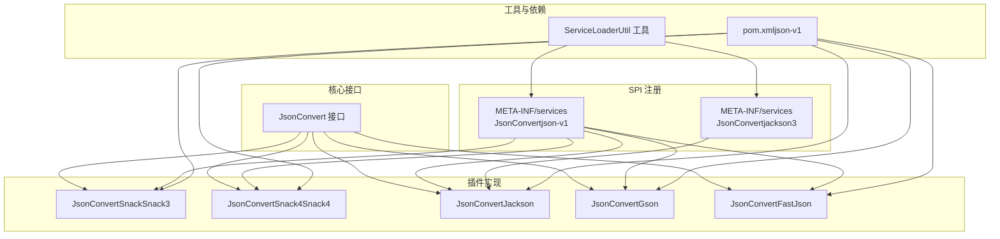
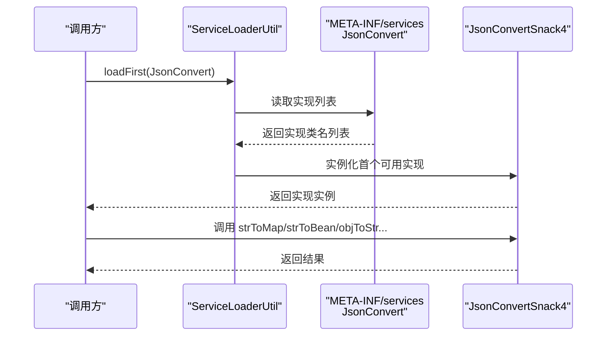
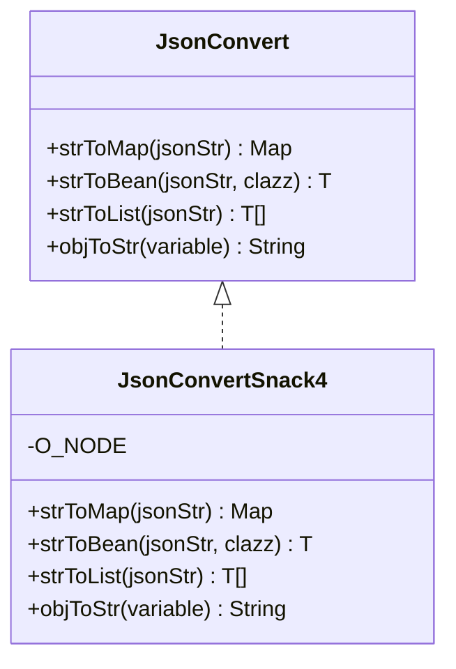
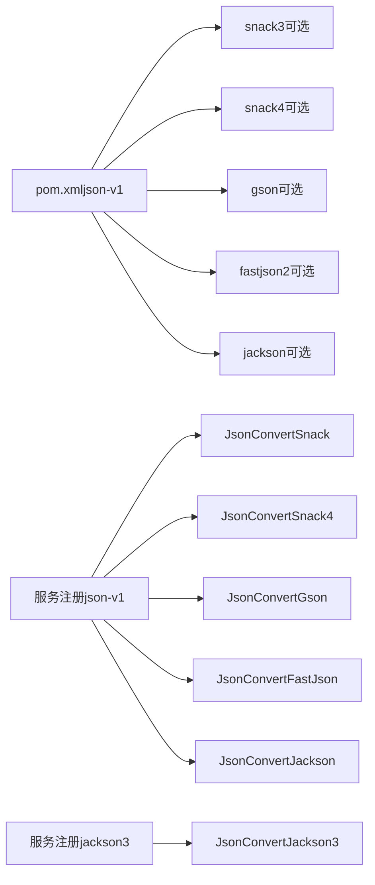
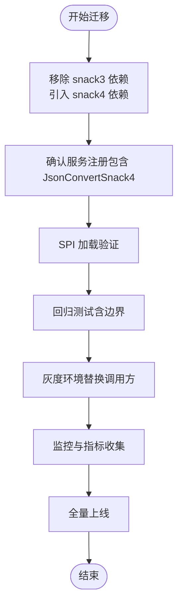

# Snack4 序列化插件

<cite>
**本文引用的文件**
- [JsonConvertSnack4.java](file://warm-flow-plugin/warm-flow-plugin-json/warm-flow-plugin-json-v1/src/main/java/org/dromara/warm/plugin/json/JsonConvertSnack4.java)
- [JsonConvertSnack.java](file://warm-flow-plugin/warm-flow-plugin-json/warm-flow-plugin-json-v1/src/main/java/org/dromara/warm/plugin/json/JsonConvertSnack.java)
- [JsonConvert.java](file://warm-flow-core/src/main/java/org/dromara/warm/flow/core/json/JsonConvert.java)
- [ObjectUtil.java](file://warm-flow-core/src/main/java/org/dromara/warm/flow/core/utils/ObjectUtil.java)
- [ServiceLoaderUtil.java](file://warm-flow-core/src/main/java/org/dromara/warm/flow/core/utils/ServiceLoaderUtil.java)
- [pom.xml（json-v1）](file://warm-flow-plugin/warm-flow-plugin-json/warm-flow-plugin-json-v1/pom.xml)
- [服务注册（json-v1）](file://warm-flow-plugin/warm-flow-plugin-json/warm-flow-plugin-json-v1/src/main/resources/META-INF/services/org.dromara.warm.flow.core.json.JsonConvert)
- [服务注册（jackson3）](file://warm-flow-plugin/warm-flow-plugin-json/warm-flow-plugin-json-jackson3/src/main/resources/META-INF/services/org.dromara.warm.flow.core.json.JsonConvert)
- [JsonConvertFastJson.java](file://warm-flow-plugin/warm-flow-plugin-json/warm-flow-plugin-json-v1/src/main/java/org/dromara/warm/plugin/json/JsonConvertFastJson.java)
- [JsonConvertGson.java](file://warm-flow-plugin/warm-flow-plugin-json/warm-flow-plugin-json-v1/src/main/java/org/dromara/warm/plugin/json/JsonConvertGson.java)
- [JsonConvertJackson.java](file://warm-flow-plugin/warm-flow-plugin-json/warm-flow-plugin-json-v1/src/main/java/org/dromara/warm/plugin/json/JsonConvertJackson.java)
</cite>

## 目录
1. [简介](#简介)
2. [项目结构](#项目结构)
3. [核心组件](#核心组件)
4. [架构总览](#架构总览)
5. [详细组件分析](#详细组件分析)
6. [依赖分析](#依赖分析)
7. [性能考量](#性能考量)
8. [故障排查指南](#故障排查指南)
9. [结论](#结论)
10. [附录：迁移指南](#附录迁移指南)

## 简介
本文件面向“Snack4 序列化插件”的技术文档，聚焦于 JsonConvertSnack4 类的实现机制与设计取舍，系统阐述其相较传统 Snack 实现的升级点、兼容性策略、在现代项目中的应用价值，并提供从旧版 Snack 迁移到 Snack4 的完整迁移指南。同时，结合接口契约、SPI 服务发现机制与多实现对比，帮助读者做出正确的选型与迁移决策。

## 项目结构
围绕 JSON 序列化插件的相关模块与文件组织如下：
- 核心接口层：JsonConvert 定义统一的 JSON 转换能力契约
- 插件实现层：提供多种实现（Snack3、Snack4、Jackson、Gson、FastJson）
- SPI 注册：通过 META-INF/services 暴露实现类，便于运行时自动选择
- 工具与依赖：ServiceLoaderUtil 提供 SPI 加载工具；pom.xml 声明 optional 依赖，避免强制绑定

图表来源
- [JsonConvert.java:26-61](file://warm-flow-core/src/main/java/org/dromara/warm/flow/core/json/JsonConvert.java#L26-L61)
- [JsonConvertSnack.java:35-90](file://warm-flow-plugin/warm-flow-plugin-json/warm-flow-plugin-json-v1/src/main/java/org/dromara/warm/plugin/json/JsonConvertSnack.java#L35-L90)
- [JsonConvertSnack4.java:33-89](file://warm-flow-plugin/warm-flow-plugin-json/warm-flow-plugin-json-v1/src/main/java/org/dromara/warm/plugin/json/JsonConvertSnack4.java#L33-L89)
- [服务注册（json-v1）:1-6](file://warm-flow-plugin/warm-flow-plugin-json/warm-flow-plugin-json-v1/src/main/resources/META-INF/services/org.dromara.warm.flow.core.json.JsonConvert#L1-L6)
- [服务注册（jackson3）:1-1](file://warm-flow-plugin/warm-flow-plugin-json/warm-flow-plugin-json-jackson3/src/main/resources/META-INF/services/org.dromara.warm.flow.core.json.JsonConvert#L1-L1)
- [ServiceLoaderUtil.java:36-67](file://warm-flow-core/src/main/java/org/dromara/warm/flow/core/utils/ServiceLoaderUtil.java#L36-L67)
- [pom.xml（json-v1）:40-50](file://warm-flow-plugin/warm-flow-plugin-json/warm-flow-plugin-json-v1/pom.xml#L40-L50)

章节来源
- [JsonConvert.java:26-61](file://warm-flow-core/src/main/java/org/dromara/warm/flow/core/json/JsonConvert.java#L26-L61)
- [JsonConvertSnack.java:35-90](file://warm-flow-plugin/warm-flow-plugin-json/warm-flow-plugin-json-v1/src/main/java/org/dromara/warm/plugin/json/JsonConvertSnack.java#L35-L90)
- [JsonConvertSnack4.java:33-89](file://warm-flow-plugin/warm-flow-plugin-json/warm-flow-plugin-json-v1/src/main/java/org/dromara/warm/plugin/json/JsonConvertSnack4.java#L33-L89)
- [服务注册（json-v1）:1-6](file://warm-flow-plugin/warm-flow-plugin-json/warm-flow-plugin-json-v1/src/main/resources/META-INF/services/org.dromara.warm.flow.core.json.JsonConvert#L1-L6)
- [服务注册（jackson3）:1-1](file://warm-flow-plugin/warm-flow-plugin-json/warm-flow-plugin-json-jackson3/src/main/resources/META-INF/services/org.dromara.warm.flow.core.json.JsonConvert#L1-L1)
- [ServiceLoaderUtil.java:36-67](file://warm-flow-core/src/main/java/org/dromara/warm/flow/core/utils/ServiceLoaderUtil.java#L36-L67)
- [pom.xml（json-v1）:40-50](file://warm-flow-plugin/warm-flow-plugin-json/warm-flow-plugin-json-v1/pom.xml#L40-L50)

## 核心组件
- JsonConvert 接口：定义统一的 JSON 转换 API，包括字符串到 Map/Bean/List 的反序列化，以及对象到字符串的序列化
- JsonConvertSnack4：基于 Snack4 的实现，提供简洁一致的 API 行为
- 兼容实现：JsonConvertSnack（Snack3）、JsonConvertJackson、JsonConvertGson、JsonConvertFastJson
- SPI 与工具：ServiceLoaderUtil 提供“加载第一个可用实现”的能力，pom.xml 中以 optional 方式声明依赖，避免强制绑定

章节来源
- [JsonConvert.java:26-61](file://warm-flow-core/src/main/java/org/dromara/warm/flow/core/json/JsonConvert.java#L26-L61)
- [JsonConvertSnack4.java:33-89](file://warm-flow-plugin/warm-flow-plugin-json/warm-flow-plugin-json-v1/src/main/java/org/dromara/warm/plugin/json/JsonConvertSnack4.java#L33-L89)
- [JsonConvertSnack.java:35-90](file://warm-flow-plugin/warm-flow-plugin-json/warm-flow-plugin-json-v1/src/main/java/org/dromara/warm/plugin/json/JsonConvertSnack.java#L35-L90)
- [ServiceLoaderUtil.java:36-67](file://warm-flow-core/src/main/java/org/dromara/warm/flow/core/utils/ServiceLoaderUtil.java#L36-L67)
- [pom.xml（json-v1）:40-50](file://warm-flow-plugin/warm-flow-plugin-json/warm-flow-plugin-json-v1/pom.xml#L40-L50)

## 架构总览
Snack4 插件通过 SPI 机制参与服务选择，运行时优先加载第一个可用实现。JsonConvertSnack4 作为其中一种实现，遵循统一接口契约，确保上层调用的一致性。

图表来源
- [ServiceLoaderUtil.java:36-67](file://warm-flow-core/src/main/java/org/dromara/warm/flow/core/utils/ServiceLoaderUtil.java#L36-L67)
- [服务注册（json-v1）:1-6](file://warm-flow-plugin/warm-flow-plugin-json/warm-flow-plugin-json-v1/src/main/resources/META-INF/services/org.dromara.warm.flow.core.json.JsonConvert#L1-L6)
- [JsonConvertSnack4.java:33-89](file://warm-flow-plugin/warm-flow-plugin-json/warm-flow-plugin-json-v1/src/main/java/org/dromara/warm/plugin/json/JsonConvertSnack4.java#L33-L89)

## 详细组件分析

### JsonConvertSnack4 类实现机制
- 设计要点
  - 遵循统一接口契约，提供字符串与 Map/Bean/List 的互转，以及对象到字符串的序列化
  - 使用 Snack4 的 ONode 进行序列化与反序列化
  - 在序列化前对入参进行非空校验，避免空输入导致的异常或无效输出
  - 保留“占位字段”用于 SPI 自检：当缺少对应依赖时，实例化阶段即触发异常，从而阻止错误实现被加载

- 方法行为概览
  - 字符串转 Map：空字符串返回空 Map，否则交由 ONode 反序列化
  - 字符串转 Bean：空字符串返回 null，否则交由 ONode 反序列化为目标类型
  - 字符串转 List：空字符串返回 null，否则构造泛型上下文后反序列化
  - 对象转字符串：非空对象交由 ONode 序列化，空对象返回 null

- 与传统 Snack 的差异
  - 依赖版本：JsonConvertSnack4 使用 snack4，JsonConvertSnack 使用 snack3
  - API 名称：序列化方法名不同（snack3 使用 stringify，snack4 使用 serialize），但对外接口保持一致
  - 泛型处理：两者均通过构造泛型上下文完成 List 的反序列化，行为一致

- 错误处理与健壮性
  - 输入校验：对空字符串与空对象进行显式分支，避免不必要的异常传播
  - 异常策略：反序列化异常由上层框架统一捕获与包装，此处仅做必要判断

图表来源
- [JsonConvert.java:26-61](file://warm-flow-core/src/main/java/org/dromara/warm/flow/core/json/JsonConvert.java#L26-L61)
- [JsonConvertSnack4.java:33-89](file://warm-flow-plugin/warm-flow-plugin-json/warm-flow-plugin-json-v1/src/main/java/org/dromara/warm/plugin/json/JsonConvertSnack4.java#L33-L89)

章节来源
- [JsonConvertSnack4.java:33-89](file://warm-flow-plugin/warm-flow-plugin-json/warm-flow-plugin-json-v1/src/main/java/org/dromara/warm/plugin/json/JsonConvertSnack4.java#L33-L89)
- [ObjectUtil.java:44-45](file://warm-flow-core/src/main/java/org/dromara/warm/flow/core/utils/ObjectUtil.java#L44-L45)

### 传统 Snack 实现（Snack3）对比
- 依赖与 API
  - 依赖 snack3，序列化使用 stringify，反序列化使用 deserialize
  - 与 Snack4 的行为在接口层面保持一致
- 兼容性
  - 若项目中存在 snack3 依赖，JsonConvertSnack 将作为可用实现之一参与 SPI 选择
  - 若同时存在 snack4 依赖，JsonConvertSnack4 将优先被加载（取决于服务注册顺序）

章节来源
- [JsonConvertSnack.java:35-90](file://warm-flow-plugin/warm-flow-plugin-json/warm-flow-plugin-json-v1/src/main/java/org/dromara/warm/plugin/json/JsonConvertSnack.java#L35-L90)
- [pom.xml（json-v1）:40-50](file://warm-flow-plugin/warm-flow-plugin-json/warm-flow-plugin-json-v1/pom.xml#L40-L50)

### 多实现对比（接口契约）
- JsonConvert 接口定义了统一的 API，各实现需保证行为一致性
- FastJson/Gson/Jackson 实现展示了不同的序列化风格与特性，便于按需选择

章节来源
- [JsonConvert.java:26-61](file://warm-flow-core/src/main/java/org/dromara/warm/flow/core/json/JsonConvert.java#L26-L61)
- [JsonConvertFastJson.java:34-95](file://warm-flow-plugin/warm-flow-plugin-json/warm-flow-plugin-json-v1/src/main/java/org/dromara/warm/plugin/json/JsonConvertFastJson.java#L34-L95)
- [JsonConvertGson.java:35-99](file://warm-flow-plugin/warm-flow-plugin-json/warm-flow-plugin-json-v1/src/main/java/org/dromara/warm/plugin/json/JsonConvertGson.java#L35-L99)
- [JsonConvertJackson.java:41-127](file://warm-flow-plugin/warm-flow-plugin-json/warm-flow-plugin-json-v1/src/main/java/org/dromara/warm/plugin/json/JsonConvertJackson.java#L41-L127)

## 依赖分析
- 依赖声明
  - snack3 与 snack4 均以 optional 形式声明，避免强制依赖
  - 通过服务注册文件暴露多个实现，运行时由 SPI 选择
- 依赖关系图

图表来源
- [pom.xml（json-v1）:40-50](file://warm-flow-plugin/warm-flow-plugin-json/warm-flow-plugin-json-v1/pom.xml#L40-L50)
- [服务注册（json-v1）:1-6](file://warm-flow-plugin/warm-flow-plugin-json/warm-flow-plugin-json-v1/src/main/resources/META-INF/services/org.dromara.warm.flow.core.json.JsonConvert#L1-L6)
- [服务注册（jackson3）:1-1](file://warm-flow-plugin/warm-flow-plugin-json/warm-flow-plugin-json-jackson3/src/main/resources/META-INF/services/org.dromara.warm.flow.core.json.JsonConvert#L1-L1)

章节来源
- [pom.xml（json-v1）:40-50](file://warm-flow-plugin/warm-flow-plugin-json/warm-flow-plugin-json-v1/pom.xml#L40-L50)
- [服务注册（json-v1）:1-6](file://warm-flow-plugin/warm-flow-plugin-json/warm-flow-plugin-json-v1/src/main/resources/META-INF/services/org.dromara.warm.flow.core.json.JsonConvert#L1-L6)
- [服务注册（jackson3）:1-1](file://warm-flow-plugin/warm-flow-plugin-json/warm-flow-plugin-json-jackson3/src/main/resources/META-INF/services/org.dromara.warm.flow.core.json.JsonConvert#L1-L1)

## 性能考量
- 通用建议
  - 选择合适的实现：在高并发场景下，建议结合团队对序列化库的压测结果进行选型
  - 控制序列化粒度：尽量避免对大对象进行频繁序列化/反序列化
  - 合理使用缓存：对热点数据进行缓存，减少重复转换
- 关于 Snack4 的定位
  - 本仓库未提供具体的性能基准数据；Snack4 作为可选实现之一，其性能表现取决于具体业务场景
  - 如需性能数据，请参考上游库的官方评测或自行开展针对性压测

## 故障排查指南
- 常见问题
  - 无法加载实现：确认服务注册文件中包含目标实现类名
  - 依赖缺失：若缺少 snack4/snack3/jackson/gson/fastjson 依赖，可能导致运行时找不到对应实现
  - 空输入/空对象：确保传入的 JSON 字符串与对象符合预期，避免空值引发的异常
- 排查步骤
  - 检查服务注册文件内容与类路径
  - 使用 SPI 工具加载实现，观察是否抛出配置错误
  - 对照接口契约核对方法签名与返回值语义

章节来源
- [ServiceLoaderUtil.java:36-67](file://warm-flow-core/src/main/java/org/dromara/warm/flow/core/utils/ServiceLoaderUtil.java#L36-L67)
- [服务注册（json-v1）:1-6](file://warm-flow-plugin/warm-flow-plugin-json/warm-flow-plugin-json-v1/src/main/resources/META-INF/services/org.dromara.warm.flow.core.json.JsonConvert#L1-L6)

## 结论
JsonConvertSnack4 以最小改动实现了对 Snack4 的适配，保持与接口契约及其它实现一致的行为，同时通过占位字段与 optional 依赖策略提升了 SPI 加载的健壮性。对于需要拥抱新版本 Snack 的项目，Snack4 是一个低风险、渐进式的升级选项；对于已有稳定使用的 Snack3 项目，可继续沿用现有实现，或按需迁移至 Snack4。

## 附录：迁移指南

### 从 Snack3（JsonConvertSnack）迁移到 Snack4（JsonConvertSnack4）
- 步骤一：清理与准备
  - 移除对 snack3 的依赖（如不再需要）
  - 引入 snack4 依赖（optional 或非 optional 视项目策略而定）
  - 确认服务注册文件中包含 JsonConvertSnack4
- 步骤二：验证 SPI 选择
  - 使用 SPI 工具加载实现，确认加载的是 JsonConvertSnack4
  - 若仍加载到旧实现，检查服务注册文件与类路径
- 步骤三：回归测试
  - 验证字符串与 Map/Bean/List 的互转逻辑
  - 验证空输入/空对象的边界行为
  - 在高并发场景下进行稳定性与性能评估
- 步骤四：逐步替换
  - 在灰度环境中逐步替换调用方的 JSON 处理逻辑
  - 收集日志与监控指标，确认无异常后再全量上线

图表来源
- [pom.xml（json-v1）:40-50](file://warm-flow-plugin/warm-flow-plugin-json/warm-flow-plugin-json-v1/pom.xml#L40-L50)
- [服务注册（json-v1）:1-6](file://warm-flow-plugin/warm-flow-plugin-json/warm-flow-plugin-json-v1/src/main/resources/META-INF/services/org.dromara.warm.flow.core.json.JsonConvert#L1-L6)
- [ServiceLoaderUtil.java:36-67](file://warm-flow-core/src/main/java/org/dromara/warm/flow/core/utils/ServiceLoaderUtil.java#L36-L67)

章节来源
- [JsonConvertSnack4.java:33-89](file://warm-flow-plugin/warm-flow-plugin-json/warm-flow-plugin-json-v1/src/main/java/org/dromara/warm/plugin/json/JsonConvertSnack4.java#L33-L89)
- [JsonConvertSnack.java:35-90](file://warm-flow-plugin/warm-flow-plugin-json/warm-flow-plugin-json-v1/src/main/java/org/dromara/warm/plugin/json/JsonConvertSnack.java#L35-L90)
- [pom.xml（json-v1）:40-50](file://warm-flow-plugin/warm-flow-plugin-json/warm-flow-plugin-json-v1/pom.xml#L40-L50)
- [服务注册（json-v1）:1-6](file://warm-flow-plugin/warm-flow-plugin-json/warm-flow-plugin-json-v1/src/main/resources/META-INF/services/org.dromara.warm.flow.core.json.JsonConvert#L1-L6)
- [ServiceLoaderUtil.java:36-67](file://warm-flow-core/src/main/java/org/dromara/warm/flow/core/utils/ServiceLoaderUtil.java#L36-L67)