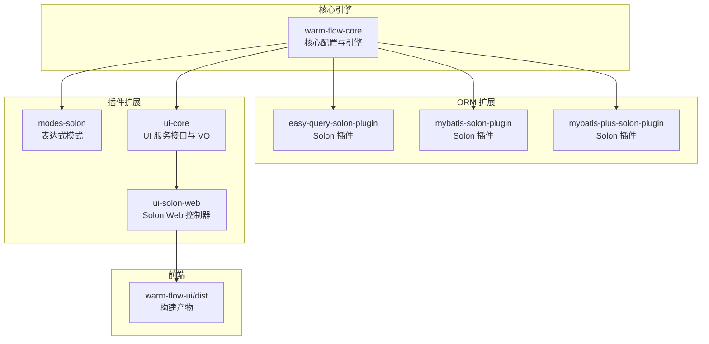
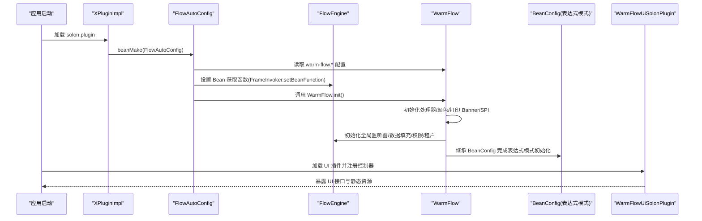
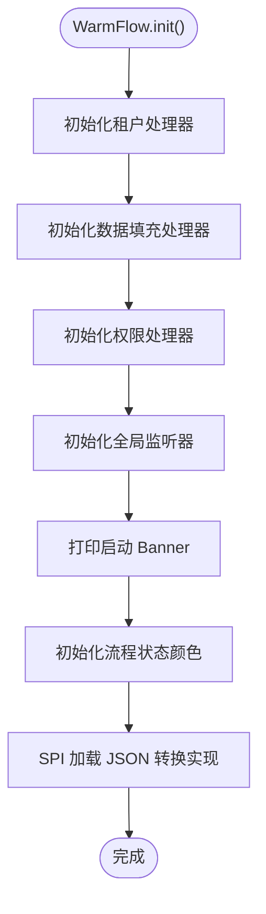
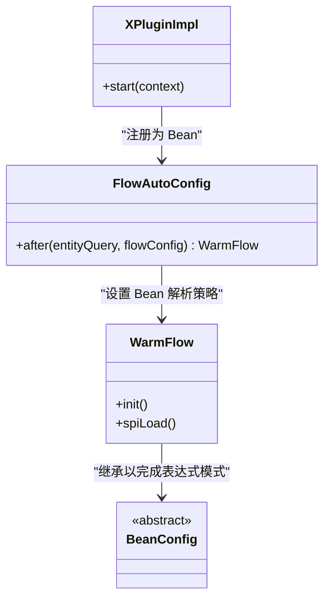
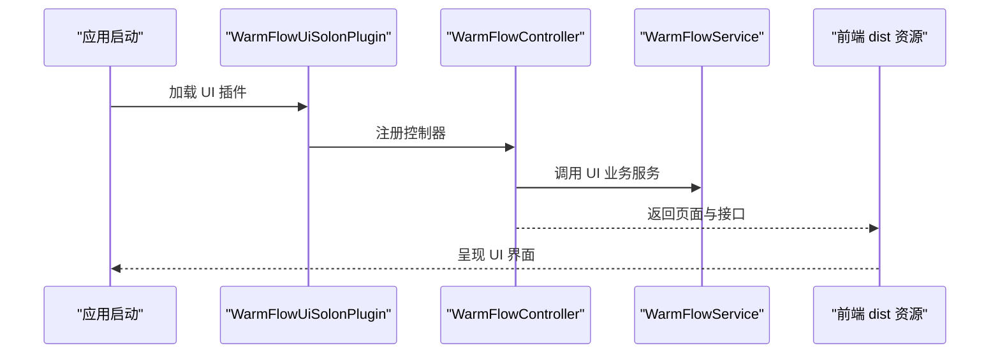
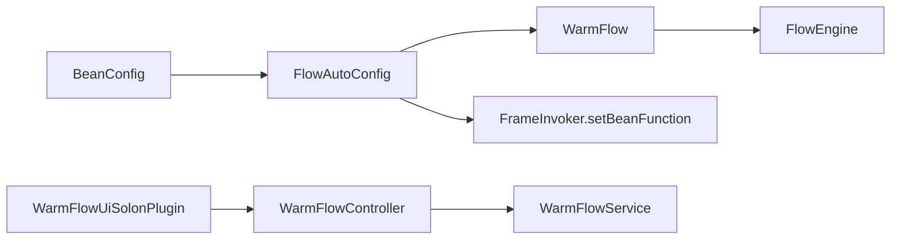

# Solon 运行时集成

<cite>
**本文引用的文件**
- [WarmFlow.java](file://warm-flow-core/src/main/java/org/dromara/warm/flow/core/config/WarmFlow.java)
- [FlowAutoConfig.java](file://warm-flow-orm/warm-flow-easy-query/warm-flow-easy-query-solon-plugin/src/main/java/org/dromara/warm/flow/solon/config/FlowAutoConfig.java)
- [XPluginImpl.java](file://warm-flow-orm/warm-flow-easy-query/warm-flow-easy-query-solon-plugin/src/main/java/org/dromara/warm/flow/solon/XPluginImpl.java)
- [org.dromara.warm.flow.solon.properties](file://warm-flow-orm/warm-flow-easy-query/warm-flow-easy-query-solon-plugin/src/main/resources/META-INF/solon/org.dromara.warm.flow.solon.properties)
- [BeanConfig.java](file://warm-flow-plugin/warm-flow-plugin-modes/warm-flow-plugin-modes-solon/src/main/java/org/dromara/warm/plugin/modes/solon/config/BeanConfig.java)
- [WarmFlowController.java](file://warm-flow-plugin/warm-flow-plugin-ui/warm-flow-plugin-ui-solon-web/src/main/java/org/dromara/warm/flow/ui/controller/WarmFlowController.java)
- [WarmFlowUiSolonPlugin.java](file://warm-flow-plugin/warm-flow-plugin-ui/warm-flow-plugin-ui-solon-web/src/main/java/org/dromara/warm/flow/ui/WarmFlowUiSolonPlugin.java)
- [org.dromara.warm.flow.ui.properties](file://warm-flow-plugin/warm-flow-plugin-ui/warm-flow-plugin-ui-solon-web/src/main/resources/META-INF/solon/org.dromara.warm.flow.ui.properties)
- [WarmFlowService.java](file://warm-flow-plugin/warm-flow-plugin-ui/warm-flow-plugin-ui-core/src/main/java/org/dromara/warm/flow/ui/service/WarmFlowService.java)
</cite>

## 目录
1. [引言](#引言)
2. [项目结构](#项目结构)
3. [核心组件](#核心组件)
4. [架构总览](#架构总览)
5. [详细组件分析](#详细组件分析)
6. [依赖分析](#依赖分析)
7. [性能考虑](#性能考虑)
8. [故障排查指南](#故障排查指南)
9. [结论](#结论)
10. [附录](#附录)

## 引言
本文件面向在 Solon 运行时中集成 Warm-Flow 的开发者，系统性梳理 UI 插件与 ORM 插件在 Solon 下的集成架构、配置方式、注解使用、依赖注入、生命周期控制以及与 Spring Boot 的差异与迁移注意事项。重点覆盖以下方面：
- Warm-Flow 在 Solon 中的自动装配与插件化启动流程
- UI 插件在 Solon 中的控制器暴露与资源加载机制
- Warm-Flow 核心配置 WarmFlow 的属性与初始化流程
- ORM 插件（Easy Query）在 Solon 下的条件装配与 Bean 注入
- 与 Spring Boot 的差异点与迁移建议

## 项目结构
Warm-Flow 在 Solon 下采用“核心引擎 + ORM 扩展 + UI 插件”的分层组织方式：
- warm-flow-core：核心引擎与通用能力（配置、枚举、工具、服务接口）
- warm-flow-orm：ORM 扩展（MyBatis、MyBatis-Plus、Easy Query），每种 ORM 提供 Spring Boot Starter 与 Solon 插件
- warm-flow-plugin：插件扩展（表达式模式、UI 插件等），UI 插件包含核心服务与 Solon Web 控制器
- warm-flow-ui：前端静态资源（Vue3 前端工程）

图表来源
- [WarmFlow.java:1-174](file://warm-flow-core/src/main/java/org/dromara/warm/flow/core/config/WarmFlow.java#L1-L174)
- [FlowAutoConfig.java:1-52](file://warm-flow-orm/warm-flow-easy-query/warm-flow-easy-query-solon-plugin/src/main/java/org/dromara/warm/flow/solon/config/FlowAutoConfig.java#L1-L52)
- [BeanConfig.java](file://warm-flow-plugin/warm-flow-plugin-modes/warm-flow-plugin-modes-solon/src/main/java/org/dromara/warm/plugin/modes/solon/config/BeanConfig.java)
- [WarmFlowController.java](file://warm-flow-plugin/warm-flow-plugin-ui/warm-flow-plugin-ui-solon-web/src/main/java/org/dromara/warm/flow/ui/controller/WarmFlowController.java)
- [WarmFlowUiSolonPlugin.java](file://warm-flow-plugin/warm-flow-plugin-ui/warm-flow-plugin-ui-solon-web/src/main/java/org/dromara/warm/flow/ui/WarmFlowUiSolonPlugin.java)

章节来源
- [WarmFlow.java:1-174](file://warm-flow-core/src/main/java/org/dromara/warm/flow/core/config/WarmFlow.java#L1-L174)
- [FlowAutoConfig.java:1-52](file://warm-flow-orm/warm-flow-easy-query/warm-flow-easy-query-solon-plugin/src/main/java/org/dromara/warm/flow/solon/config/FlowAutoConfig.java#L1-L52)

## 核心组件
- WarmFlow 配置类：集中管理 Warm-Flow 的开关、框架类型、UI 开关、逻辑删除、颜色配置、处理器路径等；提供 init/spiLoad/printBanner 等初始化流程。
- FlowAutoConfig 自动装配：基于 Solon 条件注解加载，注入 WarmFlow 并设置框架调用器的 Bean 获取策略。
- XPluginImpl 插件入口：声明式注册 FlowAutoConfig，驱动自动装配。
- UI 插件：WarmFlowUiSolonPlugin 负责插件化加载；WarmFlowController 提供 UI 相关接口；WarmFlowService 提供 UI 侧业务服务。

章节来源
- [WarmFlow.java:1-174](file://warm-flow-core/src/main/java/org/dromara/warm/flow/core/config/WarmFlow.java#L1-L174)
- [FlowAutoConfig.java:1-52](file://warm-flow-orm/warm-flow-easy-query/warm-flow-easy-query-solon-plugin/src/main/java/org/dromara/warm/flow/solon/config/FlowAutoConfig.java#L1-L52)
- [XPluginImpl.java:1-34](file://warm-flow-orm/warm-flow-easy-query/warm-flow-easy-query-solon-plugin/src/main/java/org/dromara/warm/flow/solon/XPluginImpl.java#L1-L34)
- [WarmFlowUiSolonPlugin.java](file://warm-flow-plugin/warm-flow-plugin-ui/warm-flow-plugin-ui-solon-web/src/main/java/org/dromara/warm/flow/ui/WarmFlowUiSolonPlugin.java)
- [WarmFlowController.java](file://warm-flow-plugin/warm-flow-plugin-ui/warm-flow-plugin-ui-solon-web/src/main/java/org/dromara/warm/flow/ui/controller/WarmFlowController.java)
- [WarmFlowService.java](file://warm-flow-plugin/warm-flow-plugin-ui/warm-flow-plugin-ui-core/src/main/java/org/dromara/warm/flow/ui/service/WarmFlowService.java)

## 架构总览
Solon 运行时下 Warm-Flow 的启动与装配链路如下：

图表来源
- [org.dromara.warm.flow.solon.properties:1-2](file://warm-flow-orm/warm-flow-easy-query/warm-flow-easy-query-solon-plugin/src/main/resources/META-INF/solon/org.dromara.warm.flow.solon.properties#L1-L2)
- [XPluginImpl.java:1-34](file://warm-flow-orm/warm-flow-easy-query/warm-flow-easy-query-solon-plugin/src/main/java/org/dromara/warm/flow/solon/XPluginImpl.java#L1-L34)
- [FlowAutoConfig.java:1-52](file://warm-flow-orm/warm-flow-easy-query/warm-flow-easy-query-solon-plugin/src/main/java/org/dromara/warm/flow/solon/config/FlowAutoConfig.java#L1-L52)
- [WarmFlow.java:1-174](file://warm-flow-core/src/main/java/org/dromara/warm/flow/core/config/WarmFlow.java#L1-L174)
- [BeanConfig.java](file://warm-flow-plugin/warm-flow-plugin-modes/warm-flow-plugin-modes-solon/src/main/java/org/dromara/warm/plugin/modes/solon/config/BeanConfig.java)
- [org.dromara.warm.flow.ui.properties](file://warm-flow-plugin/warm-flow-plugin-ui/warm-flow-plugin-ui-solon-web/src/main/resources/META-INF/solon/org.dromara.warm.flow.ui.properties)

## 详细组件分析

### WarmFlow 配置与初始化
- 属性维度：开关、框架类型、Banner、主键策略、逻辑删除、处理器路径、UI 开关、令牌名、流程状态颜色、顶部文字显示等。
- 初始化流程：
  - 租户/数据填充/权限/全局监听器处理器初始化
  - 打印启动 Banner
  - 初始化流程状态颜色（支持三种模式）
  - 通过 SPI 机制加载 JSON 转换策略实现类

图表来源
- [WarmFlow.java:1-174](file://warm-flow-core/src/main/java/org/dromara/warm/flow/core/config/WarmFlow.java#L1-L174)

章节来源
- [WarmFlow.java:1-174](file://warm-flow-core/src/main/java/org/dromara/warm/flow/core/config/WarmFlow.java#L1-L174)

### ORM 插件（Easy Query）在 Solon 的装配
- 插件入口：XPluginImpl 在 solon.plugin 中声明，启动时自动 beanMake FlowAutoConfig。
- 自动装配：FlowAutoConfig 使用条件注解按需启用，注入 WarmFlow 并设置框架调用器的 Bean 获取策略，使其能从 Solon 上下文或指定 ORM 实例中解析 Bean。
- 生命周期：插件启动 → 自动装配 → WarmFlow 初始化 → 表达式模式初始化。

图表来源
- [XPluginImpl.java:1-34](file://warm-flow-orm/warm-flow-easy-query/warm-flow-easy-query-solon-plugin/src/main/java/org/dromara/warm/flow/solon/XPluginImpl.java#L1-L34)
- [FlowAutoConfig.java:1-52](file://warm-flow-orm/warm-flow-easy-query/warm-flow-easy-query-solon-plugin/src/main/java/org/dromara/warm/flow/solon/config/FlowAutoConfig.java#L1-L52)
- [BeanConfig.java](file://warm-flow-plugin/warm-flow-plugin-modes/warm-flow-plugin-modes-solon/src/main/java/org/dromara/warm/plugin/modes/solon/config/BeanConfig.java)

章节来源
- [XPluginImpl.java:1-34](file://warm-flow-orm/warm-flow-easy-query/warm-flow-easy-query-solon-plugin/src/main/java/org/dromara/warm/flow/solon/XPluginImpl.java#L1-L34)
- [FlowAutoConfig.java:1-52](file://warm-flow-orm/warm-flow-easy-query/warm-flow-easy-query-solon-plugin/src/main/java/org/dromara/warm/flow/solon/config/FlowAutoConfig.java#L1-L52)
- [org.dromara.warm.flow.solon.properties:1-2](file://warm-flow-orm/warm-flow-easy-query/warm-flow-easy-query-solon-plugin/src/main/resources/META-INF/solon/org.dromara.warm.flow.solon.properties#L1-L2)

### UI 插件在 Solon 的集成
- 插件入口：WarmFlowUiSolonPlugin 负责插件化加载与控制器注册。
- 控制器：WarmFlowController 提供 UI 相关接口（如流程设计、表单设计等）。
- 服务层：WarmFlowService 提供 UI 扩展服务（分类、图表、节点扩展、字典、监听器列表等）。
- 资源：org.dromara.warm.flow.ui.properties 声明 UI 插件元信息，配合前端 dist 资源对外提供界面。

图表来源
- [WarmFlowUiSolonPlugin.java](file://warm-flow-plugin/warm-flow-plugin-ui/warm-flow-plugin-ui-solon-web/src/main/java/org/dromara/warm/flow/ui/WarmFlowUiSolonPlugin.java)
- [WarmFlowController.java](file://warm-flow-plugin/warm-flow-plugin-ui/warm-flow-plugin-ui-solon-web/src/main/java/org/dromara/warm/flow/ui/controller/WarmFlowController.java)
- [WarmFlowService.java](file://warm-flow-plugin/warm-flow-plugin-ui/warm-flow-plugin-ui-core/src/main/java/org/dromara/warm/flow/ui/service/WarmFlowService.java)
- [org.dromara.warm.flow.ui.properties](file://warm-flow-plugin/warm-flow-plugin-ui/warm-flow-plugin-ui-solon-web/src/main/resources/META-INF/solon/org.dromara.warm.flow.ui.properties)

章节来源
- [WarmFlowUiSolonPlugin.java](file://warm-flow-plugin/warm-flow-plugin-ui/warm-flow-plugin-ui-solon-web/src/main/java/org/dromara/warm/flow/ui/WarmFlowUiSolonPlugin.java)
- [WarmFlowController.java](file://warm-flow-plugin/warm-flow-plugin-ui/warm-flow-plugin-ui-solon-web/src/main/java/org/dromara/warm/flow/ui/controller/WarmFlowController.java)
- [WarmFlowService.java](file://warm-flow-plugin/warm-flow-plugin-ui/warm-flow-plugin-ui-core/src/main/java/org/dromara/warm/flow/ui/service/WarmFlowService.java)
- [org.dromara.warm.flow.ui.properties](file://warm-flow-plugin/warm-flow-plugin-ui/warm-flow-plugin-ui-solon-web/src/main/resources/META-INF/solon/org.dromara.warm.flow.ui.properties)

## 依赖分析
- WarmFlow 对 FlowEngine 的依赖：WarmFlow.init() 内部调用 FlowEngine 的若干初始化方法，用于处理器、监听器、颜色等。
- FlowAutoConfig 对 Solon 的依赖：使用 @Configuration、@Bean、@Condition 等注解进行条件装配与 Bean 注入。
- UI 插件对 WarmFlowService 的依赖：控制器通过服务层提供 UI 扩展能力。
- 表达式模式对 BeanConfig 的依赖：通过继承 BeanConfig 完成表达式策略初始化。

图表来源
- [WarmFlow.java:1-174](file://warm-flow-core/src/main/java/org/dromara/warm/flow/core/config/WarmFlow.java#L1-L174)
- [FlowAutoConfig.java:1-52](file://warm-flow-orm/warm-flow-easy-query/warm-flow-easy-query-solon-plugin/src/main/java/org/dromara/warm/flow/solon/config/FlowAutoConfig.java#L1-L52)
- [BeanConfig.java](file://warm-flow-plugin/warm-flow-plugin-modes/warm-flow-plugin-modes-solon/src/main/java/org/dromara/warm/plugin/modes/solon/config/BeanConfig.java)
- [WarmFlowUiSolonPlugin.java](file://warm-flow-plugin/warm-flow-plugin-ui/warm-flow-plugin-ui-solon-web/src/main/java/org/dromara/warm/flow/ui/WarmFlowUiSolonPlugin.java)
- [WarmFlowController.java](file://warm-flow-plugin/warm-flow-plugin-ui/warm-flow-plugin-ui-solon-web/src/main/java/org/dromara/warm/flow/ui/controller/WarmFlowController.java)
- [WarmFlowService.java](file://warm-flow-plugin/warm-flow-plugin-ui/warm-flow-plugin-ui-core/src/main/java/org/dromara/warm/flow/ui/service/WarmFlowService.java)

章节来源
- [WarmFlow.java:1-174](file://warm-flow-core/src/main/java/org/dromara/warm/flow/core/config/WarmFlow.java#L1-L174)
- [FlowAutoConfig.java:1-52](file://warm-flow-orm/warm-flow-easy-query/warm-flow-easy-query-solon-plugin/src/main/java/org/dromara/warm/flow/solon/config/FlowAutoConfig.java#L1-L52)
- [BeanConfig.java](file://warm-flow-plugin/warm-flow-plugin-modes/warm-flow-plugin-modes-solon/src/main/java/org/dromara/warm/plugin/modes/solon/config/BeanConfig.java)
- [WarmFlowUiSolonPlugin.java](file://warm-flow-plugin/warm-flow-plugin-ui/warm-flow-plugin-ui-solon-web/src/main/java/org/dromara/warm/flow/ui/WarmFlowUiSolonPlugin.java)
- [WarmFlowController.java](file://warm-flow-plugin/warm-flow-plugin-ui/warm-flow-plugin-ui-solon-web/src/main/java/org/dromara/warm/flow/ui/controller/WarmFlowController.java)
- [WarmFlowService.java](file://warm-flow-plugin/warm-flow-plugin-ui/warm-flow-plugin-ui-core/src/main/java/org/dromara/warm/flow/ui/service/WarmFlowService.java)

## 性能考虑
- Bean 解析策略：FlowAutoConfig 将 ORM 实例与 Solon 上下文结合，避免重复扫描与反射开销。
- 条件装配：通过 @Condition.onProperty 控制 Warm-Flow 启用，减少不必要的 Bean 创建与初始化。
- SPI 加载：JSON 转换策略通过 SPI 按需加载，避免硬编码耦合。
- UI 资源：前端 dist 资源独立部署，接口按需调用，降低后端压力。

## 故障排查指南
- 插件未生效
  - 检查 solon.plugin 是否正确指向 XPluginImpl 或 UI 插件入口类
  - 确认 warm-flow.enabled=true 且未被其他配置覆盖
- Bean 注入失败
  - 确认 FlowAutoConfig 已被 beanMake 注册
  - 检查 ORM 实例是否可用（如 EasyEntityQuery）
- UI 接口不可用
  - 确认 UI 插件已加载，WarmFlowUiSolonPlugin 正常注册控制器
  - 检查 org.dromara.warm.flow.ui.properties 是否存在
- 处理器/监听器不生效
  - 确认 WarmFlow.init() 已执行，处理器路径配置正确
  - 检查相关 SPI 实现类是否可被加载

章节来源
- [org.dromara.warm.flow.solon.properties:1-2](file://warm-flow-orm/warm-flow-easy-query/warm-flow-easy-query-solon-plugin/src/main/resources/META-INF/solon/org.dromara.warm.flow.solon.properties#L1-L2)
- [org.dromara.warm.flow.ui.properties](file://warm-flow-plugin/warm-flow-plugin-ui/warm-flow-plugin-ui-solon-web/src/main/resources/META-INF/solon/org.dromara.warm.flow.ui.properties)
- [FlowAutoConfig.java:1-52](file://warm-flow-orm/warm-flow-easy-query/warm-flow-easy-query-solon-plugin/src/main/java/org/dromara/warm/flow/solon/config/FlowAutoConfig.java#L1-L52)
- [WarmFlow.java:1-174](file://warm-flow-core/src/main/java/org/dromara/warm/flow/core/config/WarmFlow.java#L1-L174)

## 结论
Warm-Flow 在 Solon 下通过插件化与自动装配实现了低侵入、高扩展的运行时集成。核心在于：
- 以 WarmFlow 为中心的配置与初始化
- 以 FlowAutoConfig 为核心的条件装配与 Bean 解析策略
- 以 UI 插件为核心的前后端分离与接口暴露
- 以 SPI 与表达式模式为核心的可插拔扩展

## 附录

### 集成开发指南（Solon）
- 插件注册
  - 在插件的 META-INF/solon 下声明 solon.plugin 指向插件入口类
  - 确保插件入口类实现 Plugin 接口并在 start 中注册自动装配类
- 配置管理
  - 在应用配置中设置 warm-flow.* 相关属性（如 enabled、framework、ui、tokenName 等）
  - 通过 @Condition.onProperty 控制启用条件
- 生命周期控制
  - WarmFlow.init() 在自动装配完成后执行，负责处理器、监听器、颜色与 SPI 的初始化
  - 表达式模式通过继承 BeanConfig 完成策略初始化
- UI 开发
  - 使用 WarmFlowUiSolonPlugin 注册控制器
  - 控制器依赖 WarmFlowService 提供的 UI 扩展能力
  - 前端资源通过 dist 对外提供

章节来源
- [XPluginImpl.java:1-34](file://warm-flow-orm/warm-flow-easy-query/warm-flow-easy-query-solon-plugin/src/main/java/org/dromara/warm/flow/solon/XPluginImpl.java#L1-L34)
- [org.dromara.warm.flow.solon.properties:1-2](file://warm-flow-orm/warm-flow-easy-query/warm-flow-easy-query-solon-plugin/src/main/resources/META-INF/solon/org.dromara.warm.flow.solon.properties#L1-L2)
- [FlowAutoConfig.java:1-52](file://warm-flow-orm/warm-flow-easy-query/warm-flow-easy-query-solon-plugin/src/main/java/org/dromara/warm/flow/solon/config/FlowAutoConfig.java#L1-L52)
- [WarmFlow.java:1-174](file://warm-flow-core/src/main/java/org/dromara/warm/flow/core/config/WarmFlow.java#L1-L174)
- [BeanConfig.java](file://warm-flow-plugin/warm-flow-plugin-modes/warm-flow-plugin-modes-solon/src/main/java/org/dromara/warm/plugin/modes/solon/config/BeanConfig.java)
- [WarmFlowUiSolonPlugin.java](file://warm-flow-plugin/warm-flow-plugin-ui/warm-flow-plugin-ui-solon-web/src/main/java/org/dromara/warm/flow/ui/WarmFlowUiSolonPlugin.java)
- [WarmFlowController.java](file://warm-flow-plugin/warm-flow-plugin-ui/warm-flow-plugin-ui-solon-web/src/main/java/org/dromara/warm/flow/ui/controller/WarmFlowController.java)
- [WarmFlowService.java](file://warm-flow-plugin/warm-flow-plugin-ui/warm-flow-plugin-ui-core/src/main/java/org/dromara/warm/flow/ui/service/WarmFlowService.java)

### 与 Spring Boot 的差异与迁移注意事项
- 自动装配机制
  - Spring Boot：通过 @SpringBootApplication 或 @EnableAutoConfiguration 与 spring.factories/imports 自动装配
  - Solon：通过 solon.plugin 与 Plugin 接口声明插件，再由插件内部 beanMake 注册自动装配类
- 条件装配
  - Spring Boot：@ConditionalOnProperty、@Profile 等
  - Solon：@Condition.onProperty 与 @Condition.onClass 等
- Bean 注入
  - Spring Boot：@Autowired、@ComponentScan 等
  - Solon：@Bean、Solon.context().getBean(...) 与 setBeanFunction 统一解析策略
- UI 插件
  - Spring Boot：通过 @WebMvcConfigurer 或 @RestController 注册控制器
  - Solon：通过插件注册控制器并提供静态资源映射
- 迁移建议
  - 将 spring.factories/imports 中的自动装配类迁移到 Solon 的插件入口与自动装配类
  - 将 @ConditionalOnProperty 替换为 @Condition.onProperty
  - 将 @Autowired 替换为 Solon 的依赖解析策略或 @Bean 显式注入
  - 将 UI 控制器迁移至 Solon 插件并确保静态资源可访问