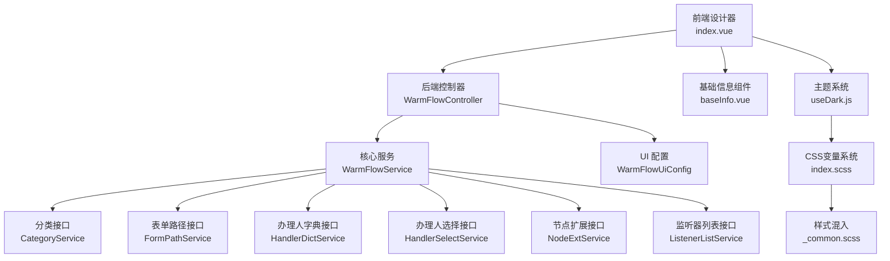
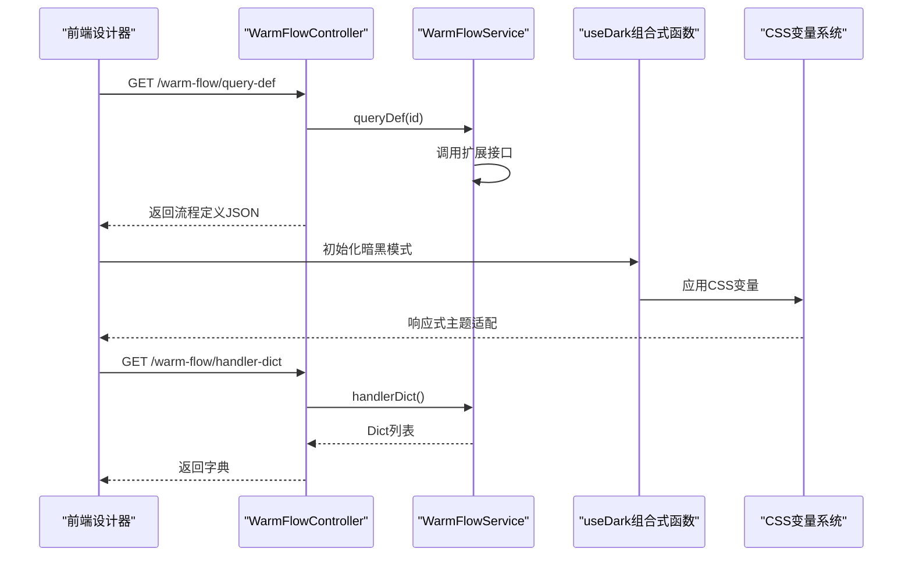
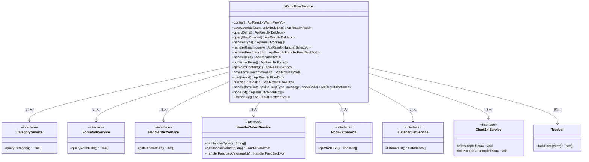
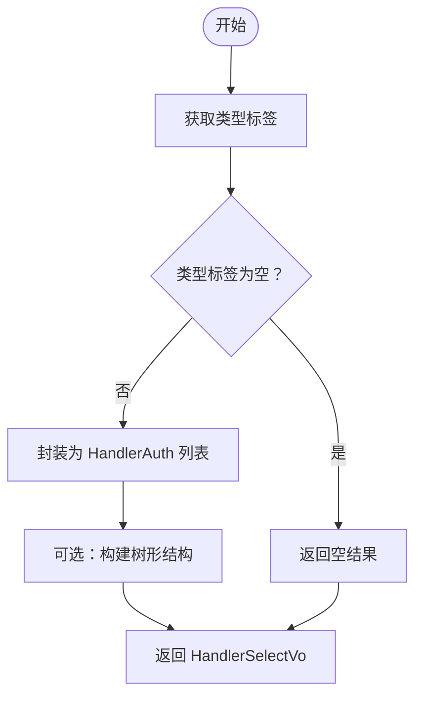
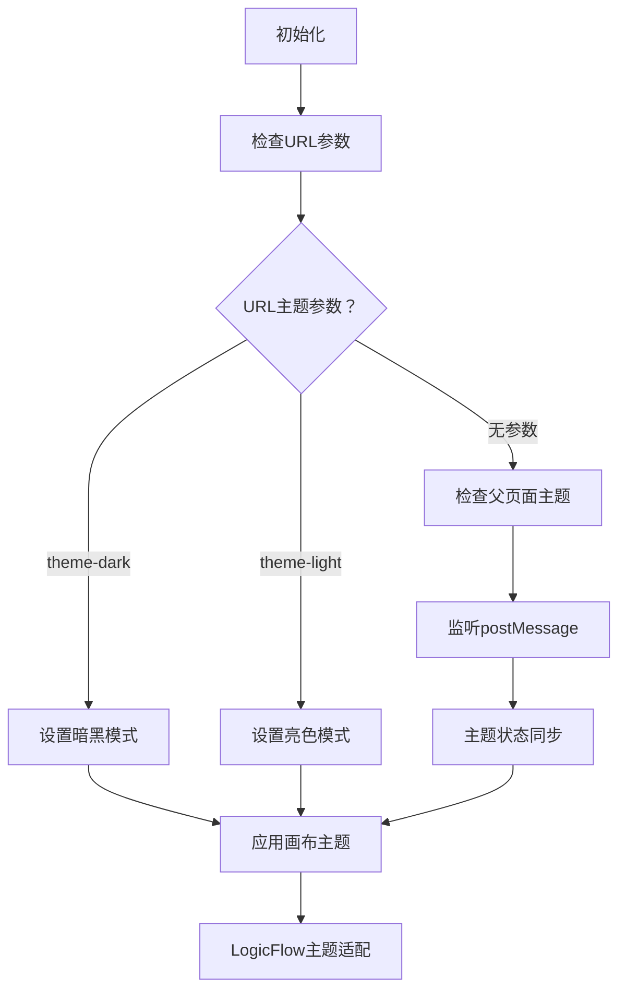
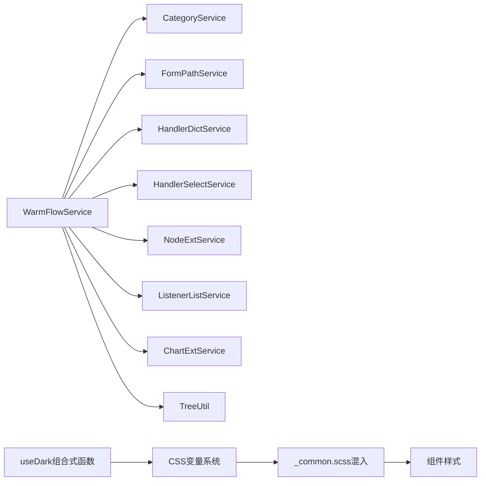

# UI 插件系统

<cite>
**本文档引用的文件**
- [WarmFlowService.java](file://warm-flow-plugin/warm-flow-plugin-ui/warm-flow-plugin-ui-core/src/main/java/org/dromara/warm/flow/ui/service/WarmFlowService.java)
- [CategoryService.java](file://warm-flow-plugin/warm-flow-plugin-ui/warm-flow-plugin-ui-core/src/main/java/org/dromara/warm/flow/ui/service/CategoryService.java)
- [HandlerDictService.java](file://warm-flow-plugin/warm-flow-plugin-ui/warm-flow-plugin-ui-core/src/main/java/org/dromara/warm/flow/ui/service/HandlerDictService.java)
- [ChartExtService.java](file://warm-flow-plugin/warm-flow-plugin-ui/warm-flow-plugin-ui-core/src/main/java/org/dromara/warm/flow/ui/service/ChartExtService.java)
- [FormPathService.java](file://warm-flow-plugin/warm-flow-plugin-ui/warm-flow-plugin-ui-core/src/main/java/org/dromara/warm/flow/ui/service/FormPathService.java)
- [HandlerSelectService.java](file://warm-flow-plugin/warm-flow-plugin-ui/warm-flow-plugin-ui-core/src/main/java/org/dromara/warm/flow/ui/service/HandlerSelectService.java)
- [NodeExtService.java](file://warm-flow-plugin/warm-flow-plugin-ui/warm-flow-plugin-ui-core/src/main/java/org/dromara/warm/flow/ui/service/NodeExtService.java)
- [ListenerListService.java](file://warm-flow-plugin/warm-flow-plugin-ui/warm-flow-plugin-ui-core/src/main/java/org/dromara/warm/flow/ui/service/ListenerListService.java)
- [TreeUtil.java](file://warm-flow-plugin/warm-flow-plugin-ui/warm-flow-plugin-ui-core/src/main/java/org/dromara/warm/flow/ui/utils/TreeUtil.java)
- [WarmFlowVo.java](file://warm-flow-plugin/warm-flow-plugin-ui/warm-flow-plugin-ui-core/src/main/java/org/dromara/warm/flow/ui/vo/WarmFlowVo.java)
- [WarmFlowUiConfig.java](file://warm-flow-plugin/warm-flow-plugin-ui/warm-flow-plugin-ui-sb-web/src/main/java/org/dromara/warm/flow/ui/config/WarmFlowUiConfig.java)
- [WarmFlowController.java](file://warm-flow-plugin/warm-flow-plugin-ui/warm-flow-plugin-ui-sb-web/src/main/java/org/dromara/warm/flow/ui/controller/WarmFlowController.java)
- [WarmFlowUiController.java](file://warm-flow-plugin/warm-flow-plugin-ui/warm-flow-plugin-ui-sb-web/src/main/java/org/dromara/warm/flow/ui/controller/WarmFlowUiController.java)
- [index.vue](file://warm-flow-ui/src/views/flow-design/index.vue)
- [baseInfo.vue](file://warm-flow-ui/src/components/design/common/vue/baseInfo.vue)
- [useDark.js](file://warm-flow-ui/src/composables/useDark.js)
- [index.scss](file://warm-flow-ui/src/assets/styles/index.scss)
- [_common.scss](file://warm-flow-ui/src/assets/styles/_common.scss)
- [variables.module.scss](file://warm-flow-ui/src/assets/styles/variables.module.scss)
- [element-ui.scss](file://warm-flow-ui/src/assets/styles/element-ui.scss)
- [sidebar.scss](file://warm-flow-ui/src/assets/styles/sidebar.scss)
- [transition.scss](file://warm-flow-ui/src/assets/styles/transition.scss)
- [btn.scss](file://warm-flow-ui/src/assets/styles/transition.scss)
- [start.vue](file://warm-flow-ui/src/components/design/common/vue/start.vue)
- [end.vue](file://warm-flow-ui/src/components/design/common/vue/end.vue)
</cite>

## 更新摘要
**所做更改**
- 新增主题定制与样式扩展章节，详细介绍暗黑模式支持、CSS变量系统、组件样式重构
- 更新架构总览图，增加主题系统集成
- 新增useDark组合式函数分析，展示暗黑模式统一管理机制
- 增加CSS变量系统详解，包括设计令牌与响应式主题适配
- 补充组件样式重构分析，展示SCSS混入与主题适配实现

## 目录
1. [简介](#简介)
2. [项目结构](#项目结构)
3. [核心组件](#核心组件)
4. [架构总览](#架构总览)
5. [详细组件分析](#详细组件分析)
6. [主题定制与样式扩展](#主题定制与样式扩展)
7. [依赖分析](#依赖分析)
8. [性能考虑](#性能考虑)
9. [故障排查指南](#故障排查指南)
10. [结论](#结论)
11. [附录](#附录)

## 简介
本文件面向 Warm-Flow UI 插件系统，聚焦于可视化设计器的插件架构与扩展能力，涵盖设计器集成、组件扩展、API 接口、服务类设计与实现、生命周期与事件处理机制、数据绑定策略，以及 UI 插件开发指南。重点解析 WarmFlowService、CategoryService、HandlerDictService 等服务类，阐明其职责边界、调用链路与扩展点，并给出与前端设计器的集成方式与最佳实践。

**更新** 本次更新重点增强了主题定制和样式扩展能力的文档描述，包括暗黑模式支持、CSS变量系统、组件样式重构等功能增强。

## 项目结构
Warm-Flow UI 插件系统由"后端插件核心 + 后端 Web 控制层 + 前端设计器"三层构成：
- 插件核心层：提供设计器所需的业务数据与扩展接口（如分类、表单路径、节点扩展、监听器列表、办理人字典等），并统一对外暴露 API。
- Web 控制层：基于 Spring MVC 或 Solon 插件机制，将核心服务映射为 REST 接口，供前端设计器调用。
- 前端设计器：基于 LogicFlow 的可视化流程设计器，负责图形化编辑、事件交互与数据持久化。

**图表来源**
- [WarmFlowController.java:1-217](file://warm-flow-plugin/warm-flow-plugin-ui/warm-flow-plugin-ui-sb-web/src/main/java/org/dromara/warm/flow/ui/controller/WarmFlowController.java#L1-L217)
- [WarmFlowService.java:1-376](file://warm-flow-plugin/warm-flow-plugin-ui/warm-flow-plugin-ui-core/src/main/java/org/dromara/warm/flow/ui/service/WarmFlowService.java#L1-L376)
- [WarmFlowUiConfig.java:1-44](file://warm-flow-plugin/warm-flow-plugin-ui/warm-flow-plugin-ui-sb-web/src/main/java/org/dromara/warm/flow/ui/config/WarmFlowUiConfig.java#L1-L44)
- [index.vue:1-957](file://warm-flow-ui/src/views/flow-design/index.vue#L1-L957)
- [baseInfo.vue:1-630](file://warm-flow-ui/src/components/design/common/vue/baseInfo.vue#L1-L630)
- [useDark.js:1-86](file://warm-flow-ui/src/composables/useDark.js#L1-L86)
- [index.scss:1-587](file://warm-flow-ui/src/assets/styles/index.scss#L1-L587)

**章节来源**
- [WarmFlowUiConfig.java:1-44](file://warm-flow-plugin/warm-flow-plugin-ui/warm-flow-plugin-ui-sb-web/src/main/java/org/dromara/warm/flow/ui/config/WarmFlowUiConfig.java#L1-L44)
- [WarmFlowController.java:1-217](file://warm-flow-plugin/warm-flow-plugin-ui/warm-flow-plugin-ui-sb-web/src/main/java/org/dromara/warm/flow/ui/controller/WarmFlowController.java#L1-L217)
- [WarmFlowService.java:1-376](file://warm-flow-plugin/warm-flow-plugin-ui/warm-flow-plugin-ui-core/src/main/java/org/dromara/warm/flow/ui/service/WarmFlowService.java#L1-L376)
- [index.vue:1-957](file://warm-flow-ui/src/views/flow-design/index.vue#L1-L957)
- [baseInfo.vue:1-630](file://warm-flow-ui/src/components/design/common/vue/baseInfo.vue#L1-L630)
- [useDark.js:1-86](file://warm-flow-ui/src/composables/useDark.js#L1-L86)
- [index.scss:1-587](file://warm-flow-ui/src/assets/styles/index.scss#L1-L587)

## 核心组件
- WarmFlowService：设计器统一入口服务，负责流程定义、流程图、表单、任务执行、节点扩展、监听器列表、办理人选择等能力的聚合与转发。
- CategoryService：流程分类树形数据查询接口，支持设计器基础信息中的"流程类别"选择。
- FormPathService：自定义表单路径树形数据查询接口，支持设计器基础信息中的"自定义表单"选择。
- HandlerDictService：提供"办理人选择项"字典，用于设计器中"办理人规则"等场景的默认表达式或占位提示。
- HandlerSelectService：提供"办理人权限设置"的查询、回显与树形结构封装能力，支持多类型（用户、角色、部门等）组合。
- NodeExtService：提供节点扩展属性列表，用于设计器节点属性面板的动态扩展。
- ListenerListService：提供监听器列表，用于设计器"监听器配置"表格的数据源。
- ChartExtService：提供流程图提示信息的初始化与执行扩展，支持节点提示对话框样式与内容。
- TreeUtil：通用树构建工具，将扁平列表转换为树形结构，服务于分类与表单路径等场景。
- WarmFlowVo：设计器配置返回对象，包含框架类型与令牌头名称列表等。

**章节来源**
- [WarmFlowService.java:1-376](file://warm-flow-plugin/warm-flow-plugin-ui/warm-flow-plugin-ui-core/src/main/java/org/dromara/warm/flow/ui/service/WarmFlowService.java#L1-L376)
- [CategoryService.java:1-37](file://warm-flow-plugin/warm-flow-plugin-ui/warm-flow-plugin-ui-core/src/main/java/org/dromara/warm/flow/ui/service/CategoryService.java#L1-L37)
- [FormPathService.java:1-37](file://warm-flow-plugin/warm-flow-plugin-ui/warm-flow-plugin-ui-core/src/main/java/org/dromara/warm/flow/ui/service/FormPathService.java#L1-L37)
- [HandlerDictService.java:1-36](file://warm-flow-plugin/warm-flow-plugin-ui/warm-flow-plugin-ui-core/src/main/java/org/dromara/warm/flow/ui/service/HandlerDictService.java#L1-L36)
- [HandlerSelectService.java:1-129](file://warm-flow-plugin/warm-flow-plugin-ui/warm-flow-plugin-ui-core/src/main/java/org/dromara/warm/flow/ui/service/HandlerSelectService.java#L1-L129)
- [NodeExtService.java:1-36](file://warm-flow-plugin/warm-flow-plugin-ui/warm-flow-plugin-ui-core/src/main/java/org/dromara/warm/flow/ui/service/NodeExtService.java#L1-L36)
- [ListenerListService.java:1-36](file://warm-flow-plugin/warm-flow-plugin-ui/warm-flow-plugin-ui-core/src/main/java/org/dromara/warm/flow/ui/service/ListenerListService.java#L1-L36)
- [ChartExtService.java:1-94](file://warm-flow-plugin/warm-flow-plugin-ui/warm-flow-plugin-ui-core/src/main/java/org/dromara/warm/flow/ui/service/ChartExtService.java#L1-L94)
- [TreeUtil.java:1-85](file://warm-flow-plugin/warm-flow-plugin-ui/warm-flow-plugin-ui-core/src/main/java/org/dromara/warm/flow/ui/utils/TreeUtil.java#L1-L85)
- [WarmFlowVo.java:1-45](file://warm-flow-plugin/warm-flow-plugin-ui/warm-flow-plugin-ui-core/src/main/java/org/dromara/warm/flow/ui/vo/WarmFlowVo.java#L1-L45)

## 架构总览
Warm-Flow UI 插件系统采用"接口契约 + 服务聚合 + 控制器暴露 + 前端设计器消费"的分层架构。后端通过 WarmFlowService 统一调度各扩展接口，前端设计器通过 WarmFlowController 暴露的 REST API 完成流程定义、流程图渲染、表单加载与审批执行等操作。

**更新** 新增主题系统集成，前端设计器通过 useDark 组合式函数统一管理暗黑模式状态，CSS变量系统提供响应式主题适配。

**图表来源**
- [WarmFlowController.java:1-217](file://warm-flow-plugin/warm-flow-plugin-ui/warm-flow-plugin-ui-sb-web/src/main/java/org/dromara/warm/flow/ui/controller/WarmFlowController.java#L1-L217)
- [WarmFlowService.java:1-376](file://warm-flow-plugin/warm-flow-plugin-ui/warm-flow-plugin-ui-core/src/main/java/org/dromara/warm/flow/ui/service/WarmFlowService.java#L1-L376)
- [useDark.js:1-86](file://warm-flow-ui/src/composables/useDark.js#L1-L86)
- [index.scss:1-587](file://warm-flow-ui/src/assets/styles/index.scss#L1-L587)

## 详细组件分析

### WarmFlowService：设计器统一服务
- 职责边界
  - 流程配置：返回框架类型与令牌头名称列表。
  - 流程定义：保存/查询流程 JSON；注入分类树与表单路径树；支持仅保存节点与跳转。
  - 流程图渲染：从实例还原 DefJson，注入流程图三原色、顶部文字开关；支持 ChartExtService 扩展。
  - 办理人：提供"类型标签"、"结果列表"、"名称回显"、"选择项字典"等能力。
  - 表单：提供已发布表单列表、表单内容读取与保存。
  - 任务：提供待办/已办表单加载与通用审批处理。
  - 节点扩展与监听器：提供节点扩展属性与监听器列表。
- 设计要点
  - 使用 FrameInvoker 获取业务系统实现的扩展接口，避免强耦合。
  - 对外部异常进行统一包装与日志记录，保证前端错误提示一致。
  - 对树形数据使用 TreeUtil 构建，确保父子关系正确性。
- 生命周期与事件
  - 作为静态服务被控制器直接调用，无需实例化；扩展接口通过框架注入获取。
  - 事件处理集中在前端设计器（LogicFlow）与控制器之间，后端主要负责数据与扩展点。

**图表来源**
- [WarmFlowService.java:1-376](file://warm-flow-plugin/warm-flow-plugin-ui/warm-flow-plugin-ui-core/src/main/java/org/dromara/warm/flow/ui/service/WarmFlowService.java#L1-L376)
- [CategoryService.java:1-37](file://warm-flow-plugin/warm-flow-plugin-ui/warm-flow-plugin-ui-core/src/main/java/org/dromara/warm/flow/ui/service/CategoryService.java#L1-L37)
- [FormPathService.java:1-37](file://warm-flow-plugin/warm-flow-plugin-ui/warm-flow-plugin-ui-core/src/main/java/org/dromara/warm/flow/ui/service/FormPathService.java#L1-L37)
- [HandlerDictService.java:1-36](file://warm-flow-plugin/warm-flow-plugin-ui/warm-flow-plugin-ui-core/src/main/java/org/dromara/warm/flow/ui/service/HandlerDictService.java#L1-L36)
- [HandlerSelectService.java:1-129](file://warm-flow-plugin/warm-flow-plugin-ui/warm-flow-plugin-ui-core/src/main/java/org/dromara/warm/flow/ui/service/HandlerSelectService.java#L1-L129)
- [NodeExtService.java:1-36](file://warm-flow-plugin/warm-flow-plugin-ui/warm-flow-plugin-ui-core/src/main/java/org/dromara/warm/flow/ui/service/NodeExtService.java#L1-L36)
- [ListenerListService.java:1-36](file://warm-flow-plugin/warm-flow-plugin-ui/warm-flow-plugin-ui-core/src/main/java/org/dromara/warm/flow/ui/service/ListenerListService.java#L1-L36)
- [ChartExtService.java:1-94](file://warm-flow-plugin/warm-flow-plugin-ui/warm-flow-plugin-ui-core/src/main/java/org/dromara/warm/flow/ui/service/ChartExtService.java#L1-L94)
- [TreeUtil.java:1-85](file://warm-flow-plugin/warm-flow-plugin-ui/warm-flow-plugin-ui-core/src/main/java/org/dromara/warm/flow/ui/utils/TreeUtil.java#L1-L85)

**章节来源**
- [WarmFlowService.java:1-376](file://warm-flow-plugin/warm-flow-plugin-ui/warm-flow-plugin-ui-core/src/main/java/org/dromara/warm/flow/ui/service/WarmFlowService.java#L1-L376)

### CategoryService 与 FormPathService：分类与表单路径扩展
- CategoryService：提供流程分类树形数据，用于"流程类别"选择。
- FormPathService：提供自定义表单路径树形数据，用于"自定义表单"选择。
- 实现建议
  - 返回扁平 Tree 列表，由 WarmFlowService 使用 TreeUtil 构建树。
  - 保持 id/parentId 唯一性与父子关系正确，避免循环引用。

**章节来源**
- [CategoryService.java:1-37](file://warm-flow-plugin/warm-flow-plugin-ui/warm-flow-plugin-ui-core/src/main/java/org/dromara/warm/flow/ui/service/CategoryService.java#L1-L37)
- [FormPathService.java:1-37](file://warm-flow-plugin/warm-flow-plugin-ui/warm-flow-plugin-ui-core/src/main/java/org/dromara/warm/flow/ui/service/FormPathService.java#L1-L37)
- [TreeUtil.java:1-85](file://warm-flow-plugin/warm-flow-plugin-ui/warm-flow-plugin-ui-core/src/main/java/org/dromara/warm/flow/ui/utils/TreeUtil.java#L1-L85)

### HandlerDictService 与 HandlerSelectService：办理人扩展
- HandlerDictService：提供"办理人选择项"字典，用于默认表达式或占位提示。
- HandlerSelectService：提供"类型标签"、"结果列表"、"名称回显"能力；支持通过工具方法将任意数据源封装为 HandlerSelectVo，并可生成树形选择结构。
- 设计要点
  - handlerFeedback 支持兼容老项目回显逻辑，新项目建议重写以提升性能。
  - getHandlerSelectVo 与 getHandlerSelectVo 泛型重载便于不同数据源适配。

**图表来源**
- [HandlerSelectService.java:1-129](file://warm-flow-plugin/warm-flow-plugin-ui/warm-flow-plugin-ui-core/src/main/java/org/dromara/warm/flow/ui/service/HandlerSelectService.java#L1-L129)

**章节来源**
- [HandlerDictService.java:1-36](file://warm-flow-plugin/warm-flow-plugin-ui/warm-flow-plugin-ui-core/src/main/java/org/dromara/warm/flow/ui/service/HandlerDictService.java#L1-L36)
- [HandlerSelectService.java:1-129](file://warm-flow-plugin/warm-flow-plugin-ui/warm-flow-plugin-ui-core/src/main/java/org/dromara/warm/flow/ui/service/HandlerSelectService.java#L1-L129)

### NodeExtService 与 ListenerListService：节点扩展与监听器
- NodeExtService：提供节点扩展属性列表，用于节点属性面板扩展。
- ListenerListService：提供监听器列表，用于"监听器配置"表格的数据源。
- 设计要点
  - 保持与前端组件约定的字段一致，避免序列化/反序列化问题。
  - 监听器类型与路径应与后端策略实现匹配。

**章节来源**
- [NodeExtService.java:1-36](file://warm-flow-plugin/warm-flow-plugin-ui/warm-flow-plugin-ui-core/src/main/java/org/dromara/warm/flow/ui/service/NodeExtService.java#L1-L36)
- [ListenerListService.java:1-36](file://warm-flow-plugin/warm-flow-plugin-ui/warm-flow-plugin-ui-core/src/main/java/org/dromara/warm/flow/ui/service/ListenerListService.java#L1-L36)

### ChartExtService：流程图提示扩展
- 提供流程图提示信息的初始化与执行扩展，支持为每个节点设置提示对话框样式与内容。
- 设计要点
  - 默认实现提供通用提示模板，业务可覆盖 execute 以实现自定义提示逻辑。
  - 通过 PromptContent 与 InfoItem 组织提示内容，支持样式合并。

**章节来源**
- [ChartExtService.java:1-94](file://warm-flow-plugin/warm-flow-plugin-ui/warm-flow-plugin-ui-core/src/main/java/org/dromara/warm/flow/ui/service/ChartExtService.java#L1-L94)

### WarmFlowVo：设计器配置对象
- 返回框架类型与令牌头名称列表，供前端判断鉴权头与主题适配。

**章节来源**
- [WarmFlowVo.java:1-45](file://warm-flow-plugin/warm-flow-plugin-ui/warm-flow-plugin-ui-core/src/main/java/org/dromara/warm/flow/ui/vo/WarmFlowVo.java#L1-L45)

### WarmFlowUiConfig：Web 层集成
- 条件启用：通过配置开关控制 UI 模块是否生效。
- 资源映射：将 warm-flow-ui 前端资源映射到 classpath，便于直接访问。
- 控制器导入：自动导入 WarmFlowUiController 与 WarmFlowController。

**章节来源**
- [WarmFlowUiConfig.java:1-44](file://warm-flow-plugin/warm-flow-plugin-ui/warm-flow-plugin-ui-sb-web/src/main/java/org/dromara/warm/flow/ui/config/WarmFlowUiConfig.java#L1-L44)

### WarmFlowController 与 WarmFlowUiController：API 暴露
- WarmFlowController：提供流程定义、流程图、表单、任务、节点扩展、监听器、办理人等完整 API。
- WarmFlowUiController：提供匿名访问的 UI 配置接口。
- 设计要点
  - 使用事务注解保证保存类操作的一致性。
  - 参数校验与异常处理统一由 WarmFlowService 执行，控制器仅做转发。

**章节来源**
- [WarmFlowController.java:1-217](file://warm-flow-plugin/warm-flow-plugin-ui/warm-flow-plugin-ui-sb-web/src/main/java/org/dromara/warm/flow/ui/controller/WarmFlowController.java#L1-L217)
- [WarmFlowUiController.java:1-45](file://warm-flow-plugin/warm-flow-plugin-ui/warm-flow-plugin-ui-sb-web/src/main/java/org/dromara/warm/flow/ui/controller/WarmFlowUiController.java#L1-L45)

### 前端设计器集成：index.vue 与 baseInfo.vue
- index.vue：负责流程设计器的初始化、主题监听、事件绑定、保存与下载、流程图渲染与缩放等。
- baseInfo.vue：负责基础信息表单（流程编码、名称、模型、类别、表单、监听器等）的校验与数据收集。
- 集成要点
  - 通过 API 读取流程定义、分类树、表单路径树、监听器列表等。
  - 保存时将 LogicFlow 图形数据转换为 Warm-Flow JSON 并提交。

**章节来源**
- [index.vue:1-957](file://warm-flow-ui/src/views/flow-design/index.vue#L1-L957)
- [baseInfo.vue:1-630](file://warm-flow-ui/src/components/design/common/vue/baseInfo.vue#L1-L630)

## 主题定制与样式扩展

### 暗黑模式支持
Warm-Flow UI 插件系统实现了完整的暗黑模式支持，通过统一的 useDark 组合式函数管理主题状态。

#### useDark 组合式函数
- **URL参数初始化**：支持通过 URL 参数 theme=theme-dark 或 theme-light 控制初始主题状态
- **postMessage通信**：监听父页面主题切换消息，实现跨窗口主题同步
- **LogicFlow主题适配**：自动应用暗黑模式到设计器画布背景、网格和边文字
- **状态管理**：统一管理 isDark 状态，提供初始化、清理等生命周期方法

**图表来源**
- [useDark.js:1-86](file://warm-flow-ui/src/composables/useDark.js#L1-L86)

**章节来源**
- [useDark.js:1-86](file://warm-flow-ui/src/composables/useDark.js#L1-L86)

### CSS变量系统
系统采用现代CSS变量系统，提供设计令牌和响应式主题适配。

#### 设计令牌定义
- **颜色系统**：--wf-primary、--wf-success、--wf-warning、--wf-danger 等主色调
- **文本系统**：--wf-text-primary、--wf-text-regular、--wf-text-secondary 等文本色彩
- **边框系统**：--wf-border-color、--wf-border-light、--wf-border-lighter 等边框色彩
- **背景系统**：--wf-bg-color、--wf-bg-white 等背景色彩
- **圆角系统**：--wf-radius-sm、--wf-radius、--wf-radius-lg 等圆角半径
- **阴影系统**：--wf-shadow-sm、--wf-shadow、--wf-shadow-lg 等阴影效果

#### 暗黑模式适配
- **条件样式**：通过 html.dark 伪类选择器实现主题切换
- **变量覆盖**：暗黑模式下重新定义颜色变量值
- **渐变适配**：背景渐变色在暗黑模式下自动调整
- **边框适配**：边框颜色在暗黑模式下变深以提高对比度

**章节来源**
- [index.scss:1-587](file://warm-flow-ui/src/assets/styles/index.scss#L1-L587)
- [variables.module.scss:1-65](file://warm-flow-ui/src/assets/styles/variables.module.scss#L1-L65)

### 组件样式重构
系统采用SCSS混入和模块化样式架构，实现组件级主题适配。

#### 样式混入系统
- **现代化页签**：modern-tabs 混入提供统一的页签样式和激活态效果
- **基础配置卡片**：base-settings-card 混入定义卡片容器、头部和内容区域样式
- **监听器卡片**：section-card 混入支持监听器配置的统一布局
- **表格表单对齐**：table-form-align 混入解决表格内表单元素对齐问题

#### 主题适配实现
- **html.dark选择器**：所有组件样式都支持暗黑模式适配
- **CSS变量引用**：组件内部使用 var(--wf-*) 变量引用主题色彩
- **渐变背景**：使用CSS渐变替代固定颜色，自动适配主题
- **边框处理**：边框颜色通过变量控制，在暗黑模式下自动加深

**章节来源**
- [_common.scss:1-138](file://warm-flow-ui/src/assets/styles/_common.scss#L1-L138)
- [start.vue:1-295](file://warm-flow-ui/src/components/design/common/vue/start.vue#L1-L295)
- [end.vue:1-98](file://warm-flow-ui/src/components/design/common/vue/end.vue#L1-L98)

### Element Plus 暗黑模式适配
系统针对Element Plus组件库进行了全面的暗黑模式适配。

#### 组件适配范围
- **输入框**：el-input、el-textarea、el-select 等表单组件
- **选择器**：el-radio、el-checkbox、el-switch 等交互组件  
- **表格**：el-table 表头、行高亮、斑马纹等样式
- **弹窗**：el-dialog、el-tooltip、el-popover 等浮层组件

#### 适配策略
- **背景色适配**：输入框背景色在暗黑模式下自动调整为深色
- **边框色适配**：边框颜色根据主题自动调整透明度和饱和度
- **文字色适配**：文本颜色在暗黑模式下提高对比度
- **悬停效果**：悬停状态的颜色在暗黑模式下使用更柔和的色调

**章节来源**
- [index.scss:304-586](file://warm-flow-ui/src/assets/styles/index.scss#L304-L586)

### LogicFlow 组件主题适配
设计器中的 LogicFlow 组件也实现了完整的暗黑模式支持。

#### 适配组件
- **DndPanel 拖拽面板**：左侧节点拖拽面板的背景和边框适配
- **Control 控制栏**：顶部工具栏的背景、边框和图标适配
- **画布背景**：整体画布背景色在暗黑模式下变深
- **网格系统**：网格颜色在暗黑模式下使用浅色以保持可见性

#### 主题切换机制
- **动态主题应用**：通过 applyDarkTheme 方法实时切换主题
- **状态同步**：与全局主题状态保持同步
- **性能优化**：只在主题变化时重新计算样式

**章节来源**
- [useDark.js:42-62](file://warm-flow-ui/src/composables/useDark.js#L42-L62)

## 依赖分析
- 组件内聚与耦合
  - WarmFlowService 内聚了设计器所需的核心能力，通过接口注入实现低耦合扩展。
  - TreeUtil 作为通用工具，被多个服务复用，降低重复逻辑。
- 外部依赖
  - 前端依赖 LogicFlow 进行图形化编辑与事件处理。
  - 后端依赖 FlowEngine 与各 Service 完成持久化与业务处理。
- 潜在风险
  - 扩展接口缺失时返回空或默认值，需在前端做好容错。
  - 树形数据构建依赖 id/parentId 关系，需确保数据一致性。
- **更新** 主题系统依赖 CSS 变量和 html.dark 类名，需要确保样式文件正确加载。

**图表来源**
- [WarmFlowService.java:1-376](file://warm-flow-plugin/warm-flow-plugin-ui/warm-flow-plugin-ui-core/src/main/java/org/dromara/warm/flow/ui/service/WarmFlowService.java#L1-L376)
- [TreeUtil.java:1-85](file://warm-flow-plugin/warm-flow-plugin-ui/warm-flow-plugin-ui-core/src/main/java/org/dromara/warm/flow/ui/utils/TreeUtil.java#L1-L85)
- [useDark.js:1-86](file://warm-flow-ui/src/composables/useDark.js#L1-L86)
- [index.scss:1-587](file://warm-flow-ui/src/assets/styles/index.scss#L1-L587)
- [_common.scss:1-138](file://warm-flow-ui/src/assets/styles/_common.scss#L1-L138)

**章节来源**
- [WarmFlowService.java:1-376](file://warm-flow-plugin/warm-flow-plugin-ui/warm-flow-plugin-ui-core/src/main/java/org/dromara/warm/flow/ui/service/WarmFlowService.java#L1-L376)
- [TreeUtil.java:1-85](file://warm-flow-plugin/warm-flow-plugin-ui/warm-flow-plugin-ui-core/src/main/java/org/dromara/warm/flow/ui/utils/TreeUtil.java#L1-L85)
- [useDark.js:1-86](file://warm-flow-ui/src/composables/useDark.js#L1-L86)
- [index.scss:1-587](file://warm-flow-ui/src/assets/styles/index.scss#L1-L587)

## 性能考虑
- 办理人回显优化：HandlerSelectService 的 handlerFeedback 为兼容老项目提供默认实现，建议业务系统重写以减少多次查询与映射开销。
- 树形构建：TreeUtil 采用一次遍历与递归构建，复杂度 O(n)，建议上游数据去重与去环。
- 前端渲染：LogicFlow 图形渲染与事件绑定较多，建议在设计器初始化时一次性完成，避免重复注册。
- API 调用：将分类树、表单路径树、监听器列表等一次性拉取并缓存，减少多次请求。
- **更新** 主题切换性能：useDark 组合式函数使用 CSS 变量而非 JavaScript 动态修改样式，性能更优。

## 故障排查指南
- 流程定义为空
  - 检查 WarmFlowService.queryDef 是否正确注入 CategoryService 与 FormPathService。
  - 确认 TreeUtil 构建树时 id/parentId 关系是否正确。
- 办理人名称无法回显
  - 检查 HandlerSelectService.handlerFeedback 是否被业务系统重写。
  - 确认 storageIds 与 HandlerAuth 的存储主键一致。
- 流程图提示未生效
  - 检查 ChartExtService.initPromptContent 是否被覆盖或未调用。
  - 确认节点类型非网关类型（网关默认跳过提示）。
- 监听器列表为空
  - 检查 ListenerListService 是否被业务系统实现。
  - 确认前端 baseInfo.vue 中监听器表格数据绑定是否正确。
- **更新** 暗黑模式不生效
  - 检查 html.dark 类名是否正确添加到 documentElement
  - 确认 CSS 变量文件是否正确加载
  - 验证 useDark 组合式函数的初始化逻辑
  - 检查 LogicFlow 画布主题应用是否成功

**章节来源**
- [WarmFlowService.java:1-376](file://warm-flow-plugin/warm-flow-plugin-ui/warm-flow-plugin-ui-core/src/main/java/org/dromara/warm/flow/ui/service/WarmFlowService.java#L1-L376)
- [HandlerSelectService.java:1-129](file://warm-flow-plugin/warm-flow-plugin-ui/warm-flow-plugin-ui-core/src/main/java/org/dromara/warm/flow/ui/service/HandlerSelectService.java#L1-L129)
- [ChartExtService.java:1-94](file://warm-flow-plugin/warm-flow-plugin-ui/warm-flow-plugin-ui-core/src/main/java/org/dromara/warm/flow/ui/service/ChartExtService.java#L1-L94)
- [baseInfo.vue:1-630](file://warm-flow-ui/src/components/design/common/vue/baseInfo.vue#L1-L630)
- [useDark.js:1-86](file://warm-flow-ui/src/composables/useDark.js#L1-L86)

## 结论
Warm-Flow UI 插件系统通过清晰的接口契约与服务聚合，实现了设计器与业务系统的松耦合扩展。WarmFlowService 作为统一入口，结合各类扩展接口与前端设计器，提供了完整的流程设计、表单与审批能力。

**更新** 新增的主题定制和样式扩展能力进一步提升了系统的用户体验和可维护性。通过CSS变量系统、暗黑模式支持和组件样式重构，系统实现了真正的响应式主题适配，为用户提供了更好的视觉体验。

建议在实际项目中：
- 明确扩展接口职责，避免过度耦合。
- 重视树形数据与回显性能，必要时重写默认实现。
- 前后端协同，确保字段与行为一致。
- **更新** 充分利用主题系统，为用户提供更好的视觉体验。

## 附录
- 开发指南（概要）
  - 接口定义：实现 CategoryService、FormPathService、HandlerDictService、HandlerSelectService、NodeExtService、ListenerListService、ChartExtService。
  - 组件注册：通过框架机制注入 Bean，WarmFlowService 将自动发现并调用。
  - 样式定制：利用 CSS 变量系统和 SCSS 混入，实现组件级主题适配。
  - 主题扩展：通过 useDark 组合式函数统一管理暗黑模式，支持 URL 参数和 postMessage 通信。
  - 数据绑定：前后端字段保持一致，避免序列化差异导致的渲染问题。
  - 集成方式：后端通过 WarmFlowUiConfig 与 WarmFlowController 暴露 API，前端通过 index.vue 与 baseInfo.vue 调用。
  - **更新** 主题开发：遵循 CSS 变量命名规范，确保组件样式在暗黑模式下的正确显示。