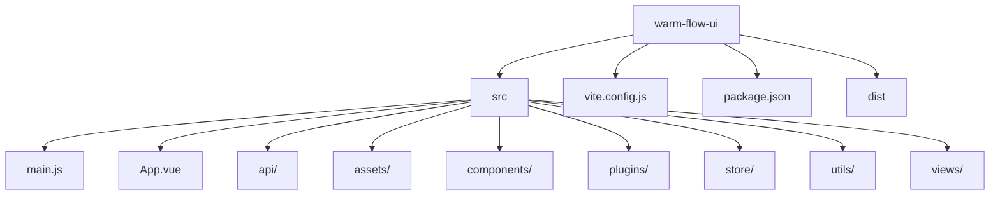
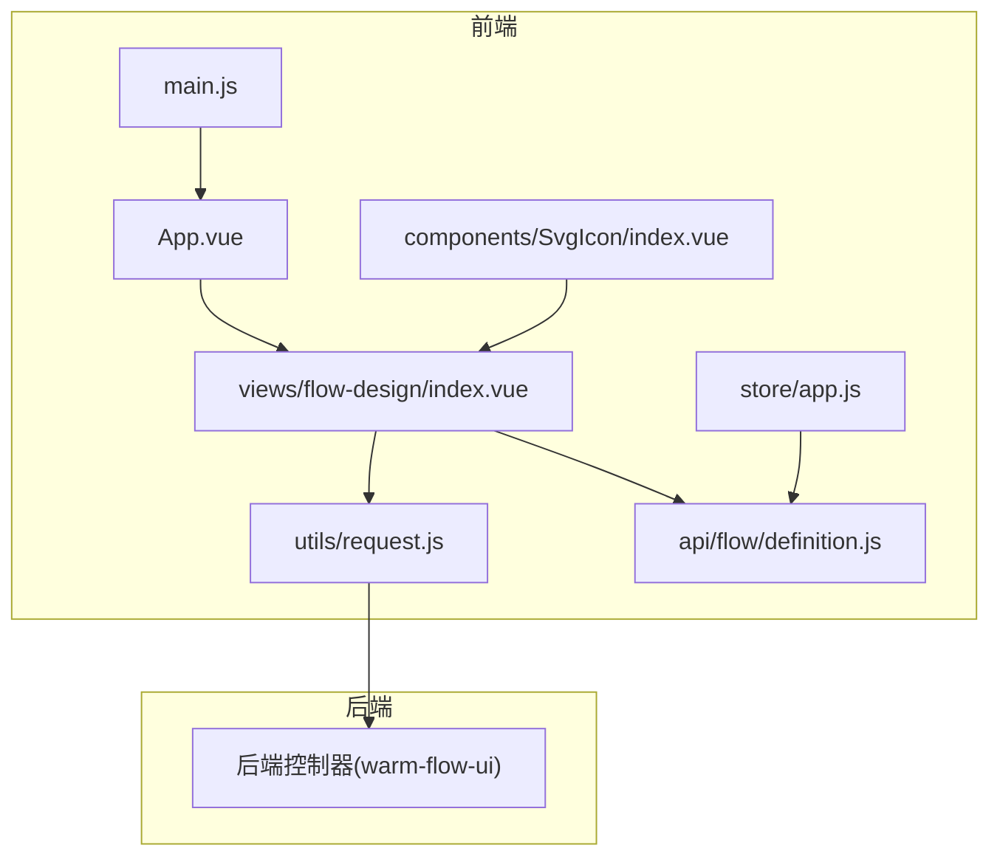
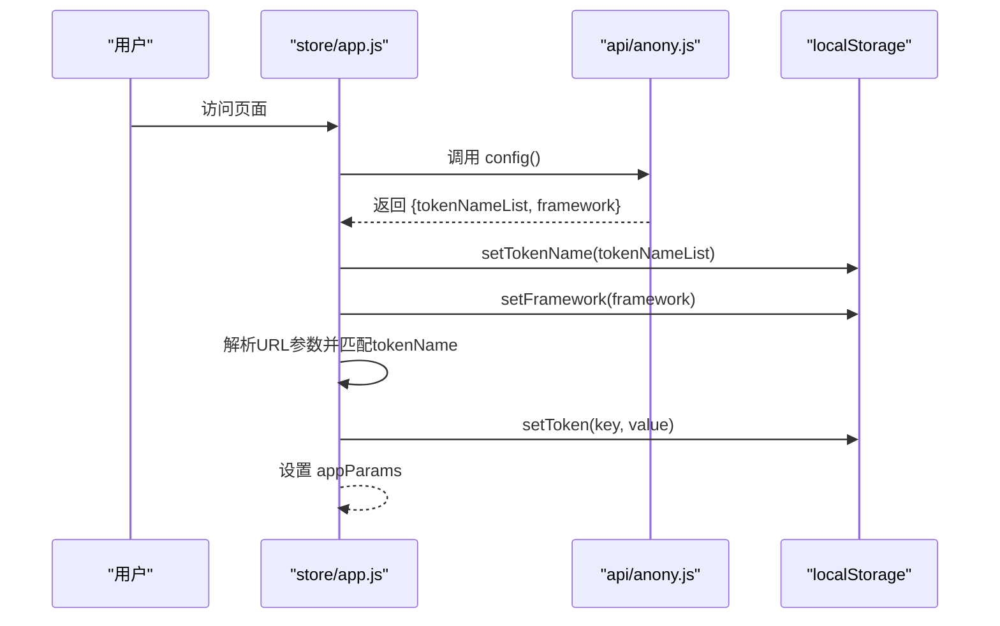
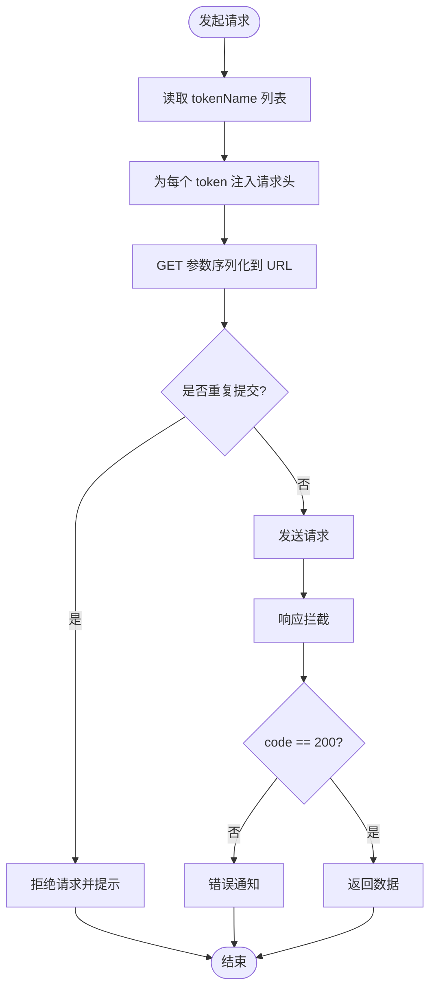
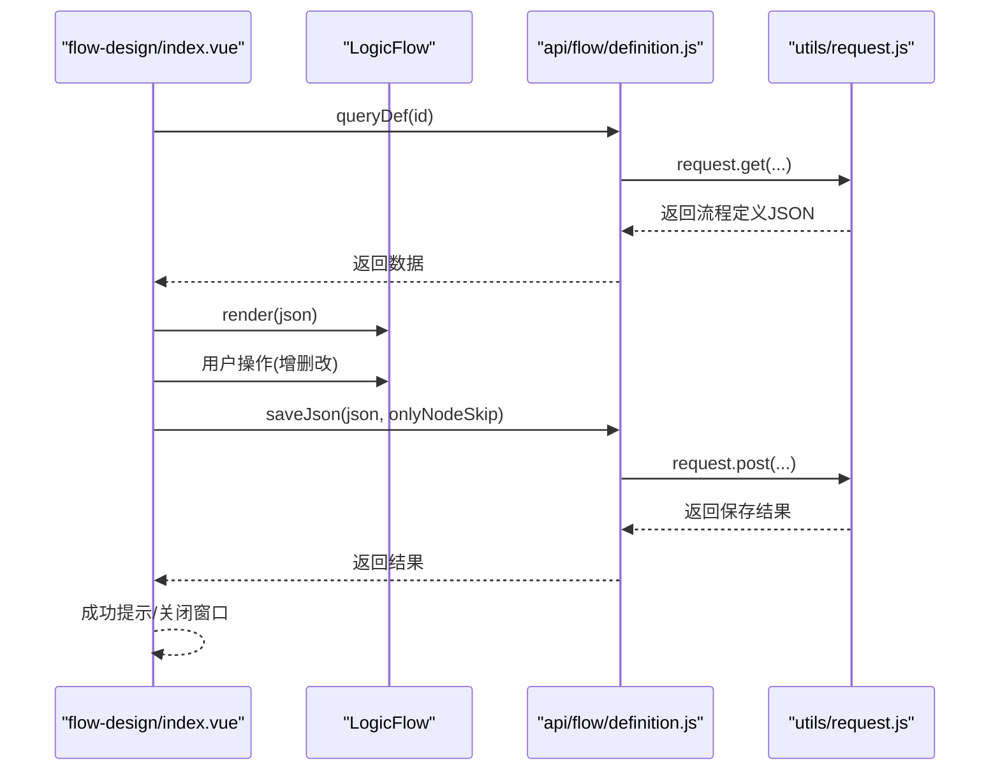
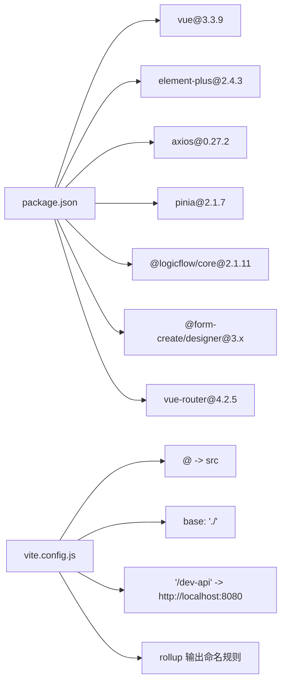

# Vue3 前端集成

<cite>
**本文引用的文件**   
- [package.json](file://warm-flow-ui/package.json)
- [vite.config.js](file://warm-flow-ui/vite.config.js)
- [main.js](file://warm-flow-ui/src/main.js)
- [App.vue](file://warm-flow-ui/src/App.vue)
- [README.md](file://warm-flow-ui/README.md)
- [store/index.js](file://warm-flow-ui/src/store/index.js)
- [store/app.js](file://warm-flow-ui/src/store/app.js)
- [utils/request.js](file://warm-flow-ui/src/utils/request.js)
- [components/SvgIcon/index.vue](file://warm-flow-ui/src/components/SvgIcon/index.vue)
- [views/flow-design/index.vue](file://warm-flow-ui/src/views/flow-design/index.vue)
- [api/anony.js](file://warm-flow-ui/src/api/anony.js)
- [api/flow/definition.js](file://warm-flow-ui/src/api/flow/definition.js)
- [assets/styles/index.scss](file://warm-flow-ui/src/assets/styles/index.scss)
- [utils/auth.js](file://warm-flow-ui/src/utils/auth.js)
</cite>

## 目录
1. [简介](#简介)
2. [项目结构](#项目结构)
3. [核心组件](#核心组件)
4. [架构总览](#架构总览)
5. [详细组件分析](#详细组件分析)
6. [依赖关系分析](#依赖关系分析)
7. [性能考量](#性能考量)
8. [故障排查指南](#故障排查指南)
9. [结论](#结论)
10. [附录](#附录)

## 简介
本技术文档面向 Warm-Flow Vue3 前端集成，聚焦于 warm-flow-ui 目录下的前端资源组织、构建与运行、前后端交互机制、数据绑定与组件通信策略，并提供资源打包、CDN 配置、样式定制与图标使用的开发指南，以及性能优化与浏览器兼容性建议。

## 项目结构
warm-flow-ui 采用 Vite + Vue3 + Element Plus + LogicFlow 的现代化前端工程，核心目录与职责如下：
- src：源代码目录
  - api：后端接口封装
  - assets：静态资源与样式
  - components：通用组件（如 SvgIcon）
  - plugins：插件注册
  - store：Pinia 状态管理
  - utils：工具模块（请求、鉴权等）
  - views：页面视图（流程设计、表单设计等）
  - main.js：应用入口
  - App.vue：根组件
- vite.config.js：构建与开发服务器配置
- package.json：依赖与脚本
- dist：构建产物（生产环境）

**图表来源**
- [package.json:1-42](file://warm-flow-ui/package.json#L1-L42)
- [vite.config.js:1-71](file://warm-flow-ui/vite.config.js#L1-L71)

**章节来源**
- [package.json:1-42](file://warm-flow-ui/package.json#L1-L42)
- [vite.config.js:1-71](file://warm-flow-ui/vite.config.js#L1-L71)
- [README.md:1-44](file://warm-flow-ui/README.md#L1-L44)

## 核心组件
- 应用入口与全局配置
  - main.js：创建 Vue 应用，注册 Element Plus、FcDesigner、SvgIcon 插件，挂载全局方法，注入 Pinia 与插件系统。
- 根组件与路由切换
  - App.vue：依据 store 中的参数动态切换渲染组件（流程设计、流程图、表单设计等）。
- 状态管理
  - store/index.js：创建并导出 Pinia 实例。
  - store/app.js：从后端配置接口获取 token 名称、框架类型等参数，解析 URL 参数并写入本地存储，供后续请求使用。
- 请求与拦截器
  - utils/request.js：基于 axios 的请求实例，统一设置 baseURL、超时、请求头注入（token）、GET 参数序列化、重复提交防抖、响应拦截与错误提示。
- 图标系统
  - components/SvgIcon/index.vue：SVG 图标组件，支持传入 iconClass、className、color，自动拼接 #icon- 前缀。
- 流程设计视图
  - views/flow-design/index.vue：集成 LogicFlow，提供流程设计、属性设置、主题切换、下载与保存等功能；通过 API 模块与后端交互。

**章节来源**
- [main.js:1-42](file://warm-flow-ui/src/main.js#L1-L42)
- [App.vue:1-26](file://warm-flow-ui/src/App.vue#L1-L26)
- [store/index.js:1-3](file://warm-flow-ui/src/store/index.js#L1-L3)
- [store/app.js:1-42](file://warm-flow-ui/src/store/app.js#L1-L42)
- [utils/request.js:1-105](file://warm-flow-ui/src/utils/request.js#L1-L105)
- [components/SvgIcon/index.vue:1-54](file://warm-flow-ui/src/components/SvgIcon/index.vue#L1-L54)
- [views/flow-design/index.vue:1-901](file://warm-flow-ui/src/views/flow-design/index.vue#L1-L901)

## 架构总览
前端采用“入口应用 → 视图组件 → API 层 → 后端服务”的分层架构；请求通过 axios 拦截器统一处理；状态通过 Pinia 管理；UI 组件基于 Element Plus；流程图能力由 LogicFlow 提供。

**图表来源**
- [main.js:1-42](file://warm-flow-ui/src/main.js#L1-L42)
- [App.vue:1-26](file://warm-flow-ui/src/App.vue#L1-L26)
- [store/app.js:1-42](file://warm-flow-ui/src/store/app.js#L1-L42)
- [utils/request.js:1-105](file://warm-flow-ui/src/utils/request.js#L1-L105)
- [api/flow/definition.js:1-95](file://warm-flow-ui/src/api/flow/definition.js#L1-L95)
- [components/SvgIcon/index.vue:1-54](file://warm-flow-ui/src/components/SvgIcon/index.vue#L1-L54)
- [views/flow-design/index.vue:1-901](file://warm-flow-ui/src/views/flow-design/index.vue#L1-L901)

## 详细组件分析

### 应用入口与全局配置（main.js）
- 功能要点
  - 创建 Vue 应用实例
  - 注册 Element Plus 国际化与主题
  - 注册 FcDesigner 设计器
  - 注册 SVG 图标插件与组件
  - 挂载 Pinia 与插件系统
  - 挂载全局方法（如时间格式化）
- 关键行为
  - 使用虚拟模块注册 SVG 图标
  - 组件注册与全局图标插件注入

**章节来源**
- [main.js:1-42](file://warm-flow-ui/src/main.js#L1-L42)

### 根组件与动态渲染（App.vue）
- 功能要点
  - 依据 store.appParams.type 动态选择渲染组件
  - 首次加载时尝试获取 token 名称与框架类型
- 关键行为
  - 组件映射：form、FlowChart、formCreate 对应不同视图
  - 基于 URL 参数决定渲染目标

**章节来源**
- [App.vue:1-26](file://warm-flow-ui/src/App.vue#L1-L26)
- [store/app.js:1-42](file://warm-flow-ui/src/store/app.js#L1-L42)

### 状态管理（store/app.js）
- 功能要点
  - 从后端配置接口获取 token 名称列表与框架类型
  - 解析 URL 参数，匹配 token 名称并写入本地存储
  - 将 URL 参数集合为 appParams，供视图组件使用
- 关键行为
  - 异步获取配置 → 写入本地存储 → 解析参数 → 设置 appParams

**图表来源**
- [store/app.js:1-42](file://warm-flow-ui/src/store/app.js#L1-L42)
- [api/anony.js:1-14](file://warm-flow-ui/src/api/anony.js#L1-L14)
- [utils/auth.js:1-38](file://warm-flow-ui/src/utils/auth.js#L1-L38)

**章节来源**
- [store/app.js:1-42](file://warm-flow-ui/src/store/app.js#L1-L42)
- [api/anony.js:1-14](file://warm-flow-ui/src/api/anony.js#L1-L14)
- [utils/auth.js:1-38](file://warm-flow-ui/src/utils/auth.js#L1-L38)

### 请求与拦截器（utils/request.js）
- 功能要点
  - 统一设置 baseURL（来自环境变量）
  - 注入多 token 名称对应的请求头
  - GET 请求参数序列化到 URL
  - 防重复提交（基于 session 缓存请求对象）
  - 响应拦截：非 200 统一错误提示；Blob 类型透传
  - 错误分类与消息提示
- 关键行为
  - 请求拦截：读取 tokenName 列表，逐个注入请求头
  - 响应拦截：根据 code 判断成功或失败

**图表来源**
- [utils/request.js:1-105](file://warm-flow-ui/src/utils/request.js#L1-L105)
- [utils/auth.js:1-38](file://warm-flow-ui/src/utils/auth.js#L1-L38)

**章节来源**
- [utils/request.js:1-105](file://warm-flow-ui/src/utils/request.js#L1-L105)
- [utils/auth.js:1-38](file://warm-flow-ui/src/utils/auth.js#L1-L38)

### 图标系统（components/SvgIcon/index.vue）
- 功能要点
  - 接收 iconClass、className、color
  - 自动拼接 #icon- 前缀作为 xlink:href
  - 支持内联样式与类名组合
- 关键行为
  - computed 计算 iconName 与 svgClass
  - 样式作用域内定义 svg-icon 基础样式

**章节来源**
- [components/SvgIcon/index.vue:1-54](file://warm-flow-ui/src/components/SvgIcon/index.vue#L1-L54)

### 流程设计视图（views/flow-design/index.vue）
- 功能要点
  - 步骤条：基础信息、流程设计、表单设计（当前仅启用前两步）
  - LogicFlow 集成：DndPanel、Menu、Snapshot 扩展
  - 主题切换：暗黑/明亮模式，联动 LogicFlow 与 Element Plus
  - 保存与下载：保存 JSON、下载 PNG/SVG、下载流程 JSON
  - 事件处理：节点/边点击、键盘快捷键、边 Tooltip、删除节点
- 关键行为
  - 初始化 LogicFlow：根据 modelValue 决定节点注册与 DndPanel 显示
  - 保存流程：收集表单与画布数据，转换为后端可用 JSON 并调用保存接口
  - 下载：调用快照生成图片或导出 JSON 文件

**图表来源**
- [views/flow-design/index.vue:1-901](file://warm-flow-ui/src/views/flow-design/index.vue#L1-L901)
- [api/flow/definition.js:1-95](file://warm-flow-ui/src/api/flow/definition.js#L1-L95)
- [utils/request.js:1-105](file://warm-flow-ui/src/utils/request.js#L1-L105)

**章节来源**
- [views/flow-design/index.vue:1-901](file://warm-flow-ui/src/views/flow-design/index.vue#L1-L901)
- [api/flow/definition.js:1-95](file://warm-flow-ui/src/api/flow/definition.js#L1-L95)
- [utils/request.js:1-105](file://warm-flow-ui/src/utils/request.js#L1-L105)

### 样式体系（assets/styles/index.scss）
- 功能要点
  - 定义 CSS 变量（主题色、阴影、圆角、间距等），支持明暗主题切换
  - 导入 mixin、过渡、Element Plus 适配、侧边栏、按钮、RuoYi 主题等模块
  - 适配 Element Plus 暗黑模式下的输入框、表格、树形选择等组件
  - LogicFlow 控件的暗黑适配（DndPanel、Control）
- 关键行为
  - :root 定义默认变量
  - html.dark 定义暗色变量覆盖
  - 按需导入多个样式模块

**章节来源**
- [assets/styles/index.scss:1-587](file://warm-flow-ui/src/assets/styles/index.scss#L1-L587)

## 依赖关系分析
- 依赖与版本
  - Vue3、Element Plus、LogicFlow、@form-create、axios、pinia、vue-router 等
- 构建与开发
  - Vite 作为构建工具，配置 base、alias、server 代理、rollup 输出命名、CSS PostCSS 插件等
- 运行与打包
  - scripts：dev、build:prod、preview
  - 开发代理：/dev-api → 本地后端服务
  - 生产 base：./ 以适配子路径部署

**图表来源**
- [package.json:1-42](file://warm-flow-ui/package.json#L1-L42)
- [vite.config.js:1-71](file://warm-flow-ui/vite.config.js#L1-L71)

**章节来源**
- [package.json:1-42](file://warm-flow-ui/package.json#L1-L42)
- [vite.config.js:1-71](file://warm-flow-ui/vite.config.js#L1-L71)

## 性能考量
- 体积与分包
  - rollupOptions.output 配置 chunkFileNames、entryFileNames、assetFileNames，便于缓存与 CDN 分发
  - chunkSizeWarningLimit 提升大包阈值，避免告警
- 资源加载
  - base: './' 适配子路径部署，减少资源 404
  - CDN：可将第三方库（如 Element Plus、LogicFlow、axios）指向 CDN，结合输出命名提升缓存命中
- 请求优化
  - 防重复提交：POST/PUT 请求基于请求体与时间戳去重，避免误判大数据请求
  - GET 参数序列化：减少无效查询参数
- 渲染优化
  - LogicFlow 按需启用 DndPanel 与扩展，避免不必要的 DOM 与事件
  - 暗色主题切换通过主题变量与 setTheme，减少重绘成本

[本节为通用性能建议，无需特定文件引用]

## 故障排查指南
- 请求失败
  - 检查 baseURL 与环境变量是否正确（VITE_APP_BASE_API、VITE_URL_PREFIX）
  - 确认 token 名称列表与实际 token 是否匹配（localStorage 中的 Prefix + key）
  - 查看响应拦截器中的错误提示与网络错误分类
- 代理无效
  - 确认开发服务器代理 /dev-api 是否指向正确的后端地址
- 图标不显示
  - 确认 SVG 图标是否已注册（virtual:svg-icons-register）
  - 确认 iconClass 与 SVG ID 匹配（#icon- 前缀）
- 流程图异常
  - 检查 LogicFlow 初始化参数（modelValue 决定节点注册与 DndPanel）
  - 确认保存接口返回 code 为 200，否则查看后端日志

**章节来源**
- [utils/request.js:1-105](file://warm-flow-ui/src/utils/request.js#L1-L105)
- [utils/auth.js:1-38](file://warm-flow-ui/src/utils/auth.js#L1-L38)
- [vite.config.js:1-71](file://warm-flow-ui/vite.config.js#L1-L71)
- [components/SvgIcon/index.vue:1-54](file://warm-flow-ui/src/components/SvgIcon/index.vue#L1-L54)
- [views/flow-design/index.vue:1-901](file://warm-flow-ui/src/views/flow-design/index.vue#L1-L901)

## 结论
Warm-Flow Vue3 前端通过清晰的分层架构与完善的工具链（Vite、axios、LogicFlow、Element Plus、Pinia）实现了流程设计与表单设计的高效集成。借助统一的请求拦截器与状态管理，前端能够灵活适配多框架与多 token 场景；通过可定制的主题变量与样式模块，满足不同主题需求。建议在生产环境中结合 CDN 与缓存策略进一步优化加载性能，并持续关注浏览器兼容性与安全策略。

## 附录

### 前端集成开发指南
- 资源打包
  - 使用 yarn build:prod 生成 dist 目录，配合 base: './' 适配子路径部署
- CDN 配置
  - 将第三方依赖指向 CDN，结合 rollup 输出命名提升缓存命中率
- 样式定制
  - 通过 CSS 变量（:root 与 html.dark）调整主题色与阴影
  - 按需导入样式模块（mixin、transition、element-ui、sidebar、btn、ruoyi）
- 图标使用
  - 在 assets/icons/svg 放置 SVG 文件，组件通过 iconClass 引用
  - 使用 SvgIcon 组件统一渲染，支持 className 与 color

**章节来源**
- [vite.config.js:1-71](file://warm-flow-ui/vite.config.js#L1-L71)
- [assets/styles/index.scss:1-587](file://warm-flow-ui/src/assets/styles/index.scss#L1-L587)
- [components/SvgIcon/index.vue:1-54](file://warm-flow-ui/src/components/SvgIcon/index.vue#L1-L54)