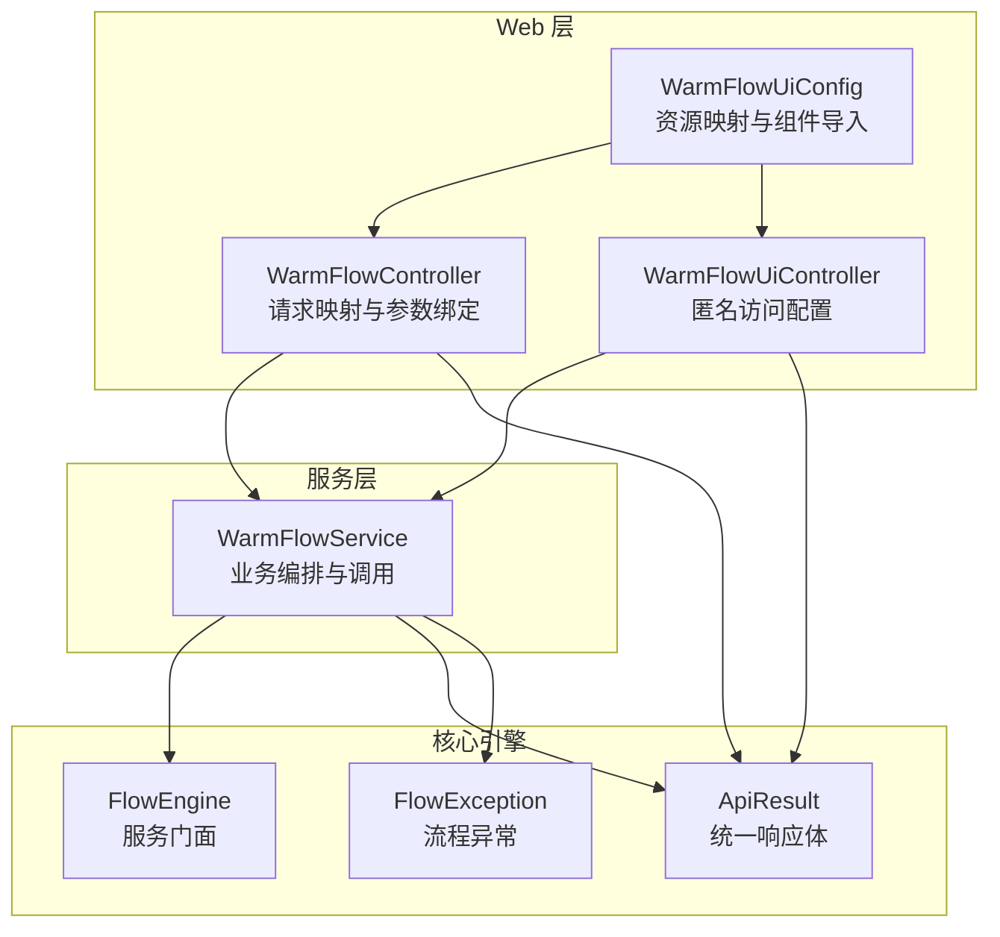
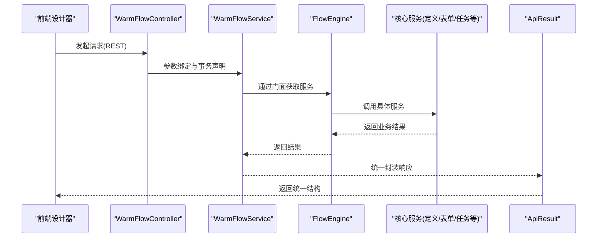
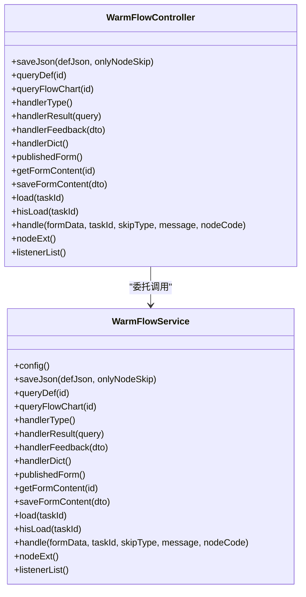
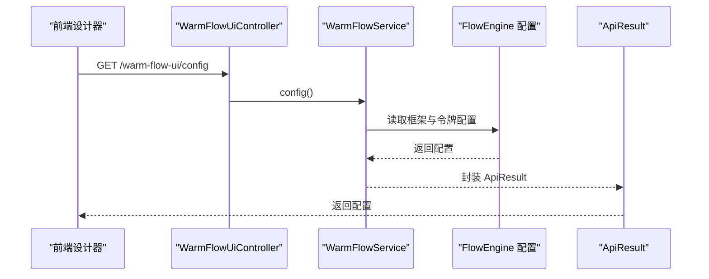
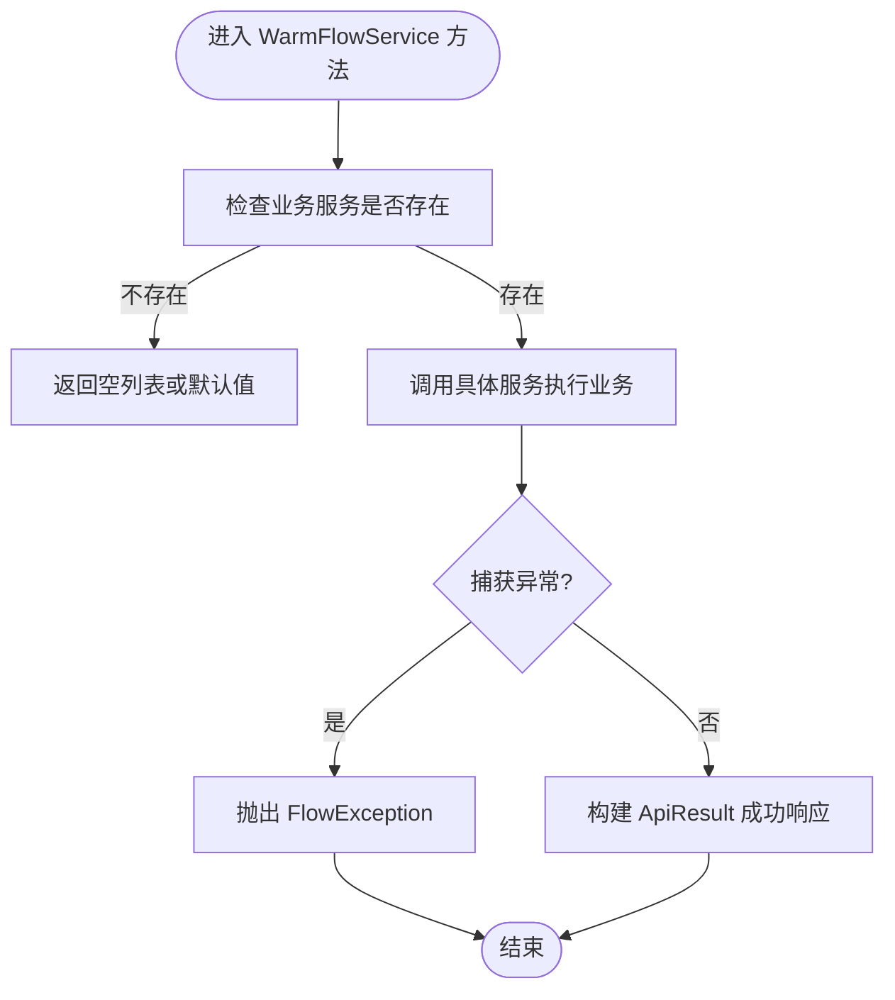
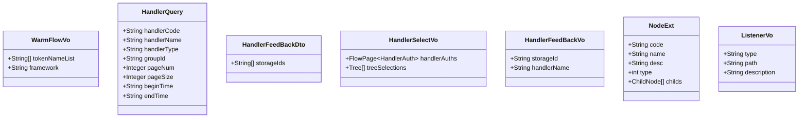
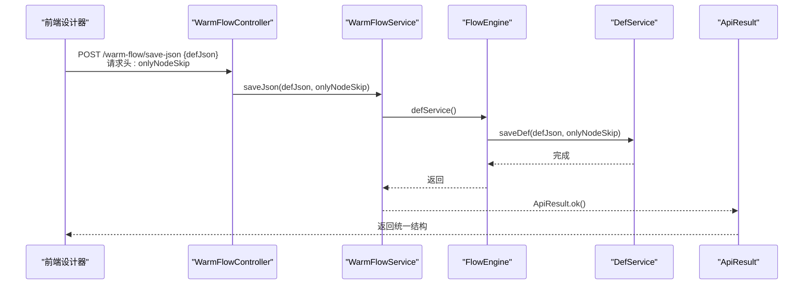
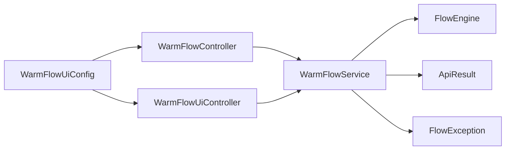

# Web 控制器层

<cite>
**本文引用的文件**
- [WarmFlowController.java](file://warm-flow-plugin/warm-flow-plugin-ui/warm-flow-plugin-ui-sb-web/src/main/java/org/dromara/warm/flow/ui/controller/WarmFlowController.java)
- [WarmFlowUiController.java](file://warm-flow-plugin/warm-flow-plugin-ui/warm-flow-plugin-ui-sb-web/src/main/java/org/dromara/warm/flow/ui/controller/WarmFlowUiController.java)
- [WarmFlowService.java](file://warm-flow-plugin/warm-flow-plugin-ui/warm-flow-plugin-ui-core/src/main/java/org/dromara/warm/flow/ui/service/WarmFlowService.java)
- [WarmFlowVo.java](file://warm-flow-plugin/warm-flow-plugin-ui/warm-flow-plugin-ui-core/src/main/java/org/dromara/warm/flow/ui/vo/WarmFlowVo.java)
- [HandlerQuery.java](file://warm-flow-plugin/warm-flow-plugin-ui/warm-flow-plugin-ui-core/src/main/java/org/dromara/warm/flow/ui/dto/HandlerQuery.java)
- [HandlerFeedBackDto.java](file://warm-flow-plugin/warm-flow-plugin-ui/warm-flow-plugin-ui-core/src/main/java/org/dromara/warm/flow/ui/dto/HandlerFeedBackDto.java)
- [HandlerSelectVo.java](file://warm-flow-plugin/warm-flow-plugin-ui/warm-flow-plugin-ui-core/src/main/java/org/dromara/warm/flow/ui/vo/HandlerSelectVo.java)
- [HandlerFeedBackVo.java](file://warm-flow-plugin/warm-flow-plugin-ui/warm-flow-plugin-ui-core/src/main/java/org/dromara/warm/flow/ui/vo/HandlerFeedBackVo.java)
- [NodeExt.java](file://warm-flow-plugin/warm-flow-plugin-ui/warm-flow-plugin-ui-core/src/main/java/org/dromara/warm/flow/ui/vo/NodeExt.java)
- [ListenerVo.java](file://warm-flow-plugin/warm-flow-plugin-ui/warm-flow-plugin-ui-core/src/main/java/org/dromara/warm/flow/ui/vo/ListenerVo.java)
- [ApiResult.java](file://warm-flow-core/src/main/java/org/dromara/warm/flow/core/dto/ApiResult.java)
- [FlowException.java](file://warm-flow-core/src/main/java/org/dromara/warm/flow/core/exception/FlowException.java)
- [FlowEngine.java](file://warm-flow-core/src/main/java/org/dromara/warm/flow/core/FlowEngine.java)
- [WarmFlowUiConfig.java](file://warm-flow-plugin/warm-flow-plugin-ui/warm-flow-plugin-ui-sb-web/src/main/java/org/dromara/warm/flow/ui/config/WarmFlowUiConfig.java)
</cite>

## 目录
1. [简介](#简介)
2. [项目结构](#项目结构)
3. [核心组件](#核心组件)
4. [架构总览](#架构总览)
5. [组件详解](#组件详解)
6. [依赖关系分析](#依赖关系分析)
7. [性能考量](#性能考量)
8. [故障排查指南](#故障排查指南)
9. [结论](#结论)
10. [附录](#附录)

## 简介
本文件面向 Warm-Flow Web 控制器层，聚焦于 WarmFlowController 与 WarmFlowUiController 的设计架构与实现细节，系统阐述请求映射、参数处理、响应封装、与核心服务层的交互机制、异常处理策略与安全控制要点，并提供扩展开发指南与前端设计器数据交互的最佳实践。

## 项目结构
控制器层位于独立的 UI 插件模块中，采用 Spring Boot Web 注解驱动，通过统一的响应体 ApiResult 封装返回值；服务层通过 FlowEngine 访问核心服务，实现流程定义、表单、任务执行等能力；配置类负责资源映射与组件导入。

图表来源
- [WarmFlowController.java:38-216](file://warm-flow-plugin/warm-flow-plugin-ui/warm-flow-plugin-ui-sb-web/src/main/java/org/dromara/warm/flow/ui/controller/WarmFlowController.java#L38-L216)
- [WarmFlowUiController.java:30-44](file://warm-flow-plugin/warm-flow-plugin-ui/warm-flow-plugin-ui-sb-web/src/main/java/org/dromara/warm/flow/ui/controller/WarmFlowUiController.java#L30-L44)
- [WarmFlowUiConfig.java:31-43](file://warm-flow-plugin/warm-flow-plugin-ui/warm-flow-plugin-ui-sb-web/src/main/java/org/dromara/warm/flow/ui/config/WarmFlowUiConfig.java#L31-L43)
- [WarmFlowService.java:44-375](file://warm-flow-plugin/warm-flow-plugin-ui/warm-flow-plugin-ui-core/src/main/java/org/dromara/warm/flow/ui/service/WarmFlowService.java#L44-L375)
- [ApiResult.java:28-96](file://warm-flow-core/src/main/java/org/dromara/warm/flow/core/dto/ApiResult.java#L28-L96)
- [FlowException.java:25-80](file://warm-flow-core/src/main/java/org/dromara/warm/flow/core/exception/FlowException.java#L25-L80)
- [FlowEngine.java:39-200](file://warm-flow-core/src/main/java/org/dromara/warm/flow/core/FlowEngine.java#L39-L200)

章节来源
- [WarmFlowController.java:38-216](file://warm-flow-plugin/warm-flow-plugin-ui/warm-flow-plugin-ui-sb-web/src/main/java/org/dromara/warm/flow/ui/controller/WarmFlowController.java#L38-L216)
- [WarmFlowUiController.java:30-44](file://warm-flow-plugin/warm-flow-plugin-ui/warm-flow-plugin-ui-sb-web/src/main/java/org/dromara/warm/flow/ui/controller/WarmFlowUiController.java#L30-L44)
- [WarmFlowUiConfig.java:31-43](file://warm-flow-plugin/warm-flow-plugin-ui/warm-flow-plugin-ui-sb-web/src/main/java/org/dromara/warm/flow/ui/config/WarmFlowUiConfig.java#L31-L43)

## 核心组件
- WarmFlowController：提供流程设计器与执行相关接口，覆盖流程定义、表单、任务加载与审批、节点扩展与监听器等。
- WarmFlowUiController：提供匿名访问的设计器配置接口，便于前端设计器初始化。
- WarmFlowService：作为控制器与核心引擎之间的编排层，负责参数组装、调用 FlowEngine 服务、异常转换与统一响应封装。
- ApiResult：统一响应体，包含状态码、消息与数据。
- FlowException：流程异常封装，支持错误码与详情信息。
- FlowEngine：核心服务门面，提供各领域服务（定义、节点、跳转、实例、任务、历史任务、用户、表单、图表）的访问入口。

章节来源
- [WarmFlowController.java:38-216](file://warm-flow-plugin/warm-flow-plugin-ui/warm-flow-plugin-ui-sb-web/src/main/java/org/dromara/warm/flow/ui/controller/WarmFlowController.java#L38-L216)
- [WarmFlowUiController.java:30-44](file://warm-flow-plugin/warm-flow-plugin-ui/warm-flow-plugin-ui-sb-web/src/main/java/org/dromara/warm/flow/ui/controller/WarmFlowUiController.java#L30-L44)
- [WarmFlowService.java:44-375](file://warm-flow-plugin/warm-flow-plugin-ui/warm-flow-plugin-ui-core/src/main/java/org/dromara/warm/flow/ui/service/WarmFlowService.java#L44-L375)
- [ApiResult.java:28-96](file://warm-flow-core/src/main/java/org/dromara/warm/flow/core/dto/ApiResult.java#L28-L96)
- [FlowException.java:25-80](file://warm-flow-core/src/main/java/org/dromara/warm/flow/core/exception/FlowException.java#L25-L80)
- [FlowEngine.java:39-200](file://warm-flow-core/src/main/java/org/dromara/warm/flow/core/FlowEngine.java#L39-L200)

## 架构总览
控制器层通过注解声明请求映射，接收请求参数（路径变量、请求头、请求体、查询参数），交由 WarmFlowService 进行业务编排；WarmFlowService 再通过 FlowEngine 调用核心服务完成持久化或计算；最终以 ApiResult 统一封装返回。

图表来源
- [WarmFlowController.java:51-194](file://warm-flow-plugin/warm-flow-plugin-ui/warm-flow-plugin-ui-sb-web/src/main/java/org/dromara/warm/flow/ui/controller/WarmFlowController.java#L51-L194)
- [WarmFlowService.java:79-333](file://warm-flow-plugin/warm-flow-plugin-ui/warm-flow-plugin-ui-core/src/main/java/org/dromara/warm/flow/ui/service/WarmFlowService.java#L79-L333)
- [ApiResult.java:49-87](file://warm-flow-core/src/main/java/org/dromara/warm/flow/core/dto/ApiResult.java#L49-L87)
- [FlowEngine.java:72-106](file://warm-flow-core/src/main/java/org/dromara/warm/flow/core/FlowEngine.java#L72-L106)

## 组件详解

### WarmFlowController 设计与实现
- 请求映射与路由
  - 保存流程 JSON：POST /warm-flow/save-json，支持请求头 onlyNodeSkip 控制保存范围。
  - 查询流程定义：GET /warm-flow/query-def 与 /warm-flow/query-def/{id}。
  - 查询流程图：GET /warm-flow/query-flow-chart/{id}。
  - 办理人权限：handler-type、handler-result、handler-feedback、handler-dict。
  - 表单管理：published-form、form-content/{id}、form-content。
  - 任务执行：execute/load/{taskId}、execute/hisLoad/{taskId}、execute/handle。
  - 扩展与监听：node-ext、listener-list。
- 参数处理
  - 路径变量：如 {id}、{taskId}。
  - 请求头：如 onlyNodeSkip。
  - 请求体：如 DefJson、FlowDto、Map<String,Object>。
  - 查询参数：如 taskId、skipType、message、nodeCode。
- 响应封装
  - 所有接口均返回 ApiResult<T>，由 WarmFlowService 统一封装。
- 事务控制
  - saveJson、saveFormContent、handle 等关键写操作使用 @Transactional 回滚异常。

图表来源
- [WarmFlowController.java:51-214](file://warm-flow-plugin/warm-flow-plugin-ui/warm-flow-plugin-ui-sb-web/src/main/java/org/dromara/warm/flow/ui/controller/WarmFlowController.java#L51-L214)
- [WarmFlowService.java:52-373](file://warm-flow-plugin/warm-flow-plugin-ui/warm-flow-plugin-ui-core/src/main/java/org/dromara/warm/flow/ui/service/WarmFlowService.java#L52-L373)

章节来源
- [WarmFlowController.java:51-214](file://warm-flow-plugin/warm-flow-plugin-ui/warm-flow-plugin-ui-sb-web/src/main/java/org/dromara/warm/flow/ui/controller/WarmFlowController.java#L51-L214)

### WarmFlowUiController 设计与实现
- 路由：/warm-flow-ui/config，返回设计器配置（框架类型、令牌头名称列表）。
- 安全性：匿名访问，适合前端设计器初始化。
- 数据模型：WarmFlowVo，包含 tokenNameList 与 framework 字段。

图表来源
- [WarmFlowUiController.java:39-42](file://warm-flow-plugin/warm-flow-plugin-ui/warm-flow-plugin-ui-sb-web/src/main/java/org/dromara/warm/flow/ui/controller/WarmFlowUiController.java#L39-L42)
- [WarmFlowService.java:52-67](file://warm-flow-plugin/warm-flow-plugin-ui/warm-flow-plugin-ui-core/src/main/java/org/dromara/warm/flow/ui/service/WarmFlowService.java#L52-L67)
- [WarmFlowVo.java:32-44](file://warm-flow-plugin/warm-flow-plugin-ui/warm-flow-plugin-ui-core/src/main/java/org/dromara/warm/flow/ui/vo/WarmFlowVo.java#L32-L44)

章节来源
- [WarmFlowUiController.java:39-42](file://warm-flow-plugin/warm-flow-plugin-ui/warm-flow-plugin-ui-sb-web/src/main/java/org/dromara/warm/flow/ui/controller/WarmFlowUiController.java#L39-L42)
- [WarmFlowService.java:52-67](file://warm-flow-plugin/warm-flow-plugin-ui/warm-flow-plugin-ui-core/src/main/java/org/dromara/warm/flow/ui/service/WarmFlowService.java#L52-L67)
- [WarmFlowVo.java:32-44](file://warm-flow-plugin/warm-flow-plugin-ui/warm-flow-plugin-ui-core/src/main/java/org/dromara/warm/flow/ui/vo/WarmFlowVo.java#L32-L44)

### WarmFlowService 编排逻辑与核心流程
- 配置读取：从 FlowEngine 获取框架配置，校验并返回 tokenNameList。
- 流程定义：保存 DefJson，支持仅保存节点与跳转；查询设计数据并注入分类树与表单路径树。
- 流程图渲染：根据实例 ID 解析 DefJson，注入图表颜色与顶部文案，支持扩展钩子。
- 办理人权限：按需调用 HandlerSelectService 与 HandlerDictService，支持反馈回显。
- 表单管理：发布表单列表、读取/保存表单内容。
- 任务执行：load/hisLoad 加载表单与数据；handle 组装 FlowParams 并调用 taskService.skip。
- 扩展与监听：nodeExt 与 listenerList 支持业务系统扩展。

图表来源
- [WarmFlowService.java:158-191](file://warm-flow-plugin/warm-flow-plugin-ui/warm-flow-plugin-ui-core/src/main/java/org/dromara/warm/flow/ui/service/WarmFlowService.java#L158-L191)
- [WarmFlowService.java:219-246](file://warm-flow-plugin/warm-flow-plugin-ui/warm-flow-plugin-ui-core/src/main/java/org/dromara/warm/flow/ui/service/WarmFlowService.java#L219-L246)
- [FlowException.java:25-80](file://warm-flow-core/src/main/java/org/dromara/warm/flow/core/exception/FlowException.java#L25-L80)

章节来源
- [WarmFlowService.java:79-333](file://warm-flow-plugin/warm-flow-plugin-ui/warm-flow-plugin-ui-core/src/main/java/org/dromara/warm/flow/ui/service/WarmFlowService.java#L79-L333)
- [FlowEngine.java:72-106](file://warm-flow-core/src/main/java/org/dromara/warm/flow/core/FlowEngine.java#L72-L106)

### 数据模型与参数 DTO/VO
- WarmFlowVo：返回设计器配置，包含 framework 与 tokenNameList。
- HandlerQuery：设计器权限选择查询参数（权限编码、名称、类型、分组、分页、时间范围）。
- HandlerFeedBackDto：入库主键集合，用于回显权限名称。
- HandlerSelectVo：权限选择结果，包含分页列表与树形选择。
- HandlerFeedBackVo：权限名称回显项。
- NodeExt：节点扩展属性，含子节点与字典项。
- ListenerVo：监听器列表项，包含类型、路径与描述。

图表来源
- [WarmFlowVo.java:32-44](file://warm-flow-plugin/warm-flow-plugin-ui/warm-flow-plugin-ui-core/src/main/java/org/dromara/warm/flow/ui/vo/WarmFlowVo.java#L32-L44)
- [HandlerQuery.java:29-71](file://warm-flow-plugin/warm-flow-plugin-ui/warm-flow-plugin-ui-core/src/main/java/org/dromara/warm/flow/ui/dto/HandlerQuery.java#L29-L71)
- [HandlerFeedBackDto.java:32-39](file://warm-flow-plugin/warm-flow-plugin-ui/warm-flow-plugin-ui-core/src/main/java/org/dromara/warm/flow/ui/dto/HandlerFeedBackDto.java#L32-L39)
- [HandlerSelectVo.java:34-46](file://warm-flow-plugin/warm-flow-plugin-ui/warm-flow-plugin-ui-core/src/main/java/org/dromara/warm/flow/ui/vo/HandlerSelectVo.java#L34-L46)
- [HandlerFeedBackVo.java:34-45](file://warm-flow-plugin/warm-flow-plugin-ui/warm-flow-plugin-ui-core/src/main/java/org/dromara/warm/flow/ui/vo/HandlerFeedBackVo.java#L34-L45)
- [NodeExt.java:32-80](file://warm-flow-plugin/warm-flow-plugin-ui/warm-flow-plugin-ui-core/src/main/java/org/dromara/warm/flow/ui/vo/NodeExt.java#L32-L80)
- [ListenerVo.java:34-52](file://warm-flow-plugin/warm-flow-plugin-ui/warm-flow-plugin-ui-core/src/main/java/org/dromara/warm/flow/ui/vo/ListenerVo.java#L34-L52)

章节来源
- [WarmFlowVo.java:32-44](file://warm-flow-plugin/warm-flow-plugin-ui/warm-flow-plugin-ui-core/src/main/java/org/dromara/warm/flow/ui/vo/WarmFlowVo.java#L32-L44)
- [HandlerQuery.java:29-71](file://warm-flow-plugin/warm-flow-plugin-ui/warm-flow-plugin-ui-core/src/main/java/org/dromara/warm/flow/ui/dto/HandlerQuery.java#L29-L71)
- [HandlerFeedBackDto.java:32-39](file://warm-flow-plugin/warm-flow-plugin-ui/warm-flow-plugin-ui-core/src/main/java/org/dromara/warm/flow/ui/dto/HandlerFeedBackDto.java#L32-L39)
- [HandlerSelectVo.java:34-46](file://warm-flow-plugin/warm-flow-plugin-ui/warm-flow-plugin-ui-core/src/main/java/org/dromara/warm/flow/ui/vo/HandlerSelectVo.java#L34-L46)
- [HandlerFeedBackVo.java:34-45](file://warm-flow-plugin/warm-flow-plugin-ui/warm-flow-plugin-ui-core/src/main/java/org/dromara/warm/flow/ui/vo/HandlerFeedBackVo.java#L34-L45)
- [NodeExt.java:32-80](file://warm-flow-plugin/warm-flow-plugin-ui/warm-flow-plugin-ui-core/src/main/java/org/dromara/warm/flow/ui/vo/NodeExt.java#L32-L80)
- [ListenerVo.java:34-52](file://warm-flow-plugin/warm-flow-plugin-ui/warm-flow-plugin-ui-core/src/main/java/org/dromara/warm/flow/ui/vo/ListenerVo.java#L34-L52)

### 请求到响应的关键流程（以“保存流程 JSON”为例）

图表来源
- [WarmFlowController.java:51-55](file://warm-flow-plugin/warm-flow-plugin-ui/warm-flow-plugin-ui-sb-web/src/main/java/org/dromara/warm/flow/ui/controller/WarmFlowController.java#L51-L55)
- [WarmFlowService.java:79-82](file://warm-flow-plugin/warm-flow-plugin-ui/warm-flow-plugin-ui-core/src/main/java/org/dromara/warm/flow/ui/service/WarmFlowService.java#L79-L82)
- [FlowEngine.java:72-74](file://warm-flow-core/src/main/java/org/dromara/warm/flow/core/FlowEngine.java#L72-L74)

章节来源
- [WarmFlowController.java:51-55](file://warm-flow-plugin/warm-flow-plugin-ui/warm-flow-plugin-ui-sb-web/src/main/java/org/dromara/warm/flow/ui/controller/WarmFlowController.java#L51-L55)
- [WarmFlowService.java:79-82](file://warm-flow-plugin/warm-flow-plugin-ui/warm-flow-plugin-ui-core/src/main/java/org/dromara/warm/flow/ui/service/WarmFlowService.java#L79-L82)

## 依赖关系分析
- 控制器依赖服务层：WarmFlowController 与 WarmFlowUiController 均依赖 WarmFlowService。
- 服务层依赖核心引擎：WarmFlowService 通过 FlowEngine 访问各领域服务。
- 统一响应与异常：所有接口返回 ApiResult，异常统一包装为 FlowException。
- 配置与资源：WarmFlowUiConfig 导入控制器并注册静态资源映射。

图表来源
- [WarmFlowController.java:38-216](file://warm-flow-plugin/warm-flow-plugin-ui/warm-flow-plugin-ui-sb-web/src/main/java/org/dromara/warm/flow/ui/controller/WarmFlowController.java#L38-L216)
- [WarmFlowUiController.java:30-44](file://warm-flow-plugin/warm-flow-plugin-ui/warm-flow-plugin-ui-sb-web/src/main/java/org/dromara/warm/flow/ui/controller/WarmFlowUiController.java#L30-L44)
- [WarmFlowService.java:44-375](file://warm-flow-plugin/warm-flow-plugin-ui/warm-flow-plugin-ui-core/src/main/java/org/dromara/warm/flow/ui/service/WarmFlowService.java#L44-L375)
- [ApiResult.java:28-96](file://warm-flow-core/src/main/java/org/dromara/warm/flow/core/dto/ApiResult.java#L28-L96)
- [FlowException.java:25-80](file://warm-flow-core/src/main/java/org/dromara/warm/flow/core/exception/FlowException.java#L25-L80)
- [FlowEngine.java:39-200](file://warm-flow-core/src/main/java/org/dromara/warm/flow/core/FlowEngine.java#L39-L200)
- [WarmFlowUiConfig.java:31-43](file://warm-flow-plugin/warm-flow-plugin-ui/warm-flow-plugin-ui-sb-web/src/main/java/org/dromara/warm/flow/ui/config/WarmFlowUiConfig.java#L31-L43)

章节来源
- [WarmFlowUiConfig.java:31-43](file://warm-flow-plugin/warm-flow-plugin-ui/warm-flow-plugin-ui-sb-web/src/main/java/org/dromara/warm/flow/ui/config/WarmFlowUiConfig.java#L31-L43)

## 性能考量
- 统一响应体 ApiResult：减少重复封装，降低序列化开销。
- 事务边界：对写操作使用 @Transactional，确保一致性与回滚成本可控。
- 服务调用链：通过 FlowEngine 门面访问服务，避免直接耦合具体实现。
- 可选扩展服务：当业务系统未实现 HandlerSelectService/HandlerDictService 等时，返回空或默认值，避免阻塞主流程。

## 故障排查指南
- 统一异常处理
  - 服务层捕获异常并抛出 FlowException，前端通过 ApiResult.code 判断失败。
  - 建议在网关或全局异常拦截器中将 FlowException 映射为标准 HTTP 状态码与 ApiResult 结构。
- 常见问题定位
  - tokenName 未配置：WarmFlowVo 返回失败，需检查 FlowEngine 配置。
  - 办理人权限接口无数据：确认业务系统是否实现 HandlerSelectService/HandlerDictService。
  - 流程图渲染异常：检查 ChartExtService 实现与实例 defJson 解析。
- 日志与可观测性
  - 服务层使用日志记录异常堆栈，便于定位问题根因。

章节来源
- [FlowException.java:25-80](file://warm-flow-core/src/main/java/org/dromara/warm/flow/core/exception/FlowException.java#L25-L80)
- [WarmFlowService.java:116-119](file://warm-flow-plugin/warm-flow-plugin-ui/warm-flow-plugin-ui-core/src/main/java/org/dromara/warm/flow/ui/service/WarmFlowService.java#L116-L119)
- [WarmFlowService.java:147-150](file://warm-flow-plugin/warm-flow-plugin-ui/warm-flow-plugin-ui-core/src/main/java/org/dromara/warm/flow/ui/service/WarmFlowService.java#L147-L150)

## 结论
WarmFlowController 与 WarmFlowUiController 通过清晰的请求映射、参数处理与统一响应封装，实现了与核心引擎的松耦合交互；WarmFlowService 作为编排层，承担了业务逻辑与异常处理职责，保障了扩展性与可维护性。结合 FlowEngine 的门面模式与 ApiResult 的标准化输出，整体架构具备良好的扩展能力与运行稳定性。

## 附录

### 扩展开发指南（新增接口）
- 新增接口步骤
  - 在 WarmFlowController 中添加 @GetMapping/@PostMapping 映射与参数声明。
  - 在 WarmFlowService 中新增静态方法，组装参数、调用 FlowEngine 服务、返回 ApiResult。
  - 如涉及业务系统扩展，确保通过 FrameInvoker 获取对应 Service 并做好空实现兼容。
- 参数校验
  - 使用 @RequestParam/@PathVariable/@RequestHeader/@RequestBody 绑定参数。
  - 对必填字段进行非空校验，必要时在 WarmFlowService 中集中校验并抛出 FlowException。
- 响应格式化
  - 统一使用 ApiResult.ok()/fail() 返回，保持前后端一致的契约。
- 事务与异常
  - 写操作使用 @Transactional；异常统一包装为 FlowException，便于上层处理。

章节来源
- [WarmFlowController.java:51-214](file://warm-flow-plugin/warm-flow-plugin-ui/warm-flow-plugin-ui-sb-web/src/main/java/org/dromara/warm/flow/ui/controller/WarmFlowController.java#L51-L214)
- [WarmFlowService.java:79-333](file://warm-flow-plugin/warm-flow-plugin-ui/warm-flow-plugin-ui-core/src/main/java/org/dromara/warm/flow/ui/service/WarmFlowService.java#L79-L333)
- [ApiResult.java:49-87](file://warm-flow-core/src/main/java/org/dromara/warm/flow/core/dto/ApiResult.java#L49-L87)

### 前端设计器数据交互协议与最佳实践
- 路由与资源
  - /warm-flow-ui/** 资源映射指向 warm-flow-ui 前端包，便于设计器独立部署与访问。
- 配置读取
  - GET /warm-flow-ui/config 返回 WarmFlowVo，包含 framework 与 tokenNameList，前端据此决定鉴权头与框架适配。
- 办理人权限
  - handler-type：获取权限类型列表。
  - handler-result：按 HandlerQuery 查询权限结果。
  - handler-feedback：根据存储主键集合回显名称。
  - handler-dict：获取表达式字典项，支持默认表达式与 spel 表达式。
- 节点扩展与监听
  - node-ext：获取节点扩展属性定义。
  - listener-list：获取监听器列表，供设计器下拉选择。
- 最佳实践
  - 前端在发起请求前校验 tokenNameList，动态设置 Authorization 头。
  - 对 handler-type 为空的场景，前端应降级为默认行为或提示用户配置。
  - 节点扩展与监听器列表为空时，前端应隐藏相关控件或提供引导。

章节来源
- [WarmFlowUiConfig.java:37-42](file://warm-flow-plugin/warm-flow-plugin-ui/warm-flow-plugin-ui-sb-web/src/main/java/org/dromara/warm/flow/ui/config/WarmFlowUiConfig.java#L37-L42)
- [WarmFlowUiController.java:39-42](file://warm-flow-plugin/warm-flow-plugin-ui/warm-flow-plugin-ui-sb-web/src/main/java/org/dromara/warm/flow/ui/controller/WarmFlowUiController.java#L39-L42)
- [WarmFlowService.java:158-191](file://warm-flow-plugin/warm-flow-plugin-ui/warm-flow-plugin-ui-core/src/main/java/org/dromara/warm/flow/ui/service/WarmFlowService.java#L158-L191)
- [WarmFlowService.java:219-246](file://warm-flow-plugin/warm-flow-plugin-ui/warm-flow-plugin-ui-core/src/main/java/org/dromara/warm/flow/ui/service/WarmFlowService.java#L219-L246)
- [WarmFlowService.java:340-373](file://warm-flow-plugin/warm-flow-plugin-ui/warm-flow-plugin-ui-core/src/main/java/org/dromara/warm/flow/ui/service/WarmFlowService.java#L340-L373)