# 核心服务组件

<cite>
**本文引用的文件**
- [WarmFlowService.java](file://warm-flow-plugin/warm-flow-plugin-ui/warm-flow-plugin-ui-core/src/main/java/org/dromara/warm/flow/ui/service/WarmFlowService.java)
- [CategoryService.java](file://warm-flow-plugin/warm-flow-plugin-ui/warm-flow-plugin-ui-core/src/main/java/org/dromara/warm/flow/ui/service/CategoryService.java)
- [HandlerDictService.java](file://warm-flow-plugin/warm-flow-plugin-ui/warm-flow-plugin-ui-core/src/main/java/org/dromara/warm/flow/ui/service/HandlerDictService.java)
- [NodeExtService.java](file://warm-flow-plugin/warm-flow-plugin-ui/warm-flow-plugin-ui-core/src/main/java/org/dromara/warm/flow/ui/service/NodeExtService.java)
- [ListenerListService.java](file://warm-flow-plugin/warm-flow-plugin-ui/warm-flow-plugin-ui-core/src/main/java/org/dromara/warm/flow/ui/service/ListenerListService.java)
- [FlowEngine.java](file://warm-flow-core/src/main/java/org/dromara/warm/flow/core/FlowEngine.java)
- [FrameInvoker.java](file://warm-flow-core/src/main/java/org/dromara/warm/flow/core/invoker/FrameInvoker.java)
- [ApiResult.java](file://warm-flow-core/src/main/java/org/dromara/warm/flow/core/dto/ApiResult.java)
- [DefJson.java](file://warm-flow-core/src/main/java/org/dromara/warm/flow/core/dto/DefJson.java)
- [FlowDto.java](file://warm-flow-core/src/main/java/org/dromara/warm/flow/core/dto/FlowDto.java)
- [FlowParams.java](file://warm-flow-core/src/main/java/org/dromara/warm/flow/core/dto/FlowParams.java)
- [WarmFlowVo.java](file://warm-flow-plugin/warm-flow-plugin-ui/warm-flow-plugin-ui-core/src/main/java/org/dromara/warm/flow/ui/vo/WarmFlowVo.java)
- [Dict.java](file://warm-flow-plugin/warm-flow-plugin-ui/warm-flow-plugin-ui-core/src/main/java/org/dromara/warm/flow/ui/vo/Dict.java)
- [NodeExt.java](file://warm-flow-plugin/warm-flow-plugin-ui/warm-flow-plugin-ui-core/src/main/java/org/dromara/warm/flow/ui/vo/NodeExt.java)
- [ListenerVo.java](file://warm-flow-plugin/warm-flow-plugin-ui/warm-flow-plugin-ui-core/src/main/java/org/dromara/warm/flow/ui/vo/ListenerVo.java)
- [Tree.java](file://warm-flow-core/src/main/java/org/dromara/warm/flow/core/dto/Tree.java)
- [Form.java](file://warm-flow-core/src/main/java/org/dromara/warm/flow/core/entity/Form.java)
- [Instance.java](file://warm-flow-core/src/main/java/org/dromara/warm/flow/core/entity/Instance.java)
- [ChartService.java](file://warm-flow-core/src/main/java/org/dromara/warm/flow/core/service/ChartService.java)
- [DefService.java](file://warm-flow-core/src/main/java/org/dromara/warm/flow/core/service/DefService.java)
- [InsService.java](file://warm-flow-core/src/main/java/org/dromara/warm/flow/core/service/InsService.java)
- [FormService.java](file://warm-flow-core/src/main/java/org/dromara/warm/flow/core/service/FormService.java)
- [TaskService.java](file://warm-flow-core/src/main/java/org/dromara/warm/flow/core/service/TaskService.java)
- [FormPathService.java](file://warm-flow-plugin/warm-flow-plugin-ui/warm-flow-plugin-ui-core/src/main/java/org/dromara/warm/flow/ui/service/FormPathService.java)
- [ChartExtService.java](file://warm-flow-plugin/warm-flow-plugin-ui/warm-flow-plugin-ui-core/src/main/java/org/dromara/warm/flow/ui/service/ChartExtService.java)
- [HandlerSelectService.java](file://warm-flow-plugin/warm-flow-plugin-ui/warm-flow-plugin-ui-core/src/main/java/org/dromara/warm/flow/ui/service/HandlerSelectService.java)
- [TreeUtil.java](file://warm-flow-plugin/warm-flow-plugin-ui/warm-flow-plugin-ui-core/src/main/java/org/dromara/warm/flow/ui/utils/TreeUtil.java)
- [WarmFlow.java](file://warm-flow-core/src/main/java/org/dromara/warm/flow/core/config/WarmFlow.java)
- [FlowException.java](file://warm-flow-core/src/main/java/org/dromara/warm/flow/core/exception/FlowException.java)
- [ExceptionUtil.java](file://warm-flow-core/src/main/java/org/dromara/warm/flow/core/utils/ExceptionUtil.java)
- [StringUtils.java](file://warm-flow-core/src/main/java/org/dromara/warm/flow/core/utils/StringUtils.java)
</cite>

## 目录
1. [简介](#简介)
2. [项目结构](#项目结构)
3. [核心组件](#核心组件)
4. [架构总览](#架构总览)
5. [详细组件分析](#详细组件分析)
6. [依赖分析](#依赖分析)
7. [性能考虑](#性能考虑)
8. [故障排查指南](#故障排查指南)
9. [结论](#结论)
10. [附录：扩展开发指南](#附录扩展开发指南)

## 简介
本文件聚焦 Warm-Flow 的核心服务组件，围绕 WarmFlowService 主服务入口展开，系统性解析其在流程配置、流程定义管理、流程图获取、表单管理等方面的能力；同时深入剖析 CategoryService、HandlerDictService、NodeExtService、ListenerListService 等辅助服务的设计原则与接口规范，并阐明服务间协作关系、依赖注入机制、异常处理策略等关键技术点。最后提供服务扩展开发指南，帮助开发者正确实现接口、进行参数校验与返回值处理。

## 项目结构
Warm-Flow 采用多模块分层设计：
- warm-flow-core：核心引擎与通用能力（FlowEngine、DTO、实体、服务接口与实现骨架）
- warm-flow-plugin-ui：UI 插件与服务（WarmFlowService、各类 UI 扩展服务接口）
- warm-flow-orm：ORM 实现（MyBatis/MyBatis-Plus/EasyQuery 多种适配）
- warm-flow-plugin：插件生态（JSON 序列化、表达式模式、UI 前端）

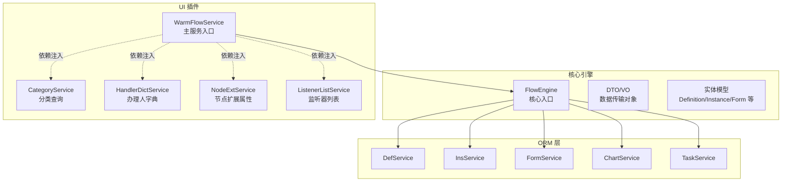

图表来源
- [WarmFlowService.java:45-375](file://warm-flow-plugin/warm-flow-plugin-ui/warm-flow-plugin-ui-core/src/main/java/org/dromara/warm/flow/ui/service/WarmFlowService.java#L45-L375)
- [FlowEngine.java](file://warm-flow-core/src/main/java/org/dromara/warm/flow/core/FlowEngine.java)
- [CategoryService.java:28-36](file://warm-flow-plugin/warm-flow-plugin-ui/warm-flow-plugin-ui-core/src/main/java/org/dromara/warm/flow/ui/service/CategoryService.java#L28-L36)
- [HandlerDictService.java:27-35](file://warm-flow-plugin/warm-flow-plugin-ui/warm-flow-plugin-ui-core/src/main/java/org/dromara/warm/flow/ui/service/HandlerDictService.java#L27-L35)
- [NodeExtService.java:27-35](file://warm-flow-plugin/warm-flow-plugin-ui/warm-flow-plugin-ui-core/src/main/java/org/dromara/warm/flow/ui/service/NodeExtService.java#L27-L35)
- [ListenerListService.java:27-35](file://warm-flow-plugin/warm-flow-plugin-ui/warm-flow-plugin-ui-core/src/main/java/org/dromara/warm/flow/ui/service/ListenerListService.java#L27-L35)

章节来源
- [WarmFlowService.java:45-375](file://warm-flow-plugin/warm-flow-plugin-ui/warm-flow-plugin-ui-core/src/main/java/org/dromara/warm/flow/ui/service/WarmFlowService.java#L45-L375)
- [FlowEngine.java](file://warm-flow-core/src/main/java/org/dromara/warm/flow/core/FlowEngine.java)

## 核心组件
- WarmFlowService：UI 插件主服务入口，统一对外提供流程配置、流程定义、流程图、表单、任务处理、节点扩展、监听器等能力；通过 FlowEngine 获取各领域服务并结合 FrameInvoker 进行可选扩展接口的依赖注入调用。
- CategoryService：提供分类树形数据查询能力，用于流程定义时的分类选择。
- HandlerDictService：提供“办理人选择项”字典，支持默认表达式与业务系统自定义选项。
- NodeExtService：提供节点扩展属性列表，供设计器扩展节点元信息。
- ListenerListService：提供监听器列表，供设计器绑定流程事件监听。

章节来源
- [WarmFlowService.java:45-375](file://warm-flow-plugin/warm-flow-plugin-ui/warm-flow-plugin-ui-core/src/main/java/org/dromara/warm/flow/ui/service/WarmFlowService.java#L45-L375)
- [CategoryService.java:28-36](file://warm-flow-plugin/warm-flow-plugin-ui/warm-flow-plugin-ui-core/src/main/java/org/dromara/warm/flow/ui/service/CategoryService.java#L28-L36)
- [HandlerDictService.java:27-35](file://warm-flow-plugin/warm-flow-plugin-ui/warm-flow-plugin-ui-core/src/main/java/org/dromara/warm/flow/ui/service/HandlerDictService.java#L27-L35)
- [NodeExtService.java:27-35](file://warm-flow-plugin/warm-flow-plugin-ui/warm-flow-plugin-ui-core/src/main/java/org/dromara/warm/flow/ui/service/NodeExtService.java#L27-L35)
- [ListenerListService.java:27-35](file://warm-flow-plugin/warm-flow-plugin-ui/warm-flow-plugin-ui-core/src/main/java/org/dromara/warm/flow/ui/service/ListenerListService.java#L27-L35)

## 架构总览
WarmFlowService 作为 UI 插件的服务门面，内部通过 FlowEngine 统一调度核心服务（DefService、InsService、FormService、ChartService、TaskService），并通过 FrameInvoker 按需获取业务系统实现的扩展服务（如 CategoryService、HandlerDictService、NodeExtService、ListenerListService）。整体呈现“门面 + 依赖注入 + 异常封装”的清晰架构。

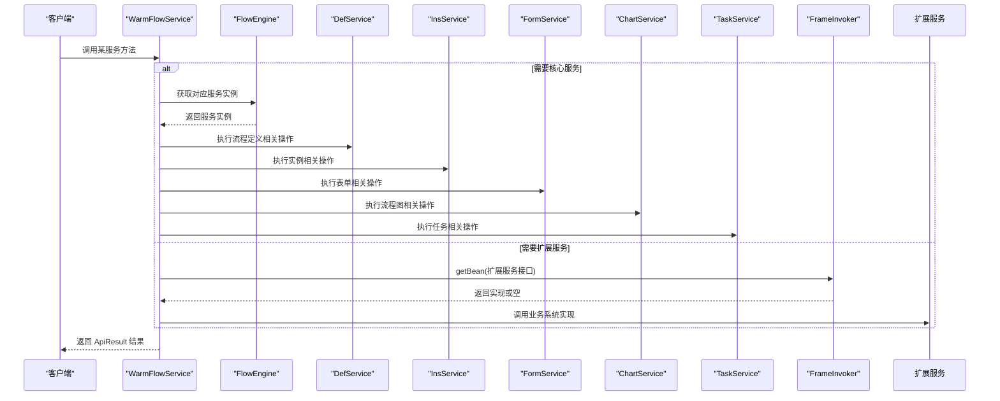

图表来源
- [WarmFlowService.java:45-375](file://warm-flow-plugin/warm-flow-plugin-ui/warm-flow-plugin-ui-core/src/main/java/org/dromara/warm/flow/ui/service/WarmFlowService.java#L45-L375)
- [FrameInvoker.java](file://warm-flow-core/src/main/java/org/dromara/warm/flow/core/invoker/FrameInvoker.java)
- [FlowEngine.java](file://warm-flow-core/src/main/java/org/dromara/warm/flow/core/FlowEngine.java)

## 详细组件分析

### WarmFlowService：主服务入口
- 职责边界
  - 流程配置：读取框架类型、令牌名等全局配置。
  - 流程定义：保存/查询流程 JSON（含节点与跳转）、补充分类与表单路径树。
  - 流程图：根据实例还原 DefJson 并执行扩展 ChartExtService 初始化与执行。
  - 表单：查询已发布表单、读取表单内容、保存表单内容。
  - 任务：加载待办/已办表单数据、通用审批提交。
  - 扩展：按需调用 CategoryService、HandlerDictService、NodeExtService、ListenerListService。
- 关键流程
  - config：从 FlowEngine 获取 WarmFlow 配置，组装 WarmFlowVo 返回。
  - queryDef：根据 id 返回 DefJson；若为空则初始化默认模型与表单定制标记；随后注入 CategoryService 与 FormPathService 补充树形数据。
  - queryFlowChart：根据实例 id 获取 DefJson，设置图表状态色与顶部文字开关，调用 ChartExtService 执行扩展逻辑。
  - handlerType/handlerResult/handlerFeedback：通过 HandlerSelectService 提供的“办理人选择项”能力，支持默认表达式与业务系统实现。
  - handlerDict：提供“办理人选择项”字典，默认返回表达式示例，否则使用业务系统实现。
  - publishedForm/getFormContent/saveFormContent/load/hisLoad/handle：统一通过 FlowEngine 获取 FormService、TaskService、DefService 等执行相应业务。
  - nodeExt/listenerList：分别调用 NodeExtService、ListenerListService 获取扩展信息。
- 依赖注入与容错
  - 使用 FrameInvoker.getBean 获取扩展服务，若为空则返回空结果或默认值，避免强依赖导致失败。
  - 全部方法均被 try-catch 包裹，异常统一转换为 FlowException 并通过 ApiResult.fail 抛出。
- 返回值规范
  - 统一使用 ApiResult<T> 封装，成功返回 ApiResult.ok(T)，失败返回 ApiResult.fail(msg)。

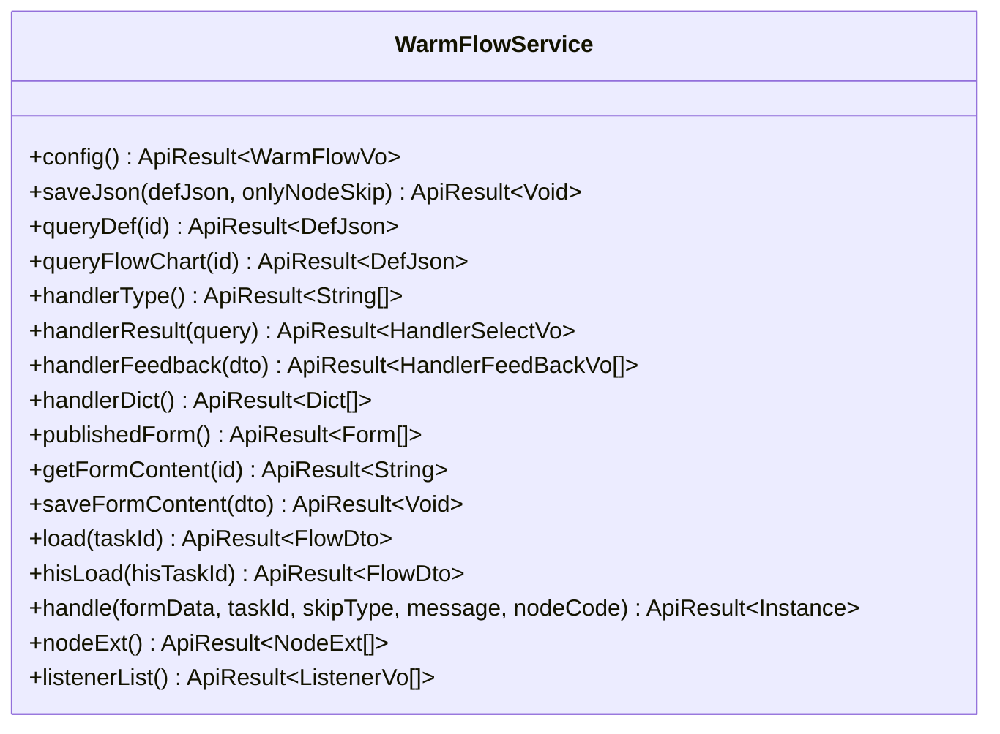

图表来源
- [WarmFlowService.java:45-375](file://warm-flow-plugin/warm-flow-plugin-ui/warm-flow-plugin-ui-core/src/main/java/org/dromara/warm/flow/ui/service/WarmFlowService.java#L45-L375)

章节来源
- [WarmFlowService.java:45-375](file://warm-flow-plugin/warm-flow-plugin-ui/warm-flow-plugin-ui-core/src/main/java/org/dromara/warm/flow/ui/service/WarmFlowService.java#L45-L375)
- [ApiResult.java](file://warm-flow-core/src/main/java/org/dromara/warm/flow/core/dto/ApiResult.java)
- [FlowEngine.java](file://warm-flow-core/src/main/java/org/dromara/warm/flow/core/FlowEngine.java)
- [FrameInvoker.java](file://warm-flow-core/src/main/java/org/dromara/warm/flow/core/invoker/FrameInvoker.java)
- [FlowException.java](file://warm-flow-core/src/main/java/org/dromara/warm/flow/core/exception/FlowException.java)

### CategoryService：分类查询
- 接口职责：提供树形分类列表，供流程定义时选择分类。
- 输入输出：无输入参数；返回树形结构列表。
- 扩展方式：业务系统实现该接口后，WarmFlowService 在需要时通过依赖注入获取并调用。

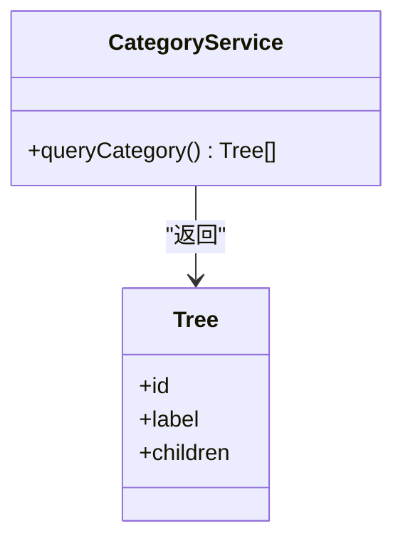

图表来源
- [CategoryService.java:28-36](file://warm-flow-plugin/warm-flow-plugin-ui/warm-flow-plugin-ui-core/src/main/java/org/dromara/warm/flow/ui/service/CategoryService.java#L28-L36)
- [Tree.java](file://warm-flow-core/src/main/java/org/dromara/warm/flow/core/dto/Tree.java)

章节来源
- [CategoryService.java:28-36](file://warm-flow-plugin/warm-flow-plugin-ui/warm-flow-plugin-ui-core/src/main/java/org/dromara/warm/flow/ui/service/CategoryService.java#L28-L36)
- [Tree.java](file://warm-flow-core/src/main/java/org/dromara/warm/flow/core/dto/Tree.java)

### HandlerDictService：办理人字典
- 接口职责：提供“办理人选择项”字典，支持默认表达式与业务系统自定义。
- 默认行为：当业务系统未实现时，返回默认表达式示例。
- 扩展方式：业务系统实现后由 WarmFlowService 注入并调用。

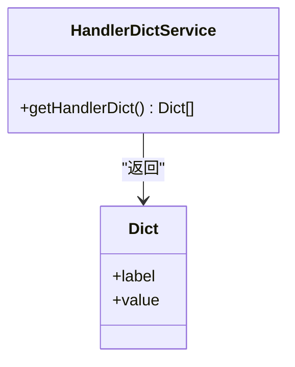

图表来源
- [HandlerDictService.java:27-35](file://warm-flow-plugin/warm-flow-plugin-ui/warm-flow-plugin-ui-core/src/main/java/org/dromara/warm/flow/ui/service/HandlerDictService.java#L27-L35)
- [Dict.java](file://warm-flow-plugin/warm-flow-plugin-ui/warm-flow-plugin-ui-core/src/main/java/org/dromara/warm/flow/ui/vo/Dict.java)

章节来源
- [HandlerDictService.java:27-35](file://warm-flow-plugin/warm-flow-plugin-ui/warm-flow-plugin-ui-core/src/main/java/org/dromara/warm/flow/ui/service/HandlerDictService.java#L27-L35)
- [Dict.java](file://warm-flow-plugin/warm-flow-plugin-ui/warm-flow-plugin-ui-core/src/main/java/org/dromara/warm/flow/ui/vo/Dict.java)

### NodeExtService：节点扩展属性
- 接口职责：提供节点扩展属性列表，供设计器扩展节点元信息。
- 容错策略：未实现时返回空列表，避免阻断流程。

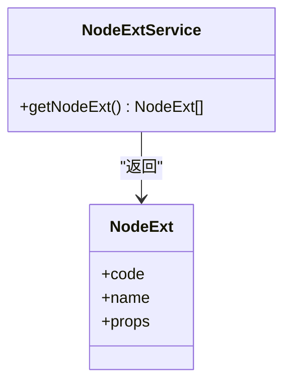

图表来源
- [NodeExtService.java:27-35](file://warm-flow-plugin/warm-flow-plugin-ui/warm-flow-plugin-ui-core/src/main/java/org/dromara/warm/flow/ui/service/NodeExtService.java#L27-L35)
- [NodeExt.java](file://warm-flow-plugin/warm-flow-plugin-ui/warm-flow-plugin-ui-core/src/main/java/org/dromara/warm/flow/ui/vo/NodeExt.java)

章节来源
- [NodeExtService.java:27-35](file://warm-flow-plugin/warm-flow-plugin-ui/warm-flow-plugin-ui-core/src/main/java/org/dromara/warm/flow/ui/service/NodeExtService.java#L27-L35)
- [NodeExt.java](file://warm-flow-plugin/warm-flow-plugin-ui/warm-flow-plugin-ui-core/src/main/java/org/dromara/warm/flow/ui/vo/NodeExt.java)

### ListenerListService：监听器列表
- 接口职责：提供监听器列表，供设计器绑定流程事件监听。
- 容错策略：未实现时返回空列表。

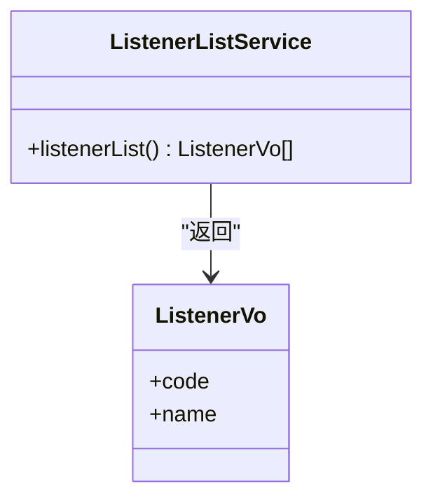

图表来源
- [ListenerListService.java:27-35](file://warm-flow-plugin/warm-flow-plugin-ui/warm-flow-plugin-ui-core/src/main/java/org/dromara/warm/flow/ui/service/ListenerListService.java#L27-L35)
- [ListenerVo.java](file://warm-flow-plugin/warm-flow-plugin-ui/warm-flow-plugin-ui-core/src/main/java/org/dromara/warm/flow/ui/vo/ListenerVo.java)

章节来源
- [ListenerListService.java:27-35](file://warm-flow-plugin/warm-flow-plugin-ui/warm-flow-plugin-ui-core/src/main/java/org/dromara/warm/flow/ui/service/ListenerListService.java#L27-L35)
- [ListenerVo.java](file://warm-flow-plugin/warm-flow-plugin-ui/warm-flow-plugin-ui-core/src/main/java/org/dromara/warm/flow/ui/vo/ListenerVo.java)

### WarmFlowService 关键流程时序

#### 流程图获取（queryFlowChart）
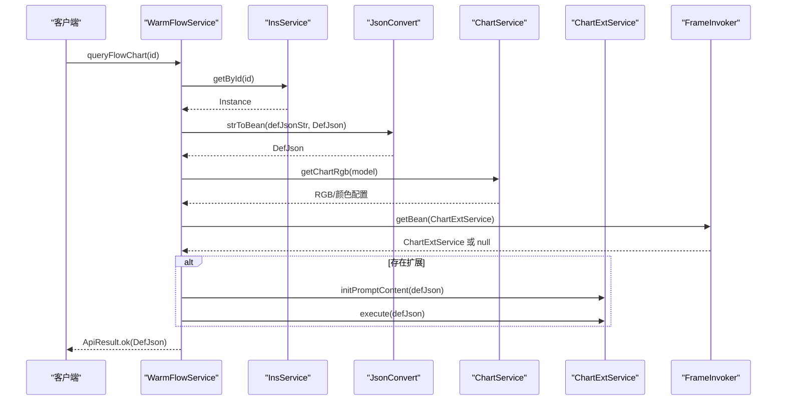

图表来源
- [WarmFlowService.java:128-151](file://warm-flow-plugin/warm-flow-plugin-ui/warm-flow-plugin-ui-core/src/main/java/org/dromara/warm/flow/ui/service/WarmFlowService.java#L128-L151)
- [InsService.java](file://warm-flow-core/src/main/java/org/dromara/warm/flow/core/service/InsService.java)
- [ChartService.java](file://warm-flow-core/src/main/java/org/dromara/warm/flow/core/service/ChartService.java)
- [ChartExtService.java](file://warm-flow-plugin/warm-flow-plugin-ui/warm-flow-plugin-ui-core/src/main/java/org/dromara/warm/flow/ui/service/ChartExtService.java)
- [FrameInvoker.java](file://warm-flow-core/src/main/java/org/dromara/warm/flow/core/invoker/FrameInvoker.java)

#### 办理人权限设置（handlerResult）
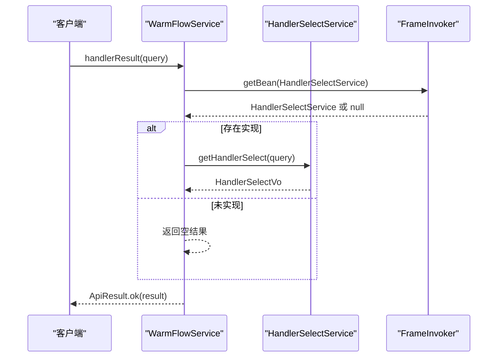

图表来源
- [WarmFlowService.java:178-191](file://warm-flow-plugin/warm-flow-plugin-ui/warm-flow-plugin-ui-core/src/main/java/org/dromara/warm/flow/ui/service/WarmFlowService.java#L178-L191)
- [FrameInvoker.java](file://warm-flow-core/src/main/java/org/dromara/warm/flow/core/invoker/FrameInvoker.java)

#### 表单内容读取（getFormContent）
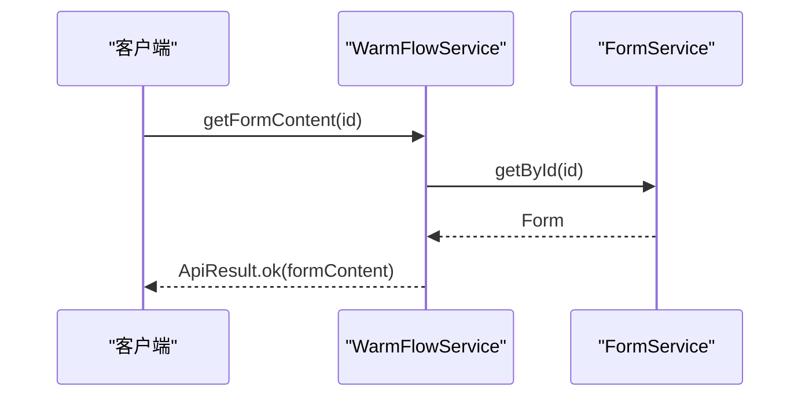

图表来源
- [WarmFlowService.java:266-273](file://warm-flow-plugin/warm-flow-plugin-ui/warm-flow-plugin-ui-core/src/main/java/org/dromara/warm/flow/ui/service/WarmFlowService.java#L266-L273)
- [FormService.java](file://warm-flow-core/src/main/java/org/dromara/warm/flow/core/service/FormService.java)

## 依赖分析
- 内聚性与耦合度
  - WarmFlowService 对核心服务（Def/Ins/Form/Chart/Task）具有高内聚调用；对扩展服务采用低耦合的按需注入。
  - 扩展服务接口均为纯接口，便于业务系统替换实现。
- 直接与间接依赖
  - 直接依赖：FlowEngine、FrameInvoker、ApiResult、各领域服务接口。
  - 间接依赖：通过扩展服务接口引入业务系统实现，形成“可插拔”扩展机制。
- 循环依赖
  - 未见循环依赖迹象；WarmFlowService 仅向下依赖核心与扩展接口，不反向依赖业务实现。
- 外部集成点
  - 通过 FrameInvoker 从运行时容器获取扩展服务 Bean，具备良好的框架无关性。

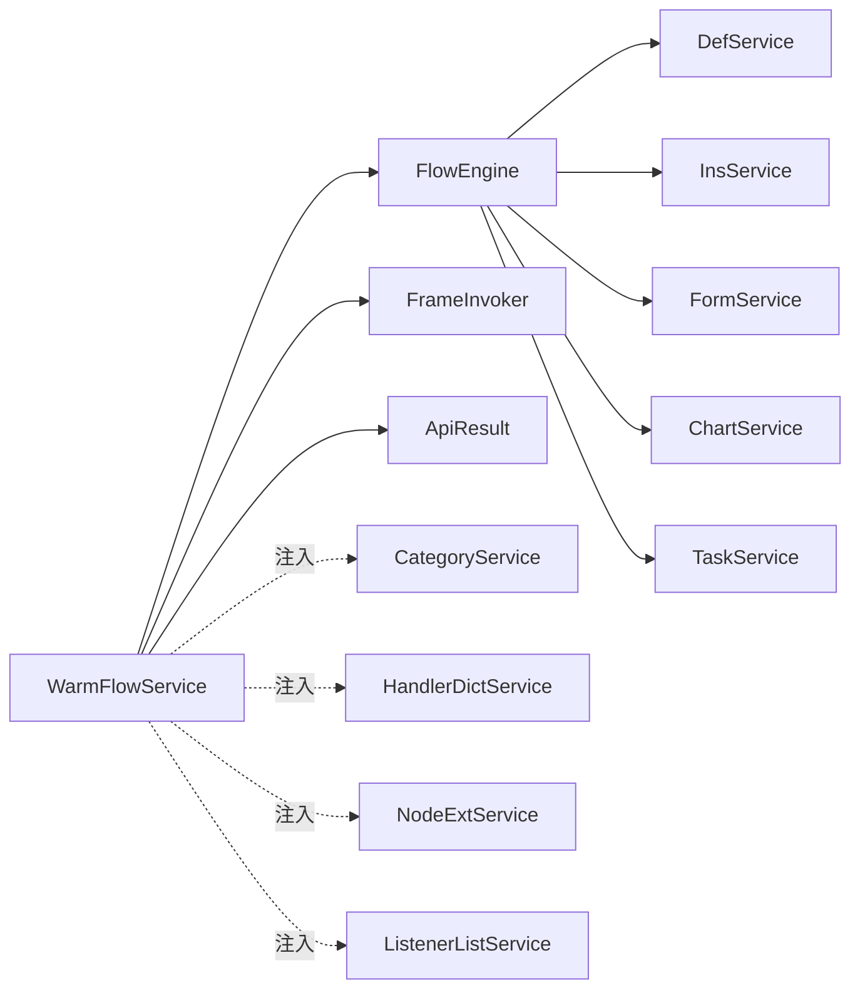

图表来源
- [WarmFlowService.java:45-375](file://warm-flow-plugin/warm-flow-plugin-ui/warm-flow-plugin-ui-core/src/main/java/org/dromara/warm/flow/ui/service/WarmFlowService.java#L45-L375)
- [FrameInvoker.java](file://warm-flow-core/src/main/java/org/dromara/warm/flow/core/invoker/FrameInvoker.java)
- [FlowEngine.java](file://warm-flow-core/src/main/java/org/dromara/warm/flow/core/FlowEngine.java)

章节来源
- [WarmFlowService.java:45-375](file://warm-flow-plugin/warm-flow-plugin-ui/warm-flow-plugin-ui-core/src/main/java/org/dromara/warm/flow/ui/service/WarmFlowService.java#L45-L375)
- [FrameInvoker.java](file://warm-flow-core/src/main/java/org/dromara/warm/flow/core/invoker/FrameInvoker.java)
- [FlowEngine.java](file://warm-flow-core/src/main/java/org/dromara/warm/flow/core/FlowEngine.java)

## 性能考虑
- 依赖注入按需获取：通过 FrameInvoker 按需获取扩展服务，避免不必要的初始化开销。
- 结果封装与异常隔离：统一使用 ApiResult 封装，减少重复判断与异常传播成本。
- 数据转换与序列化：流程图与流程定义使用统一的 JSON 转换工具，建议在业务侧复用缓存策略以降低重复解析成本。
- 任务加载与表单读取：尽量批量处理与缓存热点数据，避免频繁 IO。

## 故障排查指南
- 常见问题
  - 未配置 tokenName：config 方法会返回失败提示，请检查 WarmFlow 配置。
  - 未实现扩展服务：handlerType/handlerResult/handlerFeedback/handlerDict/nodeExt/listenerList 在未实现时返回空或默认值，属预期行为。
  - 查询流程图失败：检查实例是否存在、DefJson 是否完整、ChartExtService 是否正确初始化。
- 排查步骤
  - 查看 WarmFlowService 中的异常日志与 FlowException 包装消息。
  - 确认 FrameInvoker 能否正确获取到扩展服务 Bean。
  - 核对 FlowEngine 获取的核心服务是否可用。
- 相关源码定位
  - 异常封装与日志：[WarmFlowService.java:116-119](file://warm-flow-plugin/warm-flow-plugin-ui/warm-flow-plugin-ui-core/src/main/java/org/dromara/warm/flow/ui/service/WarmFlowService.java#L116-L119)
  - FlowException 定义：[FlowException.java](file://warm-flow-core/src/main/java/org/dromara/warm/flow/core/exception/FlowException.java)
  - 异常工具：[ExceptionUtil.java](file://warm-flow-core/src/main/java/org/dromara/warm/flow/core/utils/ExceptionUtil.java)

章节来源
- [WarmFlowService.java:116-119](file://warm-flow-plugin/warm-flow-plugin-ui/warm-flow-plugin-ui-core/src/main/java/org/dromara/warm/flow/ui/service/WarmFlowService.java#L116-L119)
- [FlowException.java](file://warm-flow-core/src/main/java/org/dromara/warm/flow/core/exception/FlowException.java)
- [ExceptionUtil.java](file://warm-flow-core/src/main/java/org/dromara/warm/flow/core/utils/ExceptionUtil.java)

## 结论
WarmFlowService 以清晰的门面设计串联核心引擎与 UI 扩展，既保证了通用流程能力的稳定，又通过依赖注入实现了高度可插拔的扩展机制。CategoryService、HandlerDictService、NodeExtService、ListenerListService 四大接口覆盖了设计器的关键扩展点，配合 FlowEngine 的统一调度与 ApiResult 的标准化返回，形成了高内聚、低耦合、易扩展的体系化架构。

## 附录：扩展开发指南
- 接口实现
  - CategoryService：实现 queryCategory 返回树形分类列表。
  - HandlerDictService：实现 getHandlerDict 返回“办理人选择项”字典。
  - NodeExtService：实现 getNodeExt 返回节点扩展属性列表。
  - ListenerListService：实现 listenerList 返回监听器列表。
- 参数校验
  - 对外暴露的方法应进行必要参数校验（如 id 非空、skipType 合法等），并在失败时返回 ApiResult.fail。
- 返回值处理
  - 统一使用 ApiResult.ok(...) 或 ApiResult.fail(...) 包装，保持与 WarmFlowService 的一致风格。
- 依赖注入
  - 通过 FrameInvoker.getBean(接口类型) 获取实现；若返回 null，按默认策略处理（如返回空列表或默认表达式）。
- 异常处理
  - 捕获并记录异常，使用 ExceptionUtil.handleMsg 包装错误信息，抛出 FlowException，确保前端可读性与一致性。

章节来源
- [WarmFlowService.java:158-171](file://warm-flow-plugin/warm-flow-plugin-ui/warm-flow-plugin-ui-core/src/main/java/org/dromara/warm/flow/ui/service/WarmFlowService.java#L158-L171)
- [WarmFlowService.java:178-191](file://warm-flow-plugin/warm-flow-plugin-ui/warm-flow-plugin-ui-core/src/main/java/org/dromara/warm/flow/ui/service/WarmFlowService.java#L178-L191)
- [WarmFlowService.java:220-246](file://warm-flow-plugin/warm-flow-plugin-ui/warm-flow-plugin-ui-core/src/main/java/org/dromara/warm/flow/ui/service/WarmFlowService.java#L220-L246)
- [WarmFlowService.java:340-353](file://warm-flow-plugin/warm-flow-plugin-ui/warm-flow-plugin-ui-core/src/main/java/org/dromara/warm/flow/ui/service/WarmFlowService.java#L340-L353)
- [WarmFlowService.java:360-373](file://warm-flow-plugin/warm-flow-plugin-ui/warm-flow-plugin-ui-core/src/main/java/org/dromara/warm/flow/ui/service/WarmFlowService.java#L360-L373)
- [FrameInvoker.java](file://warm-flow-core/src/main/java/org/dromara/warm/flow/core/invoker/FrameInvoker.java)
- [ApiResult.java](file://warm-flow-core/src/main/java/org/dromara/warm/flow/core/dto/ApiResult.java)
- [ExceptionUtil.java](file://warm-flow-core/src/main/java/org/dromara/warm/flow/core/utils/ExceptionUtil.java)
- [FlowException.java](file://warm-flow-core/src/main/java/org/dromara/warm/flow/core/exception/FlowException.java)