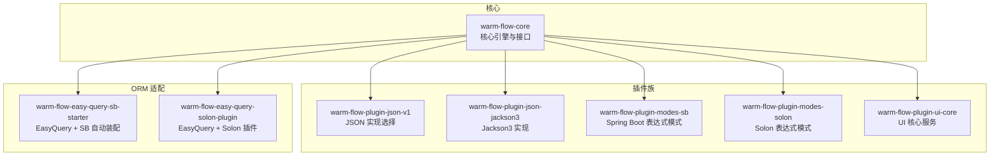
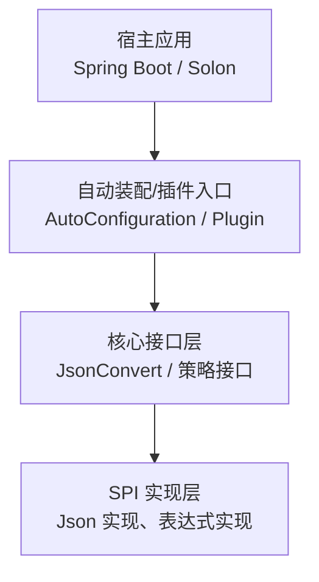
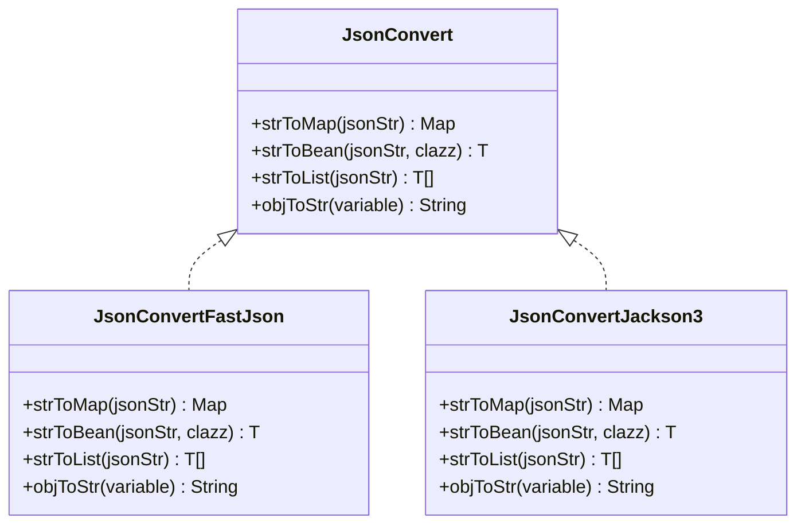
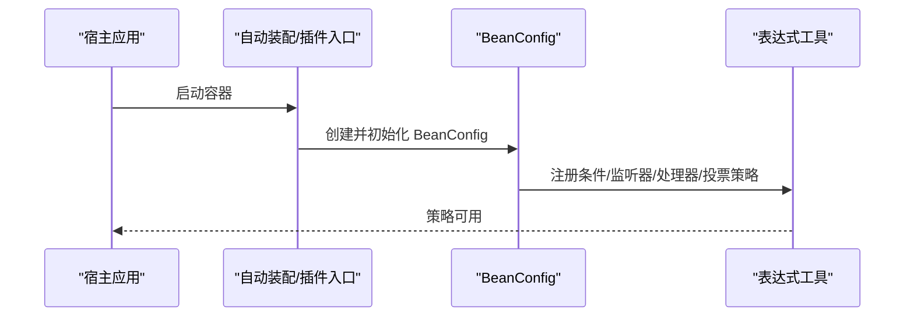
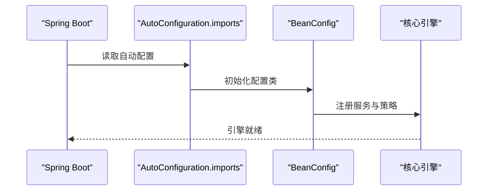
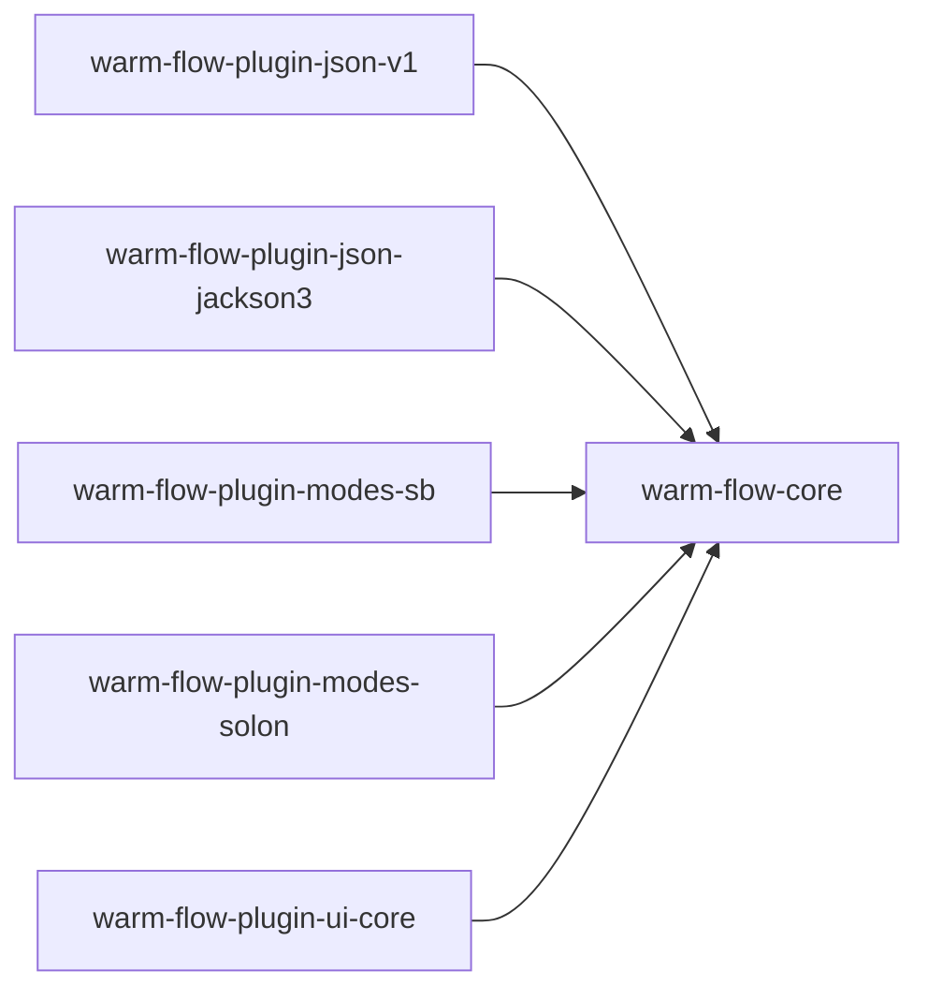

# 插件开发指南

<cite>
**本文引用的文件**
- [warm-flow-core/pom.xml](file://warm-flow-core/pom.xml)
- [warm-flow-plugin-json-v1/pom.xml](file://warm-flow-plugin/warm-flow-plugin-json/warm-flow-plugin-json-v1/pom.xml)
- [warm-flow-plugin-json-v1/META-INF/services/org.dromara.warm.flow.core.json.JsonConvert](file://warm-flow-plugin/warm-flow-plugin-json/warm-flow-plugin-json-v1/src/main/resources/META-INF/services/org.dromara.warm.flow.core.json.JsonConvert)
- [JsonConvert.java](file://warm-flow-core/src/main/java/org/dromara/warm/flow/core/json/JsonConvert.java)
- [JsonConvertFastJson.java](file://warm-flow-plugin/warm-flow-plugin-json/warm-flow-plugin-json-v1/src/main/java/org/dromara/warm/plugin/json/JsonConvertFastJson.java)
- [JsonConvertJackson3.java](file://warm-flow-plugin/warm-flow-plugin-json/warm-flow-plugin-json-jackson3/src/main/java/org/dromara/warm/plugin/json/JsonConvertJackson3.java)
- [HandlerStrategy.java](file://warm-flow-core/src/main/java/org/dromara/warm/flow/core/strategy/HandlerStrategy.java)
- [ListenerStrategy.java](file://warm-flow-core/src/main/java/org/dromara/warm/flow/core/strategy/ListenerStrategy.java)
- [VoteSignStrategy.java](file://warm-flow-core/src/main/java/org/dromara/warm/flow/core/strategy/VoteSignStrategy.java)
- [warm-flow-plugin-modes-sb/pom.xml](file://warm-flow-plugin/warm-flow-plugin-modes/warm-flow-plugin-modes-sb/pom.xml)
- [BeanConfig.java](file://warm-flow-plugin/warm-flow-plugin-modes/warm-flow-plugin-modes-sb/src/main/java/org/dromara/warm/plugin/modes/sb/config/BeanConfig.java)
- [warm-flow-easy-query-sb-starter/AutoConfiguration.imports](file://warm-flow-orm/warm-flow-easy-query/warm-flow-easy-query-sb-starter/src/main/resources/META-INF/spring/org.springframework.boot.autoconfigure.AutoConfiguration.imports)
- [warm-flow-easy-query-solon-plugin/solon.properties](file://warm-flow-orm/warm-flow-easy-query/warm-flow-easy-query-solon-plugin/src/main/resources/META-INF/solon/org.dromara.warm.flow.solon.properties)
- [WarmFlowModesSolonPlugin.java](file://warm-flow-plugin/warm-flow-plugin-modes/warm-flow-plugin-modes-solon/src/main/java/org/dromara/warm/plugin/modes/solon/WarmFlowModesSolonPlugin.java)
- [warm-flow-plugin-ui-core/pom.xml](file://warm-flow-plugin/warm-flow-plugin-ui/warm-flow-plugin-ui-core/pom.xml)
- [README.md](file://README.md)
</cite>

## 目录
1. [简介](#简介)
2. [项目结构](#项目结构)
3. [核心组件](#核心组件)
4. [架构总览](#架构总览)
5. [详细组件分析](#详细组件分析)
6. [依赖分析](#依赖分析)
7. [性能考虑](#性能考虑)
8. [故障排查指南](#故障排查指南)
9. [结论](#结论)
10. [附录](#附录)

## 简介
本指南面向希望基于 Warm-Flow 开发插件的工程师，系统讲解插件开发的完整流程与最佳实践，涵盖以下主题：
- SPI 机制与服务接口定义
- 配置文件编写与自动装配
- 插件项目结构组织与依赖管理
- 打包与发布
- 运行环境适配（Spring Boot 与 Solon）
- 从简单功能扩展到复杂业务插件的实现范式
- 测试、调试与性能优化建议

## 项目结构
Warm-Flow 采用多模块聚合结构，核心能力集中在 core 模块，插件能力以“插件族”形式提供，分别覆盖 JSON 序列化、表达式模式、UI 扩展与 ORM 适配。下图展示关键模块与关系：

图表来源
- [warm-flow-core/pom.xml:1-35](file://warm-flow-core/pom.xml#L1-L35)
- [warm-flow-plugin-json-v1/pom.xml:1-54](file://warm-flow-plugin/warm-flow-plugin-json/warm-flow-plugin-json-v1/pom.xml#L1-L54)
- [warm-flow-plugin-json-jackson3/pom.xml:1-54](file://warm-flow-plugin/warm-flow-plugin-json/warm-flow-plugin-json-jackson3/pom.xml#L1-L54)
- [warm-flow-plugin-modes-sb/pom.xml:1-64](file://warm-flow-plugin/warm-flow-plugin-modes/warm-flow-plugin-modes-sb/pom.xml#L1-L64)
- [warm-flow-plugin-modes-solon/pom.xml:1-54](file://warm-flow-plugin/warm-flow-plugin-modes/warm-flow-plugin-modes-solon/pom.xml#L1-L54)
- [warm-flow-plugin-ui-core/pom.xml:1-36](file://warm-flow-plugin/warm-flow-plugin-ui/warm-flow-plugin-ui-core/pom.xml#L1-L36)

章节来源
- [warm-flow-core/pom.xml:1-35](file://warm-flow-core/pom.xml#L1-L35)
- [warm-flow-plugin-json-v1/pom.xml:1-54](file://warm-flow-plugin/warm-flow-plugin-json/warm-flow-plugin-json-v1/pom.xml#L1-L54)
- [warm-flow-plugin-json-jackson3/pom.xml:1-54](file://warm-flow-plugin/warm-flow-plugin-json/warm-flow-plugin-json-jackson3/pom.xml#L1-L54)
- [warm-flow-plugin-modes-sb/pom.xml:1-64](file://warm-flow-plugin/warm-flow-plugin-modes/warm-flow-plugin-modes-sb/pom.xml#L1-L64)
- [warm-flow-plugin-modes-solon/pom.xml:1-54](file://warm-flow-plugin/warm-flow-plugin-modes/warm-flow-plugin-modes-solon/pom.xml#L1-L54)
- [warm-flow-plugin-ui-core/pom.xml:1-36](file://warm-flow-plugin/warm-flow-plugin-ui/warm-flow-plugin-ui-core/pom.xml#L1-L36)

## 核心组件
本节聚焦插件开发中最重要的两类构件：SPI 接口与策略接口。

- JSON 转换接口（SPI）
  - 接口职责：提供字符串与 Map/Bean/List 的相互转换能力，作为可插拔的序列化后端。
  - 关键点：通过 META-INF/services 文件声明实现类，运行时由 ServiceLoader 加载具体实现。
  - 参考路径：[JsonConvert.java:26-61](file://warm-flow-core/src/main/java/org/dromara/warm/flow/core/json/JsonConvert.java#L26-L61)

- 办理人/监听器/票签表达式策略接口
  - 接口职责：统一表达式求值策略，支持条件判断、监听器启用控制、投票签名判定等场景。
  - 关键点：各策略维护一个全局列表，便于集中注册与切换；提供预处理与后处理钩子。
  - 参考路径：
    - [HandlerStrategy.java:29-60](file://warm-flow-core/src/main/java/org/dromara/warm/flow/core/strategy/HandlerStrategy.java#L29-L60)
    - [ListenerStrategy.java:26-38](file://warm-flow-core/src/main/java/org/dromara/warm/flow/core/strategy/ListenerStrategy.java#L26-L38)
    - [VoteSignStrategy.java:28-44](file://warm-flow-core/src/main/java/org/dromara/warm/flow/core/strategy/VoteSignStrategy.java#L28-L44)

章节来源
- [JsonConvert.java:26-61](file://warm-flow-core/src/main/java/org/dromara/warm/flow/core/json/JsonConvert.java#L26-L61)
- [HandlerStrategy.java:29-60](file://warm-flow-core/src/main/java/org/dromara/warm/flow/core/strategy/HandlerStrategy.java#L29-L60)
- [ListenerStrategy.java:26-38](file://warm-flow-core/src/main/java/org/dromara/warm/flow/core/strategy/ListenerStrategy.java#L26-L38)
- [VoteSignStrategy.java:28-44](file://warm-flow-core/src/main/java/org/dromara/warm/flow/core/strategy/VoteSignStrategy.java#L28-L44)

## 架构总览
Warm-Flow 插件体系通过“核心接口 + SPI 实现 + 运行时装配”的方式解耦扩展点与宿主应用。下图展示核心交互：

图表来源
- [JsonConvert.java:26-61](file://warm-flow-core/src/main/java/org/dromara/warm/flow/core/json/JsonConvert.java#L26-L61)
- [BeanConfig.java:141-153](file://warm-flow-plugin/warm-flow-plugin-modes/warm-flow-plugin-modes-sb/src/main/java/org/dromara/warm/plugin/modes/sb/config/BeanConfig.java#L141-L153)
- [warm-flow-easy-query-sb-starter/AutoConfiguration.imports:1-2](file://warm-flow-orm/warm-flow-easy-query/warm-flow-easy-query-sb-starter/src/main/resources/META-INF/spring/org.springframework.boot.autoconfigure.AutoConfiguration.imports#L1-L2)
- [warm-flow-easy-query-solon-plugin/solon.properties:1-2](file://warm-flow-orm/warm-flow-easy-query/warm-flow-easy-query-solon-plugin/src/main/resources/META-INF/solon/org.dromara.warm.flow.solon.properties#L1-L2)

## 详细组件分析

### 组件一：JSON 转换 SPI 机制
- 设计要点
  - 接口定义在 core 模块，实现分散在多个插件模块，按需引入。
  - 通过 META-INF/services 声明实现类，运行时由 ServiceLoader 加载。
  - 提供多种实现（如 FastJson、Gson、Jackson、Snack），满足不同生态与性能需求。
- 典型实现
  - FastJson 实现：提供字符串与 Map/Bean/List 的互转。
    - 参考路径：[JsonConvertFastJson.java:34-95](file://warm-flow-plugin/warm-flow-plugin-json/warm-flow-plugin-json-v1/src/main/java/org/dromara/warm/plugin/json/JsonConvertFastJson.java#L34-L95)
  - Jackson3 实现：提供健壮的异常处理与类型安全转换。
    - 参考路径：[JsonConvertJackson3.java:37-124](file://warm-flow-plugin/warm-flow-plugin-json/warm-flow-plugin-json-jackson3/src/main/java/org/dromara/warm/plugin/json/JsonConvertJackson3.java#L37-L124)
- SPI 配置
  - 在插件模块的 resources/META-INF/services 下声明接口全限定名与实现类。
    - 参考路径：
      - [warm-flow-plugin-json-v1/META-INF/services/org.dromara.warm.flow.core.json.JsonConvert:1-6](file://warm-flow-plugin/warm-flow-plugin-json/warm-flow-plugin-json-v1/src/main/resources/META-INF/services/org.dromara.warm.flow.core.json.JsonConvert#L1-L6)
      - [warm-flow-plugin-json-jackson3/META-INF/services/org.dromara.warm.flow.core.json.JsonConvert:1-2](file://warm-flow-plugin/warm-flow-plugin-json/warm-flow-plugin-json-jackson3/src/main/resources/META-INF/services/org.dromara.warm.flow.core.json.JsonConvert#L1-L2)

图表来源
- [JsonConvert.java:26-61](file://warm-flow-core/src/main/java/org/dromara/warm/flow/core/json/JsonConvert.java#L26-L61)
- [JsonConvertFastJson.java:34-95](file://warm-flow-plugin/warm-flow-plugin-json/warm-flow-plugin-json-v1/src/main/java/org/dromara/warm/plugin/json/JsonConvertFastJson.java#L34-L95)
- [JsonConvertJackson3.java:37-124](file://warm-flow-plugin/warm-flow-plugin-json/warm-flow-plugin-json-jackson3/src/main/java/org/dromara/warm/plugin/json/JsonConvertJackson3.java#L37-L124)

章节来源
- [JsonConvert.java:26-61](file://warm-flow-core/src/main/java/org/dromara/warm/flow/core/json/JsonConvert.java#L26-L61)
- [JsonConvertFastJson.java:34-95](file://warm-flow-plugin/warm-flow-plugin-json/warm-flow-plugin-json-v1/src/main/java/org/dromara/warm/plugin/json/JsonConvertFastJson.java#L34-L95)
- [JsonConvertJackson3.java:37-124](file://warm-flow-plugin/warm-flow-plugin-json/warm-flow-plugin-json-jackson3/src/main/java/org/dromara/warm/plugin/json/JsonConvertJackson3.java#L37-L124)
- [warm-flow-plugin-json-v1/META-INF/services/org.dromara.warm.flow.core.json.JsonConvert:1-6](file://warm-flow-plugin/warm-flow-plugin-json/warm-flow-plugin-json-v1/src/main/resources/META-INF/services/org.dromara.warm.flow.core.json.JsonConvert#L1-L6)
- [warm-flow-plugin-json-jackson3/META-INF/services/org.dromara.warm.flow.core.json.JsonConvert:1-2](file://warm-flow-plugin/warm-flow-plugin-json/warm-flow-plugin-json-jackson3/src/main/resources/META-INF/services/org.dromara.warm.flow.core.json.JsonConvert#L1-L2)

### 组件二：表达式策略接口与注册流程
- 设计要点
  - 三类策略接口统一抽象表达式求值，提供预处理与后处理钩子，便于扩展。
  - 各策略维护全局列表，通过 BeanConfig 注册到表达式工具中。
- 注册流程（Spring Boot）
  - 在 BeanConfig 中初始化表达式策略并设置到表达式工具。
    - 参考路径：[BeanConfig.java:155-162](file://warm-flow-plugin/warm-flow-plugin-modes/warm-flow-plugin-modes-sb/src/main/java/org/dromara/warm/plugin/modes/sb/config/BeanConfig.java#L155-L162)
- 注册流程（Solon）
  - 通过插件入口启动时构建 BeanConfig 完成装配。
    - 参考路径：[WarmFlowModesSolonPlugin.java:30-34](file://warm-flow-plugin/warm-flow-plugin-modes/warm-flow-plugin-modes-solon/src/main/java/org/dromara/warm/plugin/modes/solon/WarmFlowModesSolonPlugin.java#L30-L34)

图表来源
- [BeanConfig.java:155-162](file://warm-flow-plugin/warm-flow-plugin-modes/warm-flow-plugin-modes-sb/src/main/java/org/dromara/warm/plugin/modes/sb/config/BeanConfig.java#L155-L162)
- [WarmFlowModesSolonPlugin.java:30-34](file://warm-flow-plugin/warm-flow-plugin-modes/warm-flow-plugin-modes-solon/src/main/java/org/dromara/warm/plugin/modes/solon/WarmFlowModesSolonPlugin.java#L30-L34)

章节来源
- [HandlerStrategy.java:29-60](file://warm-flow-core/src/main/java/org/dromara/warm/flow/core/strategy/HandlerStrategy.java#L29-L60)
- [ListenerStrategy.java:26-38](file://warm-flow-core/src/main/java/org/dromara/warm/flow/core/strategy/ListenerStrategy.java#L26-L38)
- [VoteSignStrategy.java:28-44](file://warm-flow-core/src/main/java/org/dromara/warm/flow/core/strategy/VoteSignStrategy.java#L28-L44)
- [BeanConfig.java:155-162](file://warm-flow-plugin/warm-flow-plugin-modes/warm-flow-plugin-modes-sb/src/main/java/org/dromara/warm/plugin/modes/sb/config/BeanConfig.java#L155-L162)
- [WarmFlowModesSolonPlugin.java:30-34](file://warm-flow-plugin/warm-flow-plugin-modes/warm-flow-plugin-modes-solon/src/main/java/org/dromara/warm/plugin/modes/solon/WarmFlowModesSolonPlugin.java#L30-L34)

### 组件三：运行环境适配（Spring Boot 与 Solon）
- Spring Boot 适配
  - 通过 AutoConfiguration.imports 声明自动配置类，实现零样板代码接入。
    - 参考路径：[warm-flow-easy-query-sb-starter/AutoConfiguration.imports:1-2](file://warm-flow-orm/warm-flow-easy-query/warm-flow-easy-query-sb-starter/src/main/resources/META-INF/spring/org.springframework.boot.autoconfigure.AutoConfiguration.imports#L1-L2)
  - BeanConfig 完成核心 Bean 注册与表达式策略初始化。
    - 参考路径：[BeanConfig.java:141-153](file://warm-flow-plugin/warm-flow-plugin-modes/warm-flow-plugin-modes-sb/src/main/java/org/dromara/warm/plugin/modes/sb/config/BeanConfig.java#L141-L153)
- Solon 适配
  - 通过 solon.properties 声明插件入口类，框架自动扫描并启动。
    - 参考路径：[warm-flow-easy-query-solon-plugin/solon.properties:1-2](file://warm-flow-orm/warm-flow-easy-query/warm-flow-easy-query-solon-plugin/src/main/resources/META-INF/solon/org.dromara.warm.flow.solon.properties#L1-L2)
  - WarmFlowModesSolonPlugin 在启动时构建 BeanConfig。
    - 参考路径：[WarmFlowModesSolonPlugin.java:30-34](file://warm-flow-plugin/warm-flow-plugin-modes/warm-flow-plugin-modes-solon/src/main/java/org/dromara/warm/plugin/modes/solon/WarmFlowModesSolonPlugin.java#L30-L34)

图表来源
- [warm-flow-easy-query-sb-starter/AutoConfiguration.imports:1-2](file://warm-flow-orm/warm-flow-easy-query/warm-flow-easy-query-sb-starter/src/main/resources/META-INF/spring/org.springframework.boot.autoconfigure.AutoConfiguration.imports#L1-L2)
- [BeanConfig.java:141-153](file://warm-flow-plugin/warm-flow-plugin-modes/warm-flow-plugin-modes-sb/src/main/java/org/dromara/warm/plugin/modes/sb/config/BeanConfig.java#L141-L153)

章节来源
- [warm-flow-easy-query-sb-starter/AutoConfiguration.imports:1-2](file://warm-flow-orm/warm-flow-easy-query/warm-flow-easy-query-sb-starter/src/main/resources/META-INF/spring/org.springframework.boot.autoconfigure.AutoConfiguration.imports#L1-L2)
- [warm-flow-easy-query-solon-plugin/solon.properties:1-2](file://warm-flow-orm/warm-flow-easy-query/warm-flow-easy-query-solon-plugin/src/main/resources/META-INF/solon/org.dromara.warm.flow.solon.properties#L1-L2)
- [BeanConfig.java:141-153](file://warm-flow-plugin/warm-flow-plugin-modes/warm-flow-plugin-modes-sb/src/main/java/org/dromara/warm/plugin/modes/sb/config/BeanConfig.java#L141-L153)
- [WarmFlowModesSolonPlugin.java:30-34](file://warm-flow-plugin/warm-flow-plugin-modes/warm-flow-plugin-modes-solon/src/main/java/org/dromara/warm/plugin/modes/solon/WarmFlowModesSolonPlugin.java#L30-L34)

### 组件四：UI 插件与 Web 控制器
- UI 核心服务
  - 提供分类、表单路径、处理器字典、监听器列表等扩展能力。
  - 参考路径：[warm-flow-plugin-ui-core/pom.xml:1-36](file://warm-flow-plugin/warm-flow-plugin-ui/warm-flow-plugin-ui-core/pom.xml#L1-L36)
- Web 层适配
  - Spring Boot 与 Solon 分别提供控制器与自动装配入口，便于集成前端 UI。
  - 参考路径：[warm-flow-plugin-ui-sb-web/AutoConfiguration.imports:1-2](file://warm-flow-plugin/warm-flow-plugin-ui/warm-flow-plugin-ui-sb-web/src/main/resources/META-INF/spring/org.springframework.boot.autoconfigure.AutoConfiguration.imports#L1-L2)
  - 参考路径：[warm-flow-plugin-ui-solon-web/solon.properties:1-2](file://warm-flow-plugin/warm-flow-plugin-ui/warm-flow-plugin-ui-solon-web/src/main/resources/META-INF/solon/org.dromara.warm.flow.ui.properties#L1-L2)

章节来源
- [warm-flow-plugin-ui-core/pom.xml:1-36](file://warm-flow-plugin/warm-flow-plugin-ui/warm-flow-plugin-ui-core/pom.xml#L1-L36)

## 依赖分析
- 模块间依赖关系
  - 插件模块对 core 模块存在直接依赖，确保接口契约稳定。
  - Spring Boot 与 Solon 适配模块分别依赖对应框架与自动装配机制。
- 依赖可视化

图表来源
- [warm-flow-core/pom.xml:1-35](file://warm-flow-core/pom.xml#L1-L35)
- [warm-flow-plugin-json-v1/pom.xml:1-54](file://warm-flow-plugin/warm-flow-plugin-json/warm-flow-plugin-json-v1/pom.xml#L1-L54)
- [warm-flow-plugin-json-jackson3/pom.xml:1-54](file://warm-flow-plugin/warm-flow-plugin-json/warm-flow-plugin-json-jackson3/pom.xml#L1-L54)
- [warm-flow-plugin-modes-sb/pom.xml:1-64](file://warm-flow-plugin/warm-flow-plugin-modes/warm-flow-plugin-modes-sb/pom.xml#L1-L64)
- [warm-flow-plugin-modes-solon/pom.xml:1-54](file://warm-flow-plugin/warm-flow-plugin-modes/warm-flow-plugin-modes-solon/pom.xml#L1-L54)
- [warm-flow-plugin-ui-core/pom.xml:1-36](file://warm-flow-plugin/warm-flow-plugin-ui/warm-flow-plugin-ui-core/pom.xml#L1-L36)

章节来源
- [warm-flow-plugin-modes-sb/pom.xml:1-64](file://warm-flow-plugin/warm-flow-plugin-modes/warm-flow-plugin-modes-sb/pom.xml#L1-L64)

## 性能考虑
- JSON 转换
  - 不同实现的性能特征不同，建议根据数据规模与并发场景选择合适实现，并进行基准测试。
  - 注意避免在热路径频繁创建解析器实例，优先复用或使用线程安全实现。
- 表达式求值
  - 策略注册应尽量减少不必要的反射与动态解析，必要时缓存表达式 AST 或中间结果。
- 容器启动
  - Spring Boot 与 Solon 的自动装配应避免在启动阶段执行重任务，将延迟初始化逻辑移至首次使用。

## 故障排查指南
- SPI 实现未生效
  - 检查 META-INF/services 文件是否正确放置且内容无误。
  - 确认插件模块被打包进最终产物，且类路径包含实现类。
  - 参考路径：
    - [warm-flow-plugin-json-v1/META-INF/services/org.dromara.warm.flow.core.json.JsonConvert:1-6](file://warm-flow-plugin/warm-flow-plugin-json/warm-flow-plugin-json-v1/src/main/resources/META-INF/services/org.dromara.warm.flow.core.json.JsonConvert#L1-L6)
- 表达式策略未注册
  - 确认 BeanConfig 是否被正确加载（Spring Boot）或插件入口是否生效（Solon）。
  - 参考路径：
    - [BeanConfig.java:141-153](file://warm-flow-plugin/warm-flow-plugin-modes/warm-flow-plugin-modes-sb/src/main/java/org/dromara/warm/plugin/modes/sb/config/BeanConfig.java#L141-L153)
    - [WarmFlowModesSolonPlugin.java:30-34](file://warm-flow-plugin/warm-flow-plugin-modes/warm-flow-plugin-modes-solon/src/main/java/org/dromara/warm/plugin/modes/solon/WarmFlowModesSolonPlugin.java#L30-L34)
- JSON 转换异常
  - 查看实现类中的异常处理分支，确认输入数据格式与类型匹配。
  - 参考路径：
    - [JsonConvertJackson3.java:54-60](file://warm-flow-plugin/warm-flow-plugin-json/warm-flow-plugin-json-jackson3/src/main/java/org/dromara/warm/plugin/json/JsonConvertJackson3.java#L54-L60)

章节来源
- [warm-flow-plugin-json-v1/META-INF/services/org.dromara.warm.flow.core.json.JsonConvert:1-6](file://warm-flow-plugin/warm-flow-plugin-json/warm-flow-plugin-json-v1/src/main/resources/META-INF/services/org.dromara.warm.flow.core.json.JsonConvert#L1-L6)
- [BeanConfig.java:141-153](file://warm-flow-plugin/warm-flow-plugin-modes/warm-flow-plugin-modes-sb/src/main/java/org/dromara/warm/plugin/modes/sb/config/BeanConfig.java#L141-L153)
- [WarmFlowModesSolonPlugin.java:30-34](file://warm-flow-plugin/warm-flow-plugin-modes/warm-flow-plugin-modes-solon/src/main/java/org/dromara/warm/plugin/modes/solon/WarmFlowModesSolonPlugin.java#L30-L34)
- [JsonConvertJackson3.java:54-60](file://warm-flow-plugin/warm-flow-plugin-json/warm-flow-plugin-json-jackson3/src/main/java/org/dromara/warm/plugin/json/JsonConvertJackson3.java#L54-L60)

## 结论
Warm-Flow 的插件体系以清晰的接口契约、灵活的 SPI 机制与完善的运行时适配为核心，既能快速扩展功能，又能保证与宿主框架的无缝集成。开发者可依据本文档的结构化指引，从简单实现到复杂业务插件逐步演进，并结合测试与性能优化实践，构建高质量的扩展能力。

## 附录
- 快速开始清单
  - 明确扩展点与接口契约（如 JSON 转换、表达式策略）
  - 编写实现类并提供 META-INF/services 声明
  - 在 Spring Boot 或 Solon 中完成自动装配或插件入口配置
  - 编写单元测试与集成测试，关注边界与异常场景
  - 进行性能压测，识别瓶颈并优化
- 参考文档
  - [README.md](file://README.md)