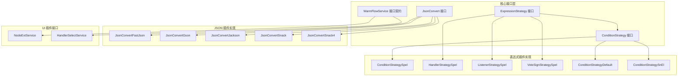
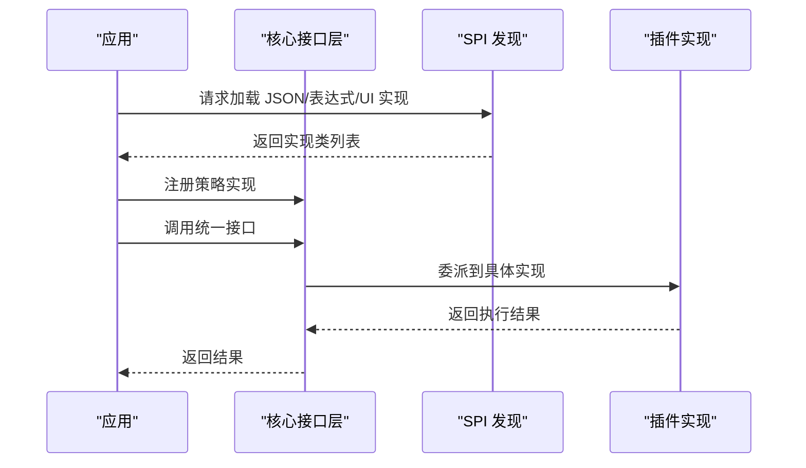
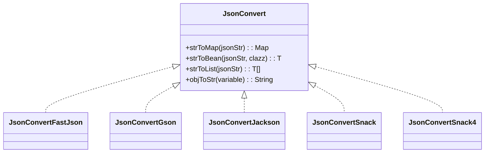
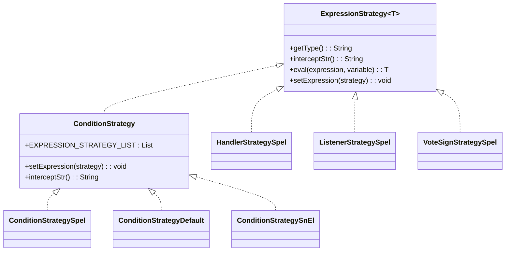
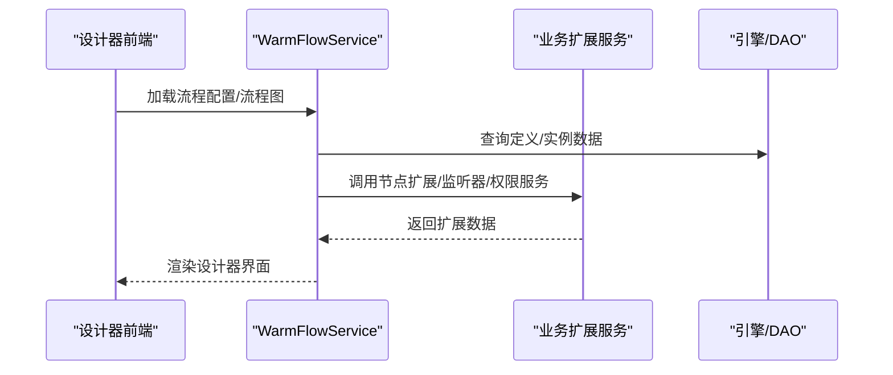
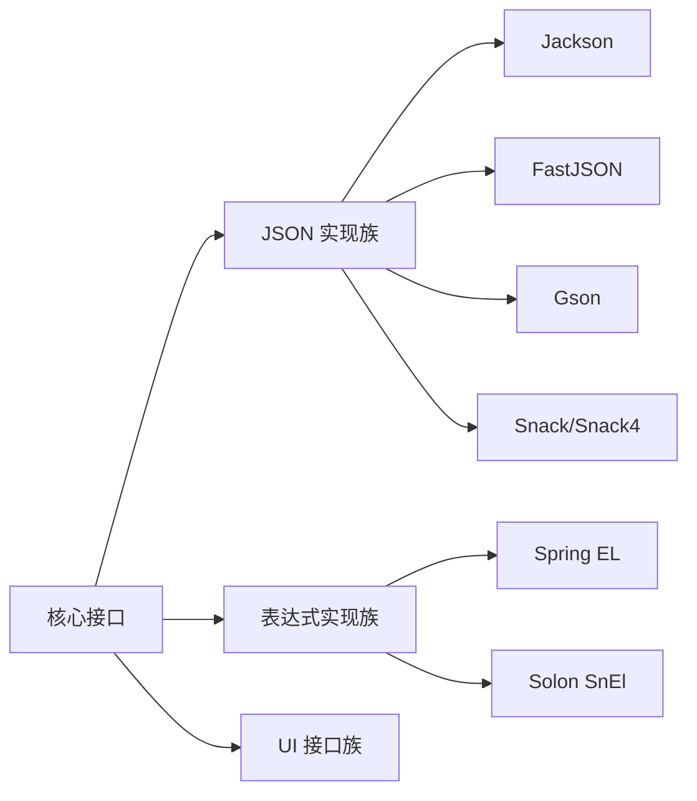

# 插件系统

<cite>
**本文引用的文件**
- [JsonConvert.java](file://warm-flow-core/src/main/java/org/dromara/warm/flow/core/json/JsonConvert.java)
- [JsonConvertFastJson.java](file://warm-flow-plugin/warm-flow-plugin-json/warm-flow-plugin-json-v1/src/main/java/org/dromara/warm/plugin/json/JsonConvertFastJson.java)
- [JsonConvertGson.java](file://warm-flow-plugin/warm-flow-plugin-json/warm-flow-plugin-json-v1/src/main/java/org/dromara/warm/plugin/json/JsonConvertGson.java)
- [JsonConvertJackson.java](file://warm-flow-plugin/warm-flow-plugin-json/warm-flow-plugin-json-v1/src/main/java/org/dromara/warm/plugin/json/JsonConvertJackson.java)
- [JsonConvertSnack.java](file://warm-flow-plugin/warm-flow-plugin-json/warm-flow-plugin-json-v1/src/main/java/org/dromara/warm/plugin/json/JsonConvertSnack.java)
- [JsonConvertSnack4.java](file://warm-flow-plugin/warm-flow-plugin-json/warm-flow-plugin-json-v1/src/main/java/org/dromara/warm/plugin/json/JsonConvertSnack4.java)
- [ConditionStrategy.java](file://warm-flow-core/src/main/java/org/dromara/warm/flow/core/strategy/ConditionStrategy.java)
- [ExpressionStrategy.java](file://warm-flow-core/src/main/java/org/dromara/warm/flow/core/strategy/ExpressionStrategy.java)
- [ConditionStrategySpel.java](file://warm-flow-plugin/warm-flow-plugin-modes/warm-flow-plugin-modes-sb/src/main/java/org/dromara/warm/plugin/modes/sb/expression/ConditionStrategySpel.java)
- [HandlerStrategySpel.java](file://warm-flow-plugin/warm-flow-plugin-modes/warm-flow-plugin-modes-sb/src/main/java/org/dromara/warm/plugin/modes/sb/expression/HandlerStrategySpel.java)
- [ListenerStrategySpel.java](file://warm-flow-plugin/warm-flow-plugin-modes/warm-flow-plugin-modes-sb/src/main/java/org/dromara/warm/plugin/modes/sb/expression/ListenerStrategySpel.java)
- [VoteSignStrategySpel.java](file://warm-flow-plugin/warm-flow-plugin-modes/warm-flow-plugin-modes-sb/src/main/java/org/dromara/warm/plugin/modes/sb/expression/VoteSignStrategySpel.java)
- [ConditionStrategyDefault.java](file://warm-flow-plugin/warm-flow-plugin-modes/warm-flow-plugin-modes-sb/src/main/java/org/dromara/warm/plugin/modes/sb/expression/ConditionStrategyDefault.java)
- [ConditionStrategySnEl.java](file://warm-flow-plugin/warm-flow-plugin-modes/warm-flow-plugin-modes-solon/src/main/java/org/dromara/warm/plugin/modes/solon/expression/ConditionStrategySnEl.java)
- [WarmFlowService.java](file://warm-flow-plugin/warm-flow-plugin-ui/warm-flow-plugin-ui-core/src/main/java/org/dromara/warm/flow/ui/service/WarmFlowService.java)
- [NodeExtService.java](file://warm-flow-plugin/warm-flow-plugin-ui/warm-flow-plugin-ui-core/src/main/java/org/dromara/warm/flow/ui/service/NodeExtService.java)
- [HandlerSelectService.java](file://warm-flow-plugin/warm-flow-plugin-ui/warm-flow-plugin-ui-core/src/main/java/org/dromara/warm/flow/ui/service/HandlerSelectService.java)
</cite>

## 目录
1. [引言](#引言)
2. [项目结构](#项目结构)
3. [核心组件](#核心组件)
4. [架构总览](#架构总览)
5. [组件详解](#组件详解)
6. [依赖关系分析](#依赖关系分析)
7. [性能考量](#性能考量)
8. [故障排查指南](#故障排查指南)
9. [结论](#结论)
10. [附录](#附录)

## 引言
本文件面向 Warm-Flow 插件系统的使用者与开发者，系统性阐述插件架构的设计理念与实现机制，重点覆盖以下方面：
- SPI 机制与服务发现：如何通过标准的 SPI 接口加载不同实现（如 JSON 序列化、表达式策略、UI 扩展）。
- 表达式插件系统：SPeL/SnEl 等表达式支持、条件判断策略、监听器策略等扩展机制。
- JSON 序列化插件：Jackson、FastJSON、Gson、Snack 系列的多实现支持与选择策略。
- UI 插件系统：设计器集成、组件扩展、权限与表单联动等能力。
- 插件开发指南：接口定义、实现规范、注册与生效机制。

## 项目结构
Warm-Flow 插件体系采用“核心接口 + 多实现 + SPI 发现”的分层设计：
- 核心模块提供统一接口与抽象策略（如 JSON 转换、表达式策略、UI 服务接口）。
- 各插件模块实现具体策略或适配器（如 Jackson/FastJSON/Gson/Snack 实现 JSON；SPeL/SnEl 实现表达式；UI 服务接口）。
- 通过 SPI（META-INF/services 或框架特定注册）完成自动发现与装配。

图表来源
- [JsonConvert.java:26-61](file://warm-flow-core/src/main/java/org/dromara/warm/flow/core/json/JsonConvert.java#L26-L61)
- [JsonConvertFastJson.java:34-95](file://warm-flow-plugin/warm-flow-plugin-json/warm-flow-plugin-json-v1/src/main/java/org/dromara/warm/plugin/json/JsonConvertFastJson.java#L34-L95)
- [JsonConvertGson.java:35-99](file://warm-flow-plugin/warm-flow-plugin-json/warm-flow-plugin-json-v1/src/main/java/org/dromara/warm/plugin/json/JsonConvertGson.java#L35-L99)
- [JsonConvertJackson.java:41-127](file://warm-flow-plugin/warm-flow-plugin-json/warm-flow-plugin-json-v1/src/main/java/org/dromara/warm/plugin/json/JsonConvertJackson.java#L41-L127)
- [JsonConvertSnack.java:35-90](file://warm-flow-plugin/warm-flow-plugin-json/warm-flow-plugin-json-v1/src/main/java/org/dromara/warm/plugin/json/JsonConvertSnack.java#L35-L90)
- [JsonConvertSnack4.java:33-89](file://warm-flow-plugin/warm-flow-plugin-json/warm-flow-plugin-json-v1/src/main/java/org/dromara/warm/plugin/json/JsonConvertSnack4.java#L33-L89)
- [ExpressionStrategy.java:25-60](file://warm-flow-core/src/main/java/org/dromara/warm/flow/core/strategy/ExpressionStrategy.java#L25-L60)
- [ConditionStrategy.java:28-44](file://warm-flow-core/src/main/java/org/dromara/warm/flow/core/strategy/ConditionStrategy.java#L28-L44)
- [ConditionStrategySpel.java:29-40](file://warm-flow-plugin/warm-flow-plugin-modes/warm-flow-plugin-modes-sb/src/main/java/org/dromara/warm/plugin/modes/sb/expression/ConditionStrategySpel.java#L29-L40)
- [HandlerStrategySpel.java:28-39](file://warm-flow-plugin/warm-flow-plugin-modes/warm-flow-plugin-modes-sb/src/main/java/org/dromara/warm/plugin/modes/sb/expression/HandlerStrategySpel.java#L28-L39)
- [ListenerStrategySpel.java:28-41](file://warm-flow-plugin/warm-flow-plugin-modes/warm-flow-plugin-modes-sb/src/main/java/org/dromara/warm/plugin/modes/sb/expression/ListenerStrategySpel.java#L28-L41)
- [VoteSignStrategySpel.java:29-40](file://warm-flow-plugin/warm-flow-plugin-modes/warm-flow-plugin-modes-sb/src/main/java/org/dromara/warm/plugin/modes/sb/expression/VoteSignStrategySpel.java#L29-L40)
- [ConditionStrategyDefault.java:30-41](file://warm-flow-plugin/warm-flow-plugin-modes/warm-flow-plugin-modes-sb/src/main/java/org/dromara/warm/plugin/modes/sb/expression/ConditionStrategyDefault.java#L30-L41)
- [ConditionStrategySnEl.java:29-40](file://warm-flow-plugin/warm-flow-plugin-modes/warm-flow-plugin-modes-solon/src/main/java/org/dromara/warm/plugin/modes/solon/expression/ConditionStrategySnEl.java#L29-L40)
- [WarmFlowService.java:44-375](file://warm-flow-plugin/warm-flow-plugin-ui/warm-flow-plugin-ui-core/src/main/java/org/dromara/warm/flow/ui/service/WarmFlowService.java#L44-L375)
- [NodeExtService.java:27-35](file://warm-flow-plugin/warm-flow-plugin-ui/warm-flow-plugin-ui-core/src/main/java/org/dromara/warm/flow/ui/service/NodeExtService.java#L27-L35)
- [HandlerSelectService.java:39-128](file://warm-flow-plugin/warm-flow-plugin-ui/warm-flow-plugin-ui-core/src/main/java/org/dromara/warm/flow/ui/service/HandlerSelectService.java#L39-L128)

章节来源
- [JsonConvert.java:26-61](file://warm-flow-core/src/main/java/org/dromara/warm/flow/core/json/JsonConvert.java#L26-L61)
- [ExpressionStrategy.java:25-60](file://warm-flow-core/src/main/java/org/dromara/warm/flow/core/strategy/ExpressionStrategy.java#L25-L60)
- [ConditionStrategy.java:28-44](file://warm-flow-core/src/main/java/org/dromara/warm/flow/core/strategy/ConditionStrategy.java#L28-L44)

## 核心组件
- JSON 序列化接口与实现
  - 接口职责：提供字符串与 Map/Bean/List 的相互转换能力，屏蔽底层序列化库差异。
  - 实现族：FastJSON、Gson、Jackson、Snack/Snack4，分别对应不同生态与性能特征。
- 表达式策略接口与实现
  - 接口职责：统一表达式解析与执行入口，支持条件判断、处理器预计算、监听器匹配、会签判断等场景。
  - 实现族：SPeL（Spring EL）、SnEl（Solon EL）、以及基于 SPeL 的默认简写策略。
- UI 插件接口
  - 设计器服务：提供流程配置、表单联动、节点扩展、监听器列表等能力。
  - 权限选择服务：提供“用户/角色/部门”等多源数据的统一查询与树形结构输出。

章节来源
- [JsonConvert.java:26-61](file://warm-flow-core/src/main/java/org/dromara/warm/flow/core/json/JsonConvert.java#L26-L61)
- [JsonConvertFastJson.java:34-95](file://warm-flow-plugin/warm-flow-plugin-json/warm-flow-plugin-json-v1/src/main/java/org/dromara/warm/plugin/json/JsonConvertFastJson.java#L34-L95)
- [JsonConvertGson.java:35-99](file://warm-flow-plugin/warm-flow-plugin-json/warm-flow-plugin-json-v1/src/main/java/org/dromara/warm/plugin/json/JsonConvertGson.java#L35-L99)
- [JsonConvertJackson.java:41-127](file://warm-flow-plugin/warm-flow-plugin-json/warm-flow-plugin-json-v1/src/main/java/org/dromara/warm/plugin/json/JsonConvertJackson.java#L41-L127)
- [JsonConvertSnack.java:35-90](file://warm-flow-plugin/warm-flow-plugin-json/warm-flow-plugin-json-v1/src/main/java/org/dromara/warm/plugin/json/JsonConvertSnack.java#L35-L90)
- [JsonConvertSnack4.java:33-89](file://warm-flow-plugin/warm-flow-plugin-json/warm-flow-plugin-json-v1/src/main/java/org/dromara/warm/plugin/json/JsonConvertSnack4.java#L33-L89)
- [ExpressionStrategy.java:25-60](file://warm-flow-core/src/main/java/org/dromara/warm/flow/core/strategy/ExpressionStrategy.java#L25-L60)
- [ConditionStrategy.java:28-44](file://warm-flow-core/src/main/java/org/dromara/warm/flow/core/strategy/ConditionStrategy.java#L28-L44)
- [WarmFlowService.java:44-375](file://warm-flow-plugin/warm-flow-plugin-ui/warm-flow-plugin-ui-core/src/main/java/org/dromara/warm/flow/ui/service/WarmFlowService.java#L44-L375)
- [NodeExtService.java:27-35](file://warm-flow-plugin/warm-flow-plugin-ui/warm-flow-plugin-ui-core/src/main/java/org/dromara/warm/flow/ui/service/NodeExtService.java#L27-L35)
- [HandlerSelectService.java:39-128](file://warm-flow-plugin/warm-flow-plugin-ui/warm-flow-plugin-ui-core/src/main/java/org/dromara/warm/flow/ui/service/HandlerSelectService.java#L39-L128)

## 架构总览
Warm-Flow 插件系统以“策略接口 + SPI 发现 + 运行时装配”为核心，形成高内聚、低耦合的扩展架构。核心流程如下：
- SPI 注册：各实现模块在资源目录暴露服务清单，声明实现类。
- 启动加载：框架在启动阶段扫描并加载可用实现，注册到全局策略容器。
- 运行调用：业务侧通过统一接口发起调用，框架根据上下文选择合适实现执行。

图表来源
- [JsonConvert.java:26-61](file://warm-flow-core/src/main/java/org/dromara/warm/flow/core/json/JsonConvert.java#L26-L61)
- [ExpressionStrategy.java:25-60](file://warm-flow-core/src/main/java/org/dromara/warm/flow/core/strategy/ExpressionStrategy.java#L25-L60)
- [ConditionStrategy.java:28-44](file://warm-flow-core/src/main/java/org/dromara/warm/flow/core/strategy/ConditionStrategy.java#L28-L44)
- [WarmFlowService.java:44-375](file://warm-flow-plugin/warm-flow-plugin-ui/warm-flow-plugin-ui-core/src/main/java/org/dromara/warm/flow/ui/service/WarmFlowService.java#L44-L375)

## 组件详解

### JSON 序列化插件系统
- 接口契约
  - 提供字符串与 Map/Bean/List 的双向转换，以及对象到字符串的序列化。
- 实现对比
  - FastJSON：简洁易用，性能优异，适合高吞吐场景。
  - Gson：Google 生态友好，反射安全，适合通用 Java 场景。
  - Jackson：功能完备，可定制性强，适合复杂类型与严格校验场景。
  - Snack/Snack4：轻量、零依赖，适合对依赖敏感的运行环境。
- 选择建议
  - 若追求极致性能与简单 API，优先 FastJSON。
  - 若需要严格的类型安全与可配置性，优先 Jackson。
  - 若偏好 Google 生态与稳定兼容，优先 Gson。
  - 若需要最小依赖与快速集成，优先 Snack/Snack4。

图表来源
- [JsonConvert.java:26-61](file://warm-flow-core/src/main/java/org/dromara/warm/flow/core/json/JsonConvert.java#L26-L61)
- [JsonConvertFastJson.java:34-95](file://warm-flow-plugin/warm-flow-plugin-json/warm-flow-plugin-json-v1/src/main/java/org/dromara/warm/plugin/json/JsonConvertFastJson.java#L34-L95)
- [JsonConvertGson.java:35-99](file://warm-flow-plugin/warm-flow-plugin-json/warm-flow-plugin-json-v1/src/main/java/org/dromara/warm/plugin/json/JsonConvertGson.java#L35-L99)
- [JsonConvertJackson.java:41-127](file://warm-flow-plugin/warm-flow-plugin-json/warm-flow-plugin-json-v1/src/main/java/org/dromara/warm/plugin/json/JsonConvertJackson.java#L41-L127)
- [JsonConvertSnack.java:35-90](file://warm-flow-plugin/warm-flow-plugin-json/warm-flow-plugin-json-v1/src/main/java/org/dromara/warm/plugin/json/JsonConvertSnack.java#L35-L90)
- [JsonConvertSnack4.java:33-89](file://warm-flow-plugin/warm-flow-plugin-json/warm-flow-plugin-json-v1/src/main/java/org/dromara/warm/plugin/json/JsonConvertSnack4.java#L33-L89)

章节来源
- [JsonConvert.java:26-61](file://warm-flow-core/src/main/java/org/dromara/warm/flow/core/json/JsonConvert.java#L26-L61)
- [JsonConvertFastJson.java:34-95](file://warm-flow-plugin/warm-flow-plugin-json/warm-flow-plugin-json-v1/src/main/java/org/dromara/warm/plugin/json/JsonConvertFastJson.java#L34-L95)
- [JsonConvertGson.java:35-99](file://warm-flow-plugin/warm-flow-plugin-json/warm-flow-plugin-json-v1/src/main/java/org/dromara/warm/plugin/json/JsonConvertGson.java#L35-L99)
- [JsonConvertJackson.java:41-127](file://warm-flow-plugin/warm-flow-plugin-json/warm-flow-plugin-json-v1/src/main/java/org/dromara/warm/plugin/json/JsonConvertJackson.java#L41-L127)
- [JsonConvertSnack.java:35-90](file://warm-flow-plugin/warm-flow-plugin-json/warm-flow-plugin-json-v1/src/main/java/org/dromara/warm/plugin/json/JsonConvertSnack.java#L35-L90)
- [JsonConvertSnack4.java:33-89](file://warm-flow-plugin/warm-flow-plugin-json/warm-flow-plugin-json-v1/src/main/java/org/dromara/warm/plugin/json/JsonConvertSnack4.java#L33-L89)

### 表达式插件系统（SPeL/SnEl）
- 接口与策略
  - ExpressionStrategy：统一的表达式执行接口，定义类型标识、截断符、eval 执行与注册方法。
  - ConditionStrategy：条件表达式策略，继承 ExpressionStrategy，维护全局策略列表。
- SPeL 实现（Spring）
  - ConditionStrategySpel：基于 Spring EL 的条件判断。
  - HandlerStrategySpel：处理器预计算策略，支持表达式前置求值。
  - ListenerStrategySpel：监听器策略，恒返回匹配成功以确保扩展生效。
  - VoteSignStrategySpel：会签策略，基于 SPeL 判断。
  - ConditionStrategyDefault：默认策略，对简写语法进行替换后交由 SPeL 执行。
- SnEl 实现（Solon）
  - ConditionStrategySnEl：基于 Solon SnEl 的条件判断，类型标识与 SPeL 对齐，便于切换。

图表来源
- [ExpressionStrategy.java:25-60](file://warm-flow-core/src/main/java/org/dromara/warm/flow/core/strategy/ExpressionStrategy.java#L25-L60)
- [ConditionStrategy.java:28-44](file://warm-flow-core/src/main/java/org/dromara/warm/flow/core/strategy/ConditionStrategy.java#L28-L44)
- [ConditionStrategySpel.java:29-40](file://warm-flow-plugin/warm-flow-plugin-modes/warm-flow-plugin-modes-sb/src/main/java/org/dromara/warm/plugin/modes/sb/expression/ConditionStrategySpel.java#L29-L40)
- [HandlerStrategySpel.java:28-39](file://warm-flow-plugin/warm-flow-plugin-modes/warm-flow-plugin-modes-sb/src/main/java/org/dromara/warm/plugin/modes/sb/expression/HandlerStrategySpel.java#L28-L39)
- [ListenerStrategySpel.java:28-41](file://warm-flow-plugin/warm-flow-plugin-modes/warm-flow-plugin-modes-sb/src/main/java/org/dromara/warm/plugin/modes/sb/expression/ListenerStrategySpel.java#L28-L41)
- [VoteSignStrategySpel.java:29-40](file://warm-flow-plugin/warm-flow-plugin-modes/warm-flow-plugin-modes-sb/src/main/java/org/dromara/warm/plugin/modes/sb/expression/VoteSignStrategySpel.java#L29-L40)
- [ConditionStrategyDefault.java:30-41](file://warm-flow-plugin/warm-flow-plugin-modes/warm-flow-plugin-modes-sb/src/main/java/org/dromara/warm/plugin/modes/sb/expression/ConditionStrategyDefault.java#L30-L41)
- [ConditionStrategySnEl.java:29-40](file://warm-flow-plugin/warm-flow-plugin-modes/warm-flow-plugin-modes-solon/src/main/java/org/dromara/warm/plugin/modes/solon/expression/ConditionStrategySnEl.java#L29-L40)

章节来源
- [ExpressionStrategy.java:25-60](file://warm-flow-core/src/main/java/org/dromara/warm/flow/core/strategy/ExpressionStrategy.java#L25-L60)
- [ConditionStrategy.java:28-44](file://warm-flow-core/src/main/java/org/dromara/warm/flow/core/strategy/ConditionStrategy.java#L28-L44)
- [ConditionStrategySpel.java:29-40](file://warm-flow-plugin/warm-flow-plugin-modes/warm-flow-plugin-modes-sb/src/main/java/org/dromara/warm/plugin/modes/sb/expression/ConditionStrategySpel.java#L29-L40)
- [HandlerStrategySpel.java:28-39](file://warm-flow-plugin/warm-flow-plugin-modes/warm-flow-plugin-modes-sb/src/main/java/org/dromara/warm/plugin/modes/sb/expression/HandlerStrategySpel.java#L28-L39)
- [ListenerStrategySpel.java:28-41](file://warm-flow-plugin/warm-flow-plugin-modes/warm-flow-plugin-modes-sb/src/main/java/org/dromara/warm/plugin/modes/sb/expression/ListenerStrategySpel.java#L28-L41)
- [VoteSignStrategySpel.java:29-40](file://warm-flow-plugin/warm-flow-plugin-modes/warm-flow-plugin-modes-sb/src/main/java/org/dromara/warm/plugin/modes/sb/expression/VoteSignStrategySpel.java#L29-L40)
- [ConditionStrategyDefault.java:30-41](file://warm-flow-plugin/warm-flow-plugin-modes/warm-flow-plugin-modes-sb/src/main/java/org/dromara/warm/plugin/modes/sb/expression/ConditionStrategyDefault.java#L30-L41)
- [ConditionStrategySnEl.java:29-40](file://warm-flow-plugin/warm-flow-plugin-modes/warm-flow-plugin-modes-solon/src/main/java/org/dromara/warm/plugin/modes/solon/expression/ConditionStrategySnEl.java#L29-L40)

### UI 插件系统
- 设计器服务（WarmFlowService）
  - 提供流程配置、流程图渲染、表单内容读写、任务加载与处理、节点扩展与监听器列表等能力。
  - 通过框架注入器获取业务系统实现的服务接口，实现“可插拔”扩展。
- 节点扩展接口（NodeExtService）
  - 定义节点扩展属性的获取能力，用于设计器中展示与编辑扩展字段。
- 办理人选择接口（HandlerSelectService）
  - 定义“用户/角色/部门”等多源数据的查询、树形结构输出与名称回显能力。
  - 提供默认实现模板，便于业务系统按需覆盖。

图表来源
- [WarmFlowService.java:44-375](file://warm-flow-plugin/warm-flow-plugin-ui/warm-flow-plugin-ui-core/src/main/java/org/dromara/warm/flow/ui/service/WarmFlowService.java#L44-L375)
- [NodeExtService.java:27-35](file://warm-flow-plugin/warm-flow-plugin-ui/warm-flow-plugin-ui-core/src/main/java/org/dromara/warm/flow/ui/service/NodeExtService.java#L27-L35)
- [HandlerSelectService.java:39-128](file://warm-flow-plugin/warm-flow-plugin-ui/warm-flow-plugin-ui-core/src/main/java/org/dromara/warm/flow/ui/service/HandlerSelectService.java#L39-L128)

章节来源
- [WarmFlowService.java:44-375](file://warm-flow-plugin/warm-flow-plugin-ui/warm-flow-plugin-ui-core/src/main/java/org/dromara/warm/flow/ui/service/WarmFlowService.java#L44-L375)
- [NodeExtService.java:27-35](file://warm-flow-plugin/warm-flow-plugin-ui/warm-flow-plugin-ui-core/src/main/java/org/dromara/warm/flow/ui/service/NodeExtService.java#L27-L35)
- [HandlerSelectService.java:39-128](file://warm-flow-plugin/warm-flow-plugin-ui/warm-flow-plugin-ui-core/src/main/java/org/dromara/warm/flow/ui/service/HandlerSelectService.java#L39-L128)

## 依赖关系分析
- 耦合与内聚
  - 核心接口与实现之间通过 SPI 解耦，提升可替换性与可测试性。
  - 表达式策略通过统一接口聚合，避免业务侧直接感知具体实现差异。
- 外部依赖
  - JSON 实现依赖各自序列化库（Jackson/FastJSON/Gson/Snack）。
  - 表达式实现依赖 Spring EL 或 Solon SnEl。
- 循环依赖
  - 插件间无循环依赖，均为单向依赖于核心接口。

图表来源
- [JsonConvert.java:26-61](file://warm-flow-core/src/main/java/org/dromara/warm/flow/core/json/JsonConvert.java#L26-L61)
- [ExpressionStrategy.java:25-60](file://warm-flow-core/src/main/java/org/dromara/warm/flow/core/strategy/ExpressionStrategy.java#L25-L60)
- [ConditionStrategy.java:28-44](file://warm-flow-core/src/main/java/org/dromara/warm/flow/core/strategy/ConditionStrategy.java#L28-L44)
- [JsonConvertJackson.java:41-127](file://warm-flow-plugin/warm-flow-plugin-json/warm-flow-plugin-json-v1/src/main/java/org/dromara/warm/plugin/json/JsonConvertJackson.java#L41-L127)
- [JsonConvertFastJson.java:34-95](file://warm-flow-plugin/warm-flow-plugin-json/warm-flow-plugin-json-v1/src/main/java/org/dromara/warm/plugin/json/JsonConvertFastJson.java#L34-L95)
- [JsonConvertGson.java:35-99](file://warm-flow-plugin/warm-flow-plugin-json/warm-flow-plugin-json-v1/src/main/java/org/dromara/warm/plugin/json/JsonConvertGson.java#L35-L99)
- [JsonConvertSnack.java:35-90](file://warm-flow-plugin/warm-flow-plugin-json/warm-flow-plugin-json-v1/src/main/java/org/dromara/warm/plugin/json/JsonConvertSnack.java#L35-L90)
- [JsonConvertSnack4.java:33-89](file://warm-flow-plugin/warm-flow-plugin-json/warm-flow-plugin-json-v1/src/main/java/org/dromara/warm/plugin/json/JsonConvertSnack4.java#L33-L89)
- [ConditionStrategySpel.java:29-40](file://warm-flow-plugin/warm-flow-plugin-modes/warm-flow-plugin-modes-sb/src/main/java/org/dromara/warm/plugin/modes/sb/expression/ConditionStrategySpel.java#L29-L40)
- [ConditionStrategySnEl.java:29-40](file://warm-flow-plugin/warm-flow-plugin-modes/warm-flow-plugin-modes-solon/src/main/java/org/dromara/warm/plugin/modes/solon/expression/ConditionStrategySnEl.java#L29-L40)

## 性能考量
- JSON 序列化
  - FastJSON 在大数据量与高并发场景表现更优，但需关注类型安全与兼容性。
  - Jackson 功能完备，可通过配置优化性能（如禁用未知字段报错、空值过滤）。
  - Gson 适合通用 Java 场景，反射开销略高于 FastJSON。
  - Snack/Snack4 依赖少、启动快，适合对依赖敏感的运行环境。
- 表达式执行
  - SPeL/SnEl 的编译缓存与表达式复用可显著降低重复解析成本。
  - 监听器策略恒返回匹配成功，避免误判，但应确保表达式幂等与无副作用。
- UI 交互
  - 分页与树形构建应在服务端进行，减少前端压力。
  - 名称回显默认实现会遍历多源数据，建议业务系统按需覆盖以提升性能。

## 故障排查指南
- JSON 转换异常
  - 现象：字符串与对象互转失败或抛出异常。
  - 排查：确认输入非空、类型匹配、序列化库版本兼容；检查 Jackson 配置（未知字段处理、空值策略）。
- 表达式解析失败
  - 现象：条件判断、处理器预计算、监听器匹配失败。
  - 排查：核对表达式前缀与截断符、变量命名与作用域、SPeL/SnEl 语法正确性。
- UI 扩展缺失
  - 现象：设计器无法显示节点扩展或权限列表。
  - 排查：确认业务系统已实现相应接口并被框架注入；检查服务返回数据结构与分页信息。
- SPI 未生效
  - 现象：自定义实现未被加载。
  - 排查：确认资源目录下的服务清单存在且类名正确；检查打包与类路径配置。

章节来源
- [JsonConvertJackson.java:55-106](file://warm-flow-plugin/warm-flow-plugin-json/warm-flow-plugin-json-v1/src/main/java/org/dromara/warm/plugin/json/JsonConvertJackson.java#L55-L106)
- [WarmFlowService.java:116-150](file://warm-flow-plugin/warm-flow-plugin-ui/warm-flow-plugin-ui-core/src/main/java/org/dromara/warm/flow/ui/service/WarmFlowService.java#L116-L150)
- [HandlerSelectService.java:62-91](file://warm-flow-plugin/warm-flow-plugin-ui/warm-flow-plugin-ui-core/src/main/java/org/dromara/warm/flow/ui/service/HandlerSelectService.java#L62-L91)

## 结论
Warm-Flow 插件系统通过清晰的接口抽象、完善的 SPI 发现与灵活的策略注册，实现了 JSON 序列化、表达式执行与 UI 扩展的高可插拔能力。开发者可根据业务场景选择合适的实现组合，并通过统一接口平滑演进。

## 附录

### 插件开发指南
- 接口定义
  - JSON：实现 JsonConvert 接口，提供字符串与 Map/Bean/List 的互转能力。
  - 表达式：实现 ExpressionStrategy 或其子接口（如 ConditionStrategy），提供 getType、eval、interceptStr 等方法。
  - UI：实现 NodeExtService/HandlerSelectService 等接口，按约定返回数据结构。
- 实现规范
  - 表达式策略需保证幂等与无副作用；监听器策略需确保匹配逻辑明确。
  - JSON 实现需处理空值与异常，提供稳定的错误信息。
- 注册机制
  - 通过 SPI 资源清单暴露实现类；确保类名与接口完全一致。
  - 启动时由框架扫描并注册到全局策略容器，无需手动装配。

章节来源
- [JsonConvert.java:26-61](file://warm-flow-core/src/main/java/org/dromara/warm/flow/core/json/JsonConvert.java#L26-L61)
- [ExpressionStrategy.java:25-60](file://warm-flow-core/src/main/java/org/dromara/warm/flow/core/strategy/ExpressionStrategy.java#L25-L60)
- [ConditionStrategy.java:28-44](file://warm-flow-core/src/main/java/org/dromara/warm/flow/core/strategy/ConditionStrategy.java#L28-L44)
- [NodeExtService.java:27-35](file://warm-flow-plugin/warm-flow-plugin-ui/warm-flow-plugin-ui-core/src/main/java/org/dromara/warm/flow/ui/service/NodeExtService.java#L27-L35)
- [HandlerSelectService.java:39-128](file://warm-flow-plugin/warm-flow-plugin-ui/warm-flow-plugin-ui-core/src/main/java/org/dromara/warm/flow/ui/service/HandlerSelectService.java#L39-L128)