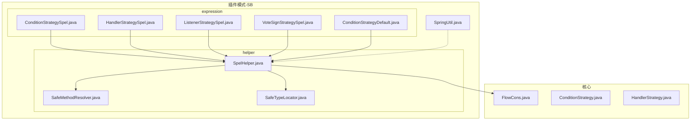
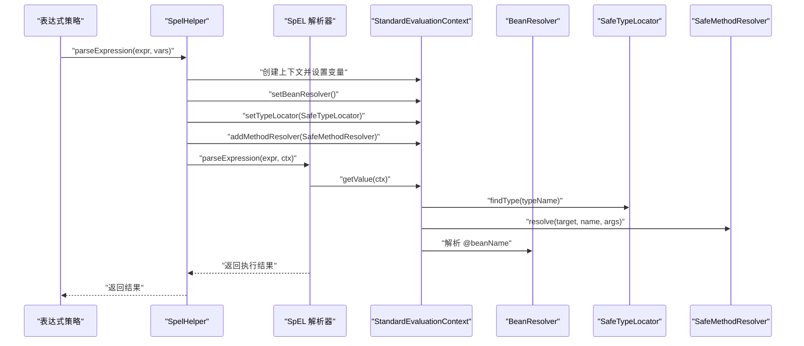
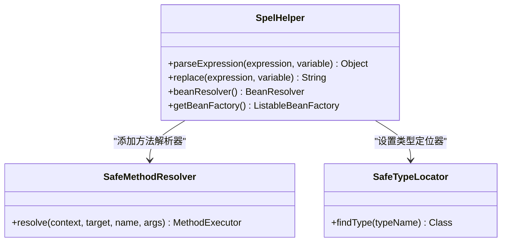
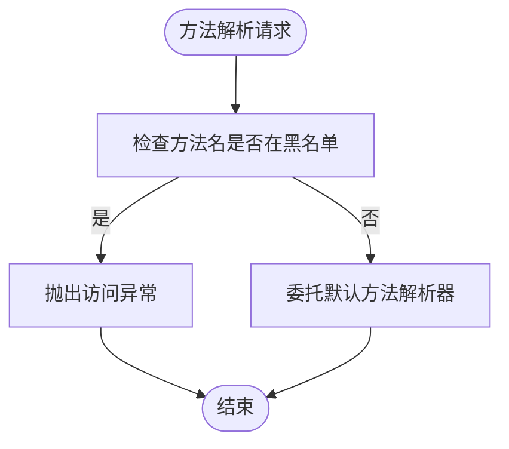
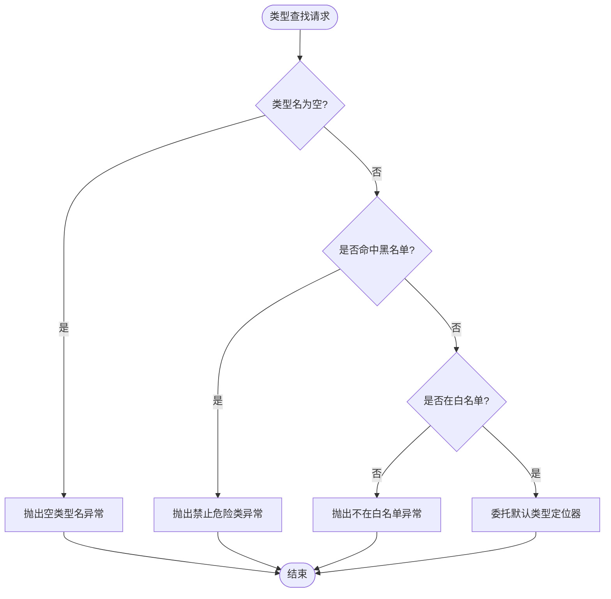
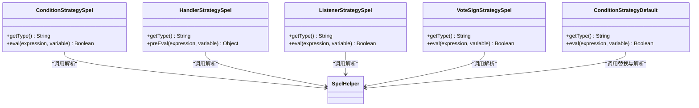
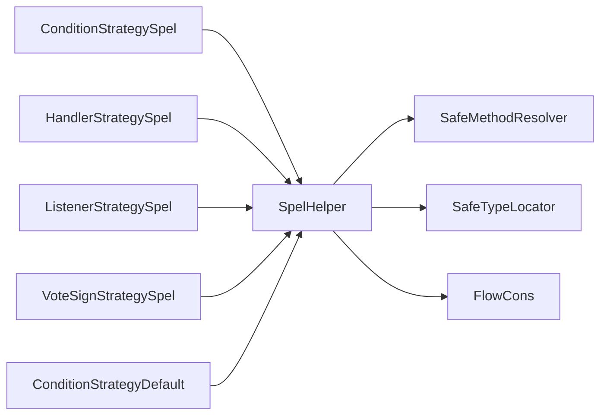

# SPeL 辅助工具

<cite>
**本文引用的文件**
- [SpelHelper.java](file://warm-flow-plugin/warm-flow-plugin-modes/warm-flow-plugin-modes-sb/src/main/java/org/dromara/warm/plugin/modes/sb/helper/SpelHelper.java)
- [SafeMethodResolver.java](file://warm-flow-plugin/warm-flow-plugin-modes/warm-flow-plugin-modes-sb/src/main/java/org/dromara/warm/plugin/modes/sb/helper/SafeMethodResolver.java)
- [SafeTypeLocator.java](file://warm-flow-plugin/warm-flow-plugin-modes/warm-flow-plugin-modes-sb/src/main/java/org/dromara/warm/plugin/modes/sb/helper/SafeTypeLocator.java)
- [ConditionStrategySpel.java](file://warm-flow-plugin/warm-flow-plugin-modes/warm-flow-plugin-modes-sb/src/main/java/org/dromara/warm/plugin/modes/sb/expression/ConditionStrategySpel.java)
- [HandlerStrategySpel.java](file://warm-flow-plugin/warm-flow-plugin-modes/warm-flow-plugin-modes-sb/src/main/java/org/dromara/warm/plugin/modes/sb/expression/HandlerStrategySpel.java)
- [ListenerStrategySpel.java](file://warm-flow-plugin/warm-flow-plugin-modes/warm-flow-plugin-modes-sb/src/main/java/org/dromara/warm/plugin/modes/sb/expression/ListenerStrategySpel.java)
- [VoteSignStrategySpel.java](file://warm-flow-plugin/warm-flow-plugin-modes/warm-flow-plugin-modes-sb/src/main/java/org/dromara/warm/plugin/modes/sb/expression/VoteSignStrategySpel.java)
- [ConditionStrategyDefault.java](file://warm-flow-plugin/warm-flow-plugin-modes/warm-flow-plugin-modes-sb/src/main/java/org/dromara/warm/plugin/modes/sb/expression/ConditionStrategyDefault.java)
- [FlowCons.java](file://warm-flow-core/src/main/java/org/dromara/warm/flow/core/constant/FlowCons.java)
- [ConditionStrategy.java](file://warm-flow-core/src/main/java/org/dromara/warm/flow/core/strategy/ConditionStrategy.java)
- [HandlerStrategy.java](file://warm-flow-core/src/main/java/org/dromara/warm/flow/core/strategy/HandlerStrategy.java)
- [SpringUtil.java](file://warm-flow-plugin/warm-flow-plugin-modes/warm-flow-plugin-modes-sb/src/main/java/org/dromara/warm/plugin/modes/sb/utils/SpringUtil.java)
</cite>

## 目录
1. [简介](#简介)
2. [项目结构](#项目结构)
3. [核心组件](#核心组件)
4. [架构总览](#架构总览)
5. [详细组件分析](#详细组件分析)
6. [依赖分析](#依赖分析)
7. [性能考虑](#性能考虑)
8. [故障排查指南](#故障排查指南)
9. [结论](#结论)
10. [附录](#附录)

## 简介
本文件面向 SPeL 辅助工具，系统化梳理 SpelHelper 的核心实现与安全机制，覆盖表达式解析器配置、安全方法解析、类型定位器、表达式缓存与性能优化、内存管理、异常处理与调试技巧等内容，并给出实际使用场景与最佳实践。

## 项目结构
SPeL 辅助工具位于 Spring Boot 模块中，围绕表达式策略扩展 SPeL 能力，提供条件、监听器、会签、以及“默认”表达式策略的 SPeL 版本。关键文件组织如下：
- helper：SpelHelper、SafeMethodResolver、SafeTypeLocator
- expression：条件、监听器、会签、默认策略的 SPeL 实现
- core.constant：FlowCons 常量（含 SPEL 标识）
- core.strategy：条件与处理器策略接口
- utils：SpringUtil 工具类

图表来源
- [SpelHelper.java:40-114](file://warm-flow-plugin/warm-flow-plugin-modes/warm-flow-plugin-modes-sb/src/main/java/org/dromara/warm/plugin/modes/sb/helper/SpelHelper.java#L40-L114)
- [SafeMethodResolver.java:23-54](file://warm-flow-plugin/warm-flow-plugin-modes/warm-flow-plugin-modes-sb/src/main/java/org/dromara/warm/plugin/modes/sb/helper/SafeMethodResolver.java#L23-L54)
- [SafeTypeLocator.java:41-112](file://warm-flow-plugin/warm-flow-plugin-modes/warm-flow-plugin-modes-sb/src/main/java/org/dromara/warm/plugin/modes/sb/helper/SafeTypeLocator.java#L41-L112)
- [ConditionStrategySpel.java:29-40](file://warm-flow-plugin/warm-flow-plugin-modes/warm-flow-plugin-modes-sb/src/main/java/org/dromara/warm/plugin/modes/sb/expression/ConditionStrategySpel.java#L29-L40)
- [HandlerStrategySpel.java:28-39](file://warm-flow-plugin/warm-flow-plugin-modes/warm-flow-plugin-modes-sb/src/main/java/org/dromara/warm/plugin/modes/sb/expression/HandlerStrategySpel.java#L28-L39)
- [ListenerStrategySpel.java:28-41](file://warm-flow-plugin/warm-flow-plugin-modes/warm-flow-plugin-modes-sb/src/main/java/org/dromara/warm/plugin/modes/sb/expression/ListenerStrategySpel.java#L28-L41)
- [VoteSignStrategySpel.java:29-40](file://warm-flow-plugin/warm-flow-plugin-modes/warm-flow-plugin-modes-sb/src/main/java/org/dromara/warm/plugin/modes/sb/expression/VoteSignStrategySpel.java#L29-L40)
- [ConditionStrategyDefault.java:30-40](file://warm-flow-plugin/warm-flow-plugin-modes/warm-flow-plugin-modes-sb/src/main/java/org/dromara/warm/plugin/modes/sb/expression/ConditionStrategyDefault.java#L30-L40)
- [FlowCons.java:25-84](file://warm-flow-core/src/main/java/org/dromara/warm/flow/core/constant/FlowCons.java#L25-L84)
- [ConditionStrategy.java:28-44](file://warm-flow-core/src/main/java/org/dromara/warm/flow/core/strategy/ConditionStrategy.java#L28-L44)
- [HandlerStrategy.java:29-60](file://warm-flow-core/src/main/java/org/dromara/warm/flow/core/strategy/HandlerStrategy.java#L29-L60)
- [SpringUtil.java:28-57](file://warm-flow-plugin/warm-flow-plugin-modes/warm-flow-plugin-modes-sb/src/main/java/org/dromara/warm/plugin/modes/sb/utils/SpringUtil.java#L28-L57)

章节来源
- [SpelHelper.java:40-114](file://warm-flow-plugin/warm-flow-plugin-modes/warm-flow-plugin-modes-sb/src/main/java/org/dromara/warm/plugin/modes/sb/helper/SpelHelper.java#L40-L114)
- [FlowCons.java:25-84](file://warm-flow-core/src/main/java/org/dromara/warm/flow/core/constant/FlowCons.java#L25-L84)

## 核心组件
- SpelHelper：提供表达式解析入口，封装 Spring Expression Language（SpEL）解析器、模板解析上下文、Bean 解析器、变量注入、安全上下文（类型定位器与方法解析器），并暴露替换工具方法。
- SafeMethodResolver：限制可调用方法集合，拦截高危方法（如 Runtime、反射、Unsafe 等相关 API），防止任意代码执行。
- SafeTypeLocator：白名单+黑名单结合的类型访问控制，仅允许有限基础类型与常用集合类型，拒绝危险类族（如 java.lang.reflect、sun.* 等）。
- 表达式策略适配：ConditionStrategySpel、HandlerStrategySpel、ListenerStrategySpel、VoteSignStrategySpel 将具体业务场景与 SpelHelper 对接；ConditionStrategyDefault 提供“默认”策略对表达式做占位符替换后再交由 Spel 执行。

章节来源
- [SpelHelper.java:40-114](file://warm-flow-plugin/warm-flow-plugin-modes/warm-flow-plugin-modes-sb/src/main/java/org/dromara/warm/plugin/modes/sb/helper/SpelHelper.java#L40-L114)
- [SafeMethodResolver.java:23-54](file://warm-flow-plugin/warm-flow-plugin-modes/warm-flow-plugin-modes-sb/src/main/java/org/dromara/warm/plugin/modes/sb/helper/SafeMethodResolver.java#L23-L54)
- [SafeTypeLocator.java:41-112](file://warm-flow-plugin/warm-flow-plugin-modes/warm-flow-plugin-modes-sb/src/main/java/org/dromara/warm/plugin/modes/sb/helper/SafeTypeLocator.java#L41-L112)
- [ConditionStrategySpel.java:29-40](file://warm-flow-plugin/warm-flow-plugin-modes/warm-flow-plugin-modes-sb/src/main/java/org/dromara/warm/plugin/modes/sb/expression/ConditionStrategySpel.java#L29-L40)
- [HandlerStrategySpel.java:28-39](file://warm-flow-plugin/warm-flow-plugin-modes/warm-flow-plugin-modes-sb/src/main/java/org/dromara/warm/plugin/modes/sb/expression/HandlerStrategySpel.java#L28-L39)
- [ListenerStrategySpel.java:28-41](file://warm-flow-plugin/warm-flow-plugin-modes/warm-flow-plugin-modes-sb/src/main/java/org/dromara/warm/plugin/modes/sb/expression/ListenerStrategySpel.java#L28-L41)
- [VoteSignStrategySpel.java:29-40](file://warm-flow-plugin/warm-flow-plugin-modes/warm-flow-plugin-modes-sb/src/main/java/org/dromara/warm/plugin/modes/sb/expression/VoteSignStrategySpel.java#L29-L40)
- [ConditionStrategyDefault.java:30-40](file://warm-flow-plugin/warm-flow-plugin-modes/warm-flow-plugin-modes-sb/src/main/java/org/dromara/warm/plugin/modes/sb/expression/ConditionStrategyDefault.java#L30-L40)

## 架构总览
下图展示从策略到解析器再到安全组件的整体调用链路，以及上下文构建与 Bean 解析器的协作方式。

图表来源
- [SpelHelper.java:64-86](file://warm-flow-plugin/warm-flow-plugin-modes/warm-flow-plugin-modes-sb/src/main/java/org/dromara/warm/plugin/modes/sb/helper/SpelHelper.java#L64-L86)
- [SafeMethodResolver.java:42-52](file://warm-flow-plugin/warm-flow-plugin-modes/warm-flow-plugin-modes-sb/src/main/java/org/dromara/warm/plugin/modes/sb/helper/SafeMethodResolver.java#L42-L52)
- [SafeTypeLocator.java:83-100](file://warm-flow-plugin/warm-flow-plugin-modes/warm-flow-plugin-modes-sb/src/main/java/org/dromara/warm/plugin/modes/sb/helper/SafeTypeLocator.java#L83-L100)

## 详细组件分析

### SpelHelper：表达式解析与安全上下文
- 角色与职责
  - 提供统一入口 parseExpression，负责构建 StandardEvaluationContext 并装配安全组件。
  - 维护 BeanResolver 单例，支持 @beanName 形式的 Bean 调用。
  - 提供 replace 方法，将默认策略中的占位符转换为 SpEL 变量形式。
  - 通过 ApplicationContextAware 注入 Spring 上下文，保证在非 Spring 环境下抛出明确异常。
- 关键点
  - 使用模板解析上下文，支持表达式模板语法。
  - 类型访问与方法调用均通过安全组件拦截，避免任意代码执行风险。
  - 变量注入与 Bean 解析器并行工作，满足复杂表达式场景。

图表来源
- [SpelHelper.java:40-114](file://warm-flow-plugin/warm-flow-plugin-modes/warm-flow-plugin-modes-sb/src/main/java/org/dromara/warm/plugin/modes/sb/helper/SpelHelper.java#L40-L114)
- [SafeMethodResolver.java:23-54](file://warm-flow-plugin/warm-flow-plugin-modes/warm-flow-plugin-modes-sb/src/main/java/org/dromara/warm/plugin/modes/sb/helper/SafeMethodResolver.java#L23-L54)
- [SafeTypeLocator.java:41-112](file://warm-flow-plugin/warm-flow-plugin-modes/warm-flow-plugin-modes-sb/src/main/java/org/dromara/warm/plugin/modes/sb/helper/SafeTypeLocator.java#L41-L112)

章节来源
- [SpelHelper.java:40-114](file://warm-flow-plugin/warm-flow-plugin-modes/warm-flow-plugin-modes-sb/src/main/java/org/dromara/warm/plugin/modes/sb/helper/SpelHelper.java#L40-L114)

### SafeMethodResolver：方法调用安全拦截
- 设计原则
  - 黑名单优先：对高危方法名称直接拦截，防止执行任意命令或反射操作。
  - 委托默认解析：未命中黑名单时委托给 DataBindingMethodResolver，保持常规方法可用。
- 性能影响
  - 每次方法解析都会进行一次集合查找，但集合规模小、查找成本低，对整体性能影响可忽略。
- 安全收益
  - 有效阻断 Runtime.exec、Class.forName、Unsafe、反射 API 等高危路径。

图表来源
- [SafeMethodResolver.java:25-52](file://warm-flow-plugin/warm-flow-plugin-modes/warm-flow-plugin-modes-sb/src/main/java/org/dromara/warm/plugin/modes/sb/helper/SafeMethodResolver.java#L25-L52)

章节来源
- [SafeMethodResolver.java:23-54](file://warm-flow-plugin/warm-flow-plugin-modes/warm-flow-plugin-modes-sb/src/main/java/org/dromara/warm/plugin/modes/sb/helper/SafeMethodResolver.java#L23-L54)

### SafeTypeLocator：类型访问白名单+黑名单
- 设计原则
  - 黑名单：禁止 java.lang.reflect、sun.*、System、Runtime、ProcessBuilder 等危险包与类。
  - 白名单：允许常用基础类型与集合类型，满足常见表达式计算需求。
  - 前缀匹配：对危险类族进行前缀匹配，避免漏网之鱼。
- 异常策略
  - 空类型名直接抛错；命中黑名单或不在白名单即抛错，保证类型访问可控。
- 性能与扩展
  - 查找为 O(k)（k 为黑名单大小），成本极低；可通过维护 allowedClasses 扩展受控类型。

图表来源
- [SafeTypeLocator.java:83-109](file://warm-flow-plugin/warm-flow-plugin-modes/warm-flow-plugin-modes-sb/src/main/java/org/dromara/warm/plugin/modes/sb/helper/SafeTypeLocator.java#L83-L109)

章节来源
- [SafeTypeLocator.java:41-112](file://warm-flow-plugin/warm-flow-plugin-modes/warm-flow-plugin-modes-sb/src/main/java/org/dromara/warm/plugin/modes/sb/helper/SafeTypeLocator.java#L41-L112)

### 表达式策略适配层
- ConditionStrategySpel：将表达式作为布尔条件执行，返回 true/false。
- HandlerStrategySpel：预计算表达式，返回用户 ID 列表或数组，再由 HandlerStrategy.afterEval 统一转为字符串列表。
- ListenerStrategySpel：执行表达式以判定监听器匹配，恒返回 true 以配合扩展策略。
- VoteSignStrategySpel：会签场景下的布尔表达式求值。
- ConditionStrategyDefault：对“默认”表达式进行占位符替换，再交由 Spel 执行。

图表来源
- [ConditionStrategySpel.java:29-40](file://warm-flow-plugin/warm-flow-plugin-modes/warm-flow-plugin-modes-sb/src/main/java/org/dromara/warm/plugin/modes/sb/expression/ConditionStrategySpel.java#L29-L40)
- [HandlerStrategySpel.java:28-39](file://warm-flow-plugin/warm-flow-plugin-modes/warm-flow-plugin-modes-sb/src/main/java/org/dromara/warm/plugin/modes/sb/expression/HandlerStrategySpel.java#L28-L39)
- [ListenerStrategySpel.java:28-41](file://warm-flow-plugin/warm-flow-plugin-modes/warm-flow-plugin-modes-sb/src/main/java/org/dromara/warm/plugin/modes/sb/expression/ListenerStrategySpel.java#L28-L41)
- [VoteSignStrategySpel.java:29-40](file://warm-flow-plugin/warm-flow-plugin-modes/warm-flow-plugin-modes-sb/src/main/java/org/dromara/warm/plugin/modes/sb/expression/VoteSignStrategySpel.java#L29-L40)
- [ConditionStrategyDefault.java:30-40](file://warm-flow-plugin/warm-flow-plugin-modes/warm-flow-plugin-modes-sb/src/main/java/org/dromara/warm/plugin/modes/sb/expression/ConditionStrategyDefault.java#L30-L40)
- [SpelHelper.java:64-86](file://warm-flow-plugin/warm-flow-plugin-modes/warm-flow-plugin-modes-sb/src/main/java/org/dromara/warm/plugin/modes/sb/helper/SpelHelper.java#L64-L86)

章节来源
- [ConditionStrategySpel.java:29-40](file://warm-flow-plugin/warm-flow-plugin-modes/warm-flow-plugin-modes-sb/src/main/java/org/dromara/warm/plugin/modes/sb/expression/ConditionStrategySpel.java#L29-L40)
- [HandlerStrategySpel.java:28-39](file://warm-flow-plugin/warm-flow-plugin-modes/warm-flow-plugin-modes-sb/src/main/java/org/dromara/warm/plugin/modes/sb/expression/HandlerStrategySpel.java#L28-L39)
- [ListenerStrategySpel.java:28-41](file://warm-flow-plugin/warm-flow-plugin-modes/warm-flow-plugin-modes-sb/src/main/java/org/dromara/warm/plugin/modes/sb/expression/ListenerStrategySpel.java#L28-L41)
- [VoteSignStrategySpel.java:29-40](file://warm-flow-plugin/warm-flow-plugin-modes/warm-flow-plugin-modes-sb/src/main/java/org/dromara/warm/plugin/modes/sb/expression/VoteSignStrategySpel.java#L29-L40)
- [ConditionStrategyDefault.java:30-40](file://warm-flow-plugin/warm-flow-plugin-modes/warm-flow-plugin-modes-sb/src/main/java/org/dromara/warm/plugin/modes/sb/expression/ConditionStrategyDefault.java#L30-L40)
- [HandlerStrategy.java:29-60](file://warm-flow-core/src/main/java/org/dromara/warm/flow/core/strategy/HandlerStrategy.java#L29-L60)
- [ConditionStrategy.java:28-44](file://warm-flow-core/src/main/java/org/dromara/warm/flow/core/strategy/ConditionStrategy.java#L28-L44)
- [FlowCons.java:25-84](file://warm-flow-core/src/main/java/org/dromara/warm/flow/core/constant/FlowCons.java#L25-L84)

## 依赖分析
- 组件耦合
  - SpelHelper 与安全组件解耦良好，通过 EvaluationContext 注入，便于替换与扩展。
  - 表达式策略仅依赖 SpelHelper 接口，不直接依赖 Spring，利于测试与移植。
- 外部依赖
  - Spring Expression Language（SpEL）、Spring BeanFactoryResolver、StandardTypeLocator。
- 循环依赖
  - 未发现循环依赖迹象；各组件职责清晰，边界明确。

图表来源
- [SpelHelper.java:40-114](file://warm-flow-plugin/warm-flow-plugin-modes/warm-flow-plugin-modes-sb/src/main/java/org/dromara/warm/plugin/modes/sb/helper/SpelHelper.java#L40-L114)
- [ConditionStrategySpel.java:29-40](file://warm-flow-plugin/warm-flow-plugin-modes/warm-flow-plugin-modes-sb/src/main/java/org/dromara/warm/plugin/modes/sb/expression/ConditionStrategySpel.java#L29-L40)
- [HandlerStrategySpel.java:28-39](file://warm-flow-plugin/warm-flow-plugin-modes/warm-flow-plugin-modes-sb/src/main/java/org/dromara/warm/plugin/modes/sb/expression/HandlerStrategySpel.java#L28-L39)
- [ListenerStrategySpel.java:28-41](file://warm-flow-plugin/warm-flow-plugin-modes/warm-flow-plugin-modes-sb/src/main/java/org/dromara/warm/plugin/modes/sb/expression/ListenerStrategySpel.java#L28-L41)
- [VoteSignStrategySpel.java:29-40](file://warm-flow-plugin/warm-flow-plugin-modes/warm-flow-plugin-modes-sb/src/main/java/org/dromara/warm/plugin/modes/sb/expression/VoteSignStrategySpel.java#L29-L40)
- [ConditionStrategyDefault.java:30-40](file://warm-flow-plugin/warm-flow-plugin-modes/warm-flow-plugin-modes-sb/src/main/java/org/dromara/warm/plugin/modes/sb/expression/ConditionStrategyDefault.java#L30-L40)
- [FlowCons.java:25-84](file://warm-flow-core/src/main/java/org/dromara/warm/flow/core/constant/FlowCons.java#L25-L84)

章节来源
- [SpelHelper.java:40-114](file://warm-flow-plugin/warm-flow-plugin-modes/warm-flow-plugin-modes-sb/src/main/java/org/dromara/warm/plugin/modes/sb/helper/SpelHelper.java#L40-L114)
- [FlowCons.java:25-84](file://warm-flow-core/src/main/java/org/dromara/warm/flow/core/constant/FlowCons.java#L25-L84)

## 性能考虑
- 解析器与上下文复用
  - 解析器与模板上下文为静态常量，避免重复创建带来的开销。
  - BeanResolver 采用懒加载单例，首次使用时初始化，后续复用。
- 安全组件开销
  - SafeMethodResolver 与 SafeTypeLocator 的查找成本极低，对整体性能影响可忽略。
- 表达式缓存
  - 当前实现未内置表达式编译结果缓存。若存在高频重复表达式，建议在业务侧引入缓存层（例如基于表达式文本与变量签名的组合键缓存）以减少解析成本。
- 内存管理
  - StandardEvaluationContext 与解析器对象生命周期与应用一致；避免在热路径中频繁创建临时上下文。
  - 变量 Map 建议复用，避免大对象频繁分配。
- 并发与线程安全
  - 解析器与上下文默认非线程安全，建议在多线程场景下为每个线程创建独立上下文，或在业务层加锁保护共享上下文。

[本节为通用性能建议，不直接分析具体文件，故无章节来源]

## 故障排查指南
- 常见异常与定位
  - “禁止危险类”或“不在白名单”：检查表达式中是否引用了黑名单或未列入白名单的类型。
  - “不允许调用方法”：表达式中调用了黑名单方法，需更换安全替代方案。
  - “未注入 ApplicationContext”：在非 Spring 环境或未正确注册组件时出现，需确保 SpelHelper 正常初始化。
  - “类型名为空”：表达式模板语法错误或变量缺失导致类型名为空。
- 调试技巧
  - 在 SpelHelper.parseExpression 入口处打印表达式与变量摘要，快速定位问题。
  - 使用最小化表达式复现问题，逐步加入复杂度，缩小范围。
  - 对于 Bean 调用失败，确认 @beanName 是否存在且可注入。
- 运维监控
  - 记录表达式解析耗时与失败率，识别热点与异常表达式。
  - 对高危表达式（涉及反射、系统类）建立告警阈值。

章节来源
- [SpelHelper.java:95-101](file://warm-flow-plugin/warm-flow-plugin-modes/warm-flow-plugin-modes-sb/src/main/java/org/dromara/warm/plugin/modes/sb/helper/SpelHelper.java#L95-L101)
- [SafeTypeLocator.java:83-100](file://warm-flow-plugin/warm-flow-plugin-modes/warm-flow-plugin-modes-sb/src/main/java/org/dromara/warm/plugin/modes/sb/helper/SafeTypeLocator.java#L83-L100)
- [SafeMethodResolver.java:42-52](file://warm-flow-plugin/warm-flow-plugin-modes/warm-flow-plugin-modes-sb/src/main/java/org/dromara/warm/plugin/modes/sb/helper/SafeMethodResolver.java#L42-L52)

## 结论
SPeL 辅助工具通过 SpelHelper 将 Spring SpEL 与安全组件无缝集成，形成“模板解析 + 变量注入 + 安全上下文”的完整执行链路。SafeMethodResolver 与 SafeTypeLocator 构成双重安全屏障，有效降低表达式执行风险。在性能方面，静态解析器与懒加载 BeanResolver 已具备一定优化基础；对于高频场景，可在业务层引入表达式结果缓存以进一步提升吞吐。整体设计清晰、边界明确，易于扩展与维护。

[本节为总结性内容，不直接分析具体文件，故无章节来源]

## 附录

### 实际使用示例（步骤说明）
以下示例以路径代替具体代码内容，帮助读者快速定位实现位置与调用方式。

- 条件表达式求值
  - 使用路径：[ConditionStrategySpel.java:36-39](file://warm-flow-plugin/warm-flow-plugin-modes/warm-flow-plugin-modes-sb/src/main/java/org/dromara/warm/plugin/modes/sb/expression/ConditionStrategySpel.java#L36-L39)
  - 调用 SpelHelper.parseExpression 执行布尔表达式，返回 true/false。
- 办理人表达式预计算
  - 使用路径：[HandlerStrategySpel.java:35-38](file://warm-flow-plugin/warm-flow-plugin-modes/warm-flow-plugin-modes-sb/src/main/java/org/dromara/warm/plugin/modes/sb/expression/HandlerStrategySpel.java#L35-L38)
  - 调用 SpelHelper.parseExpression 返回用户 ID 或数组，再由 HandlerStrategy.afterEval 统一转换为字符串列表。
- 监听器表达式匹配
  - 使用路径：[ListenerStrategySpel.java:35-40](file://warm-flow-plugin/warm-flow-plugin-modes/warm-flow-plugin-modes-sb/src/main/java/org/dromara/warm/plugin/modes/sb/expression/ListenerStrategySpel.java#L35-L40)
  - 调用 SpelHelper.parseExpression 执行表达式，恒返回 true 以标记匹配。
- 会签表达式求值
  - 使用路径：[VoteSignStrategySpel.java:36-39](file://warm-flow-plugin/warm-flow-plugin-modes/warm-flow-plugin-modes-sb/src/main/java/org/dromara/warm/plugin/modes/sb/expression/VoteSignStrategySpel.java#L36-L39)
  - 调用 SpelHelper.parseExpression 执行布尔表达式。
- 默认策略表达式替换与执行
  - 使用路径：[ConditionStrategyDefault.java:37-40](file://warm-flow-plugin/warm-flow-plugin-modes/warm-flow-plugin-modes-sb/src/main/java/org/dromara/warm/plugin/modes/sb/expression/ConditionStrategyDefault.java#L37-L40)
  - 先调用 SpelHelper.replace 将占位符替换为 #key 形式，再交由 Spel 执行。

章节来源
- [ConditionStrategySpel.java:36-39](file://warm-flow-plugin/warm-flow-plugin-modes/warm-flow-plugin-modes-sb/src/main/java/org/dromara/warm/plugin/modes/sb/expression/ConditionStrategySpel.java#L36-L39)
- [HandlerStrategySpel.java:35-38](file://warm-flow-plugin/warm-flow-plugin-modes/warm-flow-plugin-modes-sb/src/main/java/org/dromara/warm/plugin/modes/sb/expression/HandlerStrategySpel.java#L35-L38)
- [ListenerStrategySpel.java:35-40](file://warm-flow-plugin/warm-flow-plugin-modes/warm-flow-plugin-modes-sb/src/main/java/org/dromara/warm/plugin/modes/sb/expression/ListenerStrategySpel.java#L35-L40)
- [VoteSignStrategySpel.java:36-39](file://warm-flow-plugin/warm-flow-plugin-modes/warm-flow-plugin-modes-sb/src/main/java/org/dromara/warm/plugin/modes/sb/expression/VoteSignStrategySpel.java#L36-L39)
- [ConditionStrategyDefault.java:37-40](file://warm-flow-plugin/warm-flow-plugin-modes/warm-flow-plugin-modes-sb/src/main/java/org/dromara/warm/plugin/modes/sb/expression/ConditionStrategyDefault.java#L37-L40)