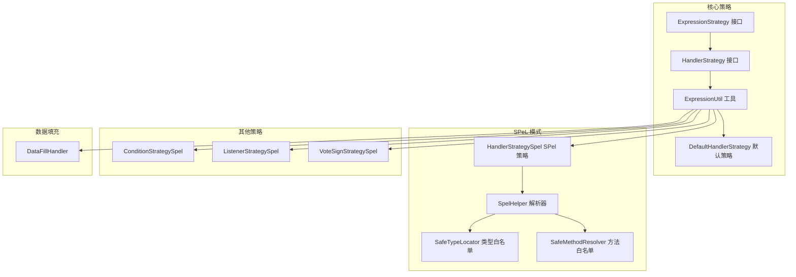
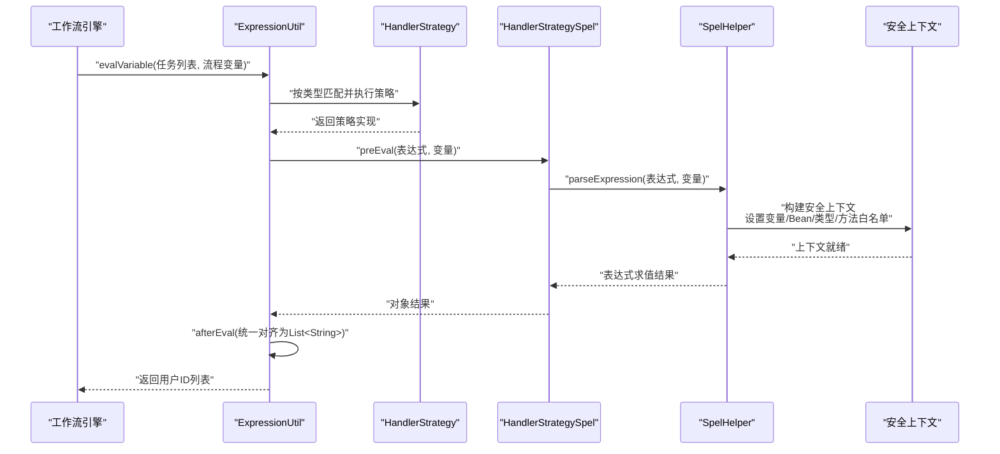
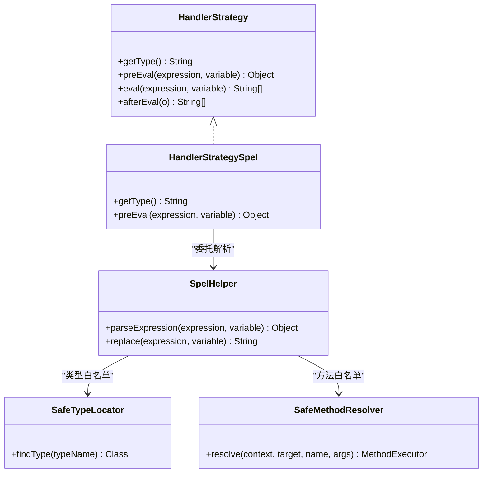
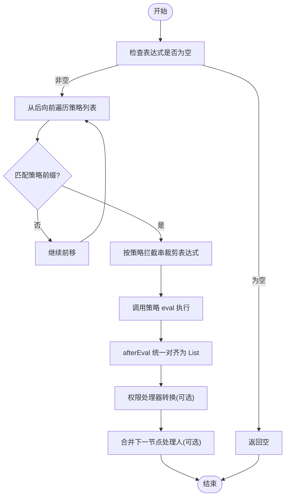
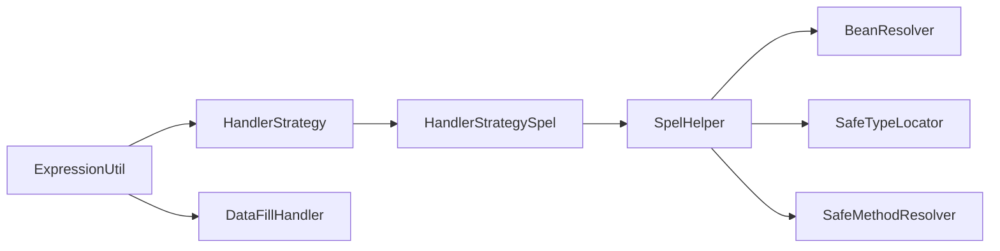

# 处理器策略

<cite>
**本文引用的文件**
- [warm-flow-core/src/main/java/org/dromara/warm/flow/core/strategy/ExpressionStrategy.java](file://warm-flow-core/src/main/java/org/dromara/warm/flow/core/strategy/ExpressionStrategy.java)
- [warm-flow-core/src/main/java/org/dromara/warm/flow/core/strategy/HandlerStrategy.java](file://warm-flow-core/src/main/java/org/dromara/warm/flow/core/strategy/HandlerStrategy.java)
- [warm-flow-core/src/main/java/org/dromara/warm/flow/core/utils/ExpressionUtil.java](file://warm-flow-core/src/main/java/org/dromara/warm/flow/core/utils/ExpressionUtil.java)
- [warm-flow-core/src/main/java/org/dromara/warm/flow/core/handler/DataFillHandler.java](file://warm-flow-core/src/main/java/org/dromara/warm/flow/core/handler/DataFillHandler.java)
- [warm-flow-core/src/main/java/org/dromara/warm/flow/core/handler/DefaultHandlerStrategy.java](file://warm-flow-core/src/main/java/org/dromara/warm/flow/core/handler/DefaultHandlerStrategy.java)
- [warm-flow-plugin/warm-flow-plugin-modes/warm-flow-plugin-modes-sb/src/main/java/org/dromara/warm/plugin/modes/sb/expression/HandlerStrategySpel.java](file://warm-flow-plugin/warm-flow-plugin-modes/warm-flow-plugin-modes-sb/src/main/java/org/dromara/warm/plugin/modes/sb/expression/HandlerStrategySpel.java)
- [warm-flow-plugin/warm-flow-plugin-modes/warm-flow-plugin-modes-sb/src/main/java/org/dromara/warm/plugin/modes/sb/helper/SpelHelper.java](file://warm-flow-plugin/warm-flow-plugin-modes/warm-flow-plugin-modes-sb/src/main/java/org/dromara/warm/plugin/modes/sb/helper/SpelHelper.java)
- [warm-flow-plugin/warm-flow-plugin-modes/warm-flow-plugin-modes-sb/src/main/java/org/dromara/warm/plugin/modes/sb/helper/SafeMethodResolver.java](file://warm-flow-plugin/warm-flow-plugin-modes/warm-flow-plugin-modes-sb/src/main/java/org/dromara/warm/plugin/modes/sb/helper/SafeMethodResolver.java)
- [warm-flow-plugin/warm-flow-plugin-modes/warm-flow-plugin-modes-sb/src/main/java/org/dromara/warm/plugin/modes/sb/helper/SafeTypeLocator.java](file://warm-flow-plugin/warm-flow-plugin-modes/warm-flow-plugin-modes-sb/src/main/java/org/dromara/warm/plugin/modes/sb/helper/SafeTypeLocator.java)
- [warm-flow-plugin/warm-flow-plugin-modes/warm-flow-plugin-modes-sb/src/main/java/org/dromara/warm/plugin/modes/sb/expression/ConditionStrategySpel.java](file://warm-flow-plugin/warm-flow-plugin-modes/warm-flow-plugin-modes-sb/src/main/java/org/dromara/warm/plugin/modes/sb/expression/ConditionStrategySpel.java)
- [warm-flow-plugin/warm-flow-plugin-modes/warm-flow-plugin-modes-sb/src/main/java/org/dromara/warm/plugin/modes/sb/expression/ListenerStrategySpel.java](file://warm-flow-plugin/warm-flow-plugin-modes/warm-flow-plugin-modes-sb/src/main/java/org/dromara/warm/plugin/modes/sb/expression/ListenerStrategySpel.java)
- [warm-flow-plugin/warm-flow-plugin-modes/warm-flow-plugin-modes-sb/src/main/java/org/dromara/warm/plugin/modes/sb/expression/VoteSignStrategySpel.java](file://warm-flow-plugin/warm-flow-plugin-modes/warm-flow-plugin-modes-sb/src/main/java/org/dromara/warm/plugin/modes/sb/expression/VoteSignStrategySpel.java)
</cite>

## 目录
1. [简介](#简介)
2. [项目结构](#项目结构)
3. [核心组件](#核心组件)
4. [架构总览](#架构总览)
5. [组件详解](#组件详解)
6. [依赖关系分析](#依赖关系分析)
7. [性能考量](#性能考量)
8. [故障排查指南](#故障排查指南)
9. [结论](#结论)
10. [附录](#附录)

## 简介
本文件围绕处理器策略（HandlerStrategy）展开，重点解析 HandlerStrategySpel 的实现原理与工作机制，涵盖表达式支持、变量绑定、动态数据计算、与工作流引擎的集成方式，以及在节点执行过程中动态计算和填充数据的实践路径。同时给出表达式语法的应用场景、执行上下文与变量作用域、异常处理等技术要点，并通过代码片段路径指引读者快速定位实现细节。

## 项目结构
处理器策略位于核心模块与模式插件模块中：
- 核心策略接口与工具：ExpressionStrategy、HandlerStrategy、ExpressionUtil
- 默认处理器策略：DefaultHandlerStrategy
- SPeL 模式处理器：HandlerStrategySpel、SpelHelper、SafeTypeLocator、SafeMethodResolver
- 其他策略对照：ConditionStrategySpel、ListenerStrategySpel、VoteSignStrategySpel
- 数据填充处理器：DataFillHandler（与变量/权限填充流程协同）

图表来源
- [warm-flow-core/src/main/java/org/dromara/warm/flow/core/strategy/ExpressionStrategy.java:25-60](file://warm-flow-core/src/main/java/org/dromara/warm/flow/core/strategy/ExpressionStrategy.java#L25-L60)
- [warm-flow-core/src/main/java/org/dromara/warm/flow/core/strategy/HandlerStrategy.java:29-60](file://warm-flow-core/src/main/java/org/dromara/warm/flow/core/strategy/HandlerStrategy.java#L29-L60)
- [warm-flow-core/src/main/java/org/dromara/warm/flow/core/utils/ExpressionUtil.java:36-195](file://warm-flow-core/src/main/java/org/dromara/warm/flow/core/utils/ExpressionUtil.java#L36-L195)
- [warm-flow-core/src/main/java/org/dromara/warm/flow/core/handler/DefaultHandlerStrategy.java:27-40](file://warm-flow-core/src/main/java/org/dromara/warm/flow/core/handler/DefaultHandlerStrategy.java#L27-L40)
- [warm-flow-plugin/warm-flow-plugin-modes/warm-flow-plugin-modes-sb/src/main/java/org/dromara/warm/plugin/modes/sb/expression/HandlerStrategySpel.java:28-39](file://warm-flow-plugin/warm-flow-plugin-modes/warm-flow-plugin-modes-sb/src/main/java/org/dromara/warm/plugin/modes/sb/expression/HandlerStrategySpel.java#L28-L39)
- [warm-flow-plugin/warm-flow-plugin-modes/warm-flow-plugin-modes-sb/src/main/java/org/dromara/warm/plugin/modes/sb/helper/SpelHelper.java:41-113](file://warm-flow-plugin/warm-flow-plugin-modes/warm-flow-plugin-modes-sb/src/main/java/org/dromara/warm/plugin/modes/sb/helper/SpelHelper.java#L41-L113)
- [warm-flow-plugin/warm-flow-plugin-modes/warm-flow-plugin-modes-sb/src/main/java/org/dromara/warm/plugin/modes/sb/helper/SafeTypeLocator.java:41-112](file://warm-flow-plugin/warm-flow-plugin-modes/warm-flow-plugin-modes-sb/src/main/java/org/dromara/warm/plugin/modes/sb/helper/SafeTypeLocator.java#L41-L112)
- [warm-flow-plugin/warm-flow-plugin-modes/warm-flow-plugin-modes-sb/src/main/java/org/dromara/warm/plugin/modes/sb/helper/SafeMethodResolver.java:23-53](file://warm-flow-plugin/warm-flow-plugin-modes/warm-flow-plugin-modes-sb/src/main/java/org/dromara/warm/plugin/modes/sb/helper/SafeMethodResolver.java#L23-L53)
- [warm-flow-plugin/warm-flow-plugin-modes/warm-flow-plugin-modes-sb/src/main/java/org/dromara/warm/plugin/modes/sb/expression/ConditionStrategySpel.java:29-40](file://warm-flow-plugin/warm-flow-plugin-modes/warm-flow-plugin-modes-sb/src/main/java/org/dromara/warm/plugin/modes/sb/expression/ConditionStrategySpel.java#L29-L40)
- [warm-flow-plugin/warm-flow-plugin-modes/warm-flow-plugin-modes-sb/src/main/java/org/dromara/warm/plugin/modes/sb/expression/ListenerStrategySpel.java:28-41](file://warm-flow-plugin/warm-flow-plugin-modes/warm-flow-plugin-modes-sb/src/main/java/org/dromara/warm/plugin/modes/sb/expression/ListenerStrategySpel.java#L28-L41)
- [warm-flow-plugin/warm-flow-plugin-modes/warm-flow-plugin-modes-sb/src/main/java/org/dromara/warm/plugin/modes/sb/expression/VoteSignStrategySpel.java:29-40](file://warm-flow-plugin/warm-flow-plugin-modes/warm-flow-plugin-modes-sb/src/main/java/org/dromara/warm/plugin/modes/sb/expression/VoteSignStrategySpel.java#L29-L40)
- [warm-flow-core/src/main/java/org/dromara/warm/flow/core/handler/DataFillHandler.java:35-104](file://warm-flow-core/src/main/java/org/dromara/warm/flow/core/handler/DataFillHandler.java#L35-L104)

章节来源
- [warm-flow-core/src/main/java/org/dromara/warm/flow/core/strategy/ExpressionStrategy.java:25-60](file://warm-flow-core/src/main/java/org/dromara/warm/flow/core/strategy/ExpressionStrategy.java#L25-L60)
- [warm-flow-core/src/main/java/org/dromara/warm/flow/core/strategy/HandlerStrategy.java:29-60](file://warm-flow-core/src/main/java/org/dromara/warm/flow/core/strategy/HandlerStrategy.java#L29-L60)
- [warm-flow-core/src/main/java/org/dromara/warm/flow/core/utils/ExpressionUtil.java:36-195](file://warm-flow-core/src/main/java/org/dromara/warm/flow/core/utils/ExpressionUtil.java#L36-L195)

## 核心组件
- 表达式策略接口：定义 getType、eval、interceptStr、setExpression 等统一能力，支撑多策略注册与按类型分发。
- 办理人策略接口：在表达式策略基础上，约定返回值为用户ID列表，并提供默认的后处理逻辑（兼容数组/集合/单值）。
- 表达式工具：负责策略注册、按类型匹配、执行表达式、变量注入、异常处理与后续处理（如权限转换、下一节点处理人合并）。
- 默认处理器策略：基于占位符 ${var} 的简单变量映射。
- SPeL 处理器策略：基于 Spring SpEL 的表达式解析，提供安全的类型与方法白名单、Spring Bean 解析能力。
- 数据填充处理器：贯穿实体生命周期的 ID、创建/更新时间与经办人填充，与权限处理器配合完成上下文注入。

章节来源
- [warm-flow-core/src/main/java/org/dromara/warm/flow/core/strategy/ExpressionStrategy.java:25-60](file://warm-flow-core/src/main/java/org/dromara/warm/flow/core/strategy/ExpressionStrategy.java#L25-L60)
- [warm-flow-core/src/main/java/org/dromara/warm/flow/core/strategy/HandlerStrategy.java:29-60](file://warm-flow-core/src/main/java/org/dromara/warm/flow/core/strategy/HandlerStrategy.java#L29-L60)
- [warm-flow-core/src/main/java/org/dromara/warm/flow/core/utils/ExpressionUtil.java:36-195](file://warm-flow-core/src/main/java/org/dromara/warm/flow/core/utils/ExpressionUtil.java#L36-L195)
- [warm-flow-core/src/main/java/org/dromara/warm/flow/core/handler/DefaultHandlerStrategy.java:27-40](file://warm-flow-core/src/main/java/org/dromara/warm/flow/core/handler/DefaultHandlerStrategy.java#L27-L40)
- [warm-flow-plugin/warm-flow-plugin-modes/warm-flow-plugin-modes-sb/src/main/java/org/dromara/warm/plugin/modes/sb/expression/HandlerStrategySpel.java:28-39](file://warm-flow-plugin/warm-flow-plugin-modes/warm-flow-plugin-modes-sb/src/main/java/org/dromara/warm/plugin/modes/sb/expression/HandlerStrategySpel.java#L28-L39)
- [warm-flow-plugin/warm-flow-plugin-modes/warm-flow-plugin-modes-sb/src/main/java/org/dromara/warm/plugin/modes/sb/helper/SpelHelper.java:41-113](file://warm-flow-plugin/warm-flow-plugin-modes/warm-flow-plugin-modes-sb/src/main/java/org/dromara/warm/plugin/modes/sb/helper/SpelHelper.java#L41-L113)
- [warm-flow-core/src/main/java/org/dromara/warm/flow/core/handler/DataFillHandler.java:35-104](file://warm-flow-core/src/main/java/org/dromara/warm/flow/core/handler/DataFillHandler.java#L35-L104)

## 架构总览
处理器策略与工作流引擎的集成路径如下：
- 在初始化阶段，ExpressionUtil 注册各类策略（含默认与 SPeL 办理人策略）。
- 在节点执行时，ExpressionUtil.evalVariable 遍历待添加的任务，对每个任务的权限表达式进行解析与转换。
- 若表达式以特定类型前缀开头，则由对应策略实现解析；SPeL 策略通过 SpelHelper 构建安全的评估上下文，注入变量与 Spring Bean，执行表达式并返回用户ID列表。
- 解析结果经过统一后处理（去重、合并），并与权限处理器协作完成最终的用户ID集合。

图表来源
- [warm-flow-core/src/main/java/org/dromara/warm/flow/core/utils/ExpressionUtil.java:81-122](file://warm-flow-core/src/main/java/org/dromara/warm/flow/core/utils/ExpressionUtil.java#L81-L122)
- [warm-flow-core/src/main/java/org/dromara/warm/flow/core/strategy/HandlerStrategy.java:41-59](file://warm-flow-core/src/main/java/org/dromara/warm/flow/core/strategy/HandlerStrategy.java#L41-L59)
- [warm-flow-plugin/warm-flow-plugin-modes/warm-flow-plugin-modes-sb/src/main/java/org/dromara/warm/plugin/modes/sb/expression/HandlerStrategySpel.java:30-38](file://warm-flow-plugin/warm-flow-plugin-modes/warm-flow-plugin-modes-sb/src/main/java/org/dromara/warm/plugin/modes/sb/expression/HandlerStrategySpel.java#L30-L38)
- [warm-flow-plugin/warm-flow-plugin-modes/warm-flow-plugin-modes-sb/src/main/java/org/dromara/warm/plugin/modes/sb/helper/SpelHelper.java:64-86](file://warm-flow-plugin/warm-flow-plugin-modes/warm-flow-plugin-modes-sb/src/main/java/org/dromara/warm/plugin/modes/sb/helper/SpelHelper.java#L64-L86)

## 组件详解

### HandlerStrategySpel：SPeL 办理人策略
- 类型标识：getType 返回策略前缀，用于表达式分发。
- 预解析：preEval 将表达式与变量交由 SpelHelper 解析，返回任意对象。
- 后处理：HandlerStrategy.afterEval 将返回对象统一对齐为 List<String>，兼容集合、数组与单值。
- 安全性：SpelHelper 使用安全上下文，限制类型与方法访问，支持 Spring Bean 解析。

图表来源
- [warm-flow-core/src/main/java/org/dromara/warm/flow/core/strategy/HandlerStrategy.java:29-60](file://warm-flow-core/src/main/java/org/dromara/warm/flow/core/strategy/HandlerStrategy.java#L29-L60)
- [warm-flow-plugin/warm-flow-plugin-modes/warm-flow-plugin-modes-sb/src/main/java/org/dromara/warm/plugin/modes/sb/expression/HandlerStrategySpel.java:28-39](file://warm-flow-plugin/warm-flow-plugin-modes/warm-flow-plugin-modes-sb/src/main/java/org/dromara/warm/plugin/modes/sb/expression/HandlerStrategySpel.java#L28-L39)
- [warm-flow-plugin/warm-flow-plugin-modes/warm-flow-plugin-modes-sb/src/main/java/org/dromara/warm/plugin/modes/sb/helper/SpelHelper.java:41-113](file://warm-flow-plugin/warm-flow-plugin-modes/warm-flow-plugin-modes-sb/src/main/java/org/dromara/warm/plugin/modes/sb/helper/SpelHelper.java#L41-L113)
- [warm-flow-plugin/warm-flow-plugin-modes/warm-flow-plugin-modes-sb/src/main/java/org/dromara/warm/plugin/modes/sb/helper/SafeTypeLocator.java:41-112](file://warm-flow-plugin/warm-flow-plugin-modes/warm-flow-plugin-modes-sb/src/main/java/org/dromara/warm/plugin/modes/sb/helper/SafeTypeLocator.java#L41-L112)
- [warm-flow-plugin/warm-flow-plugin-modes/warm-flow-plugin-modes-sb/src/main/java/org/dromara/warm/plugin/modes/sb/helper/SafeMethodResolver.java:23-53](file://warm-flow-plugin/warm-flow-plugin-modes/warm-flow-plugin-modes-sb/src/main/java/org/dromara/warm/plugin/modes/sb/helper/SafeMethodResolver.java#L23-L53)

章节来源
- [warm-flow-plugin/warm-flow-plugin-modes/warm-flow-plugin-modes-sb/src/main/java/org/dromara/warm/plugin/modes/sb/expression/HandlerStrategySpel.java:28-39](file://warm-flow-plugin/warm-flow-plugin-modes/warm-flow-plugin-modes-sb/src/main/java/org/dromara/warm/plugin/modes/sb/expression/HandlerStrategySpel.java#L28-L39)
- [warm-flow-plugin/warm-flow-plugin-modes/warm-flow-plugin-modes-sb/src/main/java/org/dromara/warm/plugin/modes/sb/helper/SpelHelper.java:64-86](file://warm-flow-plugin/warm-flow-plugin-modes/warm-flow-plugin-modes-sb/src/main/java/org/dromara/warm/plugin/modes/sb/helper/SpelHelper.java#L64-L86)
- [warm-flow-core/src/main/java/org/dromara/warm/flow/core/strategy/HandlerStrategy.java:41-59](file://warm-flow-core/src/main/java/org/dromara/warm/flow/core/strategy/HandlerStrategy.java#L41-L59)

### 表达式工具与策略分发
- 注册：静态块中注册条件、监听器、会签与默认/SPeL 办理人策略。
- 分发：按表达式前缀倒序匹配策略列表，优先采用后注入的策略实现。
- 执行：对表达式进行拦截与裁剪，随后调用策略 eval，最终统一对齐为 List<String>。
- 权限转换：结合 PermissionHandler 对用户ID进行转换（如角色/部门到用户）。
- 下一节点处理人：根据配置决定追加或覆盖下一节点处理人。

图表来源
- [warm-flow-core/src/main/java/org/dromara/warm/flow/core/utils/ExpressionUtil.java:38-61](file://warm-flow-core/src/main/java/org/dromara/warm/flow/core/utils/ExpressionUtil.java#L38-L61)
- [warm-flow-core/src/main/java/org/dromara/warm/flow/core/utils/ExpressionUtil.java:155-173](file://warm-flow-core/src/main/java/org/dromara/warm/flow/core/utils/ExpressionUtil.java#L155-L173)
- [warm-flow-core/src/main/java/org/dromara/warm/flow/core/utils/ExpressionUtil.java:115-122](file://warm-flow-core/src/main/java/org/dromara/warm/flow/core/utils/ExpressionUtil.java#L115-L122)
- [warm-flow-core/src/main/java/org/dromara/warm/flow/core/utils/ExpressionUtil.java:81-106](file://warm-flow-core/src/main/java/org/dromara/warm/flow/core/utils/ExpressionUtil.java#L81-L106)

章节来源
- [warm-flow-core/src/main/java/org/dromara/warm/flow/core/utils/ExpressionUtil.java:38-61](file://warm-flow-core/src/main/java/org/dromara/warm/flow/core/utils/ExpressionUtil.java#L38-L61)
- [warm-flow-core/src/main/java/org/dromara/warm/flow/core/utils/ExpressionUtil.java:70-122](file://warm-flow-core/src/main/java/org/dromara/warm/flow/core/utils/ExpressionUtil.java#L70-L122)
- [warm-flow-core/src/main/java/org/dromara/warm/flow/core/utils/ExpressionUtil.java:155-173](file://warm-flow-core/src/main/java/org/dromara/warm/flow/core/utils/ExpressionUtil.java#L155-L173)

### 默认处理器策略 DefaultHandlerStrategy
- 类型标识：以 $ 开头，用于简单变量映射。
- 预解析：去除占位符后从变量映射表中取值。
- 适用场景：直接从流程变量中取值作为用户ID，无需复杂计算。

章节来源
- [warm-flow-core/src/main/java/org/dromara/warm/flow/core/handler/DefaultHandlerStrategy.java:27-40](file://warm-flow-core/src/main/java/org/dromara/warm/flow/core/handler/DefaultHandlerStrategy.java#L27-L40)

### SPeL 辅助组件：安全上下文
- SpelHelper
  - 使用 SpEL 解析器与模板上下文，构建 StandardEvaluationContext。
  - 注入 Spring Bean 解析器、变量映射、安全类型定位器与方法解析器。
  - 提供表达式替换工具，将 $ 占位符转换为 # 以便与 SPeL 语法一致。
- SafeTypeLocator
  - 白名单类允许访问，黑名单类禁止访问，防止反射与高危类被调用。
- SafeMethodResolver
  - 禁止危险方法（如 Runtime、System、反射相关 API）被调用。

章节来源
- [warm-flow-plugin/warm-flow-plugin-modes/warm-flow-plugin-modes-sb/src/main/java/org/dromara/warm/plugin/modes/sb/helper/SpelHelper.java:64-86](file://warm-flow-plugin/warm-flow-plugin-modes/warm-flow-plugin-modes-sb/src/main/java/org/dromara/warm/plugin/modes/sb/helper/SpelHelper.java#L64-L86)
- [warm-flow-plugin/warm-flow-plugin-modes/warm-flow-plugin-modes-sb/src/main/java/org/dromara/warm/plugin/modes/sb/helper/SafeTypeLocator.java:83-100](file://warm-flow-plugin/warm-flow-plugin-modes/warm-flow-plugin-modes-sb/src/main/java/org/dromara/warm/plugin/modes/sb/helper/SafeTypeLocator.java#L83-L100)
- [warm-flow-plugin/warm-flow-plugin-modes/warm-flow-plugin-modes-sb/src/main/java/org/dromara/warm/plugin/modes/sb/helper/SafeMethodResolver.java:41-52](file://warm-flow-plugin/warm-flow-plugin-modes/warm-flow-plugin-modes-sb/src/main/java/org/dromara/warm/plugin/modes/sb/helper/SafeMethodResolver.java#L41-L52)

### 与其他策略的对比
- 条件策略 SPeL：ConditionStrategySpel 与 HandlerStrategySpel 类似，但返回布尔值，用于分支判断。
- 监听器策略 SPeL：ListenerStrategySpel 匹配表达式后恒返回真，用于触发监听器扩展。
- 会签策略 SPeL：VoteSignStrategySpel 与 HandlerStrategySpel 类似，返回布尔值，用于会签条件。

章节来源
- [warm-flow-plugin/warm-flow-plugin-modes/warm-flow-plugin-modes-sb/src/main/java/org/dromara/warm/plugin/modes/sb/expression/ConditionStrategySpel.java:29-40](file://warm-flow-plugin/warm-flow-plugin-modes/warm-flow-plugin-modes-sb/src/main/java/org/dromara/warm/plugin/modes/sb/expression/ConditionStrategySpel.java#L29-L40)
- [warm-flow-plugin/warm-flow-plugin-modes/warm-flow-plugin-modes-sb/src/main/java/org/dromara/warm/plugin/modes/sb/expression/ListenerStrategySpel.java:28-41](file://warm-flow-plugin/warm-flow-plugin-modes/warm-flow-plugin-modes-sb/src/main/java/org/dromara/warm/plugin/modes/sb/expression/ListenerStrategySpel.java#L28-L41)
- [warm-flow-plugin/warm-flow-plugin-modes/warm-flow-plugin-modes-sb/src/main/java/org/dromara/warm/plugin/modes/sb/expression/VoteSignStrategySpel.java:29-40](file://warm-flow-plugin/warm-flow-plugin-modes/warm-flow-plugin-modes-sb/src/main/java/org/dromara/warm/plugin/modes/sb/expression/VoteSignStrategySpel.java#L29-L40)

### 数据填充处理器 DataFillHandler
- 生命周期填充：在插入/更新时自动填充 ID、创建/更新时间与经办人。
- 上下文注入：通过 FlowEngine 获取权限处理器，尝试获取当前处理人上下文。
- 与变量解析协同：在节点执行前后，结合 ExpressionUtil 的变量解析与权限转换，确保数据一致性。

章节来源
- [warm-flow-core/src/main/java/org/dromara/warm/flow/core/handler/DataFillHandler.java:44-103](file://warm-flow-core/src/main/java/org/dromara/warm/flow/core/handler/DataFillHandler.java#L44-L103)

## 依赖关系分析
- HandlerStrategySpel 依赖 SpelHelper 进行表达式解析。
- SpelHelper 依赖 Spring BeanResolver、SafeTypeLocator、SafeMethodResolver 构建安全上下文。
- ExpressionUtil 统一管理策略注册与分发，协调 HandlerStrategySpel 与其他策略。
- DataFillHandler 与权限处理器配合，确保实体经办信息与流程变量一致。

图表来源
- [warm-flow-core/src/main/java/org/dromara/warm/flow/core/utils/ExpressionUtil.java:38-61](file://warm-flow-core/src/main/java/org/dromara/warm/flow/core/utils/ExpressionUtil.java#L38-L61)
- [warm-flow-plugin/warm-flow-plugin-modes/warm-flow-plugin-modes-sb/src/main/java/org/dromara/warm/plugin/modes/sb/expression/HandlerStrategySpel.java:30-38](file://warm-flow-plugin/warm-flow-plugin-modes/warm-flow-plugin-modes-sb/src/main/java/org/dromara/warm/plugin/modes/sb/expression/HandlerStrategySpel.java#L30-L38)
- [warm-flow-plugin/warm-flow-plugin-modes/warm-flow-plugin-modes-sb/src/main/java/org/dromara/warm/plugin/modes/sb/helper/SpelHelper.java:64-86](file://warm-flow-plugin/warm-flow-plugin-modes/warm-flow-plugin-modes-sb/src/main/java/org/dromara/warm/plugin/modes/sb/helper/SpelHelper.java#L64-L86)
- [warm-flow-plugin/warm-flow-plugin-modes/warm-flow-plugin-modes-sb/src/main/java/org/dromara/warm/plugin/modes/sb/helper/SafeTypeLocator.java:83-100](file://warm-flow-plugin/warm-flow-plugin-modes/warm-flow-plugin-modes-sb/src/main/java/org/dromara/warm/plugin/modes/sb/helper/SafeTypeLocator.java#L83-L100)
- [warm-flow-plugin/warm-flow-plugin-modes/warm-flow-plugin-modes-sb/src/main/java/org/dromara/warm/plugin/modes/sb/helper/SafeMethodResolver.java:41-52](file://warm-flow-plugin/warm-flow-plugin-modes/warm-flow-plugin-modes-sb/src/main/java/org/dromara/warm/plugin/modes/sb/helper/SafeMethodResolver.java#L41-L52)
- [warm-flow-core/src/main/java/org/dromara/warm/flow/core/handler/DataFillHandler.java:70-103](file://warm-flow-core/src/main/java/org/dromara/warm/flow/core/handler/DataFillHandler.java#L70-L103)

章节来源
- [warm-flow-core/src/main/java/org/dromara/warm/flow/core/utils/ExpressionUtil.java:38-61](file://warm-flow-core/src/main/java/org/dromara/warm/flow/core/utils/ExpressionUtil.java#L38-L61)
- [warm-flow-plugin/warm-flow-plugin-modes/warm-flow-plugin-modes-sb/src/main/java/org/dromara/warm/plugin/modes/sb/helper/SpelHelper.java:64-86](file://warm-flow-plugin/warm-flow-plugin-modes/warm-flow-plugin-modes-sb/src/main/java/org/dromara/warm/plugin/modes/sb/helper/SpelHelper.java#L64-L86)

## 性能考量
- 策略注册：静态注册一次，运行期按需匹配，避免重复初始化开销。
- 表达式解析：SPeL 解析器与上下文复用，建议在批量节点处理时复用变量映射，减少重复构造。
- 安全检查：类型与方法白名单在上下文中一次性设置，避免频繁切换。
- 权限转换：仅在存在权限处理器时调用，避免不必要的外部依赖。

## 故障排查指南
- 空策略异常：当策略列表为空或未正确注册时，分发阶段会抛出异常。请确认 ExpressionUtil 的静态注册逻辑已执行。
- 表达式前缀不匹配：若表达式未以策略类型前缀开头，将不会被该策略处理。请检查表达式前缀与策略类型是否一致。
- SPeL 上下文缺失：若不在 Spring 环境或 ApplicationContext 未注入，将抛出上下文不可用异常。请确保在 Spring 环境中加载 SpelHelper。
- 类型/方法受限：当表达式调用黑名单类或危险方法时，将被安全策略拦截。请使用白名单内的类型与方法。
- 变量未注入：若变量映射为空或键不存在，将导致解析结果为 null 或空集合。请检查流程变量的传递与命名。

章节来源
- [warm-flow-core/src/main/java/org/dromara/warm/flow/core/utils/ExpressionUtil.java:155-173](file://warm-flow-core/src/main/java/org/dromara/warm/flow/core/utils/ExpressionUtil.java#L155-L173)
- [warm-flow-plugin/warm-flow-plugin-modes/warm-flow-plugin-modes-sb/src/main/java/org/dromara/warm/plugin/modes/sb/helper/SpelHelper.java:95-101](file://warm-flow-plugin/warm-flow-plugin-modes/warm-flow-plugin-modes-sb/src/main/java/org/dromara/warm/plugin/modes/sb/helper/SpelHelper.java#L95-L101)
- [warm-flow-plugin/warm-flow-plugin-modes/warm-flow-plugin-modes-sb/src/main/java/org/dromara/warm/plugin/modes/sb/helper/SafeTypeLocator.java:84-97](file://warm-flow-plugin/warm-flow-plugin-modes/warm-flow-plugin-modes-sb/src/main/java/org/dromara/warm/plugin/modes/sb/helper/SafeTypeLocator.java#L84-L97)
- [warm-flow-plugin/warm-flow-plugin-modes/warm-flow-plugin-modes-sb/src/main/java/org/dromara/warm/plugin/modes/sb/helper/SafeMethodResolver.java:45-47](file://warm-flow-plugin/warm-flow-plugin-modes/warm-flow-plugin-modes-sb/src/main/java/org/dromara/warm/plugin/modes/sb/helper/SafeMethodResolver.java#L45-L47)

## 结论
HandlerStrategySpel 通过 SPeL 提供强大的表达式能力，结合安全的类型与方法白名单，确保在工作流引擎中安全地动态计算与填充数据。ExpressionUtil 统一管理策略注册与分发，配合权限处理器与数据填充处理器，形成完整的节点执行期数据处理链路。默认策略与 SPeL 策略并存，既满足简单场景，又覆盖复杂表达式需求。

## 附录
- 实际使用建议
  - 在节点权限配置中使用 SPeL 表达式，结合流程变量与 Spring Bean 完成动态赋值。
  - 对于简单变量映射，可使用默认策略（$ 前缀）。
  - 在需要监听器扩展时，使用监听器策略（# 前缀）。
  - 在批量节点处理时，尽量复用变量映射与上下文，提升性能。
- 代码片段路径参考
  - SPeL 办理人策略实现：[HandlerStrategySpel.java:28-39](file://warm-flow-plugin/warm-flow-plugin-modes/warm-flow-plugin-modes-sb/src/main/java/org/dromara/warm/plugin/modes/sb/expression/HandlerStrategySpel.java#L28-L39)
  - SPeL 表达式解析入口：[SpelHelper.java:64-86](file://warm-flow-plugin/warm-flow-plugin-modes/warm-flow-plugin-modes-sb/src/main/java/org/dromara/warm/plugin/modes/sb/helper/SpelHelper.java#L64-L86)
  - 表达式工具与策略分发：[ExpressionUtil.java:70-122](file://warm-flow-core/src/main/java/org/dromara/warm/flow/core/utils/ExpressionUtil.java#L70-L122)
  - 默认变量映射策略：[DefaultHandlerStrategy.java:27-40](file://warm-flow-core/src/main/java/org/dromara/warm/flow/core/handler/DefaultHandlerStrategy.java#L27-L40)
  - 数据填充处理器：[DataFillHandler.java:44-103](file://warm-flow-core/src/main/java/org/dromara/warm/flow/core/handler/DataFillHandler.java#L44-L103)