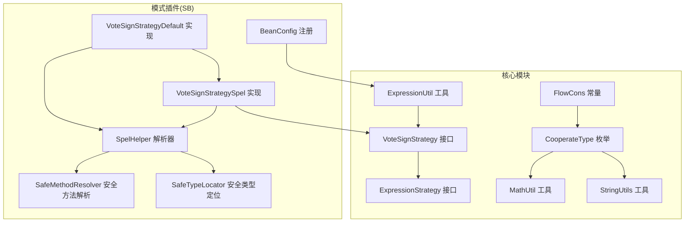
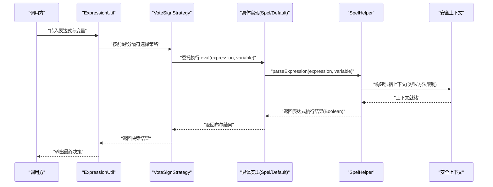
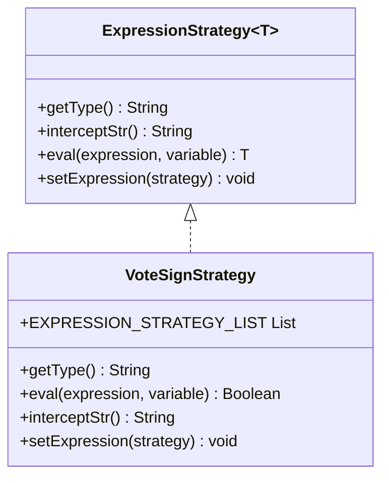
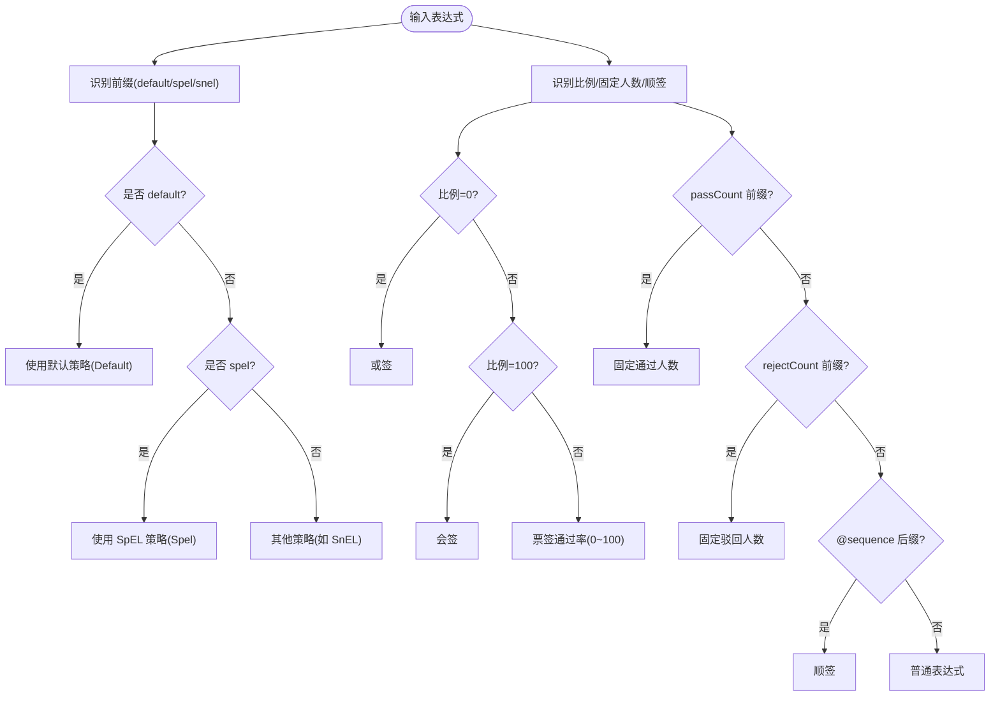
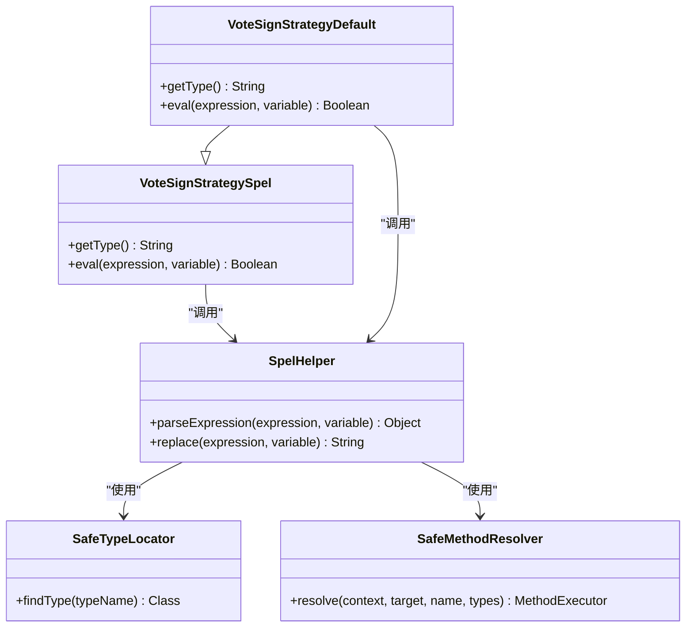
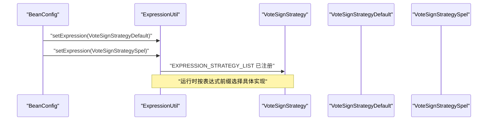
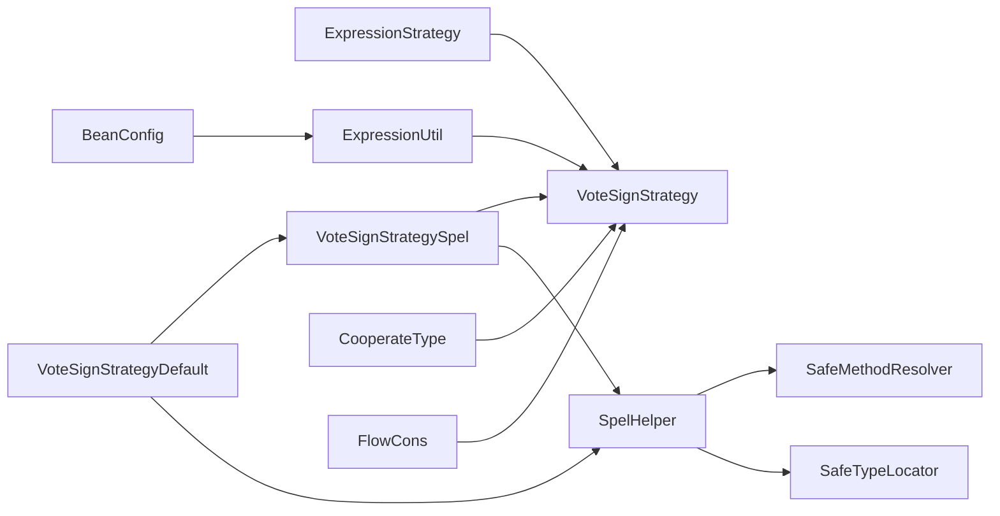

# 投票签名策略

<cite>
**本文引用的文件**
- [VoteSignStrategy.java](file://warm-flow-core/src/main/java/org/dromara/warm/flow/core/strategy/VoteSignStrategy.java)
- [ExpressionStrategy.java](file://warm-flow-core/src/main/java/org/dromara/warm/flow/core/strategy/ExpressionStrategy.java)
- [CooperateType.java](file://warm-flow-core/src/main/java/org/dromara/warm/flow/core/enums/CooperateType.java)
- [FlowCons.java](file://warm-flow-core/src/main/java/org/dromara/warm/flow/core/constant/FlowCons.java)
- [MathUtil.java](file://warm-flow-core/src/main/java/org/dromara/warm/flow/core/utils/MathUtil.java)
- [StringUtils.java](file://warm-flow-core/src/main/java/org/dromara/warm/flow/core/utils/StringUtils.java)
- [VoteSignStrategySpel.java](file://warm-flow-plugin/warm-flow-plugin-modes/warm-flow-plugin-modes-sb/src/main/java/org/dromara/warm/plugin/modes/sb/expression/VoteSignStrategySpel.java)
- [VoteSignStrategyDefault.java](file://warm-flow-plugin/warm-flow-plugin-modes/warm-flow-plugin-modes-sb/src/main/java/org/dromara/warm/plugin/modes/sb/expression/VoteSignStrategyDefault.java)
- [SpelHelper.java](file://warm-flow-plugin/warm-flow-plugin-modes/warm-flow-plugin-modes-sb/src/main/java/org/dromara/warm/plugin/modes/sb/helper/SpelHelper.java)
- [SafeMethodResolver.java](file://warm-flow-plugin/warm-flow-plugin-modes/warm-flow-plugin-modes-sb/src/main/java/org/dromara/warm/plugin/modes/sb/helper/SafeMethodResolver.java)
- [SafeTypeLocator.java](file://warm-flow-plugin/warm-flow-plugin-modes/warm-flow-plugin-modes-sb/src/main/java/org/dromara/warm/plugin/modes/sb/helper/SafeTypeLocator.java)
- [BeanConfig.java](file://warm-flow-plugin/warm-flow-plugin-modes/warm-flow-plugin-modes-sb/src/main/java/org/dromara/warm/plugin/modes/sb/config/BeanConfig.java)
- [ExpressionUtil.java](file://warm-flow-core/src/main/java/org/dromara/warm/flow/core/utils/ExpressionUtil.java)
</cite>

## 目录
1. [简介](#简介)
2. [项目结构](#项目结构)
3. [核心组件](#核心组件)
4. [架构总览](#架构总览)
5. [详细组件分析](#详细组件分析)
6. [依赖关系分析](#依赖关系分析)
7. [性能与安全特性](#性能与安全特性)
8. [故障排查指南](#故障排查指南)
9. [结论](#结论)
10. [附录：配置与示例](#附录配置与示例)

## 简介
本文件围绕“投票签名策略”展开，系统性解析 VoteSignStrategySpel 的实现原理与扩展策略，涵盖多人协作、投票决策、签名验证等高级能力的表达式支持。重点阐述：
- 在协同工作流中支持并行审批、会签、或签等不同协作模式；
- 表达式在投票决策中的作用机制，包括投票条件设置、权重计算、结果判定；
- 投票策略配置、超时处理、异常情况处理等业务逻辑实现；
- 提供可落地的配置示例路径，帮助读者快速搭建复杂协作流程。

## 项目结构
投票签名策略位于核心模块与模式插件中，采用“接口 + 多实现 + 表达式工具”的分层设计：
- 核心接口与通用常量：定义策略接口、表达式通用规范、协作类型枚举与常量；
- 模式插件实现：提供基于 Spring SpEL 的默认与 SpEL 表达式实现；
- 表达式工具：封装 SpEL 解析、沙箱安全控制与变量注入；
- 配置入口：在 BeanConfig 中注册策略实现，供运行时统一调度。

图表来源
- [VoteSignStrategy.java:28-44](file://warm-flow-core/src/main/java/org/dromara/warm/flow/core/strategy/VoteSignStrategy.java#L28-L44)
- [ExpressionStrategy.java:25-60](file://warm-flow-core/src/main/java/org/dromara/warm/flow/core/strategy/ExpressionStrategy.java#L25-L60)
- [CooperateType.java:39-196](file://warm-flow-core/src/main/java/org/dromara/warm/flow/core/enums/CooperateType.java#L39-L196)
- [FlowCons.java:25-84](file://warm-flow-core/src/main/java/org/dromara/warm/flow/core/constant/FlowCons.java#L25-L84)
- [VoteSignStrategySpel.java:29-40](file://warm-flow-plugin/warm-flow-plugin-modes/warm-flow-plugin-modes-sb/src/main/java/org/dromara/warm/plugin/modes/sb/expression/VoteSignStrategySpel.java#L29-L40)
- [VoteSignStrategyDefault.java:30-41](file://warm-flow-plugin/warm-flow-plugin-modes/warm-flow-plugin-modes-sb/src/main/java/org/dromara/warm/plugin/modes/sb/expression/VoteSignStrategyDefault.java#L30-L41)
- [SpelHelper.java:41-113](file://warm-flow-plugin/warm-flow-plugin-modes/warm-flow-plugin-modes-sb/src/main/java/org/dromara/warm/plugin/modes/sb/helper/SpelHelper.java#L41-L113)
- [BeanConfig.java:159-160](file://warm-flow-plugin/warm-flow-plugin-modes/warm-flow-plugin-modes-sb/src/main/java/org/dromara/warm/plugin/modes/sb/config/BeanConfig.java#L159-L160)

章节来源
- [VoteSignStrategy.java:28-44](file://warm-flow-core/src/main/java/org/dromara/warm/flow/core/strategy/VoteSignStrategy.java#L28-L44)
- [ExpressionStrategy.java:25-60](file://warm-flow-core/src/main/java/org/dromara/warm/flow/core/strategy/ExpressionStrategy.java#L25-L60)
- [CooperateType.java:39-196](file://warm-flow-core/src/main/java/org/dromara/warm/flow/core/enums/CooperateType.java#L39-L196)
- [FlowCons.java:25-84](file://warm-flow-core/src/main/java/org/dromara/warm/flow/core/constant/FlowCons.java#L25-L84)

## 核心组件
- 投票签名策略接口：定义策略类型、拦截分隔符、表达式执行与注册机制，作为所有投票签名实现的统一契约。
- 表达式策略接口：抽象出 getType、eval、interceptStr、setExpression 等通用能力，支撑多种表达式引擎（如 SpEL、SnEL）。
- 协作类型枚举：提供“会签、票签、或签、顺签”等协作模式识别与策略前缀判断，为表达式解析提供上下文。
- 常量与工具：提供分隔符、策略前缀、比例判断、字符串处理等基础能力，保障表达式解析与策略路由的正确性。
- SpEL 表达式实现：提供默认与 SpEL 两种表达式策略，分别适配简化语法与标准 SpEL 语法。
- 表达式工具：封装 SpEL 解析、沙箱安全控制（类型白名单、方法黑名单）、变量注入与上下文构建。
- 配置入口：在 BeanConfig 中注册默认与 SpEL 投票签名策略，供 ExpressionUtil 统一调度。

章节来源
- [VoteSignStrategy.java:28-44](file://warm-flow-core/src/main/java/org/dromara/warm/flow/core/strategy/VoteSignStrategy.java#L28-L44)
- [ExpressionStrategy.java:25-60](file://warm-flow-core/src/main/java/org/dromara/warm/flow/core/strategy/ExpressionStrategy.java#L25-L60)
- [CooperateType.java:39-196](file://warm-flow-core/src/main/java/org/dromara/warm/flow/core/enums/CooperateType.java#L39-L196)
- [FlowCons.java:25-84](file://warm-flow-core/src/main/java/org/dromara/warm/flow/core/constant/FlowCons.java#L25-L84)
- [VoteSignStrategySpel.java:29-40](file://warm-flow-plugin/warm-flow-plugin-modes/warm-flow-plugin-modes-sb/src/main/java/org/dromara/warm/plugin/modes/sb/expression/VoteSignStrategySpel.java#L29-L40)
- [VoteSignStrategyDefault.java:30-41](file://warm-flow-plugin/warm-flow-plugin-modes/warm-flow-plugin-modes-sb/src/main/java/org/dromara/warm/plugin/modes/sb/expression/VoteSignStrategyDefault.java#L30-L41)
- [SpelHelper.java:41-113](file://warm-flow-plugin/warm-flow-plugin-modes/warm-flow-plugin-modes-sb/src/main/java/org/dromara/warm/plugin/modes/sb/helper/SpelHelper.java#L41-L113)
- [BeanConfig.java:159-160](file://warm-flow-plugin/warm-flow-plugin-modes/warm-flow-plugin-modes-sb/src/main/java/org/dromara/warm/plugin/modes/sb/config/BeanConfig.java#L159-L160)

## 架构总览
投票签名策略的运行时架构如下：
- 策略注册：BeanConfig 将默认与 SpEL 投票签名策略注册到 ExpressionUtil 的策略列表中；
- 表达式解析：ExpressionUtil 根据表达式前缀与分隔符选择对应策略，调用其 eval 方法；
- 安全执行：SpelHelper 构建沙箱上下文，限制类型与方法，注入变量后执行表达式；
- 结果判定：根据协作类型与比例/固定人数策略，结合表达式布尔结果，完成投票决策。

图表来源
- [ExpressionUtil.java](file://warm-flow-core/src/main/java/org/dromara/warm/flow/core/utils/ExpressionUtil.java#L142)
- [VoteSignStrategySpel.java:37-39](file://warm-flow-plugin/warm-flow-plugin-modes/warm-flow-plugin-modes-sb/src/main/java/org/dromara/warm/plugin/modes/sb/expression/VoteSignStrategySpel.java#L37-L39)
- [SpelHelper.java:64-86](file://warm-flow-plugin/warm-flow-plugin-modes/warm-flow-plugin-modes-sb/src/main/java/org/dromara/warm/plugin/modes/sb/helper/SpelHelper.java#L64-L86)

## 详细组件分析

### 投票签名策略接口与表达式策略基座
- VoteSignStrategy 接口继承 ExpressionStrategy<Boolean>，约定：
  - getType：返回策略类型标识（如 default/spel）；
  - eval：执行表达式并返回布尔结果；
  - interceptStr：返回分隔符（用于从复合表达式中截取策略段）；
  - setExpression：将实现注册到 EXPRESSION_STRATEGY_LIST，供统一调度。
- ExpressionStrategy 定义了通用的策略接口，确保不同表达式引擎的一致性。

图表来源
- [ExpressionStrategy.java:25-60](file://warm-flow-core/src/main/java/org/dromara/warm/flow/core/strategy/ExpressionStrategy.java#L25-L60)
- [VoteSignStrategy.java:28-44](file://warm-flow-core/src/main/java/org/dromara/warm/flow/core/strategy/VoteSignStrategy.java#L28-L44)

章节来源
- [ExpressionStrategy.java:25-60](file://warm-flow-core/src/main/java/org/dromara/warm/flow/core/strategy/ExpressionStrategy.java#L25-L60)
- [VoteSignStrategy.java:28-44](file://warm-flow-core/src/main/java/org/dromara/warm/flow/core/strategy/VoteSignStrategy.java#L28-L44)

### 协作类型与策略前缀识别
- CooperateType 提供协作模式识别与策略前缀判断：
  - 或签：比例为 0；
  - 会签：比例为 100；
  - 票签通过率：比例在 0~100；
  - 固定通过/驳回人数：以 passCount/rejectCount 前缀标识；
  - 顺签：以 @sequence 后缀标识；
  - 表达式前缀：default/spel/snel 识别。
- MathUtil 与 StringUtils 提供比例范围判断与字符串处理，保障策略解析的健壮性。

图表来源
- [CooperateType.java:104-196](file://warm-flow-core/src/main/java/org/dromara/warm/flow/core/enums/CooperateType.java#L104-L196)
- [MathUtil.java:67-117](file://warm-flow-core/src/main/java/org/dromara/warm/flow/core/utils/MathUtil.java#L67-L117)
- [StringUtils.java:56-80](file://warm-flow-core/src/main/java/org/dromara/warm/flow/core/utils/StringUtils.java#L56-L80)
- [FlowCons.java:25-84](file://warm-flow-core/src/main/java/org/dromara/warm/flow/core/constant/FlowCons.java#L25-L84)

章节来源
- [CooperateType.java:104-196](file://warm-flow-core/src/main/java/org/dromara/warm/flow/core/enums/CooperateType.java#L104-L196)
- [MathUtil.java:67-117](file://warm-flow-core/src/main/java/org/dromara/warm/flow/core/utils/MathUtil.java#L67-L117)
- [StringUtils.java:56-80](file://warm-flow-core/src/main/java/org/dromara/warm/flow/core/utils/StringUtils.java#L56-L80)
- [FlowCons.java:25-84](file://warm-flow-core/src/main/java/org/dromara/warm/flow/core/constant/FlowCons.java#L25-L84)

### SpEL 表达式策略实现
- VoteSignStrategySpel：直接使用 SpEL 执行表达式，适用于标准 SpEL 语法；
- VoteSignStrategyDefault：对表达式进行默认语法替换（如 $ 变 #），再交由 SpEL 执行，提升易用性；
- SpelHelper：构建沙箱上下文，限制可访问类型与方法，注入变量，保证表达式执行的安全与可控；
- 安全组件：SafeTypeLocator 与 SafeMethodResolver 分别限制类型白名单与方法黑名单，防止高危操作。

图表来源
- [VoteSignStrategySpel.java:29-40](file://warm-flow-plugin/warm-flow-plugin-modes/warm-flow-plugin-modes-sb/src/main/java/org/dromara/warm/plugin/modes/sb/expression/VoteSignStrategySpel.java#L29-L40)
- [VoteSignStrategyDefault.java:30-41](file://warm-flow-plugin/warm-flow-plugin-modes/warm-flow-plugin-modes-sb/src/main/java/org/dromara/warm/plugin/modes/sb/expression/VoteSignStrategyDefault.java#L30-L41)
- [SpelHelper.java:41-113](file://warm-flow-plugin/warm-flow-plugin-modes/warm-flow-plugin-modes-sb/src/main/java/org/dromara/warm/plugin/modes/sb/helper/SpelHelper.java#L41-L113)
- [SafeTypeLocator.java:41-112](file://warm-flow-plugin/warm-flow-plugin-modes/warm-flow-plugin-modes-sb/src/main/java/org/dromara/warm/plugin/modes/sb/helper/SafeTypeLocator.java#L41-L112)
- [SafeMethodResolver.java:23-53](file://warm-flow-plugin/warm-flow-plugin-modes/warm-flow-plugin-modes-sb/src/main/java/org/dromara/warm/plugin/modes/sb/helper/SafeMethodResolver.java#L23-L53)

章节来源
- [VoteSignStrategySpel.java:29-40](file://warm-flow-plugin/warm-flow-plugin-modes/warm-flow-plugin-modes-sb/src/main/java/org/dromara/warm/plugin/modes/sb/expression/VoteSignStrategySpel.java#L29-L40)
- [VoteSignStrategyDefault.java:30-41](file://warm-flow-plugin/warm-flow-plugin-modes/warm-flow-plugin-modes-sb/src/main/java/org/dromara/warm/plugin/modes/sb/expression/VoteSignStrategyDefault.java#L30-L41)
- [SpelHelper.java:41-113](file://warm-flow-plugin/warm-flow-plugin-modes/warm-flow-plugin-modes-sb/src/main/java/org/dromara/warm/plugin/modes/sb/helper/SpelHelper.java#L41-L113)
- [SafeTypeLocator.java:41-112](file://warm-flow-plugin/warm-flow-plugin-modes/warm-flow-plugin-modes-sb/src/main/java/org/dromara/warm/plugin/modes/sb/helper/SafeTypeLocator.java#L41-L112)
- [SafeMethodResolver.java:23-53](file://warm-flow-plugin/warm-flow-plugin-modes/warm-flow-plugin-modes-sb/src/main/java/org/dromara/warm/plugin/modes/sb/helper/SafeMethodResolver.java#L23-L53)

### 表达式解析与策略调度
- BeanConfig 中注册默认与 SpEL 投票签名策略，使 ExpressionUtil 可统一调度；
- ExpressionUtil 根据表达式前缀与分隔符选择策略，调用 eval 执行表达式；
- 结合协作类型与比例/固定人数策略，完成最终的投票决策。

图表来源
- [BeanConfig.java:159-160](file://warm-flow-plugin/warm-flow-plugin-modes/warm-flow-plugin-modes-sb/src/main/java/org/dromara/warm/plugin/modes/sb/config/BeanConfig.java#L159-L160)
- [ExpressionUtil.java](file://warm-flow-core/src/main/java/org/dromara/warm/flow/core/utils/ExpressionUtil.java#L142)
- [VoteSignStrategy.java:33-38](file://warm-flow-core/src/main/java/org/dromara/warm/flow/core/strategy/VoteSignStrategy.java#L33-L38)

章节来源
- [BeanConfig.java:159-160](file://warm-flow-plugin/warm-flow-plugin-modes/warm-flow-plugin-modes-sb/src/main/java/org/dromara/warm/plugin/modes/sb/config/BeanConfig.java#L159-L160)
- [ExpressionUtil.java](file://warm-flow-core/src/main/java/org/dromara/warm/flow/core/utils/ExpressionUtil.java#L142)

## 依赖关系分析
- 接口耦合：VoteSignStrategy 依赖 ExpressionStrategy，确保表达式策略的统一性；
- 实现耦合：VoteSignStrategyDefault 继承 VoteSignStrategySpel，复用 SpEL 解析能力；
- 工具依赖：SpelHelper 依赖 Spring SpEL 与沙箱组件，提供安全解析；
- 配置依赖：BeanConfig 注册策略，ExpressionUtil 统一调度；
- 业务依赖：CooperateType 与 FlowCons 为策略识别与分隔符提供基础。

图表来源
- [ExpressionStrategy.java:25-60](file://warm-flow-core/src/main/java/org/dromara/warm/flow/core/strategy/ExpressionStrategy.java#L25-L60)
- [VoteSignStrategy.java:28-44](file://warm-flow-core/src/main/java/org/dromara/warm/flow/core/strategy/VoteSignStrategy.java#L28-L44)
- [VoteSignStrategySpel.java:29-40](file://warm-flow-plugin/warm-flow-plugin-modes/warm-flow-plugin-modes-sb/src/main/java/org/dromara/warm/plugin/modes/sb/expression/VoteSignStrategySpel.java#L29-L40)
- [VoteSignStrategyDefault.java:30-41](file://warm-flow-plugin/warm-flow-plugin-modes/warm-flow-plugin-modes-sb/src/main/java/org/dromara/warm/plugin/modes/sb/expression/VoteSignStrategyDefault.java#L30-L41)
- [SpelHelper.java:41-113](file://warm-flow-plugin/warm-flow-plugin-modes/warm-flow-plugin-modes-sb/src/main/java/org/dromara/warm/plugin/modes/sb/helper/SpelHelper.java#L41-L113)
- [BeanConfig.java:159-160](file://warm-flow-plugin/warm-flow-plugin-modes/warm-flow-plugin-modes-sb/src/main/java/org/dromara/warm/plugin/modes/sb/config/BeanConfig.java#L159-L160)
- [ExpressionUtil.java](file://warm-flow-core/src/main/java/org/dromara/warm/flow/core/utils/ExpressionUtil.java#L142)
- [CooperateType.java:39-196](file://warm-flow-core/src/main/java/org/dromara/warm/flow/core/enums/CooperateType.java#L39-L196)
- [FlowCons.java:25-84](file://warm-flow-core/src/main/java/org/dromara/warm/flow/core/constant/FlowCons.java#L25-L84)

章节来源
- [ExpressionStrategy.java:25-60](file://warm-flow-core/src/main/java/org/dromara/warm/flow/core/strategy/ExpressionStrategy.java#L25-L60)
- [VoteSignStrategy.java:28-44](file://warm-flow-core/src/main/java/org/dromara/warm/flow/core/strategy/VoteSignStrategy.java#L28-L44)
- [SpelHelper.java:41-113](file://warm-flow-plugin/warm-flow-plugin-modes/warm-flow-plugin-modes-sb/src/main/java/org/dromara/warm/plugin/modes/sb/helper/SpelHelper.java#L41-L113)
- [BeanConfig.java:159-160](file://warm-flow-plugin/warm-flow-plugin-modes/warm-flow-plugin-modes-sb/src/main/java/org/dromara/warm/plugin/modes/sb/config/BeanConfig.java#L159-L160)

## 性能与安全特性
- 性能特性
  - 表达式解析：SpEL 解析在沙箱上下文中执行，避免高开销操作；
  - 策略注册：一次性注册，运行时按需选择，降低分支判断成本；
  - 变量注入：通过 StandardEvaluationContext.setVariables 直接注入，减少重复构造。
- 安全特性
  - 类型白名单：仅允许有限的基础类型与常用集合类型；
  - 方法黑名单：禁止 Runtime、System、反射等高危方法；
  - 上下文隔离：独立的 EvaluationContext，避免污染业务上下文。

章节来源
- [SpelHelper.java:64-86](file://warm-flow-plugin/warm-flow-plugin-modes/warm-flow-plugin-modes-sb/src/main/java/org/dromara/warm/plugin/modes/sb/helper/SpelHelper.java#L64-L86)
- [SafeTypeLocator.java:83-100](file://warm-flow-plugin/warm-flow-plugin-modes/warm-flow-plugin-modes-sb/src/main/java/org/dromara/warm/plugin/modes/sb/helper/SafeTypeLocator.java#L83-L100)
- [SafeMethodResolver.java:41-52](file://warm-flow-plugin/warm-flow-plugin-modes/warm-flow-plugin-modes-sb/src/main/java/org/dromara/warm/plugin/modes/sb/helper/SafeMethodResolver.java#L41-L52)

## 故障排查指南
- 表达式未生效
  - 检查表达式前缀与分隔符是否符合 default/spel/snel 与 @@；
  - 确认 BeanConfig 是否已注册对应策略实现。
- 表达式执行报错
  - 查看 SpelHelper 是否抛出类型/方法受限异常；
  - 检查变量是否正确注入，键名是否与表达式一致。
- 协作类型判断异常
  - 检查比例字符串是否为 0/100 或 0~100 区间；
  - 确认 passCount/rejectCount 前缀与 @sequence 后缀使用是否正确。

章节来源
- [BeanConfig.java:159-160](file://warm-flow-plugin/warm-flow-plugin-modes/warm-flow-plugin-modes-sb/src/main/java/org/dromara/warm/plugin/modes/sb/config/BeanConfig.java#L159-L160)
- [SpelHelper.java:95-101](file://warm-flow-plugin/warm-flow-plugin-modes/warm-flow-plugin-modes-sb/src/main/java/org/dromara/warm/plugin/modes/sb/helper/SpelHelper.java#L95-L101)
- [CooperateType.java:104-196](file://warm-flow-core/src/main/java/org/dromara/warm/flow/core/enums/CooperateType.java#L104-L196)

## 结论
投票签名策略通过“接口 + 多实现 + 表达式工具 + 沙箱安全”的设计，实现了在协同工作流中灵活、安全、可扩展的投票决策能力。配合协作类型枚举与比例/固定人数策略，能够覆盖并行审批、会签、或签、顺签等多种场景。建议在生产环境中优先使用 SpEL 策略并严格控制变量与表达式，确保安全性与稳定性。

## 附录：配置与示例
以下为常见配置与使用示例的路径指引（请参考相应源码文件以获取完整实现）：
- 注册策略实现
  - [BeanConfig.java:159-160](file://warm-flow-plugin/warm-flow-plugin-modes/warm-flow-plugin-modes-sb/src/main/java/org/dromara/warm/plugin/modes/sb/config/BeanConfig.java#L159-L160)
- 默认表达式策略
  - [VoteSignStrategyDefault.java:30-41](file://warm-flow-plugin/warm-flow-plugin-modes/warm-flow-plugin-modes-sb/src/main/java/org/dromara/warm/plugin/modes/sb/expression/VoteSignStrategyDefault.java#L30-L41)
- SpEL 表达式策略
  - [VoteSignStrategySpel.java:29-40](file://warm-flow-plugin/warm-flow-plugin-modes/warm-flow-plugin-modes-sb/src/main/java/org/dromara/warm/plugin/modes/sb/expression/VoteSignStrategySpel.java#L29-L40)
- 表达式解析与安全
  - [SpelHelper.java:64-86](file://warm-flow-plugin/warm-flow-plugin-modes/warm-flow-plugin-modes-sb/src/main/java/org/dromara/warm/plugin/modes/sb/helper/SpelHelper.java#L64-L86)
  - [SafeTypeLocator.java:83-100](file://warm-flow-plugin/warm-flow-plugin-modes/warm-flow-plugin-modes-sb/src/main/java/org/dromara/warm/plugin/modes/sb/helper/SafeTypeLocator.java#L83-L100)
  - [SafeMethodResolver.java:41-52](file://warm-flow-plugin/warm-flow-plugin-modes/warm-flow-plugin-modes-sb/src/main/java/org/dromara/warm/plugin/modes/sb/helper/SafeMethodResolver.java#L41-L52)
- 协作类型与比例判断
  - [CooperateType.java:104-196](file://warm-flow-core/src/main/java/org/dromara/warm/flow/core/enums/CooperateType.java#L104-L196)
  - [MathUtil.java:67-117](file://warm-flow-core/src/main/java/org/dromara/warm/flow/core/utils/MathUtil.java#L67-L117)
  - [StringUtils.java:56-80](file://warm-flow-core/src/main/java/org/dromara/warm/flow/core/utils/StringUtils.java#L56-L80)
- 常量与分隔符
  - [FlowCons.java:25-84](file://warm-flow-core/src/main/java/org/dromara/warm/flow/core/constant/FlowCons.java#L25-L84)