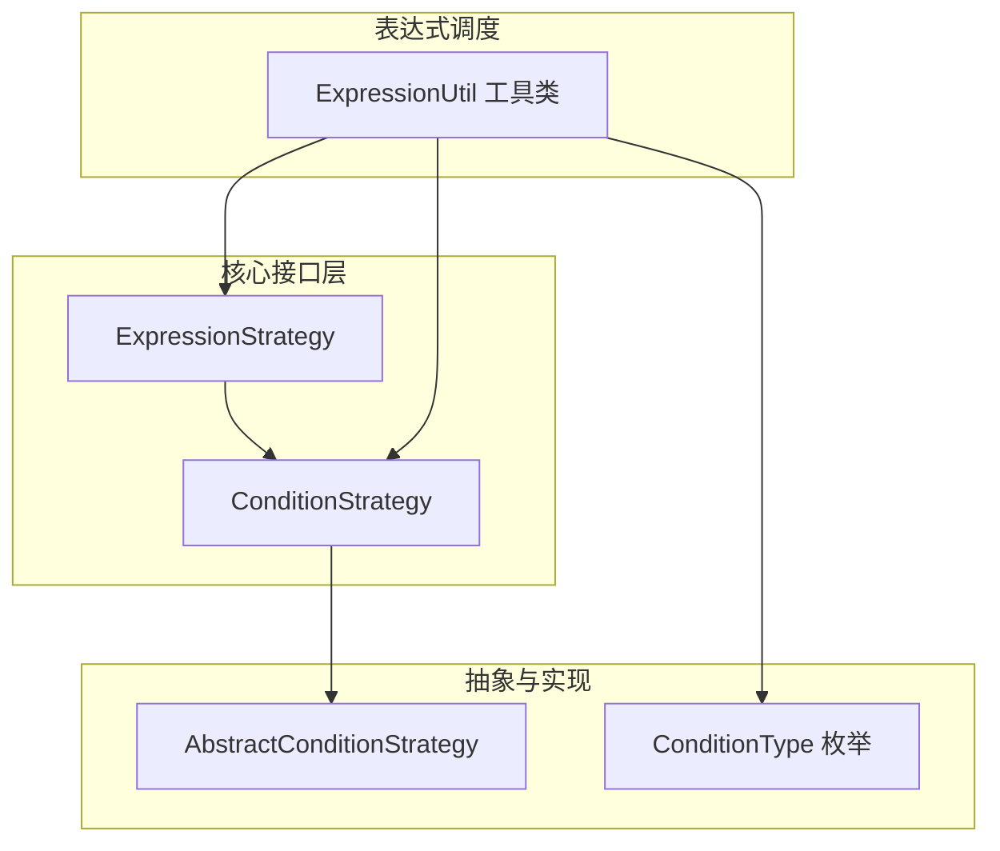
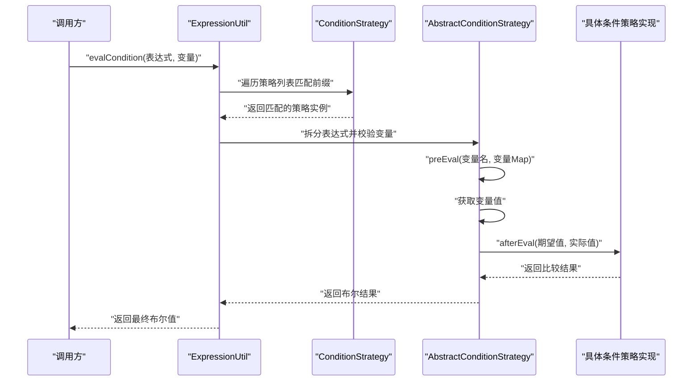
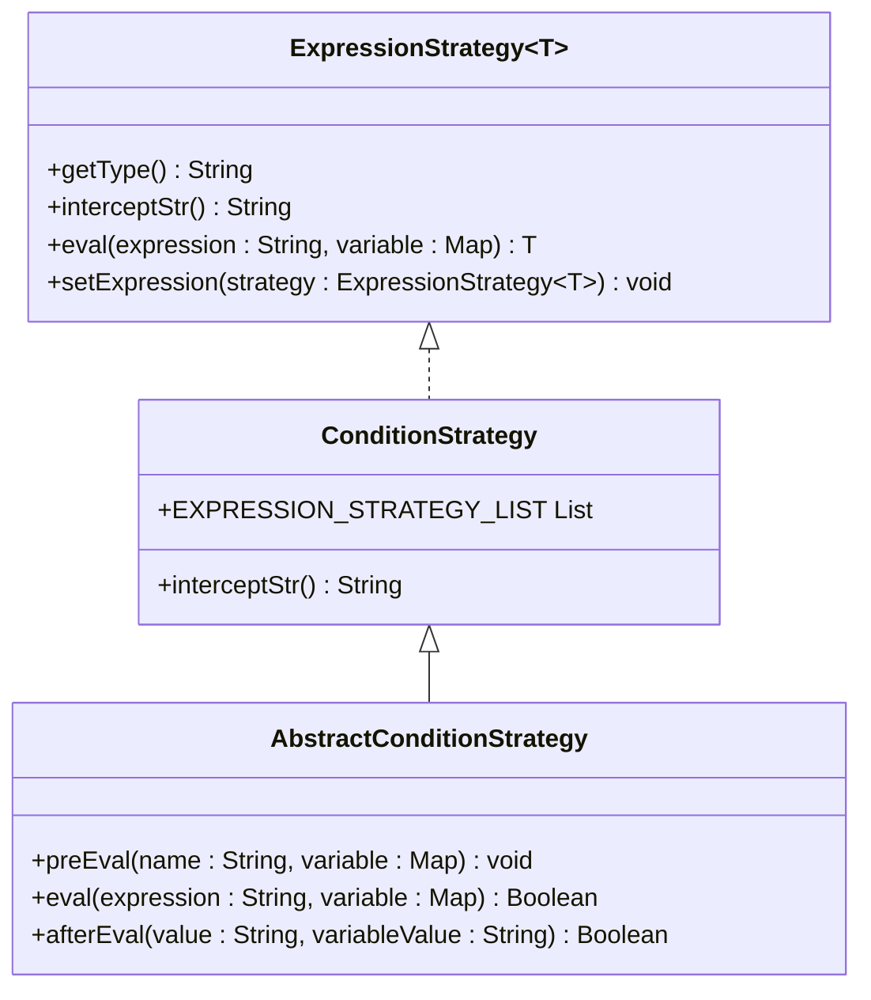
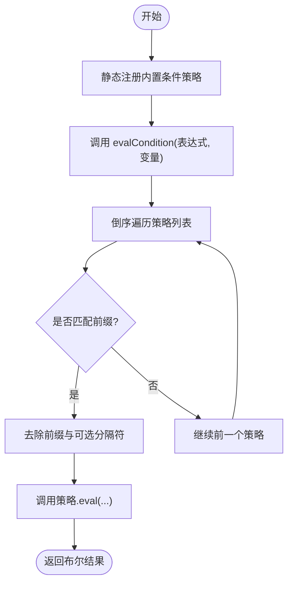
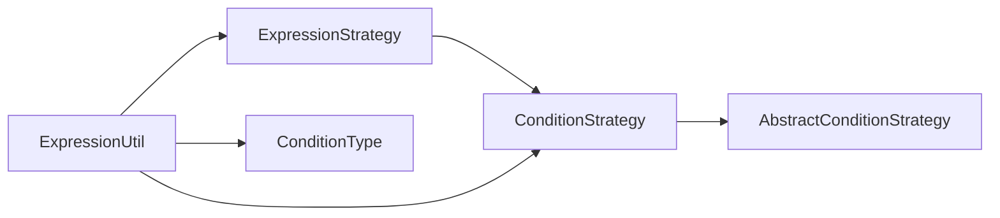

# 条件判断策略

<cite>
**本文引用的文件**
- [ExpressionStrategy.java](file://warm-flow-core/src/main/java/org/dromara/warm/flow/core/strategy/ExpressionStrategy.java)
- [ConditionStrategy.java](file://warm-flow-core/src/main/java/org/dromara/warm/flow/core/strategy/ConditionStrategy.java)
- [AbstractConditionStrategy.java](file://warm-flow-core/src/main/java/org/dromara/warm/flow/core/condition/AbstractConditionStrategy.java)
- [ExpressionUtil.java](file://warm-flow-core/src/main/java/org/dromara/warm/flow/core/utils/ExpressionUtil.java)
- [ConditionType.java](file://warm-flow-core/src/main/java/org/dromara/warm/flow/core/enums/ConditionType.java)
</cite>

## 目录
1. [引言](#引言)
2. [项目结构](#项目结构)
3. [核心组件](#核心组件)
4. [架构总览](#架构总览)
5. [详细组件分析](#详细组件分析)
6. [依赖关系分析](#依赖关系分析)
7. [性能考量](#性能考量)
8. [故障排查指南](#故障排查指南)
9. [结论](#结论)
10. [附录](#附录)

## 引言
本技术文档围绕条件判断策略展开，重点解析 ConditionStrategy 接口体系与表达式执行机制，涵盖策略注册、表达式解析、变量绑定、条件评估流程以及与 SPeL（Spring Expression Language）相关的扩展能力。文档将从接口设计、实现模式、数据流到使用规范逐层展开，帮助读者在工作流节点中正确配置与使用条件表达式进行分支判断。

## 项目结构
本项目采用分层与策略模式结合的设计：核心接口位于 warm-flow-core 模块，条件策略以具体实现类形式存在；表达式工具类统一调度策略列表完成匹配与执行；枚举定义了内置条件类型键值对。

图表来源
- [ExpressionStrategy.java:25-60](file://warm-flow-core/src/main/java/org/dromara/warm/flow/core/strategy/ExpressionStrategy.java#L25-L60)
- [ConditionStrategy.java:28-44](file://warm-flow-core/src/main/java/org/dromara/warm/flow/core/strategy/ConditionStrategy.java#L28-L44)
- [AbstractConditionStrategy.java:31-72](file://warm-flow-core/src/main/java/org/dromara/warm/flow/core/condition/AbstractConditionStrategy.java#L31-L72)
- [ExpressionUtil.java:36-195](file://warm-flow-core/src/main/java/org/dromara/warm/flow/core/utils/ExpressionUtil.java#L36-L195)
- [ConditionType.java:29-99](file://warm-flow-core/src/main/java/org/dromara/warm/flow/core/enums/ConditionType.java#L29-L99)

章节来源
- [ExpressionStrategy.java:25-60](file://warm-flow-core/src/main/java/org/dromara/warm/flow/core/strategy/ExpressionStrategy.java#L25-L60)
- [ConditionStrategy.java:28-44](file://warm-flow-core/src/main/java/org/dromara/warm/flow/core/strategy/ConditionStrategy.java#L28-L44)
- [AbstractConditionStrategy.java:31-72](file://warm-flow-core/src/main/java/org/dromara/warm/flow/core/condition/AbstractConditionStrategy.java#L31-L72)
- [ExpressionUtil.java:36-195](file://warm-flow-core/src/main/java/org/dromara/warm/flow/core/utils/ExpressionUtil.java#L36-L195)
- [ConditionType.java:29-99](file://warm-flow-core/src/main/java/org/dromara/warm/flow/core/enums/ConditionType.java#L29-L99)

## 核心组件
- 表达式策略接口：定义 getType、interceptStr、eval、setExpression 等通用能力，用于统一表达式类型识别与执行。
- 条件策略接口：继承表达式策略，提供条件表达式专用集合与分隔符约定。
- 抽象条件策略：封装通用的前置校验、表达式拆分、变量取值与后置评估流程。
- 表达式工具类：集中注册与调度策略，按前缀匹配与截断逻辑选择具体策略执行。
- 条件类型枚举：内置条件类型键值映射，便于在 UI 或配置中使用。

章节来源
- [ExpressionStrategy.java:25-60](file://warm-flow-core/src/main/java/org/dromara/warm/flow/core/strategy/ExpressionStrategy.java#L25-L60)
- [ConditionStrategy.java:28-44](file://warm-flow-core/src/main/java/org/dromara/warm/flow/core/strategy/ConditionStrategy.java#L28-L44)
- [AbstractConditionStrategy.java:31-72](file://warm-flow-core/src/main/java/org/dromara/warm/flow/core/condition/AbstractConditionStrategy.java#L31-L72)
- [ExpressionUtil.java:36-195](file://warm-flow-core/src/main/java/org/dromara/warm/flow/core/utils/ExpressionUtil.java#L36-L195)
- [ConditionType.java:29-99](file://warm-flow-core/src/main/java/org/dromara/warm/flow/core/enums/ConditionType.java#L29-L99)

## 架构总览
条件表达式执行的整体流程如下：调用方传入形如“类型前缀@@表达式体”的字符串与流程变量 Map；工具类根据策略列表倒序匹配前缀，去除前缀与可选分隔符后，委托对应策略执行；策略内部完成变量校验与取值，再由具体实现完成比较或计算，最终返回布尔结果。

图表来源
- [ExpressionUtil.java:70-73](file://warm-flow-core/src/main/java/org/dromara/warm/flow/core/utils/ExpressionUtil.java#L70-L73)
- [ExpressionUtil.java:155-173](file://warm-flow-core/src/main/java/org/dromara/warm/flow/core/utils/ExpressionUtil.java#L155-L173)
- [AbstractConditionStrategy.java:55-61](file://warm-flow-core/src/main/java/org/dromara/warm/flow/core/condition/AbstractConditionStrategy.java#L55-L61)
- [AbstractConditionStrategy.java:40-44](file://warm-flow-core/src/main/java/org/dromara/warm/flow/core/condition/AbstractConditionStrategy.java#L40-L44)
- [AbstractConditionStrategy.java:70](file://warm-flow-core/src/main/java/org/dromara/warm/flow/core/condition/AbstractConditionStrategy.java#L70)

## 详细组件分析

### 接口与抽象基类
- ExpressionStrategy<T>：定义 getType 返回策略类型标识；interceptStr 提供可选的截断字符串；eval 执行表达式并返回泛型结果；setExpression 用于注册策略。
- ConditionStrategy：继承 ExpressionStrategy<Boolean>，提供条件表达式策略集合与默认分隔符。
- AbstractConditionStrategy：封装条件表达式通用流程：preEval 校验变量非空与存在；eval 拆分表达式、取值并调用 afterEval；afterEval 由子类实现具体比较逻辑。

图表来源
- [ExpressionStrategy.java:25-60](file://warm-flow-core/src/main/java/org/dromara/warm/flow/core/strategy/ExpressionStrategy.java#L25-L60)
- [ConditionStrategy.java:28-44](file://warm-flow-core/src/main/java/org/dromara/warm/flow/core/strategy/ConditionStrategy.java#L28-L44)
- [AbstractConditionStrategy.java:31-72](file://warm-flow-core/src/main/java/org/dromara/warm/flow/core/condition/AbstractConditionStrategy.java#L31-L72)

章节来源
- [ExpressionStrategy.java:25-60](file://warm-flow-core/src/main/java/org/dromara/warm/flow/core/strategy/ExpressionStrategy.java#L25-L60)
- [ConditionStrategy.java:28-44](file://warm-flow-core/src/main/java/org/dromara/warm/flow/core/strategy/ConditionStrategy.java#L28-L44)
- [AbstractConditionStrategy.java:31-72](file://warm-flow-core/src/main/java/org/dromara/warm/flow/core/condition/AbstractConditionStrategy.java#L31-L72)

### 表达式工具类与策略注册
- ExpressionUtil：静态初始化时注册所有内置条件策略；提供 evalCondition 统一入口；getValue 内部按倒序遍历策略列表，匹配前缀并截断后交由策略 eval 执行。
- 策略注册：通过 setExpression 将具体策略实例加入 ConditionStrategy.EXPRESSION_STRATEGY_LIST，后注入的策略优先匹配。

图表来源
- [ExpressionUtil.java:38-51](file://warm-flow-core/src/main/java/org/dromara/warm/flow/core/utils/ExpressionUtil.java#L38-L51)
- [ExpressionUtil.java:70-73](file://warm-flow-core/src/main/java/org/dromara/warm/flow/core/utils/ExpressionUtil.java#L70-L73)
- [ExpressionUtil.java:155-173](file://warm-flow-core/src/main/java/org/dromara/warm/flow/core/utils/ExpressionUtil.java#L155-L173)

章节来源
- [ExpressionUtil.java:38-51](file://warm-flow-core/src/main/java/org/dromara/warm/flow/core/utils/ExpressionUtil.java#L38-L51)
- [ExpressionUtil.java:70-73](file://warm-flow-core/src/main/java/org/dromara/warm/flow/core/utils/ExpressionUtil.java#L70-L73)
- [ExpressionUtil.java:155-173](file://warm-flow-core/src/main/java/org/dromara/warm/flow/core/utils/ExpressionUtil.java#L155-L173)

### 条件类型与语法规范
- 内置条件类型：EQ、GE、GT、LE、LIKE、LT、NE、NOT_LIKE，分别对应“等于、大于等于、大于、小于等于、包含、小于、不等于、不包含”。
- 表达式语法：形如“类型前缀@@变量|期望值”，例如“eq@@flag|5”。工具类在 eval 中按“|”拆分变量名与期望值，随后进行比较。
- 变量访问：变量名作为键从流程变量 Map 中取值，若为空或不存在则触发前置校验异常。

章节来源
- [ConditionType.java:29-62](file://warm-flow-core/src/main/java/org/dromara/warm/flow/core/enums/ConditionType.java#L29-L62)
- [AbstractConditionStrategy.java:55-61](file://warm-flow-core/src/main/java/org/dromara/warm/flow/core/condition/AbstractConditionStrategy.java#L55-L61)
- [AbstractConditionStrategy.java:40-44](file://warm-flow-core/src/main/java/org/dromara/warm/flow/core/condition/AbstractConditionStrategy.java#L40-L44)

### SPeL 扩展与安全边界
- SPeL 支持：当前核心模块的条件策略基于内置类型（如 eq、ge、gt 等）实现，采用“类型前缀@@变量|期望值”的固定格式，不直接暴露 SPeL 表达式求值。
- 安全边界：AbstractConditionStrategy.preEval 对变量存在性与非空进行严格校验；ExpressionUtil.getValue 在策略为空时抛出异常，避免未注册策略导致的空指针。
- 性能边界：策略列表倒序匹配，后注入策略优先；表达式拆分与字符串比较开销较低，适合高频分支判断场景。

章节来源
- [AbstractConditionStrategy.java:40-44](file://warm-flow-core/src/main/java/org/dromara/warm/flow/core/condition/AbstractConditionStrategy.java#L40-L44)
- [ExpressionUtil.java:155-163](file://warm-flow-core/src/main/java/org/dromara/warm/flow/core/utils/ExpressionUtil.java#L155-L163)

## 依赖关系分析
- ExpressionStrategy 与 ConditionStrategy：前者为通用表达式接口，后者特化为条件表达式并复用其能力。
- AbstractConditionStrategy 与 ConditionStrategy：后者继承前者并提供通用流程骨架，子类仅需实现 afterEval。
- ExpressionUtil 与策略集合：通过静态注册维护策略列表，统一调度与异常处理。
- ConditionType：为 UI/配置层提供键值映射，便于生成或解析表达式。

图表来源
- [ExpressionStrategy.java:25-60](file://warm-flow-core/src/main/java/org/dromara/warm/flow/core/strategy/ExpressionStrategy.java#L25-L60)
- [ConditionStrategy.java:28-44](file://warm-flow-core/src/main/java/org/dromara/warm/flow/core/strategy/ConditionStrategy.java#L28-L44)
- [AbstractConditionStrategy.java:31-72](file://warm-flow-core/src/main/java/org/dromara/warm/flow/core/condition/AbstractConditionStrategy.java#L31-L72)
- [ExpressionUtil.java:38-51](file://warm-flow-core/src/main/java/org/dromara/warm/flow/core/utils/ExpressionUtil.java#L38-L51)
- [ConditionType.java:29-62](file://warm-flow-core/src/main/java/org/dromara/warm/flow/core/enums/ConditionType.java#L29-L62)

章节来源
- [ExpressionStrategy.java:25-60](file://warm-flow-core/src/main/java/org/dromara/warm/flow/core/strategy/ExpressionStrategy.java#L25-L60)
- [ConditionStrategy.java:28-44](file://warm-flow-core/src/main/java/org/dromara/warm/flow/core/strategy/ConditionStrategy.java#L28-L44)
- [AbstractConditionStrategy.java:31-72](file://warm-flow-core/src/main/java/org/dromara/warm/flow/core/condition/AbstractConditionStrategy.java#L31-L72)
- [ExpressionUtil.java:38-51](file://warm-flow-core/src/main/java/org/dromara/warm/flow/core/utils/ExpressionUtil.java#L38-L51)
- [ConditionType.java:29-62](file://warm-flow-core/src/main/java/org/dromara/warm/flow/core/enums/ConditionType.java#L29-L62)

## 性能考量
- 策略匹配：策略列表倒序遍历，后注入策略优先，避免频繁创建对象与重复扫描。
- 表达式拆分：按“|”拆分变量与期望值，字符串操作成本低，适合高并发分支判断。
- 变量访问：从 Map 中按键取值，时间复杂度 O(1)，建议在节点配置中尽量减少变量层级与嵌套。
- 预期优化：对于复杂条件组合，可在业务侧合并为单一表达式，减少多次策略匹配与字符串拆分。

## 故障排查指南
- 空策略异常：当策略列表中存在空元素时，getValue 将抛出异常。请检查是否正确注册策略或是否存在重复覆盖。
- 变量缺失：preEval 对变量为空或不存在进行断言，若抛出异常，请确认流程变量 Map 是否包含所需键。
- 表达式格式：确保表达式符合“类型前缀@@变量|期望值”的格式，避免因拆分失败导致比较异常。
- 类型不匹配：afterEval 依赖字符串比较，若变量或期望值为数值类型，请确保在配置层面保持一致的数据类型。

章节来源
- [ExpressionUtil.java:155-163](file://warm-flow-core/src/main/java/org/dromara/warm/flow/core/utils/ExpressionUtil.java#L155-L163)
- [AbstractConditionStrategy.java:40-44](file://warm-flow-core/src/main/java/org/dromara/warm/flow/core/condition/AbstractConditionStrategy.java#L40-L44)
- [AbstractConditionStrategy.java:55-61](file://warm-flow-core/src/main/java/org/dromara/warm/flow/core/condition/AbstractConditionStrategy.java#L55-L61)

## 结论
本项目通过 ExpressionStrategy 与 ConditionStrategy 的接口设计，配合 AbstractConditionStrategy 的通用流程与 ExpressionUtil 的策略调度，实现了稳定、可扩展的条件表达式执行框架。内置条件类型满足大多数分支判断需求，同时保留了通过前缀匹配扩展新策略的空间。在实际应用中，建议遵循表达式格式规范、合理组织变量结构，并在需要时引入更复杂的表达式策略以满足业务需求。

## 附录

### 使用示例（路径指引）
- 在工作流节点中配置条件表达式时，可参考以下路径以了解表达式格式与变量绑定方式：
  - [AbstractConditionStrategy.java:55-61](file://warm-flow-core/src/main/java/org/dromara/warm/flow/core/condition/AbstractConditionStrategy.java#L55-L61)
  - [ExpressionUtil.java:70-73](file://warm-flow-core/src/main/java/org/dromara/warm/flow/core/utils/ExpressionUtil.java#L70-L73)
  - [ConditionType.java:29-62](file://warm-flow-core/src/main/java/org/dromara/warm/flow/core/enums/ConditionType.java#L29-L62)

### 关键方法说明
- getType：返回策略类型标识，用于表达式前缀匹配。
- interceptStr：返回可选的截断字符串，辅助去除前缀与分隔符。
- eval：接收完整表达式与变量 Map，返回布尔结果。
- afterEval：由具体策略实现，完成变量值与期望值的比较逻辑。

章节来源
- [ExpressionStrategy.java:32-50](file://warm-flow-core/src/main/java/org/dromara/warm/flow/core/strategy/ExpressionStrategy.java#L32-L50)
- [AbstractConditionStrategy.java:55-70](file://warm-flow-core/src/main/java/org/dromara/warm/flow/core/condition/AbstractConditionStrategy.java#L55-L70)