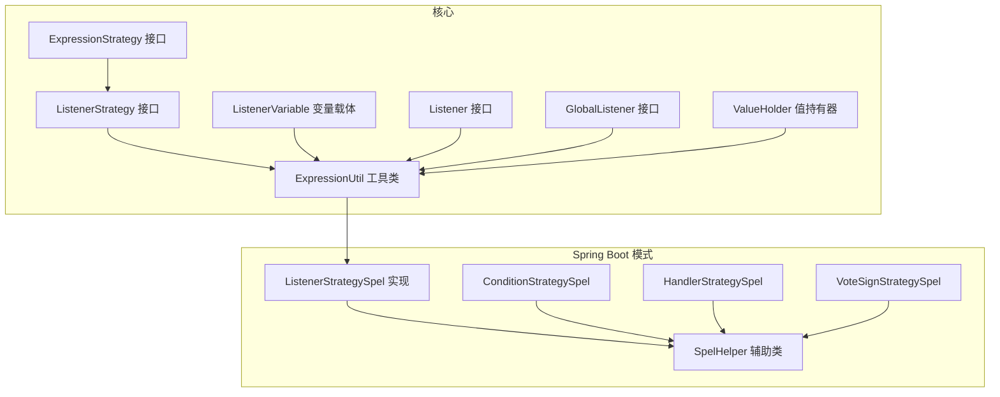
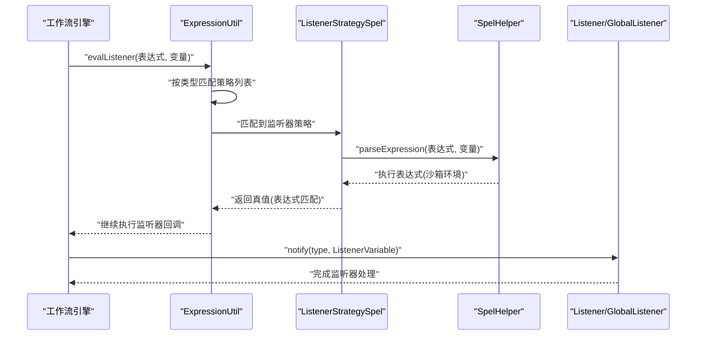
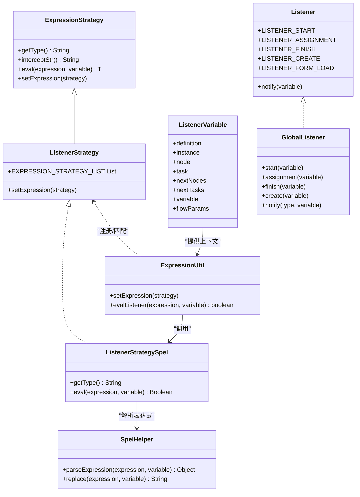

# 监听器策略

<cite>
**本文引用的文件**
- [ListenerStrategy.java](file://warm-flow-core/src/main/java/org/dromara/warm/flow/core/strategy/ListenerStrategy.java)
- [ExpressionStrategy.java](file://warm-flow-core/src/main/java/org/dromara/warm/flow/core/strategy/ExpressionStrategy.java)
- [ExpressionUtil.java](file://warm-flow-core/src/main/java/org/dromara/warm/flow/core/utils/ExpressionUtil.java)
- [Listener.java](file://warm-flow-core/src/main/java/org/dromara/warm/flow/core/listener/Listener.java)
- [GlobalListener.java](file://warm-flow-core/src/main/java/org/dromara/warm/flow/core/listener/GlobalListener.java)
- [ListenerVariable.java](file://warm-flow-core/src/main/java/org/dromara/warm/flow/core/listener/ListenerVariable.java)
- [ValueHolder.java](file://warm-flow-core/src/main/java/org/dromara/warm/flow/core/listener/ValueHolder.java)
- [ListenerStrategySpel.java](file://warm-flow-plugin/warm-flow-plugin-modes/warm-flow-plugin-modes-sb/src/main/java/org/dromara/warm/plugin/modes/sb/expression/ListenerStrategySpel.java)
- [SpelHelper.java](file://warm-flow-plugin/warm-flow-plugin-modes/warm-flow-plugin-modes-sb/src/main/java/org/dromara/warm/plugin/modes/sb/helper/SpelHelper.java)
- [ConditionStrategySpel.java](file://warm-flow-plugin/warm-flow-plugin-modes/warm-flow-plugin-modes-sb/src/main/java/org/dromara/warm/plugin/modes/sb/expression/ConditionStrategySpel.java)
- [HandlerStrategySpel.java](file://warm-flow-plugin/warm-flow-plugin-modes/warm-flow-plugin-modes-sb/src/main/java/org/dromara/warm/plugin/modes/sb/expression/HandlerStrategySpel.java)
- [VoteSignStrategySpel.java](file://warm-flow-plugin/warm-flow-plugin-modes/warm-flow-plugin-modes-sb/src/main/java/org/dromara/warm/plugin/modes/sb/expression/VoteSignStrategySpel.java)
</cite>

## 目录
1. [简介](#简介)
2. [项目结构](#项目结构)
3. [核心组件](#核心组件)
4. [架构总览](#架构总览)
5. [组件详解](#组件详解)
6. [依赖关系分析](#依赖关系分析)
7. [性能与执行顺序](#性能与执行顺序)
8. [故障排查指南](#故障排查指南)
9. [结论](#结论)
10. [附录](#附录)

## 简介
本文件围绕监听器策略 ListenerStrategySpel 的实现机制展开，系统性解析其在工作流生命周期中的作用方式，涵盖全局监听器与节点监听器的表达式支持、事件触发条件、变量传递、执行顺序与性能影响等关键主题。同时给出表达式在监听器中的典型应用场景与配置建议，帮助读者在流程启动、节点执行、任务完成等关键节点实现灵活可控的工作流行为。

## 项目结构
监听器策略位于核心模块与模式插件中，采用“策略接口 + 具体实现 + 工具类”的分层设计：
- 核心策略接口与工具类：定义统一的表达式策略模型、注册与调度逻辑，以及监听器表达式的入口。
- Spring Boot 模式下的 SpEL 实现：提供基于 SpEL 的监听器表达式求值能力，并通过沙箱安全机制保障运行安全。
- 监听器实体与变量载体：封装流程定义、实例、节点、任务、下一节点/任务集合、流程变量与工作流参数等上下文信息。

图表来源
- [ExpressionStrategy.java:1-61](file://warm-flow-core/src/main/java/org/dromara/warm/flow/core/strategy/ExpressionStrategy.java#L1-L61)
- [ListenerStrategy.java:1-39](file://warm-flow-core/src/main/java/org/dromara/warm/flow/core/strategy/ListenerStrategy.java#L1-L39)
- [ExpressionUtil.java:1-196](file://warm-flow-core/src/main/java/org/dromara/warm/flow/core/utils/ExpressionUtil.java#L1-L196)
- [ListenerVariable.java:1-213](file://warm-flow-core/src/main/java/org/dromara/warm/flow/core/listener/ListenerVariable.java#L1-L213)
- [Listener.java:1-59](file://warm-flow-core/src/main/java/org/dromara/warm/flow/core/listener/Listener.java#L1-L59)
- [GlobalListener.java:1-81](file://warm-flow-core/src/main/java/org/dromara/warm/flow/core/listener/GlobalListener.java#L1-L81)
- [ValueHolder.java:1-40](file://warm-flow-core/src/main/java/org/dromara/warm/flow/core/listener/ValueHolder.java#L1-L40)
- [ListenerStrategySpel.java:1-42](file://warm-flow-plugin/warm-flow-plugin-modes/warm-flow-plugin-modes-sb/src/main/java/org/dromara/warm/plugin/modes/sb/expression/ListenerStrategySpel.java#L1-L42)
- [SpelHelper.java:1-114](file://warm-flow-plugin/warm-flow-plugin-modes/warm-flow-plugin-modes-sb/src/main/java/org/dromara/warm/plugin/modes/sb/helper/SpelHelper.java#L1-L114)
- [ConditionStrategySpel.java:1-41](file://warm-flow-plugin/warm-flow-plugin-modes/warm-flow-plugin-modes-sb/src/main/java/org/dromara/warm/plugin/modes/sb/expression/ConditionStrategySpel.java#L1-L41)
- [HandlerStrategySpel.java:1-40](file://warm-flow-plugin/warm-flow-plugin-modes/warm-flow-plugin-modes-sb/src/main/java/org/dromara/warm/plugin/modes/sb/expression/HandlerStrategySpel.java#L1-L40)
- [VoteSignStrategySpel.java:1-41](file://warm-flow-plugin/warm-flow-plugin-modes/warm-flow-plugin-modes-sb/src/main/java/org/dromara/warm/plugin/modes/sb/expression/VoteSignStrategySpel.java#L1-L41)

章节来源
- [ExpressionStrategy.java:1-61](file://warm-flow-core/src/main/java/org/dromara/warm/flow/core/strategy/ExpressionStrategy.java#L1-L61)
- [ListenerStrategy.java:1-39](file://warm-flow-core/src/main/java/org/dromara/warm/flow/core/strategy/ListenerStrategy.java#L1-L39)
- [ExpressionUtil.java:1-196](file://warm-flow-core/src/main/java/org/dromara/warm/flow/core/utils/ExpressionUtil.java#L1-L196)

## 核心组件
- 表达式策略接口：统一表达式类型标识、拦截串与求值接口，支撑多策略并存与按类型匹配。
- 监听器策略接口：继承表达式策略，扩展监听器表达式集合注册能力，作为监听器表达式入口。
- 监听器变量载体：承载流程定义、实例、节点、任务、下一节点/任务集合、流程变量与工作流参数，供监听器在不同生命周期阶段获取上下文。
- 监听器接口与全局监听器接口：定义监听器事件类型（开始、分派、完成、创建、表单加载）及回调入口；全局监听器提供统一入口按类型分发。
- SpEL 监听器策略实现：以“#”为类型标识，委托 SpelHelper 进行表达式解析与执行，恒返回真值以表示表达式匹配成功。
- SpEL 辅助类：构建沙箱化的 StandardEvaluationContext，设置 Bean 解析器、变量映射、类型白名单与方法限制，确保安全执行。

章节来源
- [ListenerStrategy.java:1-39](file://warm-flow-core/src/main/java/org/dromara/warm/flow/core/strategy/ListenerStrategy.java#L1-L39)
- [ExpressionStrategy.java:1-61](file://warm-flow-core/src/main/java/org/dromara/warm/flow/core/strategy/ExpressionStrategy.java#L1-L61)
- [ListenerVariable.java:1-213](file://warm-flow-core/src/main/java/org/dromara/warm/flow/core/listener/ListenerVariable.java#L1-L213)
- [Listener.java:1-59](file://warm-flow-core/src/main/java/org/dromara/warm/flow/core/listener/Listener.java#L1-L59)
- [GlobalListener.java:1-81](file://warm-flow-core/src/main/java/org/dromara/warm/flow/core/listener/GlobalListener.java#L1-L81)
- [ListenerStrategySpel.java:1-42](file://warm-flow-plugin/warm-flow-plugin-modes/warm-flow-plugin-modes-sb/src/main/java/org/dromara/warm/plugin/modes/sb/expression/ListenerStrategySpel.java#L1-L42)
- [SpelHelper.java:1-114](file://warm-flow-plugin/warm-flow-plugin-modes/warm-flow-plugin-modes-sb/src/main/java/org/dromara/warm/plugin/modes/sb/helper/SpelHelper.java#L1-L114)

## 架构总览
监听器策略在工作流生命周期中的作用路径如下：
- 表达式工具类根据表达式前缀选择对应策略实现。
- 监听器表达式通过 ListenerStrategySpel 识别并委托 SpelHelper 执行。
- 监听器变量载体在不同事件阶段提供上下文，驱动监听器执行。
- 全局监听器与节点监听器分别在系统级与节点级响应事件，实现条件触发与动态行为控制。

图表来源
- [ExpressionUtil.java:124-133](file://warm-flow-core/src/main/java/org/dromara/warm/flow/core/utils/ExpressionUtil.java#L124-L133)
- [ListenerStrategySpel.java:30-40](file://warm-flow-plugin/warm-flow-plugin-modes/warm-flow-plugin-modes-sb/src/main/java/org/dromara/warm/plugin/modes/sb/expression/ListenerStrategySpel.java#L30-L40)
- [SpelHelper.java:64-86](file://warm-flow-plugin/warm-flow-plugin-modes/warm-flow-plugin-modes-sb/src/main/java/org/dromara/warm/plugin/modes/sb/helper/SpelHelper.java#L64-L86)
- [Listener.java:56-57](file://warm-flow-core/src/main/java/org/dromara/warm/flow/core/listener/Listener.java#L56-L57)
- [GlobalListener.java:64-79](file://warm-flow-core/src/main/java/org/dromara/warm/flow/core/listener/GlobalListener.java#L64-L79)

## 组件详解

### 监听器策略接口与工具类
- 监听器策略接口继承表达式策略，提供策略集合注册能力，便于在运行时按类型选择具体实现。
- 表达式工具类负责策略注册、按类型匹配与执行，支持倒序遍历以优先匹配后注入的策略实现，保证扩展性与可插拔性。

章节来源
- [ListenerStrategy.java:26-38](file://warm-flow-core/src/main/java/org/dromara/warm/flow/core/strategy/ListenerStrategy.java#L26-L38)
- [ExpressionStrategy.java:25-61](file://warm-flow-core/src/main/java/org/dromara/warm/flow/core/strategy/ExpressionStrategy.java#L25-L61)
- [ExpressionUtil.java:38-61](file://warm-flow-core/src/main/java/org/dromara/warm/flow/core/utils/ExpressionUtil.java#L38-L61)
- [ExpressionUtil.java:155-173](file://warm-flow-core/src/main/java/org/dromara/warm/flow/core/utils/ExpressionUtil.java#L155-L173)

### 监听器变量与事件类型
- 监听器变量载体封装流程定义、实例、节点、任务、下一节点/任务集合、流程变量与工作流参数，满足不同事件阶段的数据需求。
- 监听器事件类型包括：开始、分派、完成、创建、表单加载；全局监听器提供统一入口按类型分发。

章节来源
- [ListenerVariable.java:32-213](file://warm-flow-core/src/main/java/org/dromara/warm/flow/core/listener/ListenerVariable.java#L32-L213)
- [Listener.java:25-57](file://warm-flow-core/src/main/java/org/dromara/warm/flow/core/listener/Listener.java#L25-L57)
- [GlobalListener.java:26-79](file://warm-flow-core/src/main/java/org/dromara/warm/flow/core/listener/GlobalListener.java#L26-L79)

### SpEL 监听器策略实现
- 类型标识为“#”，用于识别监听器表达式。
- 求值过程委托 SpelHelper，表达式执行后恒返回真值，表示表达式匹配成功，从而触发后续监听器回调。
- 该设计使监听器表达式具备条件触发能力，同时保持策略实现的简洁性。

章节来源
- [ListenerStrategySpel.java:28-41](file://warm-flow-plugin/warm-flow-plugin-modes/warm-flow-plugin-modes-sb/src/main/java/org/dromara/warm/plugin/modes/sb/expression/ListenerStrategySpel.java#L28-L41)

### SpEL 辅助类与沙箱安全
- 使用 StandardEvaluationContext 构建沙箱环境，设置 BeanResolver 支持 Spring Bean 调用，设置变量映射，限制类型访问与方法调用，避免高危操作。
- 提供表达式解析入口与变量占位符替换能力，兼容“$”与“#”占位符，提升表达式书写灵活性。

章节来源
- [SpelHelper.java:41-114](file://warm-flow-plugin/warm-flow-plugin-modes/warm-flow-plugin-modes-sb/src/main/java/org/dromara/warm/plugin/modes/sb/helper/SpelHelper.java#L41-L114)

### 监听器生命周期与触发条件
- 生命周期关键节点：流程启动、节点执行、任务创建、任务分派、任务完成、表单加载。
- 触发条件：监听器表达式通过 ListenerStrategySpel 识别并求值，匹配成功即触发相应事件类型的监听器回调。
- 变量传递：监听器变量载体在不同事件阶段注入上下文，监听器可通过 ListenerVariable 获取流程与业务数据。

章节来源
- [Listener.java:27-50](file://warm-flow-core/src/main/java/org/dromara/warm/flow/core/listener/Listener.java#L27-L50)
- [GlobalListener.java:28-79](file://warm-flow-core/src/main/java/org/dromara/warm/flow/core/listener/GlobalListener.java#L28-L79)
- [ListenerVariable.java:34-196](file://warm-flow-core/src/main/java/org/dromara/warm/flow/core/listener/ListenerVariable.java#L34-L196)

### 表达式在监听器中的应用场景
- 条件触发：仅当监听器表达式求值为真时才执行监听器逻辑，实现按条件分支的动态行为。
- 动态行为控制：在监听器中调用业务 Bean 或服务方法，结合流程变量实现动态权限、路由或数据填充。
- 状态监控：在任务完成或创建等节点监听器中记录状态变更或生成通知，辅助流程审计与可视化。

章节来源
- [ExpressionUtil.java:124-133](file://warm-flow-core/src/main/java/org/dromara/warm/flow/core/utils/ExpressionUtil.java#L124-L133)
- [SpelHelper.java:64-86](file://warm-flow-plugin/warm-flow-plugin-modes/warm-flow-plugin-modes-sb/src/main/java/org/dromara/warm/plugin/modes/sb/helper/SpelHelper.java#L64-L86)

### 配置示例与最佳实践
以下示例展示如何在监听器表达式中使用 SpEL 语法与变量传递，实现灵活的工作流控制。请根据实际业务调整表达式与监听器类型。

- 在流程启动时触发监听器，判断流程变量是否满足条件，满足则执行业务逻辑。
- 在任务创建时触发监听器，动态设置下一处理人或生成子任务。
- 在任务完成时触发监听器，根据流程变量决定是否进入下一节点或回退。

章节来源
- [ExpressionUtil.java:124-133](file://warm-flow-core/src/main/java/org/dromara/warm/flow/core/utils/ExpressionUtil.java#L124-L133)
- [ListenerStrategySpel.java:30-40](file://warm-flow-plugin/warm-flow-plugin-modes/warm-flow-plugin-modes-sb/src/main/java/org/dromara/warm/plugin/modes/sb/expression/ListenerStrategySpel.java#L30-L40)
- [SpelHelper.java:64-86](file://warm-flow-plugin/warm-flow-plugin-modes/warm-flow-plugin-modes-sb/src/main/java/org/dromara/warm/plugin/modes/sb/helper/SpelHelper.java#L64-L86)

## 依赖关系分析
- 监听器策略依赖表达式策略接口与表达式工具类，形成策略注册与调度链路。
- SpEL 监听器策略依赖 SpelHelper，后者提供沙箱化表达式解析能力。
- 监听器变量载体贯穿监听器生命周期，为不同事件阶段提供上下文数据。
- 其他策略（条件、办理人、会签）与监听器策略共享同一表达式框架，体现统一的策略模型与扩展机制。

图表来源
- [ExpressionStrategy.java:25-61](file://warm-flow-core/src/main/java/org/dromara/warm/flow/core/strategy/ExpressionStrategy.java#L25-L61)
- [ListenerStrategy.java:26-38](file://warm-flow-core/src/main/java/org/dromara/warm/flow/core/strategy/ListenerStrategy.java#L26-L38)
- [ExpressionUtil.java:59-61](file://warm-flow-core/src/main/java/org/dromara/warm/flow/core/utils/ExpressionUtil.java#L59-L61)
- [ListenerStrategySpel.java:28-41](file://warm-flow-plugin/warm-flow-plugin-modes/warm-flow-plugin-modes-sb/src/main/java/org/dromara/warm/plugin/modes/sb/expression/ListenerStrategySpel.java#L28-L41)
- [SpelHelper.java:41-114](file://warm-flow-plugin/warm-flow-plugin-modes/warm-flow-plugin-modes-sb/src/main/java/org/dromara/warm/plugin/modes/sb/helper/SpelHelper.java#L41-L114)
- [ListenerVariable.java:32-213](file://warm-flow-core/src/main/java/org/dromara/warm/flow/core/listener/ListenerVariable.java#L32-L213)
- [Listener.java:25-57](file://warm-flow-core/src/main/java/org/dromara/warm/flow/core/listener/Listener.java#L25-L57)
- [GlobalListener.java:26-79](file://warm-flow-core/src/main/java/org/dromara/warm/flow/core/listener/GlobalListener.java#L26-L79)

## 性能与执行顺序
- 策略匹配顺序：表达式工具类采用倒序遍历策略列表，优先匹配后注入的策略实现，有利于扩展新策略而不破坏现有逻辑。
- 监听器表达式求值：SpEL 表达式在沙箱环境中解析，具备一定开销；建议在表达式中避免复杂计算与频繁外部调用。
- 变量传递与上下文：监听器变量载体在不同事件阶段提供上下文，避免重复查询数据库，提高执行效率。
- 执行顺序：全局监听器与节点监听器按事件类型依次触发，监听器内部应避免阻塞操作，必要时采用异步处理。

章节来源
- [ExpressionUtil.java:155-173](file://warm-flow-core/src/main/java/org/dromara/warm/flow/core/utils/ExpressionUtil.java#L155-L173)
- [SpelHelper.java:64-86](file://warm-flow-plugin/warm-flow-plugin-modes/warm-flow-plugin-modes-sb/src/main/java/org/dromara/warm/plugin/modes/sb/helper/SpelHelper.java#L64-L86)
- [ListenerVariable.java:34-196](file://warm-flow-core/src/main/java/org/dromara/warm/flow/core/listener/ListenerVariable.java#L34-L196)

## 故障排查指南
- 空策略异常：若未正确注册监听器策略，表达式工具类在匹配时可能抛出空策略异常，需检查策略注册流程。
- Spring 环境缺失：SpelHelper 依赖 ApplicationContext 与 BeanFactory，若不在 Spring 环境中使用，将抛出相关异常提示。
- 表达式语法错误：SpEL 表达式语法不合法会导致解析失败，需检查表达式格式与变量命名。
- 变量未生效：确认监听器变量载体在对应事件阶段已正确注入变量与上下文，避免监听器无法获取所需数据。

章节来源
- [ExpressionUtil.java:155-173](file://warm-flow-core/src/main/java/org/dromara/warm/flow/core/utils/ExpressionUtil.java#L155-L173)
- [SpelHelper.java:89-101](file://warm-flow-plugin/warm-flow-plugin-modes/warm-flow-plugin-modes-sb/src/main/java/org/dromara/warm/plugin/modes/sb/helper/SpelHelper.java#L89-L101)

## 结论
ListenerStrategySpel 通过统一的表达式策略模型与沙箱化的 SpEL 执行环境，为监听器提供了灵活、可扩展的条件触发与动态行为控制能力。配合监听器变量载体与事件类型体系，可在流程启动、节点执行、任务创建/分派/完成等关键节点实现精细化控制。建议在保证安全性的前提下，合理组织表达式逻辑，优化执行顺序与性能，以获得更稳定高效的工作流体验。

## 附录
- 相关策略对比参考：
  - 条件策略：基于 FlowCons.SPEL 类型标识，适用于节点流转条件判断。
  - 办理人策略：以“#”为类型标识，支持预求值与权限转换。
  - 会签策略：同样基于 FlowCons.SPEL 类型标识，用于会签场景的条件判断。

章节来源
- [ConditionStrategySpel.java:29-40](file://warm-flow-plugin/warm-flow-plugin-modes/warm-flow-plugin-modes-sb/src/main/java/org/dromara/warm/plugin/modes/sb/expression/ConditionStrategySpel.java#L29-L40)
- [HandlerStrategySpel.java:28-39](file://warm-flow-plugin/warm-flow-plugin-modes/warm-flow-plugin-modes-sb/src/main/java/org/dromara/warm/plugin/modes/sb/expression/HandlerStrategySpel.java#L28-L39)
- [VoteSignStrategySpel.java:29-40](file://warm-flow-plugin/warm-flow-plugin-modes/warm-flow-plugin-modes-sb/src/main/java/org/dromara/warm/plugin/modes/sb/expression/VoteSignStrategySpel.java#L29-L40)