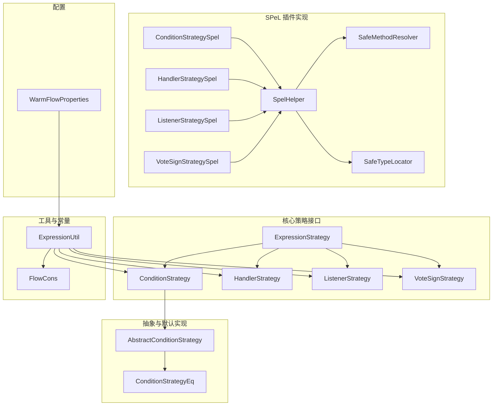
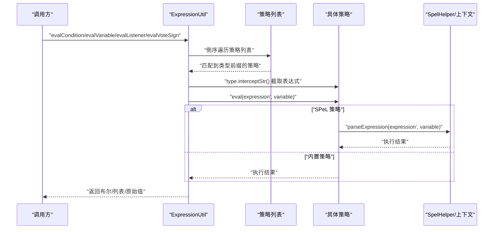
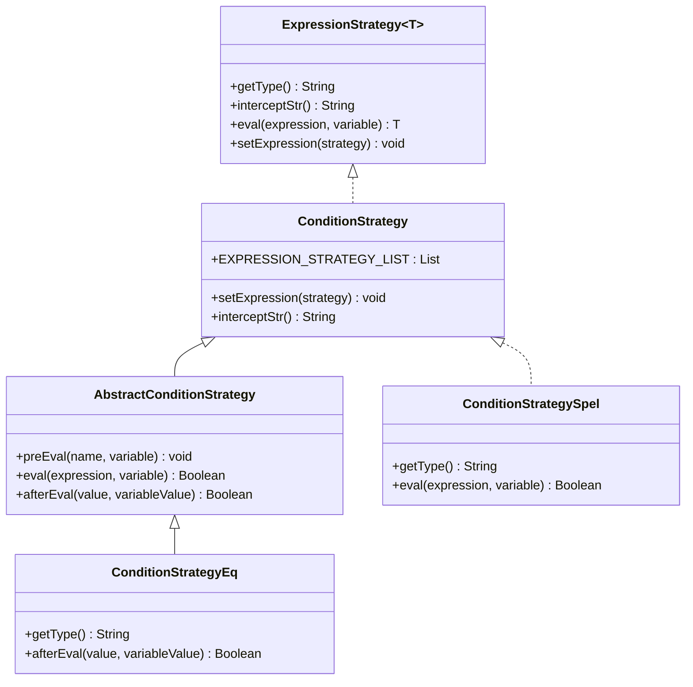
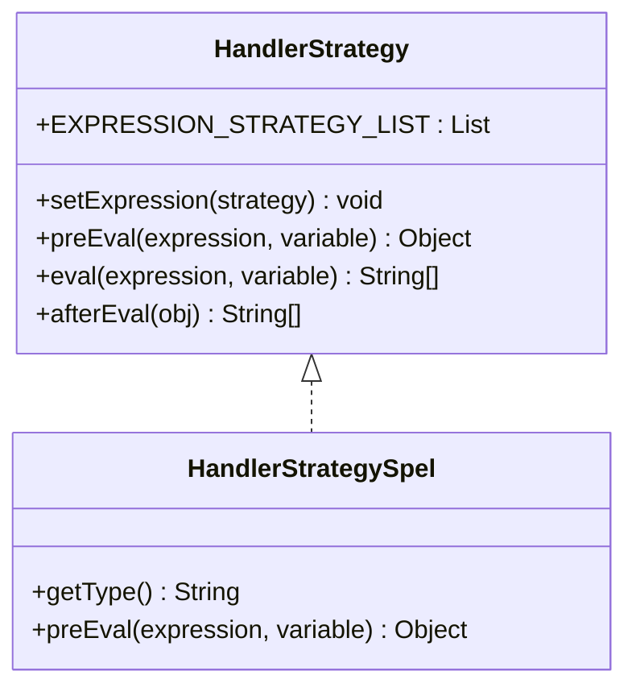
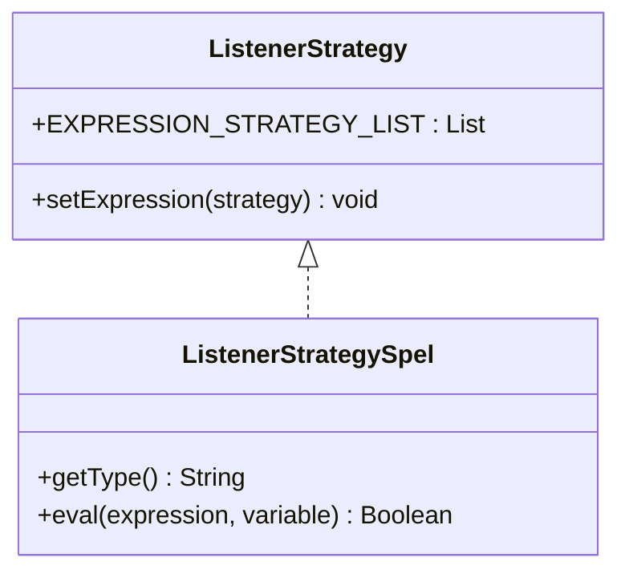
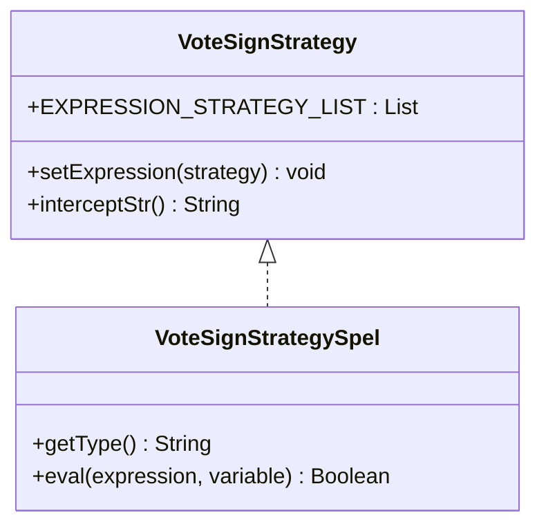
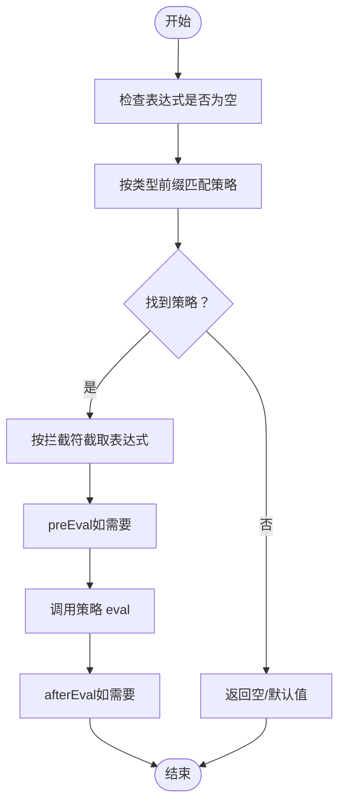
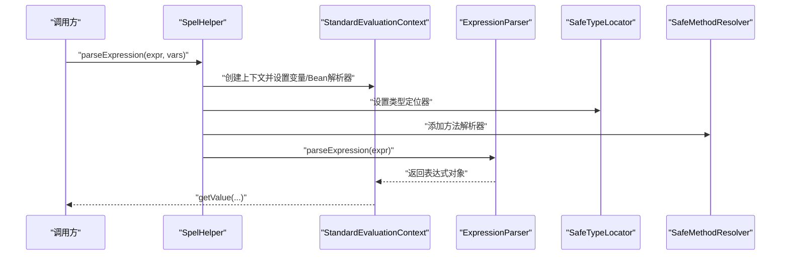
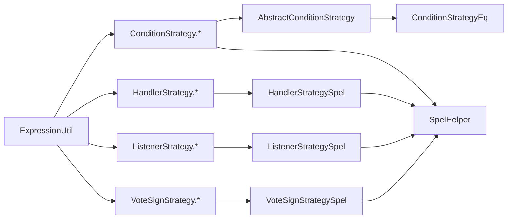

# 表达式插件

<cite>
**本文引用的文件**
- [ExpressionStrategy.java](file://warm-flow-core/src/main/java/org/dromara/warm/flow/core/strategy/ExpressionStrategy.java)
- [ConditionStrategy.java](file://warm-flow-core/src/main/java/org/dromara/warm/flow/core/strategy/ConditionStrategy.java)
- [HandlerStrategy.java](file://warm-flow-core/src/main/java/org/dromara/warm/flow/core/strategy/HandlerStrategy.java)
- [ListenerStrategy.java](file://warm-flow-core/src/main/java/org/dromara/warm/flow/core/strategy/ListenerStrategy.java)
- [VoteSignStrategy.java](file://warm-flow-core/src/main/java/org/dromara/warm/flow/core/strategy/VoteSignStrategy.java)
- [AbstractConditionStrategy.java](file://warm-flow-core/src/main/java/org/dromara/warm/flow/core/condition/AbstractConditionStrategy.java)
- [ConditionStrategyEq.java](file://warm-flow-core/src/main/java/org/dromara/warm/flow/core/condition/ConditionStrategyEq.java)
- [ExpressionUtil.java](file://warm-flow-core/src/main/java/org/dromara/warm/flow/core/utils/ExpressionUtil.java)
- [FlowCons.java](file://warm-flow-core/src/main/java/org/dromara/warm/flow/core/constant/FlowCons.java)
- [ConditionStrategySpel.java](file://warm-flow-plugin/warm-flow-plugin-modes/warm-flow-plugin-modes-sb/src/main/java/org/dromara/warm/plugin/modes/sb/expression/ConditionStrategySpel.java)
- [HandlerStrategySpel.java](file://warm-flow-plugin/warm-flow-plugin-modes/warm-flow-plugin-modes-sb/src/main/java/org/dromara/warm/plugin/modes/sb/expression/HandlerStrategySpel.java)
- [ListenerStrategySpel.java](file://warm-flow-plugin/warm-flow-plugin-modes/warm-flow-plugin-modes-sb/src/main/java/org/dromara/warm/plugin/modes/sb/expression/ListenerStrategySpel.java)
- [VoteSignStrategySpel.java](file://warm-flow-plugin/warm-flow-plugin-modes/warm-flow-plugin-modes-sb/src/main/java/org/dromara/warm/plugin/modes/sb/expression/VoteSignStrategySpel.java)
- [SpelHelper.java](file://warm-flow-plugin/warm-flow-plugin-modes/warm-flow-plugin-modes-sb/src/main/java/org/dromara/warm/plugin/modes/sb/helper/SpelHelper.java)
- [SafeMethodResolver.java](file://warm-flow-plugin/warm-flow-plugin-modes/warm-flow-plugin-modes-sb/src/main/java/org/dromara/warm/plugin/modes/sb/helper/SafeMethodResolver.java)
- [SafeTypeLocator.java](file://warm-flow-plugin/warm-flow-plugin-modes/warm-flow-plugin-modes-sb/src/main/java/org/dromara/warm/plugin/modes/sb/helper/SafeTypeLocator.java)
- [WarmFlowProperties.java](file://warm-flow-plugin/warm-flow-plugin-modes/warm-flow-plugin-modes-sb/src/main/java/org/dromara/warm/plugin/modes/sb/config/WarmFlowProperties.java)
</cite>

## 目录
1. [简介](#简介)
2. [项目结构](#项目结构)
3. [核心组件](#核心组件)
4. [架构总览](#架构总览)
5. [组件详解](#组件详解)
6. [依赖关系分析](#依赖关系分析)
7. [性能与安全](#性能与安全)
8. [故障排查指南](#故障排查指南)
9. [结论](#结论)
10. [附录](#附录)

## 简介
本技术文档聚焦于 Warm-Flow 表达式插件系统，系统基于策略模式对表达式进行统一抽象与扩展，当前通过内置的条件判断策略、处理器策略、监听器策略与投票签名策略，结合 SPeL（Spring Expression Language）表达式引擎，提供灵活、安全、可扩展的工作流表达式能力。文档将从架构设计、关键流程、安全机制、性能优化与使用示例等方面进行深入解析。

## 项目结构
围绕表达式插件的关键模块分布如下：
- 核心策略接口层：定义表达式策略的统一接口与分类接口（条件、处理器、监听器、投票签名）。
- 抽象与默认实现：提供通用的条件表达式抽象类与默认处理器策略。
- 工具与常量：表达式解析工具、分隔符与常量定义。
- SPeL 插件实现：SPeL 表达式策略与安全执行辅助类。
- 配置属性：Spring Boot 属性配置桥接类。

**图示来源**
- [ExpressionStrategy.java:25-60](file://warm-flow-core/src/main/java/org/dromara/warm/flow/core/strategy/ExpressionStrategy.java#L25-L60)
- [ConditionStrategy.java:28-44](file://warm-flow-core/src/main/java/org/dromara/warm/flow/core/strategy/ConditionStrategy.java#L28-L44)
- [HandlerStrategy.java:29-60](file://warm-flow-core/src/main/java/org/dromara/warm/flow/core/strategy/HandlerStrategy.java#L29-L60)
- [ListenerStrategy.java:26-38](file://warm-flow-core/src/main/java/org/dromara/warm/flow/core/strategy/ListenerStrategy.java#L26-L38)
- [VoteSignStrategy.java:28-44](file://warm-flow-core/src/main/java/org/dromara/warm/flow/core/strategy/VoteSignStrategy.java#L28-L44)
- [AbstractConditionStrategy.java:31-70](file://warm-flow-core/src/main/java/org/dromara/warm/flow/core/condition/AbstractConditionStrategy.java#L31-L70)
- [ConditionStrategyEq.java:26-42](file://warm-flow-core/src/main/java/org/dromara/warm/flow/core/condition/ConditionStrategyEq.java#L26-L42)
- [ExpressionUtil.java:36-195](file://warm-flow-core/src/main/java/org/dromara/warm/flow/core/utils/ExpressionUtil.java#L36-L195)
- [FlowCons.java:25-84](file://warm-flow-core/src/main/java/org/dromara/warm/flow/core/constant/FlowCons.java#L25-L84)
- [ConditionStrategySpel.java:29-39](file://warm-flow-plugin/warm-flow-plugin-modes/warm-flow-plugin-modes-sb/src/main/java/org/dromara/warm/plugin/modes/sb/expression/ConditionStrategySpel.java#L29-L39)
- [HandlerStrategySpel.java:28-38](file://warm-flow-plugin/warm-flow-plugin-modes/warm-flow-plugin-modes-sb/src/main/java/org/dromara/warm/plugin/modes/sb/expression/HandlerStrategySpel.java#L28-L38)
- [ListenerStrategySpel.java:28-40](file://warm-flow-plugin/warm-flow-plugin-modes/warm-flow-plugin-modes-sb/src/main/java/org/dromara/warm/plugin/modes/sb/expression/ListenerStrategySpel.java#L28-L40)
- [VoteSignStrategySpel.java:29-39](file://warm-flow-plugin/warm-flow-plugin-modes/warm-flow-plugin-modes-sb/src/main/java/org/dromara/warm/plugin/modes/sb/expression/VoteSignStrategySpel.java#L29-L39)
- [SpelHelper.java:41-111](file://warm-flow-plugin/warm-flow-plugin-modes/warm-flow-plugin-modes-sb/src/main/java/org/dromara/warm/plugin/modes/sb/helper/SpelHelper.java#L41-L111)
- [SafeMethodResolver.java:23-52](file://warm-flow-plugin/warm-flow-plugin-modes/warm-flow-plugin-modes-sb/src/main/java/org/dromara/warm/plugin/modes/sb/helper/SafeMethodResolver.java#L23-L52)
- [SafeTypeLocator.java:41-109](file://warm-flow-plugin/warm-flow-plugin-modes/warm-flow-plugin-modes-sb/src/main/java/org/dromara/warm/plugin/modes/sb/helper/SafeTypeLocator.java#L41-L109)
- [WarmFlowProperties.java:24-26](file://warm-flow-plugin/warm-flow-plugin-modes/warm-flow-plugin-modes-sb/src/main/java/org/dromara/warm/plugin/modes/sb/config/WarmFlowProperties.java#L24-L26)

**章节来源**
- [ExpressionStrategy.java:25-60](file://warm-flow-core/src/main/java/org/dromara/warm/flow/core/strategy/ExpressionStrategy.java#L25-L60)
- [ExpressionUtil.java:36-195](file://warm-flow-core/src/main/java/org/dromara/warm/flow/core/utils/ExpressionUtil.java#L36-L195)
- [FlowCons.java:25-84](file://warm-flow-core/src/main/java/org/dromara/warm/flow/core/constant/FlowCons.java#L25-L84)

## 核心组件
- 表达式策略接口族
  - ExpressionStrategy<T>：统一的表达式策略接口，定义类型标识、拦截字符串与执行方法。
  - ConditionStrategy：条件表达式策略，继承 ExpressionStrategy<Boolean>，维护条件策略列表并提供默认拦截符。
  - HandlerStrategy：处理器（任务经办人）表达式策略，继承 ExpressionStrategy<List<String>>，提供 preEval 与 afterEval 的扩展点。
  - ListenerStrategy：监听器表达式策略，继承 ExpressionStrategy<Boolean>，维护监听器策略列表。
  - VoteSignStrategy：投票/会签表达式策略，继承 ExpressionStrategy<Boolean>，维护投票策略列表并提供默认拦截符。
- 抽象与默认实现
  - AbstractConditionStrategy：条件表达式抽象基类，提供前置校验与解析模板逻辑。
  - ConditionStrategyEq：内置“等于”条件策略，支持数值与字符串比较。
- 工具与常量
  - ExpressionUtil：表达式解析入口，负责策略注册、按类型匹配与执行。
  - FlowCons：表达式分隔符、关键字与常量定义。
- SPeL 插件实现
  - ConditionStrategySpel、HandlerStrategySpel、ListenerStrategySpel、VoteSignStrategySpel：基于 SPeL 的策略实现。
  - SpelHelper：SPeL 解析器与安全上下文封装，提供 Bean 解析、变量注入、类型与方法安全限制。
  - SafeMethodResolver、SafeTypeLocator：方法与类型白名单/黑名单的安全限制。

**章节来源**
- [ConditionStrategy.java:28-44](file://warm-flow-core/src/main/java/org/dromara/warm/flow/core/strategy/ConditionStrategy.java#L28-L44)
- [HandlerStrategy.java:29-60](file://warm-flow-core/src/main/java/org/dromara/warm/flow/core/strategy/HandlerStrategy.java#L29-L60)
- [ListenerStrategy.java:26-38](file://warm-flow-core/src/main/java/org/dromara/warm/flow/core/strategy/ListenerStrategy.java#L26-L38)
- [VoteSignStrategy.java:28-44](file://warm-flow-core/src/main/java/org/dromara/warm/flow/core/strategy/VoteSignStrategy.java#L28-L44)
- [AbstractConditionStrategy.java:31-70](file://warm-flow-core/src/main/java/org/dromara/warm/flow/core/condition/AbstractConditionStrategy.java#L31-L70)
- [ConditionStrategyEq.java:26-42](file://warm-flow-core/src/main/java/org/dromara/warm/flow/core/condition/ConditionStrategyEq.java#L26-L42)
- [ExpressionUtil.java:36-195](file://warm-flow-core/src/main/java/org/dromara/warm/flow/core/utils/ExpressionUtil.java#L36-L195)
- [FlowCons.java:25-84](file://warm-flow-core/src/main/java/org/dromara/warm/flow/core/constant/FlowCons.java#L25-L84)
- [ConditionStrategySpel.java:29-39](file://warm-flow-plugin/warm-flow-plugin-modes/warm-flow-plugin-modes-sb/src/main/java/org/dromara/warm/plugin/modes/sb/expression/ConditionStrategySpel.java#L29-L39)
- [HandlerStrategySpel.java:28-38](file://warm-flow-plugin/warm-flow-plugin-modes/warm-flow-plugin-modes-sb/src/main/java/org/dromara/warm/plugin/modes/sb/expression/HandlerStrategySpel.java#L28-L38)
- [ListenerStrategySpel.java:28-40](file://warm-flow-plugin/warm-flow-plugin-modes/warm-flow-plugin-modes-sb/src/main/java/org/dromara/warm/plugin/modes/sb/expression/ListenerStrategySpel.java#L28-L40)
- [VoteSignStrategySpel.java:29-39](file://warm-flow-plugin/warm-flow-plugin-modes/warm-flow-plugin-modes-sb/src/main/java/org/dromara/warm/plugin/modes/sb/expression/VoteSignStrategySpel.java#L29-L39)
- [SpelHelper.java:41-111](file://warm-flow-plugin/warm-flow-plugin-modes/warm-flow-plugin-modes-sb/src/main/java/org/dromara/warm/plugin/modes/sb/helper/SpelHelper.java#L41-L111)
- [SafeMethodResolver.java:23-52](file://warm-flow-plugin/warm-flow-plugin-modes/warm-flow-plugin-modes-sb/src/main/java/org/dromara/warm/plugin/modes/sb/helper/SafeMethodResolver.java#L23-L52)
- [SafeTypeLocator.java:41-109](file://warm-flow-plugin/warm-flow-plugin-modes/warm-flow-plugin-modes-sb/src/main/java/org/dromara/warm/plugin/modes/sb/helper/SafeTypeLocator.java#L41-L109)

## 架构总览
表达式插件采用“策略注册 + 类型匹配 + 执行”的统一架构：
- 策略注册：在静态初始化块中注册内置策略；也可通过 setExpression 注入自定义策略。
- 类型匹配：根据表达式前缀（如“eq@@”、“spel@@”、“#”等）选择对应策略。
- 执行流程：对表达式进行必要的截取与预处理，随后调用策略的 eval 或 preEval，最终返回结果。

**图示来源**
- [ExpressionUtil.java:70-173](file://warm-flow-core/src/main/java/org/dromara/warm/flow/core/utils/ExpressionUtil.java#L70-L173)
- [SpelHelper.java:64-86](file://warm-flow-plugin/warm-flow-plugin-modes/warm-flow-plugin-modes-sb/src/main/java/org/dromara/warm/plugin/modes/sb/helper/SpelHelper.java#L64-L86)

**章节来源**
- [ExpressionUtil.java:38-61](file://warm-flow-core/src/main/java/org/dromara/warm/flow/core/utils/ExpressionUtil.java#L38-L61)
- [ExpressionUtil.java:155-173](file://warm-flow-core/src/main/java/org/dromara/warm/flow/core/utils/ExpressionUtil.java#L155-L173)

## 组件详解

### 条件判断策略（ConditionStrategy）
- 设计要点
  - 统一返回布尔值，支持多子策略（如等于、大于、小于、包含等）。
  - 默认拦截符为“@@”，用于拆分策略类型与参数。
  - 抽象基类提供前置校验与解析模板，子类仅需实现比较逻辑。
- 典型实现
  - ConditionStrategyEq：支持数值与字符串相等比较。
  - ConditionStrategySpel：基于 SPeL 的任意布尔表达式求值。
- 使用场景
  - 路由判断、分支条件、节点跳转控制等。

**图示来源**
- [ExpressionStrategy.java:25-60](file://warm-flow-core/src/main/java/org/dromara/warm/flow/core/strategy/ExpressionStrategy.java#L25-L60)
- [ConditionStrategy.java:28-44](file://warm-flow-core/src/main/java/org/dromara/warm/flow/core/strategy/ConditionStrategy.java#L28-L44)
- [AbstractConditionStrategy.java:31-70](file://warm-flow-core/src/main/java/org/dromara/warm/flow/core/condition/AbstractConditionStrategy.java#L31-L70)
- [ConditionStrategyEq.java:26-42](file://warm-flow-core/src/main/java/org/dromara/warm/flow/core/condition/ConditionStrategyEq.java#L26-L42)
- [ConditionStrategySpel.java:29-39](file://warm-flow-plugin/warm-flow-plugin-modes/warm-flow-plugin-modes-sb/src/main/java/org/dromara/warm/plugin/modes/sb/expression/ConditionStrategySpel.java#L29-L39)

**章节来源**
- [ConditionStrategy.java:28-44](file://warm-flow-core/src/main/java/org/dromara/warm/flow/core/strategy/ConditionStrategy.java#L28-L44)
- [AbstractConditionStrategy.java:55-70](file://warm-flow-core/src/main/java/org/dromara/warm/flow/core/condition/AbstractConditionStrategy.java#L55-L70)
- [ConditionStrategyEq.java:26-42](file://warm-flow-core/src/main/java/org/dromara/warm/flow/core/condition/ConditionStrategyEq.java#L26-L42)
- [ConditionStrategySpel.java:29-39](file://warm-flow-plugin/warm-flow-plugin-modes/warm-flow-plugin-modes-sb/src/main/java/org/dromara/warm/plugin/modes/sb/expression/ConditionStrategySpel.java#L29-L39)

### 处理器策略（HandlerStrategy）
- 设计要点
  - 返回值为用户 ID 列表，支持数组、集合与单值的统一转换。
  - 提供 preEval 与 afterEval 的扩展点，便于 SPeL 等复杂表达式的中间态处理。
  - 默认策略为“默认处理器”，用于兜底或简单变量替换。
- 典型实现
  - HandlerStrategySpel：通过 SPeL 计算并返回用户 ID 列表。
- 使用场景
  - 自动分配下一节点经办人、角色/部门到用户的转换、动态权限计算等。

**图示来源**
- [HandlerStrategy.java:29-60](file://warm-flow-core/src/main/java/org/dromara/warm/flow/core/strategy/HandlerStrategy.java#L29-L60)
- [HandlerStrategySpel.java:28-38](file://warm-flow-plugin/warm-flow-plugin-modes/warm-flow-plugin-modes-sb/src/main/java/org/dromara/warm/plugin/modes/sb/expression/HandlerStrategySpel.java#L28-L38)

**章节来源**
- [HandlerStrategy.java:44-60](file://warm-flow-core/src/main/java/org/dromara/warm/flow/core/strategy/HandlerStrategy.java#L44-L60)
- [HandlerStrategySpel.java:28-38](file://warm-flow-plugin/warm-flow-plugin-modes/warm-flow-plugin-modes-sb/src/main/java/org/dromara/warm/plugin/modes/sb/expression/HandlerStrategySpel.java#L28-L38)

### 监听器策略（ListenerStrategy）
- 设计要点
  - 返回布尔值，用于判定是否触发监听器。
  - 默认拦截符为“#”，便于与 SPeL 表达式结合。
  - 监听器策略通常不关心返回值，只要匹配即视为命中。
- 典型实现
  - ListenerStrategySpel：解析表达式并恒返回 true，确保匹配生效。

**图示来源**
- [ListenerStrategy.java:26-38](file://warm-flow-core/src/main/java/org/dromara/warm/flow/core/strategy/ListenerStrategy.java#L26-L38)
- [ListenerStrategySpel.java:28-40](file://warm-flow-plugin/warm-flow-plugin-modes/warm-flow-plugin-modes-sb/src/main/java/org/dromara/warm/plugin/modes/sb/expression/ListenerStrategySpel.java#L28-L40)

**章节来源**
- [ListenerStrategy.java:26-38](file://warm-flow-core/src/main/java/org/dromara/warm/flow/core/strategy/ListenerStrategy.java#L26-L38)
- [ListenerStrategySpel.java:28-40](file://warm-flow-plugin/warm-flow-plugin-modes/warm-flow-plugin-modes-sb/src/main/java/org/dromara/warm/plugin/modes/sb/expression/ListenerStrategySpel.java#L28-L40)

### 投票/会签策略（VoteSignStrategy）
- 设计要点
  - 返回布尔值，用于决定会签/投票是否通过。
  - 默认拦截符为“@@”，与 SPeL 结合使用。
- 典型实现
  - VoteSignStrategySpel：基于 SPeL 的布尔表达式判断。

**图示来源**
- [VoteSignStrategy.java:28-44](file://warm-flow-core/src/main/java/org/dromara/warm/flow/core/strategy/VoteSignStrategy.java#L28-L44)
- [VoteSignStrategySpel.java:29-39](file://warm-flow-plugin/warm-flow-plugin-modes/warm-flow-plugin-modes-sb/src/main/java/org/dromara/warm/plugin/modes/sb/expression/VoteSignStrategySpel.java#L29-L39)

**章节来源**
- [VoteSignStrategy.java:28-44](file://warm-flow-core/src/main/java/org/dromara/warm/flow/core/strategy/VoteSignStrategy.java#L28-L44)
- [VoteSignStrategySpel.java:29-39](file://warm-flow-plugin/warm-flow-plugin-modes/warm-flow-plugin-modes-sb/src/main/java/org/dromara/warm/plugin/modes/sb/expression/VoteSignStrategySpel.java#L29-L39)

### 表达式解析与执行流程
- 解析流程
  - ExpressionUtil.getValue：倒序遍历策略列表，按 type 前缀匹配，必要时截取表达式，再调用策略 eval。
  - 对于处理器策略，afterEval 统一将返回值转换为字符串列表。
- 执行流程（以 SPeL 为例）
  - SpelHelper.parseExpression：构建标准评估上下文，设置 Bean 解析器、变量映射、类型与方法安全限制，最终解析表达式。

**图示来源**
- [ExpressionUtil.java:155-173](file://warm-flow-core/src/main/java/org/dromara/warm/flow/core/utils/ExpressionUtil.java#L155-L173)
- [HandlerStrategy.java:48-59](file://warm-flow-core/src/main/java/org/dromara/warm/flow/core/strategy/HandlerStrategy.java#L48-L59)

**章节来源**
- [ExpressionUtil.java:70-173](file://warm-flow-core/src/main/java/org/dromara/warm/flow/core/utils/ExpressionUtil.java#L70-L173)
- [HandlerStrategy.java:44-59](file://warm-flow-core/src/main/java/org/dromara/warm/flow/core/strategy/HandlerStrategy.java#L44-L59)

### SPeL 表达式支持与安全机制
- SPeL 执行链路
  - SpelHelper.parseExpression：创建 StandardEvaluationContext，注入变量与 Bean 解析器，设置安全的类型定位器与方法解析器，解析表达式。
  - SafeTypeLocator：白名单 + 黑名单机制，限制危险类与未授权类访问。
  - SafeMethodResolver：禁止危险方法调用，如 Runtime、System、反射相关 API。
- 变量绑定与语法
  - 变量通过 StandardEvaluationContext.setVariables 注入。
  - 支持 Spring Bean 引用（@beanName）与 SpEL 模板语法。
  - 表达式中的“$”会被替换为“#”，以适配变量占位符。

**图示来源**
- [SpelHelper.java:64-86](file://warm-flow-plugin/warm-flow-plugin-modes/warm-flow-plugin-modes-sb/src/main/java/org/dromara/warm/plugin/modes/sb/helper/SpelHelper.java#L64-L86)
- [SafeTypeLocator.java:83-100](file://warm-flow-plugin/warm-flow-plugin-modes/warm-flow-plugin-modes-sb/src/main/java/org/dromara/warm/plugin/modes/sb/helper/SafeTypeLocator.java#L83-L100)
- [SafeMethodResolver.java:42-51](file://warm-flow-plugin/warm-flow-plugin-modes/warm-flow-plugin-modes-sb/src/main/java/org/dromara/warm/plugin/modes/sb/helper/SafeMethodResolver.java#L42-L51)

**章节来源**
- [SpelHelper.java:64-111](file://warm-flow-plugin/warm-flow-plugin-modes/warm-flow-plugin-modes-sb/src/main/java/org/dromara/warm/plugin/modes/sb/helper/SpelHelper.java#L64-L111)
- [SafeTypeLocator.java:41-109](file://warm-flow-plugin/warm-flow-plugin-modes/warm-flow-plugin-modes-sb/src/main/java/org/dromara/warm/plugin/modes/sb/helper/SafeTypeLocator.java#L41-L109)
- [SafeMethodResolver.java:23-52](file://warm-flow-plugin/warm-flow-plugin-modes/warm-flow-plugin-modes-sb/src/main/java/org/dromara/warm/plugin/modes/sb/helper/SafeMethodResolver.java#L23-L52)

### 配置与集成
- WarmFlowProperties：继承 WarmFlow 配置基类，通过 Spring Boot 配置前缀“warm-flow”暴露属性。
- 策略注册：ExpressionUtil 在静态块中注册内置策略；可通过 setExpression 注入自定义策略，实现按需扩展。

**章节来源**
- [WarmFlowProperties.java:24-26](file://warm-flow-plugin/warm-flow-plugin-modes/warm-flow-plugin-modes-sb/src/main/java/org/dromara/warm/plugin/modes/sb/config/WarmFlowProperties.java#L24-L26)
- [ExpressionUtil.java:38-61](file://warm-flow-core/src/main/java/org/dromara/warm/flow/core/utils/ExpressionUtil.java#L38-L61)

## 依赖关系分析
- 接口耦合
  - 所有策略均实现 ExpressionStrategy<T>，降低调用方与实现的耦合度。
  - ConditionStrategy、HandlerStrategy、ListenerStrategy、VoteSignStrategy 作为分类接口，增强语义清晰度。
- 实现依赖
  - SPeL 策略依赖 SpelHelper 进行安全解析。
  - 抽象条件策略依赖 FlowCons 中的分隔符与异常常量。
- 工具依赖
  - ExpressionUtil 依赖各策略列表与 FlowCons 常量，承担策略分发职责。

**图示来源**
- [ExpressionUtil.java:38-61](file://warm-flow-core/src/main/java/org/dromara/warm/flow/core/utils/ExpressionUtil.java#L38-L61)
- [AbstractConditionStrategy.java:31-70](file://warm-flow-core/src/main/java/org/dromara/warm/flow/core/condition/AbstractConditionStrategy.java#L31-L70)
- [ConditionStrategyEq.java:26-42](file://warm-flow-core/src/main/java/org/dromara/warm/flow/core/condition/ConditionStrategyEq.java#L26-L42)
- [HandlerStrategySpel.java:28-38](file://warm-flow-plugin/warm-flow-plugin-modes/warm-flow-plugin-modes-sb/src/main/java/org/dromara/warm/plugin/modes/sb/expression/HandlerStrategySpel.java#L28-L38)
- [ListenerStrategySpel.java:28-40](file://warm-flow-plugin/warm-flow-plugin-modes/warm-flow-plugin-modes-sb/src/main/java/org/dromara/warm/plugin/modes/sb/expression/ListenerStrategySpel.java#L28-L40)
- [VoteSignStrategySpel.java:29-39](file://warm-flow-plugin/warm-flow-plugin-modes/warm-flow-plugin-modes-sb/src/main/java/org/dromara/warm/plugin/modes/sb/expression/VoteSignStrategySpel.java#L29-L39)
- [SpelHelper.java:41-111](file://warm-flow-plugin/warm-flow-plugin-modes/warm-flow-plugin-modes-sb/src/main/java/org/dromara/warm/plugin/modes/sb/helper/SpelHelper.java#L41-L111)

**章节来源**
- [ExpressionUtil.java:38-61](file://warm-flow-core/src/main/java/org/dromara/warm/flow/core/utils/ExpressionUtil.java#L38-L61)

## 性能与安全
- 性能优化
  - 策略列表倒序遍历：优先匹配后注册的策略，减少不必要的匹配开销。
  - SPeL 上下文复用：在单次解析中复用 StandardEvaluationContext，避免重复创建。
  - 类型与方法白名单：通过 SafeTypeLocator 与 SafeMethodResolver 快速拒绝危险/昂贵操作，降低运行时风险。
- 安全机制
  - 类型限制：仅允许白名单类，禁止访问 Runtime、System、反射包等高危类。
  - 方法限制：禁止执行危险方法，如 exec、forName、getField 等。
  - 变量隔离：通过 StandardEvaluationContext.setVariables 注入受控变量，避免全局污染。

**章节来源**
- [ExpressionUtil.java:155-173](file://warm-flow-core/src/main/java/org/dromara/warm/flow/core/utils/ExpressionUtil.java#L155-L173)
- [SpelHelper.java:64-86](file://warm-flow-plugin/warm-flow-plugin-modes/warm-flow-plugin-modes-sb/src/main/java/org/dromara/warm/plugin/modes/sb/helper/SpelHelper.java#L64-L86)
- [SafeTypeLocator.java:83-100](file://warm-flow-plugin/warm-flow-plugin-modes/warm-flow-plugin-modes-sb/src/main/java/org/dromara/warm/plugin/modes/sb/helper/SafeTypeLocator.java#L83-L100)
- [SafeMethodResolver.java:42-51](file://warm-flow-plugin/warm-flow-plugin-modes/warm-flow-plugin-modes-sb/src/main/java/org/dromara/warm/plugin/modes/sb/helper/SafeMethodResolver.java#L42-L51)

## 故障排查指南
- 常见问题
  - 表达式未匹配策略：检查表达式前缀与策略类型是否一致；确认 ExpressionUtil 中策略注册顺序。
  - SPeL 解析失败：检查变量键名与注入的 Map 是否一致；确认“$”占位符已被替换为“#”。
  - 安全限制导致执行失败：检查类型/方法是否在白名单/黑名单中；必要时扩展 SafeTypeLocator/SafeMethodResolver。
- 定位步骤
  - 在 ExpressionUtil.getValue 中断点，观察策略列表与匹配结果。
  - 在 SpelHelper.parseExpression 中断点，检查上下文变量与安全限制。
  - 查看 FlowCons 中的分隔符与关键字是否符合预期。

**章节来源**
- [ExpressionUtil.java:155-173](file://warm-flow-core/src/main/java/org/dromara/warm/flow/core/utils/ExpressionUtil.java#L155-L173)
- [SpelHelper.java:103-111](file://warm-flow-plugin/warm-flow-plugin-modes/warm-flow-plugin-modes-sb/src/main/java/org/dromara/warm/plugin/modes/sb/helper/SpelHelper.java#L103-L111)
- [FlowCons.java:25-84](file://warm-flow-core/src/main/java/org/dromara/warm/flow/core/constant/FlowCons.java#L25-L84)

## 结论
Warm-Flow 表达式插件系统通过策略接口与 SPeL 执行引擎，提供了灵活、安全、可扩展的工作流表达式能力。其核心优势在于：
- 统一的策略接口与分发机制，便于扩展与维护。
- SPeL 的强大表达式能力与完善的沙箱安全机制，兼顾灵活性与安全性。
- 明确的使用场景与配置方式，便于在工作流中落地应用。

## 附录
- 使用场景与配置建议
  - 条件判断：优先使用内置策略（如“eq@@”），复杂场景引入 SPeL 策略。
  - 处理器策略：优先使用 SPeL 策略进行动态用户计算，配合权限处理器进行角色/部门到用户的转换。
  - 监听器策略：使用 SPeL 表达式触发监听器，注意恒返回 true 的匹配行为。
  - 投票/会签策略：使用 SPeL 布尔表达式控制通过条件。
- 语法与变量绑定
  - 分隔符：条件与投票使用“@@”，监听器使用“#”。
  - 变量占位符：表达式中的“$key”会被替换为“#key”，以便与 SPeL 占位符兼容。
  - Bean 引用：通过“@beanName”访问 Spring Bean。

**章节来源**
- [FlowCons.java:25-84](file://warm-flow-core/src/main/java/org/dromara/warm/flow/core/constant/FlowCons.java#L25-L84)
- [SpelHelper.java:103-111](file://warm-flow-plugin/warm-flow-plugin-modes/warm-flow-plugin-modes-sb/src/main/java/org/dromara/warm/plugin/modes/sb/helper/SpelHelper.java#L103-L111)
- [ExpressionUtil.java:115-122](file://warm-flow-core/src/main/java/org/dromara/warm/flow/core/utils/ExpressionUtil.java#L115-L122)